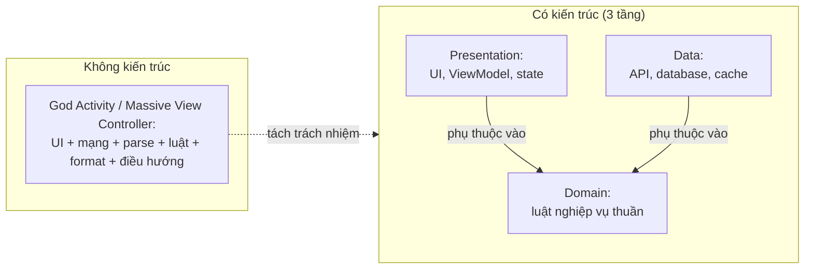

# Vì sao cần kiến trúc app mobile?

> **Tác giả:** Mr.Rom\
> **Phiên bản:** v1.0.0\
> **Tạo lúc:** 13/06/2026\
> **Cập nhật:** 13/06/2026\
> **Level:** Basic\
> **Tags:** mobile, architecture, separation-of-concerns, single-responsibility, layered-architecture, presentation-domain-data, testability, god-class, massive-view-controller\
> **Yêu cầu trước:** (không bắt buộc — nên đã làm 1 app cơ bản)

> 🎯 *Đây là bài **mở đầu** cả cụm kiến trúc app mobile. Trước khi học pattern cụ thể (MVVM, Clean Architecture...), bạn cần hiểu một câu hỏi gốc: **vì sao** app mobile lại cần "kiến trúc" cho mệt — code chạy được là xong rồi mà? Bài này trả lời bằng chính nỗi đau bạn sẽ gặp: file màn hình phình thành **God Activity / Massive View Controller**, khó test, khó sửa, lặp code, và vỡ vụn khi app lớn lên với nhiều người làm. Sau đó bạn sẽ hiểu hai nguyên tắc nền (**separation of concerns** + **single responsibility**), **3 tầng** Presentation / Domain / Data với ý tưởng "dependency hướng vào trong", và quan trọng không kém — biết **khi nào KHÔNG nên** kiến trúc quá đà cho app nhỏ. Cuối bài bạn sẵn sàng đi sâu vào từng pattern ở các bài kế.*

## 🎯 Sau bài này bạn sẽ

- [ ] Chỉ ra được vấn đề khi app **không có kiến trúc**: God Activity / Massive View Controller, khó test, khó sửa, lặp code
- [ ] Giải thích vì sao kiến trúc giúp: **tách concern**, **testable**, làm **song song** nhiều người, đổi UI/data **độc lập**
- [ ] Hiểu hai nguyên tắc nền: **separation of concerns** và **single responsibility** áp vào mobile
- [ ] Vẽ và đọc được **3 tầng cơ bản** Presentation / Domain / Data + ý tưởng **dependency hướng vào trong**
- [ ] Biết **cân nhắc quy mô** — khi nào kiến trúc là cần, khi nào là *over-engineering* cho app nhỏ

---

## Tình huống — file màn hình Acme phình to rồi không ai dám đụng

Bạn vừa làm xong app Acme Shop. Màn hình danh sách sản phẩm lúc đầu nhỏ xíu: gọi API, hiện ra một danh sách. Code nằm gọn trong **một** file màn hình (`ProductScreen`, `ProductActivity`, hay `ProductViewController` — tuỳ nền tảng), và mọi thứ chạy ngon.

Vài tuần sau, cùng cái file đó đã ôm đủ thứ vào bụng:

- Code **gọi mạng** tải sản phẩm từ server
- Code **parse JSON** thành object
- Code **business logic**: lọc theo giá, sắp xếp, tính tổng giỏ hàng, áp mã giảm giá
- Code **format** giá tiền `28000000` thành `"28.000.000đ"`
- Code **điều hướng** sang màn chi tiết
- Code giữ **trạng thái** loading / error
- ...và cả code **vẽ giao diện**

File chạm 900 dòng. Một bug nhỏ ở chỗ format giá khiến bạn phải cuộn qua cả đống code mạng và code vẽ UI mới tìm ra. Tệ hơn: sếp bảo "viết test cho phần áp mã giảm giá đi", và bạn phát hiện mình **không thể** — logic đó dính chặt vào màn hình, muốn gọi nó phải dựng cả giao diện lên. Rồi bạn thân vào team, hai người cùng sửa đúng cái file đó, và mỗi lần merge là một trận *conflict* (xung đột) kinh hoàng.

Đây **không** phải lỗi của riêng bạn — đây là điều xảy ra với **mọi** app không có kiến trúc rõ ràng. Câu hỏi của cả bài hôm nay rất đơn giản: **làm sao để code mobile không biến thành cục bột nhão như vậy khi app lớn lên?** Câu trả lời có một cái tên: **kiến trúc** (*architecture*).

> 📖 *Trước khi nói "kiến trúc tốt là gì", hãy gọi đúng tên con quái vật mà ta đang chống lại: cái file màn hình ôm tất cả mọi thứ.*

---

## 1️⃣ Con quái vật: God Activity / Massive View Controller

Cái file màn hình ôm tất cả ở trên có tên riêng trong giới mobile. Bên Android người ta gọi là **God Activity** (Activity "thượng đế" — biết tất, làm tất). Bên iOS gọi là **Massive View Controller** (Bộ điều khiển khổng lồ) — chơi chữ từ "MVC", vì `UIViewController` là nơi mọi thứ bị nhồi vào. Dù tên khác nhau, bản chất là **một**: một class UI duy nhất gánh **mọi** trách nhiệm của app.

🪞 **Ẩn dụ**: God Activity giống một **quán ăn chỉ có đúng một người** vừa đứng bếp, vừa chạy bàn, vừa thu ngân, vừa rửa chén, vừa lau nhà. Khi quán vắng (app nhỏ) thì ổn. Nhưng đông khách lên (app lớn), người đó **quá tải**: order nhầm, món ra chậm, tiền tính sai — và tệ nhất, **không thuê thêm người được** vì mọi việc dính chùm vào một người, không tách ra giao cho ai khác. Muốn quán chạy được, phải **chia việc** ra nhiều vị trí rõ ràng.

Pseudo-code một God Activity màn sản phẩm Acme đã "phình" — để ý mọi loại việc đều nằm chung một chỗ:

```kotlin
// ❌ GOD ACTIVITY — mọi trách nhiệm dồn vào MỘT class UI
class ProductActivity {
    val products = mutableListOf<Product>()

    fun onMoMan() {
        // 1. Gọi mạng nằm thẳng trong UI
        val response = httpClient.get("https://api.acmeshop.vn/products")

        // 2. Parse JSON cũng ở đây
        val parsed = JSONParser.parse(response.body)
        for (item in parsed) {
            products.add(Product(item["id"], item["name"], item["price"]))
        }

        // 3. Business logic (lọc + sắp xếp) cũng ở đây
        val hienThi = products
            .filter { it.price < 30_000_000 }
            .sortedBy { it.name }

        // 4. Format hiển thị cũng ở đây
        for (p in hienThi) {
            val dong = "${p.name} — ${formatGia(p.price)}"
            them1DongVaoListView(dong)   // 5. ...và vẽ UI cũng ở đây luôn
        }
    }

    // 6. Logic format dính chặt vào UI -> không test riêng được
    fun formatGia(gia: Long): String = "%,d".format(gia) + "đ"

    // 7. Điều hướng cũng nhét vào đây nốt
    fun onChonSanPham(id: Int) { moMan(ChiTietActivity(id)) }
}
```

Class này **biết quá nhiều**: biết URL API, biết format JSON, biết luật lọc giá, biết format tiền, biết vẽ list, biết điều hướng. Hệ quả không phải lý thuyết suông — nó gây ra **bốn** vấn đề rất cụ thể mà bạn sẽ va phải, ta soi từng cái ở phần sau.

> 📖 *Gọi tên con quái vật rồi, giờ liệt kê chính xác bốn vết thương nó gây ra — để thấy "khó chịu mơ hồ" thực ra là bốn vấn đề đo đếm được.*

---

## 2️⃣ Bốn vết thương của app không có kiến trúc

"Code khó bảo trì" nghe rất mơ hồ. Thực ra nó tách thành **bốn** vấn đề cụ thể, và cả bốn đều bắt nguồn từ việc trộn lẫn nhiều loại việc vào một chỗ. Đây là phần "vì sao đau" — hiểu rõ bốn cái này thì phần "kiến trúc chữa thế nào" ở sau sẽ tự sáng tỏ.

| # | Vết thương | Biểu hiện cụ thể ở God Activity |
|---|---|---|
| 1 | **Khó test** | Muốn test luật lọc giá phải dựng cả UI + mạng thật mới gọi được |
| 2 | **Khó sửa** | Sửa format tiền phải mò qua code mạng + code vẽ; dễ vô tình làm hỏng chỗ khác |
| 3 | **Lặp code** | Màn chi tiết cũng cần format tiền, parse JSON → copy-paste lại y hệt |
| 4 | **Vỡ khi nhiều người làm** | Hai người cùng sửa một file 900 dòng → merge conflict liên miên |

Soi kỹ từng vết thương:

- **Khó test.** Hàm `formatGia` ở trên là logic thuần, lẽ ra test trong một dòng. Nhưng vì nó là *method* của `ProductActivity`, muốn gọi phải khởi tạo cả Activity — kéo theo framework UI, vòng đời màn hình, thậm chí cần mạng thật để `onMoMan` chạy. Test một luật nhỏ hoá ra phải dựng nửa cái app. Kết quả thực tế: **không ai viết test**, và bug lọt lưới.

- **Khó sửa.** Muốn đổi cách format giá (thêm dấu chấm phân cách), bạn mở file 900 dòng, cuộn qua code gọi mạng, code parse, code vẽ list... mới tới chỗ cần sửa. Vì mọi thứ dính nhau, một thay đổi nhỏ dễ vô tình động vào phần khác (đổi `products` để format lại làm hỏng luôn phần lọc). Đây là *coupling* (sự dính kết) cao — chạm một chỗ, rung cả hệ thống.

- **Lặp code.** Màn chi tiết sản phẩm cũng cần parse `Product` và format giá. Vì logic đó nằm *bên trong* `ProductActivity`, màn chi tiết không tái dùng được — bạn **copy-paste** sang. Giờ luật format nằm ở hai nơi; sửa một chỗ quên chỗ kia → hai màn hiện giá khác nhau. Đây là vi phạm nguyên tắc **DRY** (*Don't Repeat Yourself* — đừng lặp lại chính mình).

- **Vỡ khi nhiều người làm.** App thật do nhiều người làm. Nếu mọi logic của một tính năng dồn vào một file, thì hai người cùng động vào tính năng đó là cùng sửa một file → **merge conflict**. Càng nhiều người, file càng "nóng", càng tắc. Không tách được file thì không **làm song song** được.

> [!NOTE]
> Bốn vết thương này không phải bốn vấn đề rời rạc — chúng cùng một gốc: **trộn nhiều loại trách nhiệm vào một chỗ**. Vì vậy chỉ cần **một** liều thuốc gốc là **tách trách nhiệm ra** — đúng thứ mà "kiến trúc" làm. Phần tiếp theo nói về liều thuốc đó.

→ Bốn vết thương cùng một gốc bệnh. Vậy liều thuốc gốc — "tách trách nhiệm" — dựa trên nguyên tắc nào? Có hai nguyên tắc nền.

---

## 3️⃣ Hai nguyên tắc nền: Separation of Concerns & Single Responsibility

Toàn bộ ngành kiến trúc phần mềm, dù nghe phức tạp tới đâu, đứng trên hai nguyên tắc đơn giản. Hiểu hai cái này là bạn nắm được "tinh thần" của mọi pattern sẽ học sau.

### Separation of Concerns (tách mối quan tâm)

**Separation of concerns** (*SoC* — tách các mối quan tâm) nghĩa là: **mỗi loại việc khác nhau đặt ở một chỗ riêng**. "Gọi mạng" là một mối quan tâm; "vẽ UI" là một mối quan tâm khác; "luật nghiệp vụ" lại là mối quan tâm thứ ba. SoC bảo: đừng trộn chúng — hãy để mỗi cái sống ở khu riêng.

🪞 **Ẩn dụ**: SoC giống cách bố trí một **căn bếp gọn gàng**. Dao thớt một ngăn, gia vị một kệ, chén bát một tủ. Khi cần dao, bạn tới đúng ngăn dao — không phải lục cả bếp. Một căn bếp mà dao, gia vị, chén bát đổ chung một đống chính là God Activity: tìm gì cũng cực, và động vào một thứ là xô đổ thứ khác.

### Single Responsibility (một trách nhiệm)

**Single Responsibility Principle** (*SRP* — nguyên tắc một trách nhiệm) là SoC nhìn ở cấp một class/module: **mỗi class chỉ nên có đúng một lý do để thay đổi**. Cách diễn đạt dễ nhớ hơn: *"một class làm một việc, và làm việc đó cho tốt"*.

Áp vào ví dụ Acme: nếu `ProductActivity` phải đổi khi **luật lọc giá** đổi, **VÀ** khi **API** đổi, **VÀ** khi **giao diện** đổi — nó đang có **ba** lý do để thay đổi, tức vi phạm SRP. Tách ra: một chỗ lo giao diện, một chỗ lo luật nghiệp vụ, một chỗ lo gọi API — mỗi chỗ chỉ có một lý do để đổi.

Đối chiếu cùng một logic Acme: kiểu God Activity (gộp) so với kiểu tách trách nhiệm (SoC + SRP):

```kotlin
// ✅ TÁCH TRÁCH NHIỆM — mỗi class một việc (SRP), mỗi loại việc một chỗ (SoC)

// 1. Lo GỌI DỮ LIỆU (tầng data) — chỉ biết lấy data, không biết UI
class ProductRepository(private val api: AcmeApi) {
    suspend fun layDanhSach(): List<Product> = api.layDanhSachSanPham()
}

// 2. Lo LUẬT NGHIỆP VỤ (tầng domain) — thuần, test được mà không cần UI/mạng
class LocSanPhamGiaRe {
    operator fun invoke(items: List<Product>, gioiHan: Long): List<Product> =
        items.filter { it.price < gioiHan }.sortedBy { it.name }
}

// 3. Lo TRÌNH BÀY (tầng presentation) — giữ state, gọi 2 phần trên, KHÔNG tự gọi mạng
class ProductViewModel(
    private val repo: ProductRepository,
    private val locGiaRe: LocSanPhamGiaRe,
) {
    suspend fun taiSanPham() {
        val tatCa = repo.layDanhSach()           // nhờ tầng data lấy
        val hienThi = locGiaRe(tatCa, 30_000_000) // nhờ tầng domain lọc
        // ... phơi `hienThi` ra cho UI vẽ
    }
}
```

So với God Activity, cùng một việc giờ chia thành ba class, mỗi class một trách nhiệm rõ. Lập tức bốn vết thương được chữa: `LocSanPhamGiaRe` là class thuần nên **test trong một dòng**; sửa luật lọc chỉ động vào đúng nó (**dễ sửa**); màn chi tiết **tái dùng** lại `ProductRepository`/`LocSanPhamGiaRe` thay vì copy-paste; và ba người có thể làm **song song** ba class khác nhau mà không đụng file của nhau.

> 📖 *Hai nguyên tắc này trả lời "tách thế nào ở cấp class". Nhưng tách thành những **nhóm lớn** nào cho cả app? Đó là lúc cần khái niệm "tầng".*

---

## 4️⃣ Ba tầng cơ bản: Presentation / Domain / Data

Khi gom các class đã tách theo SRP thành những **nhóm lớn theo vai trò**, ta được **các tầng** (*layers*). Kiến trúc mobile hiện hành (cả Google lẫn Apple đều khuyến nghị) xoay quanh **ba tầng cơ bản**. Đây là cách tổ chức phổ biến nhất, và là nền cho Clean Architecture mà bạn học ở bài 02.

🪞 **Ẩn dụ**: ba tầng giống **ba bộ phận trong một nhà hàng**. **Tầng trình bày** là *khu phục vụ* (lễ tân, bồi bàn) — tiếp xúc khách, bày món đẹp. **Tầng nghiệp vụ** là *công thức nấu ăn* — quy tắc cốt lõi "món này nấu thế nào", không đổi dù đổi cách bày bàn hay đổi nhà cung cấp. **Tầng dữ liệu** là *kho + nhà cung cấp* — nơi nguyên liệu (data) đến từ chợ (API) hay tủ lạnh (database). Đổi cách bày bàn không cần đổi công thức; đổi nhà cung cấp cũng không cần đổi công thức. Đó chính là sức mạnh của phân tầng.

| Tầng | Tên đầy đủ | Lo việc gì | Ví dụ ở Acme |
|---|---|---|---|
| **Presentation** | Tầng trình bày | Hiển thị + nhận tương tác người dùng | Màn hình, ViewModel, state loading/error |
| **Domain** | Tầng nghiệp vụ | Luật nghiệp vụ thuần, không phụ thuộc framework | "Lọc sản phẩm giá rẻ", "tính tổng giỏ hàng" |
| **Data** | Tầng dữ liệu | Lấy/lưu dữ liệu: mạng, database, cache | `ProductRepository`, gọi API, đọc Room |

Đây là phần trừu tượng nhất của bài — quan hệ giữa ba tầng và **chiều phụ thuộc** giữa chúng. Hãy nhìn sơ đồ một lần để có *mental model* (mô hình tư duy) rõ trước khi đọc tiếp. Bên trái là God Activity (mọi thứ một cục); bên phải là ba tầng tách bạch với mũi tên phụ thuộc **hướng vào trong** — về phía Domain:



→ Điểm cốt lõi từ sơ đồ: cả **Presentation** lẫn **Data** đều có mũi tên **trỏ vào Domain**, chứ Domain **không** trỏ ra ai. Đây gọi là **dependency hướng vào trong** (*dependencies point inward*): **tầng trong cùng (Domain) không biết gì về tầng ngoài**. Domain chứa luật nghiệp vụ — thứ ổn định nhất, quý nhất — nên nó **không** được phụ thuộc vào UI (hay đổi) hay vào một API/database cụ thể (cũng hay đổi). Nhờ đó bạn **đổi UI** (UIKit → SwiftUI, hay View cũ → Compose) mà luật nghiệp vụ không suy suyển; **đổi nguồn data** (REST → GraphQL, đổi database) mà UI lẫn luật vẫn nguyên. Đó là lời hứa lớn nhất của phân tầng: **mỗi tầng đổi độc lập**.

### "Dependency hướng vào trong" nghĩa là gì trong code?

Cụ thể: tầng Domain định nghĩa luật, và **không import** gì của Presentation hay Data. Ngược lại, Data và Presentation được phép biết tới Domain. Một dấu hiệu sai dễ nhận: nếu class luật nghiệp vụ của bạn `import` UIKit/Android View, hoặc `import` Retrofit/thư viện network — nó đã **phụ thuộc ra ngoài**, vi phạm chiều này. Luật nghiệp vụ phải thuần, không dính framework.

> [!IMPORTANT]
> "Ba tầng" **không** có nghĩa "ba file". Một tính năng nhỏ có thể chỉ cần Presentation + Data (gộp luật đơn giản vào ViewModel), bỏ hẳn tầng Domain riêng. Tầng là **cách nhóm trách nhiệm**, không phải nghi thức bắt buộc đủ ba thư mục. Phần tiếp theo nói rõ khi nào đủ ba tầng, khi nào không.

→ Phân tầng mạnh thật, nhưng nó cũng có cái giá. Áp ba tầng vào một app 3 màn hình tĩnh là tự làm khổ mình. Đây là lúc cần nói về **quy mô**.

---

## 5️⃣ Đừng kiến trúc quá đà — chọn theo quy mô

Kiến trúc là **công cụ**, không phải **nghi thức**. Mọi sự tách lớp đều có cái giá: nhiều file hơn, nhiều lớp trung gian hơn, nhiều thứ phải hiểu hơn cho người mới vào. Áp một bộ ba tầng + interface + Reducer cho một app "ghi chú cá nhân 3 màn hình" là **over-engineering** (kiến trúc quá đà) — bạn trả giá phức tạp mà không thu lại lợi ích gì.

🪞 **Ẩn dụ**: kiến trúc giống **chọn phương tiện đi lại theo quãng đường**. Đi ra đầu ngõ mua rau thì **đi bộ** (app nhỏ, code thẳng). Sang quận khác thì đi **xe máy** (app vừa, vài tầng nhẹ). Đi xuyên quốc gia mới cần **máy bay** (app lớn, kiến trúc đầy đủ). Bắt máy bay để ra đầu ngõ mua rau thì nực cười — và đi bộ xuyên quốc gia thì kiệt sức. Chọn sai theo cả hai hướng đều dở.

Hướng dẫn thực dụng chọn mức kiến trúc theo quy mô app Acme:

| Quy mô app | Đặc điểm | Mức kiến trúc nên dùng |
|---|---|---|
| **Tí hon** (1-3 màn, tĩnh hoặc gần tĩnh) | "Về chúng tôi", demo, prototype | Code thẳng trong màn hình cũng được; chưa cần tách tầng |
| **Nhỏ-vừa** (vài màn, có gọi mạng + state) | App Acme bản đầu | **Presentation + Data** (ViewModel + Repository); gộp luật vào ViewModel |
| **Lớn** (nhiều màn, nhiều luật, nhiều người) | Acme trưởng thành, team thật | **Đủ 3 tầng** Presentation / Domain / Data, có thể chia module |

> [!TIP]
> Quy tắc vàng cho người mới: **bắt đầu đơn giản, tách thêm khi đau**. Đừng dựng sẵn đủ ba tầng "phòng xa" cho app mới. Khi nào bạn thấy mình *copy-paste logic*, *không test nổi*, hay *file phình to* — đó là tín hiệu thật để tách tầng. Tách lúc đó vừa đúng nhu cầu, vừa không phí công cho thứ chưa cần. Kiến trúc phục vụ bạn, không phải ngược lại.

Lưu ý quan trọng: nguyên tắc "đừng quá đà" **không** mâu thuẫn với cả bài. Ngay cả app nhỏ vẫn nên giữ **tinh thần** SoC/SRP (đừng nhét gọi mạng thẳng vào nút bấm). Cái có thể giảm bớt là **số tầng và số lớp trung gian**, không phải bỏ luôn việc tách trách nhiệm.

→ Đã đủ bức tranh: vì sao đau, nguyên tắc nào chữa, ba tầng ra sao, và liều lượng theo quy mô. Đây cũng là bản đồ cho cả cụm.

---

## 6️⃣ Bài này nằm ở đâu trong cụm

Bài bạn vừa đọc là **bản đồ tổng** cho cụm `mobile-architecture`. Mỗi bài kế đào sâu một mảnh của bức tranh ba tầng:

| Bài | Tên | Đào sâu mảnh nào |
|---|---|---|
| **00** (đang đọc) | Vì sao cần kiến trúc app mobile? | Bức tranh tổng: vấn đề, nguyên tắc, 3 tầng, quy mô |
| **01** | MVC, MVP, MVVM, MVI — Pattern tầng trình bày | Phóng to **tầng Presentation**: cách tổ chức UI ↔ logic |
| **02** | Clean Architecture & phân tầng | Phóng to quan hệ **3 tầng** + dependency rule chặt chẽ hơn |
| **03** | Quản lý State & Unidirectional Data Flow | Cách **state** chảy một chiều giữa UI và phần giữa |
| **04** | Testing & Modularization | Thu hoạch của kiến trúc: **test** dễ + chia **module** |

Đọc theo thứ tự 00 → 04, bạn đi từ "vì sao cần" tới "tổ chức tầng trình bày", "phân tầng toàn app", "luồng state", và cuối cùng "gặt quả ngọt" (test + module). Bốn vết thương ở §2 sẽ được "chữa" dần qua từng bài: bài 01-02 chữa *khó sửa / lặp code*, bài 03 chữa *bug state khó truy*, bài 04 chữa *khó test / khó làm song song*.

---

## 💡 Cạm bẫy thường gặp & Best practice

### ❌ Cạm bẫy: Nhồi mọi thứ vào màn hình (God Activity / Massive View Controller)

- **Triệu chứng**: Một file màn hình dài hàng trăm dòng, vừa gọi mạng, vừa parse, vừa chứa luật nghiệp vụ, vừa format, vừa điều hướng, vừa vẽ UI. Sửa một thứ nhỏ phải cuộn qua tất cả; viết test thì bất lực.
- **Nguyên nhân**: Framework mobile để màn hình (Activity/ViewController) là nơi *tiện nhất* để nhét mọi thứ — không có ranh giới nào ngăn lại. Ban đầu app nhỏ nên không thấy đau, code cứ dồn dần vào một chỗ.
- **Cách tránh**: Áp **SoC + SRP** ngay từ thói quen: gọi mạng để ở tầng Data (Repository), luật nghiệp vụ tách ra class thuần (Domain hoặc ít nhất hàm riêng), màn hình chỉ *giữ state + vẽ + bắn sự kiện*. Không cần đủ ba thư mục, chỉ cần đừng để một class gánh nhiều lý do để thay đổi.

### ❌ Cạm bẫy: Kiến trúc quá đà (over-engineering) cho app nhỏ

- **Triệu chứng**: App 3 màn hình tĩnh cũng có đủ Repository, UseCase, Mapper, interface cho mọi thứ, ba module Gradle. Code dài gấp mấy lần phần thực sự cần; người mới vào ngợp không hiểu file nào làm gì.
- **Nguyên nhân**: Học được "kiến trúc tốt" rồi áp máy móc "mọi app đều phải đủ tầng", coi pattern là nghi thức bắt buộc thay vì công cụ chọn theo nhu cầu.
- **Cách tránh**: Chọn mức kiến trúc **theo quy mô** (xem §5). Bắt đầu đơn giản (Presentation + Data), chỉ tách thêm tầng/module **khi gặp đau thật** (copy-paste, không test nổi, file phình, merge conflict). Tách đúng lúc, không phòng xa.

### ✅ Best practice: Luật nghiệp vụ phải thuần — không dính framework

- **Vì sao**: Luật nghiệp vụ (lọc giá, tính tiền, áp mã) là phần **ổn định và quý nhất** của app — nó đúng bất kể UI là UIKit hay SwiftUI, data đến từ REST hay GraphQL. Nếu luật này `import` thành phần UI hay thư viện network, nó bị trói vào thứ hay đổi, và **không test được** nếu không dựng cả framework.
- **Cách áp dụng**: Đặt luật nghiệp vụ vào class/hàm **thuần** (không import UIKit/Android View, không import Retrofit/URLSession). Theo chiều **dependency hướng vào trong**: Presentation và Data biết Domain, Domain không biết ai. Khi đó test luật chỉ cần gọi hàm với input và kiểm tra output, không cần thiết bị.

### ✅ Best practice: Bắt đầu đơn giản, tách thêm khi "đau"

- **Vì sao**: Tách lớp quá sớm trả giá phức tạp mà chưa thu lợi; nhồi một cục thì sớm muộn cũng đau. Điểm cân bằng là tách **đúng lúc nhu cầu xuất hiện** — khi đó mỗi lớp thêm vào đều giải quyết một nỗi đau cụ thể.
- **Cách áp dụng**: Mặc định tách tối thiểu UI ↔ data (ViewModel + Repository). Theo dõi các tín hiệu đau: copy-paste logic giữa màn → tách ra Domain/hàm dùng chung; khó test → tách logic khỏi UI; file một tính năng quá nóng vì nhiều người sửa → tách module. Mỗi lần tách là một phản ứng với nhu cầu thật, không phải "cho đẹp kiến trúc".

---

## 🧠 Tự kiểm tra (Self-check)

**Q1.** "God Activity" và "Massive View Controller" là gì? Vì sao chúng xảy ra?

<details>
<summary>💡 Xem giải thích</summary>

Cả hai là **một** hiện tượng dưới hai tên (Android gọi God Activity, iOS gọi Massive View Controller): một class UI duy nhất phình to vì ôm **mọi** trách nhiệm — gọi mạng, parse, luật nghiệp vụ, format, điều hướng, lẫn vẽ UI.

Nó xảy ra vì framework mobile để màn hình (Activity/ViewController) là nơi **tiện nhất** để nhét mọi thứ, và không có ranh giới nào ngăn lại. App nhỏ thì không thấy đau, code cứ dồn dần vào một chỗ tới khi file phình ra hàng trăm dòng và không ai dám đụng.

</details>

**Q2.** Liệt kê bốn vết thương của app không có kiến trúc và cho biết chúng có chung gốc gì.

<details>
<summary>💡 Xem giải thích</summary>

Bốn vết thương:

1. **Khó test** — logic dính UI, muốn test phải dựng cả màn hình + mạng.
2. **Khó sửa** — mọi thứ dính nhau (coupling cao), sửa một chỗ dễ làm hỏng chỗ khác.
3. **Lặp code** — logic kẹt trong màn hình, màn khác phải copy-paste (vi phạm DRY).
4. **Vỡ khi nhiều người làm** — cùng sửa một file lớn → merge conflict, không làm song song được.

Chung **một gốc**: trộn nhiều loại trách nhiệm vào một chỗ. Vì vậy chỉ cần **một** liều thuốc gốc — tách trách nhiệm ra (đúng việc kiến trúc làm) — là chữa cả bốn.

</details>

**Q3.** Phân biệt Separation of Concerns và Single Responsibility Principle.

<details>
<summary>💡 Xem giải thích</summary>

Hai cái cùng tinh thần "tách việc", nhìn ở hai cấp:

- **Separation of Concerns (SoC)**: mỗi **loại việc** (mối quan tâm) đặt ở một **khu riêng** — gọi mạng một nơi, vẽ UI một nơi, luật nghiệp vụ một nơi. Nhìn ở cấp tổng thể app.
- **Single Responsibility (SRP)**: mỗi **class/module** chỉ nên có **đúng một lý do để thay đổi** — "một class làm một việc". Nhìn ở cấp từng class.

SRP là SoC áp xuống cấp class. Một class phải đổi vì cả luật nghiệp vụ, cả API, cả UI là đang có nhiều lý do để đổi → vi phạm SRP.

</details>

**Q4.** Ba tầng cơ bản là gì, mỗi tầng lo việc gì?

<details>
<summary>💡 Xem giải thích</summary>

- **Presentation (tầng trình bày)**: hiển thị dữ liệu + nhận tương tác người dùng — màn hình, ViewModel, state loading/error.
- **Domain (tầng nghiệp vụ)**: luật nghiệp vụ **thuần**, không phụ thuộc framework — ví dụ "lọc sản phẩm giá rẻ", "tính tổng giỏ hàng".
- **Data (tầng dữ liệu)**: lấy/lưu dữ liệu — gọi API, đọc database, cache (ví dụ `ProductRepository`).

</details>

**Q5.** "Dependency hướng vào trong" nghĩa là gì? Vì sao Domain không được phụ thuộc Presentation/Data?

<details>
<summary>💡 Xem giải thích</summary>

**Dependency hướng vào trong** (dependencies point inward): cả Presentation lẫn Data đều **phụ thuộc vào** Domain (trỏ mũi tên vào Domain), còn Domain **không** phụ thuộc ra ai cả.

Vì Domain chứa luật nghiệp vụ — thứ **ổn định và quý nhất**. Nếu nó phụ thuộc UI (rất hay đổi: UIKit → SwiftUI) hay một API/database cụ thể (cũng hay đổi), thì mỗi lần đổi UI/data lại phải sửa luật. Giữ Domain thuần (không import UIKit/network) cho phép **đổi UI và đổi nguồn data độc lập** mà luật nghiệp vụ không suy suyển — đó là lợi ích lớn nhất của phân tầng.

</details>

**Q6.** Bạn làm app Acme bản demo 3 màn hình gần như tĩnh. Có nên dựng đủ ba tầng + Repository + UseCase không? Vì sao?

<details>
<summary>💡 Xem giải thích</summary>

**Không** nên. Đó là **over-engineering** (kiến trúc quá đà): app tí hon mà dựng đủ tầng + interface + UseCase trả giá phức tạp (nhiều file, khó hiểu) mà chẳng thu lợi gì — vì chưa có nhiều luật, chưa nhiều người làm, chưa cần test sâu.

Nên **bắt đầu đơn giản** (code thẳng, hoặc tối đa Presentation + Data), và **tách thêm khi đau thật** (khi bắt đầu copy-paste logic, không test nổi, file phình to, merge conflict). Vẫn giữ *tinh thần* SoC (đừng nhét gọi mạng vào nút bấm), nhưng giảm số tầng và lớp trung gian. Kiến trúc chọn theo **quy mô**.

</details>

---

## ⚡ Tra cứu nhanh (Cheatsheet)

| Khái niệm | Tóm tắt một dòng |
|---|---|
| God Activity / Massive View Controller | Một class UI ôm tất cả: mạng + parse + luật + format + điều hướng + vẽ |
| Separation of Concerns (SoC) | Mỗi loại việc đặt ở một khu riêng |
| Single Responsibility (SRP) | Mỗi class một lý do để thay đổi — "một việc, làm cho tốt" |
| DRY | Đừng lặp lại logic; tách ra dùng chung thay vì copy-paste |
| Presentation | Tầng trình bày: UI, ViewModel, state |
| Domain | Tầng nghiệp vụ: luật thuần, không dính framework |
| Data | Tầng dữ liệu: API, database, cache, Repository |
| Dependency hướng vào trong | Presentation + Data → phụ thuộc Domain; Domain không phụ thuộc ai |
| Đổi độc lập | Đổi UI hoặc đổi nguồn data mà các tầng kia không suy suyển |

| Bốn vết thương khi không kiến trúc | Liều thuốc gốc |
|---|---|
| Khó test | Tách logic ra class thuần → test không cần UI |
| Khó sửa | Giảm coupling → sửa một tầng không động tầng khác |
| Lặp code | Tách logic dùng chung (Repository/Domain) → hết copy-paste |
| Vỡ khi nhiều người | Nhiều file/module → làm song song, ít conflict |

| Chọn kiến trúc theo quy mô | Mức nên dùng |
|---|---|
| App tí hon (1-3 màn tĩnh) | Code thẳng, chưa cần tách tầng |
| App nhỏ-vừa (mạng + state) | Presentation + Data (ViewModel + Repository) |
| App lớn (nhiều luật, nhiều người) | Đủ 3 tầng, có thể chia module |

---

## 📚 Từ Điển Thuật Ngữ (Glossary)

| EN | VN | Giải thích |
|---|---|---|
| Architecture | Kiến trúc | Cách tổ chức code thành các phần có trách nhiệm rõ, dễ bảo trì |
| God Activity | Activity thượng đế | Một Activity (Android) ôm mọi trách nhiệm; biểu hiện thiếu kiến trúc |
| Massive View Controller | Bộ điều khiển khổng lồ | Bản iOS của God Activity: `ViewController` phình to vì ôm tất cả |
| God class | Class thượng đế | Tên chung cho một class biết tất, làm tất — chống chỉ định |
| Separation of Concerns | Tách mối quan tâm | Mỗi loại việc đặt ở một chỗ riêng, không trộn lẫn |
| Single Responsibility Principle | Nguyên tắc một trách nhiệm | Mỗi class chỉ có một lý do để thay đổi |
| DRY | Đừng lặp lại | "Don't Repeat Yourself" — không viết lặp logic ở nhiều nơi |
| Coupling | Sự dính kết | Mức độ các phần phụ thuộc nhau; cao thì khó sửa độc lập |
| Testable | Test được | Code tách bạch tới mức kiểm thử được mà không cần dựng cả app |
| Presentation layer | Tầng trình bày | Lo hiển thị dữ liệu và xử lý tương tác người dùng |
| Domain layer | Tầng nghiệp vụ | Lo luật nghiệp vụ thuần, không phụ thuộc framework |
| Data layer | Tầng dữ liệu | Lo lấy/lưu dữ liệu: mạng, database, cache |
| Repository | Kho dữ liệu | Lớp ở tầng Data che giấu nguồn data (API/DB) khỏi phần trên |
| Layered architecture | Kiến trúc phân tầng | Tổ chức app thành các tầng theo vai trò, phụ thuộc theo một chiều |
| Dependencies point inward | Phụ thuộc hướng vào trong | Tầng ngoài phụ thuộc tầng trong; tầng trong không biết tầng ngoài |
| Over-engineering | Kiến trúc quá đà | Áp cấu trúc phức tạp hơn nhu cầu thật, trả giá vô ích |
| Merge conflict | Xung đột hợp nhất | Hai người sửa cùng vùng code, Git không tự gộp được |
| Mental model | Mô hình tư duy | Hình dung trong đầu về cách một hệ thống hoạt động |

---

## 🔗 Liên kết & Tài nguyên

➡️ **Bài tiếp theo:** [MVC, MVP, MVVM, MVI — Pattern tầng trình bày](01_presentation-patterns-mvvm.md)\
↑ **Về cụm:** [Kiến trúc app mobile — README cụm](../../README.md)

### 🧭 Định hướng lộ trình học

- **Bài này** là điểm khởi đầu của cụm `mobile-architecture` — bức tranh tổng, không có bài trước
- [MVC, MVP, MVVM, MVI — Pattern tầng trình bày](01_presentation-patterns-mvvm.md) — bài kế: phóng to tầng Presentation, cách tổ chức UI ↔ logic
- [Clean Architecture & phân tầng](02_clean-architecture-and-layers.md) — siết chặt quan hệ 3 tầng + dependency rule
- [Quản lý State & Unidirectional Data Flow](03_state-management-and-data-flow.md) — cách state chảy một chiều giữa UI và phần giữa
- [Testing & Modularization](04_testing-and-modularization.md) — thu hoạch của kiến trúc: test dễ + chia module

### 🧩 Các chủ đề có thể bạn quan tâm

- [State, Data & Navigation — ViewModel, Retrofit, Room](../../../android-kotlin/lessons/01_basic/03_state-data-and-navigation.md) — thấy 3 tầng thành hình trên Android Compose (ViewModel + Repository + Room)
- [Data, State & Navigation — @Observable, networking, SwiftData](../../../ios-swift/lessons/01_basic/03_data-state-and-navigation.md) — cùng phân tầng đó trên SwiftUI
- [Quản lý state — setState và xa hơn](../../../flutter/lessons/01_basic/03_state-management.md) — góc nhìn Flutter về tách UI ↔ state
- [Điều hướng & state — React Navigation, hooks](../../../react-native/lessons/01_basic/02_navigation-and-state.md) — cách React Native tổ chức tầng trình bày

### 🌐 Tài nguyên tham khảo khác

- [Android Developers — Guide to app architecture](https://developer.android.com/topic/architecture) — Google khuyến nghị tách UI / Domain / Data và luồng dữ liệu
- [Apple — Managing model data in your app](https://developer.apple.com/documentation/swiftui/model-data) — cách Apple khuyến nghị tách model data khỏi UI trong SwiftUI
- [Martin Fowler — PresentationDomainDataLayering](https://martinfowler.com/bliki/PresentationDomainDataLayering.html) — bài kinh điển về ba tầng Presentation/Domain/Data
- [Uncle Bob — The Clean Architecture](https://blog.cleancoder.com/uncle-bob/2012/08/13/the-clean-architecture.html) — nguồn gốc ý tưởng "dependency hướng vào trong"

---

> 🎯 *Bạn vừa có bức tranh tổng: vì sao God Activity / Massive View Controller gây bốn vết thương (khó test, khó sửa, lặp code, vỡ khi nhiều người), hai nguyên tắc nền chữa nó (SoC + SRP), ba tầng Presentation / Domain / Data với dependency hướng vào trong, và cách chọn liều lượng theo quy mô app. Bài kế phóng to vào tầng gần người dùng nhất — tầng trình bày — và bốn pattern tổ chức nó: MVC, MVP, MVVM, MVI.*

---

## 📌 Nhật ký thay đổi (Changelog)

- **v1.0.0 (13/06/2026)** — Bản đầu tiên. Cụm `mobile-architecture/` lesson 0/4 (basic), bài INTRO mở cụm. Cover: vấn đề khi không có kiến trúc (God Activity / Massive View Controller, pseudo-code Kotlin); bốn vết thương cụ thể (khó test, khó sửa, lặp code, vỡ khi nhiều người làm) cùng một gốc; hai nguyên tắc nền Separation of Concerns + Single Responsibility (pseudo-code tách trách nhiệm 3 class); ba tầng Presentation / Domain / Data + dependency hướng vào trong; cân nhắc quy mô để tránh over-engineering (bảng chọn theo size app); và bản đồ cụm dẫn vào 01 (MVVM) → 02 (Clean Arch) → 03 (state/UDF) → 04 (testing/module). 1 sơ đồ mermaid (God-class vs 3 tầng tách bạch với mũi tên phụ thuộc vào Domain). 6 câu Self-check, Cheatsheet, Glossary, cross-link sang android-kotlin/ios-swift/flutter/react-native cùng cấp 01_basic.
