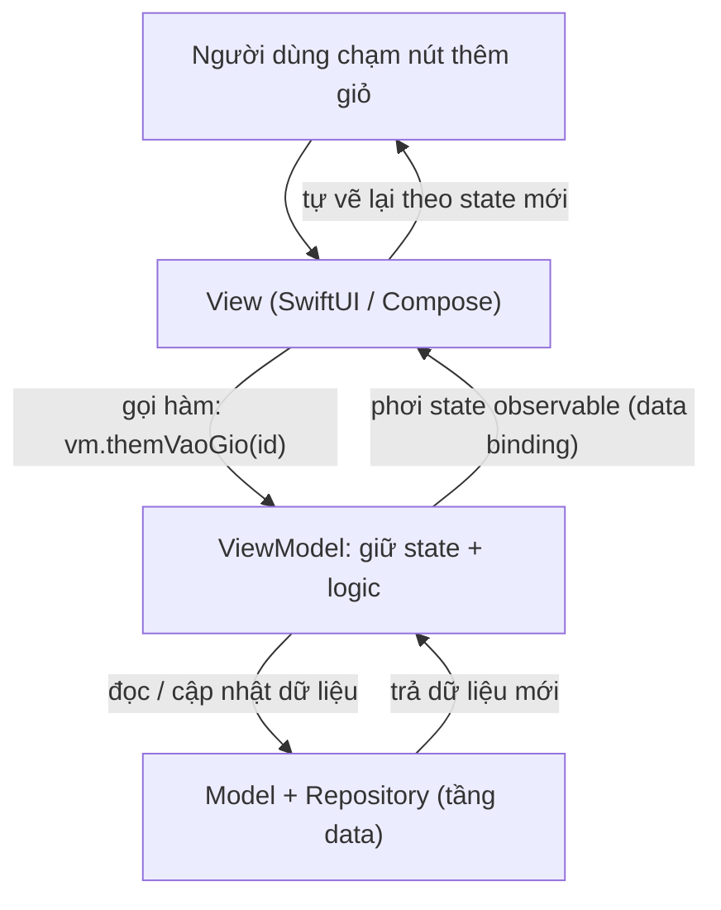
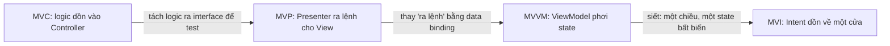

# MVC, MVP, MVVM, MVI — Pattern tầng trình bày

> **Tác giả:** Mr.Rom\
> **Phiên bản:** v1.0.0\
> **Tạo lúc:** 13/06/2026\
> **Cập nhật:** 13/06/2026\
> **Level:** Basic\
> **Tags:** mobile, architecture, presentation-layer, mvc, mvp, mvvm, mvi, viewmodel, unidirectional-data-flow, declarative-ui\
> **Yêu cầu trước:** [Vì sao cần kiến trúc app mobile?](00_why-mobile-architecture.md)

> 🎯 *Đây là bài mở đầu cụm kiến trúc app mobile. Bài này đi vào tầng đầu tiên và dễ chạm nhất: **tầng trình bày** (presentation layer) — nơi giao diện gặp logic. Bạn sẽ đi qua 4 pattern theo đúng trình tự lịch sử mà ngành mobile đã trải qua: **MVC** (và căn bệnh "Massive View Controller"), **MVP** (Presenter gánh logic), **MVVM** (ViewModel + data binding — phổ biến nhất hôm nay với SwiftUI/Compose), và **MVI** (Model-View-Intent, một chiều, state bất biến). Cuối bài bạn hiểu mỗi pattern giải quyết gì, vì sao MVVM/MVI hợp với UI declarative, và biết chọn pattern nào cho màn sản phẩm Acme Shop của mình.*

## 🎯 Sau bài này bạn sẽ

- [ ] Hiểu **tầng trình bày** là gì và vì sao nó cần một pattern riêng (không trộn UI với logic)
- [ ] Giải thích được **MVC** trên mobile và căn bệnh kinh điển **Massive View Controller**
- [ ] Hiểu **MVP** tách logic ra **Presenter** qua interface, dễ test hơn MVC thế nào
- [ ] Hiểu **MVVM**: **ViewModel** + **data binding**, vì sao nó là default hiện hành với SwiftUI/Compose
- [ ] Hiểu **MVI**: luồng **một chiều** (unidirectional), **state bất biến** (immutable), Intent → State
- [ ] So sánh 4 pattern và biết **khi nào dùng cái nào** cho màn hình Acme Shop

---

## Tình huống — màn sản phẩm Acme phình to thành mớ bòng bong

Bạn vừa làm app Acme Shop. Màn hình danh sách sản phẩm ban đầu rất nhỏ: gọi API, hiện danh sách. Nhưng vài tuần sau, cùng một file màn hình đó đã phình ra ôm đủ thứ:

- Code gọi mạng tải sản phẩm
- Code parse JSON
- Code lọc theo giá, sắp xếp theo tên
- Code format giá tiền `28000000` thành `"28.000.000đ"`
- Code xử lý nút "thêm vào giỏ"
- Code lưu trạng thái loading/error
- ...và cả code vẽ giao diện

File chạm 900 dòng. Một bug nhỏ ở chỗ format giá khiến bạn phải cuộn qua cả đống code mạng và code vẽ UI để tìm. Tệ hơn: muốn viết test cho phần "lọc theo giá", bạn **không thể** — vì logic đó dính chặt vào view, không tách ra gọi riêng được.

Đây không phải lỗi của riêng bạn. Đây là **vấn đề cố hữu của tầng trình bày**: nếu không có quy ước rõ ràng về "code nào ở đâu", màn hình nào rồi cũng phình to thành cục bột nhão (*spaghetti*) trộn lẫn UI và logic. Bốn pattern trong bài này — MVC, MVP, MVVM, MVI — đều là các đời câu trả lời cho đúng một câu hỏi: **làm sao tách "vẽ gì" ra khỏi "xử lý gì"** ở tầng giao diện.

> 📖 *Trước khi xem từng pattern, cần thống nhất "tầng trình bày" là gì và 3 vai trò chung mà mọi pattern đều xoay quanh.*

---

## 1️⃣ Tầng trình bày là gì? Ba vai trò chung của mọi pattern

**Tầng trình bày** (*presentation layer*) là phần code lo việc **hiển thị dữ liệu cho người dùng** và **xử lý tương tác** (chạm, gõ, vuốt). Nó nằm sát người dùng nhất, ngược lại với tầng dữ liệu (gọi API, đọc database) nằm sâu bên trong.

🪞 **Ẩn dụ**: tầng trình bày giống **nhân viên quầy lễ tân** của một nhà hàng. Lễ tân không tự nấu ăn (đó là việc của bếp — tầng dữ liệu), nhưng lễ tân là người **nhận yêu cầu của khách** và **mang món ra bày biện đẹp đẽ**. Bốn pattern MVC/MVP/MVVM/MVI thực ra chỉ là **bốn cách tổ chức công việc trong quầy lễ tân** — ai ghi đơn, ai bưng món, ai trang trí đĩa.

Dù tên gọi khác nhau, cả 4 pattern đều tách công việc thành **3 vai trò** lặp đi lặp lại:

| Vai trò | Làm gì | Ví dụ ở màn sản phẩm Acme |
|---|---|---|
| **Model** | Giữ dữ liệu + logic nghiệp vụ thuần, không biết gì về UI | `Product(id, name, price)`, hàm lọc theo giá |
| **View** | Vẽ giao diện, nhận tương tác người dùng, "ngu" nhất có thể | Danh sách sản phẩm trên màn, nút "thêm giỏ" |
| **Phần ở giữa** | Cầu nối: lấy Model đưa cho View, nhận sự kiện từ View | Controller / Presenter / ViewModel — tuỳ pattern |

Điểm khác biệt giữa 4 pattern **nằm gần như hoàn toàn ở "phần ở giữa"**: nó tên gì, nó nói chuyện với View ra sao (gọi thẳng? qua interface? qua binding?), và dữ liệu chảy theo chiều nào. Hiểu được điều này, bạn sẽ thấy 4 pattern không phải 4 thứ rời rạc, mà là **một dòng tiến hoá** — mỗi đời sửa nhược điểm của đời trước.

> 📖 *Bắt đầu từ đời đầu tiên, cũng là pattern bạn gặp nhiều nhất trong code cũ: MVC.*

---

## 2️⃣ MVC — và căn bệnh "Massive View Controller"

**MVC** (*Model-View-Controller* — Mô hình-Khung nhìn-Bộ điều khiển) là pattern lâu đời nhất, có từ thập ni 1970 ở desktop, rồi được mang vào mobile (iOS đời đầu với UIKit dùng nó làm mặc định). Ý tưởng gốc rất đẹp:

- **Model**: dữ liệu thuần (`Product`).
- **View**: thành phần giao diện (nút, label, list).
- **Controller**: bộ điều khiển — nhận sự kiện từ View, cập nhật Model, rồi đẩy dữ liệu Model trở lại View.

🪞 **Ẩn dụ**: Controller giống **người quản lý ca trực** đứng giữa khách (View) và kho (Model). Khách gọi gì, quản lý chạy vào kho lấy, mang ra. Nghe hợp lý — vấn đề là khi nhà hàng đông lên, ông quản lý này bị **dồn việc**: vừa ghi đơn, vừa bưng bê, vừa tính tiền, vừa lau bàn. Đó chính là mầm bệnh của MVC.

Trên mobile, đặc biệt iOS UIKit, "Controller" thường là `UIViewController`. Vấn đề là framework để View và Controller **dính chặt** vào nhau — `UIViewController` vừa giữ tham chiếu tới các view con, vừa là nơi tự nhiên để nhét mọi logic. Kết quả: lập trình viên nhét **tất cả** vào đó. Hiện tượng này có tên riêng trong giới iOS: **Massive View Controller** (Bộ điều khiển khổng lồ) — chơi chữ từ chính chữ "MVC".

Mô tả bằng pseudo-code một Controller màn sản phẩm Acme đã "phình":

```swift
// ❌ MASSIVE VIEW CONTROLLER — mọi thứ dồn vào một chỗ
class ProductListViewController {
    var products: [Product] = []

    func viewDidLoad() {
        // 1. Logic gọi mạng nằm thẳng trong Controller
        let url = URL(string: "https://api.acmeshop.vn/products")!
        URLSession.shared.dataTask(with: url) { data, _, _ in
            // 2. Logic parse JSON cũng ở đây
            self.products = try! JSONDecoder().decode([Product].self, from: data!)
            // 3. Logic format + cập nhật giao diện cũng ở đây luôn
            DispatchQueue.main.async {
                self.tableView.reloadData()
            }
        }.resume()
    }

    // 4. Logic format giá tiền — dính chặt vào Controller, không test riêng được
    func formatGia(_ gia: Int) -> String {
        return "\(gia)đ"   // (giả lược; thực tế còn thêm dấu chấm phân cách)
    }
}
```

Vấn đề lộ ra ngay: Controller này **biết quá nhiều** — biết URL API, biết format JSON, biết format giá, biết cả `tableView`. Muốn test hàm `formatGia` phải dựng cả `ViewController` (kéo theo cả UIKit) mới gọi được. Đây là lý do MVC "thuần" trên mobile **khó test** và **dễ phình**.

Đáng nói là MVC **gốc** (ở desktop những năm 1970-80) không hề định nghĩa như vậy. Trong MVC gốc, View và Controller là **hai thứ tách biệt** — Controller xử lý input (chuột, bàn phím), View chỉ vẽ, và Model thông báo thay đổi cho View qua cơ chế *observer* (quan sát). Nhưng khi mang lên iOS UIKit, Apple **gộp** vai trò View và Controller vào chung `UIViewController` cho tiện — và chính cú gộp đó tạo ra mầm bệnh: một khi View với Controller ở chung một class, không có ranh giới nào ngăn lập trình viên nhét hết mọi thứ vào đó. Nói cách khác, "Massive View Controller" không phải lỗi của ý tưởng MVC mà là lỗi của **cách hiện thực MVC trên mobile đời đầu**.

> [!NOTE]
> "Massive View Controller" không có nghĩa MVC là pattern tồi. MVC vẫn đúng về mặt ý tưởng — vấn đề là cách các framework mobile đời đầu **gắn chặt** View với Controller khiến lập trình viên dễ nhét mọi thứ vào một chỗ. Các pattern sau đều sinh ra để **gỡ** sự gắn chặt đó.

→ Câu hỏi tự nhiên: làm sao kéo logic ra khỏi Controller để test được? Đó chính là điều MVP làm.

---

## 3️⃣ MVP — Presenter gánh logic, View thành "ngu"

**MVP** (*Model-View-Presenter* — Mô hình-Khung nhìn-Người trình bày) là bước tiến hoá kế tiếp. Ý tưởng cốt lõi: thay "Controller" bằng **Presenter**, và **cắt đứt liên kết trực tiếp** giữa Presenter với các thành phần UI cụ thể bằng một **interface** (giao diện trừu tượng).

- **View** trở nên **thụ động** (*passive view*) — "ngu" nhất có thể: chỉ biết "hiện chuỗi này lên label", "hiện spinner", "ẩn spinner". Nó **không** chứa logic.
- **Presenter** giữ **toàn bộ logic trình bày**: gọi Model, xử lý dữ liệu, rồi **ra lệnh** cho View qua interface (`view.showProducts(...)`).
- Presenter **không** import UIKit/Android View — nó chỉ biết tới một interface `ProductView`. Nhờ đó test Presenter chỉ cần tạo một View giả (*mock*).

🪞 **Ẩn dụ**: Quay lại nhà hàng. MVP tách ông quản lý ca trực (Controller cũ) thành hai người: **người phục vụ bàn** (View) chỉ biết bưng món theo lệnh, và **bếp trưởng điều phối** (Presenter) ra lệnh "mang món A ra bàn 5". Bếp trưởng không cần biết người bưng là ai — ai bưng cũng được, miễn nghe đúng lệnh (interface). Nhờ vậy ta thay người bưng bằng *robot test* để kiểm tra bếp trưởng ra lệnh đúng chưa.

Pseudo-code MVP cho màn sản phẩm Acme — để ý Presenter giao tiếp View qua interface:

```kotlin
// 1. INTERFACE — hợp đồng giữa Presenter và View. View "ngu" chỉ làm 4 việc.
interface ProductView {
    fun hienLoading()
    fun anLoading()
    fun hienSanPham(items: List<String>)   // chuỗi đã format sẵn
    fun hienLoi(message: String)
}

// 2. PRESENTER — giữ TOÀN BỘ logic. Không import View thật, chỉ biết interface.
class ProductPresenter(
    private val view: ProductView,
    private val repo: ProductRepository,   // lấy dữ liệu (tầng data)
) {
    fun taiSanPham() {
        view.hienLoading()
        repo.layDanhSach(
            onSuccess = { products ->
                view.anLoading()
                // Logic format nằm ở Presenter — test được mà không cần UI
                val dong = products.map { "${it.name} — ${formatGia(it.price)}" }
                view.hienSanPham(dong)
            },
            onError = { e ->
                view.anLoading()
                view.hienLoi(e.message ?: "Không tải được sản phẩm")
            },
        )
    }

    private fun formatGia(gia: Long): String = "%,d".format(gia) + "đ"
}

// 3. VIEW THẬT — hiện thực interface, KHÔNG chứa logic, chỉ "vẽ theo lệnh"
class ProductActivity : ProductView {
    private val presenter = ProductPresenter(this, ProductRepository())

    fun onMoMan() {
        presenter.taiSanPham()   // View chỉ kích hoạt, Presenter lo phần còn lại
    }

    override fun hienLoading() { /* hiện spinner */ }
    override fun anLoading() { /* ẩn spinner */ }
    override fun hienSanPham(items: List<String>) { /* đổ vào list */ }
    override fun hienLoi(message: String) { /* hiện toast */ }
}
```

So với MVC, điểm hơn rõ rệt: `formatGia` và logic tải/format giờ nằm trong `ProductPresenter` — một class Kotlin thuần, **không dính UIKit/Android View**. Muốn test, bạn tạo một `ProductView` giả (mock) và kiểm tra Presenter có gọi đúng `hienSanPham(...)` với dữ liệu đúng không. **Test không cần thiết bị, không cần UI.**

Cái giá phải trả: MVP **nhiều boilerplate** (mã lặp). Mỗi màn cần một interface View với hàng loạt hàm `hienX`/`anX`, và Presenter phải gọi từng lệnh thủ công. Khi UI phức tạp, interface đó phình to. Đây là điều MVVM khắc phục bằng **data binding**.

→ MVP cải thiện khả năng test bằng cách Presenter *ra lệnh* cho View. Nhưng phải ra lệnh từng cái một. Nếu thay vì "ra lệnh", View **tự động** cập nhật theo dữ liệu thì sao? Đó là MVVM.

---

## 4️⃣ MVVM — ViewModel + data binding (phổ biến nhất hôm nay)

**MVVM** (*Model-View-ViewModel* — Mô hình-Khung nhìn-Mô hình khung nhìn) là pattern **phổ biến nhất** cho mobile hiện đại. Cả **SwiftUI** (iOS) lẫn **Jetpack Compose** (Android) đều hợp tự nhiên với MVVM. Khác biệt mấu chốt so với MVP nằm ở chữ **binding**.

- **ViewModel** giữ **state** (trạng thái màn hình) và logic, giống Presenter. Nhưng nó **không ra lệnh trực tiếp** cho View.
- Thay vào đó, ViewModel **phơi (expose) state ra ngoài** dưới dạng một biến *quan sát được* (observable): `StateFlow` (Kotlin), `@Observable` (Swift), `LiveData`, v.v.
- **View** **đăng ký theo dõi** state đó. Khi ViewModel đổi state, View **tự vẽ lại** — không cần ViewModel gọi `view.hienX()` từng cái. Mối nối "state đổi → UI đổi" này gọi là **data binding** (liên kết dữ liệu).

🪞 **Ẩn dụ**: Tiếp tục nhà hàng. MVP là bếp trưởng **gọi loa** từng lệnh cho người phục vụ ("mang món A!", "dọn bàn 5!"). MVVM thì lắp một **bảng điện tử**: bếp chỉ cần **cập nhật bảng** ("bàn 5: món A sẵn sàng"), người phục vụ **tự nhìn bảng** mà làm, không cần ai gọi tên. Bếp không quan tâm có bao nhiêu người phục vụ đang nhìn bảng — cứ cập nhật bảng là xong. Đó là sức mạnh của binding: **một nguồn sự thật, nhiều màn tự đồng bộ**.

Đây là phần trừu tượng nhất của bài — luồng dữ liệu giữa View và ViewModel. Hãy nhìn sơ đồ một lần để có mental model rõ: View **bắn sự kiện** lên ViewModel, ViewModel **đổi state**, state **chảy ngược** xuống View qua binding khiến View tự vẽ lại.



→ Điểm cốt lõi từ sơ đồ: View và ViewModel nối nhau bằng **hai chiều có kiểm soát** — sự kiện đi *lên* (gọi hàm ViewModel), state đi *xuống* (qua binding). View **không bao giờ** chạm thẳng vào Model, và ViewModel **không bao giờ** biết View là cái màn cụ thể nào. Nhờ đó ViewModel test được độc lập, còn View thì "câm lặng tự cập nhật".

Pseudo-code ViewModel cho màn sản phẩm Acme — bản Kotlin (Compose) và bản Swift (SwiftUI) cùng tư duy:

```kotlin
// === Kotlin / Jetpack Compose ===

// State của màn — một nguồn sự thật duy nhất, View chỉ đọc
data class ProductUiState(
    val dangTai: Boolean = false,
    val sanPham: List<Product> = emptyList(),
    val loi: String? = null,
)

class ProductViewModel(
    private val repo: ProductRepository,
) : ViewModel() {

    // 1. State nội bộ: mutable, chỉ ViewModel sửa (private)
    private val _uiState = MutableStateFlow(ProductUiState())
    // 2. State công khai: read-only, View đăng ký theo dõi (binding)
    val uiState: StateFlow<ProductUiState> = _uiState.asStateFlow()

    // 3. Logic: View gọi hàm này, KHÔNG tự sửa state
    fun taiSanPham() {
        viewModelScope.launch {
            _uiState.update { it.copy(dangTai = true, loi = null) }
            try {
                val ds = repo.layDanhSach()
                _uiState.update { it.copy(dangTai = false, sanPham = ds) }
            } catch (e: Exception) {
                _uiState.update { it.copy(dangTai = false, loi = e.message) }
            }
        }
    }
}
```

```swift
// === Swift / SwiftUI (Observation framework, iOS 17+) ===
import Observation

@Observable
final class ProductViewModel {
    // State phơi thẳng ra — View đọc property nào, đổi là tự vẽ lại (binding)
    var dangTai = false
    var sanPham: [Product] = []
    var loi: String? = nil

    private let repo: ProductRepository
    init(repo: ProductRepository) { self.repo = repo }

    // View gọi hàm này; ViewModel đổi state; SwiftUI tự cập nhật giao diện
    func taiSanPham() async {
        dangTai = true
        loi = nil
        do {
            sanPham = try await repo.layDanhSach()
        } catch {
            loi = error.localizedDescription
        }
        dangTai = false
    }
}
```

Hãy để ý điểm chung của hai bản: **không hề có** dòng nào kiểu `view.hienSanPham(...)`. ViewModel chỉ **đổi giá trị state** (`_uiState.update {}` ở Kotlin, gán thẳng property ở Swift), và phần "vẽ lại UI" là **tự động** nhờ binding. So với MVP, biến mất hẳn cái interface `ProductView` với hàng loạt hàm `hienX`/`anX`. Đó là vì sao MVVM **gọn hơn MVP** đáng kể trên UI hiện đại.

> [!IMPORTANT]
> Trong MVVM, ViewModel **tuyệt đối không** giữ tham chiếu tới View (không import UIKit/Android View, không cầm `tableView`/`Activity`). Nếu ViewModel của bạn đang `import` thành phần UI cụ thể, bạn đã làm sai — và nó sẽ khó test y như Massive View Controller. ViewModel chỉ biết **state** và **logic**, không biết "ai đang vẽ".

→ MVVM gọn và mạnh, nhưng `ProductUiState` ở trên vẫn là một object **đổi được từng phần** (`copy` field này, field kia). Khi màn phức tạp, việc state đổi từ nhiều chỗ vẫn có thể gây bug khó truy. MVI siết chặt điều này thêm một bậc.

---

## 5️⃣ MVI — một chiều, state bất biến, Intent → State

**MVI** (*Model-View-Intent* — Mô hình-Khung nhìn-Ý định) là pattern "đời mới" nhất, sinh ra từ tư tưởng lập trình hàm (functional) và được phổ biến nhờ các thư viện như Redux (web) rồi lan sang mobile. Nó không thay thế MVVM mà là **MVVM siết chặt hơn**, với hai luật cứng:

1. **Một chiều tuyệt đối** (*unidirectional data flow*): dữ liệu chỉ chảy theo vòng tròn một chiều — **Intent** (ý định người dùng) → ViewModel xử lý → **State** mới → View vẽ. Không có đường tắt.
2. **State bất biến** (*immutable state*): toàn bộ màn hình được mô tả bằng **một** object state **không sửa được**. Muốn đổi, bạn **tạo state mới hoàn toàn** thay cho state cũ, không "vá" từng field.

So với MVVM (vốn cho phép đổi nhiều field rời rạc, hoặc có nhiều `StateFlow`), MVI gom thành: **một** State duy nhất, đổi qua **một** cửa duy nhất (xử lý Intent).

🪞 **Ẩn dụ**: Nếu MVVM là **bảng điện tử có thể sửa từng dòng**, thì MVI là **màn hình chiếu chỉ thay được nguyên slide**. Mỗi khi có gì đổi, bạn không xoá một dòng trên slide cũ — bạn chiếu **một slide hoàn toàn mới** mô tả đầy đủ "lúc này màn hình trông thế nào". Vì mỗi slide là một ảnh chụp đầy đủ, khi có bug bạn chỉ cần xem lại chuỗi slide đã chiếu là biết sai ở bước nào.

Pseudo-code MVI cho màn sản phẩm Acme — chú ý `Intent` (sealed) và state bất biến:

```kotlin
// 1. STATE — bất biến (data class). Mô tả TRỌN VẸN màn hình tại một thời điểm.
data class ProductState(
    val dangTai: Boolean = false,
    val sanPham: List<Product> = emptyList(),
    val loi: String? = null,
)

// 2. INTENT — liệt kê MỌI ý định người dùng có thể bắn lên (đóng kín bằng sealed)
sealed interface ProductIntent {
    data object TaiLai : ProductIntent
    data class ThemVaoGio(val productId: Int) : ProductIntent
}

class ProductViewModel(
    private val repo: ProductRepository,
) : ViewModel() {

    private val _state = MutableStateFlow(ProductState())
    val state: StateFlow<ProductState> = _state.asStateFlow()

    // 3. MỘT CỬA DUY NHẤT nhận mọi Intent. State đổi chỉ qua đây.
    fun xuLy(intent: ProductIntent) {
        when (intent) {
            is ProductIntent.TaiLai -> taiSanPham()
            is ProductIntent.ThemVaoGio -> themVaoGio(intent.productId)
        }
    }

    private fun taiSanPham() {
        viewModelScope.launch {
            // Mỗi lần đổi -> tạo State MỚI bằng copy (không sửa state cũ tại chỗ)
            _state.update { it.copy(dangTai = true, loi = null) }
            try {
                val ds = repo.layDanhSach()
                _state.update { it.copy(dangTai = false, sanPham = ds) }
            } catch (e: Exception) {
                _state.update { it.copy(dangTai = false, loi = e.message) }
            }
        }
    }

    private fun themVaoGio(id: Int) {
        // ... xử lý rồi cũng phát ra State mới
    }
}
```

Khác biệt so với MVVM thuần: View **không gọi nhiều hàm** rời rạc (`taiSanPham()`, `themVaoGio()`...), mà chỉ gọi **một** hàm `xuLy(intent)` và truyền vào một `Intent`. Mọi đường đổi state đều chui qua `when` trong `xuLy` — **một cửa duy nhất**. Nhờ vậy bạn có thể *log* lại toàn bộ chuỗi Intent đã xảy ra để tái hiện bug ("người dùng bấm TaiLai → ThemVaoGio(5) → ..."), điều rất khó làm khi state bị sửa lung tung từ nhiều chỗ.

> [!TIP]
> Đừng nghĩ phải chọn "MVVM hay MVI" như hai phe đối lập. Trong thực tế, rất nhiều app Compose/SwiftUI dùng **MVVM với một state object bất biến duy nhất** — và như vậy đã *gần như* là MVI rồi. MVI chỉ là MVVM được kỷ luật hoá: một State, một cửa Intent. Bạn có thể bắt đầu từ MVVM và siết dần về MVI khi màn hình đủ phức tạp.

→ Đã đi đủ 4 đời pattern. Giờ là lúc đặt chúng cạnh nhau để thấy bức tranh tiến hoá và biết chọn cái nào.

---

## 6️⃣ So sánh 4 pattern & khi nào dùng cái nào

Trước khi vào bảng chi tiết, hãy nhìn lại bức tranh tiến hoá để thấy bốn pattern không rời rạc mà là một chuỗi sửa lỗi nối tiếp: mỗi đời gỡ đúng cái nhược điểm mà đời trước để lại.



→ Đọc sơ đồ theo chiều mũi tên: nhược điểm "khó test vì dính UI" của MVC được MVP gỡ bằng interface; nhược điểm "ra lệnh thủ công, nhiều boilerplate" của MVP được MVVM gỡ bằng binding; và sự "lỏng lẻo" còn lại của MVVM được MVI siết bằng luật một chiều + state bất biến. Hiểu mạch này thì bốn cái tên trở nên dễ nhớ, vì mỗi cái chỉ là "đời trước cộng thêm một ý tưởng".

Cả 4 pattern đều tách 3 vai trò Model / View / "phần giữa". Khác biệt nằm ở: phần giữa tên gì, nó nói chuyện View ra sao, và chiều dữ liệu. Bảng dưới đặt chúng cạnh nhau theo các tiêu chí quan trọng nhất khi chọn:

| Tiêu chí | **MVC** | **MVP** | **MVVM** | **MVI** |
|---|---|---|---|---|
| Phần giữa | Controller | Presenter | ViewModel | ViewModel (+ Intent) |
| View ↔ phần giữa | Dính chặt | Qua interface | Qua **data binding** | Qua binding + Intent |
| Chiều dữ liệu | Hai chiều, lỏng | Hai chiều (ra lệnh) | Hai chiều có kiểm soát | **Một chiều** (vòng kín) |
| State | Rải rác | Ở Presenter | Ở ViewModel (observable) | **Một** state bất biến |
| Khả năng test | Khó (dính UI) | Tốt (mock View) | Tốt (test ViewModel) | Rất tốt (Intent→State thuần) |
| Lượng boilerplate | Ít (nhưng dễ phình) | Nhiều (interface View) | Vừa | Vừa-nhiều (Intent/Reducer) |
| Hợp UI declarative? | Không | Không hẳn | **Rất hợp** | **Rất hợp** |
| Độ phức tạp cho người mới | Thấp | Trung bình | Trung bình | Cao |

Từ bảng trên, hướng dẫn chọn thực dụng cho app Acme:

| Tình huống | Nên dùng | Vì sao |
|---|---|---|
| Đang bảo trì code iOS UIKit / Android cũ | MVC / MVP | Code base đã theo pattern đó; đừng đập đi viết lại vô cớ |
| App mới với **SwiftUI** hoặc **Jetpack Compose** | **MVVM** | Default hiện hành, framework hỗ trợ binding sẵn, gọn |
| Màn hình **rất nhiều state** đan xen, cần debug chặt | **MVI** | Một state bất biến + log Intent giúp truy bug dễ |
| Màn hình cực đơn giản (chỉ hiện 1 dòng text tĩnh) | Không cần pattern nặng | Đừng "kiến trúc quá đà" cho màn 10 dòng |

> [!NOTE]
> Hôm nay nếu bạn bắt đầu một màn hình Acme mới bằng SwiftUI hoặc Compose, **mặc định cứ chọn MVVM**. Nó là điểm cân bằng tốt: đủ tách bạch để test, đủ gọn để không ngợp, và được cả hai framework "đỡ" sẵn. Khi nào màn phình ra với chục loại state, mới siết dần sang MVI.

### Vì sao MVVM/MVI đặc biệt hợp UI declarative?

Hai pattern cuối thắng thế trên mobile hiện đại không phải ngẫu nhiên — nó khớp với cách UI **declarative** (khai báo) hoạt động.

UI đời cũ là **imperative** (mệnh lệnh): bạn ra lệnh từng bước "ẩn spinner", "thêm dòng này vào list", "đổi màu nút". Đó đúng là kiểu MVC/MVP — phần giữa phải *ra lệnh* cho View từng thao tác.

UI declarative (SwiftUI, Compose) lật ngược: bạn **mô tả** "với state này thì màn hình trông thế nào", và framework **tự tính** cần vẽ lại gì. Công thức của nó đúng là:

```text
UI = f(state)
```

Nghĩa là: giao diện là một **hàm của state**. State đổi → framework tự gọi lại hàm vẽ → UI cập nhật. Mà đây chính xác là điều MVVM/MVI làm: **gom state vào một nơi (ViewModel) và phơi ra cho View tự bám theo**. MVC/MVP sinh ra cho thế giới imperative nên không khớp; MVVM/MVI sinh ra (hoặc tiến hoá) đúng cho thế giới `UI = f(state)`. Đó là lý do sâu xa khiến cả Apple lẫn Google đều đẩy cộng đồng về phía MVVM/MVI.

---

## 💡 Cạm bẫy thường gặp & Best practice

### ❌ Cạm bẫy: ViewModel "biết" về View (lặp lại Massive View Controller)

- **Triệu chứng**: ViewModel của bạn `import` UIKit/SwiftUI/Android View, giữ tham chiếu `tableView`, `Activity`, hay `View`, hoặc tự gọi `navigate(...)` điều hướng. Test ViewModel phải kéo theo cả framework UI.
- **Nguyên nhân**: Thói quen từ MVC — coi "phần giữa" là nơi đụng thẳng vào giao diện. Khi mang thói quen đó vào MVVM, ViewModel lại phình to và dính UI y như Massive View Controller.
- **Cách tránh**: ViewModel chỉ giữ **state** + **logic**, phơi state qua observable (`StateFlow`/`@Observable`). View tự bám theo state. Điều hướng và hiệu ứng UI để View tự lo dựa trên state (hoặc dùng "one-shot event" riêng), không để ViewModel cầm View.

### ❌ Cạm bẫy: Kiến trúc quá đà cho màn hình tí hon

- **Triệu chứng**: Một màn chỉ hiện "Về chúng tôi" tĩnh cũng có ViewModel, sealed Intent, Reducer, đủ bộ. Code dài gấp 5 lần phần thực sự cần.
- **Nguyên nhân**: Áp dụng pattern một cách máy móc "mọi màn đều phải MVI". Pattern là công cụ, không phải nghi thức.
- **Cách tránh**: Cân nhắc độ phức tạp. Màn tĩnh / chỉ hiển thị: View đọc thẳng dữ liệu là đủ. Chỉ thêm ViewModel khi có **state thay đổi** + **logic** đáng tách. Pattern phục vụ bạn, không phải ngược lại.

### ✅ Best practice: Một nguồn sự thật (single source of truth) cho state màn hình

- **Vì sao**: Khi state rải rác (nhiều biến `Boolean` rời như `isLoading`, `hasError`, `data`), màn dễ rơi vào trạng thái vô lý — vừa loading vừa báo lỗi. Gom thành **một** state object thì mỗi lúc màn hình chỉ có đúng một trạng thái hợp lệ.
- **Cách áp dụng**: Định nghĩa một `data class XxxUiState` (hoặc `sealed interface` nếu các trạng thái loại trừ nhau), phơi qua `StateFlow<XxxUiState>` / property `@Observable`, và View vẽ thuần theo nó. Đây là cầu nối tự nhiên từ MVVM sang MVI.

### ✅ Best practice: Giữ View "ngu", dồn logic xuống ViewModel/Presenter

- **Vì sao**: View dính logic thì không test được nếu không dựng cả giao diện, và logic chạy lại bất ngờ theo nhịp vẽ (đặc biệt với declarative UI, View bị gọi lại rất thường xuyên).
- **Cách áp dụng**: View chỉ làm hai việc — **hiển thị state** và **bắn sự kiện** lên phần giữa. Mọi tính toán, gọi mạng, format dữ liệu đặt ở ViewModel/Presenter. Đây là quy tắc chung đúng cho cả MVP, MVVM lẫn MVI.

---

## 🧠 Tự kiểm tra (Self-check)

**Q1.** "Massive View Controller" là gì, và vì sao nó xảy ra với MVC trên mobile?

<details>
<summary>💡 Xem giải thích</summary>

"Massive View Controller" (Bộ điều khiển khổng lồ) là hiện tượng `UIViewController` (hoặc Controller tương đương) phình to vì ôm **tất cả**: gọi mạng, parse dữ liệu, format, logic nghiệp vụ, lẫn code vẽ UI.

Nó xảy ra vì các framework mobile đời đầu **gắn chặt** View với Controller — Controller là nơi tự nhiên (và tiện) nhất để nhét mọi thứ. Hậu quả: file dài hàng trăm dòng, khó đọc, và **khó test** vì logic dính chặt vào UI, không tách ra gọi riêng được. MVC không sai về ý tưởng — vấn đề là sự gắn chặt này.

</details>

**Q2.** MVP cải thiện khả năng test so với MVC bằng cách nào?

<details>
<summary>💡 Xem giải thích</summary>

MVP đưa logic vào **Presenter**, và cắt liên kết trực tiếp giữa Presenter với UI bằng một **interface** (`ProductView`). Presenter không import thành phần UI thật — nó chỉ biết tới interface và **ra lệnh** qua đó (`view.hienSanPham(...)`).

Nhờ vậy, để test Presenter ta tạo một **View giả (mock)** hiện thực interface, rồi kiểm tra Presenter có gọi đúng hàm với dữ liệu đúng không — **không cần thiết bị, không cần dựng UI thật**. Giá phải trả là nhiều boilerplate: mỗi màn cần một interface với hàng loạt hàm `hienX`/`anX`.

</details>

**Q3.** Khác biệt cốt lõi giữa MVP và MVVM nằm ở đâu?

<details>
<summary>💡 Xem giải thích</summary>

Nằm ở cách "phần giữa" giao tiếp với View:

- **MVP**: Presenter **ra lệnh trực tiếp** cho View qua interface — gọi `view.hienLoading()`, `view.hienSanPham(...)` từng cái một.
- **MVVM**: ViewModel **không ra lệnh**, mà chỉ **phơi state quan sát được** (observable). View **đăng ký theo dõi** state và **tự vẽ lại** khi state đổi. Mối nối tự động này gọi là **data binding**.

Kết quả: MVVM bỏ được interface `ProductView` với loạt hàm `hienX`, nên gọn hơn MVP đáng kể — đặc biệt trên UI declarative.

</details>

**Q4.** Hai luật cứng của MVI là gì? Nó "siết" MVVM ở chỗ nào?

<details>
<summary>💡 Xem giải thích</summary>

Hai luật của MVI:

1. **Một chiều tuyệt đối** (unidirectional): dữ liệu chỉ chảy vòng kín Intent → ViewModel → State → View, không có đường tắt.
2. **State bất biến** (immutable): toàn màn mô tả bằng **một** state object không sửa được; muốn đổi thì tạo state mới hoàn toàn, không vá từng field tại chỗ.

Nó siết MVVM ở chỗ: thay vì View gọi nhiều hàm rời rạc của ViewModel, View chỉ bắn **Intent** vào **một cửa duy nhất** (`xuLy(intent)`). Mọi thay đổi state chui qua đúng một chỗ, nên dễ log lại chuỗi Intent để tái hiện bug.

</details>

**Q5.** Vì sao MVVM/MVI hợp với UI declarative (SwiftUI/Compose) hơn MVC/MVP?

<details>
<summary>💡 Xem giải thích</summary>

UI declarative hoạt động theo công thức **`UI = f(state)`** — bạn *mô tả* "với state này màn hình trông thế nào", framework tự tính cần vẽ lại gì. Đây là tư duy **state-driven**.

MVVM/MVI đúng là làm điều đó: **gom state vào ViewModel và phơi ra cho View tự bám theo**. State đổi → UI tự cập nhật. Còn MVC/MVP sinh ra cho UI **imperative** (ra lệnh từng thao tác "ẩn cái này, thêm cái kia"), không khớp với mô hình `UI = f(state)`. Đó là lý do cả Apple lẫn Google đều đẩy cộng đồng về MVVM/MVI.

</details>

**Q6.** Bạn bắt đầu một màn hình danh sách sản phẩm Acme mới bằng Jetpack Compose. Nên chọn pattern nào, vì sao?

<details>
<summary>💡 Xem giải thích</summary>

Mặc định chọn **MVVM**. Lý do:

- Compose là UI declarative, hỗ trợ binding sẵn qua `StateFlow` + `collectAsStateWithLifecycle` → MVVM khớp tự nhiên, ít boilerplate hơn MVP.
- MVVM là điểm cân bằng: đủ tách bạch để test ViewModel độc lập, đủ gọn để không ngợp.
- MVI sẽ là lựa chọn khi màn phình ra với rất nhiều loại state đan xen cần debug chặt — nhưng cho một màn danh sách thường, MVVM (với một `UiState` bất biến) là đủ, và nó vốn đã gần MVI.

</details>

---

## ⚡ Tra cứu nhanh (Cheatsheet)

| Pattern | Phần giữa | View ↔ phần giữa | Đặc trưng |
|---|---|---|---|
| **MVC** | Controller | Dính chặt | Đơn giản, dễ phình (Massive VC) |
| **MVP** | Presenter | Qua interface, ra lệnh | Test tốt, nhiều boilerplate |
| **MVVM** | ViewModel | Data binding | Phổ biến nhất, hợp declarative |
| **MVI** | ViewModel + Intent | Binding + một cửa Intent | Một chiều, state bất biến |

| Khái niệm | Tóm tắt |
|---|---|
| Data binding | State đổi → View tự vẽ lại, không cần ra lệnh thủ công |
| Unidirectional data flow | Dữ liệu chảy một chiều: Intent → State → View → (lặp lại) |
| Immutable state | State không sửa tại chỗ; đổi = tạo object mới hoàn toàn |
| Single source of truth | Một state object duy nhất mô tả trọn vẹn màn hình |
| `UI = f(state)` | UI là hàm của state — nền tảng UI declarative |
| Quy tắc chọn (app mới SwiftUI/Compose) | Mặc định **MVVM**; siết sang **MVI** khi state phức tạp |

---

## 📚 Từ Điển Thuật Ngữ (Glossary)

| EN | VN | Giải thích |
|---|---|---|
| Presentation layer | Tầng trình bày | Phần code lo hiển thị dữ liệu và xử lý tương tác người dùng |
| Model | Mô hình | Dữ liệu + logic nghiệp vụ thuần, không biết gì về UI |
| View | Khung nhìn | Thành phần giao diện; vẽ và nhận tương tác, nên "ngu" nhất có thể |
| Controller | Bộ điều khiển | "Phần giữa" của MVC; nhận sự kiện View, cập nhật Model |
| Presenter | Người trình bày | "Phần giữa" của MVP; giữ logic, ra lệnh cho View qua interface |
| ViewModel | Mô hình khung nhìn | "Phần giữa" của MVVM; giữ state + logic, phơi state cho View bám theo |
| MVC | Model-View-Controller | Pattern lâu đời nhất; dễ phình thành Massive View Controller |
| MVP | Model-View-Presenter | Tách logic ra Presenter qua interface; dễ test, nhiều boilerplate |
| MVVM | Model-View-ViewModel | Pattern phổ biến nhất hiện nay; dùng data binding |
| MVI | Model-View-Intent | Luồng một chiều, state bất biến; Intent → State → View |
| Massive View Controller | Bộ điều khiển khổng lồ | Controller phình to vì ôm cả mạng, logic, lẫn UI; khó test |
| Passive view | Khung nhìn thụ động | View "ngu" chỉ vẽ theo lệnh, không chứa logic (đặc trưng MVP) |
| Data binding | Liên kết dữ liệu | Mối nối tự động: state đổi thì View tự vẽ lại |
| Observable | Quan sát được | Dữ liệu mà View có thể "đăng ký theo dõi" để tự cập nhật |
| State | Trạng thái | Toàn bộ dữ liệu mô tả màn hình tại một thời điểm |
| Intent | Ý định | Sự kiện/ý định người dùng bắn lên trong MVI (vd "tải lại") |
| Unidirectional data flow | Luồng dữ liệu một chiều | Dữ liệu chỉ chảy theo một vòng kín, không có đường tắt |
| Immutable | Bất biến | Không sửa được tại chỗ; muốn đổi phải tạo bản mới |
| Single source of truth | Nguồn sự thật duy nhất | Một nơi duy nhất giữ state, mọi nơi khác đọc từ đó |
| Declarative UI | UI khai báo | Mô tả "với state này UI trông thế nào", framework tự vẽ lại |
| Imperative UI | UI mệnh lệnh | Ra lệnh từng thao tác vẽ (ẩn/hiện/thêm/xoá) thủ công |
| Boilerplate | Mã lặp khuôn | Code soạn sẵn lặp đi lặp lại, ít giá trị nhưng buộc phải viết |

---

## 🔗 Liên kết & Tài nguyên

⬅️ **Bài trước:** [Vì sao cần kiến trúc app mobile?](00_why-mobile-architecture.md)\
➡️ **Bài tiếp theo:** [Clean Architecture & phân tầng — Domain, Data, Presentation](02_clean-architecture-and-layers.md)\
↑ **Về cụm:** [Kiến trúc app mobile — README cụm](../../README.md)

### 🧭 Định hướng lộ trình học

- **Bài này** là điểm khởi đầu của cụm `mobile-architecture` — tầng trình bày, không có bài trước
- [Clean Architecture & phân tầng — Domain, Data, Presentation](02_clean-architecture-and-layers.md) — bài kế: tầng trình bày nằm ở đâu trong bức tranh phân tầng lớn hơn
- [Quản lý State & Unidirectional Data Flow](03_state-management-and-data-flow.md) — đào sâu luồng một chiều và state mà MVVM/MVI dựa vào

### 🧩 Các chủ đề có thể bạn quan tâm

- [State, Data & Navigation — ViewModel, Retrofit, Room](../../../android-kotlin/lessons/01_basic/03_state-data-and-navigation.md) — MVVM thực chiến trên Android Compose với `ViewModel` + `StateFlow`
- [Data, State & Navigation — @Observable, networking, SwiftData](../../../ios-swift/lessons/01_basic/03_data-state-and-navigation.md) — MVVM thực chiến trên SwiftUI với `@Observable`
- [Quản lý state — setState và xa hơn](../../../flutter/lessons/01_basic/03_state-management.md) — góc nhìn Flutter về cùng vấn đề tầng trình bày
- [Điều hướng & state — React Navigation, hooks](../../../react-native/lessons/01_basic/02_navigation-and-state.md) — cách React Native quản lý state ở tầng trình bày

### 🌐 Tài nguyên tham khảo khác

- [Android Developers — Guide to app architecture](https://developer.android.com/topic/architecture) — Google khuyến nghị UI layer theo hướng MVVM/UDF
- [Apple — Managing model data in your app](https://developer.apple.com/documentation/swiftui/managing-model-data-in-your-app) — cách SwiftUI gắn state vào View (nền tảng MVVM)
- [Martin Fowler — GUI Architectures](https://martinfowler.com/eaaDev/uiArchs.html) — bài kinh điển truy nguồn gốc MVC/MVP và các biến thể

---

## 📌 Nhật ký thay đổi (Changelog)

- **v1.0.0 (13/06/2026)** — Bản đầu tiên. Cụm `mobile-architecture/` lesson 1/4 (basic). Cover tiến hoá 4 pattern tầng trình bày: MVC (+ căn bệnh Massive View Controller, pseudo-code Swift), MVP (Presenter + interface View, pseudo-code Kotlin, dễ test), MVVM (ViewModel + data binding, pseudo-code Kotlin Compose + Swift SwiftUI, phổ biến nhất), MVI (unidirectional + immutable state + Intent, pseudo-code Kotlin). So sánh 4 pattern (bảng tiêu chí + bảng khi-nào-dùng), giải thích `UI = f(state)` vì sao MVVM/MVI hợp UI declarative. 2 sơ đồ mermaid (luồng View ↔ ViewModel ↔ Model; chuỗi tiến hoá MVC → MVP → MVVM → MVI). 6 câu Self-check, Cheatsheet, Glossary, cross-link sang android-kotlin/ios-swift/flutter/react-native cùng cấp 01_basic.
