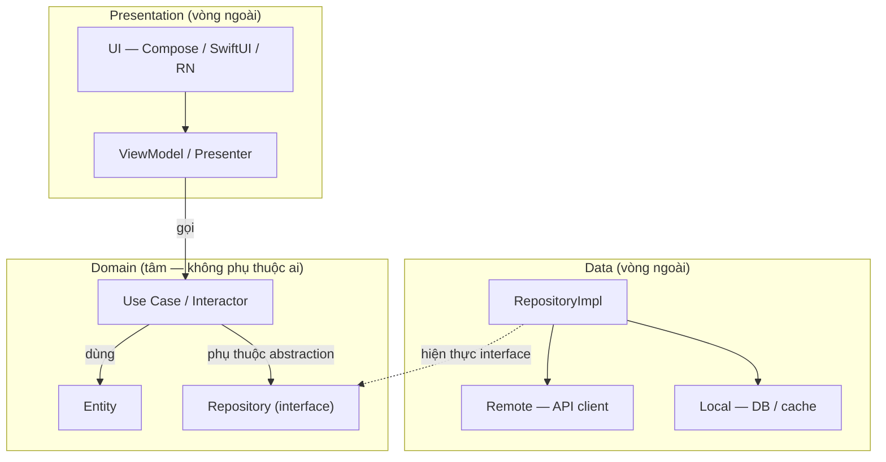
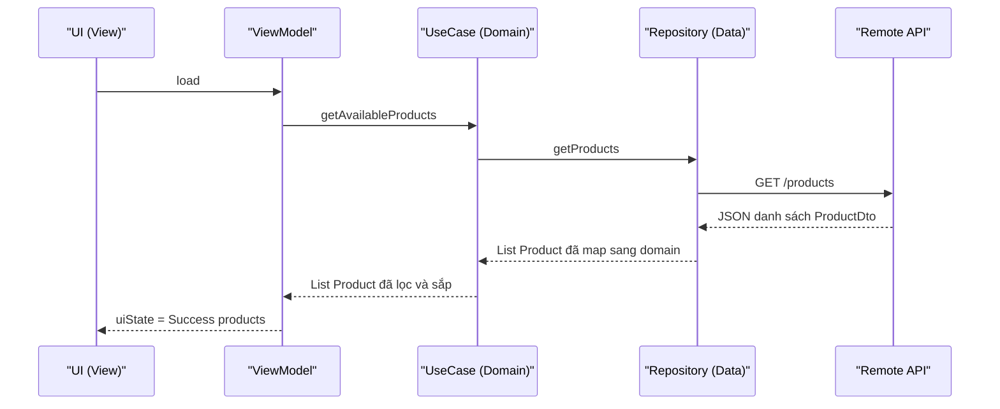

# Clean Architecture & phân tầng — Domain, Data, Presentation

> **Tác giả:** Mr.Rom\
> **Phiên bản:** v1.0.0\
> **Tạo lúc:** 13/06/2026\
> **Cập nhật:** 13/06/2026\
> **Level:** Basic\
> **Tags:** mobile, architecture, clean-architecture, domain-layer, data-layer, presentation-layer, repository-pattern, use-case, dependency-rule, mvvm\
> **Yêu cầu trước:** [MVC, MVP, MVVM, MVI](01_presentation-patterns-mvvm.md)

> 🎯 *Bài trước bạn đã biết MVVM tách **UI** khỏi **logic trình bày** — ViewModel giữ state, View chỉ vẽ. Nhưng MVVM chỉ lo *tầng trình bày*; nó không trả lời "logic nghiệp vụ đặt đâu" và "gọi API, đọc cache đặt đâu". Khi app Acme Shop lớn lên, ViewModel phình ra vì ôm cả gọi mạng lẫn tính toán. Bài này lắp tầng còn thiếu: **Clean Architecture** chia app thành 3 tầng **Presentation / Domain / Data**, ràng buộc bằng **Dependency Rule** (phụ thuộc luôn hướng vào trong). Cuối bài bạn hiểu vì sao tách giúp **test logic không cần Android/iOS** và **đổi nguồn dữ liệu không sửa nghiệp vụ** — và quan trọng không kém: khi nào KHÔNG nên áp dụng để khỏi over-engineer.*

## 🎯 Sau bài này bạn sẽ

- [ ] Hiểu **Clean Architecture** chia app thành 3 tầng **Presentation / Domain / Data** và vai trò từng tầng
- [ ] Nắm **Dependency Rule** — phụ thuộc luôn hướng *vào trong*, tầng trong không biết tầng ngoài
- [ ] Phân biệt **entity** và **use case (interactor)** trong tầng Domain — business logic thuần, không phụ thuộc framework
- [ ] Hiểu **Repository pattern** ở tầng Data: abstraction cho nguồn remote/local + mapper **DTO ↔ domain**
- [ ] Thấy ViewModel ở tầng Presentation gọi use case như thế nào (ráp với MVVM bài trước)
- [ ] Giải thích vì sao tách tầng giúp **test Domain không cần thiết bị** và **đổi nguồn data dễ**
- [ ] Biết **khi nào KHÔNG nên** áp dụng đầy đủ — tránh over-engineer app nhỏ

---

## Tình huống — ViewModel của Acme Shop phình to mất kiểm soát

Bạn vừa áp dụng MVVM ở bài trước cho màn hình danh sách sản phẩm Acme Shop. Lúc đầu `ProductListViewModel` rất gọn: giữ state, phơi danh sách ra View. Rồi yêu cầu chồng lên từng tuần:

- "Tải sản phẩm từ API" → bạn nhét code gọi `HTTP GET /products` thẳng vào ViewModel.
- "Khi offline thì đọc cache" → bạn thêm if/else đọc database local vào ViewModel.
- "Giá hiển thị phải cộng thuế VAT 10%, ẩn sản phẩm hết hàng" → bạn nhét luôn công thức tính tiền vào ViewModel.
- "Lọc sản phẩm theo hạng thành viên của user" → thêm tiếp.

Sau một tháng, `ProductListViewModel` dài mấy trăm dòng: vừa gọi mạng, vừa đọc DB, vừa tính thuế, vừa lọc nghiệp vụ, vừa giữ state UI. Giờ phát sinh ba nỗi đau:

- **Không test nổi logic tính tiền.** Muốn kiểm tra "VAT cộng đúng chưa", bạn buộc phải khởi tạo cả ViewModel — kéo theo Android framework / iOS framework, network client, database. Một phép cộng đơn giản mà phải chạy trên emulator.
- **Đổi nguồn dữ liệu là sửa khắp nơi.** Backend đổi từ REST sang GraphQL, hoặc bạn muốn thêm cache. Vì code gọi mạng nằm lẫn trong ViewModel, bạn phải mò sửa từng màn hình.
- **Logic nghiệp vụ rải rác và lặp lại.** Công thức tính VAT bị copy ở 3 ViewModel khác nhau. Sửa một chỗ, quên hai chỗ.

Gốc của vấn đề: MVVM chỉ tách *tầng trình bày* (View ↔ ViewModel), nó **không nói gì về** chỗ để nghiệp vụ và chỗ để truy cập dữ liệu. Ta cần một cách chia tầng rộng hơn — và đó chính là **Clean Architecture**.

---

## 1️⃣ Clean Architecture là gì — và vì sao có nó

Quay lại nỗi đau trên: vấn đề không phải "ViewModel viết dở", mà là **mọi thứ dồn vào một chỗ**. Cần một nguyên tắc chia: cái gì thuộc *giao diện*, cái gì thuộc *nghiệp vụ*, cái gì thuộc *dữ liệu* — và cấm chúng dính bậy vào nhau.

**Clean Architecture** (kiến trúc sạch) là một cách tổ chức code do Robert C. Martin (*Uncle Bob*) đề xuất, chia ứng dụng thành các **tầng đồng tâm** (concentric layers). Với app mobile, ta thường gom thành **3 tầng**:

- **Presentation** (tầng trình bày) — UI + ViewModel/Presenter. Cái người dùng thấy và chạm vào.
- **Domain** (tầng nghiệp vụ) — entity + use case. Trái tim của app: *quy tắc kinh doanh*, độc lập framework.
- **Data** (tầng dữ liệu) — repository + nguồn dữ liệu (API remote, database local). Nơi dữ liệu thật sự đến từ đâu.

🪞 **Ẩn dụ**: hình dung app như một **nhà hàng**. **Presentation** là *phòng ăn* — bàn ghế, thực đơn, người phục vụ tiếp khách. **Domain** là *công thức nấu ăn của đầu bếp trưởng* — "món này gồm gì, nấu theo quy tắc nào" — công thức này đúng dù bếp ở Hà Nội hay Sài Gòn, dùng bếp ga hay bếp từ. **Data** là *kho và nhà cung cấp* — rau mua chợ đầu mối (remote) hay lấy từ tủ lạnh (local). Khách (Presentation) không cần biết rau từ đâu; đầu bếp (Domain) chỉ cần "có cà chua tươi", không quan tâm ai giao. Đổi nhà cung cấp rau, công thức món ăn không đổi một chữ.

Điểm cốt lõi khiến nó "sạch" không nằm ở việc *có mấy tầng*, mà ở **luật phụ thuộc** giữa các tầng — phần tiếp theo.

> 📖 *Định nghĩa 3 tầng rồi, nhưng linh hồn của Clean Architecture là chiều mũi tên phụ thuộc giữa chúng. Nhìn sơ đồ vòng tròn đồng tâm bên dưới sẽ thấy ngay nguyên tắc.*

### Sơ đồ — vòng tròn Clean Architecture & chiều phụ thuộc

Sơ đồ dưới mô tả 3 tầng như các vòng tròn đồng tâm, kèm mũi tên *dependency* (phụ thuộc). Hãy chú ý: mọi mũi tên đều chỉ **vào trong** — về phía Domain ở tâm. Domain không có mũi tên nào chỉ ra ngoài.



→ Điểm mấu chốt từ sơ đồ: **Presentation và Data đều phụ thuộc Domain, còn Domain không phụ thuộc ai**. Để ý mũi tên đứt nét từ `RepositoryImpl` (ở Data) chỉ *ngược lên* `Repository interface` (ở Domain) — Data *hiện thực* hợp đồng do Domain định nghĩa, chứ Domain không gọi xuống Data. Đây là *dependency inversion* (đảo ngược phụ thuộc), và nó là lý do bạn có thể tháo cả tầng Data ra thay bằng cái khác mà Domain không hề hay biết.

---

## 2️⃣ Dependency Rule — luật phụ thuộc hướng vào trong

Đây là quy tắc *duy nhất* bạn phải thuộc lòng, mọi thứ khác suy ra từ nó:

> **Source code dependency chỉ được hướng *vào trong*. Tầng trong KHÔNG được biết gì về tầng ngoài.**

Cụ thể với 3 tầng mobile:

- **Domain** ở trong cùng — không `import` bất cứ thứ gì của Presentation hay Data, cũng không `import` Android SDK / iOS UIKit / React. Nó thuần ngôn ngữ (Kotlin/Swift/TypeScript thuần).
- **Data** và **Presentation** ở vòng ngoài — được phép `import` và phụ thuộc vào Domain.
- Presentation **không** phụ thuộc trực tiếp Data, và ngược lại. Chúng "gặp nhau" qua Domain.

🪞 **Ẩn dụ (mở rộng nhà hàng)**: *công thức của đầu bếp* (Domain) được viết ra mà **không nhắc tên nhà cung cấp nào** ("cần 200g cà chua tươi", không phải "cần cà chua của vựa X"). Nhờ vậy công thức không lệ thuộc một nhà cung cấp cụ thể. Ngược lại, *nhà cung cấp* (Data) phải đọc công thức để biết bếp cần gì mà giao. Chiều "ai-biết-ai" luôn là vòng ngoài biết vòng trong, không bao giờ ngược lại.

Vì sao luật này quan trọng đến vậy? Vì nó quyết định **cái gì dễ thay, cái gì khó thay**:

| Loại thay đổi | Tần suất | Nên đặt ở tầng | Lý do |
|---|---|---|---|
| Đổi giao diện (màu, layout, đổi từ XML sang Compose) | Rất hay | Presentation (vòng ngoài) | Thay đổi nhiều nhất → để ngoài cùng, không kéo theo nghiệp vụ |
| Đổi nguồn dữ liệu (REST → GraphQL, thêm cache) | Thỉnh thoảng | Data (vòng ngoài) | Hạ tầng hay đổi → cô lập để không đụng nghiệp vụ |
| Đổi quy tắc kinh doanh (cách tính giá, điều kiện giảm giá) | Cốt lõi, ít đổi | Domain (tâm) | Giá trị thật của app → bảo vệ, không cho framework xâm phạm |

→ Tư tưởng: **thứ hay đổi (UI, hạ tầng) để ở vòng ngoài; thứ ổn định và quý giá (nghiệp vụ) để ở tâm.** Vòng ngoài đổi không làm tâm rung. Đó là vì sao Dependency Rule bắt mũi tên chỉ vào trong, không bao giờ ra ngoài.

> [!IMPORTANT]
> Cách kiểm tra nhanh bạn có vi phạm Dependency Rule: mở một file trong tầng **Domain** và nhìn phần `import`. Nếu thấy `import android.*`, `import UIKit`, `import retrofit2.*`, `import SwiftUI`, hay bất kỳ tên framework/thư viện hạ tầng nào — bạn đã sai. Domain chỉ được import ngôn ngữ thuần và chính nó.

---

## 3️⃣ Tầng Domain — entity và use case, nghiệp vụ thuần

Domain là tâm vòng tròn, nên ta xây từ đây. Tầng này trả lời câu hỏi *"app này thật ra làm gì về mặt nghiệp vụ?"* — bỏ hết UI, bỏ hết mạng. Nó gồm hai loại thành phần.

### Entity — vật thể nghiệp vụ thuần

**Entity** (thực thể) là object mô tả khái niệm nghiệp vụ cốt lõi: `Product`, `User`, `Order`, `CartItem`. Nó **không** chứa annotation của database, **không** chứa field kiểu JSON của API — chỉ là dữ liệu + quy tắc thuộc về chính nó.

Đây là entity `Product` của Acme, viết bằng Kotlin thuần (để ý: không có `@Entity` của Room, không có `@Serializable` của network):

```kotlin
// Domain layer — Kotlin thuần, KHÔNG import framework nào.
data class Product(
    val id: Int,
    val name: String,
    val priceVnd: Long,      // giá gốc chưa thuế (VND)
    val inStock: Boolean,
) {
    // Quy tắc nghiệp vụ thuộc về chính Product: giá đã gồm VAT 10%.
    fun priceWithVat(): Long = priceVnd + priceVnd / 10
}
```

🪞 **Ẩn dụ**: entity là *công thức món ăn viết trên giấy* — nó mô tả "món Product gồm gì và tự tính giá đã gồm thuế ra sao". Tờ giấy này không quan tâm món được dọn ra đĩa sứ hay đĩa nhựa (UI), cũng không quan tâm cà chua mua ở đâu (Data).

### Use Case (Interactor) — một hành động nghiệp vụ

**Use case** (còn gọi **interactor**) đại diện cho **một hành động** mà app làm được: "lấy danh sách sản phẩm còn hàng", "thêm sản phẩm vào giỏ", "đặt đơn hàng". Mỗi use case làm *đúng một việc* và là nơi đặt logic nghiệp vụ phối hợp nhiều entity.

Quan trọng: use case **không tự biết** dữ liệu đến từ đâu. Nó chỉ phụ thuộc vào một **interface** repository (do Domain định nghĩa), không phụ thuộc lớp hiện thực ở Data. Đây chính là chỗ Dependency Rule phát huy.

Trước hết, Domain định nghĩa *hợp đồng* repository (chỉ là interface, không có code thật):

```kotlin
// Domain layer — interface, do tầng Data hiện thực sau.
interface ProductRepository {
    // suspend: hành động có thể tốn thời gian (mạng/disk), nhưng Domain
    // KHÔNG biết nó là mạng hay disk — đó là việc của Data.
    suspend fun getProducts(): List<Product>
}
```

Rồi use case dùng interface đó để làm nghiệp vụ "lấy sản phẩm còn hàng, sắp theo giá":

```kotlin
// Domain layer — nhận repository qua constructor (dependency injection).
class GetAvailableProductsUseCase(
    private val repository: ProductRepository,   // phụ thuộc INTERFACE, không phải lớp thật
) {
    // invoke() để gọi như một hàm: getAvailableProducts()
    suspend operator fun invoke(): List<Product> {
        // 1. Lấy toàn bộ sản phẩm — không quan tâm từ API hay cache.
        val all = repository.getProducts()

        // 2. Logic NGHIỆP VỤ thuần: chỉ giữ hàng còn kho, sắp theo giá tăng dần.
        return all
            .filter { it.inStock }
            .sortedBy { it.priceVnd }
    }
}
```

Toàn bộ file này **không** có một dòng nào dính Android/iOS/network. Đó là lý do nó test được cực dễ — phần "vì sao tách" sẽ chứng minh bằng một test thật ở mục 6.

> [!TIP]
> Quy ước đặt tên use case nên là **động từ + danh từ**: `GetAvailableProducts`, `AddItemToCart`, `PlaceOrder`. Đọc tên là biết app làm được gì — danh sách use case chính là *bản mô tả tính năng* của app, không cần đọc code.

→ Domain đã có entity (vật thể) và use case (hành động), cùng một interface repository "đặt hàng" dữ liệu. Nhưng dữ liệu thật phải đến từ đâu đó — đó là việc của tầng Data ở mục tiếp theo.

---

## 4️⃣ Tầng Data — Repository pattern, nguồn remote/local, mapper DTO ↔ domain

Domain đã *yêu cầu* `ProductRepository` nhưng chưa *hiện thực* nó. Tầng Data làm việc đó: cung cấp dữ liệu thật từ API và/hoặc database, rồi gói lại sao cho Domain dùng được entity sạch.

### Repository pattern — một cửa duy nhất cho dữ liệu

**Repository** (kho chứa) là một lớp đứng giữa, *che giấu* việc dữ liệu đến từ đâu. Domain gọi `repository.getProducts()` và nhận về `List<Product>`; nó **không biết** repository vừa gọi mạng, vừa đọc cache, hay trộn cả hai.

🪞 **Ẩn dụ**: repository là *người quản lý kho của nhà hàng*. Đầu bếp (Domain) chỉ nói "cho tôi 1kg cà chua tươi". Người quản lý kho tự quyết: lấy trong tủ lạnh (local) nếu còn tươi, hết thì gọi vựa giao (remote). Đầu bếp không bao giờ phải tự đi chợ — đó là điểm đẹp của repository.

### DTO và mapper — vì sao cần dịch dữ liệu

API thường trả về JSON với cấu trúc *của backend*, không phải entity Domain của bạn. Object hứng JSON đó gọi là **DTO** (*Data Transfer Object* — đối tượng truyền dữ liệu). Database local cũng có model riêng (vd `@Entity` của Room). Cả hai đều là *chi tiết hạ tầng* — không được rò rỉ lên Domain.

Vì vậy Data cần **mapper** (bộ ánh xạ): hàm chuyển **DTO ↔ domain entity**. Nhờ mapper, backend đổi tên field JSON từ `product_name` sang `title` chỉ cần sửa *một chỗ* trong mapper, Domain và Presentation không hay biết.

Đây là DTO hứng JSON từ API Acme (chú ý field theo *kiểu backend*: `snake_case`, có thuế tính sẵn mà ta không dùng):

```kotlin
// Data layer — DTO khớp JSON của API, được phép import thư viện network.
import kotlinx.serialization.SerialName
import kotlinx.serialization.Serializable

@Serializable
data class ProductDto(
    val id: Int,
    @SerialName("product_name") val productName: String,
    @SerialName("base_price") val basePrice: Long,
    @SerialName("in_stock") val inStock: Boolean,
)
```

Mapper chuyển `ProductDto` (hạ tầng) thành `Product` (domain) — chỉ giữ lại field nghiệp vụ cần:

```kotlin
// Data layer — hàm ánh xạ DTO -> domain entity.
fun ProductDto.toDomain(): Product = Product(
    id = id,
    name = productName,        // dịch product_name (JSON) -> name (domain)
    priceVnd = basePrice,      // dịch base_price (JSON) -> priceVnd (domain)
    inStock = inStock,
)
```

Cuối cùng, lớp hiện thực `ProductRepositoryImpl` ráp tất cả: gọi remote, dự phòng local, và *luôn trả về entity domain* — không bao giờ để DTO lọt ra ngoài:

```kotlin
// Data layer — hiện thực interface mà DOMAIN đã định nghĩa.
class ProductRepositoryImpl(
    private val remote: ProductRemoteDataSource,   // gọi API
    private val local: ProductLocalDataSource,     // đọc/ghi cache
) : ProductRepository {

    override suspend fun getProducts(): List<Product> {
        return try {
            // 1. Ưu tiên gọi API lấy dữ liệu mới nhất (trả về List<ProductDto>).
            val dtos = remote.fetchProducts()

            // 2. Cache lại để lần sau / lúc offline còn dùng.
            local.saveProducts(dtos)

            // 3. Dịch DTO -> domain entity rồi trả lên. Domain CHỈ thấy Product.
            dtos.map { it.toDomain() }
        } catch (e: Exception) {
            // 4. Mạng lỗi -> đọc cache local, vẫn dịch sang domain entity.
            local.getCachedProducts().map { it.toDomain() }
        }
    }
}
```

Bảng dưới tóm tắt "ai biết kiểu dữ liệu nào" — đây là chỗ người mới hay nhầm, nên ghim lại:

| Tầng | Kiểu dữ liệu được dùng | KHÔNG được thấy |
|---|---|---|
| Presentation | `Product` (domain entity) | `ProductDto`, model database |
| Domain | `Product` (domain entity) | `ProductDto`, model database, framework |
| Data | `ProductDto`, model DB **và** `Product` | — (Data là nơi *dịch* qua lại) |

→ Mấu chốt: **DTO và model database bị nhốt trong tầng Data.** Chúng không bao giờ leo lên Domain hay Presentation. Nhờ đó đổi backend = sửa DTO + mapper, không đụng phần còn lại của app.

> [!WARNING]
> Cạm bẫy phổ biến: lười, dùng thẳng `ProductDto` (object JSON) làm model cho toàn app để khỏi viết mapper. Hậu quả: khi backend đổi tên field hoặc đổi cấu trúc, *cả app vỡ* — ViewModel, UI, test, tất cả tham chiếu tên field cũ. Mapper trông như "code thừa" lúc đầu nhưng chính là lớp đệm cứu bạn về sau.

---

## 5️⃣ Tầng Presentation — ViewModel gọi use case (ráp với MVVM)

Đây là chỗ Clean Architecture *bắt tay* với MVVM ở bài trước. Ở tầng Presentation, **ViewModel không còn ôm logic nghiệp vụ hay code gọi mạng nữa** — nó chỉ *gọi use case* và biến kết quả thành state cho UI.

So sánh trực tiếp ViewModel "trước" (ôm hết) và "sau" (gọi use case):

```kotlin
// ❌ TRƯỚC — ViewModel ôm cả mạng, cả nghiệp vụ. Phình, khó test.
class ProductListViewModel : ViewModel() {
    val products = mutableStateListOf<Product>()
    fun load() = viewModelScope.launch {
        val dtos = httpClient.get("https://api.acmeshop.vn/products")  // gọi mạng thẳng
        val all = dtos.map { /* tự map */ }
        products.clear()
        products.addAll(all.filter { it.inStock }.sortedBy { it.priceVnd })  // nghiệp vụ thẳng
    }
}
```

```kotlin
// ✅ SAU — ViewModel chỉ gọi use case. Mỏng, tập trung vào STATE của UI.
class ProductListViewModel(
    private val getAvailableProducts: GetAvailableProductsUseCase,  // nhận use case qua DI
) : ViewModel() {

    private val _uiState = MutableStateFlow<ProductListUiState>(ProductListUiState.Loading)
    val uiState: StateFlow<ProductListUiState> = _uiState.asStateFlow()

    fun load() = viewModelScope.launch {
        _uiState.value = ProductListUiState.Loading
        try {
            // Toàn bộ "lấy + lọc + sắp" giờ nằm trong use case. ViewModel không biết chi tiết.
            val products = getAvailableProducts()
            _uiState.value = ProductListUiState.Success(products)
        } catch (e: Exception) {
            _uiState.value = ProductListUiState.Error("Không tải được sản phẩm.")
        }
    }
}
```

Để ý bản "sau": ViewModel **không** import network, **không** chứa công thức tính VAT hay điều kiện lọc — tất cả ở use case (Domain). Việc duy nhất của nó là *biến kết quả Domain thành state UI* (`Loading`/`Success`/`Error`) — đúng vai trò MVVM. Phần `ProductListUiState` (sealed interface 3 trạng thái) và `StateFlow` là kiến thức tầng trình bày đã học ở các bài state management — bài này chỉ ráp use case vào.

> 📖 *Đã có đủ 3 tầng và thấy chúng ráp lại. Giờ trả lời câu hỏi quan trọng nhất: tách như vậy ĐƯỢC gì cụ thể? Mục tiếp theo chứng minh bằng một bài test chạy không cần thiết bị.*

### Luồng dữ liệu xuyên 3 tầng — một lần tải sản phẩm

Sơ đồ tuần tự dưới mô tả một lần người dùng mở màn hình danh sách: yêu cầu đi *từ ngoài vào trong* (UI → Domain), dữ liệu thật được Data lấy về, rồi entity sạch chảy *ngược ra ngoài* tới UI. Hãy chú ý Domain (use case) đứng giữa mà không hề biết Data đang gọi mạng hay đọc cache.



→ Đọc sơ đồ theo chiều mũi tên: **gọi đi vào trong** (`UI → VM → UC → RE`), **dữ liệu trả ra ngoài** (`RE → UC → VM → UI`). Use case ở giữa chỉ "đặt hàng" qua interface và nhận về entity sạch — nó không hề thấy chữ `ProductDto` hay `GET /products` nào. Đó đúng là Dependency Rule chạy trong thực tế.

---

## 6️⃣ Vì sao tách — test Domain không cần thiết bị, đổi nguồn data dễ

Lý thuyết là vậy, nhưng lợi ích *cụ thể* mới thuyết phục. Hai cái lớn nhất:

### Lợi ích 1: Test nghiệp vụ không cần Android/iOS

Vì use case chỉ phụ thuộc **interface** `ProductRepository`, lúc test ta đưa cho nó một bản *giả* (fake) trả dữ liệu cứng — không cần mạng, không cần emulator, không cần database. Test chạy trong tích tắc ngay trên máy dev.

Đây là một test JUnit thuần cho `GetAvailableProductsUseCase` (chú ý: không một dòng nào dính Android):

```kotlin
import kotlinx.coroutines.test.runTest
import kotlin.test.Test
import kotlin.test.assertEquals

class GetAvailableProductsUseCaseTest {

    // Repository GIẢ — trả dữ liệu cứng, không gọi mạng/DB.
    private class FakeProductRepository : ProductRepository {
        override suspend fun getProducts(): List<Product> = listOf(
            Product(1, "Nguyen Van A Phone", priceVnd = 30_000_000, inStock = true),
            Product(2, "Le Van B Tablet",    priceVnd = 10_000_000, inStock = false), // hết hàng
            Product(3, "Tran Van C Watch",   priceVnd = 5_000_000,  inStock = true),
        )
    }

    @Test
    fun `chi giu hang con kho va sap theo gia tang dan`() = runTest {
        // Đưa repository giả vào use case — không cần thiết bị thật.
        val useCase = GetAvailableProductsUseCase(FakeProductRepository())

        val result = useCase()

        // Sản phẩm hết hàng (id=2) bị loại; còn lại sắp theo giá tăng dần.
        assertEquals(listOf(3, 1), result.map { it.id })
    }
}
```

Test này chạy bằng `./gradlew test` (unit test thuần JVM) — không phải `connectedAndroidTest` cần emulator. Khác biệt giữa hai loại test rất lớn:

| Tiêu chí | Test Domain (use case thuần) | Test ViewModel "ôm hết" (như tình huống đầu bài) |
|---|---|---|
| Cần emulator/thiết bị? | Không | Có (hoặc mock cả framework, rất phức tạp) |
| Cần mạng thật? | Không (dùng fake repository) | Thường có, hoặc phải dựng mock server |
| Tốc độ chạy | Tích tắc (JVM thuần) | Chậm (khởi động emulator, deploy) |
| Lệnh chạy | `./gradlew test` | `./gradlew connectedAndroidTest` |

→ Nghiệp vụ là phần *quý nhất và dễ sai nhất* của app (tính tiền, áp khuyến mãi, kiểm tra điều kiện). Đặt nó ở Domain thuần nghĩa là phần quý nhất được test nhanh và rẻ nhất. Đây là lý do số một để tách tầng.

### Lợi ích 2: Đổi nguồn dữ liệu mà không đụng nghiệp vụ

Giả sử Acme đổi backend từ REST sang GraphQL, hoặc thêm một tầng cache mới. Vì Domain chỉ biết `ProductRepository` (interface), bạn chỉ cần viết một `ProductRepositoryImpl` **mới**, còn use case, ViewModel, UI **không sửa một dòng**.

```kotlin
// Hôm nay: lấy từ REST.
class RestProductRepository(...) : ProductRepository { /* gọi REST */ }

// Mai mốt đổi sang GraphQL — chỉ thêm lớp mới, Domain/Presentation KHÔNG đổi.
class GraphQlProductRepository(...) : ProductRepository { /* gọi GraphQL */ }

// Ở chỗ khởi tạo (DI), đổi đúng MỘT dòng:
// val repo: ProductRepository = RestProductRepository(...)
val repo: ProductRepository = GraphQlProductRepository(...)
```

→ Cùng một interface, nhiều cách hiện thực. Đổi nguồn data thu gọn về *sửa một dòng ở chỗ ráp nối*, không phải mò khắp app. Đây là sức mạnh của *dependency inversion* mà sơ đồ vòng tròn ở mục 1 đã chỉ ra.

---

## 7️⃣ Ví dụ cấu trúc package — sắp xếp file theo tầng

Lý thuyết tầng phải phản ánh ra *cấu trúc thư mục* thì team mới giữ được kỷ luật. Có hai cách tổ chức phổ biến; với app cỡ vừa, **chia theo tính năng (feature) rồi mới theo tầng** thường dễ mở rộng nhất.

Đây là cấu trúc cho tính năng `product` của Acme (dùng được tương đương cho Android/Kotlin, iOS/Swift, hay RN/Flutter — chỉ khác phần đuôi file):

```text
com.acmeshop.app/
├── product/                         # 1 TÍNH NĂNG = 1 package gốc
│   ├── domain/                      # ── Tầng Domain (tâm, thuần) ──
│   │   ├── Product.kt               # entity
│   │   ├── ProductRepository.kt     # interface (hợp đồng)
│   │   └── GetAvailableProductsUseCase.kt
│   │
│   ├── data/                        # ── Tầng Data (hạ tầng) ──
│   │   ├── ProductDto.kt            # model JSON của API
│   │   ├── ProductEntity.kt         # model database local
│   │   ├── ProductMappers.kt        # DTO/DB <-> domain
│   │   ├── ProductRemoteDataSource.kt
│   │   ├── ProductLocalDataSource.kt
│   │   └── ProductRepositoryImpl.kt # hiện thực interface của domain
│   │
│   └── presentation/                # ── Tầng Presentation (UI) ──
│       ├── ProductListViewModel.kt
│       ├── ProductListUiState.kt
│       └── ProductListScreen.kt     # Compose / SwiftUI / RN component
│
└── di/
    └── ProductModule.kt             # nơi ráp nối: chọn RepositoryImpl nào
```

Quy tắc đọc cấu trúc này:

- **Mỗi tính năng** (`product`, `cart`, `order`...) là một package độc lập, bên trong chia 3 tầng. Mở `product/domain/` là thấy *toàn bộ nghiệp vụ sản phẩm* gọn một chỗ.
- **Chiều `import` phải khớp Dependency Rule**: file trong `domain/` không bao giờ `import` từ `data/` hay `presentation/`. File trong `data/` và `presentation/` thì được `import` từ `domain/`.
- **`di/`** là nơi *duy nhất* biết cả ba tầng — nó "ráp" use case với repository thật. Mọi tầng khác phụ thuộc abstraction, chỉ chỗ này phụ thuộc lớp cụ thể.

> [!TIP]
> Nhiều team enforce Dependency Rule bằng công cụ: Android có thể tách Domain thành một Gradle module Kotlin thuần (không có dependency Android) — lúc đó *trình biên dịch* sẽ chặn nếu ai lỡ import Android vào Domain. iOS dùng Swift Package riêng cho Domain. Cách này biến quy ước thành ràng buộc cứng, không phụ thuộc kỷ luật con người.

---

## 8️⃣ Đừng over-engineer — khi nào KHÔNG cần đủ tầng

Clean Architecture mạnh, nhưng nó **không miễn phí**: thêm interface, thêm mapper, thêm file, thêm tầng. Với app nhỏ, cái giá này có thể lớn hơn lợi ích — và áp cứng vào sẽ thành *over-engineering* (làm quá mức cần thiết).

🪞 **Ẩn dụ**: bạn không thuê *đầu bếp trưởng, quản lý kho, và đội phục vụ riêng* để nấu một bữa cơm cho hai người ở nhà. Quy trình nhà hàng đúng cho nhà hàng, không đúng cho bếp gia đình. Quy mô quyết định mức tổ chức.

Dùng bảng dưới để cân nhắc *mức độ* áp dụng theo quy mô app:

| Quy mô app | Nên áp dụng tới đâu | Lý do |
|---|---|---|
| App rất nhỏ (1-2 màn, demo, prototype) | Chỉ MVVM (View + ViewModel), gọi data trực tiếp | Thêm tầng chỉ tốn thời gian, chưa có gì để bảo vệ |
| App vừa (vài tính năng, có gọi API + cache) | Repository pattern + tách Domain/Data/Presentation cho tính năng cốt lõi | Cân bằng tốt: test được nghiệp vụ, đổi data dễ, chi phí vừa phải |
| App lớn (nhiều team, nhiều tính năng, sống lâu) | Đầy đủ 3 tầng + module hoá + enforce bằng tool | Lợi ích test/độc lập tầng vượt xa chi phí; cần kỷ luật chống rối |

Vài dấu hiệu bạn đang over-engineer:

- **Use case rỗng** chỉ gọi thẳng repository không thêm logic gì (`invoke() = repository.getX()`) — với nghiệp vụ tầm thường, cho ViewModel gọi repository trực tiếp cũng được.
- **Mapper 1-1 y hệt** giữa DTO và entity (mọi field trùng tên, trùng kiểu) cho một app sẽ không bao giờ đổi backend — có thể tạm dùng chung model.
- Mỗi màn hình tạo ra *năm sáu file* cho một danh sách tĩnh hiển thị vài dòng.

> [!IMPORTANT]
> Nguyên tắc thực dụng: **bắt đầu đơn giản, tách tầng khi đau mới tách.** Khi ViewModel bắt đầu phình vì ôm nghiệp vụ, khi bạn muốn test logic mà vướng framework, khi backend dọa đổi — đó là tín hiệu kéo tầng Domain/Data ra. Đừng dựng sẵn 3 tầng cho app chưa biết có sống quá tuần sau không.

---

## 💡 Cạm bẫy thường gặp & Best practice

### ❌ Cạm bẫy: Dùng DTO / model database làm model chung cho cả app

- **Triệu chứng**: Object `ProductDto` (hứng JSON) hoặc `ProductEntity` (của Room/Core Data) được truyền thẳng lên ViewModel và UI. Không có entity domain riêng, không có mapper.
- **Nguyên nhân**: Lười viết mapper, thấy "trùng field thì map làm gì". Nhưng làm vậy là để *chi tiết hạ tầng* (tên field JSON, annotation DB) rò rỉ ra khắp app.
- **Cách tránh**: Luôn có **entity domain riêng** và **mapper DTO ↔ domain** trong tầng Data. Backend đổi field → sửa mỗi mapper. Coi mapper là lớp đệm bảo vệ, không phải code thừa.

### ❌ Cạm bẫy: Domain import framework (vi phạm Dependency Rule)

- **Triệu chứng**: File trong tầng Domain có `import android.content.Context`, `import UIKit`, `import retrofit2.Response`, hay nhận `Context`/`HttpClient` làm tham số use case.
- **Nguyên nhân**: Tiện tay kéo framework vào để "lấy nhanh" thứ gì đó. Một khi Domain dính framework, nó hết test-không-cần-thiết-bị và hết tái dùng cho platform khác.
- **Cách tránh**: Domain chỉ phụ thuộc *ngôn ngữ thuần* và *interface do chính nó định nghĩa*. Cần gì từ ngoài → khai báo qua interface (vd `ProductRepository`), để tầng ngoài hiện thực. Kiểm tra bằng cách nhìn phần `import`; tốt hơn nữa là tách Domain thành module thuần để compiler chặn giúp.

### ✅ Best practice: Use case phụ thuộc interface, ráp nối ở một chỗ (DI)

- **Vì sao**: Use case nhận `ProductRepository` (interface) thay vì `ProductRepositoryImpl` (lớp thật) thì lúc test thay được bằng fake, lúc đổi nguồn data chỉ sửa một chỗ. Đây là nền của cả hai lợi ích lớn (test dễ, đổi data dễ).
- **Cách áp dụng**: Domain định nghĩa interface; Data hiện thực; chỉ tầng `di/` (hoặc nơi khởi tạo app) mới biết *lớp cụ thể nào* được dùng và "tiêm" vào qua constructor. Mọi tầng khác chỉ thấy abstraction.

### ✅ Best practice: Chia tầng theo độ "hay đổi", giữ Domain ổn định

- **Vì sao**: UI và hạ tầng (mạng, DB) đổi liên tục; nghiệp vụ thì ổn định và quý. Để thứ hay đổi ở vòng ngoài, thứ ổn định ở tâm, thì thay đổi vòng ngoài không làm rung tâm — app dễ bảo trì lâu dài.
- **Cách áp dụng**: Trước khi đặt một đoạn code, tự hỏi "cái này hay đổi cỡ nào?". Tính tiền/quy tắc giảm giá → Domain. Gọi API/đọc cache → Data. Màu sắc/layout/điều hướng → Presentation. Không trộn ba loại này trong một file.

---

## 🧠 Tự kiểm tra (Self-check)

**Q1.** Phát biểu Dependency Rule của Clean Architecture bằng một câu. Cách nhanh nhất để phát hiện một file Domain vi phạm nó là gì?

<details>
<summary>💡 Xem giải thích</summary>

Dependency Rule: **source code dependency chỉ được hướng vào trong; tầng trong (Domain) không được biết gì về tầng ngoài (Data, Presentation, framework).**

Cách phát hiện nhanh: mở file Domain và nhìn phần `import`. Nếu thấy bất kỳ tên framework/hạ tầng nào (`android.*`, `UIKit`, `SwiftUI`, `retrofit2.*`, network client, annotation DB) → đã vi phạm. Domain chỉ được import ngôn ngữ thuần và chính nó. Cách enforce cứng: tách Domain thành module/package không có dependency framework để compiler chặn.

</details>

**Q2.** Phân biệt **entity** và **use case** trong tầng Domain. Cho một ví dụ mỗi loại với app Acme Shop.

<details>
<summary>💡 Xem giải thích</summary>

- **Entity** là *vật thể nghiệp vụ* — dữ liệu + quy tắc thuộc về chính nó. Ví dụ: `Product` (có `id`, `name`, `priceVnd`, `inStock` và hàm `priceWithVat()`).
- **Use case (interactor)** là *một hành động* app làm được, phối hợp entity + repository. Ví dụ: `GetAvailableProductsUseCase` — lấy sản phẩm, lọc hàng còn kho, sắp theo giá.

Use case dùng entity và phụ thuộc *interface* repository (không phụ thuộc lớp hiện thực). Cả hai đều thuần, không import framework.

</details>

**Q3.** Vì sao tầng Data cần **DTO** và **mapper** riêng thay vì dùng thẳng object JSON làm model cho cả app?

<details>
<summary>💡 Xem giải thích</summary>

DTO khớp cấu trúc JSON *của backend* (tên field `snake_case`, có field thừa) — đó là chi tiết hạ tầng. Nếu dùng thẳng DTO khắp app, khi backend đổi tên field hay cấu trúc, *cả app vỡ*: ViewModel, UI, test đều tham chiếu field cũ.

Mapper (`DTO ↔ domain entity`) cô lập thay đổi: backend đổi → chỉ sửa mapper trong tầng Data, Domain và Presentation không hay biết. DTO và model DB bị "nhốt" trong tầng Data, không leo lên Domain/Presentation.

</details>

**Q4.** Use case `GetAvailableProductsUseCase` chỉ phụ thuộc interface `ProductRepository`. Điều này giúp việc test dễ ra sao? Test đó cần emulator không?

<details>
<summary>💡 Xem giải thích</summary>

Vì phụ thuộc *interface*, lúc test ta đưa cho use case một **fake repository** trả dữ liệu cứng — không cần mạng, không cần database, không cần emulator. Test chạy như unit test JVM thuần (`./gradlew test`), trong tích tắc, ngay trên máy dev.

So với ViewModel "ôm hết" (lẫn mạng + nghiệp vụ): muốn test phải dựng cả framework + mock server, chạy trên emulator (`connectedAndroidTest`), chậm và phức tạp. Đặt nghiệp vụ ở Domain thuần khiến phần quý nhất của app được test rẻ và nhanh nhất.

</details>

**Q5.** Acme đổi backend từ REST sang GraphQL. Theo Clean Architecture, những phần nào phải sửa, phần nào giữ nguyên?

<details>
<summary>💡 Xem giải thích</summary>

- **Phải sửa**: viết một `ProductRepositoryImpl` mới (vd `GraphQlProductRepository`) trong tầng Data, cùng DTO/mapper cho GraphQL. Và sửa **một dòng** ở chỗ DI để chọn lớp mới.
- **Giữ nguyên**: interface `ProductRepository` (Domain), use case, ViewModel, UI — không đổi một dòng.

Lý do: Domain chỉ biết interface, không biết lớp hiện thực. Đổi nguồn data = thêm một hiện thực mới của cùng interface (dependency inversion).

</details>

**Q6.** Khi nào KHÔNG nên áp dụng đầy đủ 3 tầng? Cho hai dấu hiệu của over-engineering.

<details>
<summary>💡 Xem giải thích</summary>

Không nên áp đủ tầng cho **app rất nhỏ** (1-2 màn, demo, prototype) — thêm tầng chỉ tốn công, chưa có nghiệp vụ gì đáng bảo vệ; chỉ MVVM là đủ.

Dấu hiệu over-engineering:
- **Use case rỗng** chỉ `invoke() = repository.getX()` không thêm logic — với nghiệp vụ tầm thường, ViewModel gọi repository trực tiếp cũng được.
- **Mapper 1-1 y hệt** (mọi field trùng tên/kiểu) cho app sẽ không đổi backend — tạm dùng chung model được.

Nguyên tắc: bắt đầu đơn giản, tách tầng khi *đau* mới tách (ViewModel phình, vướng framework lúc test, backend dọa đổi).

</details>

---

## ⚡ Tra cứu nhanh (Cheatsheet)

| Mục đích | Quy ước / cú pháp |
|---|---|
| 3 tầng | Presentation (UI + ViewModel) / Domain (entity + use case) / Data (repository + nguồn) |
| Dependency Rule | Phụ thuộc hướng *vào trong*; Domain không biết tầng ngoài |
| Entity (domain) | `data class Product(...)` — thuần, không annotation framework |
| Interface repository (domain) | `interface ProductRepository { suspend fun getProducts(): List<Product> }` |
| Use case | `class GetXUseCase(private val repo: XRepository) { suspend operator fun invoke() = ... }` |
| Gọi use case | `getAvailableProducts()` (nhờ `operator fun invoke`) |
| DTO (data) | `@Serializable data class ProductDto(@SerialName("product_name") ...)` |
| Mapper | `fun ProductDto.toDomain(): Product = Product(...)` |
| Repository impl (data) | `class ProductRepositoryImpl(...) : ProductRepository { override ... }` |
| ViewModel gọi use case | `class XVM(private val getX: GetXUseCase) : ViewModel()` |
| Cấu trúc package | `feature/{domain, data, presentation}` + `di/` ráp nối |
| Test use case | `GetXUseCase(FakeRepository())` → `./gradlew test` (không cần emulator) |
| Đổi nguồn data | Thêm `RepositoryImpl` mới + đổi 1 dòng DI; Domain/Presentation giữ nguyên |
| Khi KHÔNG dùng đủ tầng | App rất nhỏ / use case rỗng / mapper 1-1 y hệt |

---

## 📚 Từ Điển Thuật Ngữ (Glossary)

| EN | VN | Giải thích |
|---|---|---|
| Clean Architecture | Kiến trúc sạch | Cách chia app thành tầng đồng tâm, phụ thuộc hướng vào trong |
| Layer | Tầng | Một nhóm thành phần cùng vai trò (Presentation/Domain/Data) |
| Presentation layer | Tầng trình bày | UI + ViewModel/Presenter — phần người dùng thấy |
| Domain layer | Tầng nghiệp vụ | Entity + use case — quy tắc kinh doanh, thuần, không framework |
| Data layer | Tầng dữ liệu | Repository + nguồn remote/local — nơi dữ liệu thật đến từ đâu |
| Dependency Rule | Luật phụ thuộc | Dependency chỉ hướng vào trong; tầng trong không biết tầng ngoài |
| Dependency inversion | Đảo ngược phụ thuộc | Tầng ngoài hiện thực interface do tầng trong định nghĩa |
| Entity | Thực thể | Object nghiệp vụ thuần (dữ liệu + quy tắc của chính nó) |
| Use case | Use case (ca sử dụng) | Một hành động nghiệp vụ app làm được; còn gọi interactor |
| Interactor | Interactor | Tên gọi khác của use case (theo Uncle Bob) |
| Repository | Repository (kho chứa) | Lớp che giấu việc dữ liệu đến từ remote hay local |
| Repository pattern | Mẫu repository | Một cửa truy cập dữ liệu thống nhất cho tầng trên |
| Data source | Nguồn dữ liệu | Thành phần lấy dữ liệu cụ thể: remote (API) hoặc local (DB/cache) |
| DTO | Đối tượng truyền dữ liệu | Object khớp cấu trúc JSON/API của backend (Data Transfer Object) |
| Mapper | Bộ ánh xạ | Hàm chuyển DTO/model DB ↔ domain entity |
| Dependency injection | Tiêm phụ thuộc | Đưa phụ thuộc (vd repository) vào qua constructor, không tự tạo |
| ViewModel | ViewModel | Thành phần Presentation giữ state UI, gọi use case |
| Over-engineering | Làm quá mức | Thêm tầng/abstraction nhiều hơn nhu cầu thực, gây phức tạp thừa |

---

## 🔗 Liên kết & Tài nguyên

⬅️ **Bài trước:** [MVC, MVP, MVVM, MVI — Pattern tầng trình bày](01_presentation-patterns-mvvm.md)\
➡️ **Bài tiếp theo:** [Quản lý State & Unidirectional Data Flow](03_state-management-and-data-flow.md)\
↑ **Về cụm:** [Mobile Architecture — README cụm](../../README.md)

### 🧭 Định hướng lộ trình học

- [Vì sao cần kiến trúc app mobile?](00_why-mobile-architecture.md) — bối cảnh chung, đọc lại nếu cần lý do tổng quát của việc chia tầng
- [MVC, MVP, MVVM, MVI — Pattern tầng trình bày](01_presentation-patterns-mvvm.md) — pattern tầng Presentation, yêu cầu trước của bài này
- [Quản lý State & Unidirectional Data Flow](03_state-management-and-data-flow.md) — bài kế: state chảy một chiều trong tầng Presentation
- [Testing & Modularization — App mobile bền vững](04_testing-and-modularization.md) — bài cuối cụm: tận dụng việc tách tầng để test và chia module

### 🧩 Các chủ đề có thể bạn quan tâm

- [State, Data & Navigation — ViewModel, Retrofit, Room](../../../android-kotlin/lessons/01_basic/03_state-data-and-navigation.md) — cách Android hiện thực ViewModel + Repository (Room/Retrofit) bằng Kotlin
- [Data, State & Navigation — @Observable, networking, SwiftData](../../../ios-swift/lessons/01_basic/03_data-state-and-navigation.md) — cách iOS hiện thực tầng tương tự với SwiftUI/SwiftData
- [Quản lý state — setState và xa hơn](../../../flutter/lessons/01_basic/03_state-management.md) — góc nhìn Flutter về tầng Presentation/state
- [Cách tiếp cận & kiến trúc cross-platform](../../../cross-platform-concepts/lessons/01_basic/01_approaches-and-architecture.md) — kiến trúc khi chia sẻ code giữa các nền tảng

### 🌐 Tài nguyên tham khảo khác

- [The Clean Architecture — Uncle Bob (blog gốc)](https://blog.cleancoder.com/uncle-bob/2012/08/13/the-clean-architecture.html) — bài viết khai sinh khái niệm, có sơ đồ vòng tròn đồng tâm
- [Android Developers — Guide to app architecture](https://developer.android.com/topic/architecture) — hướng dẫn chính thức về UI/Domain/Data layer cho Android
- [Android Developers — Domain layer](https://developer.android.com/topic/architecture/domain-layer) — chi tiết về use case và khi nào nên/không nên dùng

---

> 🎯 *Sau bài này bạn đã có khung tổ chức code cho app Acme: **Presentation** vẽ UI và giữ state, **Domain** chứa entity + use case nghiệp vụ thuần, **Data** lo repository + nguồn dữ liệu + mapper — tất cả ràng buộc bằng Dependency Rule (phụ thuộc hướng vào trong). Bạn thấy rõ vì sao tách giúp test nghiệp vụ không cần thiết bị và đổi nguồn data dễ, đồng thời biết khi nào KHÔNG nên áp đủ tầng. Bài tiếp đào sâu vào tầng Presentation: state chảy một chiều (unidirectional data flow) để UI luôn nhất quán và dễ truy bug.*

---

## 📌 Nhật ký thay đổi (Changelog)

- **v1.0.0 (13/06/2026)** — Bản đầu tiên. Cụm `mobile-architecture/` lesson 2/5 (basic). Cover: Clean Architecture 3 tầng Presentation/Domain/Data + Dependency Rule (phụ thuộc hướng vào trong, tầng trong không biết tầng ngoài, dependency inversion); tầng Domain (entity thuần + use case/interactor với `operator fun invoke`, phụ thuộc interface repository); tầng Data (Repository pattern, remote/local data source, DTO + mapper DTO↔domain, RepositoryImpl); tầng Presentation (ViewModel gọi use case, ráp với MVVM); vì sao tách (test Domain bằng fake repository không cần emulator, đổi nguồn REST→GraphQL chỉ đổi 1 dòng DI); ví dụ cấu trúc package theo feature + tầng; cân nhắc over-engineer (bảng theo quy mô app, dấu hiệu lạm dụng). 2 sơ đồ mermaid (vòng tròn Clean Arch + chiều dependency; sequence luồng dữ liệu xuyên 3 tầng). Code minh hoạ Kotlin (entity, interface, use case, DTO, mapper, repository impl, ViewModel, JUnit test). Cạm bẫy: dùng DTO làm model chung, Domain import framework.
