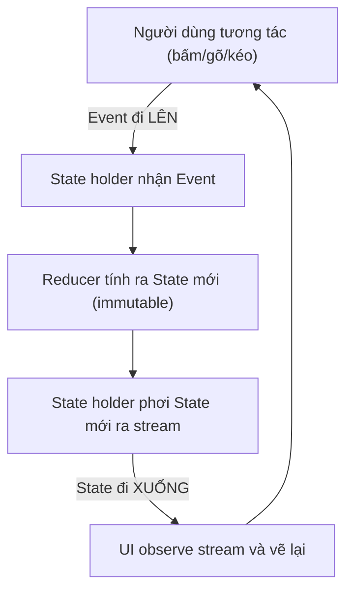

# Quản lý State & Unidirectional Data Flow

> **Tác giả:** Mr.Rom\
> **Phiên bản:** v1.0.0\
> **Tạo lúc:** 13/06/2026\
> **Cập nhật:** 13/06/2026\
> **Level:** Basic\
> **Tags:** mobile-architecture, state-management, unidirectional-data-flow, udf, mvi, single-source-of-truth, state-holder, viewmodel, reactive-streams, flow, combine, hooks, side-effects, immutable-state, mobile\
> **Yêu cầu trước:** [Clean Architecture & phân tầng](02_clean-architecture-and-layers.md)

> 🎯 *Bài trước bạn đã chia app Acme Shop thành 3 tầng Domain / Data / Presentation. Nhưng còn một câu hỏi chưa trả lời: **state** (trạng thái màn hình — đang loading? có data gì? lỗi gì?) sống ở đâu, ai được sửa, và UI biết khi nào vẽ lại? Trả lời sai là app đầy bug khó tả: bấm nút hai lần ra hai kết quả khác nhau, toast hiện lại sau khi xoay màn, hai chỗ hiển thị cùng một con số mà lệch nhau. Bài này dạy **Unidirectional Data Flow (UDF)** — nền chung của Compose, SwiftUI và Redux: **state chảy xuống, event bắn lên**, một **single source of truth** duy nhất, một **state holder** giữ UI state **immutable**, UI **observe** qua reactive stream (Flow / Combine / hooks), và **side effect** (điều hướng, toast, one-time event) được xử lý đúng để không lặp. Cuối bài bạn có một mental model áp dụng được cho mọi platform mobile.*

## 🎯 Sau bài này bạn sẽ

- [ ] Giải thích được **Unidirectional Data Flow (UDF)** — state đi xuống, event đi lên — và vì sao nó là nền của Compose/SwiftUI/Redux
- [ ] Hiểu **single source of truth**: vì sao một dữ liệu chỉ được giữ ở **một** nơi
- [ ] Thiết kế một **state holder** (ViewModel) phơi UI state dạng **immutable** data class / struct
- [ ] Phân biệt **UI state** và **business state** — cái nào sống ở đâu
- [ ] Mô hình hoá **loading / error / success** thành một kiểu trạng thái rõ ràng thay vì vài cờ Boolean rời rạc
- [ ] Dùng **reactive stream** (Kotlin **Flow** / Swift **Combine** / RN **hooks**) để UI tự observe state
- [ ] Xử lý **side effect** (navigation, toast, one-time event) đúng cách để **không bị lặp**

---

## Tình huống — con số giỏ hàng lệch nhau, toast hiện lại sau khi xoay màn

Bạn đang dựng màn hình giỏ hàng cho Acme Shop. Hai chỗ cùng hiển thị số lượng món trong giỏ: cái badge nhỏ ở góc trên, và dòng tổng kết ở cuối. Mỗi chỗ bạn cho giữ một biến đếm riêng, cập nhật khi người dùng thêm/bớt món. Chạy thử vài lần, mọi thứ ổn. Rồi một hôm tester báo: **badge ghi 3 món, tổng kết ghi 2 món** — cùng một màn hình, hai con số khác nhau.

Chuyện gì xảy ra? Bạn có **hai bản** của cùng một dữ liệu ("số món trong giỏ"), và ở một nhánh code nào đó bạn quên cập nhật một trong hai. Đây là bug kinh điển của **nhiều nguồn truth** (*multiple sources of truth*) — cùng một sự thật được lưu ở nhiều chỗ, sớm muộn chúng lệch nhau.

Tệ hơn, bạn thêm một toast "Đã thêm vào giỏ" mỗi khi thêm món. Người dùng thêm món, toast hiện — đúng. Nhưng họ **xoay ngang màn hình**, và toast **hiện lại** dù họ không bấm gì. Lý do: bạn coi "có nên hiện toast" như một phần của state hiển thị, nên khi màn hình dựng lại (sau khi xoay), nó đọc lại state cũ và hiện toast một lần nữa. Đây là bug **side effect bị lặp** (*duplicated side effect*).

Hai bug này — *dữ liệu lệch nhau* và *side effect lặp* — không phải lỗi cẩu thả. Chúng là hậu quả của **thiếu một kỷ luật về luồng dữ liệu**. Kỷ luật đó tên là **Unidirectional Data Flow**, và nó là nền chung mà Jetpack Compose, SwiftUI lẫn Redux (React) đều xây trên. Học một lần, áp dụng được mọi nơi.

> 📖 *Bắt đầu từ ý tưởng cốt lõi nhất: vì sao "một chiều" lại quan trọng đến thế.*

---

## 1️⃣ Unidirectional Data Flow — vì sao luồng "một chiều" lại quan trọng

Hãy nghĩ về một app như một dòng chảy. Có **dữ liệu** (state) và có **hành động của người dùng** (event). Câu hỏi kiến trúc cốt lõi là: hai thứ này được phép chảy theo hướng nào?

Trong cách làm cũ (hai chiều, *two-way binding* tự do), View vừa **đọc** state vừa **ghi** thẳng vào state, và state cũng có thể đẩy ngược trở lại View. Mọi thứ sửa được mọi thứ. Nghe linh hoạt, nhưng khi app lớn lên, không ai biết một giá trị bị đổi *từ đâu* — debug thành ác mộng.

**Unidirectional Data Flow (UDF)** — *luồng dữ liệu một chiều* — áp một kỷ luật đơn giản: **state chỉ chảy một hướng (xuống UI), event chỉ chảy một hướng (lên nơi giữ state)**. UI **không bao giờ tự sửa** state; nó chỉ *đọc state để hiển thị* và *bắn event lên* báo "người dùng vừa muốn làm gì". Nơi giữ state nhận event, tính ra state mới, rồi đẩy state mới xuống. Vòng lặp khép kín, một chiều.

🪞 **Ẩn dụ**: UDF giống **dây chuyền sản xuất một chiều trong nhà máy**. Nguyên liệu (event) đi vào ở đầu băng chuyền; sản phẩm (state) đi ra ở cuối và được trưng lên kệ (UI). Công nhân ở kệ trưng bày **không được** chạy ngược lên giữa băng chuyền để sửa sản phẩm — họ chỉ bấm nút báo "cần thêm hàng" (event). Mọi thay đổi đi qua **một** đường, theo **một** chiều. Nhờ vậy, sản phẩm lỗi thì biết chắc lỗi nằm ở khâu sản xuất, không phải do ai đó lén sửa ở kệ.

Đây là cụm từ then chốt bạn sẽ thấy lặp lại ở mọi tài liệu Compose, SwiftUI, Redux: **state down, events up** — state đi xuống, event đi lên.

Ba thành phần của một vòng UDF, dù trên platform nào, luôn là:

- **State** — dữ liệu mô tả "màn hình đang trông như thế nào ngay lúc này". Chảy **xuống** UI.
- **Event** (hay *Action / Intent*) — một ý định của người dùng: "bấm thêm món", "kéo refresh", "gõ vào ô tìm kiếm". Bắn **lên** state holder.
- **State holder** — nơi nhận event, biến đổi state, và phơi state mới ra. Là khâu duy nhất được sửa state.

> 💡 Ba thành phần này nối thành một vòng tròn. Nhìn sơ đồ dưới để thấy rõ vòng đó khép lại như thế nào trước khi đi vào từng mảnh.



→ Điểm cốt lõi từ sơ đồ: chỉ có **một** hướng cho state (từ state holder xuống UI) và **một** hướng cho event (từ UI lên state holder). Không có mũi tên nào cho phép UI tự sửa state. Hệ quả thực dụng: **khi state sai, lỗi chắc chắn nằm trong state holder** — không phải rải rác khắp các màn hình. Đó là toàn bộ giá trị của "một chiều".

> 📖 *Vòng tròn này chỉ chạy đúng nếu mỗi dữ liệu có đúng một "chủ". Đó là nguyên tắc tiếp theo: single source of truth.*

---

## 2️⃣ Single source of truth — mỗi dữ liệu chỉ có một chủ

Quay lại bug đầu bài: badge ghi 3, tổng kết ghi 2. Nguyên nhân gốc là bạn có **hai** biến cùng lưu "số món trong giỏ". **Single source of truth (SSOT)** — *nguồn sự thật duy nhất* — là nguyên tắc dập tắt loại bug này: **mỗi mẩu dữ liệu chỉ được giữ ở đúng một nơi**, và mọi chỗ cần dùng đều **đọc từ nơi đó**, không tự giữ bản sao.

🪞 **Ẩn dụ**: SSOT giống **một chiếc đồng hồ duy nhất treo ở sảnh ga tàu**. Mọi hành khách (mọi phần UI) nhìn vào *cùng một* đồng hồ để biết giờ. Nếu mỗi người đeo đồng hồ riêng và tự chỉnh, sớm muộn người này nói 9h, người kia nói 9h05 — chuyến tàu lỡ. Một đồng hồ chung, ai cũng đọc từ nó, thì không bao giờ có hai "giờ thật".

Áp dụng cho giỏ hàng Acme: chỉ **một** state holder giữ danh sách giỏ. Badge và dòng tổng kết **đều đọc** từ state holder đó (qua state chảy xuống), không ai giữ biến đếm riêng. Khi giỏ đổi, state holder phát state mới, **cả hai** chỗ cùng nhận con số mới — không thể lệch.

So sánh trực tiếp hai cách, ở mức pseudo-code (không gắn platform):

```text
❌ NHIỀU NGUỒN TRUTH — badge và tổng kết tự giữ biến riêng
   badgeCount      = 3      ← cập nhật ở chỗ A
   summaryCount    = 2      ← chỗ B quên cập nhật
   → hai con số cho cùng một sự thật → sớm muộn lệch nhau

✅ SINGLE SOURCE OF TRUTH — chỉ state holder giữ danh sách giỏ
   cart.items      = [ix, ipad, mac]     ← nguồn duy nhất
   badge   đọc → cart.items.size  = 3
   summary đọc → cart.items.size  = 3
   → một sự thật, mọi nơi đọc cùng nguồn → không thể lệch
```

Một hệ quả quan trọng: SSOT **không** có nghĩa là "tất cả dữ liệu nằm chung một chỗ". Nó có nghĩa là *mỗi mẩu* dữ liệu có *một* chủ. Giỏ hàng có thể có chủ là một state holder dùng chung toàn app; còn "ô tìm kiếm đang gõ gì" có chủ là state holder của riêng màn hình tìm kiếm. Việc phân chia "ai làm chủ cái gì" chính là nội dung mục phân biệt **UI state vs business state** ở phần 5.

> [!IMPORTANT]
> SSOT là điều kiện cần để UDF chạy đúng. Nếu bạn vẫn để hai chỗ cùng giữ một dữ liệu, thì dù vẽ luồng "một chiều" đẹp đến đâu, hai bản đó vẫn sẽ lệch. Trước khi nghĩ tới Flow hay Combine, hãy chắc rằng **mỗi dữ liệu chỉ có một chủ**.

> 📖 *Đã rõ "ai làm chủ dữ liệu". Giờ tới nhân vật chính giữ vai trò làm chủ đó: state holder.*

---

## 3️⃣ State holder — ViewModel giữ UI state immutable

**State holder** (*nơi giữ state*) là object chịu trách nhiệm: giữ state của màn hình, nhận event, biến đổi state, và phơi state ra cho UI observe. Trên các platform, nó có nhiều tên khác nhau nhưng cùng một vai trò:

| Platform | Tên gọi state holder | UI state thường là |
|---|---|---|
| Android (Compose) | `ViewModel` | `data class` (immutable) |
| iOS (SwiftUI) | lớp `@Observable` / `ObservableObject` | `struct` (immutable) |
| React Native | custom hook / store (Redux, Zustand) | object (immutable) |

🪞 **Ẩn dụ**: state holder giống **người pha chế ở quầy bar**. Khách (UI) không tự thò tay vào tủ rượu (state) pha lấy — họ **gọi món** (bắn event). Người pha chế nhận order, pha theo công thức (reducer), rồi **đẩy ly đã pha ra quầy** (phơi state mới). Khách chỉ cầm ly đã hoàn thiện. Tủ rượu chỉ một người được động vào → không ai pha bậy.

### UI state phải **immutable**

Điểm cốt lõi: UI state mà state holder phơi ra phải **immutable** (*bất biến* — không sửa được tại chỗ). UI **không** được cầm state rồi tự `.count = 5` đè lên. Muốn đổi, state holder tạo ra **một state mới** thay cho state cũ.

Vì sao immutable lại quan trọng đến vậy? Ba lý do thực dụng:

- **Không sửa lén**: nếu state sửa được tại chỗ, UI hoặc một đoạn code nào đó có thể đổi nó mà không đi qua reducer — phá vỡ luồng một chiều. Immutable khoá cửa đó lại.
- **So sánh dễ**: reactive stream phát state mới bằng cách **thay cả object**. UI chỉ cần so "state cũ ≠ state mới" để biết có cần vẽ lại — nhanh và đáng tin.
- **Dễ truy bug**: mỗi state là một "ảnh chụp" tại một thời điểm. Bạn có thể log từng state, tua lại, so sánh — vì chúng không bị sửa ngầm sau lưng.

Gom các mẩu dữ liệu của một màn hình vào **một** data class / struct duy nhất (gọi là *UI state object*). Đây là UI state của màn hình giỏ hàng Acme, viết bằng Kotlin (data class) — nguyên tắc y hệt cho Swift `struct`:

```kotlin
// UI state của màn hình giỏ hàng: GỘP mọi thứ màn hình cần vào MỘT object immutable.
// data class -> mọi field là val (read-only), đổi state = tạo bản copy mới.
data class CartUiState(
    val items: List<CartItem> = emptyList(),  // danh sách món trong giỏ
    val isLoading: Boolean = false,           // đang tải lại giỏ?
    val errorMessage: String? = null,         // null = không lỗi
) {
    // Các giá trị suy ra (derived) — KHÔNG lưu riêng, tính từ items.
    // Nhờ vậy badge và tổng kết luôn đọc CÙNG một nguồn -> không lệch.
    val totalCount: Int get() = items.sumOf { it.quantity }
    val totalPrice: Long get() = items.sumOf { it.price * it.quantity }
}
```

Để ý hai điều. Thứ nhất, `totalCount` và `totalPrice` là **giá trị suy ra** (*derived state*) — tính từ `items`, **không** lưu thành field riêng. Đây chính là cách áp dụng SSOT ở mức field: nguồn sự thật là `items`, mọi con số khác *tính ra* từ nó, nên không thể lệch. Thứ hai, mọi field là `val` (read-only) — muốn đổi, ta tạo bản mới bằng `copy(...)`, không sửa tại chỗ.

State holder phơi state này ra ngoài theo mẫu chuẩn: giữ một bản **mutable private** bên trong, phơi một bản **read-only public** ra ngoài. Ngoài chỉ đọc; mọi thay đổi đi qua **hàm** của state holder.

```kotlin
import androidx.lifecycle.ViewModel
import kotlinx.coroutines.flow.MutableStateFlow
import kotlinx.coroutines.flow.StateFlow
import kotlinx.coroutines.flow.asStateFlow
import kotlinx.coroutines.flow.update

class CartViewModel : ViewModel() {

    // 1. State NỘI BỘ — mutable, chỉ ViewModel được sửa (private).
    private val _uiState = MutableStateFlow(CartUiState())

    // 2. State CÔNG KHAI — read-only ra UI. UI KHÔNG sửa thẳng được.
    val uiState: StateFlow<CartUiState> = _uiState.asStateFlow()

    // 3. Mỗi event là MỘT hàm. UI gọi hàm, KHÔNG tự sửa state.
    //    Đổi state = tạo state MỚI bằng copy() (immutable).
    fun onAddItem(item: CartItem) {
        _uiState.update { current ->
            current.copy(items = current.items + item)
        }
    }

    fun onRemoveItem(itemId: String) {
        _uiState.update { current ->
            current.copy(items = current.items.filterNot { it.id == itemId })
        }
    }
}
```

→ Mẫu `_uiState` (private mutable) + `uiState` (public read-only) là quy ước chuẩn của UDF: bên ngoài chỉ **đọc**, mọi thay đổi phải đi qua **hàm** của state holder. Nhờ đó state luôn đổi theo đúng **một** đường, và `copy()` đảm bảo mỗi lần đổi là một state mới — đúng tinh thần immutable.

> 📖 *Cách state holder tính state mới từ state cũ + event có một tên riêng: reducer. Cùng nhìn kỹ nó.*

---

## 4️⃣ Reducer — hàm thuần biến (state, event) thành state mới

Khi event bắn lên, state holder phải tính ra state mới. Cách tổ chức việc này gọn và dễ test nhất là gom vào một **reducer** — một **hàm thuần** (*pure function*) nhận `(state hiện tại, event)` và trả về `state mới`, không động vào gì bên ngoài.

🪞 **Ẩn dụ**: reducer giống **công thức nấu ăn**. Cùng một nguyên liệu (state cũ) và cùng một bước (event), nấu bao nhiêu lần cũng ra cùng một món (state mới). Công thức không phụ thuộc hôm nay trời mưa hay nắng (không đọc biến toàn cục, không gọi mạng) — nên rất dễ kiểm tra: chỉ cần "cho nguyên liệu này, bước này, có ra đúng món kia không?".

Ý tưởng reducer là trái tim của Redux, và cũng là cách MVI (đã gặp ở bài patterns) tổ chức state. Đây là một reducer cho giỏ hàng, viết platform-agnostic (Kotlin nhưng dễ chuyển sang bất kỳ ngôn ngữ nào):

```kotlin
// Các event có thể xảy ra ở màn giỏ hàng — kiểu "một trong các khả năng cố định".
sealed interface CartEvent {
    data class Add(val item: CartItem) : CartEvent
    data class Remove(val itemId: String) : CartEvent
    data object Clear : CartEvent
}

// REDUCER: hàm THUẦN. Nhận (state cũ, event) -> trả state MỚI.
// Không gọi mạng, không sửa biến ngoài, không in log -> dễ test, dễ đoán.
fun cartReducer(state: CartUiState, event: CartEvent): CartUiState =
    when (event) {
        is CartEvent.Add ->
            state.copy(items = state.items + event.item)

        is CartEvent.Remove ->
            state.copy(items = state.items.filterNot { it.id == event.itemId })

        CartEvent.Clear ->
            state.copy(items = emptyList())
    }
```

State holder lúc này chỉ còn việc "đẩy event vào reducer rồi cất state ra":

```kotlin
fun onEvent(event: CartEvent) {
    // Tính state mới hoàn toàn bằng reducer thuần, rồi cập nhật nguồn truth.
    _uiState.update { current -> cartReducer(current, event) }
}
```

Vì reducer là hàm thuần, bạn test nó **không cần dựng UI, không cần mạng** — chỉ cần gọi `cartReducer(stateCũ, event)` và so kết quả. Đây là lý do UDF không chỉ ít bug hơn mà còn **dễ test hơn** (chủ đề bài kế tiếp).

> [!TIP]
> Không bắt buộc phải tách hàm `reducer` riêng cho mọi màn hình. Với màn hình nhỏ, cập nhật state ngay trong từng hàm event (như `onAddItem` ở mục 3) là đủ. Nhưng khi một màn hình có nhiều event và logic chuyển state phức tạp, tách reducer thuần ra giúp test và đọc dễ hơn hẳn. Hiểu *tư duy* reducer quan trọng hơn việc luôn viết một hàm tên `reducer`.

> 📖 *Reducer quyết định state holder giữ cái gì. Nhưng không phải state nào cũng nên nằm trong state holder của màn hình. Phân biệt UI state và business state.*

---

## 5️⃣ UI state vs business state — cái nào sống ở đâu

Không phải mọi dữ liệu đều cùng loại. Trộn lẫn chúng là một nguồn rối lớn. Có hai loại state cần phân biệt rõ:

- **UI state** (*trạng thái giao diện*) — dữ liệu chỉ phục vụ *hiển thị một màn hình cụ thể*: ô tìm kiếm đang gõ gì, đang mở tab nào, dialog đang hiện hay ẩn, đang loading hay không. Nó **gắn với màn hình**, mất đi khi rời màn hình cũng chẳng sao.
- **Business state** (*trạng thái nghiệp vụ*) — dữ liệu phản ánh *sự thật của ứng dụng/nghiệp vụ*, sống độc lập với màn hình nào đang hiển thị: nội dung giỏ hàng, user đang đăng nhập, danh sách sản phẩm đã tải. Nó **thuộc về tầng dưới** (Domain/Data — bài Clean Architecture), thường được nhiều màn hình dùng chung.

🪞 **Ẩn dụ**: business state là **kho hàng trung tâm** của Acme Shop — hàng tồn thật, đơn hàng thật, dùng chung cho mọi quầy. UI state là **cách bày biện ở một quầy cụ thể** — quầy này đang mở ngăn kéo nào, đèn nào đang sáng. Đổi cách bày quầy không đụng tới kho; nhưng kho đổi (hết hàng) thì mọi quầy phải phản ánh.

Bảng phân biệt nhanh, kèm "ai làm chủ" theo đúng tinh thần SSOT:

| Tiêu chí | UI state | Business state |
|---|---|---|
| Phục vụ gì | Hiển thị một màn hình | Sự thật của nghiệp vụ |
| Ví dụ Acme | Tab đang chọn, ô search, dialog mở/ẩn, isLoading | Giỏ hàng, user đăng nhập, sản phẩm đã tải |
| Sống ở tầng | Presentation (state holder của màn hình) | Domain / Data (repository, store dùng chung) |
| Phạm vi | Một màn hình | Toàn app / nhiều màn hình |
| Mất khi rời màn? | Mất cũng được | Không được mất |
| Ai làm chủ (SSOT) | State holder của màn hình | Repository / store tầng dưới |

Cách ráp chúng lại trong UDF: state holder của màn hình **kết hợp** business state (lấy từ repository tầng dưới, dạng stream) với UI state riêng của màn hình, rồi phơi ra **một** UI state object gộp cho View. View chỉ thấy một thứ duy nhất để vẽ.

```text
Repository (Data)  ──stream business state──┐
                                            ▼
                              [ State holder của màn hình ]
                              gộp business state + UI state riêng
                                            │
                              phơi ra MỘT UI state object
                                            ▼
                                    View (chỉ đọc & vẽ)
```

→ Quy tắc thực dụng: **business state không nên bị nhốt trong state holder của một màn hình** — nếu nhốt, màn hình khác sẽ phải giữ bản sao (vi phạm SSOT). Hãy để business state ở tầng dưới (repository/store), nhiều màn hình cùng observe; còn state holder chỉ giữ UI state *riêng* của màn hình đó cộng với bản "đã định hình để hiển thị" của business state.

> 📖 *Một loại UI state cực kỳ phổ biến đáng được mô hình hoá riêng cho gọn: loading / error / success. Phần tiếp theo.*

---

## 6️⃣ Mô hình hoá loading / error / success cho gọn

Gần như mọi màn hình tải dữ liệu đều có ba tình huống: **đang tải** (loading), **tải xong có data** (success), **lỗi** (error). Cách ngây thơ là dùng vài cờ Boolean rời rạc — và đó là một cái bẫy.

```kotlin
// ❌ Vài cờ Boolean rời rạc -> dễ rơi vào trạng thái VÔ LÝ
data class BadUiState(
    val isLoading: Boolean = false,
    val data: List<Product> = emptyList(),
    val hasError: Boolean = false,
    val errorMessage: String = "",
)
// Vô lý: isLoading = true VÀ hasError = true cùng lúc nghĩa là gì?
// data rỗng vì đang loading, hay vì lỗi, hay vì thật sự không có món nào?
// 4 cờ -> 16 tổ hợp, nhưng chỉ ~3 tổ hợp là hợp lệ.
```

Vấn đề: các cờ rời rạc cho phép những tổ hợp **vô nghĩa** (vừa loading vừa lỗi), và UI không biết chắc lúc nào nên vẽ gì. Giải pháp gọn là dùng một **kiểu "một trong các khả năng cố định"** — Kotlin gọi là `sealed interface`, Swift gọi là `enum` có associated value, TypeScript gọi là *discriminated union*:

```kotlin
// ✅ Một trong 3 khả năng cố định — không thể có trạng thái vô lý.
sealed interface ProductsUiState {
    data object Loading : ProductsUiState
    data class Success(val products: List<Product>) : ProductsUiState
    data class Error(val message: String) : ProductsUiState
}
```

Tương đương trên Swift, gọn y hệt:

```swift
// Swift: enum với associated value — đúng MỘT case tại một thời điểm.
enum ProductsUiState {
    case loading
    case success(products: [Product])
    case error(message: String)
}
```

Lợi ích lớn nhất: tại mỗi thời điểm app ở **đúng một** trạng thái, và khi UI dùng `when` (Kotlin) / `switch` (Swift) để vẽ, trình biên dịch **buộc** bạn xử lý đủ mọi nhánh — quên một trạng thái là lỗi biên dịch, không phải bug lúc chạy:

```kotlin
// UI vẽ theo state -> trình biên dịch buộc xử lý ĐỦ 3 nhánh.
when (val state = uiState) {
    is ProductsUiState.Loading -> hienSpinner()
    is ProductsUiState.Success -> hienDanhSach(state.products)
    is ProductsUiState.Error   -> hienLoi(state.message, onRetry = ::taiLai)
}
```

→ Đây không chỉ là mẹo code: nó là cách áp **single source of truth** lên *trạng thái màn hình*. Một biến `state` duy nhất quyết định toàn bộ giao diện, thay vì vài cờ phải tự đồng bộ với nhau. Compose, SwiftUI và Redux đều khuyến khích mẫu này.

> 📖 *State đã gọn. Nhưng UI làm sao "biết" state vừa đổi để vẽ lại? Đó là việc của reactive stream.*

---

## 7️⃣ Reactive streams — UI observe state qua Flow / Combine / hooks

UDF cần một cơ chế để UI **tự động** nhận state mới mỗi khi nó đổi, mà không phải hỏi đi hỏi lại. Cơ chế đó là **reactive stream** (*luồng phản ứng*) — một "đường ống" mà state holder *phát* giá trị mới vào, còn UI *đăng ký nghe* và vẽ lại khi có giá trị mới.

🪞 **Ẩn dụ**: reactive stream như **kênh radio**. State holder là **đài phát** — mỗi khi có tin mới thì phát lên sóng. UI là **cái radio** — bật lên là nghe được *bản tin hiện tại* và mọi bản tin sau đó, không cần gọi điện hỏi đài "có gì mới không". Tắt radio (rời màn hình) thì không nghe nữa, đỡ tốn pin.

Mỗi platform có một thư viện stream của riêng nó, nhưng **ý tưởng giống hệt nhau** — đây là bảng đối chiếu để bạn nhận ra cùng một khái niệm dù đổi platform:

| Khái niệm | Android (Kotlin) | iOS (Swift) | React Native |
|---|---|---|---|
| Stream có giá trị hiện tại | `StateFlow` | `@Published` / `CurrentValueSubject` (Combine) | state trong hook |
| State holder phát | `_state.update { ... }` | gán property `@Observable` | `setState(...)` |
| UI đăng ký nghe | `collectAsStateWithLifecycle()` | thuộc tính `@Observable` đọc trong `body` | `useState` / `useStore` |
| Tự dừng nghe khi ẩn | có (lifecycle-aware) | tự theo vòng đời view | unmount tháo subscription |

Cùng một đoạn "observe state và vẽ", viết trên ba platform để thấy rõ chúng phản chiếu nhau.

Android (Compose) — thu `StateFlow` bằng `collectAsStateWithLifecycle`:

```kotlin
@Composable
fun CartScreen(viewModel: CartViewModel) {
    // Đăng ký nghe stream: state đổi -> Compose tự vẽ lại. Lifecycle-aware.
    val state by viewModel.uiState.collectAsStateWithLifecycle()

    // UI chỉ ĐỌC state + bắn EVENT lên (state down, events up).
    CartContent(
        items = state.items,
        totalCount = state.totalCount,
        onAdd = { viewModel.onEvent(CartEvent.Add(it)) },
        onRemove = { viewModel.onEvent(CartEvent.Remove(it)) },
    )
}
```

iOS (SwiftUI) — đọc thẳng property của `@Observable`, view tự vẽ lại:

```swift
struct CartScreen: View {
    let viewModel: CartViewModel   // lớp @Observable giữ state

    var body: some View {
        // Đọc viewModel.state trong body -> SwiftUI tự theo dõi & vẽ lại.
        CartContent(
            items: viewModel.state.items,
            totalCount: viewModel.state.totalCount,
            onAdd:    { viewModel.onEvent(.add($0)) },     // event đi LÊN
            onRemove: { viewModel.onEvent(.remove($0)) }
        )
    }
}
```

React Native — custom hook trả về state + các hàm event:

```jsx
function CartScreen() {
  // Hook trả về state hiện tại + các hàm bắn event. Component vẽ lại khi state đổi.
  const { state, onEvent } = useCart();

  // UI chỉ ĐỌC state + bắn EVENT lên.
  return (
    <CartContent
      items={state.items}
      totalCount={state.totalCount}
      onAdd={(item) => onEvent({ type: "add", item })}
      onRemove={(id) => onEvent({ type: "remove", id })}
    />
  );
}
```

→ Ba đoạn code, ba ngôn ngữ, nhưng **cùng một hình dạng**: UI nhận `state` để hiển thị, gọi `onEvent` để báo ý định, và **không bao giờ tự sửa state**. Đó chính là UDF — học một lần, nhận ra ở mọi platform. Thư viện chỉ là chi tiết; *luồng* mới là thứ bạn mang theo.

> 📖 *Còn một loại "việc" không hợp với state: navigation, toast, một-lần-duy-nhất. Xử lý sai là chúng lặp lại. Phần cuối — side effect.*

---

## 8️⃣ Side effect — navigation, toast, one-time event xử lý sao cho không lặp

Quay lại bug toast hiện lại sau khi xoay màn. Đây là loại việc đặc biệt gọi là **side effect** (*tác dụng phụ*) — những hành động xảy ra **một lần** rồi xong, **không phải** là trạng thái bền của màn hình. Ví dụ điển hình:

- Điều hướng sang màn khác (navigation) sau khi đăng nhập thành công.
- Hiện một toast / snackbar "Đã thêm vào giỏ".
- Mở một dialog, rung máy, phát âm thanh.

Sai lầm cốt lõi: **coi side effect như state**. Nếu bạn thêm field `val showToast: Boolean = true` vào UI state, thì khi màn hình dựng lại (sau khi xoay màn, hoặc khi state khác đổi), UI đọc lại state đó và **hiện toast một lần nữa** — dù người dùng không làm gì. State được thiết kế để **bền và lặp lại được** khi vẽ lại; còn side effect phải xảy ra **đúng một lần**. Hai bản chất trái ngược nhau.

🪞 **Ẩn dụ**: state giống **tấm bảng trắng** — vẽ lại bao nhiêu lần vẫn ra cùng hình (mong muốn). Side effect giống **tiếng chuông cửa** — reng *một lần* khi có khách. Nếu bạn "lưu tiếng chuông vào bảng trắng" thì mỗi lần nhìn bảng lại nghe chuông reng — vô lý. Tiếng chuông phải được *tiêu thụ* (nghe xong là hết), không được *trưng bày*.

Cách xử lý đúng tuỳ platform, nhưng nguyên tắc chung là: **side effect đi qua một kênh riêng, được tiêu thụ đúng một lần, không nằm trong state bền.**

| Platform | Kênh side effect đúng cách |
|---|---|
| Android (Compose) | `Channel` → `Flow` của event một lần, thu trong `LaunchedEffect`; hoặc gọi navigation trong lambda callback |
| iOS (SwiftUI) | property điều hướng (`navigationDestination`/`sheet`) được **đặt lại về nil** sau khi điều hướng; hoặc closure callback |
| React Native | gọi `navigation.navigate(...)` ngay trong handler của event, **không** lưu vào state render |

Ví dụ trên Android: navigation event đi qua một `Channel` (kênh một-lần), UI thu nó trong `LaunchedEffect` và mỗi giá trị chỉ tiêu thụ một lần:

```kotlin
import kotlinx.coroutines.channels.Channel
import kotlinx.coroutines.flow.receiveAsFlow

class LoginViewModel : ViewModel() {

    // State BỀN (vẽ lại được nhiều lần): đang đăng nhập? lỗi gì?
    private val _uiState = MutableStateFlow(LoginUiState())
    val uiState: StateFlow<LoginUiState> = _uiState.asStateFlow()

    // SIDE EFFECT đi kênh RIÊNG: Channel -> mỗi event tiêu thụ ĐÚNG MỘT LẦN,
    // không nằm trong state bền nên xoay màn KHÔNG phát lại.
    private val _navigateHome = Channel<Unit>()
    val navigateHome = _navigateHome.receiveAsFlow()

    fun onLoginSuccess() {
        // Gửi sự kiện điều hướng MỘT LẦN.
        viewModelScope.launch { _navigateHome.send(Unit) }
    }
}
```

```kotlin
@Composable
fun LoginScreen(viewModel: LoginViewModel, onGoHome: () -> Unit) {
    // LaunchedEffect thu kênh side effect; mỗi Unit chỉ kích hoạt navigate MỘT lần.
    LaunchedEffect(Unit) {
        viewModel.navigateHome.collect { onGoHome() }
    }
    // ... phần UI bền vẽ từ uiState ...
}
```

So sánh trực tiếp cách sai và đúng để khắc sâu:

```text
❌ SIDE EFFECT làm STATE         →   ✅ SIDE EFFECT đi KÊNH RIÊNG
uiState.showToast = true              channel.send(ShowToast("Đã thêm"))
UI đọc state -> hiện toast            UI thu channel -> hiện toast 1 lần
xoay màn -> đọc lại state             channel đã tiêu thụ -> rỗng
   -> TOAST LẶP                          -> xoay màn KHÔNG lặp
```

→ Quy tắc nhớ đời: hỏi "việc này nên xảy ra **lại** mỗi khi UI vẽ lại không?". Nếu **có** (hiển thị danh sách, hiện spinner) → là **state**. Nếu **không** (điều hướng, toast, rung máy — chỉ một lần) → là **side effect**, phải đi kênh riêng và tiêu thụ một lần.

---

## 💡 Cạm bẫy thường gặp & Best practice

### ❌ Cạm bẫy: Nhiều nguồn truth (multiple sources of truth)

- **Triệu chứng**: Hai chỗ hiển thị cùng một dữ liệu nhưng **lệch nhau** (badge ghi 3, tổng kết ghi 2). Sửa một chỗ, chỗ kia không đổi. Bug khó tái hiện vì phụ thuộc thứ tự thao tác.
- **Nguyên nhân**: Cùng một mẩu dữ liệu ("số món trong giỏ") được **lưu ở nhiều nơi** — mỗi View/state holder giữ một bản sao riêng. Một nhánh code quên cập nhật một bản → hai bản lệch nhau.
- **Cách tránh**: Áp **single source of truth**. Mỗi mẩu dữ liệu chỉ có **một** chủ; mọi chỗ khác **đọc** từ đó, không giữ bản sao. Giá trị suy ra (tổng, đếm) thì **tính từ nguồn** (derived state), không lưu thành field riêng. Như `totalCount`/`totalPrice` tính từ `items` ở mục 3.

### ❌ Cạm bẫy: Side effect bị lặp (coi side effect như state)

- **Triệu chứng**: Toast "Đã thêm vào giỏ" **hiện lại** sau khi xoay màn dù người dùng không bấm gì. Điều hướng tự kích hoạt lại khi quay lại màn. Dialog tự bật khi state khác đổi.
- **Nguyên nhân**: Side effect (navigation, toast, one-time event) bị **đưa vào UI state bền** (vd `showToast: Boolean`). Khi UI vẽ lại (xoay màn, state khác đổi), nó đọc lại state đó và thực hiện side effect **một lần nữa**. State được thiết kế để vẽ-lại-được; side effect thì không.
- **Cách tránh**: Cho side effect đi **kênh riêng**, tiêu thụ **đúng một lần** — `Channel`/`LaunchedEffect` (Compose), property điều hướng đặt lại nil (SwiftUI), gọi navigate thẳng trong handler (RN). Tự hỏi: "việc này có nên lặp lại mỗi lần UI vẽ lại không?" — nếu không, nó là side effect, không phải state.

### ✅ Best practice: Phơi UI state immutable, đổi state qua một đường duy nhất

- **Vì sao**: State sửa-được-tại-chỗ cho phép code lén đổi nó mà không qua state holder, phá vỡ luồng một chiều và khiến bug rải khắp nơi. State immutable buộc mọi thay đổi đi qua state holder (`copy()` ra bản mới), nên "state sai" luôn truy được về một chỗ.
- **Cách áp dụng**: Gộp UI state của màn hình vào **một** data class/struct với mọi field read-only. State holder giữ `private` bản mutable, phơi `public` bản read-only (`StateFlow`/`@Observable`/store). Mọi thay đổi đi qua **hàm** (event) → `copy(...)` ra state mới.

### ✅ Best practice: Mô hình hoá trạng thái màn hình bằng "một trong các khả năng cố định"

- **Vì sao**: Dùng vài cờ Boolean rời rạc (`isLoading`, `hasError`, `data`) cho phép tổ hợp vô lý (vừa loading vừa lỗi) và UI không biết chắc vẽ gì. Một kiểu "đúng một case" (`sealed interface`/`enum`) loại bỏ trạng thái vô nghĩa và buộc UI xử lý đủ mọi nhánh ngay lúc biên dịch.
- **Cách áp dụng**: Định nghĩa `sealed interface XxxUiState { Loading; Success(data); Error(message) }` (Kotlin) hoặc `enum` associated value (Swift), phơi qua stream từ state holder, và `when`/`switch` trên nó trong UI. Như `ProductsUiState` ở mục 6.

---

## 🧠 Tự kiểm tra (Self-check)

**Q1.** Phát biểu ngắn gọn nguyên tắc Unidirectional Data Flow. "State down, events up" nghĩa là gì?

<details>
<summary>💡 Xem giải thích</summary>

UDF: **state chỉ chảy một hướng (xuống UI), event chỉ chảy một hướng (lên state holder)**. UI không bao giờ tự sửa state — nó chỉ *đọc state để hiển thị* và *bắn event lên* báo ý định người dùng. State holder nhận event, tính state mới, đẩy xuống.

"State down, events up" = state đi **xuống** UI, event đi **lên** state holder. Hệ quả: khi state sai, lỗi chắc chắn nằm trong state holder, không rải khắp UI — nên dễ debug.

</details>

**Q2.** Vì sao đặt `totalCount` là field riêng trong UI state (bên cạnh `items`) là một ý tồi? Nên làm gì thay vào đó?

<details>
<summary>💡 Xem giải thích</summary>

Vì `totalCount` là dữ liệu **suy ra** từ `items`. Lưu nó thành field riêng tạo ra **nguồn truth thứ hai** cho cùng một sự thật — nếu một chỗ cập nhật `items` mà quên cập nhật `totalCount`, hai con số lệch nhau (vi phạm SSOT).

Thay vào đó, để `totalCount` là **derived state** — tính từ `items` mỗi khi cần (`get() = items.sumOf { it.quantity }`). Nguồn duy nhất là `items`; mọi con số khác tính ra từ nó nên không thể lệch.

</details>

**Q3.** Phân biệt UI state và business state. "Ô tìm kiếm đang gõ gì" và "nội dung giỏ hàng dùng chung toàn app" — mỗi cái thuộc loại nào và nên sống ở đâu?

<details>
<summary>💡 Xem giải thích</summary>

**UI state**: dữ liệu chỉ phục vụ hiển thị **một màn hình**, mất đi cũng được — sống trong **state holder của màn hình** (tầng Presentation).

**Business state**: sự thật của nghiệp vụ, sống độc lập với màn hình, thường dùng chung — sống ở **tầng dưới** (repository/store, Domain/Data).

- "Ô tìm kiếm đang gõ gì" → **UI state**, ở state holder của màn tìm kiếm.
- "Giỏ hàng dùng chung toàn app" → **business state**, ở repository/store tầng dưới; nhiều màn hình cùng observe (không màn nào nhốt bản sao riêng).

</details>

**Q4.** Vì sao mô hình hoá loading/error/success bằng `sealed interface`/`enum` tốt hơn dùng vài cờ Boolean (`isLoading`, `hasError`, `data`)?

<details>
<summary>💡 Xem giải thích</summary>

Vài cờ Boolean cho phép **tổ hợp vô lý**: `isLoading = true` đồng thời `hasError = true` nghĩa là gì? `data` rỗng vì đang loading hay vì lỗi hay vì thật sự không có? 4 cờ = 16 tổ hợp nhưng chỉ ~3 hợp lệ.

`sealed interface`/`enum` đảm bảo app ở **đúng một** trạng thái tại một thời điểm — không thể vừa loading vừa lỗi. Khi UI dùng `when`/`switch`, trình biên dịch **buộc xử lý đủ** mọi nhánh; quên một trạng thái là lỗi biên dịch, không phải bug lúc chạy.

</details>

**Q5.** Toast "Đã thêm vào giỏ" hiện lại sau khi xoay màn. Nguyên nhân gốc là gì và sửa thế nào?

<details>
<summary>💡 Xem giải thích</summary>

Nguyên nhân: toast (một **side effect** — xảy ra đúng một lần) bị coi như **state bền** (vd field `showToast: Boolean = true`). Khi xoay màn, UI dựng lại, đọc lại state đó và hiện toast **một lần nữa** dù người dùng không bấm gì.

Sửa: cho side effect đi **kênh riêng**, tiêu thụ **đúng một lần** — `Channel` thu trong `LaunchedEffect` (Compose), property đặt lại nil sau khi dùng (SwiftUI), gọi thẳng trong handler không lưu vào state render (RN). State bền chỉ chứa thứ "vẽ lại được nhiều lần"; side effect không thuộc về đó.

</details>

**Q6.** Vì sao reducer nên là một **hàm thuần** (pure function)? Điều đó giúp gì cho việc test?

<details>
<summary>💡 Xem giải thích</summary>

Reducer thuần chỉ nhận `(state cũ, event)` và trả `state mới`, **không** đọc/ghi biến ngoài, không gọi mạng, không có hiệu ứng phụ. Vì vậy cùng input luôn cho cùng output — dễ đoán, dễ suy luận.

Test: bạn gọi `reducer(stateCũ, event)` rồi so kết quả — **không cần dựng UI, không cần mạng, không cần mock phức tạp**. Đây là lý do UDF không chỉ ít bug hơn mà còn dễ test hơn hẳn.

</details>

---

## ⚡ Tra cứu nhanh (Cheatsheet)

| Khái niệm | Ý nghĩa cốt lõi |
|---|---|
| Unidirectional Data Flow | State chảy **xuống** UI, event chảy **lên** state holder; UI không tự sửa state |
| State down, events up | Cách nói gọn của UDF — nền chung Compose/SwiftUI/Redux |
| Single source of truth | Mỗi mẩu dữ liệu chỉ có **một** chủ; nơi khác đọc từ đó, không giữ bản sao |
| Derived state | Giá trị suy ra (tổng/đếm) — **tính từ** nguồn, không lưu field riêng |
| State holder | Nơi giữ state + nhận event + phơi state (ViewModel / `@Observable` / store) |
| Immutable UI state | Gộp state màn hình vào **một** data class/struct read-only; đổi = tạo bản mới |
| Reducer | Hàm **thuần** `(state, event) -> state mới`; không hiệu ứng phụ; dễ test |
| UI state | Dữ liệu hiển thị một màn hình; sống ở state holder (Presentation) |
| Business state | Sự thật nghiệp vụ; sống ở tầng dưới (repository/store); dùng chung |
| sealed/enum cho UI state | Loading / Success / Error — đúng **một** trạng thái, `when`/`switch` ép đủ nhánh |
| Reactive stream | Đường ống state holder phát, UI nghe — Flow / Combine / hooks |
| Observe (Android) | `StateFlow` + `collectAsStateWithLifecycle()` |
| Observe (iOS) | `@Observable` đọc property trong `body` |
| Observe (RN) | custom hook / store, `useState` / `useStore` |
| Side effect | Việc xảy ra **một lần** (navigation/toast); đi kênh riêng, tiêu thụ một lần |
| Kênh side effect (Android) | `Channel` → thu trong `LaunchedEffect` |

---

## 📚 Từ Điển Thuật Ngữ (Glossary)

| EN | VN | Giải thích |
|---|---|---|
| Unidirectional Data Flow (UDF) | Luồng dữ liệu một chiều | State chảy xuống UI, event chảy lên state holder; UI không tự sửa state |
| State | Trạng thái | Dữ liệu mô tả "màn hình đang trông thế nào ngay lúc này" |
| Event (Action/Intent) | Sự kiện / ý định | Một ý định người dùng (bấm/gõ/kéo) bắn lên state holder |
| State down, events up | State xuống, event lên | Cách nói gọn của UDF |
| Single source of truth (SSOT) | Nguồn sự thật duy nhất | Mỗi dữ liệu chỉ giữ ở một nơi; nơi khác đọc từ đó |
| State holder | Nơi giữ state | Object giữ state, nhận event, phơi state (ViewModel/`@Observable`/store) |
| Immutable | Bất biến | Không sửa được tại chỗ; muốn đổi phải tạo bản mới |
| Derived state | State suy ra | Giá trị tính từ nguồn (tổng/đếm), không lưu riêng |
| Reducer | Reducer (hàm rút gọn) | Hàm thuần `(state, event) -> state mới`, không hiệu ứng phụ |
| Pure function | Hàm thuần | Cùng input luôn cùng output; không đọc/ghi ngoài, không hiệu ứng phụ |
| UI state | Trạng thái giao diện | Dữ liệu phục vụ hiển thị một màn hình (tab, search, loading...) |
| Business state | Trạng thái nghiệp vụ | Sự thật ứng dụng sống độc lập màn hình (giỏ hàng, user...) |
| Reactive stream | Luồng phản ứng | Đường ống state holder phát, UI nghe và vẽ lại khi có giá trị mới |
| Flow / StateFlow | Flow / StateFlow | Reactive stream của Kotlin; `StateFlow` luôn có một giá trị hiện tại |
| Combine | Combine | Framework reactive stream của Apple (`@Published`, `Publisher`) |
| Hooks | Hooks | Cơ chế React/RN giữ state và observe (`useState`...) |
| Side effect | Tác dụng phụ | Việc xảy ra một lần (navigation/toast/rung), không phải state bền |
| One-time event | Sự kiện một lần | Side effect cần thực hiện đúng một lần, không lặp khi vẽ lại |
| sealed interface | Interface niêm phong | Kiểu "một trong các khả năng cố định"; `when` buộc xử lý đủ nhánh |
| MVI | MVI | Pattern UDF: Model-View-Intent, dùng state + intent + reducer |
| Redux | Redux | Thư viện quản lý state UDF (state-action-reducer), phổ biến ở React |

---

## 🔗 Liên kết & Tài nguyên

⬅️ **Bài trước:** [Clean Architecture & phân tầng — Domain, Data, Presentation](02_clean-architecture-and-layers.md)\
➡️ **Bài tiếp theo:** [Testing & Modularization — App mobile bền vững](04_testing-and-modularization.md)\
↑ **Về cụm:** [Kiến trúc app mobile — README cụm](../../README.md)

### 🧭 Định hướng lộ trình học

- [Clean Architecture & phân tầng — Domain, Data, Presentation](02_clean-architecture-and-layers.md) — yêu cầu trước: state holder thuộc tầng Presentation, business state thuộc Domain/Data
- [MVC, MVP, MVVM, MVI — Pattern tầng trình bày](01_presentation-patterns-mvvm.md) — MVI chính là UDF áp lên tầng trình bày
- [Testing & Modularization — App mobile bền vững](04_testing-and-modularization.md) — bài kế: reducer thuần + state immutable làm việc test dễ hơn hẳn
- [Vì sao cần kiến trúc app mobile?](00_why-mobile-architecture.md) — bức tranh tổng nếu cần xem lại bối cảnh

### 🧩 Các chủ đề có thể bạn quan tâm

- [State, Data & Navigation — ViewModel, Retrofit, Room](../../../../08_mobile/android-kotlin/lessons/01_basic/03_state-data-and-navigation.md) — UDF thực chiến trên Android: `StateFlow` + `collectAsStateWithLifecycle`
- [Data, State & Navigation — @Observable, networking, SwiftData](../../../../08_mobile/ios-swift/lessons/01_basic/03_data-state-and-navigation.md) — UDF trên iOS: `@Observable` + Observation framework
- [Điều hướng & state — React Navigation, hooks](../../../../08_mobile/react-native/lessons/01_basic/02_navigation-and-state.md) — UDF trên React Native qua hooks
- [Quản lý state — setState và xa hơn](../../../../08_mobile/flutter/lessons/01_basic/03_state-management.md) — góc nhìn Flutter về cùng vấn đề state

### 🌐 Tài nguyên tham khảo khác

- [Android Developers — State and UDF](https://developer.android.com/topic/architecture/ui-layer#udf) — định nghĩa chính thức UDF của tầng UI Android
- [Apple — Managing model data in your app (Observation)](https://developer.apple.com/documentation/swiftui/managing-model-data-in-your-app) — quản lý state cho SwiftUI
- [Redux — Three Principles](https://redux.js.org/understanding/thinking-in-redux/three-principles) — single source of truth, state read-only, đổi bằng pure reducer
- [Kotlin — StateFlow and SharedFlow](https://kotlinlang.org/docs/flow.html#stateflow-and-sharedflow) — reactive stream chính thức của Kotlin

---

## 📌 Nhật ký thay đổi (Changelog)

- **v1.0.0 (13/06/2026)** — Bản đầu tiên. Cụm `mobile-architecture/` lesson 3/5 (basic). Cover: Unidirectional Data Flow (state down/events up, nền Compose/SwiftUI/Redux) + single source of truth (derived state thay vì lưu bản sao) + state holder (ViewModel/`@Observable`/store phơi UI state immutable data class/struct, mẫu private mutable + public read-only) + reducer hàm thuần `(state, event) -> state mới` + phân biệt UI state vs business state (tầng Presentation vs Domain/Data) + mô hình loading/error/success bằng `sealed interface`/`enum` + reactive streams (Kotlin Flow/StateFlow, Swift Combine/`@Observable`, RN hooks) đối chiếu 3 platform + side effect (navigation/toast/one-time event) đi kênh riêng (`Channel`/`LaunchedEffect`) tiêu thụ một lần. Ví dụ pseudo-code/Kotlin/Swift/JSX platform-agnostic. 1 sơ đồ mermaid (vòng UDF state↓ event↑). Cạm bẫy: nhiều nguồn truth (dữ liệu lệch), side effect lặp (toast hiện lại sau xoay màn).
