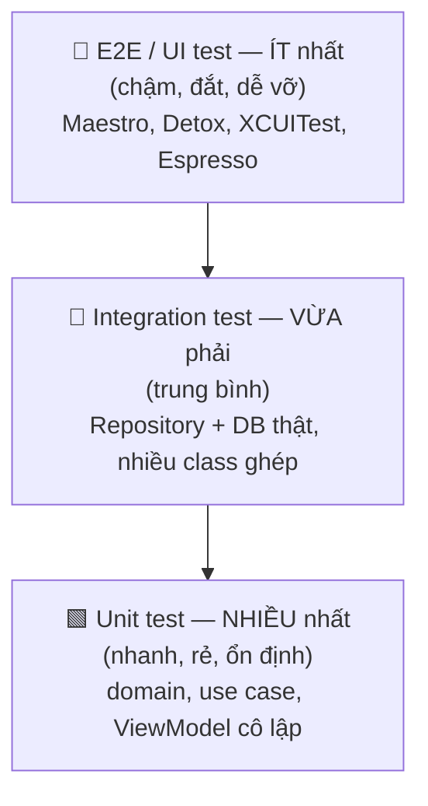
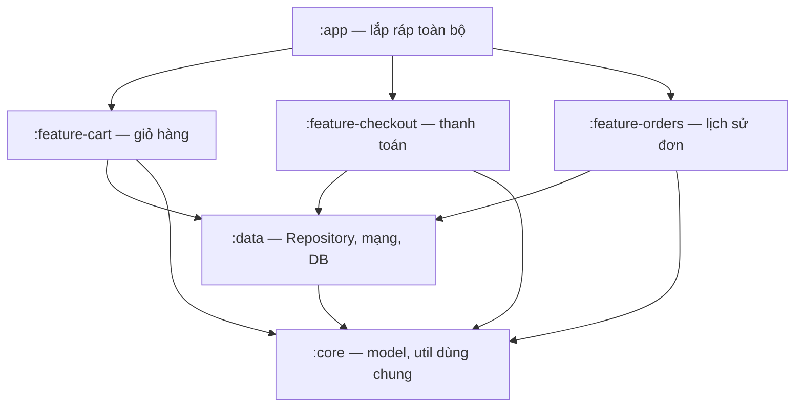

# Testing & Modularization — App mobile bền vững

> **Tác giả:** Mr.Rom\
> **Phiên bản:** v1.0.0\
> **Tạo lúc:** 13/06/2026\
> **Cập nhật:** 13/06/2026\
> **Level:** Basic\
> **Tags:** mobile, architecture, testing, test-pyramid, unit-test, ui-test, e2e, dependency-injection, hilt, koin, modularization, multi-module, clean-architecture\
> **Yêu cầu trước:** [Quản lý State & Unidirectional Data Flow](03_state-management-and-data-flow.md)

> 🎯 *Ba bài trước bạn đã tách app Acme Shop thành các tầng (Clean Architecture), chọn pattern tầng trình bày (MVVM/MVI), và để dữ liệu chảy một chiều (UDF). Cấu trúc đã đẹp — nhưng "đẹp" chỉ chứng minh được khi bạn **đổi code mà không sợ hỏng**. Bài này lắp ba mảnh giữ cho app bền vững theo thời gian: **Testing** (test pyramid — unit nhiều, UI/E2E ít — và vì sao Clean Architecture làm việc này dễ), **Dependency Injection** (vì sao DI khiến code testable, và Hilt/Koin trên Android vs manual/Factory trên iOS), và **Modularization** (tách app thành nhiều module để build nhanh hơn, ranh giới rõ hơn, nhiều người làm song song). Đây là bài cuối cụm — sau bài này bạn có một mental model hoàn chỉnh để tổ chức một app mobile bài bản.*

## 🎯 Sau bài này bạn sẽ

- [ ] Hiểu **test pyramid** — vì sao unit test nên nhiều nhất, UI/E2E ít nhất, và tỷ lệ đó tiết kiệm gì
- [ ] Viết được **unit test cho ViewModel/domain** và hiểu vì sao Clean Architecture làm việc test dễ
- [ ] Phân biệt **unit test / integration test / UI test / E2E test** — mỗi loại test cái gì, chạy ở đâu
- [ ] Hiểu **Dependency Injection** là gì, vì sao nó là điều kiện để code *testable*, và cách inject phụ thuộc bằng constructor
- [ ] Biết **Hilt/Koin** (Android) và **manual/Factory injection** (iOS) giải quyết DI ra sao
- [ ] Hiểu **modularization** (multi-module): tách theo feature/layer, lợi ích build time + ranh giới, và **khi nào** mới nên module hoá

---

## Tình huống — app chạy được, nhưng sửa một chỗ là hỏng ba chỗ

App Acme Shop của bạn đã lên đến vài chục màn hình: danh sách sản phẩm, chi tiết, giỏ hàng, thanh toán, lịch sử đơn. Code đã chia tầng gọn gàng. Mọi thứ chạy ổn trên máy bạn.

Rồi một sáng, product owner yêu cầu đổi công thức tính phí ship. Bạn sửa đúng một hàm trong tầng domain. Build, chạy lại app, bấm thử màn giỏ hàng — ổn. Bạn merge. Hai ngày sau, QA báo: màn **thanh toán** tính sai tổng tiền, và màn **lịch sử đơn** crash. Hoá ra hàm bạn sửa được ba màn hình dùng chung, và bạn chỉ kiểm tay đúng **một** màn.

Đây là nỗi đau kinh điển khi app lớn lên mà **không có lưới an toàn**:

- Sửa một chỗ, không biết mình vừa làm hỏng những chỗ nào khác.
- Mỗi lần đổi nhỏ phải mở app bấm tay qua hàng chục màn để kiểm — chậm và hay sót.
- Một thay đổi build lại **toàn bộ** app, đợi vài phút mới chạy được.
- Bốn người trong team động vào cùng một đống code, đụng nhau liên tục khi merge.

Ba thứ trong bài này lần lượt chữa từng nỗi đau đó. **Testing** là lưới an toàn tự động — máy kiểm hộ bạn trong vài giây thay vì bạn bấm tay. **Dependency Injection** là điều kiện kỹ thuật để viết được test (và để code linh hoạt hơn). **Modularization** cắt app thành nhiều mảnh độc lập — build nhanh hơn, ranh giới rõ hơn, nhiều người làm song song không đụng nhau.

> 📖 *Bắt đầu từ lưới an toàn quan trọng nhất: làm sao máy tự kiểm tra code hộ bạn, và kiểm ở mức nào thì hiệu quả nhất.*

---

## 1️⃣ Test pyramid — kiểm nhiều ở dưới, ít ở trên

**Automated test** (kiểm thử tự động) là code bạn viết để kiểm chính code sản phẩm: cho input đã biết, kiểm output có đúng kỳ vọng không. Máy chạy chúng trong vài giây mỗi lần bạn đổi code — thay cho việc bạn ngồi bấm tay qua từng màn hình.

Nhưng không phải loại test nào cũng như nhau. Có loại nhanh và rẻ, có loại chậm và đắt. **Test pyramid** (kim tự tháp kiểm thử) là một mô hình kinh điển (do Mike Cohn đề xuất) trả lời câu hỏi: *nên viết loại test nào nhiều, loại nào ít?*

🪞 **Ẩn dụ**: Test pyramid như **cách kiểm tra một chiếc xe trước khi xuất xưởng**. Bạn kiểm *từng linh kiện* (bugi, lốp, phanh) rất nhiều và rất nhanh — đó là *unit test*. Bạn lắp cụm động cơ rồi kiểm *cả cụm chạy ăn khớp không* — ít hơn, lâu hơn — đó là *integration test*. Cuối cùng bạn **lái thử cả chiếc xe trên đường** — chỉ vài lần, tốn nhiều thời gian nhất — đó là *E2E test*. Không ai lái thử cả xe 1000 lần để kiểm con bugi; kiểm con bugi riêng vừa nhanh vừa chỉ đúng chỗ.

Pyramid chia test thành các tầng, từ dưới lên trên: **càng lên cao càng ít, càng chậm, càng đắt; càng xuống thấp càng nhiều, càng nhanh, càng rẻ**.

Trước khi xem sơ đồ, đây là ba tầng chính (tên gọi có thể khác nhau giữa các nguồn, nhưng tinh thần thống nhất):

- **Unit test** (kiểm đơn vị) — kiểm **một** hàm/class **cô lập**, không chạm mạng, database hay UI. Cực nhanh (mili-giây), chạy hàng nghìn cái trong vài giây. Đây là tầng đáy, viết nhiều nhất.
- **Integration test** (kiểm tích hợp) — kiểm **nhiều thành phần ghép với nhau** chạy đúng không (ví dụ: Repository + database thật). Chậm hơn unit, viết vừa phải.
- **UI test / E2E test** (kiểm giao diện / đầu-cuối) — kiểm **cả luồng người dùng** trên app thật/giả lập (mở app → bấm → thấy kết quả). Chậm nhất, dễ vỡ nhất, viết ít nhất — chỉ cho các luồng quan trọng (đăng nhập, thanh toán).

Sơ đồ dưới là hình dạng "kim tự tháp" — chiều rộng mỗi tầng tượng trưng cho **số lượng test** nên có ở tầng đó:



→ Điểm cốt lõi từ sơ đồ: phần lớn niềm tin vào code nên đến từ **tầng đáy** (unit test) vì nó nhanh và ổn định. E2E test có giá trị (chứng minh "cả app chạy thật"), nhưng đắt và hay vỡ vì lý do vớ vẩn (UI dịch 2 pixel, mạng chậm), nên chỉ dành cho vài luồng sống còn. Một bộ test "ngược pyramid" — toàn E2E, ít unit — chạy chậm và hay đỏ vô cớ, lâu dần team mất niềm tin và bỏ luôn.

Bảng so sánh thẳng ba tầng để bạn biết viết loại nào lúc nào:

| Loại test | Kiểm cái gì | Tốc độ | Chạy ở đâu | Nên viết |
|---|---|---|---|---|
| **Unit** | 1 hàm/class cô lập (domain, ViewModel) | Mili-giây | JVM / máy build (không cần thiết bị) | Nhiều nhất (~70%) |
| **Integration** | Nhiều class ghép (Repository + DB) | Vài chục ms – giây | Có thể cần giả lập/DB | Vừa phải (~20%) |
| **UI / E2E** | Cả luồng người dùng trên app | Giây – phút | Emulator / thiết bị thật | Ít nhất (~10%) |

> [!NOTE]
> Tỷ lệ 70/20/10 chỉ là kim chỉ nam, không phải con số phải đếm chính xác. Ý chính: **đa số test nên ở tầng đáy** vì rẻ và nhanh, chỉ một phần nhỏ ở đỉnh. Một số team hiện đại dùng biến thể "testing trophy" (nhấn mạnh integration test hơn) — nhưng tinh thần "ít E2E, nhiều test cấp thấp" vẫn giữ nguyên.

> 📖 *Hiểu nên viết loại test nào nhiều rồi, giờ ta viết thử tầng đáy — unit test — và sẽ thấy ngay vì sao kiến trúc tách tầng khiến việc này dễ.*

---

## 2️⃣ Unit test domain & ViewModel — và vì sao Clean Architecture giúp

Tầng đáy pyramid là nơi bạn đầu tư nhiều nhất, nên hãy hiểu thật rõ. **Unit test** kiểm một đơn vị code **cô lập** — không gọi mạng, không chạm database, không dựng UI. Vì cô lập nên nó chạy trong mili-giây và **không bao giờ đỏ vì lý do bên ngoài** (mạng rớt, server lỗi). Nó đỏ chỉ khi logic của bạn thật sự sai.

Đây chính là chỗ **Clean Architecture** (bài 2 trong cụm) trả công: nếu tầng **domain** (use case, business logic) **không phụ thuộc** vào Android/iOS framework, mạng, hay database, thì bạn test nó **không cần thiết bị, không cần mock cả thế giới** — chỉ gọi hàm với input và kiểm output.

🪞 **Ẩn dụ**: Tầng domain tách sạch giống một **công thức nấu ăn viết ra giấy**. Bạn kiểm công thức ("3 trứng + 200g bột ra mấy cái bánh?") mà *không cần* bật bếp, đi chợ, hay rửa chảo. Nếu công thức bị trộn lẫn với "đi chợ" và "bật bếp" (logic dính vào mạng/UI), muốn kiểm một phép tính bạn phải dựng nguyên căn bếp — chậm và phiền.

### Ví dụ 1: unit test một hàm domain thuần

Bắt đầu từ thứ dễ nhất: một hàm domain tính phí ship cho Acme Shop (chính cái hàm gây sự cố ở đầu bài). Vì là logic thuần, không dính framework, test nó cực gọn. Ví dụ viết bằng Kotlin với JUnit:

```kotlin
// --- Code sản phẩm (tầng domain) ---
// Phí ship: free khi đơn >= 500k, ngược lại 30k.
class TinhPhiShip {
    fun tinh(tongTienDon: Long): Long {
        return if (tongTienDon >= 500_000L) 0L else 30_000L
    }
}

// --- Unit test ---
import org.junit.Assert.assertEquals
import org.junit.Test

class TinhPhiShipTest {

    private val tinhPhiShip = TinhPhiShip()

    @Test
    fun `don tu 500k tro len thi mien phi ship`() {
        // given: đơn 500k
        val phi = tinhPhiShip.tinh(tongTienDon = 500_000L)
        // then: miễn phí
        assertEquals(0L, phi)
    }

    @Test
    fun `don duoi 500k thi tinh phi 30k`() {
        val phi = tinhPhiShip.tinh(tongTienDon = 499_000L)
        assertEquals(30_000L, phi)
    }
}
```

Mỗi test theo mẫu **AAA** — *Arrange* (chuẩn bị input), *Act* (gọi hàm cần kiểm), *Assert* (so output với kỳ vọng). Hai test trên chạy trong mili-giây, không cần emulator. Nếu ai đó đổi `500_000` thành `600_000`, test `don tu 500k tro len thi mien phi ship` đỏ **ngay** — bạn biết liền trước khi merge, đúng cái sự cố đầu bài.

> [!TIP]
> Trên Kotlin/JUnit, tên hàm test được phép đặt trong dấu backtick `` ` ` `` để viết câu mô tả có dấu cách (`fun \`don duoi 500k thi tinh phi 30k\`()`). Trên Swift (XCTest) tên hàm phải bắt đầu bằng `test` và viết liền (`func testDonDuoi500kTinhPhi30k()`). Tên test rõ ràng = tài liệu sống: đọc tên là biết test kiểm gì.

### Ví dụ 2: unit test ViewModel — nơi đụng đến phụ thuộc

ViewModel khó test hơn hàm thuần vì nó **gọi Repository** (vốn gọi mạng/DB). Nếu để ViewModel tự tạo Repository thật bên trong, test sẽ phải gọi mạng thật — chậm, hay đỏ, và không cô lập. Cách giải: **truyền Repository vào từ ngoài** (constructor injection — đúng phần DI ở mục 3), rồi trong test ta **thay** Repository thật bằng một *fake* (bản giả trả dữ liệu định sẵn).

Đây là một ViewModel danh sách sản phẩm Acme, viết theo pattern UDF của bài trước. Nó nhận `repository` qua constructor:

```kotlin
import androidx.lifecycle.ViewModel
import androidx.lifecycle.viewModelScope
import kotlinx.coroutines.flow.MutableStateFlow
import kotlinx.coroutines.flow.StateFlow
import kotlinx.coroutines.flow.asStateFlow
import kotlinx.coroutines.launch

// 3 trạng thái có thể của màn hình
sealed interface ProductUiState {
    data object Loading : ProductUiState
    data class Success(val products: List<Product>) : ProductUiState
    data class Error(val message: String) : ProductUiState
}

// Interface — ViewModel chỉ biết "có nơi lấy sản phẩm", không biết là mạng hay DB
interface ProductRepository {
    suspend fun layDanhSach(): List<Product>
}

class ProductViewModel(
    private val repository: ProductRepository,   // ⬅ inject vào, KHÔNG tự new
) : ViewModel() {

    private val _uiState = MutableStateFlow<ProductUiState>(ProductUiState.Loading)
    val uiState: StateFlow<ProductUiState> = _uiState.asStateFlow()

    fun taiSanPham() {
        viewModelScope.launch {
            _uiState.value = ProductUiState.Loading
            try {
                val ds = repository.layDanhSach()
                _uiState.value = ProductUiState.Success(ds)
            } catch (e: Exception) {
                _uiState.value = ProductUiState.Error(e.message ?: "Lỗi tải sản phẩm")
            }
        }
    }
}
```

Vì `repository` được **inject** qua constructor (không `new` cứng bên trong), test có thể đưa vào một fake. Test dưới kiểm hai luồng: thành công (Repository trả danh sách) và lỗi (Repository ném exception). Để ý cách dùng `runTest` để chạy coroutine đồng bộ trong test:

```kotlin
import kotlinx.coroutines.Dispatchers
import kotlinx.coroutines.test.StandardTestDispatcher
import kotlinx.coroutines.test.resetMain
import kotlinx.coroutines.test.runTest
import kotlinx.coroutines.test.setMain
import org.junit.After
import org.junit.Assert.assertEquals
import org.junit.Assert.assertTrue
import org.junit.Before
import org.junit.Test

// FAKE Repository — trả dữ liệu định sẵn, KHÔNG gọi mạng thật.
class FakeProductRepository(
    private val ketQua: List<Product> = emptyList(),
    private val nemLoi: Boolean = false,
) : ProductRepository {
    override suspend fun layDanhSach(): List<Product> {
        if (nemLoi) throw RuntimeException("Mạng lỗi")
        return ketQua
    }
}

class ProductViewModelTest {

    // viewModelScope chạy trên Dispatchers.Main — trong test phải thay bằng test dispatcher
    private val testDispatcher = StandardTestDispatcher()

    @Before
    fun setUp() {
        Dispatchers.setMain(testDispatcher)
    }

    @After
    fun tearDown() {
        Dispatchers.resetMain()
    }

    @Test
    fun `tai thanh cong thi state la Success voi dung danh sach`() = runTest {
        // given: fake trả về 2 sản phẩm
        val sanPham = listOf(
            Product(id = 1, name = "iPhone 15", price = 28_000_000L),
            Product(id = 2, name = "iPad Air", price = 16_000_000L),
        )
        val viewModel = ProductViewModel(FakeProductRepository(ketQua = sanPham))

        // when: tải sản phẩm
        viewModel.taiSanPham()
        testDispatcher.scheduler.advanceUntilIdle()   // chạy hết coroutine đang chờ

        // then: state là Success và chứa đúng 2 sản phẩm
        val state = viewModel.uiState.value
        assertTrue(state is ProductUiState.Success)
        assertEquals(2, (state as ProductUiState.Success).products.size)
    }

    @Test
    fun `tai loi thi state chuyen sang Error`() = runTest {
        // given: fake ném exception
        val viewModel = ProductViewModel(FakeProductRepository(nemLoi = true))

        // when
        viewModel.taiSanPham()
        testDispatcher.scheduler.advanceUntilIdle()

        // then: state là Error
        assertTrue(viewModel.uiState.value is ProductUiState.Error)
    }
}
```

Hai test này chạy **trên JVM, không cần thiết bị**, và xong trong tích tắc. Chúng chứng minh ViewModel xử lý đúng cả khi mạng OK lẫn khi mạng lỗi — mà **không** cần server thật, không cần mạng. Đây là sức mạnh kép của **Clean Architecture** (tách tầng) + **DI** (inject phụ thuộc): bạn thay được "thế giới bên ngoài" bằng fake để cô lập đơn vị đang kiểm.

Vài điểm đáng soi trong code test:

- **`runTest { }`** chạy coroutine trong môi trường test, kiểm soát thời gian ảo — không phải chờ thật.
- **`Dispatchers.setMain(testDispatcher)`** thay luồng `Main` (mặc định `viewModelScope` chạy trên đó, vốn không tồn tại ngoài Android) bằng dispatcher test.
- **`FakeProductRepository`** là *test double* (vật thế thân khi test): nó implement đúng interface `ProductRepository` nhưng trả dữ liệu định sẵn. Nhờ ViewModel nhận interface (không phải class cụ thể), việc thay này hợp lệ.

> 📖 *Mấu chốt khiến test trên làm được là "inject Repository từ ngoài thay vì tự tạo bên trong". Đó chính là Dependency Injection — mục tiếp theo nói rõ nó là gì và vì sao quan trọng đến vậy.*

---

## 3️⃣ Dependency Injection — vì sao code mới testable

Hãy nhìn lại điều vừa làm. ViewModel **không tự tạo** Repository; ai đó **đưa** Repository cho nó qua constructor. Kỹ thuật "đưa phụ thuộc từ ngoài vào thay vì để class tự tạo" gọi là **Dependency Injection** (DI — tiêm phụ thuộc).

Xem cụ thể vì sao "tự tạo" lại tệ. So sánh hai cách ViewModel có được Repository:

```kotlin
// ❌ Tự tạo phụ thuộc bên trong — KHÓ test
class ProductViewModel : ViewModel() {
    // ViewModel tự "new" Repository thật -> dính cứng vào mạng/DB.
    private val repository = ProductRepositoryImpl(AcmeNetwork.api)

    // Khi test, KHÔNG có cách nào thay repository này bằng fake.
    // -> test buộc phải gọi mạng thật -> chậm, đỏ vô cớ, không cô lập.
}

// ✅ Inject phụ thuộc từ ngoài — DỄ test
class ProductViewModel(
    private val repository: ProductRepository,   // nhận từ ngoài, chỉ biết interface
) : ViewModel() {
    // Khi chạy thật: đưa ProductRepositoryImpl (gọi mạng).
    // Khi test: đưa FakeProductRepository (trả dữ liệu định sẵn).
}
```

→ Khác biệt cốt lõi: bản `✅` cho phép bạn **thay phụ thuộc** tuỳ ngữ cảnh. Chạy thật thì đưa bản gọi mạng; test thì đưa fake. Bản `❌` khoá chết Repository thật bên trong — không thay được, nên không test cô lập được.

DI không chỉ phục vụ test. Nó còn **tách việc tạo object ra khỏi việc dùng object**: ViewModel chỉ *dùng* Repository, không cần biết Repository được tạo thế nào (cần API client gì, config gì). Một nơi khác lo phần "tạo". Nhờ đó đổi cách tạo (ví dụ thêm cache) không phải sửa ViewModel.

🪞 **Ẩn dụ**: DI giống **ổ cắm điện trong nhà**. Cái đèn (ViewModel) không tự phát điện — nó chỉ có **phích cắm** (constructor) và cắm vào ổ. Nguồn điện (Repository) đến từ đâu — điện lưới, máy phát, hay pin dự phòng khi test — cái đèn không quan tâm, miễn đúng chuẩn phích cắm (interface). Muốn thử đèn mà không cần điện lưới? Cắm vào pin (fake). Nếu đèn **hàn cứng** dây vào đường điện lưới (tự new), bạn không tài nào thử nó ở chỗ khác.

### DI bằng tay (manual injection) — nền tảng ai cũng nên hiểu

Trước khi nói tới framework, hãy thấy DI **không cần** thư viện gì cả — bản chất chỉ là "truyền tham số vào constructor". Một nơi (thường gần điểm khởi động app) đứng ra lắp ráp:

```kotlin
// "Composition root" — nơi lắp ráp đồ thị phụ thuộc của app.
// Tạo từ dưới lên: API client -> Repository -> ViewModel.
val api = AcmeNetwork.api
val repository = ProductRepositoryImpl(api)         // Repository cần API
val viewModel = ProductViewModel(repository)        // ViewModel cần Repository
```

Đây là **manual DI** (DI thủ công). Với app nhỏ, viết tay như vậy là đủ và rõ ràng. Vấn đề chỉ xuất hiện khi app lớn: đồ thị phụ thuộc dài (A cần B, B cần C, C cần D...), lắp tay khắp nơi mỏi tay và dễ sai. Lúc đó framework DI giúp **tự động** lắp ráp.

### Android: Hilt hoặc Koin

Trên Android, hai lựa chọn phổ biến để tự động hoá DI:

| | **Hilt** | **Koin** |
|---|---|---|
| Bản chất | Sinh code lúc **biên dịch** (dựa trên Dagger) | Đăng ký lúc **chạy** (service locator/DSL) |
| Kiểm tra | Lỗi DI báo **lúc build** (an toàn hơn) | Lỗi DI báo **lúc chạy** |
| Cú pháp | Annotation (`@Inject`, `@HiltViewModel`, `@Module`) | DSL Kotlin (`module { ... }`, `single`, `factory`) |
| Đường cong học | Dốc hơn (khái niệm Dagger) | Dễ bắt đầu hơn |
| Hậu thuẫn | Google chính thức khuyến nghị | Cộng đồng, rất phổ biến |

Với Hilt, bạn chỉ cần đánh dấu — framework tự lắp. Ví dụ một ViewModel khai báo phụ thuộc qua constructor và Hilt tự cung cấp:

```kotlin
import dagger.hilt.android.lifecycle.HiltViewModel
import javax.inject.Inject

@HiltViewModel
class ProductViewModel @Inject constructor(
    private val repository: ProductRepository,   // Hilt tự tìm và truyền vào
) : ViewModel() {
    // ... như trên
}
```

Bạn không còn phải tự gọi `ProductViewModel(repository)` — Hilt biết `ProductRepository` lấy ở đâu (qua một `@Module` khai báo riêng) và tự ghép. Điểm quan trọng cho việc test: **dù dùng Hilt hay Koin, constructor vẫn nhận phụ thuộc qua tham số**, nên unit test vẫn cứ `new` ViewModel với fake như mục 2 — framework DI **chỉ lo phần tạo ở runtime**, không cản trở test.

### iOS: manual / Factory injection

Hệ sinh thái iOS không có một framework DI "mặc định" thống trị như Hilt. Đa số app iOS dùng **manual injection** (truyền qua `init`) hoặc một **Factory/Container** tự viết hoặc thư viện nhẹ. Bản chất giống hệt Kotlin — truyền phụ thuộc qua hàm khởi tạo:

```swift
// Protocol = interface ở Swift. ViewModel chỉ biết "có nơi lấy sản phẩm".
protocol ProductRepository {
    func layDanhSach() async throws -> [Product]
}

@Observable
final class ProductViewModel {
    private let repository: ProductRepository   // ⬅ inject qua init

    // Inject từ ngoài — chạy thật đưa bản gọi mạng, test đưa fake.
    init(repository: ProductRepository) {
        self.repository = repository
    }
}

// Lắp ráp ở composition root (thật):
let viewModel = ProductViewModel(repository: ProductRepositoryImpl())

// Trong test:
// let viewModel = ProductViewModel(repository: FakeProductRepository())
```

→ Dù là Hilt (Android, compile-time), Koin (Android, runtime), hay manual `init` (iOS), **nguyên tắc bất biến** giống nhau: class **nhận** phụ thuộc qua interface/protocol từ ngoài, **không tự tạo** bản cụ thể bên trong. Có thế mới thay được bằng fake khi test — DI và testability là hai mặt của một đồng xu.

> [!IMPORTANT]
> DI **không bắt buộc** phải có framework. Với app nhỏ/vừa, manual injection (truyền qua constructor) là đủ và rõ ràng nhất. Chỉ đưa Hilt/Koin vào khi đồ thị phụ thuộc đủ lớn để việc lắp tay trở nên mệt và dễ sai. Đừng thêm framework chỉ vì "ai cũng dùng".

> 📖 *Test đã có lưới an toàn, DI đã làm code lắp ráp linh hoạt. Mảnh cuối là tổ chức code ở quy mô lớn: khi một thư mục `src/` không còn đủ, ta cắt app thành nhiều module.*

---

## 4️⃣ Modularization — cắt app thành nhiều module

Khi Acme Shop còn nhỏ, toàn bộ code nằm trong **một module** (một khối build duy nhất). Khi app phình to — vài chục feature, vài người làm — một module gây ra loạt vấn đề: đổi **một dòng** cũng build lại **cả app** (chậm), ranh giới giữa các phần mờ (màn thanh toán lỡ tay gọi thẳng vào nội bộ màn giỏ hàng), và bốn người cùng động vào một đống code thì merge đụng nhau liên tục.

**Modularization** (mô-đun hoá) là cắt app thành **nhiều module** — mỗi module là một khối build độc lập, chỉ phụ thuộc vào những module nó **khai báo rõ**. Trên Android, mỗi module là một Gradle module; trên iOS, thường là Swift Package hoặc framework riêng.

🪞 **Ẩn dụ**: App một module giống một **căn nhà một phòng lớn** chứa tất cả — bếp, giường, bàn làm việc lẫn lộn. Sửa cái bếp là khói bay khắp nhà, và hai người cùng dọn là vướng nhau. Modularization là **chia thành nhiều phòng có cửa**: phòng bếp (feature giỏ hàng), phòng ngủ (feature thanh toán), hành lang chung (module `core`). Mỗi người làm một phòng, cửa (interface module) quy định ai vào phòng nào — sửa bếp không ám khói phòng ngủ.

### Hai cách cắt module: theo layer và theo feature

Có hai trục để cắt, thường kết hợp cả hai:

- **Cắt theo layer** (tầng) — `:domain`, `:data`, `:presentation`. Khớp thẳng với Clean Architecture: domain không phụ thuộc ai, data phụ thuộc domain, presentation phụ thuộc cả hai. Hợp với app nhỏ-vừa.
- **Cắt theo feature** (tính năng) — `:feature-cart`, `:feature-checkout`, `:feature-orders`, cộng các module chung `:core`, `:data`. Mỗi feature gần như độc lập, đội nào làm feature đó. Hợp với app lớn, nhiều người.

Sơ đồ dưới minh hoạ một cấu trúc multi-module **theo feature** của Acme Shop. Mũi tên là hướng phụ thuộc ("phụ thuộc vào"); để ý các feature **không** phụ thuộc lẫn nhau, chỉ cùng dựa lên `:core` và `:data`:



→ Điểm cốt lõi từ sơ đồ: phụ thuộc chỉ chảy **một chiều** (feature → data → core), **không có vòng lặp**, và các feature **cô lập** với nhau. Vì `:feature-cart` không thấy được nội bộ `:feature-checkout`, bạn không thể vô tình gọi nhầm — ranh giới được **trình biên dịch ép buộc**, không chỉ là quy ước trên giấy.

### Multi-module được lợi gì

Ba lợi ích lớn, gắn thẳng vào ba nỗi đau đầu bài:

| Lợi ích | Giải thích | Chữa nỗi đau nào |
|---|---|---|
| **Build nhanh hơn** | Đổi `:feature-cart` chỉ build lại module đó + nơi dùng nó, không build cả app. Module không đổi được **cache** lại. | "Đổi 1 dòng build cả app, đợi vài phút" |
| **Ranh giới rõ ràng** | Module chỉ thấy thứ nó khai báo phụ thuộc. Trình biên dịch chặn việc gọi xuyên ranh giới bậy. | "Lỡ tay gọi thẳng nội bộ module khác" |
| **Làm song song** | Đội A làm `:feature-cart`, đội B làm `:feature-checkout`, hiếm khi đụng cùng file. | "Bốn người động một đống code, merge đụng nhau" |

### Khi nào nên (và chưa nên) module hoá

Modularization là công cụ mạnh, nhưng có cái giá: nhiều file cấu hình build hơn, cần khai báo phụ thuộc tường minh, và một app **quá nhỏ** mà cắt module sớm chỉ tổ thêm việc mà chưa hái được lợi. Đây là vùng quyết định **WHEN** của bài:

| Tình huống | Khuyến nghị |
|---|---|
| App mới, vài màn hình, 1 người làm | **Một module** + chia package theo tầng (`domain/`, `data/`, `ui/`) là đủ. Đừng cắt sớm. |
| App lớn dần, build bắt đầu chậm | Bắt đầu cắt theo **layer** (`:domain`, `:data`, `:app`) — cú đầu tiên dễ và lợi ngay. |
| App nhiều feature, nhiều người/đội | Cắt theo **feature** (`:feature-*` + `:core` + `:data`) để các đội làm song song. |
| Có thư viện dùng lại nhiều app | Tách thành module/package riêng để chia sẻ. |

> [!WARNING]
> Cạm bẫy phổ biến: module hoá **quá sớm** hoặc **quá nhỏ**. Cắt một app 5 màn hình thành 12 module không làm build nhanh hơn đáng kể, mà mỗi thay đổi nhỏ phải sửa nhiều file `build.gradle.kts`/`Package.swift`. Quy tắc: **bắt đầu bằng một module, tách ra khi nỗi đau (build chậm / đụng độ merge) thực sự xuất hiện** — đừng tách vì "kiến trúc đẹp".

→ Ráp lại bức tranh bền vững: **Testing** cho bạn lưới an toàn để đổi code không sợ, **DI** làm code đủ linh hoạt để viết được test (và đổi phụ thuộc dễ), **Modularization** giữ ranh giới rõ và build nhanh khi app lớn. Ba thứ này phối hợp với Clean Architecture + UDF ở các bài trước thành một app mobile có thể sống và lớn theo năm tháng mà không sụp dưới sức nặng của chính nó.

---

## 💡 Cạm bẫy thường gặp & Best practice

### ❌ Cạm bẫy: "Ngược pyramid" — viết toàn E2E, bỏ unit test

- **Triệu chứng**: Bộ test chủ yếu là UI/E2E test, rất ít unit test. Suite chạy hàng chục phút, hay đỏ vì lý do vớ vẩn (mạng chậm, UI dịch vài pixel, emulator giật). Lâu dần team mất niềm tin, bỏ chạy test, hoặc "tắt cho qua".
- **Nguyên nhân**: E2E test "trông giống thật" nên cảm giác đáng tin hơn, nhiều người dồn sức vào đó. Nhưng nó chậm và **dễ vỡ** (flaky) vì phụ thuộc quá nhiều thứ ngoài tầm kiểm soát.
- **Cách tránh**: Theo test pyramid — đẩy phần lớn niềm tin xuống **unit test** (nhanh, ổn định), dành E2E cho vài luồng sống còn (đăng nhập, thanh toán). Logic phức tạp test ở tầng domain bằng unit test, không cố kiểm qua UI.

### ❌ Cạm bẫy: Tự `new` phụ thuộc bên trong class (không inject)

- **Triệu chứng**: ViewModel/class tự `new ProductRepositoryImpl(...)` bên trong. Khi viết test thấy "không có cách nào thay Repository bằng fake", buộc phải gọi mạng/DB thật — test chậm, hay đỏ, không cô lập.
- **Nguyên nhân**: Class **tạo cứng** phụ thuộc cụ thể bên trong, khoá chết nó vào một bản hiện thực duy nhất. Không có "khe" để chèn bản khác lúc test.
- **Cách tránh**: **Inject** phụ thuộc qua constructor/`init`, và nhận **interface/protocol** thay vì class cụ thể. Khi test, đưa fake; khi chạy thật, đưa bản thật (tay hoặc qua Hilt/Koin). Đây là điều kiện kỹ thuật để test cô lập.

### ✅ Best practice: Test logic ở tầng domain, không qua UI

- **Vì sao**: Logic nghiệp vụ (tính giá, áp mã giảm, kiểm điều kiện) là thứ dễ sai và quan trọng nhất. Test nó ở tầng domain (unit test thuần) thì nhanh, ổn định, và đỏ chính xác chỗ sai. Cố kiểm cùng logic đó qua UI (E2E) thì chậm và che mất nguyên nhân thật.
- **Cách áp dụng**: Giữ tầng domain **sạch framework** (Clean Architecture). Đẩy logic ra khỏi ViewModel/UI vào use case/domain class thuần. Viết unit test phủ các nhánh logic (biên, lỗi, trường hợp đặc biệt) ở đó.

### ✅ Best practice: Bắt đầu một module, tách khi thật sự đau

- **Vì sao**: Modularization có cái giá (cấu hình build, khai báo phụ thuộc). Cắt quá sớm/quá nhỏ tốn công mà chưa lợi. Tách khi đã có nỗi đau cụ thể (build chậm, đụng độ merge) thì lợi ích rõ và bạn biết cắt ở đâu cho đúng.
- **Cách áp dụng**: App mới → một module, chia package theo tầng. Build chậm → tách theo layer trước (`:domain`, `:data`, `:app`). Nhiều đội → tách theo feature (`:feature-*`). Luôn giữ phụ thuộc một chiều, không vòng lặp.

---

## 🧠 Tự kiểm tra (Self-check)

**Q1.** Vì sao test pyramid khuyên viết unit test **nhiều nhất** và E2E test **ít nhất**?

<details>
<summary>💡 Xem giải thích</summary>

Unit test **nhanh** (mili-giây), **rẻ**, và **ổn định** — chỉ đỏ khi logic thật sự sai, không đỏ vì mạng/UI. Nên phần lớn niềm tin vào code nên đến từ tầng này.

E2E/UI test **chậm** (giây–phút), **đắt**, và **dễ vỡ** (flaky) vì phụ thuộc nhiều thứ ngoài tầm kiểm soát (mạng, emulator, vị trí pixel). Một bộ test "ngược pyramid" (toàn E2E) chạy chậm và hay đỏ vô cớ → team mất niềm tin và bỏ test. Vì vậy E2E chỉ dành cho vài luồng sống còn (đăng nhập, thanh toán).

</details>

**Q2.** Clean Architecture giúp việc unit test dễ hơn ở chỗ nào?

<details>
<summary>💡 Xem giải thích</summary>

Clean Architecture tách tầng **domain** (use case, business logic) **không phụ thuộc** vào framework Android/iOS, mạng, hay database. Vì cô lập như vậy, bạn test domain **không cần thiết bị, không cần mock cả thế giới** — chỉ gọi hàm với input và kiểm output. Logic quan trọng nhất (dễ sai nhất) trở thành dễ test nhất.

</details>

**Q3.** Dependency Injection là gì, và vì sao nó là điều kiện để viết được unit test cho ViewModel?

<details>
<summary>💡 Xem giải thích</summary>

DI là kỹ thuật **đưa phụ thuộc từ ngoài vào** (qua constructor/`init`) thay vì để class **tự tạo** bên trong, và class nhận **interface** thay vì class cụ thể.

Nhờ inject, khi test ta **thay** Repository thật (gọi mạng/DB) bằng một **fake** trả dữ liệu định sẵn — nên test chạy cô lập, nhanh, không cần mạng. Nếu ViewModel tự `new` Repository thật bên trong, không có "khe" nào để chèn fake → buộc gọi mạng thật → không test cô lập được.

</details>

**Q4.** Hilt và Koin khác nhau chính ở điểm nào? Việc dùng framework DI có cản trở unit test không?

<details>
<summary>💡 Xem giải thích</summary>

**Hilt** sinh code và kiểm tra DI lúc **biên dịch** (lỗi DI báo lúc build, an toàn hơn); **Koin** đăng ký và phân giải lúc **chạy** (lỗi DI báo lúc chạy, nhưng dễ bắt đầu hơn, cú pháp DSL Kotlin).

Không cản trở test. Dù Hilt hay Koin, ViewModel vẫn nhận phụ thuộc **qua constructor**, nên unit test cứ `new` ViewModel với fake như bình thường. Framework DI chỉ lo phần **tạo/lắp ráp lúc runtime**, không can thiệp vào việc test cô lập.

</details>

**Q5.** Khi nào **chưa** nên module hoá một app? Khi nào thì nên, và nên cắt theo gì trước?

<details>
<summary>💡 Xem giải thích</summary>

**Chưa nên** khi app còn nhỏ (vài màn hình, 1 người làm) — một module + chia package theo tầng là đủ. Cắt sớm/cắt quá nhỏ tốn công cấu hình build mà chưa hái được lợi.

**Nên** khi nỗi đau thực sự xuất hiện: build chậm dần, hoặc nhiều người/đội đụng độ merge. Cú tách đầu tiên dễ nhất là **theo layer** (`:domain`, `:data`, `:app`) — lợi ngay. Khi nhiều feature/nhiều đội thì cắt **theo feature** (`:feature-*` + `:core` + `:data`) để làm song song.

</details>

---

## ⚡ Tra cứu nhanh (Cheatsheet)

| Mục đích | Cú pháp / Khái niệm |
|---|---|
| Tầng test (từ nhiều → ít) | Unit → Integration → UI/E2E |
| Mẫu một unit test | Arrange (chuẩn bị) → Act (gọi) → Assert (so kết quả) |
| Unit test Kotlin (JUnit) | `@Test fun \`mô tả test\`() { assertEquals(mongDoi, thucTe) }` |
| Unit test Swift (XCTest) | `func testMoTa() { XCTAssertEqual(mongDoi, thucTe) }` |
| Test coroutine (Kotlin) | `@Test fun x() = runTest { ... }` |
| Thay Main dispatcher khi test | `Dispatchers.setMain(testDispatcher)` / `resetMain()` |
| Chạy hết coroutine chờ | `testDispatcher.scheduler.advanceUntilIdle()` |
| UI test Android | Espresso / Compose UI test (`composeTestRule`) |
| UI test iOS | XCUITest (`XCUIApplication`) |
| E2E (cross-platform) | Maestro (YAML flow) / Detox (React Native) |
| DI thủ công | Truyền phụ thuộc qua `constructor`/`init` |
| DI Android (compile-time) | Hilt — `@HiltViewModel`, `@Inject`, `@Module` |
| DI Android (runtime) | Koin — `module { single { ... }; factory { ... } }` |
| DI iOS | manual `init` / Factory / Container tự viết |
| Module Android | Gradle module (`:feature-cart`, `:core`, `:data`) |
| Module iOS | Swift Package / framework riêng |
| Cắt module theo | Layer (`:domain/:data`) hoặc feature (`:feature-*`) |

---

## 📚 Từ Điển Thuật Ngữ (Glossary)

| EN | VN | Giải thích |
|---|---|---|
| Test pyramid | Kim tự tháp kiểm thử | Mô hình: unit test nhiều nhất, integration vừa, UI/E2E ít nhất |
| Unit test | Kiểm đơn vị | Kiểm 1 hàm/class cô lập, không chạm mạng/DB/UI; cực nhanh |
| Integration test | Kiểm tích hợp | Kiểm nhiều thành phần ghép với nhau (vd Repository + DB) |
| UI test | Kiểm giao diện | Kiểm tương tác trên UI thật/giả lập (bấm, thấy kết quả) |
| E2E test | Kiểm đầu-cuối | Kiểm cả luồng người dùng từ đầu tới cuối trên app |
| Flaky test | Test hay vỡ | Test khi đỏ khi xanh dù code không đổi (do mạng/UI bất ổn) |
| AAA | Arrange–Act–Assert | Mẫu viết test: chuẩn bị → thực thi → kiểm kết quả |
| Test double | Vật thế thân | Object giả thay bản thật khi test (fake, mock, stub) |
| Fake | Bản giả | Test double có hiện thực đơn giản, trả dữ liệu định sẵn |
| Mock | Mock | Test double ghi nhận lời gọi để kiểm "có được gọi đúng không" |
| Dependency Injection | Tiêm phụ thuộc | Đưa phụ thuộc từ ngoài vào thay vì để class tự tạo bên trong |
| Constructor injection | Tiêm qua hàm khởi tạo | Cách DI phổ biến nhất: truyền phụ thuộc qua constructor/`init` |
| Composition root | Gốc lắp ráp | Nơi (gần điểm khởi động app) lắp ráp đồ thị phụ thuộc |
| Hilt | Hilt | Framework DI Android (dựa Dagger), sinh code lúc biên dịch |
| Koin | Koin | Thư viện DI Android dạng DSL, phân giải lúc chạy |
| Factory | Factory | Mẫu tạo object qua một "nhà máy" thay vì gọi `new` trực tiếp |
| Modularization | Mô-đun hoá | Cắt app thành nhiều module độc lập, phụ thuộc khai báo rõ |
| Module | Module | Một khối build độc lập (Gradle module / Swift Package) |
| Gradle module | Gradle module | Đơn vị build trên Android (`:app`, `:feature-cart`...) |
| Swift Package | Swift Package | Đơn vị module/thư viện trên hệ sinh thái Swift/iOS |
| Maestro | Maestro | Công cụ E2E test mobile dùng file flow YAML, cross-platform |
| Detox | Detox | Framework E2E test cho app React Native |
| Espresso | Espresso | Framework UI test trên Android (View/Compose) |
| XCUITest | XCUITest | Framework UI test trên iOS (chạy app thật/giả lập) |
| XCTest | XCTest | Framework test chính thức của Apple (unit + UI) |

---

## 🔗 Liên kết & Tài nguyên

⬅️ **Bài trước:** [Quản lý State & Unidirectional Data Flow](03_state-management-and-data-flow.md)\
↑ **Về cụm:** [mobile-architecture — README cụm](../../README.md)

### 🧭 Định hướng lộ trình học

- [Quản lý State & Unidirectional Data Flow](03_state-management-and-data-flow.md) — bài trước: UDF làm state có một đường đi duy nhất, nền cho việc test ViewModel ở bài này
- [Clean Architecture & phân tầng — Domain, Data, Presentation](02_clean-architecture-and-layers.md) — lý do tầng domain dễ test, và là cơ sở để cắt module theo layer
- [MVC, MVP, MVVM, MVI — Pattern tầng trình bày](01_presentation-patterns-mvvm.md) — ViewModel testable đến từ việc tách tầng trình bày đúng cách

### 🧩 Các chủ đề có thể bạn quan tâm

- [State, Data & Navigation — ViewModel, Retrofit, Room](../../../android-kotlin/lessons/01_basic/03_state-data-and-navigation.md) — ViewModel + Repository + Room cụ thể trên Android, thứ ta test trong bài này
- [Data, State & Navigation — @Observable, networking, SwiftData](../../../ios-swift/lessons/01_basic/03_data-state-and-navigation.md) — góc nhìn iOS: `@Observable`, manual injection, networking
- [Điều hướng & state — React Navigation, hooks](../../../react-native/lessons/01_basic/02_navigation-and-state.md) — quản lý state trên React Native, nơi Detox là công cụ E2E phổ biến

### 🌐 Tài nguyên tham khảo khác

- [Martin Fowler — The Practical Test Pyramid](https://martinfowler.com/articles/practical-test-pyramid.html) — bài kinh điển giải thích test pyramid và các tầng test
- [Android Developers — Test your app](https://developer.android.com/training/testing) — hướng dẫn chính thức về unit/UI test trên Android
- [Android Developers — Dependency injection (Hilt)](https://developer.android.com/training/dependency-injection/hilt-android) — DI với Hilt
- [Android Developers — Guide to Android app modularization](https://developer.android.com/topic/modularization) — chiến lược multi-module trên Android
- [Apple — Testing your apps in Xcode (XCTest)](https://developer.apple.com/documentation/xcode/testing-your-apps-in-xcode) — unit + UI test trên iOS
- [Maestro — Mobile UI testing](https://maestro.mobile.dev/) — công cụ E2E test mobile cross-platform

---

> 🎯 *Đến đây bạn đã có đủ mảnh ghép để tổ chức một app mobile bài bản: chọn pattern tầng trình bày, phân tầng theo Clean Architecture, cho state chảy một chiều, và — ở bài này — dựng lưới an toàn bằng test (pyramid: unit nhiều, E2E ít), làm code testable + linh hoạt bằng Dependency Injection, và giữ ranh giới rõ + build nhanh bằng modularization khi app lớn. Kiến trúc không phải để "đẹp trên giấy" — nó là cách bạn đổi code mà không sợ hỏng, và để app sống lâu cùng team. Đây là bài cuối cụm; bước tiếp theo là áp những nguyên tắc này vào chính platform bạn đang dùng (Android, iOS, React Native hay Flutter).*

---

## 📌 Nhật ký thay đổi (Changelog)

- **v1.0.0 (13/06/2026)** — Bản đầu tiên. Cụm `mobile-architecture/` lesson 4/5 (basic) — bài cuối cụm, đóng module `08_mobile`. Cover: test pyramid (unit > integration > UI/E2E, tỷ lệ 70/20/10, ẩn dụ kiểm xe + bảng so sánh 3 tầng) + unit test domain thuần (mẫu AAA, JUnit) và unit test ViewModel (fake Repository, `runTest`, `Dispatchers.setMain`) + vì sao Clean Architecture làm domain dễ test + Dependency Injection (so sánh tự-new vs inject, manual DI, ẩn dụ ổ cắm điện) + Hilt vs Koin (compile-time vs runtime) + manual/Factory injection trên iOS (Swift `init`) + modularization (cắt theo layer vs feature, lợi ích build/ranh giới/song song, khi nào nên/chưa nên). 2 sơ đồ mermaid (test pyramid; multi-module theo feature với phụ thuộc một chiều). Code Kotlin (JUnit/coroutines-test) + Swift minh hoạ pattern. Cạm bẫy: ngược pyramid (toàn E2E), tự new phụ thuộc không inject.
</content>
</invoke>
