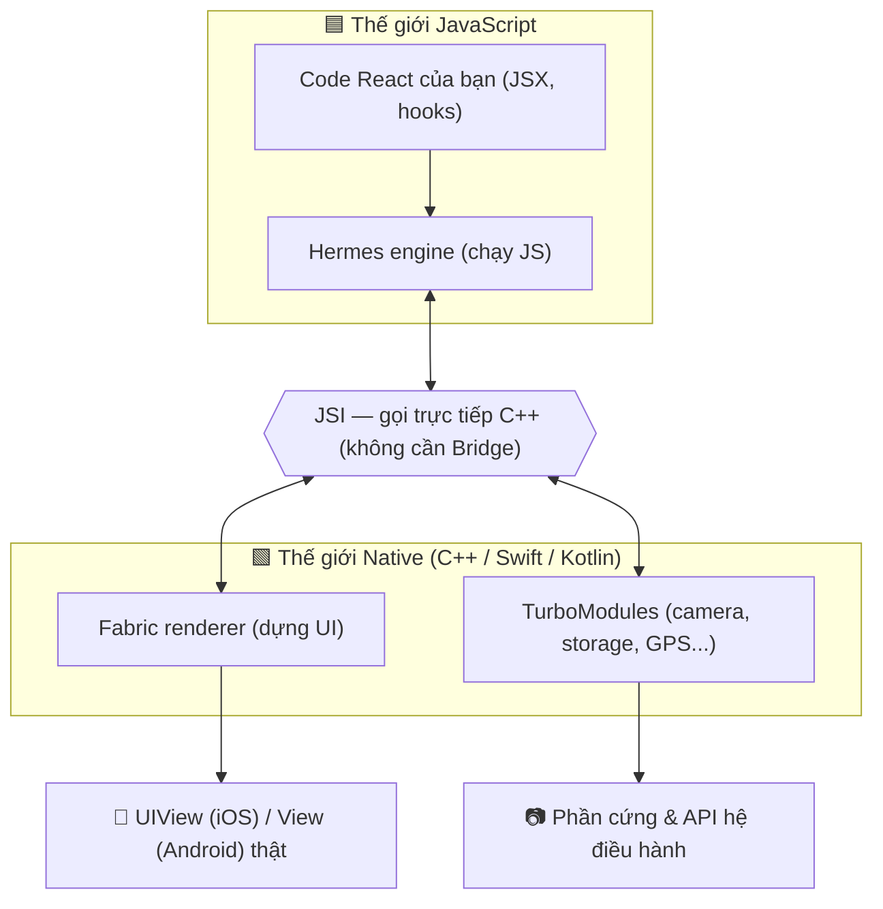

# React Native là gì? — Viết app native bằng React

> **Tác giả:** Mr.Rom\
> **Phiên bản:** v1.0.0\
> **Tạo lúc:** 13/06/2026\
> **Cập nhật:** 13/06/2026\
> **Level:** Basic\
> **Tags:** react-native, mobile, react, cross-platform, expo\
> **Yêu cầu trước:** [React là gì (web)](../../../../07_web/frontend/react/lessons/01_basic/00_what-is-react.md)

> 🎯 *Bài INTRO. Bạn đã biết React web rồi — giờ ta xem cách **dùng đúng kiến thức đó để dựng app iOS + Android native thật**. Hiểu RN là gì (render ra UI native, KHÔNG phải WebView), kiến trúc New Architecture 2026 (JSI + Fabric + TurboModules + Hermes), Expo vs bare RN, và so sánh RN với Flutter / native. KHÔNG đi sâu component (đó là bài 01).*

## 🎯 Sau bài này bạn sẽ

- [ ] Hiểu **React Native là gì** và vì sao nó render ra **UI native thật** chứ không phải WebView
- [ ] Giải thích được vì sao team chọn RN — chia sẻ code iOS + Android, tái dùng kỹ năng React
- [ ] Phân biệt **Old Architecture** (Bridge) vs **New Architecture** mặc định 2026 (JSI + Fabric + TurboModules + Hermes)
- [ ] Biết khi nào chọn **Expo** (managed) và khi nào dùng **bare React Native**
- [ ] So sánh **RN vs Flutter vs native** (Swift/Kotlin) để chọn đúng cho dự án
- [ ] Tạo project Expo đầu tiên cho Acme Shop và chạy trên điện thoại

---

## Tình huống — Acme Shop cần app mobile, gấp

Bạn vừa hoàn thành website cho Acme Shop bằng React ([cluster React web](../../../../07_web/frontend/react/lessons/01_basic/00_what-is-react.md)). Sếp gọi:

> *"Web ngon rồi. Giờ cần app trên App Store và Play Store. Khách hàng muốn bấm icon trên màn hình điện thoại, không phải gõ URL. Có push notification, camera quét mã sản phẩm nữa. Khi nào xong?"*

Bạn ngồi tính, và phát hiện vài vấn đề khó chịu:

- 😱 App **iOS** viết bằng **Swift** (Xcode). App **Android** viết bằng **Kotlin** (Android Studio). Hai ngôn ngữ, hai codebase, hai team — chi phí gấp đôi.
- 😱 Bạn biết React web, nhưng **không biết Swift cũng không biết Kotlin**. Học lại từ đầu 2 nền tảng.
- 😱 Mỗi lần đổi 1 tính năng (vd: thêm nút "Yêu thích") phải sửa **2 lần** ở 2 codebase, dễ lệch nhau.
- 😱 Mở app web trong WebView cho nhanh? → cuộn giật, không có cảm giác native, App Store hay từ chối app "chỉ là website đóng gói".

Bạn search "viết app mobile bằng React" và gặp **React Native**. Người ta nói:

- Viết **1 codebase** bằng React + JS/TS → chạy được cả iOS lẫn Android.
- UI render ra **component native thật** (UIView của iOS, View của Android), không phải HTML trong WebView.
- Dùng lại đúng tư duy React đã biết: component, props, state, JSX.
- Instagram, Discord, Shopify, Coinbase, Microsoft Office… đều có phần viết bằng RN.

Bạn ngơ ra với một loạt câu hỏi:

- React Native có phải là "React chạy trong browser của điện thoại" không?
- Nó render ra cái gì? Native thật hay giả native?
- **Expo** là gì, khác **bare React Native** ra sao?
- Nên chọn RN hay **Flutter**? Hay viết native luôn cho chắc?

→ Bài này trả lời tổng quan tất cả. Bài 01 trở đi mới đi sâu component, styling, navigation.

---

## 1️⃣ Vậy React Native là gì?

Quay lại tình huống: bạn cần 1 app chạy 2 nền tảng, mà bạn chỉ biết React. **React Native ra đời đúng để giải bài toán này.**

**React Native** (thường viết tắt **RN**) là một *framework* mã nguồn mở do **Meta (Facebook)** tạo ra năm 2015, cho phép bạn viết ứng dụng di động bằng **React + JavaScript/TypeScript**, rồi render ra **giao diện native thật** trên iOS và Android.

Điểm cốt lõi cần khắc sâu ngay: **RN KHÔNG phải WebView.** Khi bạn viết `<View>` trong RN, nó **không** trở thành thẻ `<div>` HTML trong một trình duyệt ẩn. Nó trở thành một **`UIView` thật của iOS** hoặc một **`android.view.View` thật của Android** — đúng những widget mà app Swift/Kotlin dùng. Người dùng cuộn, chạm, vuốt với cảm giác y hệt app native, vì nó *là* native.

🪞 **Ẩn dụ — RN như một biên dịch viên giữa hai phòng họp:**
> Bạn (lập trình viên React) chỉ nói **một thứ tiếng**: React/JS. Trong phòng họp có 2 khách: iOS (chỉ hiểu UIKit) và Android (chỉ hiểu View system). RN là **biên dịch viên** đứng giữa: bạn mô tả "tôi muốn một danh sách sản phẩm cuộn được", RN dịch ra **lệnh dựng UIView cho iOS** và **lệnh dựng View cho Android**. Bạn không cần học tiếng của từng khách — chỉ cần nói rõ ý với biên dịch viên.

So sánh nhanh 3 cách hiểu sai/đúng:

| Cách hiểu | Đúng/Sai | Giải thích |
|---|---|---|
| "RN là React chạy trong browser của điện thoại" | ❌ Sai | Không có browser, không có DOM, không có HTML |
| "RN là website nhét vào app (WebView)" | ❌ Sai | Đó là Cordova/Ionic kiểu cũ, KHÔNG phải RN |
| "RN render ra widget native thật, điều khiển bằng React" | ✅ Đúng | JS mô tả UI → RN dựng `UIView`/`View` thật |

→ Vì là native thật, RN cho **trải nghiệm mượt gần như app viết tay**, đồng thời giữ được **năng suất viết bằng React** mà bạn đã quen.

---

## 2️⃣ Vì sao team thật chọn React Native?

Định nghĩa thì rõ rồi, nhưng "vì sao đáng chọn" mới là thứ thuyết phục được sếp. Ba lý do lớn:

**1. Chia sẻ code giữa iOS và Android.** Phần lớn logic (gọi API, xử lý giỏ hàng, validate form) và phần lớn UI dùng **chung một codebase**. Thực tế nhiều app share được 80-95% code giữa 2 nền tảng — phần riêng chỉ là vài chỗ đặc thù (vd: icon back của iOS khác Android).

**2. Tái dùng kỹ năng React.** Bạn không học lại từ đầu. Component, props, state, hooks (`useState`, `useEffect`), JSX — y hệt React web. Khác biệt chính chỉ là **đổi tên thẻ**: `<div>` → `<View>`, `<p>`/`<span>` → `<Text>`, `` → `<Image>`. Một dev React web có thể viết RN được ngay.

**3. Vòng lặp phát triển nhanh.** Có **Fast Refresh** — sửa code, lưu file, app trên điện thoại **tự cập nhật trong tích tắc** mà không mất state, không build lại từ đầu. So với chu kỳ "sửa Swift → build Xcode → chờ" thì nhanh hơn hẳn.

Để dễ hình dung "share code" nghĩa là gì, đây là cùng một component chạy được trên cả 2 nền tảng — không có gì iOS-only hay Android-only ở đây:

```tsx
// src/components/ProductCard.tsx
// Component này chạy y hệt trên cả iOS lẫn Android — 1 lần viết, 2 nền tảng.
import { View, Text, Pressable } from 'react-native';

type Product = { id: number; name: string; price: number };

function ProductCard({
  product,
  onAddToCart,
}: {
  product: Product;
  onAddToCart: (p: Product) => void;
}) {
  return (
    <View style={{ padding: 16, borderRadius: 12, backgroundColor: '#fff' }}>
      <Text style={{ fontSize: 18, fontWeight: '600' }}>{product.name}</Text>
      <Text style={{ color: '#16a34a' }}>
        {product.price.toLocaleString('vi-VN')}đ
      </Text>
      <Pressable onPress={() => onAddToCart(product)}>
        <Text>Thêm vào giỏ</Text>
      </Pressable>
    </View>
  );
}

export default ProductCard;
```

→ Nếu bạn đã đọc bài React web, đoạn trên **trông cực kỳ quen**: vẫn là function component, vẫn destructure props, vẫn callback `onAddToCart`. Chỉ là `<div>`→`<View>`, `<h3>`→`<Text>`, `onClick`→`onPress`. Bài 01 sẽ đi sâu nhóm Core Components này.

> ⚠️ Có giới hạn: RN **không phải viên đạn bạc**. Game 3D nặng, app cần hiệu năng đồ hoạ cực cao, hoặc app dùng rất nhiều API native đặc thù chưa có thư viện sẵn → native thuần (Swift/Kotlin) vẫn hợp hơn. Phần "Khi nào nên dùng RN" ở cuối bài nói rõ.

---

## 3️⃣ Bên dưới ngầm chạy gì? — Kiến trúc React Native

Đây là phần trừu tượng nhất của bài, nên ta đi từ từ. Câu hỏi cốt lõi: **code JavaScript của bạn nói chuyện với UI native (viết bằng C++/Swift/Kotlin) bằng cách nào?**

Có 2 thế giới khác nhau cùng chạy trong 1 app RN:

- **Thế giới JS** — nơi code React của bạn chạy, trên một *JavaScript engine* (động cơ chạy JS).
- **Thế giới native** — nơi UIView/View thật được dựng, nơi camera, GPS, file system sống.

Hai thế giới này phải "nói chuyện" được với nhau. Cách chúng nói chuyện chính là điểm khác biệt lớn nhất giữa kiến trúc cũ và mới của RN.

### Old Architecture — Bridge (bất đồng bộ)

Kiến trúc cũ (trước ~2024) dùng một thứ gọi là **Bridge** (cây cầu). Mọi giao tiếp JS ↔ native phải đi qua cầu này, và có 3 nhược điểm:

- Mọi thông điệp phải **serialize thành JSON** rồi gửi qua cầu, đầu kia **parse** lại — tốn thời gian.
- Giao tiếp **bất đồng bộ (asynchronous)** — JS gửi lệnh rồi *không chờ* được kết quả ngay; phù hợp việc thường nhưng gây trễ với thao tác cần đồng bộ tức thì (vd: cuộn list mượt, animation theo ngón tay).
- Cầu là **nút thắt cổ chai (bottleneck)** — nhiều dữ liệu dồn qua cùng lúc thì nghẽn.

🪞 **Ẩn dụ:** Bridge giống như hai người ở hai bờ sông, muốn nói gì phải **viết thư, bỏ vào chai, thả trôi qua sông**. Đúng là liên lạc được, nhưng chậm và không hỏi-đáp tức thì được.

### New Architecture — mặc định 2026

Từ React Native **0.76 (cuối 2024)**, **New Architecture** trở thành **mặc định**, và 2026 nó là tiêu chuẩn cho mọi project mới. Nó thay cây cầu bằng cơ chế gọi trực tiếp, gồm 4 mảnh ghép:

- **JSI (JavaScript Interface)** — lớp C++ cho phép JS **gọi thẳng** hàm native (và ngược lại) **mà không cần serialize JSON, không cần cầu**. Đây là nền tảng của tất cả phần còn lại. 🪞 *Thay vì thả chai qua sông, giờ hai bờ có một **cây cầu đi bộ** — bước qua gọi trực tiếp, có thể đồng bộ.*
- **Fabric** — *renderer* (bộ dựng UI) mới, viết bằng C++, dựng cây UI native nhanh hơn và hỗ trợ render đồng bộ (giúp layout/đo đạc chính xác, ít giật).
- **TurboModules** — cơ chế mới cho **native module** (module gọi tính năng native như camera, storage). Nạp **lười (lazy)** — chỉ load module khi thật sự dùng → app khởi động nhanh hơn.
- **Hermes** — *JavaScript engine* do Meta viết riêng cho mobile, tối ưu để **khởi động nhanh** và **tốn ít RAM**. Từ 2026 đây là engine mặc định của RN.

Để thấy rõ "ai nói chuyện với ai", sơ đồ dưới mô tả luồng của New Architecture — tâm điểm là **JSI** nối hai thế giới:



→ Mấu chốt: **JSI là cây cầu trực tiếp** thay cho Bridge cũ. Nhờ nó, Fabric dựng UI và TurboModules gọi native nhanh hơn, đồng bộ hơn — đó là lý do app RN 2026 mượt hơn nhiều so với vài năm trước.

> 💡 Beginner **không cần thuộc lòng** 4 mảnh này. Chỉ cần nhớ: 2026 mặc định là New Architecture, nó nhanh hơn kiến trúc Bridge cũ, và bạn gần như không phải đụng tay vào — Expo/RN lo phần này. Khi đọc thư viện ngoài, gặp dòng "supports New Architecture" thì bạn biết là tương thích chuẩn mới.

---

## 4️⃣ Expo vs bare React Native — chọn đường nào để bắt đầu?

Khi bắt tay làm app Acme Shop, bạn sẽ phải chọn **cách dựng project**. Có 2 hướng, và đây là quyết định đầu tiên cần hiểu rõ.

**Bare React Native** (RN "trần") là cách cài thẳng từ `react-native community CLI`. Bạn có **toàn quyền** với code native iOS (Xcode) và Android (Android Studio), nhưng đổi lại **bạn tự lo hết**: cài Xcode, cấu hình Gradle, ký app, quản lý version native… Mạnh nhưng nhiều việc thủ công.

**Expo** là một **bộ công cụ + nền tảng** xây trên React Native, lo hộ bạn phần khó nhằn nhất. 🪞 *Nếu bare RN là "tự mua linh kiện ráp máy tính", thì Expo là "mua laptop cắm điện chạy luôn".* Cụ thể Expo cho bạn:

- **Expo Go** — app có sẵn trên App Store/Play Store: quét QR là chạy thử app của bạn trên điện thoại **không cần cài Xcode/Android Studio**.
- **Expo SDK** — gói sẵn rất nhiều API native thông dụng (camera, location, notifications, file system…) đã được kiểm thử, chỉ việc `import` dùng.
- **EAS (Expo Application Services)** — dịch vụ **build trên cloud** và **submit lên store**: bạn không cần máy Mac để build iOS, EAS build hộ rồi đẩy lên App Store.
- **Config Plugins + Prebuild** — khi cần thư viện native đặc thù, Expo tự sinh phần native cho bạn; vẫn "managed" nhưng không bị bó tay.

Bảng so sánh để chọn, có lead-in: cả hai đều là React Native thật, khác nhau ở **ai lo phần native** và **bạn được tự do tới đâu**:

| Tiêu chí | **Expo (managed)** | **Bare React Native** |
|---|---|---|
| Bắt đầu | Rất dễ — 1 lệnh, chạy ngay trên điện thoại | Phải cài Xcode + Android Studio + cấu hình |
| Cần máy Mac để build iOS? | Không (build qua EAS cloud) | Thường cần (hoặc CI riêng) |
| API native sẵn | Nhiều, đóng gói trong Expo SDK | Tự thêm từng thư viện |
| Tự do với code native | Có giới hạn (nhưng Prebuild gỡ được nhiều) | Toàn quyền tuyệt đối |
| Build & publish | EAS Build + EAS Submit lo hộ | Tự cấu hình ký + upload store |
| Phù hợp | Đa số app, người mới, làm nhanh | App cần module native rất đặc thù |

→ **Khuyến nghị 2026 cho người mới và đa số dự án: bắt đầu bằng Expo.** Đội ngũ RN chính thức cũng khuyên dùng Expo làm mặc định. Khi nào đụng giới hạn thật sự (rất hiếm với người mới), Prebuild giúp bạn "thoát ra" mà không phải viết lại từ đầu. Cả cluster này sẽ dùng Expo.

### Tạo project Expo đầu tiên cho Acme Shop

Trước khi gõ lệnh: bạn cần **Node.js** cài sẵn (đã có từ cluster React web) và app **Expo Go** trên điện thoại (tải miễn phí ở App Store/Play Store). Lệnh dưới tạo project mới tên `acme-shop`, dùng template TypeScript:

```bash
# Tạo project Expo mới (template TypeScript), tên thư mục acme-shop
npx create-expo-app@latest acme-shop

# Vào thư mục và khởi động dev server
cd acme-shop
npx expo start
```

Kết quả mong đợi: terminal hiện một **mã QR** cùng menu lựa chọn, đại loại như sau:

```
Starting project at /Users/user/acme-shop
Starting Metro Bundler

▄▄▄▄▄▄▄  ▄  ▄ ▄▄▄▄▄▄▄
█ ▄▄▄ █ ▀█▄▀  █ ▄▄▄ █
█ ███ █ ▀▄ █  █ ███ █      ← quét mã QR này bằng Expo Go
█▄▄▄▄▄█ █ ▀ █ █▄▄▄▄▄█
 ▄▄ ▄ ▄▄  ▄▀▄ ▄  ▄▄▄

› Metro waiting on exp://192.168.1.10:8081
› Scan the QR code above with Expo Go (Android) or the Camera app (iOS)

› Press a │ open Android
› Press i │ open iOS simulator
› Press w │ open web
```

Vài dòng quan trọng cần đọc:

- **`Metro Bundler`** — *Metro* là bộ đóng gói JS riêng của RN (tương đương Vite/webpack bên web). Nó nằm ngầm dịch và phục vụ code JS cho app.
- **`exp://192.168.1.10:8081`** — địa chỉ dev server trong mạng LAN. Điện thoại và máy tính phải **chung Wi-Fi** thì quét QR mới kết nối được.
- **`Press a / i / w`** — mở nhanh trên Android emulator / iOS simulator / trình duyệt (RN có thể render web qua `react-native-web`).

Mở **Expo Go** trên điện thoại → quét QR → app Acme Shop chạy ngay trên máy thật. Sửa file `app/index.tsx`, lưu lại → **Fast Refresh** cập nhật tức thì.

> 📖 Bạn vừa có một app RN sống trên điện thoại mà **không hề cài Xcode hay Android Studio**. Đó chính là sức mạnh của Expo. Bài 01 sẽ mổ xẻ `app/index.tsx` để dựng UI thật.

---

## 5️⃣ React Native vs Flutter vs Native — chọn cái nào?

Sếp hỏi: "sao không dùng Flutter? Sao không viết native cho chắc?" Bạn cần trả lời có cơ sở. Ba lựa chọn này đều dựng được app đẹp; khác nhau ở **ngôn ngữ, cách render, và hệ sinh thái**.

| Tiêu chí | **React Native** | **Flutter** | **Native (Swift/Kotlin)** |
|---|---|---|---|
| Ngôn ngữ | JS/TypeScript | Dart | Swift (iOS) + Kotlin (Android) |
| Tạo bởi | Meta (2015) | Google (2017) | Apple / Google |
| Cách render UI | Widget **native thật** của OS | Tự vẽ pixel bằng engine Skia/Impeller | Widget native gốc |
| Chia sẻ code 2 nền tảng | ✅ Một codebase | ✅ Một codebase | ❌ Hai codebase riêng |
| Tái dùng kỹ năng web | ✅ Cao (biết React là gần xong) | ❌ Phải học Dart | ❌ Học ngôn ngữ mới hoàn toàn |
| Hiệu năng | Rất tốt (New Architecture) | Rất tốt | Tốt nhất (trần) |
| Hệ sinh thái thư viện | npm khổng lồ + Expo | pub.dev, đang lớn nhanh | Lớn & chính chủ |
| Hợp nhất khi | Team biết React/web, cần ra 2 store nhanh | Cần UI tuỳ biến đậm, animation nặng | App đặc thù phần cứng/đồ hoạ cực cao |

Khác biệt triết lý đáng nhớ nhất: **RN dùng lại widget native thật** của hệ điều hành, còn **Flutter tự vẽ mọi pixel** bằng engine riêng (nên UI giống hệt nhau trên mọi máy, nhưng không tự động kế thừa "chất" native của từng OS). Cả hai đều hợp lệ — tuỳ ưu tiên.

→ Với Acme Shop, team **đã biết React**, cần ra **cả 2 store nhanh** với chi phí hợp lý → **React Native là lựa chọn an toàn nhất**. Nếu team đang là dev Dart, hoặc app cần animation/đồ hoạ tuỳ biến cực mạnh, Flutter đáng cân nhắc. Còn native thuần chỉ thật sự cần khi app khai thác sâu phần cứng hoặc đòi hiệu năng tột cùng.

---

## 6️⃣ Ai/khi nào nên dùng React Native?

Gom lại thành quyết định thực tế. RN **rất hợp** trong các tình huống:

- ✅ Team đã biết **React/JavaScript** — tận dụng ngay kỹ năng có sẵn.
- ✅ Cần ra **cả iOS lẫn Android** với 1 team, ngân sách & thời gian hạn chế.
- ✅ App nghiêng về **nội dung & nghiệp vụ**: thương mại điện tử (như Acme Shop), mạng xã hội, app nội bộ doanh nghiệp, fintech, đặt món, đặt xe…
- ✅ Đã có **web React** và muốn chia sẻ một phần logic/kiến thức sang mobile.

RN **kém phù hợp** (nên cân nhắc native/Flutter) khi:

- ⚠️ **Game 3D** hoặc app đồ hoạ nặng (xử lý ảnh/video thời gian thực, AR phức tạp).
- ⚠️ App khai thác **API phần cứng rất đặc thù** chưa có thư viện RN, đòi tích hợp native sâu liên tục.
- ⚠️ Yêu cầu hiệu năng **tột cùng từng mili-giây** ở mọi màn hình (hiếm với app nghiệp vụ thông thường).

→ Đa số app khởi nghiệp và app doanh nghiệp **rơi vào nhóm ✅**. Đó là lý do RN phổ biến đến vậy. Acme Shop chắc chắn nằm trong nhóm này.

---

## 💡 Cạm bẫy thường gặp & Best practice

### ❌ Cạm bẫy: tưởng React Native là WebView / website đóng gói
- **Triệu chứng**: kỳ vọng dùng được thẻ HTML (`<div>`, `<span>`), CSS file `.css`, hay `window.document` như web → mọi thứ báo lỗi.
- **Nguyên nhân**: nhầm RN với Cordova/Ionic (vốn nhét website vào WebView). RN **không có DOM, không có HTML**.
- **Cách tránh**: ghi nhớ RN render **component native** — dùng `<View>`/`<Text>`/`<Image>`, style bằng object JS (`style={{ ... }}`), không có `<div>` hay file CSS. Bài 01 dạy chi tiết.

### ❌ Cạm bẫy: chọn bare React Native ngay từ đầu cho dễ "toàn quyền"
- **Triệu chứng**: mất rất nhiều công cài Xcode, Android Studio, cấu hình Gradle/CocoaPods, gặp lỗi build native khó hiểu trước cả khi viết được dòng UI nào.
- **Nguyên nhân**: nghĩ "toàn quyền native = chuyên nghiệp hơn", nhưng người mới chưa cần tới quyền đó.
- **Cách tránh**: bắt đầu bằng **Expo managed**. Khi (nếu) đụng giới hạn thật, dùng **Prebuild** để mở phần native ra — không phải làm lại từ đầu.

### ✅ Best practice: dùng TypeScript ngay từ project đầu tiên
- **Vì sao**: app mobile khó debug hơn web (không có DevTools console quen thuộc trên thiết bị thật); TypeScript bắt lỗi props/kiểu dữ liệu **trước khi chạy**, giảm crash trên máy người dùng.
- **Cách áp dụng**: `create-expo-app` đã mặc định TypeScript. Cứ giữ `.tsx`, khai báo type cho props như ví dụ `ProductCard` ở mục 2.

### ✅ Best practice: nhắm New Architecture cho mọi project mới
- **Vì sao**: 2026 đây là mặc định, nhanh & mượt hơn Bridge cũ; chọn thư viện hỗ trợ New Architecture giúp app bền vững về sau.
- **Cách áp dụng**: dùng Expo SDK mới (đã bật sẵn New Architecture). Khi thêm thư viện ngoài, ưu tiên gói ghi rõ "New Architecture ready / supports Fabric & TurboModules".

---

## 🧠 Tự kiểm tra (Self-check)

**Q1.** React Native có phải là "React chạy trong WebView của điện thoại" không? Nó render ra cái gì?

<details>
<summary>💡 Đáp án</summary>

**Không.** RN không có WebView, không có DOM, không có HTML. Khi bạn viết `<View>`, RN render ra **widget native thật**: `UIView` trên iOS và `android.view.View` trên Android — đúng các widget mà app Swift/Kotlin dùng. Vì là native thật nên cuộn/chạm mượt như app viết tay, và App Store không coi nó là "website đóng gói".

</details>

**Q2.** Kể tên 4 mảnh của New Architecture (mặc định 2026) và vai trò mỗi mảnh.

<details>
<summary>💡 Đáp án</summary>

- **JSI (JavaScript Interface)** — lớp C++ cho phép JS gọi thẳng hàm native, không cần serialize JSON qua Bridge. Nền tảng cho mọi thứ còn lại.
- **Fabric** — renderer mới (C++) dựng cây UI native, hỗ trợ render đồng bộ → ít giật.
- **TurboModules** — cơ chế native module nạp lười (lazy), chỉ load khi cần → khởi động nhanh.
- **Hermes** — JS engine của Meta cho mobile, khởi động nhanh + ít RAM, là engine mặc định 2026.

Nó thay cho **Bridge** cũ (giao tiếp bất đồng bộ qua JSON, là nút thắt cổ chai).

</details>

**Q3.** Khác biệt cốt lõi giữa Expo (managed) và bare React Native? Người mới nên chọn cái nào?

<details>
<summary>💡 Đáp án</summary>

**Expo managed** lo hộ phần native khó nhằn: chạy ngay trên điện thoại qua **Expo Go** (không cần Xcode/Android Studio), có **Expo SDK** đóng gói sẵn API native, và **EAS** build + submit lên store trên cloud (không cần máy Mac để build iOS). **Bare RN** cho toàn quyền với code native nhưng bạn tự cài và cấu hình mọi thứ. **Người mới nên bắt đầu bằng Expo** — khi cần, dùng Prebuild để mở phần native ra mà không làm lại từ đầu.

</details>

**Q4.** Acme Shop là app thương mại điện tử, team biết React, cần ra cả 2 store. Nên chọn RN, Flutter hay native? Vì sao?

<details>
<summary>💡 Đáp án</summary>

**React Native.** Team đã biết React nên tái dùng được kỹ năng ngay (Flutter phải học Dart, native phải học Swift + Kotlin). App nghiệp vụ/thương mại điện tử nằm đúng vùng mạnh của RN. Một codebase ra cả iOS lẫn Android, tiết kiệm chi phí & thời gian. Native chỉ cần khi app khai thác phần cứng sâu hoặc đòi hiệu năng tột cùng — không phải trường hợp này.

</details>

**Q5.** Khác biệt triết lý render giữa React Native và Flutter là gì?

<details>
<summary>💡 Đáp án</summary>

**RN dùng lại widget native thật** của hệ điều hành (UIView/View) — UI kế thừa "chất" native của từng OS. **Flutter tự vẽ mọi pixel** bằng engine đồ hoạ riêng (Skia/Impeller) — UI giống hệt nhau trên mọi máy, độc lập với widget OS, nhưng không tự động mang phong cách native của từng nền tảng. Cả hai đều hợp lệ, tuỳ ưu tiên dự án.

</details>

---

## ⚡ Tra cứu nhanh (Cheatsheet)

### Tạo & chạy project Expo

```bash
npx create-expo-app@latest acme-shop   # tạo project (TypeScript mặc định)
cd acme-shop
npx expo start                          # chạy dev server + hiện QR
```

### Map nhanh: web React → React Native

```
<div>      →  <View>
<p>/<span> →  <Text>      (mọi chữ PHẢI nằm trong <Text>)
      →  <Image>
<button>   →  <Pressable> / <Button>
onClick    →  onPress
className  →  style={{ ... }}   (object JS, không có file .css)
```

### Kiến trúc — nhớ nhanh

```
Old: JS  ── Bridge (JSON, async) ──  Native     ← chậm, nút thắt
New: JS  ── JSI (gọi thẳng C++) ──  Native      ← mặc định 2026
     + Fabric (renderer) + TurboModules (native) + Hermes (engine)
```

### Chọn công cụ

```
Expo managed   = mặc định, dễ, không cần Xcode/Android Studio
Bare RN        = toàn quyền native, tự cấu hình tất cả
RN  vs Flutter = widget native thật  vs  tự vẽ pixel
RN  vs Native  = 1 codebase JS/TS    vs  2 codebase Swift+Kotlin
```

---

## 📚 Từ Điển Thuật Ngữ (Glossary)

| EN | VN | Giải thích |
|---|---|---|
| React Native (RN) | React Native | Framework Meta (2015) viết app iOS+Android bằng React, render UI native thật |
| Native UI | Giao diện native | Widget thật của OS (UIView iOS / View Android), không phải HTML |
| WebView | WebView | Trình duyệt nhúng trong app — RN KHÔNG dùng cái này |
| Bridge | Cầu nối | Cơ chế giao tiếp JS↔native cũ, bất đồng bộ qua JSON, đã bị thay |
| New Architecture | Kiến trúc mới | Mặc định 2026: JSI + Fabric + TurboModules + Hermes |
| JSI (JavaScript Interface) | Giao diện JS | Lớp C++ cho JS gọi thẳng hàm native, không cần Bridge |
| Fabric | Fabric renderer | Bộ dựng UI mới (C++), nhanh & render đồng bộ |
| TurboModules | TurboModules | Cơ chế native module nạp lười, khởi động nhanh hơn |
| Hermes | Hermes engine | JS engine của Meta cho mobile — khởi động nhanh, ít RAM |
| Expo | Expo | Bộ công cụ + nền tảng trên RN, lo hộ phần native khó |
| Expo Go | Expo Go | App quét QR để chạy thử project trên điện thoại thật |
| EAS | EAS | Expo Application Services — build & submit store trên cloud |
| Prebuild | Prebuild | Lệnh Expo sinh phần native khi cần thư viện đặc thù |
| Metro | Metro bundler | Bộ đóng gói JS của RN (tương đương Vite/webpack web) |
| Fast Refresh | Cập nhật nhanh | Sửa code → app tự cập nhật tức thì, giữ nguyên state |
| Flutter | Flutter | Framework Google (Dart) — tự vẽ pixel thay vì dùng widget native |

---

## 🔗 Liên kết & Tài nguyên

⬅️ **Bài trước:** (đây là bài đầu tiên của cụm)\
➡️ **Bài tiếp theo:** [Core Components & Styling — View, Text, Flexbox](01_core-components-and-styling.md)\
↑ **Về cụm:** [react-native — README cụm](../../README.md)

### 🧭 Định hướng lộ trình học

- [React là gì? — Component framework #1 cho frontend](../../../../07_web/frontend/react/lessons/01_basic/00_what-is-react.md) — nền tảng React web, yêu cầu trước của bài này
- [Core Components & Styling — View, Text, Flexbox](01_core-components-and-styling.md) — bài kế: dựng UI native đầu tiên

### 🧩 Các chủ đề có thể bạn quan tâm

- [Navigation & State — React Navigation, quản lý dữ liệu](02_navigation-and-state.md) — điều hướng nhiều màn hình
- [Native APIs & nền tảng — Camera, storage, permissions](03_native-apis-and-platform.md) — gọi camera, lưu trữ
- [Build, Debug & Publish — Từ Metro đến App Store/Play Store](04_build-debug-and-publish.md) — đưa app lên store

### 🌐 Tài nguyên tham khảo khác

- [React Native docs (chính thức)](https://reactnative.dev/) — tài liệu gốc, có mục New Architecture
- [Expo docs](https://docs.expo.dev/) — hướng dẫn Expo, EAS, Expo SDK
- [New Architecture — RN docs](https://reactnative.dev/architecture/landing-page) — giải thích JSI/Fabric/TurboModules
- [React Native Directory](https://reactnative.directory/) — tra thư viện, lọc "New Architecture" support

---

> 🎯 *Sau bài này bạn đã hiểu RN là gì, kiến trúc mới 2026, và chạy được app Expo đầu tiên. Bài kế tiếp đi sâu **Core Components & Styling** — `View`, `Text`, `Image` và bố cục bằng Flexbox để dựng UI thật cho Acme Shop.*

---

## 📌 Nhật ký thay đổi (Changelog)

- **v1.0.0 (13/06/2026)** — Bản đầu tiên. Cluster `react-native/` lesson 1/5. Cover: RN là gì (render native thật, không WebView) + vì sao chọn RN (share code + tái dùng React + Fast Refresh) + kiến trúc Old (Bridge) vs New Architecture mặc định 2026 (JSI + Fabric + TurboModules + Hermes) + Expo vs bare RN + EAS + tạo project Expo đầu tiên + so sánh RN vs Flutter vs native + khi nào nên dùng RN. Kèm sơ đồ mermaid kiến trúc New Architecture.
