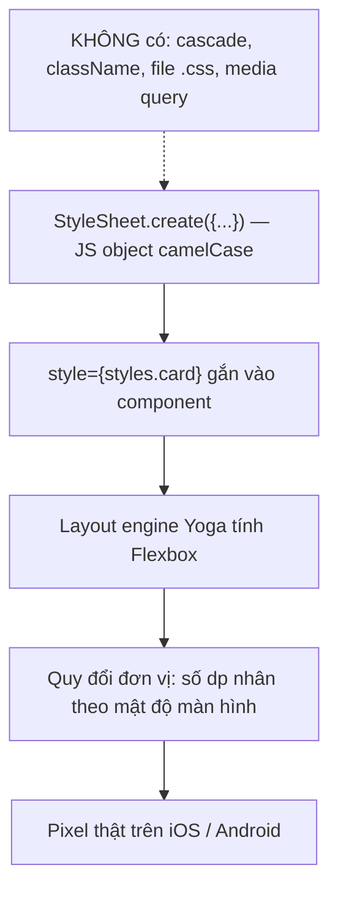
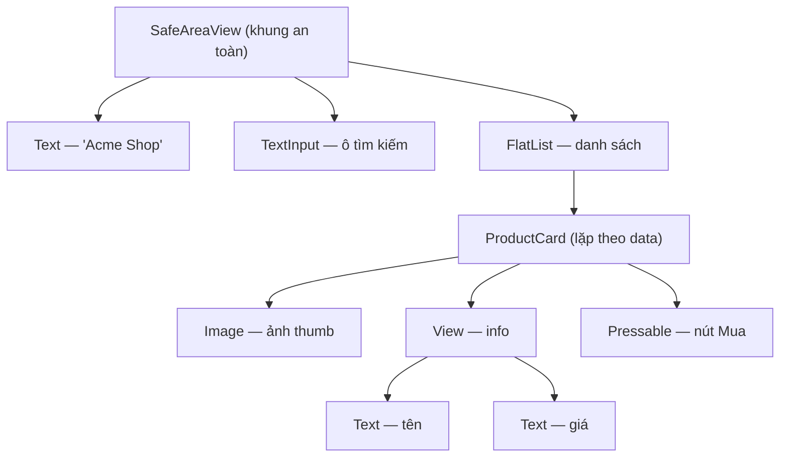

# Core Components & Styling — View, Text, Flexbox

> **Tác giả:** Mr.Rom\
> **Phiên bản:** v1.0.0\
> **Tạo lúc:** 13/06/2026\
> **Cập nhật:** 13/06/2026\
> **Level:** Basic\
> **Tags:** react-native, mobile, core-components, flexbox, stylesheet\
> **Yêu cầu trước:** [React Native là gì](00_what-is-react-native.md)

> 🎯 *Bạn vừa biết React Native là gì. Giờ mở editor lên gõ `<div>` theo thói quen React web — và app crash. Bài này dạy bộ **core components** thật của RN (View, Text, Image, ScrollView, TextInput, Pressable, FlatList), cách **styling bằng StyleSheet + Flexbox** (khác web nhiều hơn bạn tưởng), rồi ráp tất cả thành 1 màn hình sản phẩm Acme Shop chạy được thật.*

## 🎯 Sau bài này bạn sẽ

- [ ] Biết RN **không có** `<div>`/`<span>` — thay bằng `View` và `Text`, và vì sao mọi chữ phải nằm trong `<Text>`
- [ ] Dùng được 7 core component nền tảng: `View`, `Text`, `Image`, `ScrollView`, `TextInput`, `Pressable`, `FlatList`
- [ ] Style bằng `StyleSheet.create` + **Flexbox** — hiểu vì sao `flexDirection` mặc định là `'column'` (ngược web)
- [ ] Hiểu đơn vị **density-independent** (không dùng `px` như web) và `SafeAreaView`
- [ ] Render list dài hiệu quả bằng `FlatList` (với `data`, `renderItem`, `keyExtractor`) thay vì `ScrollView`
- [ ] Ráp được 1 màn hình `ProductScreen` hoàn chỉnh cho Acme Shop

---

## Tình huống — JSX quen thuộc nhưng tag thì lạ hoắc

Bạn đã viết React web cả tháng, gõ `<div className="card">` nhắm mắt cũng đúng. Giờ chuyển sang Acme Shop mobile bằng React Native, bạn tự tin gõ:

```jsx
// ❌ Code này CRASH trên React Native
function App() {
  return (
    <div className="card">
      <span>iPhone 15</span>
    </div>
  );
}
```

Metro bundler đỏ lừ màn hình:

```
Invariant Violation: View config getter callback for component `div` must be a function (received `undefined`).
```

Lý do: React Native **không chạy trong browser**. Không có DOM, nên không có `<div>`, `<span>`, `<p>`, `<button>`, `` — những thẻ HTML đó chỉ tồn tại trong trình duyệt. RN render ra **UIView (iOS)** và **android.view (Android)** thật — component native của hệ điều hành.

Nên React Native cung cấp một bộ **core components** riêng. Cùng triết lý JSX + props + state của React (bạn đã nắm ở cluster React web), nhưng "viên gạch" cơ bản đổi tên và đổi luật. Bài này là bản đồ để bạn không gõ nhầm `<div>` nữa.

---

## 1️⃣ Core components — bộ "viên gạch" của RN

Ở React web, viên gạch nhỏ nhất là thẻ HTML (`div`, `span`, `img`...). React Native thay bằng **core components** — các component RN bọc sẵn (built-in) ánh xạ trực tiếp xuống widget native của iOS/Android.

🪞 **Ẩn dụ**: Nếu React web là bộ Lego gắn lên *bản vẽ HTML*, thì React Native là **cùng bộ khớp nối Lego đó nhưng gắn lên khung nhôm native** của điện thoại. Cách ghép (JSX, props) y hệt; chỉ tên viên gạch và "bề mặt" gắn vào là khác.

Đây là bảng ánh xạ từ thứ bạn đã biết ở web sang RN — học thuộc bảng này là qua được 80% rào cản ban đầu:

| React web (HTML) | React Native | Vai trò |
|---|---|---|
| `<div>` | `View` | Hộp chứa, layout, nhóm element |
| `<span>` / `<p>` / `<h1>` | `Text` | **Mọi** đoạn chữ phải nằm trong đây |
| `` | `Image` | Hiển thị ảnh (local hoặc URL) |
| `<div style="overflow:scroll">` | `ScrollView` | Vùng cuộn cho nội dung **ngắn** |
| `<input>` | `TextInput` | Ô nhập liệu |
| `<button>` / `<a onClick>` | `Pressable` / `TouchableOpacity` | Vùng bấm được |
| `<ul>` + `.map()` (list dài) | `FlatList` | List dài, render hiệu quả |

> 💡 Bảng đã cho thấy "đổi tên là chính". Nhưng có vài luật ngầm dễ vấp — rõ nhất là luật về `Text`. Ta mổ xẻ từng cái một.

### `View` — cái `<div>` của RN

`View` là hộp chứa cơ bản nhất: nhóm các component con, áp layout, vẽ nền/viền. Khác `<div>` ở 2 điểm cốt lõi:

- `View` **mặc định là Flex container** (web `<div>` mặc định là `block`).
- `View` **không hiển thị được chữ trực tiếp** — phải bọc chữ trong `Text`.

```jsx
import { View } from 'react-native';

function Card() {
  return (
    <View style={styles.card}>
      {/* Các component con đặt ở đây — giống <div> */}
    </View>
  );
}
```

### `Text` — và luật "mọi chữ phải trong `<Text>`"

Đây là luật khiến dân React web vấp nhiều nhất. Ở web, viết text trần trong `<div>Hello</div>` là bình thường. Ở RN, **mọi chuỗi ký tự hiển thị bắt buộc nằm trong `<Text>`**. Viết text trần trong `View` sẽ crash.

```jsx
import { View, Text } from 'react-native';

// ❌ SAI — chữ trần trong View → crash
<View>iPhone 15</View>
// Lỗi: Text strings must be rendered within a <Text> component.

// ✅ ĐÚNG — chữ bọc trong Text
<View>
  <Text>iPhone 15</Text>
</View>
```

Vì sao gắt vậy? Vì trên native, "vẽ chữ" là một thao tác chuyên biệt (font, line-height, đo chiều rộng glyph). `View` là một khung layout thuần, nó **không biết vẽ chữ**. Chỉ `Text` mới ánh xạ xuống `UILabel`/`TextView` native biết render glyph.

Một hệ quả hay ho: `Text` **lồng nhau được** và style của cha truyền xuống con (đây gần như nơi duy nhất trong RN có "thừa kế" style):

```jsx
<Text style={{ fontSize: 16, color: '#333' }}>
  Giá: <Text style={{ fontWeight: 'bold', color: 'red' }}>25.000.000đ</Text>
</Text>
```

→ `View` lo layout, `Text` lo chữ. Tách bạch rõ ràng — nhớ luật này thì hết crash "Text strings...".

### `Image` — hiển thị ảnh

`Image` thay ``, nhưng có 2 khác biệt quan trọng phải nhớ ngay:

- Ảnh **trên mạng** (`uri`) **bắt buộc khai báo `width`/`height`** trong style — RN không tự biết kích thước ảnh remote nên nếu thiếu sẽ không hiện gì.
- Ảnh **local** dùng `require('./path.png')` (Metro bundle vào app), khi đó RN tự biết kích thước.

```jsx
import { Image } from 'react-native';

// 1. Ảnh từ URL — PHẢI có width/height
<Image
  source={{ uri: 'https://acmeshop.vn/iphone.jpg' }}
  style={{ width: 120, height: 120 }}
/>

// 2. Ảnh local — Metro tự biết size
<Image source={require('../assets/iphone.png')} />
```

→ Quên `width/height` cho ảnh `uri` là cạm bẫy số 1 với ảnh — màn hình trắng, không lỗi đỏ, dễ ngồi debug nhầm chỗ.

### `TextInput` — ô nhập liệu

`TextInput` thay `<input>`. Cú pháp **controlled component** giống hệt React web: `value` + `onChangeText`. Khác biệt: callback tên là `onChangeText` (nhận thẳng chuỗi mới), không phải `onChange` rồi `e.target.value`.

```jsx
import { useState } from 'react';
import { TextInput } from 'react-native';

function SearchBox() {
  const [keyword, setKeyword] = useState('');

  return (
    <TextInput
      style={styles.input}
      placeholder="Tìm sản phẩm..."
      value={keyword}
      onChangeText={setKeyword}   // nhận thẳng string, không cần e.target.value
    />
  );
}
```

### `Pressable` / `TouchableOpacity` — vùng bấm

RN không có `<button>`. Thay vào đó là các component "bấm được" bọc quanh nội dung tuỳ ý. `Pressable` là API hiện đại (khuyến nghị 2026), `TouchableOpacity` là API cũ hơn nhưng vẫn rất phổ biến vì hiệu ứng mờ khi nhấn rất tiện.

```jsx
import { Pressable, Text } from 'react-native';

// Pressable — linh hoạt, biết trạng thái đang nhấn (pressed)
<Pressable
  onPress={() => console.log('Đã mua')}
  style={({ pressed }) => [
    styles.button,
    pressed && styles.buttonPressed,   // đổi style lúc đang nhấn
  ]}
>
  <Text style={styles.buttonText}>Mua ngay</Text>
</Pressable>
```

```jsx
import { TouchableOpacity, Text } from 'react-native';

// TouchableOpacity — tự động mờ đi khi nhấn (activeOpacity)
<TouchableOpacity onPress={() => console.log('Đã mua')} style={styles.button}>
  <Text style={styles.buttonText}>Mua ngay</Text>
</TouchableOpacity>
```

→ Quy ước 2026: **dùng `Pressable`** cho code mới (mạnh hơn, linh hoạt hơn). `TouchableOpacity` chỉ cần biết để đọc code cũ.

---

## 2️⃣ Styling — StyleSheet + Flexbox, KHÔNG phải CSS

Bạn đã có `<View>`, `<Text>`. Giờ cần làm cho nó đẹp. Và đây là chỗ React Native khác web nhất.

RN **không dùng CSS**. Không có file `.css`, không có `className`, không có cascade (kế thừa/đè theo cây), không có media query CSS, không có `:hover`. Thay vào đó bạn viết style bằng **JavaScript object** — tên thuộc tính theo `camelCase` (`backgroundColor` thay `background-color`).

> 💡 Cách styling là khái niệm trừu tượng nhất của bài. Trước khi code, hãy nhìn sơ đồ "một style đi từ định nghĩa tới pixel trên màn hình" để có bản đồ tổng thể.



→ Điểm mấu chốt từ sơ đồ: style ở RN là **object cục bộ gắn thẳng vào component** (không cascade), và layout do engine **Yoga** tính bằng Flexbox — đây chính là lý do mọi thứ quy về Flexbox và đơn vị số.

### `StyleSheet.create` — cách style chuẩn

Bạn *có thể* viết style inline (`style={{ padding: 16 }}`), nhưng cách chuẩn là gom vào `StyleSheet.create`. Lợi ích: tách style khỏi JSX cho gọn, được validate tên thuộc tính khi dev, và RN tối ưu (gửi style sang native 1 lần thay vì tạo object mới mỗi lần render).

```jsx
import { StyleSheet, View, Text } from 'react-native';

function Card() {
  return (
    <View style={styles.card}>
      <Text style={styles.title}>iPhone 15</Text>
    </View>
  );
}

const styles = StyleSheet.create({
  card: {
    padding: 16,
    backgroundColor: '#fff',
    borderRadius: 12,
  },
  title: {
    fontSize: 18,
    fontWeight: 'bold',
    color: '#1a1a1a',
  },
});
```

So với web: `background-color` → `backgroundColor`, `border-radius` → `borderRadius`, `font-weight: bold` → `fontWeight: 'bold'`. Giá trị chuỗi (như `'bold'`) phải đặt trong dấu nháy; giá trị số (`16`, `12`) viết trần.

### Đơn vị — density-independent, KHÔNG có `px`

Ở web bạn gõ `padding: 16px`. Ở RN bạn gõ `padding: 16` — **một con số trần, không có đơn vị `px`**.

Con số đó không phải pixel vật lý. Nó là **dp** (density-independent pixels) — đơn vị độc lập mật độ màn hình. RN tự nhân nó theo mật độ điểm ảnh của từng thiết bị để `16` trông "to bằng nhau" trên iPhone màn retina dày đặc lẫn Android màn thưa hơn.

```jsx
// ❌ SAI — RN không hiểu chuỗi "16px"
const styles = StyleSheet.create({
  box: { padding: '16px' },   // bị bỏ qua hoặc cảnh báo
});

// ✅ ĐÚNG — số trần (dp)
const styles = StyleSheet.create({
  box: { padding: 16 },
});
```

→ Phần trăm `'50%'` (chuỗi) thì được dùng cho `width`/`height`. Nhưng đơn vị tuyệt đối luôn là **số dp trần**, không bao giờ `px`.

### Flexbox — và cú sốc `flexDirection: 'column'`

Đây là khác biệt khiến layout đầu tiên của bạn "lệch tùm lum". Trong CSS web, một flex container mặc định xếp con theo **hàng ngang** (`flex-direction: row`). Trong React Native, mặc định xếp con theo **cột dọc** (`flexDirection: 'column'`).

Vì sao? Vì màn hình điện thoại cao và hẹp — nội dung trôi từ trên xuống dưới là tự nhiên. Nên RN chọn `column` làm mặc định.

Cùng một đoạn JSX, kết quả khác nhau giữa web và RN:

```jsx
<View style={{ flexDirection: 'row' }}>   {/* phải GHI rõ row mới nằm ngang */}
  <Text>A</Text>
  <Text>B</Text>
</View>
```

Bảng đối chiếu nhanh các thuộc tính Flex hay dùng — đọc xong là layout được 90% màn hình:

| Thuộc tính | Ý nghĩa | Giá trị hay dùng |
|---|---|---|
| `flexDirection` | Trục chính xếp con | `'column'` (mặc định), `'row'` |
| `justifyContent` | Căn dọc **trục chính** | `'flex-start'`, `'center'`, `'space-between'` |
| `alignItems` | Căn dọc **trục phụ** (vuông góc) | `'stretch'` (mặc định), `'center'`, `'flex-start'` |
| `flex` | Tỉ lệ chiếm chỗ còn lại | `1` = chiếm hết phần trống |
| `gap` | Khoảng cách giữa các con | `12` (RN hỗ trợ từ 0.71+) |

```jsx
const styles = StyleSheet.create({
  row: {
    flexDirection: 'row',        // xếp ngang (vì mặc định là column)
    justifyContent: 'space-between',  // dồn 2 đầu, đẩy khoảng trống vào giữa
    alignItems: 'center',        // căn giữa theo chiều dọc
    gap: 12,                     // cách nhau 12 dp
  },
});
```

→ Mẹo nhớ: ở web khi muốn xếp dọc bạn phải gõ thêm `flex-direction: column`; ở RN thì ngược lại — muốn xếp ngang bạn phải gõ thêm `flexDirection: 'row'`. Quên điều này là lý do số 1 khiến icon và chữ "bị xuống dòng" trong nút bấm.

### Không cascade — mỗi component tự khai style

Ở web, set `font-size` trên `<body>` thì cả trang thừa kế. Ở RN **không có cascade** (trừ chữ lồng trong `Text` như đã nói). Set `color` trên `View` cha **không** làm `Text` con đổi màu. Mỗi component phải tự khai style của nó.

```jsx
// ❌ Tưởng Text con thừa kế color từ View — KHÔNG
<View style={{ color: 'red' }}>
  <Text>Chữ này vẫn ĐEN, không đỏ</Text>
</View>

// ✅ Khai color thẳng trên Text
<View>
  <Text style={{ color: 'red' }}>Chữ này mới đỏ</Text>
</View>
```

→ Style trong RN là **cục bộ và tường minh**. Hơi dài dòng hơn CSS, nhưng đổi lại: nhìn 1 component là biết hết style của nó, không phải truy ngược cả cây như web.

### Gộp nhiều style — dùng mảng

Khi cần gộp style cơ bản với style điều kiện, truyền **mảng** vào `style`. Phần tử sau đè phần tử trước (giống `Object.assign`), `false`/`null`/`undefined` bị bỏ qua:

```jsx
<Text style={[styles.badge, isHot && styles.badgeHot]}>
  {isHot ? 'HOT' : 'Mới'}
</Text>
```

→ Đây là cách RN thay cho `className` điều kiện ở web (`className={isHot ? 'hot' : ''}`).

---

## 3️⃣ SafeAreaView — tránh "tai thỏ" và thanh điều hướng

Điện thoại hiện đại có **notch** (tai thỏ), camera đục lỗ, thanh trạng thái trên cùng, và thanh gesture dưới đáy. Nếu bạn vẽ nội dung sát mép màn hình, tiêu đề sẽ bị notch che, nút dưới cùng bị thanh gesture đè.

🪞 **Ẩn dụ**: `SafeAreaView` giống **lề an toàn khi in tờ rơi** — bạn chừa mép giấy để chữ không bị máy cắt phạm. Nó tự chừa khoảng đệm đúng bằng vùng bị notch/thanh hệ thống chiếm.

Năm 2026 cách khuyến nghị là dùng thư viện `react-native-safe-area-context` (Expo cài sẵn). API cũ `SafeAreaView` nằm thẳng trong `react-native` chỉ chạy đúng trên iOS, nên bản cộng đồng là chuẩn hiện hành:

```jsx
import { SafeAreaView } from 'react-native-safe-area-context';

function Screen() {
  return (
    <SafeAreaView style={{ flex: 1 }}>
      {/* Nội dung nằm trong vùng an toàn — không bị notch che */}
    </SafeAreaView>
  );
}
```

→ Bọc màn hình gốc bằng `SafeAreaView` với `flex: 1` (chiếm hết chiều cao). Đây là khung chuẩn để bắt đầu mọi màn hình.

---

## 4️⃣ Danh sách — ScrollView vs FlatList

Acme Shop có danh sách sản phẩm. Bạn nghĩ ngay: "dùng `.map()` như React web, bọc trong `ScrollView` cho cuộn được". Với 5-10 item thì ổn. Với 500 sản phẩm thì app **giật, tốn RAM, có khi crash**. Đây là cạm bẫy kinh điển.

### Vì sao ScrollView không hợp list dài

`ScrollView` **render toàn bộ con ngay lập tức**, kể cả phần đang nằm ngoài màn hình. 500 sản phẩm = 500 `View` + 500 `Image` được tạo cùng lúc, dù bạn chỉ thấy 8 cái. RAM phình, frame rớt.

```jsx
// ❌ SAI cho list dài — render hết 500 item ngay
<ScrollView>
  {products.map(p => <ProductCard key={p.id} product={p} />)}
</ScrollView>
```

→ `ScrollView` chỉ hợp cho nội dung **ngắn, biết trước số lượng** (1 form, 1 trang chi tiết). List dài thì không.

### FlatList — chỉ render thứ đang thấy

`FlatList` là giải pháp đúng. Nó **chỉ render những item đang nằm trong (hoặc gần) màn hình** — gọi là *virtualization* (ảo hoá). Cuộn tới đâu render tới đó, item trôi ra xa thì thu hồi. Render 10.000 item vẫn mượt.

🪞 **Ẩn dụ**: `ScrollView` như **in cả 500 trang sách rồi mới đưa bạn đọc**. `FlatList` như **đọc ebook** — chỉ tải trang bạn đang xem, lật tới đâu tải tới đó.

`FlatList` cần 3 prop cốt lõi:

- `data` — mảng dữ liệu (thay vì tự `.map()`).
- `renderItem` — hàm nhận `{ item }`, trả về JSX cho 1 dòng.
- `keyExtractor` — hàm trả về `key` duy nhất cho mỗi item (giống `key` trong `.map()` của React, nhưng khai riêng).

```jsx
import { FlatList } from 'react-native';

function ProductList({ products }) {
  return (
    <FlatList
      data={products}                          // 1. nguồn dữ liệu
      keyExtractor={(item) => item.id.toString()}  // 2. key duy nhất mỗi item
      renderItem={({ item }) => (              // 3. cách vẽ 1 item
        <ProductCard product={item} />
      )}
    />
  );
}
```

> ⚠️ `keyExtractor` trả về **chuỗi**. Nếu `id` là số, nhớ `.toString()`. Nếu bỏ `keyExtractor`, FlatList sẽ tự tìm `item.key` hoặc `item.id`, không có thì cảnh báo y như thiếu `key` ở React web.

→ Quy tắc vàng: **list ngắn cố định → `ScrollView`; list dài / từ API → `FlatList`**. Mặc định khi không chắc, chọn `FlatList`.

---

## 5️⃣ Ráp lại — màn hình sản phẩm Acme Shop

Giờ ráp tất cả thành 1 màn hình `ProductScreen` chạy được: `SafeAreaView` làm khung, `TextInput` tìm kiếm, `FlatList` render danh sách sản phẩm, mỗi sản phẩm là 1 `ProductCard` (gồm `Image` + `Text` + nút `Pressable`). Đây là file hoàn chỉnh — copy vào `App.tsx` của một dự án Expo mới là chạy.

```tsx
import { useState } from 'react';
import {
  View,
  Text,
  Image,
  TextInput,
  Pressable,
  FlatList,
  StyleSheet,
} from 'react-native';
import { SafeAreaView } from 'react-native-safe-area-context';

// 1. Kiểu dữ liệu 1 sản phẩm (TypeScript)
type Product = {
  id: number;
  name: string;
  price: number;
  image: string;
};

// 2. Dữ liệu mẫu — thực tế sẽ fetch từ API (bài sau)
const PRODUCTS: Product[] = [
  { id: 1, name: 'iPhone 15', price: 25000000, image: 'https://acmeshop.vn/iphone.jpg' },
  { id: 2, name: 'AirPods Pro', price: 5000000, image: 'https://acmeshop.vn/airpods.jpg' },
  { id: 3, name: 'MacBook Air', price: 28000000, image: 'https://acmeshop.vn/macbook.jpg' },
];

// 3. Component con — chỉ lo hiển thị 1 sản phẩm (presentational)
function ProductCard({ product }: { product: Product }) {
  return (
    <View style={styles.card}>
      <Image source={{ uri: product.image }} style={styles.thumb} />
      <View style={styles.info}>
        <Text style={styles.name} numberOfLines={1}>
          {product.name}
        </Text>
        <Text style={styles.price}>
          {product.price.toLocaleString('vi-VN')}đ
        </Text>
      </View>
      <Pressable
        onPress={() => console.log('Đã thêm:', product.name)}
        style={({ pressed }) => [styles.buyBtn, pressed && styles.buyBtnPressed]}
      >
        <Text style={styles.buyBtnText}>Mua</Text>
      </Pressable>
    </View>
  );
}

// 4. Màn hình chính
export default function ProductScreen() {
  const [keyword, setKeyword] = useState('');

  // Lọc sản phẩm theo từ khoá (so khớp không phân biệt hoa thường)
  const filtered = PRODUCTS.filter((p) =>
    p.name.toLowerCase().includes(keyword.toLowerCase()),
  );

  return (
    <SafeAreaView style={styles.screen}>
      <Text style={styles.heading}>Acme Shop</Text>

      <TextInput
        style={styles.search}
        placeholder="Tìm sản phẩm..."
        value={keyword}
        onChangeText={setKeyword}
      />

      <FlatList
        data={filtered}
        keyExtractor={(item) => item.id.toString()}
        renderItem={({ item }) => <ProductCard product={item} />}
        contentContainerStyle={styles.list}
        ListEmptyComponent={
          <Text style={styles.empty}>Không tìm thấy sản phẩm.</Text>
        }
      />
    </SafeAreaView>
  );
}

const styles = StyleSheet.create({
  screen: {
    flex: 1,                       // chiếm hết chiều cao màn hình
    backgroundColor: '#f2f2f7',
  },
  heading: {
    fontSize: 28,
    fontWeight: 'bold',
    paddingHorizontal: 16,
    paddingVertical: 12,
    color: '#1a1a1a',
  },
  search: {
    marginHorizontal: 16,
    marginBottom: 12,
    paddingHorizontal: 14,
    paddingVertical: 10,
    backgroundColor: '#fff',
    borderRadius: 10,
    fontSize: 16,
  },
  list: {
    paddingHorizontal: 16,
    gap: 12,                       // cách nhau 12 dp giữa các card
  },
  card: {
    flexDirection: 'row',          // xếp NGANG (mặc định là column!)
    alignItems: 'center',
    padding: 12,
    backgroundColor: '#fff',
    borderRadius: 12,
    gap: 12,
  },
  thumb: {
    width: 56,                     // ảnh uri PHẢI khai width/height
    height: 56,
    borderRadius: 8,
    backgroundColor: '#e5e5ea',    // màu nền chờ ảnh load
  },
  info: {
    flex: 1,                       // chiếm hết khoảng trống giữa ảnh và nút
  },
  name: {
    fontSize: 16,
    fontWeight: '600',
    color: '#1a1a1a',
  },
  price: {
    fontSize: 14,
    color: '#007aff',
    marginTop: 2,
  },
  buyBtn: {
    paddingHorizontal: 16,
    paddingVertical: 8,
    backgroundColor: '#007aff',
    borderRadius: 8,
  },
  buyBtnPressed: {
    opacity: 0.6,                  // mờ đi khi đang nhấn
  },
  buyBtnText: {
    color: '#fff',
    fontWeight: '600',
  },
  empty: {
    textAlign: 'center',
    color: '#8e8e93',
    marginTop: 40,
  },
});
```

Vài điểm đáng chú ý trong code này, đọc kỹ để thấy mọi luật đã học gắn vào đâu:

- `screen` có `flex: 1` để `SafeAreaView` cao hết màn hình — thiếu nó thì `FlatList` không có chiều cao để cuộn.
- `card` phải khai `flexDirection: 'row'` mới xếp ảnh — info — nút theo hàng ngang. Bỏ dòng đó là cả 3 xếp dọc chồng lên nhau.
- `info` có `flex: 1` nên nó "nở ra" đẩy nút `Mua` về sát phải — đây là kỹ thuật layout cực hay dùng.
- `numberOfLines={1}` trên `Text` cắt tên dài thành 1 dòng kèm dấu `...` (prop riêng của RN, web không có).
- `ListEmptyComponent` của `FlatList` tự hiện khi `data` rỗng — gõ từ khoá không khớp sẽ thấy "Không tìm thấy sản phẩm.".

→ Toàn bộ màn hình dùng đúng 7 core component đã học, style 100% bằng `StyleSheet` + Flexbox, không một dòng CSS. Đây là khung mẫu cho mọi màn hình list trong app thật.

App vừa ráp thực ra là 1 **cây component native** — mỗi nút trên cây ánh xạ xuống 1 view thật của hệ điều hành. Sơ đồ dưới mô tả cây đó:



→ Khác cây component React web ở chỗ: lá của cây này không phải thẻ HTML mà là **view native thật** — đó là lý do app RN nhìn và chạm vào "giống app thật" chứ không như website nhúng.

---

## 💡 Cạm bẫy thường gặp & Best practice

### ❌ Cạm bẫy: Quên bọc chữ trong `<Text>`

- **Triệu chứng**: App đỏ màn hình, lỗi `Text strings must be rendered within a <Text> component.`
- **Nguyên nhân**: Viết chữ trần trong `View` (thói quen `<div>Hello</div>` của web), hoặc render biến chuỗi thẳng trong `View` (`<View>{name}</View>`).
- **Cách tránh**: Mọi chuỗi hiển thị phải nằm trong `<Text>`. Kể cả 1 ký tự, kể cả emoji, kể cả biến.

### ❌ Cạm bẫy: Dùng `px` và `flexDirection` như web

- **Triệu chứng**: Style `padding: '16px'` bị bỏ qua; layout xếp dọc trong khi bạn muốn ngang.
- **Nguyên nhân**: RN không hiểu chuỗi `'16px'` (dùng số trần `16`), và `flexDirection` mặc định là `'column'` chứ không phải `'row'` như CSS.
- **Cách tránh**: Đơn vị tuyệt đối luôn là **số trần (dp)**. Muốn xếp ngang phải gõ rõ `flexDirection: 'row'`.

### ❌ Cạm bẫy: Dùng `ScrollView` cho list dài

- **Triệu chứng**: App giật khi cuộn, tốn RAM, cuộn lag, có khi crash với list lớn.
- **Nguyên nhân**: `ScrollView` render toàn bộ con ngay cả phần ngoài màn hình — 1000 item = 1000 component tạo cùng lúc.
- **Cách tránh**: List dài (đặc biệt từ API) dùng `FlatList` — nó chỉ render item đang thấy (virtualization).

### ✅ Best practice: Gom style vào `StyleSheet.create`

- **Vì sao**: Tách style khỏi JSX cho dễ đọc, được validate tên thuộc tính lúc dev, và RN tối ưu việc gửi style sang native (không tạo object mới mỗi render như style inline).
- **Cách áp dụng**: Khai `const styles = StyleSheet.create({...})` cuối file, gắn qua `style={styles.tenStyle}`. Style điều kiện thì truyền mảng `style={[styles.base, cond && styles.extra]}`.

### ✅ Best practice: Luôn khai `keyExtractor` cho `FlatList`

- **Vì sao**: Giúp RN track đúng từng item giữa các lần render (giống `key` ở React web) — tránh bug khi lọc/sắp xếp lại list và tối ưu re-render.
- **Cách áp dụng**: `keyExtractor={(item) => item.id.toString()}` — luôn trả về **chuỗi** duy nhất, ổn định (id từ DB là tốt nhất).

---

## 🧠 Tự kiểm tra (Self-check)

**Q1.** Vì sao `<div>Xin chào</div>` crash trên React Native, và viết đúng phải thế nào?

<details>
<summary>💡 Đáp án</summary>

RN không chạy trong browser nên **không có DOM**, không có thẻ `<div>` (cũng như `<span>`, `<p>`, ``). Thay bằng core component: `<div>` → `View`. Ngoài ra chữ trần không nằm được trong `View`. Đúng là:

```jsx
<View>
  <Text>Xin chào</Text>
</View>
```

</details>

**Q2.** Trong CSS web, một flex container mặc định xếp con thế nào? Còn RN thì sao? Nếu muốn xếp 2 `Text` nằm cạnh nhau theo hàng ngang trong RN, phải viết gì?

<details>
<summary>💡 Đáp án</summary>

CSS web mặc định `flex-direction: row` (ngang). RN mặc định `flexDirection: 'column'` (dọc). Muốn xếp ngang trong RN phải khai rõ:

```jsx
<View style={{ flexDirection: 'row' }}>
  <Text>A</Text>
  <Text>B</Text>
</View>
```

</details>

**Q3.** Khi nào dùng `ScrollView`, khi nào dùng `FlatList`? Vì sao không dùng `ScrollView` cho 1000 sản phẩm?

<details>
<summary>💡 Đáp án</summary>

`ScrollView` cho nội dung **ngắn, số lượng biết trước** (1 form, 1 trang chi tiết) vì nó render toàn bộ con ngay lập tức. `FlatList` cho **list dài / từ API** vì nó *virtualize* — chỉ render item đang nằm trong (hoặc gần) màn hình. 1000 sản phẩm trong `ScrollView` = tạo 1000 component cùng lúc → tốn RAM, giật, có thể crash. `FlatList` chỉ render ~10 item đang thấy nên mượt.

</details>

**Q4.** Style đặt `color: 'red'` trên `View` cha có làm `Text` con đổi màu đỏ không? Vì sao?

<details>
<summary>💡 Đáp án</summary>

**Không.** RN **không có cascade** (kế thừa style theo cây như CSS). `color` trên `View` không truyền xuống `Text` con. Phải khai `color` thẳng trên chính `Text`. (Ngoại lệ duy nhất: chữ lồng trong `Text` thì kế thừa style của `Text` cha.)

</details>

**Q5.** Ảnh từ URL (`source={{ uri: '...' }}`) hiện ra trắng trơn, không lỗi đỏ. Nguyên nhân khả dĩ nhất?

<details>
<summary>💡 Đáp án</summary>

Thiếu `width`/`height` trong style của `Image`. Với ảnh remote (`uri`), RN **không tự biết kích thước** nên mặc định 0×0 → không hiện gì mà cũng không báo lỗi. Phải khai `style={{ width: 120, height: 120 }}`. (Ảnh local `require()` thì Metro tự biết size, không cần khai.)

</details>

---

## ⚡ Tra cứu nhanh (Cheatsheet)

| Mục đích | Cú pháp RN |
|---|---|
| Hộp chứa (`<div>`) | `<View style={styles.box}>...</View>` |
| Hiển thị chữ | `<Text>nội dung</Text>` |
| Ảnh từ URL | `<Image source={{ uri }} style={{ width, height }} />` |
| Ảnh local | `<Image source={require('./img.png')} />` |
| Ô nhập | `<TextInput value={v} onChangeText={setV} />` |
| Nút bấm | `<Pressable onPress={fn}><Text>...</Text></Pressable>` |
| List dài | `<FlatList data={...} keyExtractor={...} renderItem={...} />` |
| Vùng cuộn ngắn | `<ScrollView>...</ScrollView>` |
| Khung an toàn | `<SafeAreaView style={{ flex: 1 }}>...</SafeAreaView>` |
| Tạo style | `const styles = StyleSheet.create({...})` |
| Xếp ngang | `flexDirection: 'row'` |
| Căn giữa cả 2 chiều | `justifyContent: 'center', alignItems: 'center'` |
| Chiếm hết chỗ trống | `flex: 1` |
| Style điều kiện | `style={[styles.base, cond && styles.extra]}` |

### CSS web → RN style — đối chiếu

```jsx
background-color: #fff;   →  backgroundColor: '#fff'
border-radius: 12px;      →  borderRadius: 12          // số trần, không 'px'
font-weight: bold;        →  fontWeight: 'bold'        // chuỗi
flex-direction: column;   →  flexDirection: 'column'   // RN mặc định sẵn
padding: 16px;            →  padding: 16
```

---

## 📚 Từ Điển Thuật Ngữ (Glossary)

| EN | VN | Giải thích |
|---|---|---|
| Core component | Component cốt lõi | Component RN dựng sẵn ánh xạ xuống widget native (View, Text...) |
| View | Khung chứa | Hộp layout cơ bản, tương đương `<div>` web |
| Text | Thành phần chữ | Component duy nhất hiển thị được chuỗi ký tự |
| StyleSheet | Bảng style | API `StyleSheet.create` gom style thành object tối ưu |
| Flexbox | Hộp linh hoạt | Mô hình layout 1 chiều RN dùng làm mặc định |
| flexDirection | Hướng xếp | Trục chính xếp con; RN mặc định `'column'` (web `'row'`) |
| dp (density-independent pixels) | Pixel độc lập mật độ | Đơn vị số trần, RN tự quy đổi theo mật độ màn hình |
| Cascade | Kế thừa tầng | Cơ chế CSS kế thừa style theo cây; RN **không có** |
| SafeAreaView | Vùng an toàn | Khung tự chừa notch/thanh hệ thống để nội dung không bị che |
| ScrollView | Vùng cuộn | Cuộn nội dung ngắn, render toàn bộ con ngay |
| FlatList | Danh sách ảo hoá | List dài chỉ render item đang thấy (virtualization) |
| Virtualization | Ảo hoá | Kỹ thuật chỉ render phần tử trong/gần màn hình để tiết kiệm RAM |
| renderItem | Hàm vẽ item | Prop FlatList nhận `{ item }`, trả JSX cho 1 dòng |
| keyExtractor | Hàm lấy key | Prop FlatList trả về key chuỗi duy nhất cho mỗi item |
| Pressable | Vùng bấm | API hiện đại cho phần tử bấm được, biết trạng thái `pressed` |
| TouchableOpacity | Vùng bấm mờ | API cũ hơn, tự mờ đi khi nhấn |
| Controlled component | Component được kiểm soát | Input mà giá trị do state quyết định (`value` + `onChangeText`) |

---

## 🔗 Liên kết & Tài nguyên

⬅️ **Bài trước:** [React Native là gì? — Viết app native bằng React](00_what-is-react-native.md)
➡️ **Bài tiếp theo:** [Navigation & State — React Navigation, quản lý dữ liệu](02_navigation-and-state.md)
↑ **Về cụm:** [React Native cơ bản](../../README.md)

### 🧭 Định hướng lộ trình học

- [React Native là gì? — Viết app native bằng React](00_what-is-react-native.md) — nền tảng trước khi vào core components
- [Navigation & State — React Navigation, quản lý dữ liệu](02_navigation-and-state.md) — bài kế: chuyển màn hình + quản lý dữ liệu

### 🧩 Các chủ đề có thể bạn quan tâm

- [Components & Props — Building block của React](../../../../07_web/frontend/react/lessons/01_basic/01_components-and-props.md) — JSX/props/key bên React web, nền cho RN
- [React là gì? — Component framework #1 cho frontend](../../../../07_web/frontend/react/lessons/01_basic/00_what-is-react.md) — ôn lại triết lý component nếu cần

### 🌐 Tài nguyên tham khảo khác

- [React Native docs — Core Components and APIs](https://reactnative.dev/docs/components-and-apis) — danh sách đầy đủ core component
- [React Native docs — Layout with Flexbox](https://reactnative.dev/docs/flexbox) — giải thích Flexbox trong RN
- [React Native docs — Using a FlatList](https://reactnative.dev/docs/using-a-flatlist) — hướng dẫn FlatList chính thức
- [Expo docs — Get started](https://docs.expo.dev/get-started/introduction/) — tạo dự án để chạy thử code bài này

---

> 🎯 *Sau bài này bạn dựng được màn hình tĩnh bằng core components + Flexbox. Bài kế tiếp dạy **navigation** (chuyển giữa các màn hình) và **quản lý state** để app thực sự "sống".*

---

## 📌 Nhật ký thay đổi (Changelog)

- **v1.0.0 (13/06/2026)** — Bản đầu tiên. Cluster `react-native/` lesson 1/5 (basic). Cover: core components RN (View, Text, Image, ScrollView, TextInput, Pressable/TouchableOpacity, FlatList) + luật mọi chữ trong `<Text>` + styling bằng StyleSheet.create + Flexbox (flexDirection mặc định 'column', không cascade, đơn vị dp không px) + SafeAreaView + FlatList vs ScrollView cho list dài + màn hình ProductScreen hoàn chỉnh cho Acme Shop. 2 sơ đồ mermaid (luồng styling, cây component native). Cạm bẫy: quên `<Text>`, dùng px/flexDirection như web, ScrollView cho list dài.
