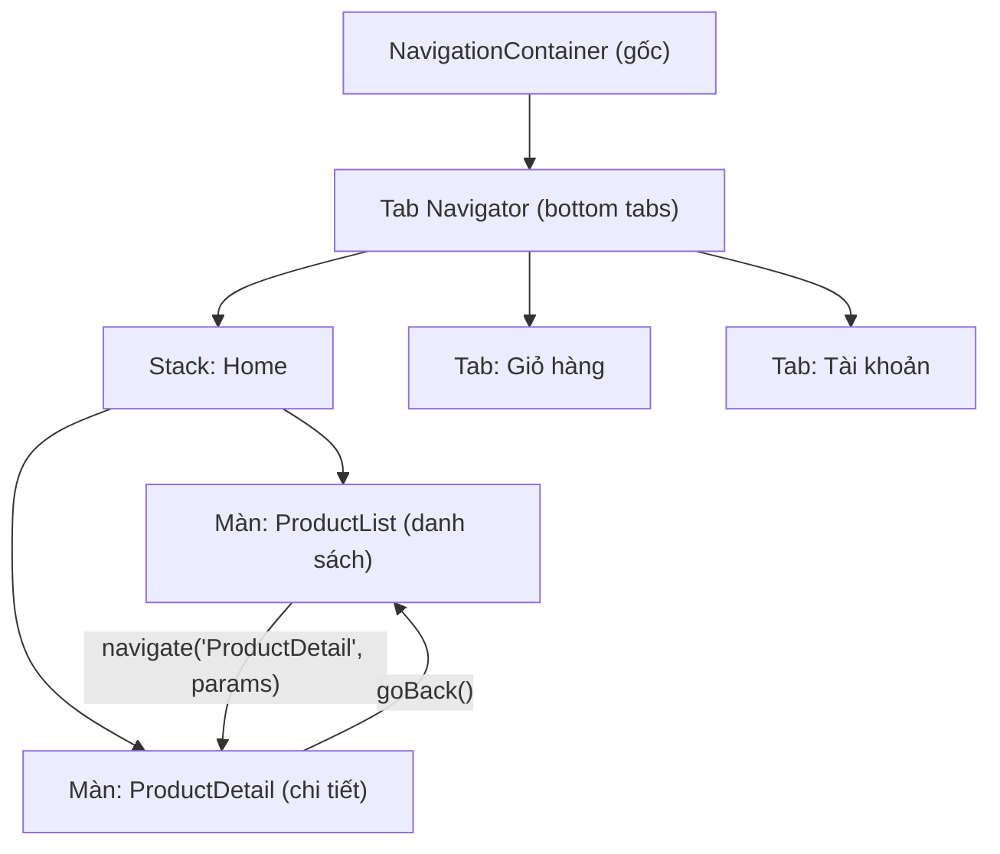

# 🎓 Navigation & State — React Navigation, quản lý dữ liệu

> **Tác giả:** Mr.Rom\
> **Phiên bản:** v1.0.0\
> **Tạo lúc:** 13/06/2026\
> **Cập nhật:** 13/06/2026\
> **Level:** Basic\
> **Tags:** react-native, navigation, react-navigation, state, data-fetching\
> **Yêu cầu trước:** [Core Components & Styling](01_core-components-and-styling.md)

> 🎯 *Bài trước bạn đã biết dựng giao diện 1 màn bằng `View`/`Text`/`Flexbox`. Nhưng app thật có **nhiều màn** (danh sách → chi tiết → giỏ hàng) và phải **lấy dữ liệu** từ server. Bài này dạy bạn điều hướng giữa các màn bằng **React Navigation** (Stack + Tab + truyền params), quản lý **state** (useState/useContext, giới thiệu nhẹ Zustand/Redux Toolkit), và **fetch dữ liệu** với loading/error state — ghép thành 1 app Acme Shop hoàn chỉnh.*

## 🎯 Sau bài này bạn sẽ

- [ ] Hiểu vì sao app mobile cần **navigator** thay vì `<Routes>` của React web
- [ ] Cài + cấu hình **React Navigation** (Stack Navigator) và đẩy/quay màn
- [ ] **Truyền params** giữa 2 màn qua `navigation.navigate` + đọc bằng `route.params`
- [ ] Tuỳ biến **header** (tiêu đề, nút back, nút bên phải)
- [ ] Thêm **Tab Navigator** (bottom tabs) và lồng Stack vào trong tab
- [ ] Quản lý state với **useState** + chia sẻ toàn app bằng **useContext**, biết khi nào cần **Zustand/Redux Toolkit**
- [ ] **Fetch dữ liệu** bằng `fetch`/`axios` trong `useEffect` với 3 trạng thái loading / error / data
- [ ] Ghép tất cả thành luồng **list → detail** thật cho Acme Shop

---

## Tình huống — App 1 màn không còn đủ

Bài 01 bạn dựng được 1 màn `View` đẹp với `Flexbox`. Nhưng mở app Shopee, Tiki, Grab ra xem: bấm vào 1 sản phẩm → trượt sang màn chi tiết, có nút back ở góc trái; dưới đáy có thanh tab Home / Giỏ hàng / Tài khoản chuyển qua lại. Đó là **navigation** — và nó là thứ phân biệt "1 demo" với "1 app".

Nếu bạn đến từ React web, phản xạ đầu tiên là dùng `react-router-dom`. Nhưng RN **không có URL bar, không có `<a href>`, không có history của browser**. Thay vào đó mobile có những thứ rất riêng:

- 🤔 Animation chuyển màn kiểu native (iOS trượt ngang, Android fade lên).
- 🤔 Nút back vật lý/cử chỉ vuốt cạnh màn (gesture) phải hoạt động.
- 🤔 Header bar (thanh tiêu đề trên cùng) có notch/safe area khác nhau mỗi máy.
- 🤔 Bottom tab giữ nguyên state mỗi tab khi bạn chuyển qua lại.

`react-router-dom` không lo được những thứ này. Cộng đồng RN dùng một thư viện riêng: **React Navigation**.

Và song song với điều hướng là câu hỏi thứ hai: dữ liệu ở đâu ra? Màn danh sách hiển thị 20 sản phẩm — chúng đến từ API. Khi đang tải thì hiện gì? Khi mất mạng thì hiện gì? Đó là phần **state + fetch dữ liệu** ở nửa sau bài.

→ Bài này gắn 2 mảnh đó lại: **đi giữa các màn** + **đổ dữ liệu vào màn** = 1 app thật.

---

## 1️⃣ React Navigation — bộ não điều hướng của app

Trên web, URL chính là "trạng thái điều hướng": gõ `/products/5` là ra màn sản phẩm 5. Mobile không có URL, nên cần một thư viện đứng ra **giữ ngăn xếp các màn đang mở** và vẽ animation chuyển màn. Đó là **React Navigation** — thư viện điều hướng chuẩn de-facto của RN (thư viện `@react-navigation/*`).

**Định nghĩa chính thức**: React Navigation là một bộ thư viện quản lý điều hướng cho React Native — nó render đúng màn dựa trên một cây *navigator* (bộ điều hướng), xử lý nút back, gesture vuốt, header bar và truyền tham số giữa các màn.

**Ẩn dụ đời thường**: 🪞 *Một Stack Navigator giống như **chồng đĩa trong bếp** — mỗi lần mở màn mới là úp thêm 1 đĩa lên trên (push), bấm back là nhấc đĩa trên cùng ra (pop), đĩa dưới vẫn còn nguyên đó chờ bạn quay lại.* Tab Navigator thì giống **mấy ngăn tủ cạnh nhau** — bạn kéo ngăn nào ra xem ngăn đó, các ngăn khác vẫn giữ nguyên đồ bên trong.

React Navigation có nhiều loại navigator, nhưng 2 cái bạn dùng 90% thời gian là:

- **Stack Navigator** — xếp chồng màn theo chiều dọc (push/pop), có animation trượt + nút back tự động. Dùng cho luồng "đi sâu vào": list → detail → checkout.
- **Tab Navigator** — các màn nằm ngang nhau, chuyển bằng thanh tab dưới đáy (bottom tabs). Dùng cho các khu vực ngang hàng: Home / Giỏ hàng / Tài khoản.

> 💡 Hiểu 2 loại navigator rồi, ta xem cách chúng **lồng vào nhau** thành cây điều hướng (navigation tree) của Acme Shop qua sơ đồ bên dưới để hình dung trước khi viết code.

### Sơ đồ — navigation tree của Acme Shop

App thật hầu như luôn **lồng navigator**: một Tab Navigator ở ngoài cùng, bên trong mỗi tab lại là một Stack Navigator riêng để đi sâu. Sơ đồ dưới mô tả cây điều hướng mà ta sẽ dựng trong bài.



→ Điểm mấu chốt: tab "Home" không phải 1 màn đơn lẻ mà là **cả 1 Stack** — nhờ vậy người dùng ở tab Home có thể đi `ProductList → ProductDetail` mà vẫn còn thanh tab dưới đáy, và khi chuyển sang tab khác rồi quay lại, Stack vẫn giữ nguyên vị trí cũ.

---

## 2️⃣ Cài đặt React Navigation

React Navigation tách thành **lõi** (`@react-navigation/native`) + các **gói navigator riêng** (stack, bottom-tabs) + vài **thư viện native nền tảng** mà nó phụ thuộc. Vì dùng module native nên không thể `npm install` xong là chạy ngay như thư viện JS thuần — cần thêm bước. Cách cài khác nhau giữa Expo và bare RN, nên mình tách 2 trường hợp.

Nếu bạn dùng **Expo** (khuyến nghị cho người mới — đây là cách mặc định của bài), dùng `npx expo install` để Expo tự chọn đúng version tương thích với SDK:

```bash
# 1. Cài lõi React Navigation
npx expo install @react-navigation/native

# 2. Cài 2 navigator sẽ dùng: native-stack + bottom-tabs
npx expo install @react-navigation/native-stack @react-navigation/bottom-tabs

# 3. Cài các thư viện native mà React Navigation phụ thuộc
npx expo install react-native-screens react-native-safe-area-context
```

Kết quả mong đợi: terminal in ra danh sách package đã thêm vào `package.json`, ví dụ:

```
added 6 packages, and audited 1024 packages in 4s
```

Nếu bạn dùng **bare React Native** (không Expo), thay `npx expo install` bằng `npm install` và phải cài thêm pod cho iOS:

```bash
# 1. Cài bằng npm (bare RN)
npm install @react-navigation/native @react-navigation/native-stack @react-navigation/bottom-tabs
npm install react-native-screens react-native-safe-area-context

# 2. iOS: cài CocoaPods native modules (macOS only)
npx pod-install ios
```

> 📖 Đã cài xong thư viện, giờ ta bọc toàn bộ app trong `NavigationContainer` và dựng Stack đầu tiên.

### `NavigationContainer` — vỏ ngoài bắt buộc

Mọi navigator phải nằm trong **một** `NavigationContainer` đặt ở gốc app (thường trong `App.tsx`). Nó giống `<BrowserRouter>` của React web — là nơi React Navigation lưu trạng thái điều hướng. Quên bọc cái này là lỗi đầu tiên ai cũng dính.

```tsx
// App.tsx
import { NavigationContainer } from '@react-navigation/native';

export default function App() {
  return (
    <NavigationContainer>
      {/* các navigator sẽ đặt vào đây ở bước sau */}
    </NavigationContainer>
  );
}
```

→ `NavigationContainer` chỉ cần **đúng 1 cái** ở ngoài cùng. Bên trong nó bạn lồng bao nhiêu Stack/Tab tuỳ ý — và đó là việc của các section tiếp theo.

---

## 3️⃣ Stack Navigator — luồng list → detail

Stack là navigator bạn gặp nhiều nhất: mở màn mới đẩy chồng lên, back gỡ ra. Ta dùng `createNativeStackNavigator` (bản "native" dùng animation gốc của iOS/Android, mượt hơn bản JS). Pattern luôn là: tạo navigator → khai báo các `Screen` con bên trong `Navigator`.

Ví dụ dưới dựng 2 màn cho Acme Shop: `ProductList` (danh sách) và `ProductDetail` (chi tiết). Để gọn, mình tạm để 2 màn cùng file — thực tế bạn tách mỗi màn 1 file trong `src/screens/`.

```tsx
// App.tsx
import { NavigationContainer } from '@react-navigation/native';
import { createNativeStackNavigator } from '@react-navigation/native-stack';
import { View, Text, Button } from 'react-native';

const Stack = createNativeStackNavigator();

function ProductListScreen({ navigation }) {
  return (
    <View style={{ flex: 1, justifyContent: 'center', alignItems: 'center' }}>
      <Text>Danh sách sản phẩm Acme Shop</Text>
      {/* Đẩy sang màn chi tiết bằng tên màn đã khai báo */}
      <Button
        title="Xem iPhone 15"
        onPress={() => navigation.navigate('ProductDetail')}
      />
    </View>
  );
}

function ProductDetailScreen({ navigation }) {
  return (
    <View style={{ flex: 1, justifyContent: 'center', alignItems: 'center' }}>
      <Text>Chi tiết sản phẩm</Text>
      <Button title="Quay lại" onPress={() => navigation.goBack()} />
    </View>
  );
}

export default function App() {
  return (
    <NavigationContainer>
      <Stack.Navigator initialRouteName="ProductList">
        <Stack.Screen name="ProductList" component={ProductListScreen} />
        <Stack.Screen name="ProductDetail" component={ProductDetailScreen} />
      </Stack.Navigator>
    </NavigationContainer>
  );
}
```

→ Chạy app: bấm "Xem iPhone 15" → màn chi tiết **trượt vào từ phải** (iOS) kèm nút back tự động ở header; bấm back hoặc vuốt cạnh trái → quay về danh sách. Bạn **không viết 1 dòng animation nào** — Stack lo hết.

### `navigation` prop — đẩy, quay, thay màn

Để ý: mỗi component khai báo trong `Stack.Screen` **tự động** nhận prop `navigation`. Đây là "điều khiển từ xa" để ra lệnh điều hướng. Vài method dùng nhiều nhất:

- `navigation.navigate('TenMan')` — đi tới màn `TenMan`. Nếu màn đó đã có trong stack thì quay về nó thay vì tạo mới.
- `navigation.push('TenMan')` — **luôn** đẩy 1 bản mới lên chồng (kể cả màn cùng tên đang mở). Dùng khi muốn mở liên tiếp nhiều bản, ví dụ sản phẩm này → sản phẩm liên quan → sản phẩm liên quan nữa.
- `navigation.goBack()` — gỡ màn trên cùng, quay về màn dưới.
- `navigation.popToTop()` — gỡ hết, về màn đầu tiên của stack.

> 📖 Đi được giữa 2 màn rồi, nhưng màn chi tiết đang "rỗng" — nó chưa biết người dùng bấm vào **sản phẩm nào**. Đó là lúc cần truyền params.

---

## 4️⃣ Truyền params giữa các màn

Khi ở danh sách bấm vào "iPhone 15", màn chi tiết cần biết `id` (hoặc cả object sản phẩm) để hiển thị đúng. React Navigation cho phép gửi kèm một **object params** ở tham số thứ hai của `navigate`, và màn nhận đọc qua `route.params`.

Quy tắc thực dụng: gửi **id** (gọn, nguồn dữ liệu thật vẫn nằm ở store/API) hoặc gửi luôn vài field để hiển thị tức thì (tên, giá) trong khi chờ fetch chi tiết đầy đủ. Ví dụ dưới gửi cả `productId` lẫn `name` để header hiện tên ngay.

```tsx
// Màn danh sách — gửi params kèm theo
function ProductListScreen({ navigation }) {
  return (
    <View style={{ flex: 1, padding: 16 }}>
      <Button
        title="Xem iPhone 15"
        onPress={() =>
          // Tham số 2 là object params gửi sang màn chi tiết
          navigation.navigate('ProductDetail', {
            productId: 1,
            name: 'iPhone 15',
          })
        }
      />
    </View>
  );
}

// Màn chi tiết — đọc params qua route.params
function ProductDetailScreen({ route }) {
  const { productId, name } = route.params;
  return (
    <View style={{ flex: 1, padding: 16 }}>
      <Text style={{ fontSize: 20 }}>{name}</Text>
      <Text>Mã sản phẩm: {productId}</Text>
    </View>
  );
}
```

→ Mỗi màn còn nhận thêm prop `route` (cạnh `navigation`). `route.params` chính là object bạn gửi ở `navigate`. Nếu màn có thể mở mà không có params (ví dụ deep link), nhớ đặt giá trị mặc định: `const { productId } = route.params ?? {}` để tránh crash.

### Gõ kiểu TypeScript cho params (khuyến nghị 2026)

Project RN 2026 hầu hết dùng TypeScript. Khai báo kiểu cho danh sách màn + params giúp bạn **không gửi sai tên màn hay thiếu field** — IDE báo lỗi ngay khi gõ. Đây là pattern chuẩn với `NativeStackScreenProps`:

```tsx
import type { NativeStackScreenProps } from '@react-navigation/native-stack';

// 1. Khai báo mọi màn trong stack + kiểu params của từng màn
export type RootStackParamList = {
  ProductList: undefined;                              // màn này không nhận params
  ProductDetail: { productId: number; name: string }; // bắt buộc 2 field
};

// 2. Tạo kiểu props sẵn cho từng màn
type ListProps = NativeStackScreenProps<RootStackParamList, 'ProductList'>;
type DetailProps = NativeStackScreenProps<RootStackParamList, 'ProductDetail'>;

function ProductListScreen({ navigation }: ListProps) {
  // navigation.navigate('ProductDetail', { productId: 1, name: 'iPhone 15' })
  // ↑ TS sẽ báo lỗi nếu bạn quên field hoặc gõ sai tên màn
  return <Text>Danh sách</Text>;
}

function ProductDetailScreen({ route }: DetailProps) {
  const { productId, name } = route.params; // route.params đã có kiểu rõ ràng
  return <Text>{name} — {productId}</Text>;
}
```

→ Nhờ `RootStackParamList`, gõ `navigation.navigate('ProductDetai')` (thiếu chữ `l`) sẽ đỏ lè ngay trong editor — bắt lỗi từ lúc viết thay vì lúc app crash.

---

## 5️⃣ Header — tuỳ biến thanh tiêu đề

Stack Navigator tự vẽ 1 **header bar** trên cùng mỗi màn (tiêu đề + nút back). Bạn chỉnh nó theo 2 cách: **tĩnh** qua prop `options` của `Screen`, hoặc **động** qua `navigation.setOptions` (khi tiêu đề phụ thuộc dữ liệu fetch về).

Cách tĩnh — dùng cho tiêu đề cố định, màu header, ẩn header:

```tsx
<Stack.Navigator
  screenOptions={{ headerStyle: { backgroundColor: '#0a7' }, headerTintColor: '#fff' }}
>
  <Stack.Screen
    name="ProductList"
    component={ProductListScreen}
    options={{ title: 'Acme Shop' }} // tiêu đề header màn này
  />
  <Stack.Screen
    name="ProductDetail"
    component={ProductDetailScreen}
    options={{ title: 'Chi tiết' }}
  />
</Stack.Navigator>
```

→ `screenOptions` áp cho **mọi màn** trong navigator (màu nền `#0a7`, chữ trắng); `options` của từng `Screen` ghi đè riêng cho màn đó. Đây là cách thống nhất "theme" header toàn app.

Cách động — tiêu đề phụ thuộc params hoặc dữ liệu vừa fetch. Dùng `options` dạng function nhận `route`, hoặc gọi `setOptions` trong `useEffect`:

```tsx
// Tiêu đề header = tên sản phẩm gửi qua params
<Stack.Screen
  name="ProductDetail"
  component={ProductDetailScreen}
  options={({ route }) => ({ title: route.params.name })}
/>
```

Hoặc đặt header có nút bên phải (ví dụ icon giỏ hàng) bằng `headerRight`:

```tsx
function ProductDetailScreen({ navigation }: DetailProps) {
  React.useEffect(() => {
    navigation.setOptions({
      // headerRight nhận 1 function trả về JSX để render bên phải header
      headerRight: () => <Button title="Giỏ" onPress={() => navigation.navigate('ProductList')} />,
    });
  }, [navigation]);
  return <Text>Chi tiết</Text>;
}
```

→ `setOptions` cập nhật header **sau khi màn đã render** — đúng cho trường hợp tiêu đề là tên sản phẩm chỉ biết sau khi fetch xong.

---

## 6️⃣ Tab Navigator — lồng Stack vào tab

Đến giờ app chỉ có 1 luồng dọc. App thật cần thanh tab dưới đáy để nhảy giữa các khu vực ngang hàng. Ta thêm `createBottomTabNavigator` ở **ngoài** Stack, rồi đặt Stack làm 1 tab — đúng như sơ đồ navigation tree ở section 1.

Mấu chốt: tab "Home" trỏ tới **component chứa cả một Stack** (không phải 1 màn lẻ), nhờ vậy trong tab Home người dùng vẫn đi sâu list → detail được mà thanh tab vẫn còn.

```tsx
// App.tsx
import { NavigationContainer } from '@react-navigation/native';
import { createNativeStackNavigator } from '@react-navigation/native-stack';
import { createBottomTabNavigator } from '@react-navigation/bottom-tabs';
import { View, Text } from 'react-native';

const Stack = createNativeStackNavigator();
const Tab = createBottomTabNavigator();

// 1. Stack cho khu vực Home (list → detail)
function HomeStack() {
  return (
    <Stack.Navigator>
      <Stack.Screen name="ProductList" component={ProductListScreen} options={{ title: 'Acme Shop' }} />
      <Stack.Screen name="ProductDetail" component={ProductDetailScreen} options={{ title: 'Chi tiết' }} />
    </Stack.Navigator>
  );
}

function CartScreen() {
  return <View style={{ flex: 1, justifyContent: 'center', alignItems: 'center' }}><Text>Giỏ hàng</Text></View>;
}

function AccountScreen() {
  return <View style={{ flex: 1, justifyContent: 'center', alignItems: 'center' }}><Text>Tài khoản</Text></View>;
}

// 2. Tab Navigator bọc ngoài cùng
export default function App() {
  return (
    <NavigationContainer>
      <Tab.Navigator>
        {/* headerShown: false vì Stack bên trong đã có header riêng */}
        <Tab.Screen name="Home" component={HomeStack} options={{ headerShown: false }} />
        <Tab.Screen name="Cart" component={CartScreen} options={{ title: 'Giỏ hàng' }} />
        <Tab.Screen name="Account" component={AccountScreen} options={{ title: 'Tài khoản' }} />
      </Tab.Navigator>
    </NavigationContainer>
  );
}
```

→ 2 điều cần nhớ: (1) đặt `headerShown: false` cho tab Home để tránh **2 header chồng nhau** (1 của Tab + 1 của Stack bên trong); (2) khi chuyển sang tab Cart rồi quay lại Home, Stack Home **giữ nguyên** màn bạn đang xem dở — đó là behavior mong muốn của bottom tabs.

> 📖 Khung điều hướng đã xong. Nhưng tab Cart đang trống vì chưa có **state giỏ hàng dùng chung**. Sang phần state.

---

## 7️⃣ State trong React Native — useState & useContext

Tin tốt: state trong RN **giống hệt React web** — cùng `useState`, cùng `useEffect`, cùng `useContext`. Nếu bạn đã quen ở cluster React web, không có gì mới về API. Khác biệt chỉ là JSX trả về `<View>/<Text>` thay vì `<div>/<span>`.

`useState` cho state cục bộ trong 1 màn — ví dụ số lượng đang chọn:

```tsx
import { useState } from 'react';
import { View, Text, Button } from 'react-native';

function QuantityPicker() {
  const [qty, setQty] = useState(1); // state cục bộ, đổi → màn re-render

  return (
    <View style={{ flexDirection: 'row', alignItems: 'center', gap: 12 }}>
      <Button title="-" onPress={() => setQty(q => Math.max(1, q - 1))} />
      <Text style={{ fontSize: 18 }}>{qty}</Text>
      <Button title="+" onPress={() => setQty(q => q + 1)} />
    </View>
  );
}
```

→ Y hệt React web: gọi `setQty` → component re-render với giá trị mới. Dùng dạng updater `q => q + 1` khi giá trị mới phụ thuộc giá trị cũ.

### Vấn đề: giỏ hàng phải dùng chung nhiều màn

`useState` chỉ sống trong 1 component. Nhưng giỏ hàng thì màn `ProductDetail` cần **thêm vào**, còn màn `Cart` (tab khác) cần **đọc ra**. Truyền state qua props xuyên 3-4 tầng navigator (gọi là *prop drilling* — khoan props qua nhiều tầng) rất khổ. Giải pháp ở mức cơ bản: **`useContext`** — kho dữ liệu chia sẻ cho mọi màn con.

> 🪞 Ẩn dụ: Context giống **bảng tin chung của cả công ty** — treo ở sảnh, phòng nào (màn nào) cũng đọc được mà không phải đi từng phòng phát giấy (props).

Cách dựng Context giỏ hàng theo 3 bước rõ ràng: tạo context → provider giữ state → hook tiện dùng.

```tsx
// src/CartContext.tsx
import { createContext, useContext, useState, ReactNode } from 'react';

type Product = { id: number; name: string; price: number };

type CartContextType = {
  items: Product[];
  addItem: (p: Product) => void;
};

// 1. Tạo context (giá trị mặc định null để bắt lỗi quên Provider)
const CartContext = createContext<CartContextType | null>(null);

// 2. Provider giữ state thật + hàm cập nhật, bọc quanh app
export function CartProvider({ children }: { children: ReactNode }) {
  const [items, setItems] = useState<Product[]>([]);
  const addItem = (p: Product) => setItems(prev => [...prev, p]);

  return (
    <CartContext.Provider value={{ items, addItem }}>
      {children}
    </CartContext.Provider>
  );
}

// 3. Hook tiện dùng — báo lỗi rõ nếu dùng ngoài Provider
export function useCart() {
  const ctx = useContext(CartContext);
  if (!ctx) throw new Error('useCart phải nằm trong <CartProvider>');
  return ctx;
}
```

Bọc `CartProvider` **ngoài** `NavigationContainer` để mọi màn đều thấy giỏ hàng, rồi dùng `useCart()` ở bất kỳ màn nào:

```tsx
// App.tsx — bọc provider ngoài cùng
export default function App() {
  return (
    <CartProvider>
      <NavigationContainer>
        {/* Tab + Stack như section 6 */}
      </NavigationContainer>
    </CartProvider>
  );
}

// Trong màn chi tiết — thêm vào giỏ
function ProductDetailScreen({ route }: DetailProps) {
  const { addItem } = useCart();
  const product = { id: route.params.productId, name: route.params.name, price: 25000000 };
  return <Button title="Thêm vào giỏ" onPress={() => addItem(product)} />;
}

// Trong tab giỏ hàng — đọc ra
function CartScreen() {
  const { items } = useCart();
  return <Text>Giỏ có {items.length} sản phẩm</Text>;
}
```

→ Giờ thêm sản phẩm ở màn chi tiết → số trong tab Cart tự cập nhật, **không cần truyền props** qua navigator. Context giải quyết gọn cho app nhỏ-vừa.

### Khi nào cần Zustand / Redux Toolkit?

Context tốt cho data ít đổi (theme, user đăng nhập, giỏ hàng nhỏ). Nhưng khi state phức tạp (nhiều slice, cập nhật liên tục, logic async lớn), Context lộ điểm yếu: **mọi component dùng context re-render khi bất kỳ field nào đổi**, và code provider phình to. Lúc đó cân nhắc thư viện state chuyên dụng — giới thiệu nhẹ để bạn biết hướng đi:

| Giải pháp | Khi nào dùng | Đặc điểm |
|---|---|---|
| `useState` | State cục bộ 1 màn (form, toggle) | Đơn giản nhất, không cần cài gì |
| `useContext` | Chia sẻ data ít đổi cho nhiều màn (theme, user, giỏ nhỏ) | Built-in, nhưng dễ re-render thừa khi data lớn |
| **Zustand** | App vừa, muốn store global gọn nhẹ | Cài 1 package, API tối giản, chỉ re-render component đọc đúng field đổi |
| **Redux Toolkit** | App lớn nhiều người, cần DevTools + cấu trúc chặt | Boilerplate nhiều hơn, nhưng debug + middleware mạnh, chuẩn enterprise |

Ví dụ Zustand cho thấy độ gọn — store toàn cục chỉ vài dòng, không cần Provider bọc:

```tsx
// src/cartStore.ts
import { create } from 'zustand';

type Product = { id: number; name: string; price: number };

type CartState = {
  items: Product[];
  addItem: (p: Product) => void;
};

// Tạo store global — dùng được ở mọi màn, KHÔNG cần Provider
export const useCartStore = create<CartState>((set) => ({
  items: [],
  addItem: (p) => set((state) => ({ items: [...state.items, p] })),
}));

// Dùng trong component — chỉ lấy đúng field cần (tránh re-render thừa)
// const items = useCartStore((s) => s.items);
// const addItem = useCartStore((s) => s.addItem);
```

→ Lời khuyên cho người mới: **bắt đầu với `useState` + `useContext`**. Chỉ chuyển sang Zustand/Redux Toolkit khi thực sự thấy đau (re-render thừa, state rối). Đừng cài Redux từ ngày đầu cho app 3 màn.

---

## 8️⃣ Fetch dữ liệu — loading, error, data

Đến giờ danh sách sản phẩm còn hard-code. App thật lấy từ API. RN có sẵn `fetch` (Web API chuẩn, không cần cài) hoặc bạn cài `axios` cho tiện. Quy tắc vàng: **mọi lần fetch đều có 3 trạng thái** — đang tải (loading), lỗi (error), và có dữ liệu (data). Bỏ qua loading/error là lỗi kinh điển khiến app "treo trắng màn" khi mạng chậm.

Pattern chuẩn: gọi API trong `useEffect` (chạy 1 lần khi màn mount), giữ 3 state riêng. Ví dụ dưới fetch danh sách sản phẩm Acme Shop:

```tsx
// src/screens/ProductListScreen.tsx
import { useEffect, useState } from 'react';
import { View, Text, FlatList, ActivityIndicator, Pressable } from 'react-native';

type Product = { id: number; title: string; price: number };

function ProductListScreen({ navigation }) {
  // 1. Ba state riêng cho 3 trạng thái
  const [products, setProducts] = useState<Product[]>([]);
  const [loading, setLoading] = useState(true);
  const [error, setError] = useState<string | null>(null);

  // 2. Fetch khi màn mount (mảng deps rỗng [] = chạy đúng 1 lần)
  useEffect(() => {
    async function loadProducts() {
      try {
        setLoading(true);
        const res = await fetch('https://fakestoreapi.com/products');
        if (!res.ok) throw new Error(`HTTP ${res.status}`); // fetch KHÔNG tự throw khi 4xx/5xx
        const data: Product[] = await res.json();
        setProducts(data);
      } catch (e) {
        setError(e instanceof Error ? e.message : 'Lỗi không xác định');
      } finally {
        setLoading(false); // luôn tắt loading dù thành công hay lỗi
      }
    }
    loadProducts();
  }, []);

  // 3. Render theo trạng thái — loading / error / data
  if (loading) return <ActivityIndicator style={{ flex: 1 }} size="large" />;
  if (error) return <Text style={{ padding: 16, color: 'red' }}>Lỗi tải dữ liệu: {error}</Text>;

  return (
    <FlatList
      data={products}
      keyExtractor={(item) => String(item.id)}
      renderItem={({ item }) => (
        <Pressable
          style={{ padding: 16, borderBottomWidth: 1, borderColor: '#eee' }}
          onPress={() => navigation.navigate('ProductDetail', { productId: item.id, name: item.title })}
        >
          <Text>{item.title}</Text>
          <Text>{item.price} $</Text>
        </Pressable>
      )}
    />
  );
}

export default ProductListScreen;
```

→ 3 điểm phải nhớ: (1) `fetch` **không tự ném lỗi** khi server trả 404/500 — phải tự check `res.ok`; (2) đặt `setLoading(false)` trong `finally` để loading luôn tắt; (3) dùng `ActivityIndicator` (spinner native của RN) cho trạng thái chờ thay vì để màn trắng.

### `fetch` vs `axios`

`fetch` có sẵn, đủ dùng. `axios` (thư viện HTTP phổ biến) tiện hơn ở vài điểm: tự parse JSON, tự throw khi status lỗi, dễ set timeout + interceptor (gắn token vào mọi request). Cùng ví dụ trên viết bằng `axios`:

```tsx
import axios from 'axios';

// axios tự parse JSON và tự throw khi status 4xx/5xx → bớt code check tay
const res = await axios.get<Product[]>('https://fakestoreapi.com/products');
setProducts(res.data); // dữ liệu nằm ở res.data, không cần .json()
```

→ App nhỏ dùng `fetch` là đủ. App nhiều endpoint cần auth token → `axios` (hoặc tiến xa hơn là **TanStack Query** để tự lo cache + retry + loading, nhưng đó là chủ đề nâng cao ngoài bài này).

> 📖 Ghép lại: `ProductListScreen` fetch danh sách → bấm item → `navigate` kèm `productId` → `ProductDetailScreen` đọc `route.params.productId` → fetch chi tiết. Đó chính là **luồng list → detail hoàn chỉnh** của Acme Shop.

---

## 9️⃣ Ghép tất cả — luồng list → detail của Acme Shop

Giờ ta nối mọi mảnh: Tab Navigator (Home / Cart / Account) → tab Home chứa Stack (list → detail) → list fetch dữ liệu thật → bấm item truyền `productId` → detail fetch chi tiết theo id + nút "Thêm vào giỏ" cập nhật Cart Context. Đây là kiến trúc data flow của 1 app nhiều màn.

```tsx
// src/screens/ProductDetailScreen.tsx — fetch chi tiết theo params
import { useEffect, useState } from 'react';
import { View, Text, Button, ActivityIndicator, Image } from 'react-native';
import { useCart } from '../CartContext';

type ProductDetail = { id: number; title: string; price: number; image: string; description: string };

function ProductDetailScreen({ route, navigation }) {
  const { productId } = route.params;
  const { addItem } = useCart();

  const [product, setProduct] = useState<ProductDetail | null>(null);
  const [loading, setLoading] = useState(true);
  const [error, setError] = useState<string | null>(null);

  useEffect(() => {
    async function loadDetail() {
      try {
        setLoading(true);
        // 1. Dùng productId từ params để fetch đúng sản phẩm
        const res = await fetch(`https://fakestoreapi.com/products/${productId}`);
        if (!res.ok) throw new Error(`HTTP ${res.status}`);
        const data: ProductDetail = await res.json();
        setProduct(data);
        // 2. Cập nhật tiêu đề header bằng tên vừa fetch được
        navigation.setOptions({ title: data.title });
      } catch (e) {
        setError(e instanceof Error ? e.message : 'Lỗi không xác định');
      } finally {
        setLoading(false);
      }
    }
    loadDetail();
  }, [productId, navigation]);

  if (loading) return <ActivityIndicator style={{ flex: 1 }} size="large" />;
  if (error || !product) return <Text style={{ padding: 16, color: 'red' }}>Lỗi: {error}</Text>;

  return (
    <View style={{ flex: 1, padding: 16 }}>
      <Image source={{ uri: product.image }} style={{ width: '100%', height: 240, resizeMode: 'contain' }} />
      <Text style={{ fontSize: 20, fontWeight: 'bold', marginTop: 12 }}>{product.title}</Text>
      <Text style={{ fontSize: 18, color: '#0a7', marginVertical: 8 }}>{product.price} $</Text>
      <Text style={{ color: '#555' }}>{product.description}</Text>
      <Button
        title="Thêm vào giỏ"
        onPress={() => addItem({ id: product.id, name: product.title, price: product.price })}
      />
    </View>
  );
}

export default ProductDetailScreen;
```

→ Toàn bộ data flow gói trong 1 vòng: **state global (giỏ hàng)** sống ở Context ngoài cùng; **params** mang `productId` từ list sang detail; **fetch trong `useEffect`** đổ data vào state cục bộ từng màn; **navigation** điều phối ai hiện ra trước mắt. Nắm được vòng này là bạn dựng được hầu hết app CRUD mobile cơ bản.

---

## 💡 Cạm bẫy thường gặp & Best practice

### ❌ Cạm bẫy: Quên bọc `NavigationContainer`

- **Triệu chứng**: App crash đỏ màn với lỗi `Couldn't find a navigation object. Is your component inside a screen in a navigator?`
- **Nguyên nhân**: Đặt `Stack.Navigator` mà không bọc trong `NavigationContainer`, hoặc bọc 2 cái lồng nhau.
- **Cách tránh**: Đúng **1** `NavigationContainer` duy nhất ở gốc app, mọi navigator nằm bên trong nó.

### ❌ Cạm bẫy: `fetch` không tự báo lỗi HTTP

- **Triệu chứng**: Server trả 404/500 nhưng app vẫn chạy vào nhánh "thành công", rồi crash khi `data.map` trên dữ liệu rỗng.
- **Nguyên nhân**: `fetch` chỉ reject khi **lỗi mạng**, còn 4xx/5xx vẫn coi là "resolved". `axios` thì ngược lại.
- **Cách tránh**: Luôn check `if (!res.ok) throw new Error(...)` ngay sau `await fetch(...)`.

### ❌ Cạm bẫy: 2 header chồng nhau khi lồng Stack trong Tab

- **Triệu chứng**: Màn trong tab Home hiện 2 thanh tiêu đề xếp chồng.
- **Nguyên nhân**: Cả Tab Navigator lẫn Stack bên trong đều bật header.
- **Cách tránh**: Đặt `options={{ headerShown: false }}` cho `Tab.Screen` chứa Stack — để Stack tự lo header.

### ✅ Best practice: Tách màn ra `src/screens/`, gõ kiểu params

- **Vì sao**: App lớn lên rất nhanh; mỗi màn 1 file giúp dễ tìm, dễ test. `RootStackParamList` (TypeScript) bắt lỗi sai tên màn / thiếu params ngay lúc gõ.
- **Cách áp dụng**: Mỗi màn 1 file trong `src/screens/`, khai báo 1 type `RootStackParamList` chung, dùng `NativeStackScreenProps` cho props.

### ✅ Best practice: Bắt đầu nhỏ với state, nâng cấp khi đau

- **Vì sao**: Cài Redux Toolkit cho app 3 màn là over-engineer; còn dùng Context cho state đổi liên tục thì re-render thừa.
- **Cách áp dụng**: `useState` → `useContext` → (khi thực sự cần) Zustand → Redux Toolkit. Lên cấp theo nhu cầu thật, không theo trend.

---

## 🧠 Tự kiểm tra (Self-check)

**Q1.** Vì sao React Native không dùng `react-router-dom` mà cần React Navigation?

<details>
<summary>💡 Đáp án</summary>

Mobile không có URL bar, không có `<a href>`, không có history của browser. Điều hướng mobile cần animation native (trượt/fade), nút back vật lý + gesture vuốt cạnh, header bar với safe area, và bottom tab giữ state. `react-router-dom` thiết kế cho DOM/URL nên không lo được những thứ này — React Navigation là thư viện chuyên cho RN.

</details>

**Q2.** Truyền `productId` từ màn list sang detail như thế nào? Màn detail đọc ra sao?

<details>
<summary>💡 Đáp án</summary>

Gửi qua tham số thứ hai của `navigate`: `navigation.navigate('ProductDetail', { productId: 5 })`. Màn detail đọc qua prop `route`: `const { productId } = route.params;`. Với TypeScript, khai báo kiểu params trong `RootStackParamList` để IDE bắt lỗi thiếu/sai field.

</details>

**Q3.** Khác nhau giữa `navigation.navigate('X')` và `navigation.push('X')`?

<details>
<summary>💡 Đáp án</summary>

`navigate('X')` đi tới màn X — nếu X đã có trong stack thì **quay về** nó thay vì tạo mới. `push('X')` **luôn** đẩy 1 bản X mới lên chồng (kể cả X đang mở). Dùng `push` khi muốn mở liên tiếp nhiều bản cùng màn, ví dụ sản phẩm → sản phẩm liên quan → sản phẩm liên quan nữa.

</details>

**Q4.** Một `fetch` đúng chuẩn cần xử lý mấy trạng thái? Vì sao phải tự check `res.ok`?

<details>
<summary>💡 Đáp án</summary>

3 trạng thái: loading (đang tải), error (lỗi), data (có dữ liệu). Phải check `res.ok` vì `fetch` **không tự reject** khi server trả 4xx/5xx — chỉ reject khi lỗi mạng. Không check `res.ok` thì lỗi 404/500 vẫn chui vào nhánh "thành công" rồi crash sau đó. Nhớ đặt `setLoading(false)` trong `finally`.

</details>

**Q5.** Khi nào nên chuyển từ `useContext` sang Zustand/Redux Toolkit?

<details>
<summary>💡 Đáp án</summary>

Khi state phức tạp lên: nhiều slice, cập nhật liên tục, logic async lớn. Điểm yếu của Context là **mọi component dùng context re-render khi bất kỳ field nào đổi** + provider phình to. Zustand cho store gọn, chỉ re-render component đọc đúng field đổi. Redux Toolkit hợp app lớn nhiều người cần DevTools + cấu trúc chặt. Nguyên tắc: nâng cấp khi thực sự đau, không cài sẵn từ đầu.

</details>

---

## ⚡ Tra cứu nhanh (Cheatsheet)

### Cài đặt (Expo)

```bash
npx expo install @react-navigation/native
npx expo install @react-navigation/native-stack @react-navigation/bottom-tabs
npx expo install react-native-screens react-native-safe-area-context
```

### Stack Navigator

```tsx
const Stack = createNativeStackNavigator();
<NavigationContainer>
  <Stack.Navigator>
    <Stack.Screen name="List" component={ListScreen} options={{ title: 'Acme Shop' }} />
    <Stack.Screen name="Detail" component={DetailScreen} />
  </Stack.Navigator>
</NavigationContainer>
```

### Điều hướng + params

```tsx
navigation.navigate('Detail', { productId: 5 })  // đi + gửi params
navigation.push('Detail', { productId: 6 })       // luôn đẩy bản mới
navigation.goBack()                                // quay lại
navigation.popToTop()                              // về màn đầu
const { productId } = route.params;                // đọc params
```

### Header

```tsx
options={{ title: 'Chi tiết' }}                          // tĩnh
options={({ route }) => ({ title: route.params.name })}   // động theo params
navigation.setOptions({ headerRight: () => <Button .../> }) // trong useEffect
```

### Tab Navigator

```tsx
const Tab = createBottomTabNavigator();
<Tab.Navigator>
  <Tab.Screen name="Home" component={HomeStack} options={{ headerShown: false }} />
  <Tab.Screen name="Cart" component={CartScreen} />
</Tab.Navigator>
```

### Fetch 3 trạng thái

```tsx
const [data, setData] = useState([]);
const [loading, setLoading] = useState(true);
const [error, setError] = useState(null);

useEffect(() => {
  (async () => {
    try {
      const res = await fetch(url);
      if (!res.ok) throw new Error(`HTTP ${res.status}`);
      setData(await res.json());
    } catch (e) { setError(e.message); }
    finally { setLoading(false); }
  })();
}, []);
```

---

## 📚 Từ Điển Thuật Ngữ (Glossary)

| EN | VN | Giải thích |
|---|---|---|
| React Navigation | Thư viện điều hướng | Bộ thư viện điều hướng chuẩn de-facto cho React Native |
| Navigator | Bộ điều hướng | Thành phần quản lý nhóm màn (Stack, Tab, Drawer) |
| Stack Navigator | Điều hướng dạng chồng | Xếp chồng màn (push/pop) với animation + nút back |
| Tab Navigator | Điều hướng dạng tab | Thanh tab dưới đáy chuyển giữa các khu vực ngang hàng |
| Screen | Màn | 1 màn hình trong navigator, là 1 React component |
| Route | Tuyến / màn hiện tại | Object mô tả màn đang hiển thị, chứa `params` |
| Params | Tham số màn | Dữ liệu gửi kèm khi `navigate` sang màn khác |
| Header | Thanh tiêu đề | Thanh trên cùng màn (tiêu đề + nút back) |
| `NavigationContainer` | Vỏ điều hướng | Component gốc bọc mọi navigator, giữ trạng thái điều hướng |
| Prop drilling | Khoan props qua tầng | Truyền props qua nhiều tầng component trung gian không cần dùng |
| Context | Ngữ cảnh / kho chia sẻ | Cơ chế React chia sẻ data cho cây component không qua props |
| Zustand | Thư viện state nhẹ | Store global tối giản, không cần Provider |
| Redux Toolkit | Bộ công cụ Redux | Cách dùng Redux hiện đại, ít boilerplate, có DevTools |
| `useEffect` | Hook side-effect | Chạy logic phụ (fetch, subscribe) theo vòng đời component |
| `fetch` | Hàm gọi HTTP | Web API gọi mạng có sẵn, không tự throw khi status lỗi |
| axios | Thư viện HTTP | Client HTTP tự parse JSON, tự throw lỗi status, có interceptor |
| `ActivityIndicator` | Vòng xoay tải | Component spinner native cho trạng thái đang tải |
| `FlatList` | Danh sách cuộn | Component render list dài hiệu năng cao (chỉ vẽ item trong tầm nhìn) |

---

## 🔗 Liên kết & Tài nguyên

⬅️ **Bài trước:** [Core Components & Styling — View, Text, Flexbox](01_core-components-and-styling.md)
➡️ **Bài tiếp theo:** [Native APIs & nền tảng — Camera, storage, permissions](03_native-apis-and-platform.md)
↑ **Về cụm:** [React Native — README cụm](../../README.md)

### 🧭 Định hướng lộ trình học

- [React Native là gì? — Viết app native bằng React](00_what-is-react-native.md) — bài mở đầu cụm
- [Build, Debug & Publish — Từ Metro đến App Store/Play Store](04_build-debug-and-publish.md) — chặng cuối cụm

### 🧩 Các chủ đề có thể bạn quan tâm

- [React là gì? — Component framework #1 cho frontend](../../../../07_web/frontend/react/lessons/01_basic/00_what-is-react.md) — nền tảng React web, state/props gốc của RN
- [Components & Props — Building block của React](../../../../07_web/frontend/react/lessons/01_basic/01_components-and-props.md) — props + composition dùng lại nguyên si trong RN

### 🌐 Tài nguyên tham khảo khác

- 📖 [React Navigation docs](https://reactnavigation.org/docs/getting-started) — tài liệu chính thức, ví dụ Stack/Tab đầy đủ
- 📖 [React Navigation — TypeScript](https://reactnavigation.org/docs/typescript) — cách gõ kiểu `RootStackParamList`
- 📖 [Zustand docs](https://zustand.docs.pmnd.rs/) — store global tối giản cho RN
- 📖 [Redux Toolkit docs](https://redux-toolkit.js.org/) — Redux hiện đại
- 📖 [React docs — useEffect](https://react.dev/reference/react/useEffect) — fetch trong effect đúng cách

---

> 🎯 *Sau bài này bạn dựng được app nhiều màn có điều hướng + state chia sẻ + fetch dữ liệu thật. Bài kế tiếp đi sâu **Native APIs** — chạm vào camera, lưu trữ thiết bị và xin quyền (permissions) — những thứ chỉ mobile mới có.*

---

## 📌 Nhật ký thay đổi (Changelog)

- **v1.0.0 (13/06/2026)** — Bản đầu tiên. Cluster `react-native/` lesson 3/5. Cover: vì sao RN cần React Navigation thay vì react-router; cài đặt (Expo + bare); Stack Navigator + navigation prop (navigate/push/goBack/popToTop); truyền params + route.params + gõ kiểu TypeScript (RootStackParamList); tuỳ biến header (tĩnh/động/headerRight); Tab Navigator lồng Stack; state (useState/useContext) + giới thiệu Zustand/Redux Toolkit; fetch dữ liệu (fetch/axios + useEffect, loading/error/data); luồng list → detail hoàn chỉnh cho Acme Shop. Kèm sơ đồ mermaid navigation tree.
