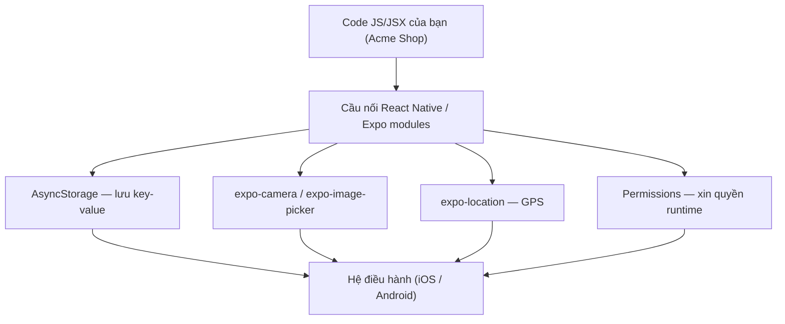
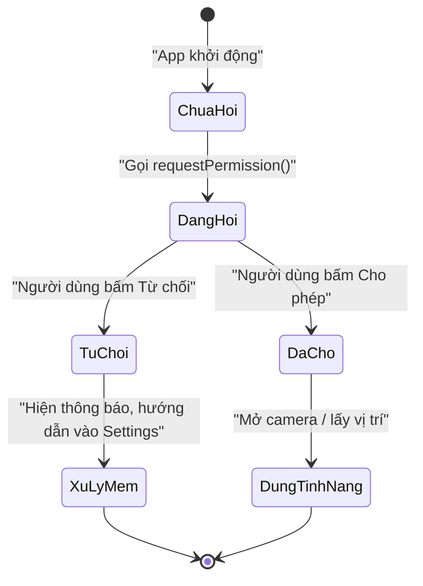

# 📱 Native APIs & nền tảng — Camera, storage, permissions

> **Tác giả:** Mr.Rom\
> **Phiên bản:** v1.0.0\
> **Tạo lúc:** 13/06/2026\
> **Cập nhật:** 13/06/2026\
> **Level:** Basic\
> **Tags:** react-native, expo, native-api, permissions, asyncstorage, camera\
> **Yêu cầu trước:** [Navigation & State](02_navigation-and-state.md)

> 🎯 *Bài trước bạn đã cho app Acme Shop điều hướng giữa màn hình và quản lý state. Nhưng app web vốn không "với" được tới phần cứng — còn app mobile thì có. Sau bài này bạn biết cách **lưu giỏ hàng xuống máy** (AsyncStorage), **mở camera/thư viện ảnh**, **lấy vị trí**, **xin quyền runtime đúng cách**, và viết code **phân biệt iOS vs Android** bằng `Platform` API.*

## 🎯 Sau bài này bạn sẽ

- [ ] Lưu và đọc dữ liệu local bằng **AsyncStorage** (key-value store)
- [ ] Mở **camera** và **thư viện ảnh** với `expo-camera` / `expo-image-picker`
- [ ] Lấy **vị trí GPS** bằng `expo-location`
- [ ] Xin **quyền (permissions) lúc chạy** và xử lý đúng khi người dùng từ chối
- [ ] Viết code khác nhau cho iOS/Android bằng **`Platform.OS`** và **`Platform.select`**
- [ ] Hiểu **native module / Expo modules** là gì — khi nào JS không đủ
- [ ] Biết sơ qua về **deep linking** và **push notifications**

---

## Tình huống — App web không bao giờ "chạm" được vào điện thoại

Bạn đã quen React web. Trên web, muốn lưu data thì có `localStorage`, muốn lấy ảnh thì có `<input type="file">`, muốn vị trí thì gọi `navigator.geolocation`. Browser đứng giữa, nó vừa cho bạn cửa, vừa khoá phần lớn phần cứng lại — bạn không thể tự ý bật camera của người ta.

Giờ Acme Shop chạy như một **app native** trong tay khách. Khách kỳ vọng những thứ rất "mobile":

- 🛒 Thêm sản phẩm vào giỏ → tắt app, mở lại → giỏ **vẫn còn**. Web có `localStorage`, vậy mobile lưu vào đâu?
- 📸 Khách đánh giá sản phẩm muốn **chụp ảnh** đính kèm. Camera của điện thoại — làm sao mở?
- 📍 Khách bấm "Tìm cửa hàng gần tôi" → cần **toạ độ GPS** thật.
- 🔒 Cả 3 việc trên đều đụng tới thứ riêng tư: camera, vị trí. iOS và Android sẽ **bắt xin phép** trước khi cho dùng. Nếu khách bấm "Không cho phép" thì sao?

Đây chính là phần khiến mobile khác hẳn web: bạn không gọi `window` hay `document` nữa, mà gọi vào **Native API** (giao diện lập trình tới tính năng hệ điều hành). Bài này dạy đúng những cánh cửa đó — và cách gõ cửa cho lịch sự.

> 💡 Giả định: project Acme Shop của bạn dùng **Expo** (cách bắt đầu React Native được khuyên dùng năm 2026). Các thư viện `expo-*` bên dưới chạy trên Expo SDK 52+ với New Architecture bật mặc định.

---

## 1️⃣ Native API là gì? — Cây cầu giữa JS và hệ điều hành

Code JavaScript của bạn chạy trong một "hộp" (JS engine). Hộp này tự nó **không biết** camera, GPS, hay ổ đĩa của điện thoại trông như nào. Muốn dùng được, phải có một **cây cầu** nối từ JS sang code native (Swift/Objective-C trên iOS, Kotlin/Java trên Android) — code native mới thật sự nói chuyện được với hệ điều hành.

**Định nghĩa**: *Native API* (giao diện lập trình native) — tập các hàm JS mà React Native (hoặc Expo) cung cấp sẵn, mỗi hàm là một "tay nắm cửa" gọi xuống một tính năng của hệ điều hành (lưu trữ, camera, vị trí, thông báo...).

🪞 **Ẩn dụ**: Hãy tưởng tượng JS của bạn là một người ngồi trong phòng kín, nói tiếng Việt. Hệ điều hành ở phòng bên cạnh, chỉ nói tiếng Swift/Kotlin. **Native API là người phiên dịch** đứng giữa: bạn nói "mở camera" bằng JS, phiên dịch chuyển thành lệnh native, hệ điều hành mở camera rồi trả ảnh ngược lại cho bạn.

Trên web, "người phiên dịch" đó là browser. Trên mobile, đó là React Native + các native module. Mỗi tính năng phần cứng = một cây cầu riêng.

Hiểu khái niệm rồi, ta nhìn toàn cảnh các "cây cầu" qua sơ đồ bên dưới để thấy mọi thứ ăn khớp ở đâu.



→ Điểm mấu chốt: mọi tính năng phần cứng đều đi qua **một cầu nối duy nhất**, và phần lớn (camera, vị trí) còn phải qua **cổng kiểm soát permission** trước khi hệ điều hành cho phép. Nắm được 2 ý này là nắm được cả bài.

---

## 2️⃣ AsyncStorage — Lưu dữ liệu local (như `localStorage` của mobile)

Quay lại nỗi đau đầu tiên: khách thêm hàng vào giỏ, tắt app, mở lại thì giỏ trống trơn. Lý do là **state trong React (`useState`) nằm trong RAM** — app tắt là bay sạch. Cần một nơi ghi xuống bộ nhớ máy, để lần mở sau đọc lại được.

Trên web bạn có `localStorage`. Trên React Native, tương đương là **AsyncStorage**.

**Định nghĩa**: *AsyncStorage* — một kho lưu trữ *key-value* (khoá–giá trị) đơn giản, bất đồng bộ, lưu xuống bộ nhớ thiết bị và **tồn tại qua các lần mở app**.

🪞 **Ẩn dụ**: AsyncStorage giống một **cuốn sổ tay** để cạnh máy. App muốn nhớ gì thì ghi vào sổ theo dạng "nhãn → nội dung" (`"cart"` → danh sách sản phẩm). App tắt rồi mở lại, sổ vẫn nằm đó, lật ra đọc tiếp.

Có 2 khác biệt quan trọng so với `localStorage` web mà bạn phải nhớ:

- **Bất đồng bộ (async)**: mọi thao tác trả về `Promise` → phải `await`. (Web `localStorage` là đồng bộ, đọc ra ngay.)
- **Chỉ lưu được `string`**: muốn lưu object/array → phải `JSON.stringify` lúc ghi và `JSON.parse` lúc đọc.

### Cài đặt

AsyncStorage không có sẵn trong core React Native nữa (đã tách ra thư viện riêng). Với Expo, dùng lệnh `expo install` để nó tự chọn phiên bản tương thích với SDK đang dùng:

```bash
npx expo install @react-native-async-storage/async-storage
```

Lệnh trên thêm thư viện vào `package.json` và cấu hình native cần thiết. Sau lệnh này bạn import được module trong code.

### Đọc / ghi cơ bản

API chỉ có vài hàm chính. Đoạn dưới minh hoạ trọn vòng đời: ghi một chuỗi, đọc lại, rồi xoá. Để ý mọi hàm đều `await`:

```javascript
import AsyncStorage from '@react-native-async-storage/async-storage';

// 1. Ghi một giá trị (key, value đều là string)
await AsyncStorage.setItem('username', 'Nguyen Van A');

// 2. Đọc lại — trả về string, hoặc null nếu key chưa tồn tại
const name = await AsyncStorage.getItem('username');
console.log(name); // "Nguyen Van A"

// 3. Xoá một key
await AsyncStorage.removeItem('username');
```

→ Nếu key chưa từng được ghi, `getItem` trả về `null` chứ không lỗi — nên luôn kiểm tra `null` trước khi dùng.

### Lưu object/array — phải JSON hoá

Giỏ hàng là một **mảng object**, không phải string. AsyncStorage không nuốt được object trực tiếp, nên ta gói nó vào JSON khi ghi và bung ra khi đọc. Hai hàm helper dưới đây là khuôn mẫu bạn sẽ tái dùng khắp nơi:

```javascript
import AsyncStorage from '@react-native-async-storage/async-storage';

const CART_KEY = 'acme_cart';

// Lưu giỏ hàng (mảng object) xuống máy
async function saveCart(cart) {
  // 1. Biến mảng object thành chuỗi JSON
  const json = JSON.stringify(cart);
  // 2. Ghi chuỗi đó xuống AsyncStorage
  await AsyncStorage.setItem(CART_KEY, json);
}

// Đọc giỏ hàng từ máy
async function loadCart() {
  // 1. Đọc chuỗi JSON ra (có thể là null nếu chưa lưu lần nào)
  const json = await AsyncStorage.getItem(CART_KEY);
  // 2. Chưa có gì thì trả mảng rỗng cho an toàn
  if (json === null) {
    return [];
  }
  // 3. Bung chuỗi JSON trở lại thành mảng object
  return JSON.parse(json);
}
```

→ Cặp `JSON.stringify` / `JSON.parse` là "hải quan" bắt buộc cho mọi data không phải string. Quên `JSON.parse` lúc đọc thì bạn nhận về một chuỗi `"[{...}]"` chứ không phải mảng dùng được.

### Ví dụ thật — Giỏ hàng Acme Shop tự lưu

Giờ ráp lại thành một màn hình hoàn chỉnh. Component dưới đây làm 3 việc: **đọc giỏ khi mở màn hình** (qua `useEffect`), **thêm sản phẩm** vào giỏ, và **lưu lại sau mỗi thay đổi**. Đây chính là lời giải cho nỗi đau "tắt app mất giỏ" ở đầu bài:

```jsx
import { useEffect, useState } from 'react';
import { View, Text, Button, FlatList } from 'react-native';
import AsyncStorage from '@react-native-async-storage/async-storage';

const CART_KEY = 'acme_cart';

// Vài sản phẩm mẫu của Acme Shop
const PRODUCTS = [
  { id: 1, name: 'iPhone 15', price: 25000000 },
  { id: 2, name: 'AirPods Pro', price: 5000000 },
];

export default function CartScreen() {
  const [cart, setCart] = useState([]);

  // 1. Khi màn hình mở lần đầu → đọc giỏ đã lưu từ AsyncStorage
  useEffect(() => {
    async function restore() {
      const json = await AsyncStorage.getItem(CART_KEY);
      if (json !== null) {
        setCart(JSON.parse(json));
      }
    }
    restore();
  }, []);

  // 2. Thêm 1 sản phẩm + lưu lại ngay xuống máy
  async function addToCart(product) {
    const next = [...cart, product]; // tạo mảng mới (không mutate state cũ)
    setCart(next);
    await AsyncStorage.setItem(CART_KEY, JSON.stringify(next));
  }

  // 3. Xoá sạch giỏ + xoá luôn key trong storage
  async function clearCart() {
    setCart([]);
    await AsyncStorage.removeItem(CART_KEY);
  }

  return (
    <View style={{ padding: 20 }}>
      <Text style={{ fontSize: 20, fontWeight: 'bold' }}>
        Giỏ hàng ({cart.length})
      </Text>

      <FlatList
        data={cart}
        keyExtractor={(item, index) => `${item.id}-${index}`}
        renderItem={({ item }) => (
          <Text>• {item.name} — {item.price.toLocaleString()}đ</Text>
        )}
      />

      {PRODUCTS.map((p) => (
        <Button key={p.id} title={`Thêm ${p.name}`} onPress={() => addToCart(p)} />
      ))}
      <Button title="Xoá giỏ" color="red" onPress={clearCart} />
    </View>
  );
}
```

→ Lần đầu mở app giỏ rỗng. Bạn thêm vài món, tắt app hẳn, mở lại — `useEffect` chạy `getItem`, giỏ hiện đúng như lúc đóng. Đó là khác biệt cốt lõi giữa "state trong RAM" (`useState`) và "data bền vững trên máy" (AsyncStorage).

> ⚠️ AsyncStorage chỉ hợp với data nhỏ (cài đặt, giỏ hàng, token). Data lớn/nhiều bản ghi (lịch sử đơn hàng hàng nghìn dòng) nên dùng database trên máy như SQLite (`expo-sqlite`) — sẽ bàn ở level sau.

---

## 3️⃣ Permissions — Xin quyền lúc chạy (và xử lý khi bị từ chối)

Trước khi đụng tới camera hay vị trí, phải hiểu một luật bất di bất dịch của mobile: **camera, micro, vị trí, ảnh, thông báo... đều là dữ liệu nhạy cảm**. iOS và Android không cho app tự ý dùng — app phải **xin phép người dùng lúc chạy** (*runtime permission*), và người dùng có toàn quyền **từ chối**.

🪞 **Ẩn dụ**: app như một người khách tới nhà bạn. Muốn vào bếp (camera), vào phòng ngủ (ảnh), hay xem sổ địa chỉ (vị trí) — khách phải **hỏi xin** từng phòng. Bạn có thể gật, có thể lắc đầu, hoặc nói "đừng hỏi lại nữa". App phải lịch sự xử lý cả ba trường hợp.

### Vòng đời một permission

Mỗi quyền có một **trạng thái** mà bạn đọc được trong code. Hiểu các trạng thái này là chìa khoá để xử lý từ chối cho đúng:

| Trạng thái (`status`) | Nghĩa | App nên làm gì |
|---|---|---|
| `undetermined` | Chưa hỏi lần nào | Gọi hàm xin quyền (hệ thống hiện hộp thoại) |
| `granted` | Người dùng đã đồng ý | Dùng tính năng bình thường |
| `denied` | Người dùng đã từ chối | Giải thích vì sao cần, hoặc chỉ họ vào Settings bật tay |

Đa số thư viện `expo-*` cho bạn 2 thứ: một **hook đọc trạng thái** (`useXxxPermissions`) và một **hàm để xin** (`requestPermission`). Mẫu xử lý chuẩn luôn là: kiểm tra trạng thái → nếu chưa có thì xin → nếu bị từ chối thì xử lý mềm, **không để app crash hay treo im lặng**.

Sơ đồ dưới mô tả đúng luồng quyết định mà mọi tính năng cần quyền đều đi qua:



→ Nhánh `TuChoi → XuLyMem` chính là chỗ 90% bug permission xảy ra: lập trình viên chỉ code nhánh "được phép" rồi quên nhánh "bị từ chối", khiến app bấm nút mà chẳng có gì xảy ra.

### Cấu hình lời giải thích (iOS bắt buộc)

iOS **bắt buộc** mỗi quyền phải kèm một câu giải thích hiển thị trong hộp thoại — thiếu nó app sẽ bị App Store từ chối. Với Expo, ta khai báo trong `app.json` qua plugin của từng thư viện. Ví dụ cho camera và vị trí:

```json
{
  "expo": {
    "plugins": [
      [
        "expo-camera",
        {
          "cameraPermission": "Acme Shop cần camera để bạn chụp ảnh đánh giá sản phẩm."
        }
      ],
      [
        "expo-location",
        {
          "locationWhenInUsePermission": "Acme Shop cần vị trí để tìm cửa hàng gần bạn."
        }
      ]
    ]
  }
}
```

→ Chuỗi này chính là dòng chữ khách thấy trong hộp thoại xin quyền. Viết rõ ràng, đúng mục đích — vừa để App Store duyệt, vừa để khách yên tâm bấm "Cho phép".

---

## 4️⃣ Camera & Image Picker — Chụp ảnh và chọn ảnh

Có 2 nhu cầu khác nhau, đừng nhầm:

- **Chụp ảnh mới ngay** → `expo-camera` (mở camera trong app, bạn tự dựng giao diện chụp).
- **Chọn ảnh có sẵn / chụp nhanh qua giao diện hệ thống** → `expo-image-picker` (mở thư viện ảnh hoặc camera của hệ điều hành, nhẹ và nhanh).

Với Acme Shop, "khách đính kèm ảnh đánh giá", `expo-image-picker` là lựa chọn gọn nhất vì nó cho người dùng tự chọn ảnh cũ hoặc chụp mới mà không cần bạn dựng UI camera.

### Cài đặt

Cài cả hai để bạn thử được cả 2 hướng:

```bash
npx expo install expo-camera expo-image-picker
```

### Image Picker — chọn ảnh từ thư viện (đầy đủ xử lý quyền)

Đây là ví dụ hoàn chỉnh nhất của bài: xin quyền **đúng cách**, xử lý khi bị **từ chối**, rồi mới mở thư viện ảnh. Để ý cấu trúc `if/else` bám sát sơ đồ trạng thái ở mục 3:

```jsx
import { useState } from 'react';
import { View, Button, Image, Alert } from 'react-native';
import * as ImagePicker from 'expo-image-picker';

export default function ReviewPhotoScreen() {
  const [imageUri, setImageUri] = useState(null);

  async function pickImage() {
    // 1. Xin quyền truy cập thư viện ảnh — trả về { status, granted, ... }
    const permission = await ImagePicker.requestMediaLibraryPermissionsAsync();

    // 2. Người dùng từ chối → xử lý mềm, KHÔNG để im lặng
    if (!permission.granted) {
      Alert.alert(
        'Cần quyền truy cập ảnh',
        'Acme Shop cần quyền xem ảnh để bạn đính kèm vào đánh giá. ' +
          'Bạn có thể bật lại trong Cài đặt.',
      );
      return; // dừng tại đây, không gọi tiếp
    }

    // 3. Có quyền → mở thư viện ảnh
    const result = await ImagePicker.launchImageLibraryAsync({
      mediaTypes: ['images'], // chỉ cho chọn ảnh
      quality: 0.7, // nén ảnh còn 70% để gửi server nhẹ hơn
    });

    // 4. Người dùng có thể bấm Huỷ → result.canceled === true
    if (!result.canceled) {
      setImageUri(result.assets[0].uri);
    }
  }

  return (
    <View style={{ padding: 20, gap: 12 }}>
      <Button title="Chọn ảnh đánh giá" onPress={pickImage} />
      {imageUri && (
        <Image source={{ uri: imageUri }} style={{ width: 200, height: 200 }} />
      )}
    </View>
  );
}
```

→ 4 nhánh đều được lo: chưa hỏi (tự hỏi), từ chối (báo + dừng), đồng ý (mở picker), người dùng huỷ (`result.canceled`). Kết quả trả về nằm trong `result.assets[0].uri` — một đường dẫn `file://` tới ảnh, sẵn sàng để `<Image>` hiển thị hoặc upload lên server.

> ⚠️ Từ `expo-image-picker` SDK 52, `mediaTypes` nhận **mảng string** (`['images']`, `['videos']`) thay cho hằng `MediaTypeOptions` cũ. Tài liệu cũ trên mạng có thể còn ghi kiểu cũ — dùng kiểu mảng cho đúng phiên bản hiện hành.

### Camera — chụp ảnh mới ngay trong app

Nếu cần camera ngay trong giao diện app (ví dụ màn hình quét đặc thù), dùng component `<CameraView>` của `expo-camera`. Điểm khác là ở đây ta dùng **hook quyền** `useCameraPermissions` — nó cho cả trạng thái lẫn hàm xin, rất hợp với render có điều kiện:

```jsx
import { useRef } from 'react';
import { View, Text, Button, StyleSheet } from 'react-native';
import { CameraView, useCameraPermissions } from 'expo-camera';

export default function CameraScreen() {
  const [permission, requestPermission] = useCameraPermissions();
  const cameraRef = useRef(null);

  // 1. Hook chưa sẵn sàng (đang load trạng thái lần đầu)
  if (!permission) {
    return <View />;
  }

  // 2. Chưa được cấp quyền → hiện nút xin quyền, KHÔNG render camera
  if (!permission.granted) {
    return (
      <View style={styles.center}>
        <Text>Acme Shop cần quyền camera để chụp ảnh sản phẩm.</Text>
        <Button title="Cho phép camera" onPress={requestPermission} />
      </View>
    );
  }

  // 3. Đã có quyền → render camera thật
  async function takePhoto() {
    const photo = await cameraRef.current.takePictureAsync();
    console.log('Đã chụp:', photo.uri);
  }

  return (
    <View style={{ flex: 1 }}>
      <CameraView ref={cameraRef} style={{ flex: 1 }} facing="back" />
      <Button title="Chụp" onPress={takePhoto} />
    </View>
  );
}

const styles = StyleSheet.create({
  center: { flex: 1, justifyContent: 'center', alignItems: 'center', gap: 12 },
});
```

→ Pattern "render theo trạng thái quyền" này rất đẹp: chưa có quyền thì không vẽ camera, chỉ vẽ lời mời cấp quyền. Người dùng không bao giờ thấy camera đen thui vì thiếu quyền.

---

## 5️⃣ Location — Lấy vị trí GPS

Nỗi đau cuối: "Tìm cửa hàng gần tôi". Việc này cần **toạ độ thật** của khách — `expo-location` lo phần đó. Vị trí cũng là dữ liệu nhạy cảm nên y hệt camera: phải xin quyền trước.

### Cài đặt

```bash
npx expo install expo-location
```

### Lấy toạ độ hiện tại

Đoạn dưới xin quyền, kiểm tra từ chối, rồi đọc một lần toạ độ hiện tại. Kết quả là object `coords` chứa `latitude` / `longitude`:

```jsx
import { useState } from 'react';
import { View, Text, Button, Alert } from 'react-native';
import * as Location from 'expo-location';

export default function NearbyStoreScreen() {
  const [coords, setCoords] = useState(null);

  async function findMe() {
    // 1. Xin quyền vị trí khi-đang-dùng-app (foreground)
    const { status } = await Location.requestForegroundPermissionsAsync();

    // 2. Bị từ chối → báo rõ, dừng lại
    if (status !== 'granted') {
      Alert.alert('Cần quyền vị trí', 'Không thể tìm cửa hàng gần bạn nếu không có vị trí.');
      return;
    }

    // 3. Có quyền → đọc toạ độ hiện tại
    const location = await Location.getCurrentPositionAsync({
      accuracy: Location.Accuracy.Balanced, // cân bằng độ chính xác và pin
    });
    setCoords(location.coords);
  }

  return (
    <View style={{ padding: 20, gap: 12 }}>
      <Button title="Tìm cửa hàng gần tôi" onPress={findMe} />
      {coords && (
        <Text>
          Vĩ độ: {coords.latitude.toFixed(4)} — Kinh độ: {coords.longitude.toFixed(4)}
        </Text>
      )}
    </View>
  );
}
```

→ Có `latitude` / `longitude` rồi, bạn gửi lên server Acme để tính cửa hàng gần nhất. Lưu ý `requestForegroundPermissionsAsync` chỉ xin quyền **khi app đang mở**; muốn theo dõi vị trí lúc app chạy nền (giao hàng chẳng hạn) cần thêm quyền *background* — phức tạp hơn và để dành level sau.

> ⚠️ Trên simulator/emulator, GPS thường là một toạ độ giả cố định (Apple HQ, Google HQ). Muốn thử vị trí thật phải chạy trên máy thật hoặc set toạ độ giả trong simulator.

---

## 6️⃣ Platform API — Khi iOS và Android phải khác nhau

Viết một codebase chạy cả hai nền tảng là điểm mạnh của React Native, nhưng đôi khi bạn **cố ý** muốn khác: iOS có "notch", Android có nút back vật lý, font hệ thống khác, khoảng đệm status bar khác. React Native cho bạn `Platform` API để rẽ nhánh gọn gàng.

### `Platform.OS` — biết đang chạy nền nào

`Platform.OS` là một chuỗi: `'ios'` hoặc `'android'`. Dùng nó để rẽ nhánh logic:

```jsx
import { Platform, Text } from 'react-native';

function Greeting() {
  const label = Platform.OS === 'ios' ? 'Chào người dùng iPhone' : 'Chào người dùng Android';
  return <Text>{label}</Text>;
}
```

→ Đơn giản, nhưng `if/else` rải khắp code sẽ rối. Với khác biệt về **giá trị** (số, style), có cách gọn hơn.

### `Platform.select` — chọn giá trị theo nền tảng

`Platform.select` nhận một object có khoá `ios` / `android` (và `default`), trả về đúng giá trị của nền tảng đang chạy. Rất hợp để xử lý khác biệt style — ví dụ đệm status bar:

```jsx
import { Platform, StyleSheet, View, Text } from 'react-native';

const styles = StyleSheet.create({
  header: {
    // iOS có notch nên cần đệm trên cao hơn Android
    paddingTop: Platform.select({ ios: 50, android: 24 }),
    backgroundColor: '#2563eb',
  },
});

function Header() {
  return (
    <View style={styles.header}>
      <Text style={{ color: 'white' }}>Acme Shop</Text>
    </View>
  );
}
```

→ Một dòng `Platform.select` thay cho cả khối `if/else`. Code đọc lên rõ ngay: "iOS đệm 50, Android đệm 24".

### `Platform.Version` — biết phiên bản hệ điều hành

Đôi khi bạn cần biết phiên bản OS để bật/tắt tính năng. Lưu ý kiểu dữ liệu **khác nhau** giữa hai nền — đây là cạm bẫy hay gặp:

```jsx
import { Platform } from 'react-native';

// Android: Platform.Version là SỐ (API level, vd 34)
// iOS: Platform.Version là CHUỖI (vd "17.4")
if (Platform.OS === 'android' && Platform.Version >= 33) {
  console.log('Android 13 trở lên — dùng quyền thông báo runtime mới');
}
```

→ Trên Android `Platform.Version` là số (API level), trên iOS là chuỗi phiên bản. So sánh cần để ý kiểu, tránh bug âm thầm.

### File riêng theo nền tảng (`.ios.js` / `.android.js`)

Khi một component khác nhau **quá nhiều** giữa hai nền, đừng nhồi `if` vào một file. React Native tự chọn file theo đuôi: tạo `Button.ios.js` và `Button.android.js`, rồi `import Button from './Button'` — bundler tự lấy đúng file cho từng nền. Cách này giữ mỗi file sạch và chuyên biệt.

---

## 7️⃣ Native module & Expo modules — Khi JavaScript không đủ

Tất cả thứ trên đều có sẵn thư viện JS gọi là dùng. Nhưng giả sử Acme cần tích hợp một **SDK thanh toán** chỉ phát hành dưới dạng thư viện native (Swift/Kotlin), không có wrapper JS. Lúc đó JS "với" không tới — cần viết một **native module** làm cầu nối.

**Định nghĩa**: *Native module* — một đoạn code native (Swift/Kotlin) bạn viết để **mở thêm một cây cầu mới** từ JS xuống một tính năng mà React Native chưa có sẵn.

🪞 **Ẩn dụ**: ở mục 1, native module có sẵn (camera, GPS) là những "cây cầu đã xây". Khi cần một tính năng chưa ai xây cầu, bạn phải **tự đúc cầu** — đó là viết native module.

Có 2 con đường, từ dễ tới khó:

| Cách | Khi nào dùng | Độ khó |
|---|---|---|
| Tìm thư viện cộng đồng (`expo-*`, npm) | 95% nhu cầu phổ biến đã có sẵn — tìm trước khi tự viết | Dễ — chỉ cần `npx expo install` |
| **Expo Modules API** | Cần wrap một SDK native, viết bằng Swift/Kotlin với API gọn | Trung bình — cần biết chút native |
| **Native module thuần (Turbo Module)** | Trường hợp đặc biệt, hiệu năng cao, không qua Expo | Khó — cần thạo native + New Architecture |

> 💡 Với người mới năm 2026: **gần như không bao giờ phải tự viết native module**. Hệ sinh thái Expo + npm đã phủ hầu hết nhu cầu. Chỉ cần biết khái niệm này tồn tại, để khi gặp tính năng "JS không với tới" thì bạn biết hướng đi, chứ không hoảng.

Với New Architecture (mặc định từ RN 0.76+/Expo SDK 52+), cầu nối thế hệ mới gọi là **Turbo Modules** và **Fabric** (cho UI) — nhanh hơn cầu cũ vì gọi trực tiếp qua JSI thay vì serialize qua "bridge" JSON cũ. Bạn chưa cần đụng tới chi tiết này, chỉ cần biết "kiến trúc mới nhanh hơn kiến trúc cũ".

---

## 8️⃣ Linking & Notifications — Nhắc qua

Hai tính năng native rất phổ biến, mình giới thiệu để bạn biết đường tự tìm hiểu sau.

**Deep linking** — mở app từ một đường link (`acmeshop://product/15` hoặc `https://acmeshop.vn/product/15`). Khách bấm link trong email/Zalo → app mở thẳng vào đúng sản phẩm. React Navigation tích hợp sẵn linking; phần khai báo scheme nằm trong `app.json`:

```json
{
  "expo": {
    "scheme": "acmeshop"
  }
}
```

→ Có `scheme` này, link dạng `acmeshop://...` sẽ mở app. Phần map link → màn hình do React Navigation lo (xem lại bài Navigation).

**Push notifications** — gửi thông báo đẩy ("Đơn hàng đang giao!") ngay cả khi app đóng. Expo có `expo-notifications` lo phần nhận và hiển thị, kết hợp dịch vụ đẩy của Expo/Firebase/APNs. Đây là một mảng lớn (cần server gửi, token thiết bị, quyền thông báo) — để dành chuyên đề riêng. Điểm cần nhớ: notification cũng là **quyền runtime** (Android 13+ và iOS đều bắt xin), nên áp dụng đúng pattern xử lý từ chối ở mục 3.

---

## 💡 Cạm bẫy thường gặp & Best practice

### ❌ Cạm bẫy: Không xử lý khi người dùng từ chối quyền
- **Triệu chứng**: bấm nút "Chọn ảnh" / "Tìm vị trí" mà chẳng có gì xảy ra; hoặc tệ hơn, app crash với lỗi truy cập camera/vị trí.
- **Nguyên nhân**: code chỉ giả định người dùng luôn bấm "Cho phép", gọi thẳng `launchImageLibraryAsync` mà không kiểm tra `permission.granted`.
- **Cách tránh**: luôn kiểm tra `status`/`granted` sau khi xin quyền. Nếu bị từ chối → hiện `Alert` giải thích vì sao cần quyền và hướng dẫn vào Settings bật tay, rồi `return` sớm.

### ❌ Cạm bẫy: Quên JSON hoá khi lưu object vào AsyncStorage
- **Triệu chứng**: đọc giỏ hàng ra thấy `"[object Object]"` hoặc một chuỗi lạ, không phải mảng.
- **Nguyên nhân**: AsyncStorage chỉ lưu được string; gọi `setItem(key, cartArray)` thì JS tự ép kiểu mảng thành chuỗi rác.
- **Cách tránh**: `setItem(key, JSON.stringify(data))` lúc ghi, `JSON.parse(json)` lúc đọc. Và luôn kiểm tra `null` (key chưa tồn tại) trước khi `JSON.parse`.

### ❌ Cạm bẫy: Quên khác biệt iOS/Android (đặc biệt status bar & `Platform.Version`)
- **Triệu chứng**: header bị che mất một phần dưới notch iPhone; hoặc so sánh `Platform.Version` ra kết quả sai trên iOS.
- **Nguyên nhân**: hard-code một giá trị padding cho cả hai nền; quên rằng `Platform.Version` là số trên Android nhưng chuỗi trên iOS.
- **Cách tránh**: dùng `Platform.select({ ios, android })` cho giá trị khác nhau, và `react-native-safe-area-context` cho vùng an toàn (notch, status bar) thay vì hard-code.

### ✅ Best practice: Tìm thư viện trước khi tự viết native
- **Vì sao**: 95% nhu cầu phần cứng (camera, GPS, sinh trắc, NFC, in...) đã có thư viện `expo-*` hoặc npm chất lượng cao, được cộng đồng test kỹ trên cả hai nền.
- **Cách áp dụng**: search "expo <tính năng>" hoặc "react native <tính năng>" trước. Chỉ cân nhắc Expo Modules API / native module khi thật sự không có sẵn.

### ✅ Best practice: Xin quyền đúng lúc, kèm ngữ cảnh
- **Vì sao**: xin một loạt quyền ngay khi mở app khiến người dùng hoảng và bấm "Từ chối" hàng loạt. Xin đúng lúc họ cần (bấm "Chụp ảnh" mới xin camera) thì tỉ lệ đồng ý cao hơn nhiều.
- **Cách áp dụng**: gắn lời xin quyền vào ngay hành động cần nó. Viết câu giải thích (`app.json`) rõ ràng, đúng mục đích Acme Shop.

---

## 🧠 Tự kiểm tra (Self-check)

**Q1.** Vì sao khi lưu giỏ hàng (một mảng object) vào AsyncStorage lại phải dùng `JSON.stringify`?

<details>
<summary>💡 Đáp án</summary>

Vì AsyncStorage **chỉ lưu được giá trị kiểu `string`**. Mảng/object không phải string nên phải biến thành chuỗi JSON bằng `JSON.stringify` lúc ghi, và bung trở lại bằng `JSON.parse` lúc đọc. Nếu truyền thẳng mảng vào `setItem`, JS sẽ ép kiểu thành chuỗi rác (`"[object Object]"`).

</details>

**Q2.** Sau khi gọi `requestMediaLibraryPermissionsAsync()`, làm sao biết người dùng đã từ chối, và app nên làm gì?

<details>
<summary>💡 Đáp án</summary>

Hàm trả về object có `status` (`'granted'` / `'denied'` / `'undetermined'`) và `granted` (boolean). Nếu `!permission.granted` → người dùng từ chối. App nên hiện `Alert` giải thích vì sao cần quyền và hướng dẫn vào Settings bật tay, rồi `return` sớm — **không** gọi tiếp `launchImageLibraryAsync` (sẽ không hoạt động hoặc lỗi).

</details>

**Q3.** Khác biệt giữa `Platform.OS` và `Platform.select` là gì? Khi nào dùng cái nào?

<details>
<summary>💡 Đáp án</summary>

`Platform.OS` là một chuỗi (`'ios'` / `'android'`) — dùng để **rẽ nhánh logic** (`if`, ternary). `Platform.select({ ios, android })` trả về **một giá trị** ứng với nền tảng đang chạy — gọn hơn khi chỉ cần chọn giá trị (số padding, style, config) thay vì viết cả khối `if/else`.

</details>

**Q4.** Khi nào bạn cần tự viết một native module thay vì dùng thư viện JS có sẵn?

<details>
<summary>💡 Đáp án</summary>

Khi tính năng cần dùng **chưa có thư viện JS/Expo nào wrap** — ví dụ một SDK native (thanh toán, phần cứng đặc thù) chỉ phát hành dưới dạng Swift/Kotlin. Lúc đó bạn dùng **Expo Modules API** (hoặc Turbo Module) để tự "đúc cầu" từ JS xuống native. Năm 2026, với người mới, trường hợp này gần như không xảy ra vì hệ sinh thái đã phủ hầu hết nhu cầu.

</details>

**Q5.** Trên simulator/emulator, vì sao `getCurrentPositionAsync` thường trả về cùng một toạ độ lạ?

<details>
<summary>💡 Đáp án</summary>

Vì simulator/emulator không có GPS thật — nó dùng một **toạ độ giả mặc định** (thường là trụ sở Apple/Google) hoặc toạ độ bạn tự set trong cài đặt simulator. Muốn test vị trí thật phải chạy trên thiết bị thật, hoặc đổi toạ độ giả trong menu của simulator.

</details>

---

## ⚡ Tra cứu nhanh (Cheatsheet)

| Mục đích | Lệnh / Cú pháp |
|---|---|
| Cài AsyncStorage | `npx expo install @react-native-async-storage/async-storage` |
| Ghi data | `await AsyncStorage.setItem('key', JSON.stringify(data))` |
| Đọc data | `const json = await AsyncStorage.getItem('key')` |
| Xoá data | `await AsyncStorage.removeItem('key')` |
| Cài camera + picker | `npx expo install expo-camera expo-image-picker` |
| Xin quyền thư viện ảnh | `await ImagePicker.requestMediaLibraryPermissionsAsync()` |
| Mở thư viện ảnh | `await ImagePicker.launchImageLibraryAsync({ mediaTypes: ['images'] })` |
| Hook quyền camera | `const [permission, requestPermission] = useCameraPermissions()` |
| Cài location | `npx expo install expo-location` |
| Xin quyền vị trí | `await Location.requestForegroundPermissionsAsync()` |
| Lấy toạ độ | `await Location.getCurrentPositionAsync()` |
| Biết nền tảng | `Platform.OS` → `'ios'` / `'android'` |
| Chọn giá trị theo nền | `Platform.select({ ios: A, android: B })` |

---

## 📚 Từ Điển Thuật Ngữ (Glossary)

| EN | VN | Giải thích |
|---|---|---|
| Native API | API native | Tập hàm JS gọi xuống tính năng hệ điều hành (camera, GPS, lưu trữ) |
| AsyncStorage | Kho lưu key-value | Kho lưu local bất đồng bộ, chỉ chứa string, bền qua các lần mở app |
| Permission | Quyền | Sự cho phép của người dùng để app dùng tính năng nhạy cảm |
| Runtime permission | Quyền lúc chạy | Quyền xin ngay khi app đang chạy, người dùng có thể từ chối |
| Image Picker | Bộ chọn ảnh | Module mở thư viện ảnh / camera của hệ thống để chọn hoặc chụp |
| `Platform.OS` | Nền tảng hiện tại | Chuỗi `'ios'` hoặc `'android'` cho biết app đang chạy nền nào |
| `Platform.select` | Chọn theo nền | Trả về giá trị ứng với nền tảng đang chạy |
| Native module | Module native | Code native (Swift/Kotlin) tạo cầu nối JS tới tính năng chưa có sẵn |
| Expo Modules API | API module Expo | Cách viết native module gọn bằng Swift/Kotlin trong Expo |
| Turbo Module | Module thế hệ mới | Native module của New Architecture, gọi nhanh qua JSI |
| Deep linking | Liên kết sâu | Mở app vào đúng màn hình từ một đường link ngoài |
| Push notification | Thông báo đẩy | Thông báo gửi tới thiết bị kể cả khi app đang đóng |

---

## 🔗 Liên kết & Tài nguyên

### 🧭 Định hướng lộ trình học

- ⬅️ **Bài trước:** [Navigation & State — React Navigation, quản lý dữ liệu](02_navigation-and-state.md)
- ➡️ **Bài tiếp theo:** [Build, Debug & Publish — Từ Metro đến App Store/Play Store](04_build-debug-and-publish.md)
- ↑ **Về cụm:** [react-native README](../../README.md)

### 🧩 Các chủ đề có thể bạn quan tâm

- [React Native là gì? — Viết app native bằng React](00_what-is-react-native.md)
- [Core Components & Styling — View, Text, Flexbox](01_core-components-and-styling.md)
- [React là gì? — Component framework #1 cho frontend (web)](../../../../07_web/frontend/react/lessons/01_basic/00_what-is-react.md)

### 🌐 Tài nguyên tham khảo khác

- [Expo docs — AsyncStorage](https://docs.expo.dev/versions/latest/sdk/async-storage/) — API lưu key-value local
- [Expo docs — ImagePicker](https://docs.expo.dev/versions/latest/sdk/imagepicker/) — chọn/chụp ảnh
- [Expo docs — Camera](https://docs.expo.dev/versions/latest/sdk/camera/) — camera trong app
- [Expo docs — Location](https://docs.expo.dev/versions/latest/sdk/location/) — vị trí GPS
- [Expo docs — Permissions](https://docs.expo.dev/guides/permissions/) — hướng dẫn xin quyền
- [React Native — Platform-Specific Code](https://reactnative.dev/docs/platform-specific-code) — code riêng iOS/Android

---

> 🎯 *Sau bài này app Acme Shop của bạn đã "với" được tới phần cứng: lưu giỏ hàng bền vững, chụp/chọn ảnh, lấy vị trí, và xử lý quyền lịch sự. Bài cuối cụm sẽ đưa app từ máy bạn ra thế giới — build, debug và publish lên App Store / Play Store.*

---

## 📌 Nhật ký thay đổi (Changelog)

- **v1.0.0 (13/06/2026)** — Bản đầu tiên. Cluster `react-native/` lesson 4/5. Cover: Native API tổng quan + AsyncStorage (lưu/đọc/JSON hoá + ví dụ giỏ hàng Acme) + Permissions runtime (vòng đời + xử lý từ chối) + Camera & Image Picker + Location/GPS + Platform API (`Platform.OS`, `Platform.select`, `Platform.Version`, file `.ios/.android`) + giới thiệu native module / Expo Modules + nhắc deep linking & push notifications. Kèm 2 sơ đồ mermaid (cầu nối native, vòng đời permission).
