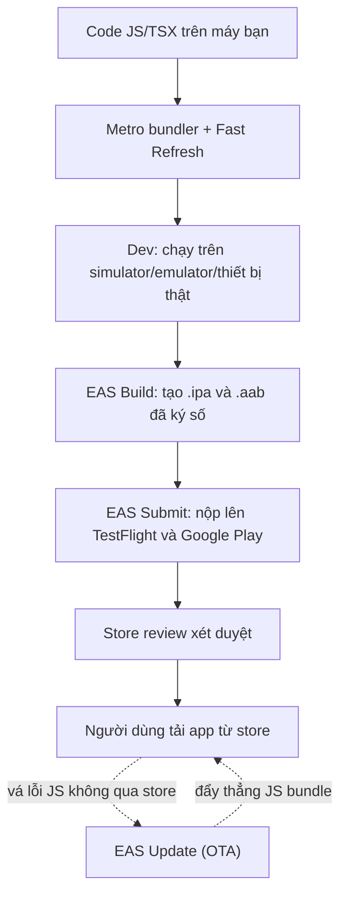

# Build, Debug & Publish — Từ Metro đến App Store/Play Store

> **Tác giả:** Mr.Rom\
> **Phiên bản:** v1.0.0\
> **Tạo lúc:** 13/06/2026\
> **Cập nhật:** 13/06/2026\
> **Level:** Basic\
> **Tags:** react-native, expo, eas, build, deploy, app-store, play-store, ota\
> **Yêu cầu trước:** [Native APIs & nền tảng](03_native-apis-and-platform.md)

> 🎯 *Bạn đã viết xong app Acme Shop bằng React Native — có UI, navigation, gọi camera và lưu storage. Nhưng nó mới chỉ chạy trên máy bạn. Sau bài này bạn nắm trọn vòng đời từ lúc `npx expo start` bật Metro, debug bug, build file `.ipa`/`.aab` bằng EAS, nộp lên App Store + Play Store, đến đẩy bản vá tức thì bằng OTA update — đóng lại cụm React Native.*

## 🎯 Sau bài này bạn sẽ

- [ ] Hiểu **Metro bundler** + **Fast Refresh** làm gì trong vòng dev
- [ ] Debug app: **React DevTools**, console, error boundary, debug **New Architecture**
- [ ] Chạy app trên **simulator/emulator** và **thiết bị thật**
- [ ] Build production bằng **EAS Build** — tạo file `.ipa` (iOS) và `.aab` (Android)
- [ ] Nộp app: **TestFlight** + App Store, **Google Play** (review, signing) bằng **EAS Submit**
- [ ] Đẩy bản vá JS không qua store review bằng **EAS Update** (OTA)
- [ ] Quản lý **versioning** đúng cách (version vs build number, runtime version)

---

## Tình huống — App chạy ngon trên máy bạn, rồi sao nữa?

Bạn vừa hoàn thành app Acme Shop: màn product list, giỏ hàng, chụp ảnh review sản phẩm, lưu token đăng nhập. Trên máy bạn nó chạy mượt qua `npx expo start`. Nhưng:

- 😱 Sếp hỏi: *"Gửi cho anh cái app cài vào iPhone test thử"* — bạn không có cách nào "gửi" cái app đang chạy trên Metro.
- 😱 App store yêu cầu file `.ipa` (iOS) và `.aab` (Android) đã **ký số** (signed) — bạn chưa từng tạo.
- 😱 iOS bắt phải có máy Mac + Xcode + chứng chỉ Apple Developer mới build được. Bạn dùng Windows.
- 😱 Phát hiện 1 bug typo sau khi đã release — chẳng lẽ sửa 1 chữ cũng phải đợi Apple review 1-2 ngày?

Đây chính là khoảng cách giữa **"code chạy được"** và **"app người dùng tải về từ store"**. Bài này lấp đầy khoảng cách đó.

> 💡 Trước khi đi vào lệnh, ta cần hình dung toàn bộ con đường một dòng code đi từ editor của bạn ra tới điện thoại người dùng. Sơ đồ dưới mô tả 3 chặng lớn.



> 📖 *Nhìn sơ đồ thấy rõ: chặng dev (Metro) bạn đã quen, chặng build/submit là phần mới của bài, còn mũi tên đứt OTA là "đường tắt" cho phép vá lỗi JS mà không cần qua store. Ta đi từng chặng một.*

---

## 1️⃣ Metro bundler — "Webpack của React Native"

Khi bạn gõ `npx expo start`, một tiến trình tên **Metro** khởi động. Nếu bạn từng làm React web với Vite, Metro đóng đúng vai trò tương tự — chỉ khác là nó đóng gói cho mobile.

**Định nghĩa chính thức**: *Metro* là JavaScript bundler chính thức của React Native — nó đọc toàn bộ file `.js`/`.jsx`/`.ts`/`.tsx` của bạn, gộp (bundle) thành **1 file JS** mà điện thoại tải về và chạy.

**Ẩn dụ đời thường**: 🪞 *Metro giống như một **đầu bếp chuẩn bị sẵn nguyên liệu**. Bạn có hàng trăm file code rải rác (rau, thịt, gia vị); Metro gom hết lại, sơ chế (transform JSX → JS, transpile TypeScript), rồi đóng thành 1 hộp cơm (bundle) sẵn sàng cho điện thoại "ăn" ngay.*

Cụ thể Metro làm 3 việc:

- **Resolve** — lần theo mọi `import` để biết file nào phụ thuộc file nào, dựng thành cây phụ thuộc.
- **Transform** — biến JSX/TypeScript/cú pháp mới thành JS thuần mà engine (Hermes) hiểu.
- **Serialize** — gộp tất cả thành 1 bundle, gửi qua mạng tới app trên điện thoại.

Trong môi trường dev, Metro chạy như một **server** ở `http://localhost:8081`. App trên điện thoại kết nối tới server này để tải bundle mới mỗi khi bạn sửa code — đó là nền tảng của Fast Refresh.

### Bật Metro lên

Lệnh quen thuộc nhất trong đời React Native dev là lệnh khởi động Metro. Với Expo, chỉ cần một dòng — nó vừa bật bundler vừa hiện QR code để mở app trên điện thoại:

```bash
npx expo start
```

Kết quả mong đợi:

```
Starting project at /Users/user/acme-shop
Starting Metro Bundler

› Metro waiting on exp://192.168.1.10:8081
› Scan the QR code above with Expo Go (Android) or the Camera app (iOS)

› Press a │ open Android
› Press i │ open iOS simulator
› Press r │ reload app
› Press j │ open debugger
› Press m │ toggle menu
```

Dòng `Metro waiting on exp://...` cho biết server đã sẵn sàng và đang lắng nghe ở cổng `8081`. Phần `Press a/i` là phím tắt: nhấn `i` để mở iOS simulator, `a` mở Android emulator, `r` để reload thủ công khi cần. Nếu cổng `8081` bận, Metro tự hỏi bạn dùng cổng khác.

> 📖 *Metro đã chạy, giờ ta xem thứ làm cho vòng dev React Native "sướng" nhất: Fast Refresh.*

### Fast Refresh — sửa code thấy ngay, không mất state

Thời React Native đời đầu, mỗi lần sửa code phải reload cả app — và mọi state (đang ở màn 3, giỏ hàng có 5 món) bay sạch. **Fast Refresh** (làm mới nhanh) sửa điều đó: khi bạn lưu file, Metro chỉ gửi lại đúng module thay đổi, app cập nhật **giữ nguyên state** của các component không liên quan.

- Sửa JSX/style của 1 component → component đó render lại, state giữ nguyên.
- Sửa file chứa hook → React reset state của component đó (để tránh state cũ sai lệch).
- Lỗi cú pháp → hiện màn đỏ (redbox), sửa xong tự biến mất, không cần reload.

> 💡 Fast Refresh bật **mặc định**. Nếu thấy state cứ reset mỗi lần save, kiểm tra xem component có được khai báo ở top-level module không — Fast Refresh chỉ giữ state cho component export ở cấp module, không giữ cho component định nghĩa lồng bên trong component khác.

---

## 2️⃣ Debug — soi lỗi khi app không chạy như ý

Code mobile khó debug hơn web một chút vì không có sẵn tab DevTools trong trình duyệt. React Native 2026 (phiên bản 0.7x, New Architecture bật mặc định) gom các công cụ debug lại thành một bộ thống nhất. Ta đi từ đơn giản đến nâng cao.

### console.log và LogBox

Cách debug nhanh nhất vẫn là `console.log`. Trong React Native, mọi `console.log` hiện ra ngay trong **terminal đang chạy Metro** — không cần mở thêm gì:

```jsx
function ProductScreen({ route }) {
  const { productId } = route.params;

  // 1. In ra để kiểm tra param truyền vào có đúng không
  console.log("Mở ProductScreen với productId =", productId);

  return <Text>Sản phẩm #{productId}</Text>;
}
```

Khi color terminal hiện `LOG  Mở ProductScreen với productId = 42`, bạn biết param truyền đúng. Nếu là `undefined`, bug nằm ở chỗ navigate. Cảnh báo (`console.warn`) hiện màu vàng, lỗi (`console.error`) hiện màu đỏ trong **LogBox** — khung thông báo nổi ngay trên app.

### React Native DevTools (debugger tích hợp)

Từ React Native 0.76+, có sẵn **React Native DevTools** — một debugger dựa trên Chrome DevTools, mở bằng cách nhấn `j` trong terminal Metro (hoặc lắc máy → chọn "Open DevTools"). Đây là công cụ chính thức thay cho các giải pháp cũ (remote JS debugging, Flipper).

Nó cho bạn:

- **Console** — gõ JS trực tiếp vào app đang chạy, xem log có cấu trúc.
- **Sources + Breakpoints** — đặt điểm dừng, step qua từng dòng, xem giá trị biến.
- **React Components panel** — xem cây component, props, state (chính là React DevTools, nhúng sẵn).
- **Profiler** — đo component nào render chậm, render bao nhiêu lần.

Mở DevTools bằng phím tắt khi Metro đang chạy:

```bash
# Trong terminal đang chạy Metro, nhấn phím:
#   j  → mở React Native DevTools
#   m  → bật menu dev (Reload, Performance Monitor, ...)
```

> 💡 React DevTools "Components" panel là thứ bạn dùng nhiều nhất: chọn 1 component → cột bên phải hiện props/state thực tế. Khi UI hiển thị sai, đây là chỗ kiểm tra "data có đúng không" trước khi nghi ngờ logic render.

### Error Boundary — chặn crash trắng màn hình

Trong production, một lỗi JS chưa bắt sẽ làm **trắng màn hình** (hoặc crash). *Error boundary* (ranh giới lỗi) là component đặc biệt bắt lỗi render của các component con và hiển thị UI dự phòng thay vì để app chết.

Error boundary bắt buộc viết bằng **class component** (vì cần lifecycle `componentDidCatch` / `getDerivedStateFromError` mà hook chưa có tương đương). Đặt nó bọc quanh app hoặc quanh từng màn quan trọng:

```jsx
import { Component } from "react";
import { View, Text, Button } from "react-native";

class ErrorBoundary extends Component {
  state = { hasError: false };

  // 1. Khi component con throw lỗi render, React gọi hàm này
  static getDerivedStateFromError(error) {
    return { hasError: true };
  }

  // 2. Đây là chỗ gửi lỗi lên dịch vụ theo dõi (Sentry, ...)
  componentDidCatch(error, info) {
    console.error("App crash:", error, info.componentStack);
  }

  render() {
    // 3. Có lỗi → hiện UI dự phòng thay vì trắng màn hình
    if (this.state.hasError) {
      return (
        <View style={{ flex: 1, justifyContent: "center", alignItems: "center" }}>
          <Text>Có lỗi xảy ra. Vui lòng thử lại.</Text>
          <Button title="Thử lại" onPress={() => this.setState({ hasError: false })} />
        </View>
      );
    }
    return this.props.children;
  }
}

// Cách dùng: bọc quanh app
export default function App() {
  return (
    <ErrorBoundary>
      <RootNavigator />
    </ErrorBoundary>
  );
}
```

> ⚠️ Error boundary **chỉ bắt lỗi render** trong cây con. Nó không bắt lỗi trong event handler (`onPress`), trong code bất đồng bộ (`fetch`, `setTimeout`), hay lỗi trong chính error boundary. Những chỗ đó vẫn cần `try/catch` thủ công.

### Debug New Architecture

Từ React Native 0.76, **New Architecture** (kiến trúc mới) bật mặc định. Nó thay cái "cầu" (Bridge) cũ — vốn truyền dữ liệu JS ↔ native dạng JSON bất đồng bộ — bằng **JSI** (JavaScript Interface) cho phép JS gọi thẳng hàm native đồng bộ, nhanh hơn nhiều.

Với người mới, điều cần nhớ khi debug:

- App của bạn chạy trên engine **Hermes** (mặc định) — log và breakpoint hoạt động qua React Native DevTools như bình thường.
- Lỗi liên quan **native module** (thư viện đụng tới code Swift/Kotlin) trong New Architecture sẽ báo dạng *"Turbo Module"* hoặc *"Fabric"* — nếu thấy crash kiểu này khi build, kiểm tra thư viện đó đã hỗ trợ New Architecture chưa (đa số thư viện phổ biến đã hỗ trợ trong 2026).
- Khi nghi một thư viện cũ gây lỗi, bạn có thể tạm tắt New Architecture trong `app.json` (xem mục versioning) để khoanh vùng, nhưng **không nên tắt lâu dài** vì đây là kiến trúc tương lai.

> 📖 *Debug xong trên môi trường dev là một chuyện. Nhưng app phải chạy được trên máy thật của người dùng. Ta xem cách chạy lên simulator, emulator và thiết bị thật.*

---

## 3️⃣ Chạy trên simulator, emulator và thiết bị thật

Có 3 nơi để chạy app, mỗi nơi một vai trò. Bảng dưới so sánh để bạn biết khi nào dùng cái nào.

| Nơi chạy | Là gì | Khi nào dùng | Cần gì |
|---|---|---|---|
| **iOS Simulator** | Máy ảo iPhone trên macOS | Dev hằng ngày trên Mac | macOS + Xcode |
| **Android Emulator** | Máy ảo Android | Dev hằng ngày (mọi OS) | Android Studio |
| **Thiết bị thật** | Điện thoại cắm dây/cùng wifi | Test camera, GPS, hiệu năng, cảm ứng | App **Expo Go** hoặc dev build |

Với Expo, chạy lên simulator/emulator chỉ là một phím trong Metro. Còn lên thiết bị thật trong giai đoạn dev, cách nhanh nhất là cài app **Expo Go** rồi quét QR code:

```bash
# 1. Bật Metro
npx expo start

# 2. Nhấn 'i' để mở iOS simulator (chỉ trên Mac)
# 3. Nhấn 'a' để mở Android emulator
# 4. Hoặc quét QR code bằng app Expo Go trên điện thoại thật
```

Kết quả khi nhấn `i` trên Mac:

```
› Opening on iOS...
› Opening exp://192.168.1.10:8081 on iPhone 16 Pro
› Press ? │ show all commands
```

Dòng `Opening on iPhone 16 Pro` cho biết simulator đã mở và đang tải bundle từ Metro. App hiện lên trong vài giây và mọi Fast Refresh hoạt động y như trên thiết bị thật.

> ⚠️ **Expo Go có giới hạn**: nó chỉ chạy được các thư viện nằm sẵn trong Expo SDK. Khi app bạn cần native module ngoài (ví dụ một SDK thanh toán riêng), Expo Go không đủ — bạn cần một **development build** (dev build) tự build qua EAS. Đó cũng là cầu nối tự nhiên sang phần build production.

---

## 4️⃣ Build production với EAS Build

Đây là chặng quan trọng nhất. Để đưa app lên store, bạn cần file đã đóng gói + **ký số** (signed):

- **iOS** → file `.ipa`, ký bằng chứng chỉ Apple Developer.
- **Android** → file `.aab` (*Android App Bundle*), ký bằng keystore.

Việc tự build trên máy rất phiền: iOS bắt buộc Mac + Xcode + quản lý chứng chỉ; Android cần đúng JDK + keystore. **EAS Build** (*Expo Application Services*) là dịch vụ build trên cloud của Expo — bạn đẩy code lên, máy của Expo build hộ và trả về file cài đặt, kể cả khi bạn dùng Windows.

**Ẩn dụ đời thường**: 🪞 *EAS Build giống như **gửi đồ ra tiệm in 3D**. Bạn không cần mua máy in đắt tiền (Mac + Xcode), chỉ gửi bản thiết kế (code) lên, tiệm (cloud Expo) in ra sản phẩm hoàn chỉnh (file `.ipa`/`.aab`) rồi giao lại cho bạn.*

### Cài EAS CLI và đăng nhập

EAS điều khiển qua công cụ dòng lệnh `eas-cli`. Cài và đăng nhập tài khoản Expo trước:

```bash
# 1. Cài EAS CLI toàn cục
npm install -g eas-cli

# 2. Đăng nhập tài khoản Expo (tạo free tại expo.dev)
eas login

# 3. Khởi tạo cấu hình build cho project (tạo file eas.json)
eas build:configure
```

Sau `eas build:configure`, Expo tạo file `eas.json` ở gốc project. File này khai báo các **profile build** — mỗi profile là một "kiểu build" khác nhau:

```json
{
  "cli": {
    "version": ">= 12.0.0",
    "appVersionSource": "remote"
  },
  "build": {
    "development": {
      "developmentClient": true,
      "distribution": "internal"
    },
    "preview": {
      "distribution": "internal"
    },
    "production": {
      "autoIncrement": true
    }
  },
  "submit": {
    "production": {}
  }
}
```

Ba profile có vai trò khác nhau, đây là điểm hay nhầm:

| Profile | Tạo ra gì | Dùng để |
|---|---|---|
| `development` | Dev build (có dev menu, kết nối Metro) | Thay Expo Go khi cần native module ngoài |
| `preview` | Bản cài nội bộ, không qua store | Gửi sếp/tester cài thử (TestFlight nội bộ / APK) |
| `production` | File `.aab`/`.ipa` chuẩn store | Nộp lên App Store / Google Play |

> 📖 *Có cấu hình rồi, giờ bấm nút build. Đây là lúc cloud Expo làm việc thay máy bạn.*

### Build cho từng nền tảng

Lệnh build nhận 2 tham số quan trọng: `--platform` (nền tảng) và `--profile` (profile trong `eas.json`). Build production cho Android tạo file `.aab`:

```bash
# Build Android production (.aab) — nộp lên Google Play
eas build --platform android --profile production
```

Kết quả mong đợi (rút gọn):

```
✔ Using remote Android credentials (Expo server)
✔ Generated a new Android Keystore

🚀 Build queued...
   Build details: https://expo.dev/accounts/acme/projects/acme-shop/builds/abc123

✔ Build finished

📱 Android app:
   https://expo.dev/artifacts/eas/xyz789.aab
```

Dòng `Generated a new Android Keystore` cho biết EAS tự tạo và **giữ hộ keystore** cho bạn (lần đầu) — đỡ phải tự quản lý file ký số dễ mất. Dòng cuối là link tải file `.aab` đã build xong. Tương tự, build cho iOS:

```bash
# Build iOS production (.ipa) — nộp lên App Store
eas build --platform ios --profile production
```

Lần đầu build iOS, EAS hỏi đăng nhập **Apple Developer** để tạo chứng chỉ và provisioning profile tự động — bạn không cần mở Xcode. Muốn build cả 2 nền tảng cùng lúc:

```bash
# Build đồng thời iOS + Android
eas build --platform all --profile production
```

> ⚠️ Tài khoản **Apple Developer** tốn phí thường niên và **bắt buộc** để build/nộp app iOS lên store — không có cách miễn phí. Android chỉ cần trả phí đăng ký Google Play Developer một lần. Đây là rào cản tài chính, không phải kỹ thuật.

---

## 5️⃣ Publish — nộp app lên store

Đã có file `.ipa`/`.aab`, bước cuối là nộp lên cửa hàng. **EAS Submit** tự động hoá việc tải file lên App Store Connect (Apple) và Google Play Console — thay cho thao tác kéo thả thủ công.

### Nộp lên store bằng EAS Submit

Lệnh `eas submit` lấy bản build gần nhất (hoặc build bạn chỉ định) và đẩy lên store tương ứng:

```bash
# Nộp build iOS gần nhất lên App Store Connect
eas submit --platform ios --profile production

# Nộp build Android gần nhất lên Google Play
eas submit --platform android --profile production
```

Bạn cũng có thể build và nộp **trong một lệnh** bằng cờ `--auto-submit`:

```bash
# Build production rồi tự động nộp lên store ngay sau khi build xong
eas build --platform all --profile production --auto-submit
```

### Quy trình review của Apple và Google

Nộp xong không có nghĩa app lên store ngay — phải qua **review** (xét duyệt). Đây là điểm khác lớn so với deploy web. Bảng dưới so sánh 2 store để bạn biết kỳ vọng đúng.

| Khía cạnh | App Store (Apple) | Google Play |
|---|---|---|
| Kênh test trước khi public | **TestFlight** (tới 10.000 tester) | **Internal/Closed/Open testing** track |
| Review thủ công | Có — người Apple xem app khá kỹ | Có — chủ yếu tự động + một phần thủ công |
| Mức độ chặt | Chặt hơn (UI, quyền riêng tư, nội dung) | Nới hơn nhưng vẫn có chính sách rõ |
| Ký số | Chứng chỉ + provisioning profile | Keystore (app signing) |

**TestFlight** là sân chơi trước khi public của Apple: bạn nộp build, Apple duyệt nhanh phiên bản beta, rồi tester cài qua app TestFlight để dùng thử. Khi ổn, bạn submit để **review chính thức** lên App Store. Google Play tương đương có các **testing track** (internal → closed → open → production).

> 💡 Về **signing** (ký số): với cả 2 store, để EAS quản lý chứng chỉ/keystore hộ là lựa chọn an toàn nhất cho người mới — tránh tự lưu file rồi làm mất (mất keystore Android = không bao giờ update được app cũ nữa, phải đăng app mới). EAS lưu mã hoá trên server và tái dùng cho các build sau.

> 📖 *App đã lên store. Nhưng phát hiện bug typo sau release thì sao — chẳng lẽ vá 1 chữ cũng đợi review? Đây là lúc OTA toả sáng.*

---

## 6️⃣ OTA Update — vá lỗi JS không qua store

Một app React Native gồm 2 phần: phần **native** (code Swift/Kotlin đã biên dịch trong file `.ipa`/`.aab`) và phần **JS bundle** (toàn bộ logic React của bạn). Điểm mấu chốt: phần JS có thể **tải lại từ xa** mà không cần build lại app.

**EAS Update** (*OTA — over-the-air update*) khai thác điều này: bạn đẩy JS bundle mới lên server Expo, app người dùng tự tải về ở lần mở kế tiếp — **không cần qua store review**.

**Ẩn dụ đời thường**: 🪞 *App giống như một **cái TV thông minh**. Đổi phần cứng (native) phải mua TV mới (qua store). Nhưng cập nhật phần mềm, giao diện menu (JS) thì TV tự tải qua mạng — bạn không phải mang TV ra tiệm.*

### Cài đặt và đẩy update

Cài thư viện `expo-updates` và cấu hình một lần, sau đó mỗi lần vá lỗi chỉ là một lệnh:

```bash
# 1. Cài thư viện updates vào project
npx expo install expo-updates

# 2. Cấu hình EAS Update (ghi URL update vào app.json)
eas update:configure

# 3. Sửa lỗi JS xong, đẩy update lên kênh production
eas update --branch production --message "Sửa typo nút thanh toán"
```

Kết quả mong đợi:

```
✔ Exported bundle(s)
✔ Uploaded update

📱 Android update: https://expo.dev/.../updates/aaa111
🍏 iOS update:     https://expo.dev/.../updates/bbb222

Branch: production
Runtime version: 1.0.0
Message: "Sửa typo nút thanh toán"
```

Dòng `Runtime version: 1.0.0` cực kỳ quan trọng — nó là "chìa khoá" quyết định bản update này tương thích với những bản app native nào (giải thích kỹ ở mục versioning). App nào có cùng runtime version sẽ nhận được update; lần mở app kế tiếp, người dùng có bản vá ngay.

### Giới hạn quan trọng của OTA

OTA mạnh nhưng có ranh giới rõ ràng — vượt qua là phải build lại và qua store:

| Có thể vá bằng OTA | KHÔNG thể vá bằng OTA — phải build lại + qua store |
|---|---|
| Sửa logic JS/TSX | Thêm/đổi native module (thư viện đụng code native) |
| Đổi UI, style, text | Nâng cấp React Native / Expo SDK |
| Sửa bug trong React code | Đổi quyền (permission) trong cấu hình native |
| Đổi ảnh, asset đóng trong bundle | Đổi tên app, icon, splash screen |

> ⚠️ **Tuân thủ chính sách store**: OTA chỉ được phép cho **vá lỗi và cải tiến nhỏ** phần JS. Dùng OTA để thay đổi hành vi/chức năng lớn nhằm "né" review là vi phạm chính sách của cả Apple lẫn Google — có thể bị gỡ app. Tính năng mới đáng kể vẫn nên đi qua store.

---

## 7️⃣ Versioning — đánh số phiên bản cho đúng

Versioning trong mobile rối hơn web vì có tới **3 con số** khác nhau, hay bị nhầm. Hiểu rõ chúng giúp bạn tránh lỗi bị store từ chối "version number không tăng".

| Con số | Trường trong `app.json` | Ai thấy | Quy tắc |
|---|---|---|---|
| **Version** (phiên bản hiển thị) | `version` (vd `"1.2.0"`) | Người dùng thấy trên store | SemVer, tăng khi release tính năng |
| **Build number** (iOS) | `ios.buildNumber` | Chỉ store nội bộ | Phải **tăng mỗi lần nộp** build mới |
| **Version code** (Android) | `android.versionCode` | Chỉ store nội bộ | Số nguyên, phải **tăng mỗi lần nộp** |
| **Runtime version** | `runtimeVersion` | Hệ thống OTA | Quyết định OTA nào hợp với app nào |

Đây là file `app.json` đầy đủ cho Acme Shop, gom mọi cấu hình đã nhắc trong bài. Chú ý từng trường:

```json
{
  "expo": {
    "name": "Acme Shop",
    "slug": "acme-shop",
    "version": "1.2.0",
    "orientation": "portrait",
    "icon": "./assets/icon.png",
    "newArchEnabled": true,
    "runtimeVersion": {
      "policy": "appVersion"
    },
    "updates": {
      "url": "https://u.expo.dev/your-project-id"
    },
    "ios": {
      "bundleIdentifier": "vn.acmeshop.app",
      "buildNumber": "12",
      "supportsTablet": true
    },
    "android": {
      "package": "vn.acmeshop.app",
      "versionCode": 12,
      "permissions": ["CAMERA", "READ_EXTERNAL_STORAGE"]
    }
  }
}
```

Vài điểm cần nắm trong file trên:

- `"newArchEnabled": true` — bật New Architecture (mặc định 2026). Đây là chỗ tạm tắt nếu cần khoanh vùng lỗi native module cũ.
- `bundleIdentifier` (iOS) và `package` (Android) là **ID duy nhất** của app — đặt theo dạng tên miền ngược (`vn.acmeshop.app`), **không bao giờ đổi** sau khi đã lên store.
- `runtimeVersion.policy: "appVersion"` — lấy luôn `version` làm runtime version. Nghĩa là OTA chỉ đẩy được cho app cùng `version`; khi bạn build native mới với `version` mới, OTA cũ không "lọt" vào sai bản — an toàn.

> 💡 Với profile `production` có `"autoIncrement": true` trong `eas.json` (đã thấy ở mục 4), EAS **tự tăng** `buildNumber`/`versionCode` mỗi lần build — bạn khỏi phải sửa tay và khỏi bị store từ chối vì quên tăng số. Đây là lý do nên để `appVersionSource: "remote"`: EAS giữ bộ đếm build trên server.

---

## 💡 Cạm bẫy thường gặp & Best practice

### ❌ Cạm bẫy: Tưởng Expo Go là cách build app cuối cùng
- **Triệu chứng**: Build production lên store nhưng app crash ngay vì thiếu native module, dù trên Expo Go chạy tốt.
- **Nguyên nhân**: Expo Go chỉ chứa native module có sẵn trong Expo SDK. App thật cần native module ngoài → phải dùng **development build** (qua EAS), không phải Expo Go.
- **Cách tránh**: Khi thêm thư viện có phần native, chuyển sang dev build: `eas build --profile development`, rồi cài file đó thay Expo Go.

### ❌ Cạm bẫy: Quên tăng build number khi nộp lại
- **Triệu chứng**: `eas submit` báo lỗi *"version already exists"* / *"bundle version must be higher"*.
- **Nguyên nhân**: Store yêu cầu mỗi build nộp lên phải có `buildNumber` (iOS) hoặc `versionCode` (Android) **lớn hơn** lần trước.
- **Cách tránh**: Bật `"autoIncrement": true` trong profile `production` của `eas.json` để EAS tự tăng — không bao giờ phải nhớ thủ công.

### ❌ Cạm bẫy: Dùng OTA để thay đổi lớn nhằm né review
- **Triệu chứng**: App bị Apple/Google cảnh báo hoặc gỡ vì thay đổi chức năng đáng kể qua OTA.
- **Nguyên nhân**: Chính sách store chỉ cho OTA vá lỗi/cải tiến nhỏ phần JS, không cho đổi hành vi cốt lõi.
- **Cách tránh**: OTA cho bug fix và tinh chỉnh nhỏ; tính năng mới đáng kể → build mới + qua review.

### ✅ Best practice: Để EAS quản lý credentials hộ
- **Vì sao**: Mất keystore Android = vĩnh viễn không update được app cũ (phải đăng app mới, mất hết review/đánh giá). Tự quản lý file ký số rủi ro cao.
- **Cách áp dụng**: Lần đầu build, chọn để EAS tạo và giữ credentials. EAS lưu mã hoá trên server và tái dùng cho mọi build sau.

### ✅ Best practice: Dùng profile `preview` để gửi tester trước khi lên store
- **Vì sao**: Bắt bug trên build thật trước review giúp tránh vòng lặp "nộp → bị từ chối → sửa → nộp lại" tốn công.
- **Cách áp dụng**: `eas build --profile preview` tạo bản cài nội bộ; gửi link cho sếp/QA cài thử trước khi build `production`.

---

## 🧠 Tự kiểm tra (Self-check)

**Q1.** Metro bundler làm gì, và vì sao Fast Refresh giữ được state khi bạn sửa code?

<details>
<summary>💡 Đáp án</summary>

**Metro** là JS bundler của React Native: resolve cây import, transform JSX/TS → JS, serialize thành 1 bundle gửi tới app. Trong dev nó chạy như server ở `localhost:8081`.

**Fast Refresh** giữ state vì khi bạn lưu file, Metro chỉ gửi lại đúng module thay đổi và React re-render component đó, các component không liên quan giữ nguyên state. Ngoại lệ: sửa file chứa hook → React reset state component đó để tránh dữ liệu cũ sai.

</details>

**Q2.** EAS Build tạo ra file gì cho iOS và Android? Vì sao nên dùng EAS thay vì build trên máy?

<details>
<summary>💡 Đáp án</summary>

iOS → file `.ipa`; Android → file `.aab` (Android App Bundle), cả hai đã **ký số**.

Nên dùng EAS vì: iOS bắt buộc Mac + Xcode + quản lý chứng chỉ (EAS build trên cloud, không cần Mac); EAS tự tạo và giữ hộ chứng chỉ/keystore; build được cả 2 nền tảng từ mọi OS kể cả Windows.

</details>

**Q3.** Trường hợp nào KHÔNG thể vá bằng OTA (EAS Update) mà bắt buộc build lại + qua store?

<details>
<summary>💡 Đáp án</summary>

OTA chỉ vá được phần **JS bundle**. Phải build lại + qua store khi: thêm/đổi native module, nâng cấp React Native/Expo SDK, đổi quyền (permission) native, đổi icon/splash/tên app. Nói chung mọi thay đổi đụng tới phần **native** đã biên dịch.

</details>

**Q4.** `version`, `buildNumber`/`versionCode`, và `runtimeVersion` khác nhau thế nào?

<details>
<summary>💡 Đáp án</summary>

- **`version`** (vd `1.2.0`): phiên bản người dùng thấy trên store, theo SemVer.
- **`buildNumber`** (iOS) / **`versionCode`** (Android): số nội bộ, phải **tăng mỗi lần nộp** build mới, store dùng để phân biệt build.
- **`runtimeVersion`**: quyết định OTA nào tương thích app native nào — chỉ app cùng runtime version mới nhận đúng bản update.

</details>

**Q5.** Error boundary bắt được loại lỗi nào, không bắt được loại nào?

<details>
<summary>💡 Đáp án</summary>

**Bắt được**: lỗi xảy ra trong quá trình **render** của các component con.

**Không bắt được**: lỗi trong event handler (`onPress`), lỗi trong code bất đồng bộ (`fetch`, `setTimeout`), lỗi trong chính error boundary, lỗi trong server-side rendering. Những chỗ này cần `try/catch` thủ công.

</details>

---

## ⚡ Tra cứu nhanh (Cheatsheet)

| Mục đích | Lệnh |
|---|---|
| Bật Metro (dev) | `npx expo start` |
| Mở iOS simulator / Android emulator | Nhấn `i` / `a` trong Metro |
| Mở React Native DevTools | Nhấn `j` trong Metro |
| Cài EAS CLI | `npm install -g eas-cli` |
| Đăng nhập Expo | `eas login` |
| Khởi tạo cấu hình build | `eas build:configure` |
| Build Android production (.aab) | `eas build --platform android --profile production` |
| Build iOS production (.ipa) | `eas build --platform ios --profile production` |
| Build cả 2 nền tảng | `eas build --platform all --profile production` |
| Build dev (thay Expo Go) | `eas build --profile development` |
| Build nội bộ gửi tester | `eas build --profile preview` |
| Nộp lên store | `eas submit --platform ios --profile production` |
| Build + nộp trong 1 lệnh | `eas build --platform all --profile production --auto-submit` |
| Cài expo-updates | `npx expo install expo-updates` |
| Cấu hình OTA | `eas update:configure` |
| Đẩy OTA update | `eas update --branch production --message "..."` |

---

## 📚 Từ Điển Thuật Ngữ (Glossary)

| EN | VN | Giải thích |
|---|---|---|
| Metro | Metro (giữ nguyên) | JS bundler chính thức của React Native — gộp code thành 1 bundle |
| Fast Refresh | Làm mới nhanh | Cập nhật code khi save mà giữ nguyên state component |
| Bundle | Gói JS | File JS đã gộp toàn bộ code, điện thoại tải về chạy |
| LogBox | Khung log | Khung nổi hiển thị warning/error ngay trên app dev |
| React Native DevTools | Bộ công cụ debug | Debugger tích hợp (console, breakpoint, profiler) |
| Error boundary | Ranh giới lỗi | Component bắt lỗi render, hiện UI dự phòng thay vì crash |
| New Architecture | Kiến trúc mới | Kiến trúc RN mới (JSI/Fabric/Turbo Module), mặc định 2026 |
| Hermes | Hermes (giữ nguyên) | JS engine tối ưu cho RN, mặc định |
| Simulator / Emulator | Máy ảo | Mô phỏng iPhone (Simulator) / Android (Emulator) trên máy tính |
| Expo Go | Expo Go (giữ nguyên) | App sẵn để chạy dự án Expo nhanh, giới hạn native module |
| Development build | Dev build | Bản tự build có dev menu, thay Expo Go khi cần native module ngoài |
| EAS Build | EAS Build (giữ nguyên) | Dịch vụ build app trên cloud của Expo |
| EAS Submit | EAS Submit (giữ nguyên) | Tự động nộp build lên App Store / Google Play |
| EAS Update | EAS Update (giữ nguyên) | Dịch vụ OTA — đẩy JS bundle mới không qua store |
| `.ipa` | File cài iOS | Gói app iOS đã ký số để nộp App Store |
| `.aab` | Android App Bundle | Gói app Android đã ký số để nộp Google Play |
| Signing | Ký số | Gắn chữ ký số (chứng chỉ/keystore) xác thực app |
| Keystore | Kho khoá | File chứa khoá ký app Android — mất là không update được |
| TestFlight | TestFlight (giữ nguyên) | Kênh phát hành beta của Apple cho tester |
| OTA update | Cập nhật qua mạng | Tải bản JS mới từ xa, không qua store review |
| Runtime version | Phiên bản runtime | Khoá xác định OTA nào hợp với bản app native nào |
| Build number / Version code | Số build | Số nội bộ tăng mỗi lần nộp build mới lên store |

---

## 🔗 Liên kết & Tài nguyên

### 🧭 Định hướng lộ trình học

- ⬅️ **Bài trước:** [Native APIs & nền tảng — Camera, storage, permissions](03_native-apis-and-platform.md)
- ↑ **Về cụm:** [React Native — README cụm](../../README.md)

### 🧩 Các chủ đề có thể bạn quan tâm

- [Navigation & State — React Navigation, quản lý dữ liệu](02_navigation-and-state.md)
- [Core Components & Styling — View, Text, Flexbox](01_core-components-and-styling.md)
- [React là gì? — Component framework #1 cho frontend](../../../../07_web/frontend/react/lessons/01_basic/00_what-is-react.md)
- [CI/CD — tự động hoá build & deploy](../../../../12_devops/ci-cd/)

### 🌐 Tài nguyên tham khảo khác

- [Expo — EAS Build docs](https://docs.expo.dev/build/introduction/) — tài liệu chính thức về build cloud
- [Expo — EAS Submit docs](https://docs.expo.dev/submit/introduction/) — hướng dẫn nộp store
- [Expo — EAS Update docs](https://docs.expo.dev/eas-update/introduction/) — chi tiết OTA + runtime version
- [React Native — Debugging](https://reactnative.dev/docs/debugging) — công cụ debug chính thức
- [App Store Review Guidelines](https://developer.apple.com/app-store/review/guidelines/) — luật review của Apple
- [Google Play — Launch checklist](https://developer.android.com/distribute/best-practices/launch) — checklist trước khi release

---

> 🎯 *Đây là bài cuối cụm React Native cơ bản. Bạn đã đi trọn vòng: từ "React Native là gì" → core components → navigation & state → native APIs → và giờ là build, debug, publish. Bạn đã có đủ nền để đưa một app từ ý tưởng ra tới tay người dùng thật trên App Store và Play Store.*

---

## 📌 Nhật ký thay đổi (Changelog)

- **v1.0.0 (13/06/2026)** — Bản đầu tiên. Cluster `react-native/` lesson 5/5 (bài cuối). Cover: Metro bundler + Fast Refresh; debug (console/LogBox, React Native DevTools, error boundary, New Architecture); chạy trên simulator/emulator/thiết bị thật + Expo Go vs dev build; EAS Build tạo `.ipa`/`.aab` + 3 profile (development/preview/production); EAS Submit nộp store + TestFlight + quy trình review + signing; EAS Update (OTA) + giới hạn; versioning (version/buildNumber/versionCode/runtimeVersion) + `app.json` đầy đủ. Có sơ đồ mermaid luồng code → store → người dùng. Đóng cụm React Native cơ bản.
