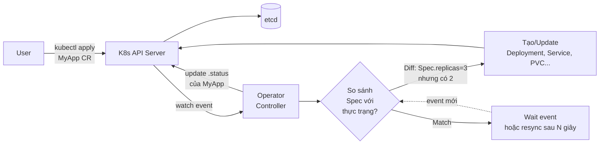

# Operator Pattern — Tổng quan

## CRD vs Controller

| Component | Vai trò | Sản phẩm |
|-----------|---------|----------|
| **CRD** | Định nghĩa **schema** — Kind mới với spec/status | Sau khi apply → `kubectl get myapps` chạy được |
| **Controller** | **Logic** — watch CR, làm cho thực trạng match spec | Tạo/sửa/xóa Deployment, Service, PVC... thay user |
| **Operator** = CRD + Controller | Đóng gói "domain knowledge" thành K8s-native | Cài 1 lần, người dùng chỉ apply CR đơn giản |

## Reconcile loop — trái tim của mọi Operator



> **Bản chất:** Controller liên tục chạy vòng lặp "đọc spec → quan sát thực trạng → tính diff → áp action → cập nhật status". Nếu user sửa CR, hay có ai đó xóa Deployment con, controller sẽ tự phản ứng để kéo về trạng thái mong muốn.

## Các Operator đã gặp trong khóa học

| Operator | CRD chính | Bài |
|----------|-----------|-----|
| `prometheus-operator` | ServiceMonitor, PrometheusRule, Alertmanager | 66 |
| `cert-manager` | Certificate, ClusterIssuer, Issuer | 65 |
| `istio` | VirtualService, DestinationRule, Gateway, AuthorizationPolicy | 48-50 |
| `argo-cd` | Application, ApplicationSet, AppProject | 45-47 |
| `external-secrets` | ClusterSecretStore, ExternalSecret | 68 |
| `sealed-secrets` | SealedSecret | 68 |
| `velero` | Backup, Restore, Schedule, BackupStorageLocation | 67 |

## Tự viết Operator — 2 cách phổ biến

| Cách | Ngôn ngữ | Ưu | Nhược |
|------|----------|----|----|
| **Kubebuilder / Operator SDK** | Go | Chính thống, performance tốt, ecosystem đầy đủ | Học curve dài |
| **kopf** | Python | Viết nhanh, hợp prototype và automation script | Performance kém, không thật phù hợp production heavy |

Khung Operator SDK (Go) — để tham khảo:

```bash
operator-sdk init --domain example.com --repo github.com/me/myapp-operator
operator-sdk create api --group apps --version v1 --kind MyApp --resource --controller
# Sửa logic trong controllers/myapp_controller.go (hàm Reconcile)
make install run
```

## Khi nào nên viết Operator riêng?

- ✅ Workload có **lifecycle phức tạp** (DB cluster cần promotion/failover, Kafka cần rebalance...) — Helm chart không cover được logic động.
- ✅ Muốn người dùng nội bộ chỉ cần `kubectl apply -f myapp.yaml` 1 dòng spec đơn giản, ẩn hết Deployment/Service/PVC bên dưới.
- ❌ App stateless cơ bản → Helm chart đủ, viết Operator là over-engineering.
