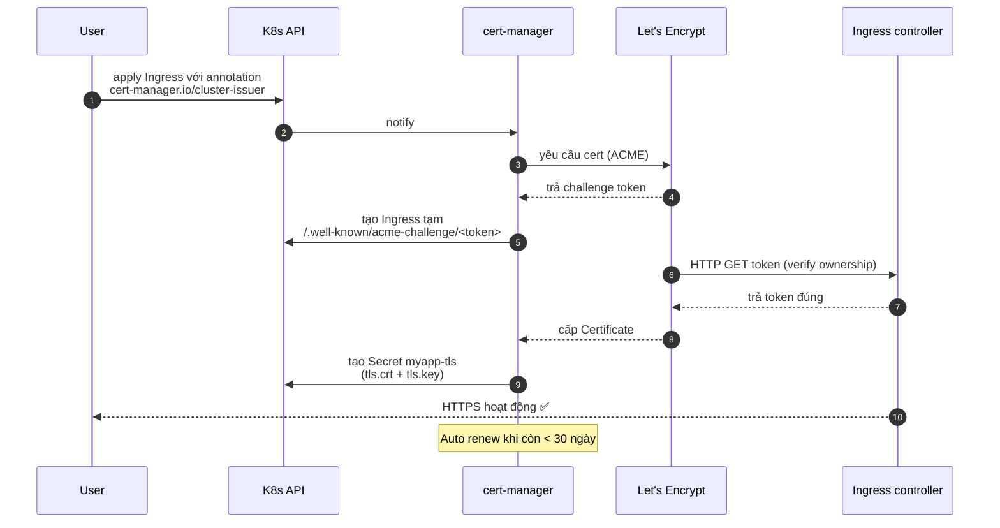
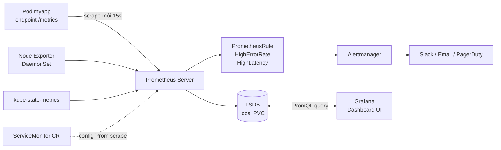
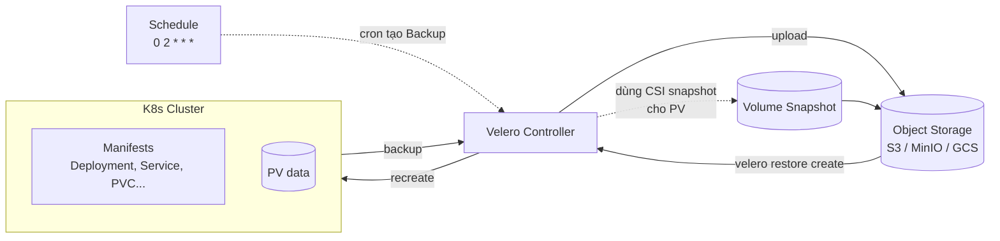
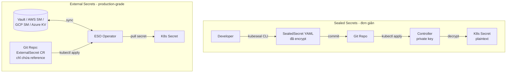
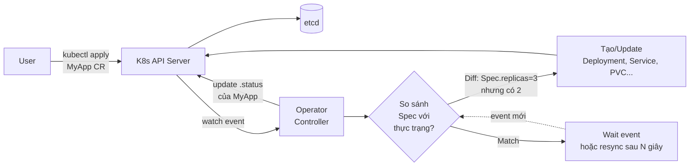

# Chuyên sâu — Helm, GitOps, Service Mesh (Bài 42–50 + Bonus 65–69)

> **Series:** advanced-practice  
> **Author:** Mr.Rom  
> **Điều hướng:** [← Phần trước](../K8s/kubernetes-practice.md) · [Mục lục series](README.md)

> **Nguyên tắc:** Mỗi bài có **yêu cầu chi tiết**, **kết quả mong đợi** và **checklist**. Chỉ chuyển bài khi đủ tiêu chí hoàn thành — không cần suy đoán thêm bước ngoài đề.


## Điều kiện tiên quyết (toàn phần)

| Yêu cầu | Chi tiết |
|---------|----------|
| Hoàn thành Phần K8s | Bài 40–41: đã dùng Helm cơ bản; cluster còn chạy |
| helm 3 | Chart từ Bài 40 hoặc tạo mới theo từng bài |
| GitHub (hoặc Git remote) | Bài 45–47: repo GitOps công khai hoặc ArgoCD truy cập được |
| Cluster đủ tài nguyên | Istio demo profile ~2–4 GB RAM trống (Bài 48–50) |

## Các module trong phần này

| Module | Bài | Công cụ |
|--------|-----|---------|
| Helm template chuyên sâu | 42–44 | helm, Go templates |
| GitOps | 45–47 | ArgoCD, Git, Kustomize |
| Service Mesh | 48–50 | Istio, istioctl, Kiali/Jaeger |
| 🔴 **Bonus — Production-grade** | 65–69 | cert-manager, kube-prometheus-stack, Velero, Sealed/External Secrets, Operator/CRD |

## Quy ước đọc mỗi bài

Các bài 42–44 tạo chart mới; 45–47 cần repo Git thật; 48–50 **không** dùng Ingress nginx thuần nếu bài yêu cầu Istio Gateway — làm đúng resource trong đề. Bonus 65–69 có thể học sau khi dự án Bài 50 xong, hoặc chèn theo nhu cầu thực tế (cert-manager + monitoring nên ưu tiên).

---

## 📌 Lưu ý học viên (đọc trước khi làm bài)

| Bài | Vấn đề thường gặp | Cách xử lý |
|-----|-------------------|------------|
| **42–44** | `helm dependency update` lỗi version | Chart Bitnami đổi version theo thời gian — xem [charts.bitnami.com](https://charts.bitnami.com/bitnami) hoặc dùng version gần đề, không bắt buộc khớp từng số patch. |
| **45** | ArgoCD CLI trên macOS | Đề ghi `argocd-linux-amd64` — trên Mac tải bản **darwin** từ [releases ArgoCD](https://github.com/argoproj/argo-cd/releases). |
| **45** | UI không mở | `port-forward` phải chạy; truy cập **https** (không phải http) `localhost:8080`, chấp nhận certificate self-signed. |
| **46** | Sync chậm | ArgoCD mặc định poll ~3 phút; dùng `argocd app sync myapp-dev` để sync ngay. |
| **47** | ApplicationSet không tạo app | Kiểm tra CRD ApplicationSet đã cài (ArgoCD bản mới thường có sẵn); `kubectl describe applicationset -n argocd` |
| **48–50** | Pod Pending / OOM | Istio demo tốn RAM; tăng memory Minikube (`minikube start --memory=8192`) hoặc tắt addon không dùng. |
| **48** | Pod vẫn 1/1 sau label injection | Cần **restart** deployment sau khi label namespace `istio-injection=enabled`. |
| **49** | Canary không đúng tỉ lệ | Cần đủ traffic; label subset `version` khớp DestinationRule; đôi khi cần vài chục request mới thấy phân bố. |
| **50** | Jaeger/Grafana trống | Phải có traffic (`curl` nhiều lần); đợi vài giây; addon `kubectl apply -f samples/addons/` đã chạy. |

**Phạm vi thực tế:** Bài 50 (dự án cuối) là **đề tổng hợp** — có thể làm từng phần (mTLS, tracing, Grafana) nếu thiếu thời gian; ghi trong báo cáo phần nào đã hoàn thành.

---

## 🎁 C.1. HELM TEMPLATE CHUYÊN SÂU (Bài 42-44)

> **Bối cảnh:** Sau khi đã làm quen Helm cơ bản ở Bài 40, giờ ta sẽ đi sâu vào templating engine của Helm - bí quyết để tạo chart linh hoạt cho nhiều môi trường.

---

## **Bài 42: Helm Template Functions & Pipelines**

**Mục tiêu:** Hiểu sâu cú pháp Go template trong Helm.

### Điều kiện tiên quyết

Hoàn thành Bài 41.

### Kết quả mong đợi

- Mọi lệnh trong **Lệnh thực hiện** chạy xong không lỗi fatal (exit code 0 hoặc lỗi có giải thích trong đề).
- Trạng thái cuối khớp mô tả trong **Yêu cầu chi tiết** (image/container/pod Running hoặc Exited đúng như đề).

### Tiêu chí hoàn thành (checklist)

- [ ] Đã đọc **Mục tiêu** và hoàn thành mọi bước trong **Yêu cầu chi tiết**
- [ ] Kết quả khớp **Kết quả mong đợi** (hoặc tương đương nếu môi trường khác một chút)
- [ ] Ghi chú lại lệnh đã chạy (để so sánh khi gặp lỗi)
- [ ] (Nếu có) Đã trả lời **Câu hỏi** / **Câu hỏi suy ngẫm** trước khi sang bài tiếp

### Lỗi thường gặp

Đọc lại **Lệnh thực hiện**; `kubectl describe` resource lỗi; với Helm: `helm template ... --debug`; với ArgoCD: UI → App → Events.


**Yêu cầu chi tiết:**

### Phần A: Built-in Objects

1. Tạo chart mới `myapp-advanced`:
```bash
helm create myapp-advanced
cd myapp-advanced
```

2. Khám phá các built-in object trong template:
```yaml
# templates/configmap.yaml
apiVersion: v1
kind: ConfigMap
metadata:
  name: {{ .Release.Name }}-info
  namespace: {{ .Release.Namespace }}
data:
  release-name: {{ .Release.Name }}
  release-namespace: {{ .Release.Namespace }}
  release-revision: {{ .Release.Revision | quote }}
  release-service: {{ .Release.Service }}
  chart-name: {{ .Chart.Name }}
  chart-version: {{ .Chart.Version }}
  app-version: {{ .Chart.AppVersion }}
  k8s-version: {{ .Capabilities.KubeVersion.Version }}
```

### Phần B: Template Functions

3. Sử dụng các function phổ biến trong `templates/deployment.yaml`:
```yaml
apiVersion: apps/v1
kind: Deployment
metadata:
  name: {{ .Release.Name | lower }}-app
  labels:
    app: {{ .Chart.Name | upper }}
    version: {{ .Chart.Version | replace "." "-" }}
spec:
  replicas: {{ .Values.replicaCount | default 1 }}
  template:
    metadata:
      annotations:
        # checksum để rolling update khi config thay đổi
        checksum/config: {{ include (print $.Template.BasePath "/configmap.yaml") . | sha256sum }}
        # Timestamp
        deployed-at: {{ now | date "2006-01-02T15:04:05Z" | quote }}
    spec:
      containers:
        - name: {{ .Chart.Name }}
          image: "{{ .Values.image.repository }}:{{ .Values.image.tag | default .Chart.AppVersion }}"
          env:
            - name: APP_NAME
              value: {{ .Values.appName | quote }}
            - name: ENVIRONMENT
              value: {{ .Values.environment | upper | quote }}
            - name: FULL_NAME
              value: {{ printf "%s-%s" .Release.Name .Values.environment | quote }}
```

### Phần C: Pipelines

4. Kết hợp nhiều function với pipeline:
```yaml
# Ví dụ
{{ .Values.message | trim | upper | quote }}
{{ .Values.list | join ", " | quote }}
{{ .Values.password | b64enc | quote }}
{{ .Values.config | toYaml | indent 4 }}
```

5. Render thử và xem kết quả:
```bash
helm template myapp-advanced . --debug
helm install --dry-run --debug myapp ./myapp-advanced
```

**Bài tập:**
- Viết template sinh ra Secret từ password trong values.yaml, dùng `b64enc`
- Dùng `randAlphaNum 16` để sinh password ngẫu nhiên nếu chưa được set

> ⚠️ **Bẫy phổ biến với `randAlphaNum`:** Nếu chỉ viết `password: {{ randAlphaNum 16 | b64enc }}` thì **mỗi lần `helm upgrade` sẽ sinh password MỚI** → app đang dùng password cũ bỗng dưng auth fail. Cách đúng là combo **`lookup` + `randAlphaNum`** để giữ password ổn định khi đã tồn tại:
>
> ```yaml
> # templates/secret.yaml
> {{- $existing := (lookup "v1" "Secret" .Release.Namespace "myapp-secret") -}}
> {{- $password := "" -}}
> {{- if $existing -}}
>   {{- $password = index $existing.data "DB_PASSWORD" | b64dec -}}
> {{- else -}}
>   {{- $password = .Values.dbPassword | default (randAlphaNum 16) -}}
> {{- end }}
> apiVersion: v1
> kind: Secret
> metadata:
>   name: myapp-secret
> type: Opaque
> data:
>   DB_PASSWORD: {{ $password | b64enc | quote }}
> ```
>
> Pattern này: install lần đầu sinh random, upgrade các lần sau **đọc lại** secret cũ để không đổi value. **Tip mạnh hơn:** trong production nên đẩy secret ra ngoài Helm — dùng External Secrets / Sealed Secrets (Bài 68).

---

## **Bài 43: Conditionals, Loops & Named Templates**

**Mục tiêu:** Viết template logic phức tạp.

### Điều kiện tiên quyết

Hoàn thành Bài 42.

### Kết quả mong đợi

- Mọi lệnh trong **Lệnh thực hiện** chạy xong không lỗi fatal (exit code 0 hoặc lỗi có giải thích trong đề).
- Trạng thái cuối khớp mô tả trong **Yêu cầu chi tiết** (image/container/pod Running hoặc Exited đúng như đề).

### Tiêu chí hoàn thành (checklist)

- [ ] Đã đọc **Mục tiêu** và hoàn thành mọi bước trong **Yêu cầu chi tiết**
- [ ] Kết quả khớp **Kết quả mong đợi** (hoặc tương đương nếu môi trường khác một chút)
- [ ] Ghi chú lại lệnh đã chạy (để so sánh khi gặp lỗi)
- [ ] (Nếu có) Đã trả lời **Câu hỏi** / **Câu hỏi suy ngẫm** trước khi sang bài tiếp

### Lỗi thường gặp

Đọc lại **Lệnh thực hiện**; `kubectl describe` resource lỗi; với Helm: `helm template ... --debug`; với ArgoCD: UI → App → Events.


**Yêu cầu chi tiết:**

### Phần A: If/Else

1. Tạo template có điều kiện:
```yaml
# templates/ingress.yaml
{{- if .Values.ingress.enabled }}
apiVersion: networking.k8s.io/v1
kind: Ingress
metadata:
  name: {{ .Release.Name }}-ingress
  {{- if .Values.ingress.annotations }}
  annotations:
    {{- toYaml .Values.ingress.annotations | nindent 4 }}
  {{- end }}
spec:
  {{- if .Values.ingress.tls }}
  tls:
    - hosts:
        - {{ .Values.ingress.host }}
      secretName: {{ .Release.Name }}-tls
  {{- end }}
  rules:
    - host: {{ .Values.ingress.host }}
      http:
        paths:
          - path: /
            pathType: Prefix
            backend:
              service:
                name: {{ .Release.Name }}-service
                port:
                  number: {{ .Values.service.port }}
{{- end }}
```

### Phần B: Range (Loop)

2. Tạo nhiều resource từ array:
```yaml
# values.yaml
environments:
  - name: dev
    replicas: 1
    cpu: "100m"
  - name: staging
    replicas: 2
    cpu: "200m"
  - name: prod
    replicas: 5
    cpu: "500m"
```

```yaml
# templates/multi-env.yaml
{{- range .Values.environments }}
---
apiVersion: v1
kind: ConfigMap
metadata:
  name: {{ $.Release.Name }}-{{ .name }}-config
data:
  ENV_NAME: {{ .name | quote }}
  REPLICAS: {{ .replicas | quote }}
  CPU_LIMIT: {{ .cpu | quote }}
{{- end }}
```

3. Loop trên map:
```yaml
# values.yaml
labels:
  app: myapp
  tier: backend
  team: platform
```

```yaml
metadata:
  labels:
    {{- range $key, $value := .Values.labels }}
    {{ $key }}: {{ $value | quote }}
    {{- end }}
```

### Phần C: Named Templates (_helpers.tpl)

4. Định nghĩa template tái sử dụng:
```yaml
# templates/_helpers.tpl
{{/*
Common labels
*/}}
{{- define "myapp.labels" -}}
app.kubernetes.io/name: {{ .Chart.Name }}
app.kubernetes.io/instance: {{ .Release.Name }}
app.kubernetes.io/version: {{ .Chart.AppVersion | quote }}
app.kubernetes.io/managed-by: {{ .Release.Service }}
helm.sh/chart: {{ printf "%s-%s" .Chart.Name .Chart.Version | replace "+" "_" }}
{{- end }}

{{/*
Selector labels
*/}}
{{- define "myapp.selectorLabels" -}}
app.kubernetes.io/name: {{ .Chart.Name }}
app.kubernetes.io/instance: {{ .Release.Name }}
{{- end }}

{{/*
Full name with truncation (K8s name limit 63 chars)
*/}}
{{- define "myapp.fullname" -}}
{{- printf "%s-%s" .Release.Name .Chart.Name | trunc 63 | trimSuffix "-" }}
{{- end }}
```

5. Sử dụng:
```yaml
metadata:
  name: {{ include "myapp.fullname" . }}
  labels:
    {{- include "myapp.labels" . | nindent 4 }}
spec:
  selector:
    matchLabels:
      {{- include "myapp.selectorLabels" . | nindent 6 }}
```

---

## **Bài 44: Subchart, Dependencies & Hooks**

**Mục tiêu:** Tổ chức chart phức tạp với dependencies, lifecycle hooks.

> 📌 **Prerequisite:** Phần B (Hooks) dùng K8s **Job** resource. Nếu chưa biết Job, đọc nhanh **Bonus Bài 56** trong [`../K8s/kubernetes-practice.md`](../K8s/kubernetes-practice.md#bài-56-job--cronjob-) (~5 phút).

### Điều kiện tiên quyết

Hoàn thành Bài 43.

### Kết quả mong đợi

- Mọi lệnh trong **Lệnh thực hiện** chạy xong không lỗi fatal (exit code 0 hoặc lỗi có giải thích trong đề).
- Trạng thái cuối khớp mô tả trong **Yêu cầu chi tiết** (image/container/pod Running hoặc Exited đúng như đề).

### Tiêu chí hoàn thành (checklist)

- [ ] Đã đọc **Mục tiêu** và hoàn thành mọi bước trong **Yêu cầu chi tiết**
- [ ] Kết quả khớp **Kết quả mong đợi** (hoặc tương đương nếu môi trường khác một chút)
- [ ] Ghi chú lại lệnh đã chạy (để so sánh khi gặp lỗi)
- [ ] (Nếu có) Đã trả lời **Câu hỏi** / **Câu hỏi suy ngẫm** trước khi sang bài tiếp

### Lỗi thường gặp

Đọc lại **Lệnh thực hiện**; `kubectl describe` resource lỗi; với Helm: `helm template ... --debug`; với ArgoCD: UI → App → Events.


**Yêu cầu chi tiết:**

### Phần A: Dependencies

1. Khai báo dependency trong `Chart.yaml`:
```yaml
apiVersion: v2
name: myapp-fullstack
version: 1.0.0
dependencies:
  - name: redis
    version: "18.x.x"
    repository: "https://charts.bitnami.com/bitnami"
    condition: redis.enabled
  - name: postgresql
    version: "13.x.x"
    repository: "https://charts.bitnami.com/bitnami"
    condition: postgresql.enabled
```

2. Pull dependencies:
```bash
helm dependency update
helm dependency list
```

3. Override values cho subchart trong `values.yaml`:
```yaml
redis:
  enabled: true
  auth:
    password: "myredispass"
  master:
    persistence:
      size: 1Gi

postgresql:
  enabled: true
  auth:
    username: myapp
    password: mypass
    database: myappdb
```

### Phần B: Hooks

4. Tạo hook chạy migration database trước khi install:
```yaml
# templates/migration-job.yaml
apiVersion: batch/v1
kind: Job
metadata:
  name: {{ .Release.Name }}-migration
  annotations:
    "helm.sh/hook": pre-install,pre-upgrade
    "helm.sh/hook-weight": "1"
    "helm.sh/hook-delete-policy": before-hook-creation,hook-succeeded
spec:
  template:
    spec:
      restartPolicy: Never
      containers:
        - name: migration
          image: "{{ .Values.image.repository }}:{{ .Values.image.tag }}"
          command: ["python", "migrate.py"]
          env:
            - name: DB_HOST
              value: "{{ .Release.Name }}-postgresql"
```

5. Hook test sau khi install:
```yaml
# templates/tests/test-connection.yaml
apiVersion: v1
kind: Pod
metadata:
  name: {{ .Release.Name }}-test-connection
  annotations:
    "helm.sh/hook": test
spec:
  restartPolicy: Never
  containers:
    - name: wget
      image: busybox
      command: ['wget']
      args: ['{{ .Release.Name }}-service:80']
```

6. Test:
```bash
helm install myapp ./myapp-fullstack
helm test myapp
```

### Phần C: Multi-environment với 1 chart

7. Tạo file values riêng cho từng môi trường:
```bash
# values-dev.yaml
replicaCount: 1
image:
  tag: "dev-latest"
ingress:
  host: myapp.dev.local

# values-staging.yaml
replicaCount: 2
image:
  tag: "staging-v1.2"
ingress:
  host: myapp.staging.local

# values-prod.yaml
replicaCount: 5
image:
  tag: "v1.0"
ingress:
  host: myapp.production.com
  tls: true
```

8. Deploy:
```bash
helm install myapp-dev ./myapp-fullstack -f values-dev.yaml -n dev
helm install myapp-staging ./myapp-fullstack -f values-staging.yaml -n staging
helm install myapp-prod ./myapp-fullstack -f values-prod.yaml -n prod
```

---

## 🚀 C.2. ARGOCD - GITOPS (Bài 45-47)

> **Bối cảnh:** Thay vì `kubectl apply` thủ công hoặc CI/CD push-based, GitOps dùng Git làm nguồn chân lý duy nhất. ArgoCD tự động đồng bộ trạng thái cluster với Git.

---

## **Bài 45: Cài đặt ArgoCD và Application đầu tiên**

**Mục tiêu:** Setup ArgoCD và deploy `myapp` qua GitOps.

### Điều kiện tiên quyết

Hoàn thành Bài 44.

### Kết quả mong đợi

- Mọi lệnh trong **Lệnh thực hiện** chạy xong không lỗi fatal (exit code 0 hoặc lỗi có giải thích trong đề).
- Trạng thái cuối khớp mô tả trong **Yêu cầu chi tiết** (image/container/pod Running hoặc Exited đúng như đề).

### Tiêu chí hoàn thành (checklist)

- [ ] Đã đọc **Mục tiêu** và hoàn thành mọi bước trong **Yêu cầu chi tiết**
- [ ] Kết quả khớp **Kết quả mong đợi** (hoặc tương đương nếu môi trường khác một chút)
- [ ] Ghi chú lại lệnh đã chạy (để so sánh khi gặp lỗi)
- [ ] (Nếu có) Đã trả lời **Câu hỏi** / **Câu hỏi suy ngẫm** trước khi sang bài tiếp

### Lỗi thường gặp

Đọc lại **Lệnh thực hiện**; `kubectl describe` resource lỗi; với Helm: `helm template ... --debug`; với ArgoCD: UI → App → Events.


**Yêu cầu chi tiết:**

### Phần A: Cài đặt

1. Cài ArgoCD vào cluster:
```bash
kubectl create namespace argocd
kubectl apply -n argocd -f https://raw.githubusercontent.com/argoproj/argo-cd/stable/manifests/install.yaml
```

2. Đợi pod ready:
```bash
kubectl get pods -n argocd -w
```

3. Cài ArgoCD CLI:
```bash
# Linux
curl -sSL -o argocd-linux-amd64 https://github.com/argoproj/argo-cd/releases/latest/download/argocd-linux-amd64
sudo install -m 555 argocd-linux-amd64 /usr/local/bin/argocd
```

> **📌 Lưu ý:** Trên **macOS**, tải `argocd-darwin-amd64` hoặc `argocd-darwin-arm64` (Apple Silicon) từ cùng trang releases, rồi `chmod +x` và đặt vào PATH.


4. Truy cập UI:
```bash
kubectl port-forward svc/argocd-server -n argocd 8080:443
# Mở https://localhost:8080
```

5. Lấy password admin:
```bash
kubectl -n argocd get secret argocd-initial-admin-secret \
  -o jsonpath="{.data.password}" | base64 -d
```

6. Đăng nhập CLI:
```bash
argocd login localhost:8080 --username admin --password <password>
```

### Phần B: Tạo Git Repository

7. Tạo repo Git (GitHub) với cấu trúc:
```
myapp-gitops/
├── base/
│   ├── deployment.yaml
│   ├── service.yaml
│   └── configmap.yaml
└── environments/
    ├── dev/
    │   └── kustomization.yaml
    └── prod/
        └── kustomization.yaml
```

8. Push các manifest từ Bài 29-33 vào `base/`

### Phần C: Tạo Application

9. Tạo Application qua YAML:
```yaml
# argocd-app.yaml
apiVersion: argoproj.io/v1alpha1
kind: Application
metadata:
  name: myapp-dev
  namespace: argocd
spec:
  project: default
  source:
    repoURL: https://github.com/<your-username>/myapp-gitops
    targetRevision: main
    path: environments/dev
  destination:
    server: https://kubernetes.default.svc
    namespace: myapp-dev
  syncPolicy:
    automated:
      prune: true
      selfHeal: true
    syncOptions:
      - CreateNamespace=true
```

10. Apply:
```bash
kubectl apply -f argocd-app.yaml
```

11. Quan sát trên UI - thấy app được sync tự động

**Câu hỏi:**
- `prune: true` làm gì?
- `selfHeal: true` xử lý tình huống nào?

---

## **Bài 46: GitOps Workflow - Deploy qua Git**

**Mục tiêu:** Trải nghiệm luồng deploy hoàn toàn qua Git.

> 📌 **Prerequisite:** Workflow dùng `kustomization.yaml` để chỉnh image tag — đây là **Kustomize**. Đọc nhanh **Bonus Bài 64** trong [`../K8s/kubernetes-practice.md`](../K8s/kubernetes-practice.md#bài-64-kustomize-cơ-bản-) (~5 phút) để hiểu `base/` vs `overlays/`.

### Điều kiện tiên quyết

Hoàn thành Bài 45.

### Kết quả mong đợi

- Mọi lệnh trong **Lệnh thực hiện** chạy xong không lỗi fatal (exit code 0 hoặc lỗi có giải thích trong đề).
- Trạng thái cuối khớp mô tả trong **Yêu cầu chi tiết** (image/container/pod Running hoặc Exited đúng như đề).

### Tiêu chí hoàn thành (checklist)

- [ ] Đã đọc **Mục tiêu** và hoàn thành mọi bước trong **Yêu cầu chi tiết**
- [ ] Kết quả khớp **Kết quả mong đợi** (hoặc tương đương nếu môi trường khác một chút)
- [ ] Ghi chú lại lệnh đã chạy (để so sánh khi gặp lỗi)
- [ ] (Nếu có) Đã trả lời **Câu hỏi** / **Câu hỏi suy ngẫm** trước khi sang bài tiếp

### Lỗi thường gặp

Đọc lại **Lệnh thực hiện**; `kubectl describe` resource lỗi; với Helm: `helm template ... --debug`; với ArgoCD: UI → App → Events.


**Yêu cầu chi tiết:**

### Kịch bản: Update image version

1. Trên máy local, sửa file `environments/dev/kustomization.yaml`:
```yaml
apiVersion: kustomize.config.k8s.io/v1beta1
kind: Kustomization
resources:
  - ../../base
images:
  - name: <your-username>/myapp
    newTag: "8.0"   # Đổi từ 7.0 thành 8.0
```

2. Commit và push:
```bash
git add .
git commit -m "Update myapp to v8.0 in dev"
git push origin main
```

3. Quan sát ArgoCD UI - tự động phát hiện thay đổi và sync (mặc định polling mỗi 3 phút)

4. Force sync nếu muốn nhanh:
```bash
argocd app sync myapp-dev
```

### Kịch bản: Tự self-heal khi có drift

5. Cố ý thay đổi thủ công bằng kubectl:
```bash
kubectl scale deployment myapp-deployment --replicas=10 -n myapp-dev
```

6. Quan sát: ArgoCD phát hiện drift và **tự revert** về trạng thái trong Git

### Kịch bản: Rollback

7. Xem lịch sử trong UI hoặc CLI:
```bash
argocd app history myapp-dev
```

8. Rollback về version trước:
```bash
argocd app rollback myapp-dev <revision-id>
```

**Lưu ý:** Trong GitOps thuần, rollback đúng đắn là **revert commit trong Git** rồi để ArgoCD sync.

---

## **Bài 47: Multi-environment với ApplicationSet**

**Mục tiêu:** Quản lý nhiều môi trường (dev/staging/prod) tự động.

### Điều kiện tiên quyết

Hoàn thành Bài 46.

### Kết quả mong đợi

- Mọi lệnh trong **Lệnh thực hiện** chạy xong không lỗi fatal (exit code 0 hoặc lỗi có giải thích trong đề).
- Trạng thái cuối khớp mô tả trong **Yêu cầu chi tiết** (image/container/pod Running hoặc Exited đúng như đề).

### Tiêu chí hoàn thành (checklist)

- [ ] Đã đọc **Mục tiêu** và hoàn thành mọi bước trong **Yêu cầu chi tiết**
- [ ] Kết quả khớp **Kết quả mong đợi** (hoặc tương đương nếu môi trường khác một chút)
- [ ] Ghi chú lại lệnh đã chạy (để so sánh khi gặp lỗi)
- [ ] (Nếu có) Đã trả lời **Câu hỏi** / **Câu hỏi suy ngẫm** trước khi sang bài tiếp

### Lỗi thường gặp

Đọc lại **Lệnh thực hiện**; `kubectl describe` resource lỗi; với Helm: `helm template ... --debug`; với ArgoCD: UI → App → Events.


**Yêu cầu chi tiết:**

### Phần A: ApplicationSet với List Generator

1. Tạo ApplicationSet quản lý 3 môi trường:
```yaml
# applicationset.yaml
apiVersion: argoproj.io/v1alpha1
kind: ApplicationSet
metadata:
  name: myapp-environments
  namespace: argocd
spec:
  generators:
    - list:
        elements:
          - env: dev
            namespace: myapp-dev
            branch: develop
          - env: staging
            namespace: myapp-staging
            branch: staging
          - env: prod
            namespace: myapp-prod
            branch: main
  template:
    metadata:
      name: 'myapp-{{env}}'
    spec:
      project: default
      source:
        repoURL: https://github.com/<your-username>/myapp-gitops
        targetRevision: '{{branch}}'
        path: 'environments/{{env}}'
      destination:
        server: https://kubernetes.default.svc
        namespace: '{{namespace}}'
      syncPolicy:
        automated:
          prune: true
          selfHeal: true
        syncOptions:
          - CreateNamespace=true
```

2. Apply:
```bash
kubectl apply -f applicationset.yaml
```

3. Quan sát: 3 Application được tự động tạo ra.

### Phần B: ArgoCD với Helm

4. Application dùng Helm chart:
```yaml
apiVersion: argoproj.io/v1alpha1
kind: Application
metadata:
  name: myapp-helm-prod
  namespace: argocd
spec:
  project: default
  source:
    repoURL: https://github.com/<your-username>/myapp-helm
    targetRevision: main
    path: charts/myapp
    helm:
      valueFiles:
        - values-prod.yaml
      parameters:
        - name: image.tag
          value: "v1.0"
        - name: replicaCount
          value: "5"
  destination:
    server: https://kubernetes.default.svc
    namespace: myapp-prod
  syncPolicy:
    automated:
      prune: true
```

### Phần C: Image Updater (Bonus)

5. Cài ArgoCD Image Updater để tự động update image khi có version mới:
```bash
kubectl apply -n argocd -f https://raw.githubusercontent.com/argoproj-labs/argocd-image-updater/stable/manifests/install.yaml
```

6. Annotate Application:
```yaml
metadata:
  annotations:
    argocd-image-updater.argoproj.io/image-list: myapp=<your-username>/myapp
    argocd-image-updater.argoproj.io/myapp.update-strategy: semver
```

**Bài tập:**
- Push image mới với tag `v1.0.1`, quan sát Image Updater tự update
- Cấu hình Slack notification khi sync thành công/thất bại

---

## 🕸️ C.3. SERVICE MESH - ISTIO (Bài 48-50)

> **Bối cảnh:** Khi có nhiều microservice, việc quản lý traffic, security, observability trở nên phức tạp. Service Mesh inject sidecar proxy (Envoy) vào mỗi pod để xử lý các tác vụ này mà không cần sửa code app.

---

## **Bài 48: Cài Istio và Sidecar Injection**

**Mục tiêu:** Setup Istio, hiểu cách sidecar hoạt động.

### Điều kiện tiên quyết

Hoàn thành Bài 47.

### Kết quả mong đợi

- Mọi lệnh trong **Lệnh thực hiện** chạy xong không lỗi fatal (exit code 0 hoặc lỗi có giải thích trong đề).
- Trạng thái cuối khớp mô tả trong **Yêu cầu chi tiết** (image/container/pod Running hoặc Exited đúng như đề).

### Tiêu chí hoàn thành (checklist)

- [ ] Đã đọc **Mục tiêu** và hoàn thành mọi bước trong **Yêu cầu chi tiết**
- [ ] Kết quả khớp **Kết quả mong đợi** (hoặc tương đương nếu môi trường khác một chút)
- [ ] Ghi chú lại lệnh đã chạy (để so sánh khi gặp lỗi)
- [ ] (Nếu có) Đã trả lời **Câu hỏi** / **Câu hỏi suy ngẫm** trước khi sang bài tiếp

### Lỗi thường gặp

Đọc lại **Lệnh thực hiện**; `kubectl describe` resource lỗi; với Helm: `helm template ... --debug`; với ArgoCD: UI → App → Events.


**Yêu cầu chi tiết:**

### Phần A: Cài đặt

> ⚠️ **Tài nguyên cần thiết:**
> - `profile=demo` (đầy đủ Kiali/Jaeger/Grafana/Prometheus): cần **≥ 4GB RAM, 2 vCPU** cho cluster — minikube hay bị pending pod khi máy yếu
> - `profile=minimal` (chỉ istiod + gateway): ~1GB RAM, đủ học traffic management
> - **Máy yếu:** `minikube start --memory=6144 --cpus=4` rồi mới cài Istio

1. Download và cài Istio:
```bash
curl -L https://istio.io/downloadIstio | sh -
cd istio-*
export PATH=$PWD/bin:$PATH

# Demo full-stack (đề mặc định):
istioctl install --set profile=demo -y

# Hoặc minimal nếu máy yếu:
# istioctl install --set profile=minimal -y
```

2. Cài addon (Kiali, Jaeger, Grafana, Prometheus):
```bash
kubectl apply -f samples/addons/
kubectl rollout status deployment/kiali -n istio-system
```

3. Enable automatic sidecar injection cho namespace:
```bash
kubectl label namespace myapp-dev istio-injection=enabled
```

### Phần B: Redeploy và quan sát sidecar

4. Restart deployment để inject sidecar:
```bash
kubectl rollout restart deployment/myapp-deployment -n myapp-dev
```

5. Kiểm tra: mỗi pod giờ có **2 container** (app + istio-proxy):
```bash
kubectl get pods -n myapp-dev
# READY: 2/2 (thay vì 1/1 trước đây)

kubectl describe pod <pod-name> -n myapp-dev
# Có thêm container 'istio-proxy'
```

6. Mở Kiali Dashboard để xem topology:
```bash
istioctl dashboard kiali
```

### Phần C: Truy cập app qua Istio Gateway

7. Tạo Gateway (thay cho Ingress):
```yaml
apiVersion: networking.istio.io/v1beta1
kind: Gateway
metadata:
  name: myapp-gateway
  namespace: myapp-dev
spec:
  selector:
    istio: ingressgateway
  servers:
    - port:
        number: 80
        name: http
        protocol: HTTP
      hosts:
        - "myapp.local"
---
apiVersion: networking.istio.io/v1beta1
kind: VirtualService
metadata:
  name: myapp-vs
  namespace: myapp-dev
spec:
  hosts:
    - "myapp.local"
  gateways:
    - myapp-gateway
  http:
    - route:
        - destination:
            host: myapp-service
            port:
              number: 80
```

8. Apply và test:
```bash
kubectl apply -f gateway.yaml
# Lấy IP của istio-ingressgateway
kubectl get svc istio-ingressgateway -n istio-system
```

**Câu hỏi:**
- Sidecar proxy là gì? Tại sao gọi là "service mesh"?
- Mô hình data plane vs control plane trong Istio?

---

## **Bài 49: Traffic Management - Canary, A/B Testing**

**Mục tiêu:** Triển khai chiến lược release nâng cao.

### Điều kiện tiên quyết

Hoàn thành Bài 48.

### Kết quả mong đợi

- Mọi lệnh trong **Lệnh thực hiện** chạy xong không lỗi fatal (exit code 0 hoặc lỗi có giải thích trong đề).
- Trạng thái cuối khớp mô tả trong **Yêu cầu chi tiết** (image/container/pod Running hoặc Exited đúng như đề).

### Tiêu chí hoàn thành (checklist)

- [ ] Đã đọc **Mục tiêu** và hoàn thành mọi bước trong **Yêu cầu chi tiết**
- [ ] Kết quả khớp **Kết quả mong đợi** (hoặc tương đương nếu môi trường khác một chút)
- [ ] Ghi chú lại lệnh đã chạy (để so sánh khi gặp lỗi)
- [ ] (Nếu có) Đã trả lời **Câu hỏi** / **Câu hỏi suy ngẫm** trước khi sang bài tiếp

### Lỗi thường gặp

Đọc lại **Lệnh thực hiện**; `kubectl describe` resource lỗi; với Helm: `helm template ... --debug`; với ArgoCD: UI → App → Events.


**Yêu cầu chi tiết:**

### Phần A: Canary Deployment

1. Deploy 2 version của myapp:
```yaml
# myapp v1
apiVersion: apps/v1
kind: Deployment
metadata:
  name: myapp-v1
spec:
  replicas: 3
  selector:
    matchLabels:
      app: myapp
      version: v1
  template:
    metadata:
      labels:
        app: myapp
        version: v1
    spec:
      containers:
        - name: myapp
          image: <your-username>/myapp:7.0
---
# myapp v2
apiVersion: apps/v1
kind: Deployment
metadata:
  name: myapp-v2
spec:
  replicas: 1
  selector:
    matchLabels:
      app: myapp
      version: v2
  template:
    metadata:
      labels:
        app: myapp
        version: v2
    spec:
      containers:
        - name: myapp
          image: <your-username>/myapp:8.0
```

2. Tạo DestinationRule định nghĩa subset:
```yaml
apiVersion: networking.istio.io/v1beta1
kind: DestinationRule
metadata:
  name: myapp-destination
spec:
  host: myapp-service
  subsets:
    - name: v1
      labels:
        version: v1
    - name: v2
      labels:
        version: v2
```

3. VirtualService với traffic splitting 90/10:
```yaml
apiVersion: networking.istio.io/v1beta1
kind: VirtualService
metadata:
  name: myapp-canary
spec:
  hosts:
    - myapp-service
  http:
    - route:
        - destination:
            host: myapp-service
            subset: v1
          weight: 90
        - destination:
            host: myapp-service
            subset: v2
          weight: 10
```

4. Test bằng cách gọi nhiều lần:
```bash
for i in {1..100}; do
  curl -s http://myapp.local/config | grep version
done | sort | uniq -c
# Sẽ thấy ~90% v1, ~10% v2
```

5. Tăng dần traffic về v2: 50/50, rồi 0/100.

### Phần B: A/B Testing theo Header

6. Route theo HTTP header:
```yaml
apiVersion: networking.istio.io/v1beta1
kind: VirtualService
metadata:
  name: myapp-ab-test
spec:
  hosts:
    - myapp-service
  http:
    - match:
        - headers:
            user-type:
              exact: beta-tester
      route:
        - destination:
            host: myapp-service
            subset: v2
    - route:
        - destination:
            host: myapp-service
            subset: v1
```

7. Test:
```bash
# User thường → v1
curl http://myapp.local

# Beta tester → v2
curl -H "user-type: beta-tester" http://myapp.local
```

### Phần C: Fault Injection

8. Inject lỗi để test resilience:
```yaml
apiVersion: networking.istio.io/v1beta1
kind: VirtualService
metadata:
  name: myapp-fault
spec:
  hosts:
    - myapp-service
  http:
    - fault:
        delay:
          percentage:
            value: 50
          fixedDelay: 5s
        abort:
          percentage:
            value: 10
          httpStatus: 500
      route:
        - destination:
            host: myapp-service
            subset: v1
```

9. Test - 50% request bị delay 5s, 10% bị lỗi 500.

---

## **Bài 50: Security & Observability với Istio (Dự án cuối)**

**Mục tiêu:** Hoàn thiện hệ thống với mTLS, RBAC, distributed tracing.

> 🔴 **Prerequisites cho dự án cuối khoá:**
> - **Bonus 59** RBAC + ServiceAccount — nền tảng cho Istio AuthorizationPolicy (RBAC L7)
> - **Bonus 66** Prometheus + Grafana — cho phần Metrics
> - **Bonus 67** Velero — cho phần Backup
> - **Loki/EFK:** đề có nhắc nhưng KHÔNG có bài riêng — tham khảo [grafana/loki helm](https://github.com/grafana/loki) hoặc dùng Prometheus stack (Bonus 66) thay thế.
>
> Xem [`../LEARNING-PATH.md`](../LEARNING-PATH.md) Phase 5+6.

### Điều kiện tiên quyết

Hoàn thành Bài 49.

### Kết quả mong đợi

- Mọi lệnh trong **Lệnh thực hiện** chạy xong không lỗi fatal (exit code 0 hoặc lỗi có giải thích trong đề).
- Trạng thái cuối khớp mô tả trong **Yêu cầu chi tiết** (image/container/pod Running hoặc Exited đúng như đề).

### Tiêu chí hoàn thành (checklist)

- [ ] Đã đọc **Mục tiêu** và hoàn thành mọi bước trong **Yêu cầu chi tiết**
- [ ] Kết quả khớp **Kết quả mong đợi** (hoặc tương đương nếu môi trường khác một chút)
- [ ] Ghi chú lại lệnh đã chạy (để so sánh khi gặp lỗi)
- [ ] (Nếu có) Đã trả lời **Câu hỏi** / **Câu hỏi suy ngẫm** trước khi sang bài tiếp

### Lỗi thường gặp

Đọc lại **Lệnh thực hiện**; `kubectl describe` resource lỗi; với Helm: `helm template ... --debug`; với ArgoCD: UI → App → Events.


**Yêu cầu chi tiết:**

### Phần A: Mutual TLS (mTLS) tự động

1. Enable strict mTLS toàn cluster:
```yaml
apiVersion: security.istio.io/v1beta1
kind: PeerAuthentication
metadata:
  name: default
  namespace: istio-system
spec:
  mtls:
    mode: STRICT
```

2. Verify mTLS hoạt động:
```bash
istioctl authn tls-check myapp-pod.myapp-dev
```

3. Capture traffic giữa các pod - thấy được encrypt.

### Phần B: Authorization Policy (RBAC tầng L7)

4. Chỉ cho phép service nhất định gọi myapp:
```yaml
apiVersion: security.istio.io/v1beta1
kind: AuthorizationPolicy
metadata:
  name: myapp-authz
  namespace: myapp-dev
spec:
  selector:
    matchLabels:
      app: myapp
  rules:
    - from:
        - source:
            principals: ["cluster.local/ns/myapp-dev/sa/frontend-sa"]
      to:
        - operation:
            methods: ["GET"]
            paths: ["/", "/health"]
    - from:
        - source:
            namespaces: ["myapp-dev"]
      to:
        - operation:
            methods: ["GET", "POST"]
```

5. Test: pod ngoài namespace gọi → bị từ chối.

### Phần C: Distributed Tracing với Jaeger

6. Tạo tải:
```bash
for i in {1..100}; do curl http://myapp.local; done
```

7. Mở Jaeger:
```bash
istioctl dashboard jaeger
```

8. Quan sát:
- Request flow qua các service
- Latency từng span
- Tìm bottleneck

### Phần D: Metrics với Prometheus + Grafana

9. Mở Grafana:
```bash
istioctl dashboard grafana
```

10. Xem các dashboard có sẵn:
- Istio Mesh Dashboard
- Istio Service Dashboard
- Istio Workload Dashboard

11. Quan sát: P50, P95, P99 latency, error rate, request rate (RED metrics).

### 🎓 DỰ ÁN CUỐI KHÓA - HỆ THỐNG HOÀN CHỈNH

**Yêu cầu chi tiết (đề bài):** Triển khai hệ thống microservices `myapp` hoàn chỉnh với:

✅ **Bắt buộc:**
1. **Code & Docker:**
   - 3 microservice: frontend (React), backend API (Python), worker (Python)
   - Multi-stage Dockerfile, image nhỏ gọn
   - Push lên registry với tag semver

2. **Kubernetes:**
   - Deployment + Service + Ingress
   - ConfigMap + Secret
   - StatefulSet cho database
   - PVC cho persistent data
   - HPA cho frontend và API
   - Liveness/Readiness probes
   - Resource limits

3. **Helm:**
   - Đóng gói toàn bộ thành 1 chart
   - Subchart cho Redis, PostgreSQL
   - Values riêng cho dev/staging/prod
   - Hook chạy migration

4. **GitOps với ArgoCD:**
   - ApplicationSet cho 3 môi trường
   - Auto-sync và self-heal
   - Image Updater tự động cập nhật version

5. **Service Mesh với Istio:**
   - Sidecar injection
   - Gateway thay Ingress
   - Canary deployment khi release
   - mTLS strict
   - Authorization Policy hạn chế truy cập

6. **Observability:**
   - Distributed tracing với Jaeger
   - Metrics với Prometheus + Grafana
   - Logging tập trung với Loki hoặc EFK

✅ **Bonus:**
- CI/CD pipeline tự động build và update Helm chart
- Chaos testing với Chaos Mesh
- Backup & Restore strategy cho database
- Cost optimization (right-sizing resources)

**Tiêu chí đánh giá:**

| Tiêu chí | Trọng số |
|----------|----------|
| Tính sẵn sàng cao (HA) | 20% |
| Bảo mật (mTLS, RBAC, Secret management) | 20% |
| Khả năng quan sát (Logs, Metrics, Traces) | 20% |
| Tự động hóa (GitOps, CI/CD) | 20% |
| Documentation & hướng dẫn deploy | 10% |
| Khả năng mở rộng | 10% |

---

## 🎯 D.3. ADVANCED BONUS (Bài 65-69)

> **Bối cảnh:** 5 bài "ngoài chương trình chính" nhưng cực kỳ thực dụng cho production: TLS tự động, observability stack, backup/restore, quản lý secret an toàn, và mở rộng K8s bằng Operator/CRD.

---

## **Bài 65: cert-manager + Let's Encrypt** 🔴

**Mục tiêu:** TLS tự động cho Ingress (cấp + renew miễn phí).

### Điều kiện tiên quyết

Hoàn thành Bài 38 (Ingress) và Bài 64. Ingress controller (nginx) đã chạy; có domain công khai hoặc DNS trỏ vào cluster (lab có thể dùng `nip.io`).

### Kết quả mong đợi

- `kubectl get pods -n cert-manager` → 3 pod Running (`cert-manager`, `cert-manager-webhook`, `cert-manager-cainjector`).
- `kubectl get clusterissuer` → `letsencrypt-staging` Ready=True.
- `kubectl get certificate` → `myapp-tls` Ready=True (sau ~1-2 phút).
- Secret `myapp-tls` chứa `tls.crt` + `tls.key`.

### Tiêu chí hoàn thành (checklist)

- [ ] Đã cài cert-manager đầy đủ pods.
- [ ] Tạo ClusterIssuer staging và verify Ready.
- [ ] Ingress annotate `cert-manager.io/cluster-issuer` và tự sinh Secret TLS.
- [ ] Hiểu rate limit Let's Encrypt và lý do test bằng staging trước.

### Lỗi thường gặp

- `Certificate` mãi không Ready → `kubectl describe certificate myapp-tls`; thường do challenge HTTP-01 fail (Ingress controller không reach được từ internet).
- Quên dùng staging → bị Let's Encrypt block do rate limit (50 cert/domain/tuần).

**Luồng ACME http-01 challenge:**



> 📚 **Tại sao dùng Let's Encrypt:**
> - **Miễn phí** + tự động
> - Hỗ trợ wildcard (`*.example.com`) qua DNS-01 challenge (cần DNS provider plugin)
> - **Rate limit:** 50 cert/domain/tuần (production), 30 ngàn/tuần (staging) → **luôn test bằng staging trước**

**Yêu cầu chi tiết:**

### Phần A: Cài cert-manager

1. Install qua YAML:
```bash
kubectl apply -f https://github.com/cert-manager/cert-manager/releases/latest/download/cert-manager.yaml
kubectl get pods -n cert-manager -w
```

### Phần B: ClusterIssuer

2. Issuer dùng Let's Encrypt staging (để test):
```yaml
apiVersion: cert-manager.io/v1
kind: ClusterIssuer
metadata:
  name: letsencrypt-staging
spec:
  acme:
    email: you@example.com
    server: https://acme-staging-v02.api.letsencrypt.org/directory
    privateKeySecretRef:
      name: letsencrypt-staging-key
    solvers:
      - http01:
          ingress:
            class: nginx
```

3. Sau khi test OK, dùng production issuer (đổi URL sang `https://acme-v02.api.letsencrypt.org/directory`).

### Phần C: Annotate Ingress

4. Sửa Ingress của myapp:
```yaml
apiVersion: networking.k8s.io/v1
kind: Ingress
metadata:
  name: myapp-ingress
  annotations:
    cert-manager.io/cluster-issuer: letsencrypt-staging
spec:
  tls:
    - hosts:
        - myapp.example.com
      secretName: myapp-tls          # cert-manager sẽ tự tạo
  rules:
    - host: myapp.example.com
      http:
        paths:
          - path: /
            pathType: Prefix
            backend:
              service:
                name: myapp-service
                port:
                  number: 80
```

5. Verify:
```bash
kubectl get certificate
kubectl describe certificate myapp-tls
kubectl get secret myapp-tls -o yaml
```

**Câu hỏi:**
- Vì sao cần test bằng staging trước? (rate limit Let's Encrypt = 5 cert/domain/tuần)
- Cert tự renew khi nào? (mặc định khi còn < 30 ngày)

---

## **Bài 66: Prometheus + Grafana Stack** 🔴

**Mục tiêu:** Observability — Metrics + Dashboard + Alert.

### Điều kiện tiên quyết

Hoàn thành Bài 37 (HPA — đã thấy metrics-server). App `myapp` đang chạy ở `myapp-dev`. Helm đã cài.

### Kết quả mong đợi

- Pod stack `kps-*` Running trong namespace `monitoring`.
- App expose `/metrics` trả về Prometheus format (text với `# HELP`, `# TYPE`).
- ServiceMonitor được Prometheus pick lên — query trong Prometheus UI thấy `myapp_request_total`.
- Grafana dashboard hiển thị RPS, latency P95.

### Tiêu chí hoàn thành (checklist)

- [ ] Cài thành công `kube-prometheus-stack` qua Helm.
- [ ] App có endpoint `/metrics`; image đã rebuild/push.
- [ ] ServiceMonitor + PrometheusRule apply OK và Prometheus scrape được.
- [ ] Grafana hiển thị panel RED metrics (Rate, Errors, Duration).

### Lỗi thường gặp

- ServiceMonitor không được pick → `serviceMonitorNamespaceSelector` / `serviceMonitorSelector` chặn; cài đặt với flag `serviceMonitorSelectorNilUsesHelmValues=false` để scope toàn cluster.
- Prometheus không scrape `/metrics` → kiểm tra tên `port` trong Service phải khớp `endpoints[].port` của ServiceMonitor.

**Kiến trúc kube-prometheus-stack:**



> 📚 **3 trụ cột observability (RED metrics):**
> - **R**ate — requests/giây (`rate(myapp_request_total[1m])`)
> - **E**rrors — tỉ lệ lỗi (`rate(...{status="500"}[5m]) / rate(...[5m])`)
> - **D**uration — latency P50/P95/P99 (`histogram_quantile(0.95, ...)`)
>
> 💡 **ServiceMonitor là CRD của Prometheus Operator** — thay vì phải sửa `prometheus.yml` thủ công, bạn khai báo ServiceMonitor và Operator tự cập nhật config. Tách concern: app dev không cần biết Prometheus.

**Yêu cầu chi tiết:**

### Phần A: Cài kube-prometheus-stack qua Helm

1. Add repo và install:
```bash
helm repo add prometheus-community https://prometheus-community.github.io/helm-charts
helm repo update

kubectl create namespace monitoring
helm install kps prometheus-community/kube-prometheus-stack \
  -n monitoring \
  --set grafana.adminPassword='admin' \
  --set prometheus.prometheusSpec.serviceMonitorSelectorNilUsesHelmValues=false
```

2. Truy cập:
```bash
kubectl port-forward -n monitoring svc/kps-grafana 3000:80
kubectl port-forward -n monitoring svc/kps-kube-prometheus-stack-prometheus 9090:9090
```

### Phần B: Expose metrics từ myapp

3. Sửa app.py thêm Prometheus client:
```python
from flask import Flask
from prometheus_client import Counter, Histogram, generate_latest
app = Flask(__name__)

REQUEST_COUNT = Counter('myapp_request_total', 'Total requests', ['method', 'endpoint'])
REQUEST_LATENCY = Histogram('myapp_request_duration_seconds', 'Request latency', ['endpoint'])

@app.route('/')
def home():
    REQUEST_COUNT.labels(method='GET', endpoint='/').inc()
    with REQUEST_LATENCY.labels(endpoint='/').time():
        return "Hello"

@app.route('/metrics')
def metrics():
    return generate_latest(), 200, {'Content-Type': 'text/plain; charset=utf-8'}
```

4. Add `prometheus-client==0.20.0` vào `requirements.txt`, build và push image mới.

### Phần C: ServiceMonitor — đăng ký scrape

5. Cho Prometheus biết phải scrape myapp:
```yaml
apiVersion: monitoring.coreos.com/v1
kind: ServiceMonitor
metadata:
  name: myapp-monitor
  namespace: myapp-dev
spec:
  selector:
    matchLabels:
      app: myapp
  endpoints:
    - port: http        # tên port trong Service
      path: /metrics
      interval: 15s
```

### Phần D: PrometheusRule — Alert

6. Alert khi error rate > 5%:
```yaml
apiVersion: monitoring.coreos.com/v1
kind: PrometheusRule
metadata:
  name: myapp-alerts
  namespace: myapp-dev
spec:
  groups:
    - name: myapp
      rules:
        - alert: HighErrorRate
          expr: rate(myapp_request_total{status="500"}[5m]) > 0.05
          for: 5m
          labels:
            severity: critical
          annotations:
            summary: "myapp error rate > 5% for 5min"
```

### Phần E: Grafana Dashboard

7. Login Grafana → import dashboard ID `7249` (K8s cluster) hoặc tự tạo panel:
```promql
# RPS
sum(rate(myapp_request_total[1m])) by (endpoint)

# P95 latency
histogram_quantile(0.95, rate(myapp_request_duration_seconds_bucket[5m]))
```

**Câu hỏi:**
- RED metrics (Rate, Errors, Duration) — vì sao là chuẩn?
- ServiceMonitor cần namespace match với Prometheus không? (gợi ý: tùy `serviceMonitorNamespaceSelector`)

---

## **Bài 67: Velero — Backup & Restore**

**Mục tiêu:** Backup toàn bộ cluster (manifest + PV data).

### Điều kiện tiên quyết

Hoàn thành Bài 34 (PV/PVC) và Bài 41. Có Object Storage để chứa backup: MinIO local cho lab, hoặc S3/GCS.

### Kết quả mong đợi

- `velero backup describe myapp-backup` → Phase: Completed.
- File backup xuất hiện trong bucket MinIO/S3.
- `kubectl delete namespace myapp-dev` rồi `velero restore create --from-backup myapp-backup` → namespace + workload phục hồi đầy đủ.

### Tiêu chí hoàn thành (checklist)

- [ ] Cài Velero server + CLI và config backup location vào MinIO/S3.
- [ ] Tạo backup on-demand và backup theo schedule (`0 2 * * *`).
- [ ] Mô phỏng disaster (xóa namespace) và restore thành công.
- [ ] Hiểu Velero backup gồm 2 thứ: manifest + PV data (qua CSI snapshot hoặc Restic/Kopia).

### Lỗi thường gặp

- Backup Phase: Failed → `velero backup logs <name>`; thường do plugin AWS chưa cài đúng version hoặc credentials sai.
- Restore không khôi phục PV data → cluster chưa có CSI snapshot driver; thử thêm flag Restic/Kopia.

**Luồng backup/restore:**



> 📚 **Velero backup gồm 2 thứ:**
> 1. **Manifest** (mặc định) — tất cả K8s object trong namespace được dump ra YAML
> 2. **PV data** — chỉ backup khi cluster có CSI driver hỗ trợ snapshot HOẶC dùng Restic/Kopia (bundled với Velero) để backup file-level
>
> 💡 **Khác `etcdctl snapshot`:** etcd backup là toàn bộ cluster state (kể cả system namespace) → để recover **toàn cluster**. Velero là **per-namespace/per-resource** → linh hoạt cho migration, DR theo workload.

**Yêu cầu chi tiết:**

### Phần A: Cài Velero

1. Cần object storage (MinIO local hoặc S3):
```bash
# MinIO local cho lab
helm install minio bitnami/minio -n velero --create-namespace \
  --set auth.rootUser=minio --set auth.rootPassword=minio123
```

2. Cài Velero CLI và server:
```bash
brew install velero    # hoặc download release

# Tạo credentials file
cat > credentials-velero <<EOF
[default]
aws_access_key_id=minio
aws_secret_access_key=minio123
EOF

velero install \
  --provider aws \
  --plugins velero/velero-plugin-for-aws:v1.9.0 \
  --bucket velero-backups \
  --secret-file ./credentials-velero \
  --use-volume-snapshots=false \
  --backup-location-config region=minio,s3ForcePathStyle="true",s3Url=http://minio.velero.svc:9000
```

### Phần B: Backup

3. Backup theo namespace:
```bash
velero backup create myapp-backup --include-namespaces myapp-dev
velero backup describe myapp-backup
velero backup logs myapp-backup
```

4. Backup theo schedule:
```bash
velero schedule create daily-backup --schedule="0 2 * * *" \
  --include-namespaces myapp-dev --ttl 720h
```

### Phần C: Restore

5. Disaster simulation:
```bash
kubectl delete namespace myapp-dev
```

6. Restore từ backup:
```bash
velero restore create --from-backup myapp-backup
kubectl get all -n myapp-dev
```

**Câu hỏi:**
- Velero backup gồm những gì? PV data có được backup không?
- Khác `etcdctl snapshot` thế nào?

---

## **Bài 68: External Secrets / Sealed Secrets** 🔴

**Mục tiêu:** Quản lý secret an toàn — không commit plaintext lên Git.

### Điều kiện tiên quyết

Hoàn thành Bài 33 (Secret). Hiểu lý do `base64` không phải encryption. Helm đã cài.

### Kết quả mong đợi

- **Sealed Secrets:** `sealed-secrets-controller` Running ở `kube-system`; `kubeseal` CLI hoạt động; apply `sealed-secret.yaml` → controller tự decrypt thành `Secret` thật.
- **External Secrets:** ESO Running; `ClusterSecretStore` Ready; `ExternalSecret` sync về `K8s Secret` đúng giá trị từ AWS Secrets Manager / Vault.

### Tiêu chí hoàn thành (checklist)

- [ ] Cài Sealed Secrets controller + `kubeseal` CLI; encrypt secret và apply thành công.
- [ ] Cài ESO; tạo `ClusterSecretStore` + `ExternalSecret` (có thể dùng provider giả lập nếu không có AWS).
- [ ] So sánh được khi nào dùng Sealed Secrets vs ESO.
- [ ] Hiểu cả hai đều giải quyết vấn đề "Secret base64 không phải encryption" của Bài 33.

### Lỗi thường gặp

- `kubeseal` báo `cannot fetch certificate` → controller chưa Ready hoặc namespace sai; mặc định nó ở `kube-system`.
- `ExternalSecret` SecretSyncedError → check `secretStoreRef` đúng tên, credentials AWS đúng quyền `secretsmanager:GetSecretValue`.

**Hai cách tiếp cận — Sealed Secrets vs External Secrets:**



> 📚 **So sánh nhanh:**
>
> | Tiêu chí | Sealed Secrets | External Secrets |
> |----------|---------------|------------------|
> | Setup | Đơn giản (1 controller) | Phức tạp (cần Vault/SM riêng) |
> | Source of truth | File trong Git | Vault/SM bên ngoài |
> | Rotation | Phải commit lại | Tự động sync khi value đổi ở source |
> | Audit | Git history | Vault audit log (mạnh hơn) |
> | Khi nào dùng | Team nhỏ, GitOps thuần | Production, multi-team, compliance cao |
>
> 🎯 **Đều giải quyết vấn đề Bài 33:** base64 không phải encryption → secret trong Git là rủi ro.

**Yêu cầu chi tiết:**

### Phần A: Sealed Secrets (đơn giản — encrypt với public key)

1. Cài controller:
```bash
helm repo add sealed-secrets https://bitnami-labs.github.io/sealed-secrets
helm install sealed-secrets sealed-secrets/sealed-secrets -n kube-system
```

2. Cài CLI `kubeseal`:
```bash
brew install kubeseal
```

3. Encrypt secret:
```bash
# Tạo secret plain (chưa apply)
kubectl create secret generic myapp-secret \
  --from-literal=DB_PASSWORD=supersecret \
  --dry-run=client -o yaml > secret.yaml

# Encrypt thành SealedSecret
kubeseal --format yaml < secret.yaml > sealed-secret.yaml

# File sealed-secret.yaml CÓ THỂ commit lên Git an toàn
kubectl apply -f sealed-secret.yaml
```

> Controller trong cluster sẽ decrypt SealedSecret thành Secret thật. Chỉ controller mới có private key.

### Phần B: External Secrets Operator (kết nối Vault/AWS Secrets Manager)

4. Cài ESO:
```bash
helm repo add external-secrets https://charts.external-secrets.io
helm install external-secrets external-secrets/external-secrets -n external-secrets-system --create-namespace
```

5. ClusterSecretStore (ví dụ AWS Secrets Manager):
```yaml
apiVersion: external-secrets.io/v1beta1
kind: ClusterSecretStore
metadata:
  name: aws-store
spec:
  provider:
    aws:
      service: SecretsManager
      region: ap-southeast-1
      auth:
        secretRef:
          accessKeyIDSecretRef:
            name: aws-creds
            key: access-key
            namespace: external-secrets-system
          secretAccessKeySecretRef:
            name: aws-creds
            key: secret-key
            namespace: external-secrets-system
```

6. ExternalSecret kéo từ AWS về thành K8s Secret:
```yaml
apiVersion: external-secrets.io/v1beta1
kind: ExternalSecret
metadata:
  name: myapp-db
  namespace: myapp-dev
spec:
  refreshInterval: 1h
  secretStoreRef:
    name: aws-store
    kind: ClusterSecretStore
  target:
    name: myapp-secret
  data:
    - secretKey: DB_PASSWORD
      remoteRef:
        key: /prod/myapp/db
        property: password
```

**So sánh:**

| Tool | Cách hoạt động | Ưu | Nhược |
|------|---------------|----|----|
| **Sealed Secrets** | Encrypt local bằng pub key | Đơn giản, tự đủ | Phải rotate key thủ công, không integrate vault |
| **External Secrets** | Sync từ external store (Vault/SM) | Production-grade, audit/rotate ở 1 chỗ | Cần infra ngoài |

**Câu hỏi:**
- Khi nào dùng Sealed Secrets? Khi nào dùng ESO?
- Cả hai đều giải quyết "Secret base64 không phải encryption" (Bài 33) — đúng không?

---

## **Bài 69: Operator Pattern + CRD cơ bản**

**Mục tiêu:** Hiểu cách K8s mở rộng — CRD + Controller.

### Điều kiện tiên quyết

Hoàn thành Bài 41. Đã làm quen với một số CRD ở Bài 45-50, 65, 66 (Application, VirtualService, Certificate, ServiceMonitor...).

### Kết quả mong đợi

- Apply CRD thành công: `kubectl get crd | grep myapps.example.com`.
- `kubectl explain myapp.spec` cho ra doc auto từ schema.
- Tạo instance CR `my-instance` và xem được bằng `kubectl get myapps` (hoặc `ma`).
- Hiểu rõ: chưa có controller thì CR chỉ là object trong etcd — không tự tạo Deployment/Service.

### Tiêu chí hoàn thành (checklist)

- [ ] Apply CRD `myapps.example.com` thành công và `kubectl explain` thấy schema.
- [ ] Tạo `MyApp` instance đầy đủ field, validate `additionalPrinterColumns` hiển thị.
- [ ] Phân biệt được vai trò CRD vs Controller.
- [ ] Liệt kê tối thiểu 3 Operator nổi tiếng đã dùng trong khóa.

### Lỗi thường gặp

- Apply CR mà `kubectl get myapps` báo `no resource` → CRD chưa được apply, hoặc apiVersion/Kind viết sai.
- Field validate fail → check `openAPIV3Schema` (ví dụ `replicas` ngoài range 1-100).

**Reconcile loop — trái tim của mọi Operator:**



> 📚 **CRD vs Controller — 2 nửa của Operator:**
>
> | Component | Vai trò | Sản phẩm |
> |-----------|---------|----------|
> | **CRD** (CustomResourceDefinition) | "**Định nghĩa schema** — Kind mới với spec/status" | Sau khi apply → có thể `kubectl get myapps` |
> | **Controller** | "**Logic** — watch CR, làm cho thực trạng match spec" | Tạo/sửa/xóa Deployment, Service... thay user |
> | **Operator** = CRD + Controller | Đóng gói domain knowledge thành K8s-native | Cài 1 lần, người dùng chỉ apply CR đơn giản |
>
> 💡 **Các Operator nổi tiếng đã dùng trong khóa này:**
> - `prometheus-operator` (Bài 66) — ServiceMonitor, PrometheusRule là CRD
> - `cert-manager` (Bài 65) — Certificate, ClusterIssuer là CRD
> - `istio` (Bài 48-50) — VirtualService, DestinationRule là CRD
> - `argo-cd` (Bài 45-47) — Application, ApplicationSet là CRD

**Yêu cầu chi tiết:**

### Phần A: CRD — tự định nghĩa resource mới

1. Khai báo CRD `MyApp`:
```yaml
apiVersion: apiextensions.k8s.io/v1
kind: CustomResourceDefinition
metadata:
  name: myapps.example.com
spec:
  group: example.com
  names:
    kind: MyApp
    plural: myapps
    singular: myapp
    shortNames: [ma]
  scope: Namespaced
  versions:
    - name: v1
      served: true
      storage: true
      schema:
        openAPIV3Schema:
          type: object
          properties:
            spec:
              type: object
              required: [replicas, image]
              properties:
                replicas:
                  type: integer
                  minimum: 1
                  maximum: 100
                image:
                  type: string
                version:
                  type: string
      additionalPrinterColumns:
        - name: Replicas
          type: integer
          jsonPath: .spec.replicas
        - name: Image
          type: string
          jsonPath: .spec.image
```

2. Apply và test:
```bash
kubectl apply -f crd.yaml
kubectl get crd
kubectl explain myapp.spec   # đã có docs!
```

3. Tạo instance:
```yaml
apiVersion: example.com/v1
kind: MyApp
metadata:
  name: my-instance
spec:
  replicas: 3
  image: <your-username>/myapp:6.0
  version: "6.0"
```

```bash
kubectl get myapps          # hoặc 'ma'
```

> Lúc này MỚI CHỈ CÓ CRD — chưa có controller nào "phản ứng" với resource này. CRD là **type definition**, Controller mới là **logic**.

### Phần B: Khái niệm Operator (controller cho CRD)

4. Operator = Custom Controller + CRD. Workflow:

```
User: kubectl apply -f myapp.yaml (CRD instance)
   ↓
API Server lưu vào etcd
   ↓
Operator (watch) phát hiện change
   ↓
Operator tạo Deployment + Service + ... để match spec
   ↓
Operator update .status của MyApp
```

5. Một số Operator phổ biến để khám phá:

| Operator | Quản lý |
|----------|---------|
| **prometheus-operator** | Prometheus, ServiceMonitor, PrometheusRule (đã dùng ở Bài 66) |
| **cert-manager** | Certificate, ClusterIssuer (Bài 65) |
| **postgres-operator (Zalando/CrunchyData)** | PostgreSQL cluster |
| **strimzi** | Kafka cluster |
| **argo-rollouts** | Canary/Blue-Green advanced |

### Phần C: Tự viết Operator (overview)

6. Hai cách phổ biến:
   - **Kubebuilder / Operator SDK (Go)** — chính thống, performance cao
   - **kopf (Python)** — viết nhanh, prototype

7. Cấu trúc Operator SDK:
```bash
operator-sdk init --domain example.com --repo github.com/me/myapp-operator
operator-sdk create api --group apps --version v1 --kind MyApp --resource --controller
# Sửa logic trong controllers/myapp_controller.go
make install run
```

**Câu hỏi:**
- CRD và Operator — cái nào "định nghĩa", cái nào "thực thi"?
- Khi nào nên viết Operator riêng vs dùng Helm chart?

---

**Quay lại:** [kubernetes-practice.md](../K8s/kubernetes-practice.md)
