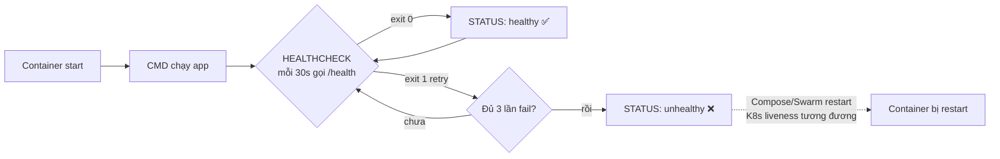

# Bài 51 — `.dockerignore` + USER + HEALTHCHECK 🔴

> **Loại bài:** production-grade — gia cố image trước khi push.
> **Snapshot trước:** copy từ `24-push-registry/` (cần image `myapp:6.0`).
> **Tag image mới:** `myapp:safe`.

## Mục tiêu

Biến image basic thành image production-ready với 3 lớp bảo vệ:

1. **`.dockerignore`** — bỏ noise khỏi build context (giảm size, tránh leak `.env`).
2. **`USER appuser`** — chạy non-root (giảm thiệt hại nếu RCE).
3. **HEALTHCHECK** — Docker tự kiểm tra app còn khoẻ.

## File trong thư mục này

```
51-secure-image/
├── README.md
└── myapp/
    ├── .dockerignore         ← bỏ git, pycache, .env, *.md, logs/...
    ├── Dockerfile            ← multi-step: install curl → useradd → USER appuser → HEALTHCHECK
    ├── app.py                ← Flask + /health endpoint
    └── requirements.txt
```

## HEALTHCHECK lifecycle (sơ đồ)



> 📚 **Tham số HEALTHCHECK** trong Dockerfile:
> - `--interval=30s` — chu kỳ kiểm tra
> - `--timeout=3s` — quá lâu coi như fail
> - `--start-period=5s` — grace period lúc khởi động, fail KHÔNG bị tính
> - `--retries=3` — fail liên tiếp N lần mới chuyển sang `unhealthy`

## Lệnh thủ công

```bash
cd myapp

# 1. Tạo network và Redis backend (app cần)
docker network create myapp-net 2>/dev/null || true
docker run -d --name redis --network myapp-net redis:alpine 2>/dev/null || true

# 2. Build image safe
docker build -t myapp:safe .

# 3. Chạy container
docker stop myapp-safe 2>/dev/null; docker rm myapp-safe 2>/dev/null
docker run -d -p 8080:5000 --name myapp-safe \
  --network myapp-net \
  myapp:safe

# 4. Verify non-root
docker exec myapp-safe whoami     # → appuser
docker exec myapp-safe id         # → uid=1001(appuser)...

# 5. Đợi ~30s rồi kiểm tra HEALTHCHECK
sleep 35
docker ps                          # STATUS có "(healthy)"
docker inspect --format='{{json .State.Health}}' myapp-safe | jq

# 6. Test endpoint
curl http://localhost:8080
curl http://localhost:8080/health
```

## Kết quả mong đợi

- `docker build`: dòng `Sending build context to Docker daemon ...` nhỏ hơn rõ rệt so với khi không có `.dockerignore`.
- `whoami` → `appuser`, `id` → `uid=1001`.
- Sau ~30s, `docker ps` cột STATUS hiển thị `Up X seconds (healthy)`.
- `docker inspect` JSON `.State.Health.Status` = `"healthy"`.

## Tiêu chí hoàn thành

- [ ] `.dockerignore` tồn tại, build context nhẹ hơn
- [ ] `docker exec myapp-safe id` ra `uid=1001`, KHÔNG phải `uid=0`
- [ ] `docker ps` thấy `(healthy)` ở cột STATUS sau ~30s
- [ ] `curl /health` trả `{"status": "ok"}`
- [ ] Đã trả lời 2 **Câu hỏi** cuối bài

## Lỗi thường gặp

| Lỗi | Cách xử lý |
|------|------------|
| `permission denied` khi app ghi file | Path ghi không thuộc `appuser` — `RUN chown -R appuser:appuser /app` trước `USER` |
| HEALTHCHECK luôn `unhealthy` | Image slim KHÔNG có `curl` mặc định — Dockerfile ở đây đã `apt-get install -y curl` |
| `useradd: command not found` | Image `alpine` dùng `adduser`, không phải `useradd` |
| `ConnectionError redis` trong log | Redis chưa chạy hoặc khác network — bước 1 đã handle |

## Câu hỏi

- Tại sao chạy non-root là bắt buộc trong production? *(giảm blast radius nếu app bị RCE; nhiều orchestrator như OpenShift, GKE Autopilot CHỈ chấp nhận non-root)*
- HEALTHCHECK của Docker khác Liveness Probe của K8s thế nào? *(Docker HEALTHCHECK chỉ đánh dấu `unhealthy` — không tự restart; K8s Liveness fail thì kubelet restart container. K8s thường BỎ QUA Docker HEALTHCHECK, dùng probe riêng.)*

## Bài kế tiếp

```bash
cp -r ../51-secure-image ../52-restart-limits
cd ../52-restart-limits
```

Bài 52 không sửa source — chỉ học flag `--restart` và `--memory/--cpus` khi `docker run`.
