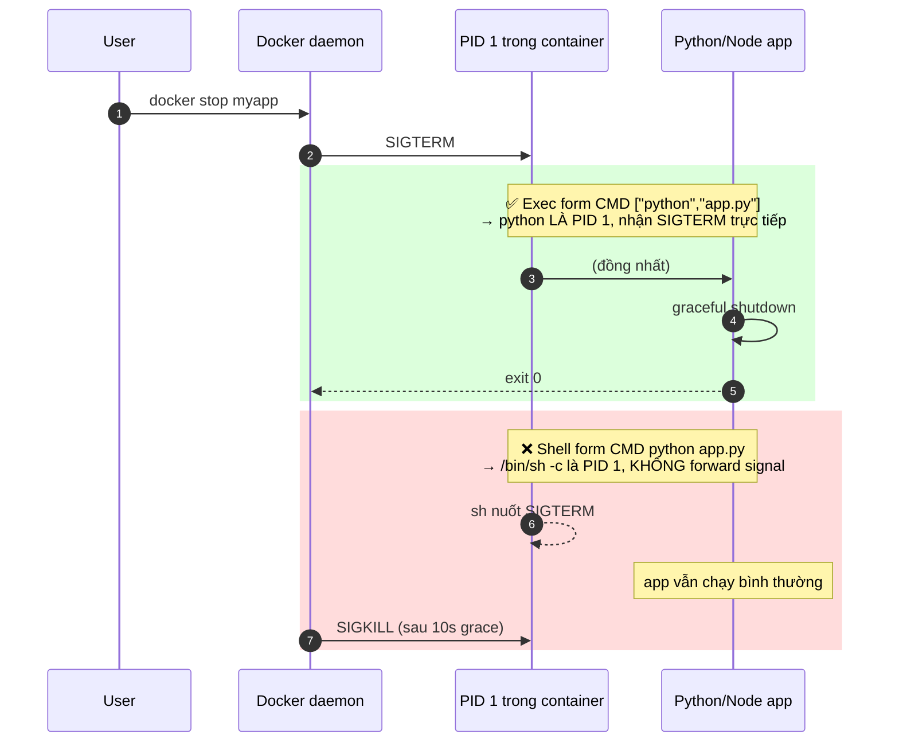

# Bài 53 — ENTRYPOINT vs CMD + Signal Handling (PID 1) 🔴

> **Loại bài:** demo nhiều Dockerfile, đo `docker stop` để thấy bẫy signal.
> **Snapshot trước:** copy từ `52-restart-limits/`.

## Mục tiêu

1. Hiểu khác biệt **ENTRYPOINT vs CMD** + **exec form vs shell form**.
2. Trải nghiệm bẫy **PID 1 không nhận tín hiệu** → `docker stop` mất ~10s.
3. Biết khi nào cần `tini` để reap zombie process.

## Tại sao quan trọng?

Khi K8s rolling update / Compose `stop`, hệ thống gửi **SIGTERM** trước, chờ `terminationGracePeriodSeconds` (mặc định 30s) rồi mới SIGKILL. Nếu app KHÔNG nhận SIGTERM:

- Không kịp đóng DB pool, flush log, hoàn tất request đang xử lý.
- User đang request bị reset đột ngột → bad UX, mất data.

## Luồng signal đúng vs sai



> 📚 **Vì sao shell form hỏng?**
> - `CMD python app.py` được Docker bọc thành `/bin/sh -c "python app.py"`.
> - `/bin/sh` trở thành PID 1; POSIX shell mặc định KHÔNG forward signal xuống child.
> - App Python (PID 2) cứ chạy → bị SIGKILL sau grace period → mất data.
>
> 👉 **Quy tắc vàng:** Luôn dùng **exec form** `["binary", "arg1"]` cho CMD/ENTRYPOINT.

## File trong thư mục này

```
53-entrypoint-signal/
├── README.md
└── myapp/
    ├── signal_app.py     ← Python app có signal handler
    ├── Dockerfile.A      ← demo: chỉ CMD (exec form)
    ├── Dockerfile.B      ← demo: chỉ ENTRYPOINT (exec form)
    ├── Dockerfile.C      ← demo: cả hai, CMD làm default args
    ├── Dockerfile.D      ← demo: shell form (KHÔNG nên dùng)
    ├── Dockerfile.bad    ← shell form, signal KHÔNG forward
    ├── Dockerfile.good   ← exec form, signal forward đúng
    └── Dockerfile.tini   ← dùng tini làm PID 1
```

## Lệnh thủ công

### Phần A — Demo 4 Dockerfile ENTRYPOINT/CMD

```bash
cd myapp

# LƯU Ý: tag image phải LOWERCASE — Docker reject 'demo-A' với "invalid reference format"
for f in a b c d; do
  UPPER=$(echo "$f" | tr a-z A-Z)             # 'A' để chọn Dockerfile.A
  docker build -t demo-$f -f Dockerfile.$UPPER .
  echo ""
  echo "=== Image $UPPER ==="
  echo "-- run image --"
  docker run --rm demo-$f
  echo "-- run image override-arg --"
  docker run --rm demo-$f override-arg
done
```

> 💡 Docker image **repository name** chỉ chấp nhận `[a-z0-9._-]`. Tag (`:v1`) thì cho phép uppercase. Đây là lỗi quen thuộc khi copy lệnh từ ví dụ.

**Kết quả mong đợi:**

| Image | `run image` | `run image override-arg` |
|-------|-------------|--------------------------|
| A (CMD only) | `from CMD` | (chạy `override-arg` thay CMD → lỗi: command not found) |
| B (ENTRYPOINT only) | `from ENTRYPOINT` | `from ENTRYPOINT override-arg` |
| C (cả hai) | `default-msg` | `override-arg` |
| D (shell form) | `from-shell-form` | (override hết, lỗi) |

### Phần B — PID 1 signal bẫy

```bash
# 1. Build 2 image
docker build -t bad-signal-img  -f Dockerfile.bad  .
docker build -t good-signal-img -f Dockerfile.good .

# 2. Test bad — sẽ mất ~10s vì shell nuốt SIGTERM
docker run -d --name bad-signal bad-signal-img
sleep 2
time docker stop bad-signal       # ≈ 10s
docker logs bad-signal | tail     # KHÔNG có dòng "Got signal"

# 3. Test good — < 1s, graceful shutdown
docker run -d --name good-signal good-signal-img
sleep 2
time docker stop good-signal      # < 1s
docker logs good-signal | tail    # CÓ dòng "Got signal 15 (SIGTERM), shutting down gracefully"

# 4. Dọn dẹp
docker rm bad-signal good-signal
```

### Phần C — `tini` để fix zombie process

```bash
# 5. Build image dùng tini làm PID 1
docker build -t tini-signal-img -f Dockerfile.tini .

# 6. Test — tini forward signal y như exec form
docker run -d --name tini-signal tini-signal-img
sleep 2
time docker stop tini-signal      # < 1s
docker logs tini-signal | tail
docker rm tini-signal
```

## Kết quả mong đợi

- `time docker stop bad-signal` ≈ 10s, log KHÔNG có "Got signal".
- `time docker stop good-signal` < 1s, log có dòng `Got signal 15 (SIGTERM)`.
- `time docker stop tini-signal` < 1s, log tương tự `good`.

## Tiêu chí hoàn thành

- [ ] Build và chạy đủ 4 Dockerfile demo (A, B, C, D)
- [ ] Đo được thời gian thực `docker stop` cho bad vs good
- [ ] Hiểu shell form làm app không nhận SIGTERM
- [ ] Đã thử Dockerfile.tini
- [ ] Đã trả lời 2 câu hỏi cuối

## Lỗi thường gặp

| Lỗi | Cách xử lý |
|------|------------|
| `docker stop` luôn mất ~10s | Đang chạy shell form hoặc không có signal handler — chuyển sang exec form |
| Log không in ra | Stdout bị buffer — set `PYTHONUNBUFFERED=1` (đã có trong Dockerfile) |
| `tini: not found` trên alpine | `RUN apk add --no-cache tini`; Debian/Ubuntu: `apt-get install -y tini` |

## Câu hỏi

- `docker stop` mặc định gửi tín hiệu gì? Đợi bao lâu mới SIGKILL? *(SIGTERM trước, 10s grace, rồi SIGKILL. Đổi bằng `docker stop --time=30 <name>`)*
- Tại sao Node.js app hay bị "zombie process" nếu spawn child mà không dùng tini? *(Node không reap child process tự động; tini làm PID 1 reaper chuẩn)*

## Bài kế tiếp

```bash
cp -r ../53-entrypoint-signal ../54-image-scan
cd ../54-image-scan
```
