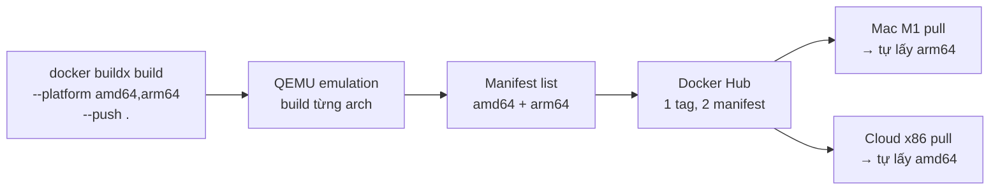

# Bài 55 — Buildx: Multi-arch Image (amd64 + arm64)

> **Loại bài:** học `buildx`, build 1 lần cho nhiều platform.
> **Snapshot trước:** copy từ `54-image-scan/`.

## Mục tiêu

Build image chạy được trên cả:

- **Mac Apple Silicon (M1/M2/M3)** — `linux/arm64`
- **Cloud x86 / Intel Mac / Linux server** — `linux/amd64`

Chỉ 1 tag duy nhất trên Docker Hub → user `docker pull` máy nào cũng đúng kiến trúc tự động (Docker daemon đọc manifest list).

## Bức tranh kiến trúc



## File trong thư mục này

```
55-buildx-multiarch/
└── README.md           ← chỉ README, dùng app từ 51-secure-image
```

Tái sử dụng Dockerfile + source từ Bài 51.

## Lệnh thủ công

### Phần A — Setup builder

```bash
# 1. Liệt kê builder hiện có (default driver "docker" KHÔNG hỗ trợ multi-arch)
docker buildx ls

# 2. Tạo builder mới với driver "docker-container" (hỗ trợ multi-arch)
docker buildx create --name multibuilder --use --bootstrap

# 3. Verify
docker buildx ls
# Phải thấy multibuilder có PLATFORMS: linux/amd64, linux/arm64, ...
```

### Phần B — Build multi-arch và push

```bash
# 4. Login Docker Hub
docker login

# 5. Dùng source từ Bài 51
cd ../51-secure-image/myapp

# 6. Build cả 2 platform và push thẳng lên Hub
docker buildx build \
  --platform linux/amd64,linux/arm64 \
  -t <your-username>/myapp:6.0-multi \
  --push .

# Lưu ý: --push BẮT BUỘC khi build multi-platform với docker-container driver
# Vì kết quả là manifest list, không thể load vào local Docker daemon
```

### Phần C — Verify

```bash
# 7. Inspect manifest — phải thấy 2 platform
docker buildx imagetools inspect <your-username>/myapp:6.0-multi

# Output mẫu:
# Name: docker.io/<your-username>/myapp:6.0-multi
# MediaType: application/vnd.oci.image.index.v1+json
# Manifests:
#   - Platform: linux/amd64  → Digest: sha256:abc...
#   - Platform: linux/arm64  → Digest: sha256:def...

# 8. Mở web hub.docker.com — tab "Tags" → tag 6.0-multi sẽ thấy cả 2 OS/Architecture
```

### Phần D — Cleanup

```bash
# 9. Trở về thư mục bài
cd -

# 10. Switch context về default TRƯỚC khi xóa builder
docker context use default

# 11. Xóa builder
docker buildx rm multibuilder
```

> 💡 `docker buildx use default` thường báo `ERROR: run docker context use default to switch to default context`. Đây là 2 khái niệm khác (builder vs context). Dùng `docker context use default` rồi mới `buildx rm`.

## Kết quả mong đợi

- `docker buildx ls` thấy `multibuilder` ở status `running`.
- Trên Docker Hub, tag `6.0-multi` có **2 manifest** (amd64 + arm64).
- `docker buildx imagetools inspect` in `Platform: linux/amd64` và `Platform: linux/arm64`.

## Tiêu chí hoàn thành

- [ ] Tạo và `--use` được builder `multibuilder`
- [ ] Build push thành công 2 platform trong 1 lệnh
- [ ] Verify manifest có 2 arch trên Docker Hub
- [ ] Đã trả lời 2 câu hỏi về QEMU vs native

## Lỗi thường gặp

| Lỗi | Cách xử lý |
|------|------------|
| `multiple platforms feature is currently not supported for docker driver` | Phải tạo builder qua `buildx create --use`, KHÔNG dùng default `docker` driver |
| Build arm64 trên amd64 cực chậm | QEMU emulation chậm 5-10×; production CI nên dùng native ARM runner (GitHub Actions `ubuntu-24.04-arm`) |
| `--push` báo `unauthorized: authentication required` | Chưa `docker login` hoặc tag không có prefix `<username>/` đúng |
| `error: no builder ... found` | `docker buildx use multibuilder` lại |

## So với cách cũ

| Cách | Một lần build | Chạy cross-arch? | CI/CD friendly? |
|------|---------------|------------------|-----------------|
| `docker build` thường | 1 platform | ❌ | ❌ |
| `docker build --platform linux/amd64` (override) | 1 platform | ✅ (chậm vì QEMU) | ⚠️ phải build riêng từng arch |
| `docker buildx build --platform ...,...` | Nhiều platform | ✅ | ✅ (output manifest list) |

## Câu hỏi

- Sao không build trực tiếp `docker build` với 2 arch? *(Default `docker` driver chỉ build 1 platform/lần; phải dùng `docker-container` driver qua `buildx create`.)*
- QEMU emulation chậm hơn native bao nhiêu? *(5-10× tuỳ workload, nặng nhất ở compile C/Rust. Khi nào cần native ARM CI: build app lớn (>5 phút trên amd64), build thường xuyên → tốn budget.)*

## Bài kế tiếp

Hoàn thành chuỗi **Docker Bonus** (Bài 51-55). Tiếp tục với phần K8s Bonus:

```bash
# Xem Bài 56 — Job & CronJob trong K8s/
cd ../../K8s/
```

Hoặc xem tổng quan: [`Docker/README.md`](../README.md), [`K8s/README.md`](../../K8s/README.md).
