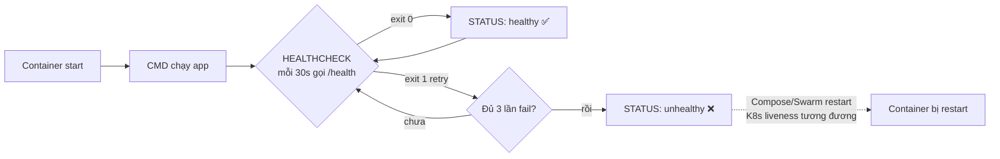
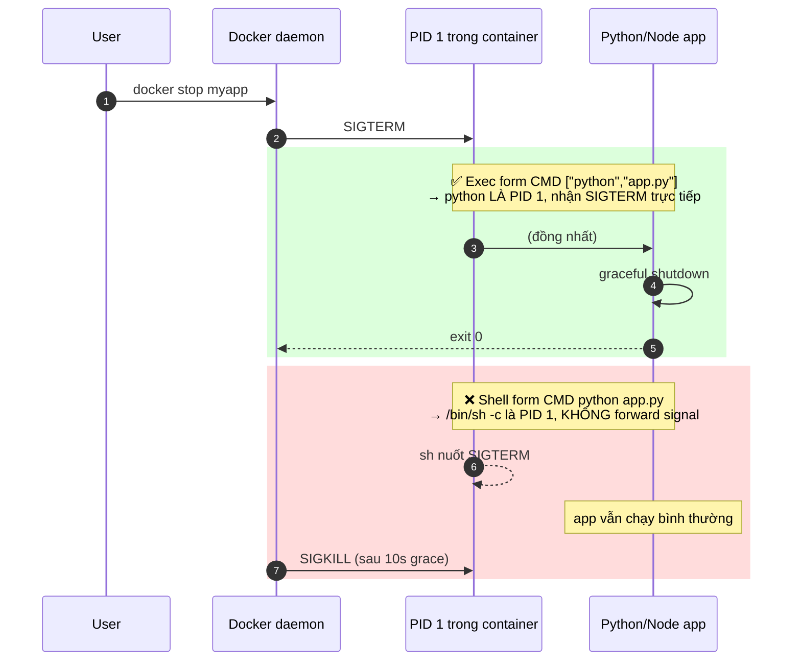

# Docker — Đề thực hành chi tiết (Bài 01–24 + Bonus 51–55)

> **Series:** docker-practice  
> **Author:** Mr.Rom  
> **Điều hướng:** [Mục lục series](README.md) · [Phần tiếp theo →](../K8s/kubernetes-practice.md)

> **Nguyên tắc:** Mỗi bài có **yêu cầu chi tiết**, **kết quả mong đợi** và **checklist**. Chỉ chuyển bài khi đủ tiêu chí hoàn thành — không cần suy đoán thêm bước ngoài đề.


## Điều kiện tiên quyết (toàn phần)

| Yêu cầu | Chi tiết |
|---------|----------|
| Hệ điều hành | macOS, Linux, hoặc Windows + WSL2 |
| Docker | Docker Engine hoặc Docker Desktop đã cài, `docker version` chạy được |
| Terminal | Bash hoặc zsh |
| Editor | Bất kỳ editor để sửa `app.py`, `Dockerfile` |

## Cấu trúc thư mục làm việc (bắt buộc từ Bài 04)

Tạo và giữ thư mục sau trong workspace của bạn (ví dụ `~/labs/myapp/`):

```
myapp/
├── app.py
├── requirements.txt      # từ Bài 10
├── Dockerfile
├── Dockerfile.multi        # Bài 22
├── Dockerfile.exit         # Bài 20
├── docker-compose.yml      # Bài 23
├── app.env                 # Bài 18
├── logs/                   # Bài 19 (tạo khi chạy)
└── static/                 # Bài 14 (tùy bài)
```

## Quy ước đọc mỗi bài

Mỗi bài gồm các mục sau — **làm đủ tất cả** trước khi sang bài tiếp:

1. **Mục tiêu** — kiến thức cần nắm
2. **Điều kiện tiên quyết** — bài/image/container phải có sẵn
3. **Yêu cầu chi tiết** — từng bước, không suy đoán
4. **Lệnh thực hiện** — copy-paste được
5. **Kết quả mong đợi** — output/status đúng thì mới coi là xong
6. **Tiêu chí hoàn thành** — checklist tự kiểm
7. **Lỗi thường gặp** — khi không khớp kết quả mong đợi

## App xuyên suốt

Ứng dụng `myapp` bắt đầu là script Python in chuỗi, dần thành Flask API + Redis + Compose, image cuối **`myapp:6.0`** (hoặc `<username>/myapp:6.0` sau Bài 24) dùng cho phần Kubernetes.

> **📌 Đã có bản chạy thật trong repo:** thư mục [`myapp/`](../myapp/) + script [`scripts/run-docker-lab.sh`](../scripts/run-docker-lab.sh). Nhật ký chạy: [`LAB-RUN-LOG.md`](../LAB-RUN-LOG.md).


---

## 📌 Lưu ý học viên (đọc trước khi làm bài)

> Ghi chú từ rà soát tài liệu — tránh hiểu nhầm đề hoặc kẹt lâu ở một bước.

| Bài | Vấn đề thường gặp | Cách xử lý |
|-----|-------------------|------------|
| **Chung** | `docker compose` vs `docker-compose` | Docker Desktop mới dùng `docker compose` (không gạch). Nếu lệnh không tìm thấy, thử bản còn lại — **ghi rõ** trong notes bạn dùng lệnh nào. |
| **Chung** | macOS Apple Silicon (M1/M2/M3) | Image `python:3.11-slim` thường chạy được. Nếu `exec` báo không có `bash`, dùng `sh` (Bài 12). |
| **05** | Xóa `python:3.11-slim` báo lỗi | Trên Docker cũ sẽ báo lỗi. Trên Docker mới (BuildKit), lệnh sẽ thành công và gỡ tag (Untagged) nhưng layer vẫn được giữ lại cho `myapp`. |
| **03** | Container thoát ngay, `docker ps` trống | Đúng với app chỉ `print` hoặc lệnh in xong rồi kết thúc (như hello-world hay alpine). Dùng `docker ps -a` để thấy trạng thái `Exited (0)`. |
| **10→11** | Bài 11 cần container `myapp-web` | Phải làm xong Bài 10; nếu đã `rm`, chạy lại `docker run -d -p 8080:5000 --name myapp-web myapp:2.0` (hoặc tag bạn đang dùng). |
| **12** | `exec`: `bash` not found | Image slim đôi khi chỉ có `sh`: `docker exec -it myapp-web sh` |
| **15** | `apt-get` trong container | Cần quyền root (mặc định trong `python:3.11-slim`). Nếu fail, thử `docker exec -u 0 -it myapp-web bash` |
| **19** | Bind mount trên Windows | Dùng WSL2 path; trong PowerShell `$(pwd)` có thể sai — chạy lệnh từ WSL hoặc đường dẫn đầy đủ. |
| **21** | App không kết nối Redis | Trong code **phải** `host='redis'` (tên service), không dùng `localhost`. Hai container cùng network `myapp-net`. |
| **21→K8s** | Lỗi 500 trên `/` khi deploy K8s | K8s tự inject biến `REDIS_PORT=tcp://...` — đừng `int(os.getenv("REDIS_PORT"))` trực tiếp. Repo mẫu dùng `APP_REDIS_HOST` / parse port (xem `myapp/app.py`). |
| **23** | Compose không lên web | `depends_on` tự thân chỉ đợi **container start**, không đợi Postgres/Redis ready. Đề Bài 23 đã thêm `healthcheck` + `condition: service_healthy` cho `redis` và `db` → `web` sẽ chờ đúng. Image `myapp:6.0` phải **đã build** trước (`docker build -t myapp:6.0 .`). |
| **23** | Dòng `version: '3.8'` | Compose V2 đã **deprecated** field này — file mẫu trong đề KHÔNG còn `version:`. Nếu copy code cũ, có thể bỏ dòng đó đi. |
| **24** | Push OK nhưng K8s sau không pull được | Repo Docker Hub phải **public** (free) hoặc sau này cấu hình `imagePullSecrets` — phần K8s giả định public. |

**Debug nhanh (Docker):** `docker ps -a` · `docker logs <tên>` · `docker inspect <tên>` · `docker events` (tùy chọn)

---

## **Bài 01: Pull image đầu tiên**

**Mục tiêu:** Làm quen lệnh pull, hiểu khái niệm image từ registry.

### Điều kiện tiên quyết

Docker đã cài; có kết nối internet.

### Kết quả mong đợi

- Lệnh `docker pull` kết thúc với `Status: Downloaded newer image` hoặc `Image is up to date`.
- `docker images` liệt kê đủ 3 image: `hello-world`, `python` (tag `3.11-slim`), `alpine` (`latest`).

### Tiêu chí hoàn thành (checklist)

- [ ] `docker images hello-world` có ít nhất 1 dòng
- [ ] `docker images python` thấy tag `3.11-slim`
- [ ] `docker images alpine` thấy tag `latest`

### Lỗi thường gặp

Lỗi `denied`/`unauthorized`: chưa login registry private — các image đề này là public Docker Hub.


**Yêu cầu chi tiết:**

| Bước | Việc bạn phải làm | Không được bỏ qua |
|------|-------------------|-------------------|
| 1 | Pull image `hello-world` từ Docker Hub (registry mặc định) | Không dùng image local có sẵn mà không chạy `pull` |
| 2 | Pull `python:3.11-slim` — **đúng tag**, không dùng `python:latest` | Tag sai → các bài build sau lệch layer |
| 3 | Pull `alpine:latest` | — |
| 4 | Liệt kê image vừa pull để tự kiểm tra | Bước verify bắt buộc |

**Lệnh thực hiện:**
```bash
docker pull hello-world
docker pull python:3.11-slim
docker pull alpine:latest

# Verify (bắt buộc)
docker images --format "table {{.Repository}}\t{{.Tag}}\t{{.Size}}" | grep -E 'hello-world|python|alpine'
```

**Câu hỏi suy ngẫm:**
- Khi pull, terminal hiển thị nhiều dòng "Pull complete" - đó là gì?
- Tại sao lần pull thứ 2 cùng image lại nhanh hơn?

---

## **Bài 02: Kiểm tra image đã có**

**Mục tiêu:** Liệt kê, lọc, xem thông tin image.

### Điều kiện tiên quyết

Hoàn thành Bài 01.

### Kết quả mong đợi

- Mọi lệnh trong **Lệnh thực hiện** chạy xong không lỗi fatal (exit code 0 hoặc lỗi có giải thích trong đề).
- Trạng thái cuối khớp mô tả trong **Yêu cầu chi tiết** (image/container/pod Running hoặc Exited đúng như đề).

### Tiêu chí hoàn thành (checklist)

- [ ] Đã đọc **Mục tiêu** và hoàn thành mọi bước trong **Yêu cầu chi tiết**
- [ ] Kết quả khớp **Kết quả mong đợi** (hoặc tương đương nếu môi trường khác một chút)
- [ ] Ghi chú lại lệnh đã chạy (để so sánh khi gặp lỗi)
- [ ] (Nếu có) Đã trả lời **Câu hỏi** / **Câu hỏi suy ngẫm** trước khi sang bài tiếp

### Lỗi thường gặp

Đọc lại **Lệnh thực hiện**; kiểm tra `docker ps -a`, `docker logs <container>`, `docker inspect <container>`. Một số bài gộp lệnh trong **Yêu cầu chi tiết** (không có mục Lệnh riêng) — vẫn phải chạy đủ các khối lệnh trong đề.


**Yêu cầu chi tiết:**
1. Liệt kê tất cả image đang có
2. Liệt kê chỉ ID của image
3. Liệt kê cả image trung gian (dangling)
4. Lọc image có tên chứa "python"
5. Xem dung lượng từng image

**Lệnh thực hiện:**
```bash
docker images
docker images -q
docker images -a
docker images | grep python
docker images --format "table {{.Repository}}\t{{.Tag}}\t{{.Size}}"
```

**Câu hỏi:**
- `IMAGE ID` có ý nghĩa gì? Tại sao 2 image có thể cùng ID?
- Cột `CREATED` là thời gian image được build hay được pull?

---

## **Bài 03: Run container cơ bản (Foreground)**

**Mục tiêu:** Chạy container từ image có sẵn, hiểu vòng đời container — container thoát khi process chính thoát, học cách đặt tên và tự động dọn dẹp container.

### Điều kiện tiên quyết

Hoàn thành Bài 01 và Bài 02 (đã pull các image `hello-world` và `alpine`).

### Kết quả mong đợi

- `docker ps -a` thấy `alpine-test` ở trạng thái `Exited (0)`.
- Sau khi chạy với `--rm`, `docker ps -a` không hiển thị container đó.
- Sau khi `docker rm alpine-test`, lệnh `docker ps -a` không còn container đó nữa.

### Tiêu chí hoàn thành (checklist)

- [ ] Chạy thành công `hello-world` và `alpine`
- [ ] Gán nhãn tên thành công cho container và hiểu lỗi trùng tên container
- [ ] Sử dụng `--rm` tự động dọn dẹp container

### Lỗi thường gặp

Chạy lại lệnh đặt tên container trùng với container đã tồn tại mà không xóa container cũ trước.

**Yêu cầu chi tiết:**
1. Chạy `hello-world` ở chế độ foreground
2. Chạy `alpine` truyền thêm lệnh in stdout
3. Chạy container và đặt tên cụ thể `alpine-test`
4. Chạy lại với cùng tên `alpine-test` để thấy thông báo lỗi trùng tên
5. Xem container đã dừng bằng `docker ps -a`
6. Chạy với `--rm` để tự xóa container khi xong
7. Dọn dẹp container cũ `alpine-test` bằng lệnh `docker rm`

**Lệnh thực hiện:**
```bash
# 1. Run foreground với hello-world
docker run hello-world

# 2. Run foreground với alpine + truyền lệnh
docker run alpine echo "Hello from Alpine"

# 3. Run với tên cụ thể
docker run --name alpine-test alpine echo "Testing name"

# 4. Chạy lại cùng tên → SẼ LỖI vì container "alpine-test" đã tồn tại (Exited)
docker run --name alpine-test alpine echo "Testing name"

# 5. Liệt kê container đã dừng để kiểm tra
docker ps -a

# 6. Run với --rm (tự xóa container sau khi chạy xong)
docker run --rm alpine echo "Testing --rm"

# 7. Dọn dẹp container cũ
docker rm alpine-test
```

**Câu hỏi:**
- Tại sao container dừng ngay sau khi chạy? *(process chính kết thúc -> container exit)*
- Sự khác nhau giữa `docker run` và `docker start`? *(run = tạo + start container mới; start = chạy lại container cũ đã dừng)*

---

## **Bài 04: Tạo app Python đầu tiên & Dockerfile cơ bản**

**Mục tiêu:** Viết Dockerfile đầu tiên, build image từ source code.

### Điều kiện tiên quyết

Hoàn thành Bài 03; thư mục làm việc trống hoặc `myapp/` mới.

### Kết quả mong đợi

- `docker build` kết thúc `Successfully tagged myapp:latest` (hoặc tag bạn đặt).
- `docker run myapp` in ra đúng 2 dòng trong `app.py` (Version 1.0).

### Tiêu chí hoàn thành (checklist)

- [ ] Tồn tại `myapp/app.py` và `myapp/Dockerfile` đúng nội dung đề
- [ ] Build không lỗi
- [ ] Run in stdout đúng 2 câu print

### Lỗi thường gặp

Đọc lại **Lệnh thực hiện**; kiểm tra `docker ps -a`, `docker logs <container>`, `docker inspect <container>`. Một số bài gộp lệnh trong **Yêu cầu chi tiết** (không có mục Lệnh riêng) — vẫn phải chạy đủ các khối lệnh trong đề.

**Yêu cầu chi tiết:**

| Bước | Việc bạn phải làm | Ghi chú |
|------|-------------------|---------|
| 1 | Tạo thư mục `myapp/` (tên đúng như đề) | Có thể đặt ở `~/labs/myapp` |
| 2 | Tạo `myapp/app.py` — nội dung **y hệt** khối code bên dưới | Không thêm import/thư viện |
| 3 | Tạo `myapp/Dockerfile` — **4 dòng** `FROM` → `CMD` như đề | Không `RUN pip` ở bài này |
| 4 | `docker build -t myapp .` chạy trong thư mục có Dockerfile | Context là `.` |
| 5 | `docker run myapp` — container thoát sau khi in 2 dòng | Exit code 0 |

**File `app.py` (copy nguyên văn):**
```python
# app.py
print("Hello from MyApp - Version 1.0")
print("Running inside Docker container")
```

**File `Dockerfile` (copy nguyên văn):**
```dockerfile
FROM python:3.11-slim
WORKDIR /app
COPY app.py .
CMD ["python", "app.py"]
```

**Lệnh thực hiện:**
```bash
cd myapp
docker build -t myapp .
docker run myapp
```

**Câu hỏi:**
- Mỗi dòng trong Dockerfile có ý nghĩa gì?
- `WORKDIR` khác `cd` thế nào?
- Tại sao không cần install Python trong container?

---

## **Bài 05: Xóa image**

**Mục tiêu:** Quản lý dọn dẹp image không cần thiết.

### Điều kiện tiên quyết

Hoàn thành Bài 04.

### Kết quả mong đợi

- Mọi lệnh trong **Lệnh thực hiện** chạy xong không lỗi fatal (exit code 0 hoặc lỗi có giải thích trong đề).
- Trạng thái cuối khớp mô tả trong **Yêu cầu chi tiết** (image/container/pod Running hoặc Exited đúng như đề).

### Tiêu chí hoàn thành (checklist)

- [ ] Đã đọc **Mục tiêu** và hoàn thành mọi bước trong **Yêu cầu chi tiết**
- [ ] Kết quả khớp **Kết quả mong đợi** (hoặc tương đương nếu môi trường khác một chút)
- [ ] Ghi chú lại lệnh đã chạy (để so sánh khi gặp lỗi)
- [ ] (Nếu có) Đã trả lời **Câu hỏi** / **Câu hỏi suy ngẫm** trước khi sang bài tiếp

### Lỗi thường gặp

Đọc lại **Lệnh thực hiện**; kiểm tra `docker ps -a`, `docker logs <container>`, `docker inspect <container>`. Một số bài gộp lệnh trong **Yêu cầu chi tiết** (không có mục Lệnh riêng) — vẫn phải chạy đủ các khối lệnh trong đề.

**Yêu cầu chi tiết:**
1. Xóa image `hello-world` đã pull ở Bài 01
2. Thử xóa image `python:3.11-slim` - hiểu lý do nếu bị lỗi (trên Docker cũ) hoặc được gỡ tag (trên Docker mới)
3. Xóa image dangling (image không tag)
4. **KHÔNG xóa** `myapp` (và không cần lo nếu `python:3.11-slim` bị gỡ tag vì layer đã được cache cho `myapp`)

**Lệnh thực hiện:**
```bash
docker rmi hello-world
docker rmi <image_id>           # Cách 2: xóa bằng ID
docker image prune              # Xóa dangling
docker images                   # Verify
```

**Câu hỏi:**
- Sự khác nhau giữa `docker rmi` và `docker image prune`?
- Khi nào dùng `-f` (force)?

---

## **Bài 06: Tag và Versioning**

**Mục tiêu:** Hiểu khái niệm tag, quản lý nhiều phiên bản image.

### Điều kiện tiên quyết

Hoàn thành Bài 05.

### Kết quả mong đợi

- Mọi lệnh trong **Lệnh thực hiện** chạy xong không lỗi fatal (exit code 0 hoặc lỗi có giải thích trong đề).
- Trạng thái cuối khớp mô tả trong **Yêu cầu chi tiết** (image/container/pod Running hoặc Exited đúng như đề).

### Tiêu chí hoàn thành (checklist)

- [ ] Đã đọc **Mục tiêu** và hoàn thành mọi bước trong **Yêu cầu chi tiết**
- [ ] Kết quả khớp **Kết quả mong đợi** (hoặc tương đương nếu môi trường khác một chút)
- [ ] Ghi chú lại lệnh đã chạy (để so sánh khi gặp lỗi)
- [ ] (Nếu có) Đã trả lời **Câu hỏi** / **Câu hỏi suy ngẫm** trước khi sang bài tiếp

### Lỗi thường gặp

Đọc lại **Lệnh thực hiện**; kiểm tra `docker ps -a`, `docker logs <container>`, `docker inspect <container>`. Một số bài gộp lệnh trong **Yêu cầu chi tiết** (không có mục Lệnh riêng) — vẫn phải chạy đủ các khối lệnh trong đề.

**Yêu cầu chi tiết:**

1. Sửa `app.py` thành version 1.1:
```python
print("Hello from MyApp - Version 1.1")
print("Added: timestamp feature")
from datetime import datetime
print(f"Current time: {datetime.now()}")
```

2. Build với tag cụ thể:
```bash
docker build -t myapp:1.1 .
```

3. Sửa tiếp app thành version 1.2 (thêm dòng in tên hệ điều hành), build với tag `1.2`

4. Build thêm 1 lần nữa **không có tag** → tự động gắn `latest`

5. Liệt kê và quan sát:
```bash
docker images myapp
```

> ⚠️ **2 bẫy khi làm bài này trên macOS:**
>
> 1. **Alias `cp -i`** — `cp app_v1_1.py.snapshot app.py` sẽ prompt confirm. Nếu không gõ `y`, file KHÔNG overwrite → build sai content. Bypass: `/bin/cp -f` hoặc `\cp -f`.
> 2. **BuildKit (Docker 23+)** — đề cũ kỳ vọng `myapp:1.2` và `myapp:latest` cùng IMAGE ID. Trên BuildKit, mỗi build sinh manifest metadata khác → IMAGE ID có thể khác dù app.py giống. Đây là **bình thường**, không phải bug.

**Câu hỏi:**
- Có bao nhiêu image `myapp` hiện tại?
- Tag `latest` đang trỏ tới version nào?
- Image ID của các tag khác nhau giống hay khác nhau? *(Classic builder: giống. BuildKit: thường khác.)*

---

## **Bài 07: Đổi tag (Retag)**

**Mục tiêu:** Hiểu tag là "nhãn dán", không phải bản sao image.

### Điều kiện tiên quyết

Hoàn thành Bài 06.

### Kết quả mong đợi

- Mọi lệnh trong **Lệnh thực hiện** chạy xong không lỗi fatal (exit code 0 hoặc lỗi có giải thích trong đề).
- Trạng thái cuối khớp mô tả trong **Yêu cầu chi tiết** (image/container/pod Running hoặc Exited đúng như đề).

### Tiêu chí hoàn thành (checklist)

- [ ] Đã đọc **Mục tiêu** và hoàn thành mọi bước trong **Yêu cầu chi tiết**
- [ ] Kết quả khớp **Kết quả mong đợi** (hoặc tương đương nếu môi trường khác một chút)
- [ ] Ghi chú lại lệnh đã chạy (để so sánh khi gặp lỗi)
- [ ] (Nếu có) Đã trả lời **Câu hỏi** / **Câu hỏi suy ngẫm** trước khi sang bài tiếp

### Lỗi thường gặp

Đọc lại **Lệnh thực hiện**; kiểm tra `docker ps -a`, `docker logs <container>`, `docker inspect <container>`. Một số bài gộp lệnh trong **Yêu cầu chi tiết** (không có mục Lệnh riêng) — vẫn phải chạy đủ các khối lệnh trong đề.

**Tình huống:** Phiên bản `1.2` đã ổn định, muốn promote nó thành `latest` chính thức và tạo thêm tag `stable`.

**Yêu cầu chi tiết:**
1. Tag lại image `myapp:1.2` thành `myapp:stable`
2. Tag lại thành `myapp:production`
3. Liệt kê và quan sát: cùng 1 IMAGE ID nhưng có nhiều tag
4. Xóa tag `myapp:production` (chỉ xóa tag, không xóa image)

**Lệnh thực hiện:**
```bash
docker tag myapp:1.2 myapp:stable
docker tag myapp:1.2 myapp:production
docker images myapp
docker rmi myapp:production
docker images myapp
```

**Câu hỏi:**
- Tag bản chất là gì? Tốn thêm dung lượng không?
- Khi xóa 1 tag, image có bị xóa không?

---

## **Bài 08: Xem lịch sử image (History)**

**Mục tiêu:** Hiểu cấu trúc layer của image.

### Điều kiện tiên quyết

Hoàn thành Bài 07.

### Kết quả mong đợi

- Mọi lệnh trong **Lệnh thực hiện** chạy xong không lỗi fatal (exit code 0 hoặc lỗi có giải thích trong đề).
- Trạng thái cuối khớp mô tả trong **Yêu cầu chi tiết** (image/container/pod Running hoặc Exited đúng như đề).

### Tiêu chí hoàn thành (checklist)

- [ ] Đã đọc **Mục tiêu** và hoàn thành mọi bước trong **Yêu cầu chi tiết**
- [ ] Kết quả khớp **Kết quả mong đợi** (hoặc tương đương nếu môi trường khác một chút)
- [ ] Ghi chú lại lệnh đã chạy (để so sánh khi gặp lỗi)
- [ ] (Nếu có) Đã trả lời **Câu hỏi** / **Câu hỏi suy ngẫm** trước khi sang bài tiếp

### Lỗi thường gặp

Đọc lại **Lệnh thực hiện**; kiểm tra `docker ps -a`, `docker logs <container>`, `docker inspect <container>`. Một số bài gộp lệnh trong **Yêu cầu chi tiết** (không có mục Lệnh riêng) — vẫn phải chạy đủ các khối lệnh trong đề.

**Yêu cầu chi tiết:**
1. Xem lịch sử các layer của `myapp:1.2`:
```bash
docker history myapp:1.2
```

2. So sánh với image gốc:
```bash
docker history python:3.11-slim
```

3. Xem chi tiết không bị cắt:
```bash
docker history --no-trunc myapp:1.2
```

**Câu hỏi:**
- Mỗi lệnh trong Dockerfile tạo ra 1 layer phải không?
- Layer nào lớn nhất? Tại sao?
- Layer có `<missing>` ID nghĩa là gì?

---

## **Bài 09: Inspect image**

**Mục tiêu:** Đọc metadata chi tiết của image.

### Điều kiện tiên quyết

Hoàn thành Bài 08.

### Kết quả mong đợi

- Mọi lệnh trong **Lệnh thực hiện** chạy xong không lỗi fatal (exit code 0 hoặc lỗi có giải thích trong đề).
- Trạng thái cuối khớp mô tả trong **Yêu cầu chi tiết** (image/container/pod Running hoặc Exited đúng như đề).

### Tiêu chí hoàn thành (checklist)

- [ ] Đã đọc **Mục tiêu** và hoàn thành mọi bước trong **Yêu cầu chi tiết**
- [ ] Kết quả khớp **Kết quả mong đợi** (hoặc tương đương nếu môi trường khác một chút)
- [ ] Ghi chú lại lệnh đã chạy (để so sánh khi gặp lỗi)
- [ ] (Nếu có) Đã trả lời **Câu hỏi** / **Câu hỏi suy ngẫm** trước khi sang bài tiếp

### Lỗi thường gặp

Đọc lại **Lệnh thực hiện**; kiểm tra `docker ps -a`, `docker logs <container>`, `docker inspect <container>`. Một số bài gộp lệnh trong **Yêu cầu chi tiết** (không có mục Lệnh riêng) — vẫn phải chạy đủ các khối lệnh trong đề.

**Yêu cầu chi tiết:**
1. Inspect image `myapp:1.2`:
```bash
docker inspect myapp:1.2
```

2. Lấy ra các thông tin cụ thể bằng format:
```bash
docker inspect --format='{{.Config.Cmd}}' myapp:1.2
docker inspect --format='{{.Config.WorkingDir}}' myapp:1.2
docker inspect --format='{{.Architecture}}' myapp:1.2
docker inspect --format='{{.Size}}' myapp:1.2
```

3. Lưu output ra file JSON:
```bash
docker inspect myapp:1.2 > myapp-info.json
```

**Câu hỏi:**
- Tìm trong output các trường: `Cmd`, `Env`, `Layers`, `RootFS`
- Có thể biết image build từ Dockerfile như thế nào qua inspect không?

---

## **Bài 10: Nâng cấp app thành Web Server, Run background với Port Mapping**

**Mục tiêu:** Hiểu daemon mode, port mapping, network giữa host và container.

### Điều kiện tiên quyết

Image `myapp` các bài trước; container `myapp-web` có thể chưa tồn tại (sẽ tạo mới).

### Kết quả mong đợi

- `curl http://localhost:8080` trả HTML/text có chuỗi `MyApp v2.0`.
- `curl http://localhost:8080/health` trả JSON `{"status":"ok"}` (hoặc tương đương).
- `docker ps` thấy `myapp-web` STATUS `Up`, PORTS `0.0.0.0:8080->5000/tcp`.

### Tiêu chí hoàn thành (checklist)

- [ ] `requirements.txt` có `flask==3.0.0`
- [ ] Dockerfile có `RUN pip install` và `EXPOSE 5000`
- [ ] Container chạy `-d`, map port 8080:5000

### Lỗi thường gặp

Đọc lại **Lệnh thực hiện**; kiểm tra `docker ps -a`, `docker logs <container>`, `docker inspect <container>`. Một số bài gộp lệnh trong **Yêu cầu chi tiết** (không có mục Lệnh riêng) — vẫn phải chạy đủ các khối lệnh trong đề.


**Yêu cầu chi tiết:**

1. Nâng cấp `app.py` thành web server đơn giản (dùng Flask):
```python
# app.py
from flask import Flask
from datetime import datetime
app = Flask(__name__)

@app.route('/')
def home():
    return f"Hello from MyApp v2.0 - {datetime.now()}"

@app.route('/health')
def health():
    return {"status": "ok"}

if __name__ == '__main__':
    app.run(host='0.0.0.0', port=5000)
```

2. Tạo `requirements.txt`:
```
flask==3.0.0
```

3. Cập nhật `Dockerfile`:
```dockerfile
FROM python:3.11-slim
WORKDIR /app
COPY requirements.txt .
RUN pip install --no-cache-dir -r requirements.txt
COPY app.py .
EXPOSE 5000
CMD ["python", "app.py"]
```

4. Build version mới:
```bash
docker build -t myapp:2.0 .
```

5. Chạy ở background với port mapping:
```bash
docker run -d -p 8080:5000 --name myapp-web myapp:2.0
```

6. Test:
```bash
curl http://localhost:8080
curl http://localhost:8080/health
```

**Câu hỏi:**
- `-d` làm gì? Khác `--rm` thế nào?
- Cú pháp `-p 8080:5000` nghĩa là gì? (host:container)
- `EXPOSE` trong Dockerfile có tác dụng gì? Có bắt buộc không?

---

## **Bài 11: Quản lý vòng đời container (start/stop/restart/pause/kill)**

**Mục tiêu:** Thành thạo các lệnh điều khiển container.

### Điều kiện tiên quyết

Hoàn thành Bài 10.

### Kết quả mong đợi

- Mọi lệnh trong **Lệnh thực hiện** chạy xong không lỗi fatal (exit code 0 hoặc lỗi có giải thích trong đề).
- Trạng thái cuối khớp mô tả trong **Yêu cầu chi tiết** (image/container/pod Running hoặc Exited đúng như đề).

### Tiêu chí hoàn thành (checklist)

- [ ] Đã đọc **Mục tiêu** và hoàn thành mọi bước trong **Yêu cầu chi tiết**
- [ ] Kết quả khớp **Kết quả mong đợi** (hoặc tương đương nếu môi trường khác một chút)
- [ ] Ghi chú lại lệnh đã chạy (để so sánh khi gặp lỗi)
- [ ] (Nếu có) Đã trả lời **Câu hỏi** / **Câu hỏi suy ngẫm** trước khi sang bài tiếp

### Lỗi thường gặp

Đọc lại **Lệnh thực hiện**; kiểm tra `docker ps -a`, `docker logs <container>`, `docker inspect <container>`. Một số bài gộp lệnh trong **Yêu cầu chi tiết** (không có mục Lệnh riêng) — vẫn phải chạy đủ các khối lệnh trong đề.


**Yêu cầu (làm tuần tự với container `myapp-web` từ Bài 10):**

1. **Stop** container:
```bash
docker stop myapp-web
docker ps              # không thấy
docker ps -a           # thấy với status Exited
```

2. **Start** lại:
```bash
docker start myapp-web
curl http://localhost:8080   # vẫn hoạt động
```

3. **Restart**:
```bash
docker restart myapp-web
```

4. **Pause** (tạm dừng process trong container):
```bash
docker pause myapp-web
curl http://localhost:8080   # treo - không phản hồi
```

5. **Unpause**:
```bash
docker unpause myapp-web
curl http://localhost:8080   # hoạt động lại
```

6. **Kill** (cưỡng chế dừng):
```bash
docker kill myapp-web
```

**Câu hỏi:**
- `stop` vs `kill` khác nhau ra sao? (SIGTERM vs SIGKILL)
- `pause` khác `stop` thế nào? Container ở trạng thái nào khi pause?
- Sau `stop` rồi `start`, dữ liệu trong container có còn không?

> ⚠️ **Quan sát:** `docker stop myapp-web` có thể mất **~10 giây** và Exit Code là **137** (SIGKILL) thay vì 0/143. Lý do: Flask dev server `app.run()` không catch SIGTERM → Docker chờ hết grace period rồi SIGKILL. Đây là bằng chứng cho vấn đề PID 1 + signal handling (sẽ học chi tiết ở **Bonus Bài 53**). Production app phải dùng WSGI server (gunicorn) hoặc đăng ký signal handler.

---

## **Bài 12: Exec vào container - Khám phá bên trong**

**Mục tiêu:** Vào container đang chạy để debug, quan sát filesystem.

### Điều kiện tiên quyết

Hoàn thành Bài 11.

### Kết quả mong đợi

- Mọi lệnh trong **Lệnh thực hiện** chạy xong không lỗi fatal (exit code 0 hoặc lỗi có giải thích trong đề).
- Trạng thái cuối khớp mô tả trong **Yêu cầu chi tiết** (image/container/pod Running hoặc Exited đúng như đề).

### Tiêu chí hoàn thành (checklist)

- [ ] Đã đọc **Mục tiêu** và hoàn thành mọi bước trong **Yêu cầu chi tiết**
- [ ] Kết quả khớp **Kết quả mong đợi** (hoặc tương đương nếu môi trường khác một chút)
- [ ] Ghi chú lại lệnh đã chạy (để so sánh khi gặp lỗi)
- [ ] (Nếu có) Đã trả lời **Câu hỏi** / **Câu hỏi suy ngẫm** trước khi sang bài tiếp

### Lỗi thường gặp

Đọc lại **Lệnh thực hiện**; kiểm tra `docker ps -a`, `docker logs <container>`, `docker inspect <container>`. Một số bài gộp lệnh trong **Yêu cầu chi tiết** (không có mục Lệnh riêng) — vẫn phải chạy đủ các khối lệnh trong đề.


**Yêu cầu chi tiết:**

1. Khởi động lại container:
```bash
docker start myapp-web
```

2. Exec vào container với shell tương tác:
```bash
docker exec -it myapp-web /bin/bash
```

3. **Bên trong container, kiểm tra:**
```bash
pwd                    # Đang ở đâu?
ls -la                 # Có file gì?
cat app.py             # Xem code
ps aux                 # Process gì đang chạy?
env                    # Biến môi trường
whoami                 # User nào?
cat /etc/os-release    # OS gì?
which python           # Python ở đâu?
exit                   # Thoát
```

4. Chạy 1 lệnh nhanh không cần vào shell:
```bash
docker exec myapp-web ls /app
docker exec myapp-web python --version
```

**Câu hỏi:**
- Filesystem trong container khác máy host thế nào?
- Tại sao 1 số image không có `bash` mà chỉ có `sh`? (thử với alpine)
- Khi exit, container có dừng không?

---

## **Bài 13: Logs - Quan sát hoạt động**

**Mục tiêu:** Đọc log container để debug.

### Điều kiện tiên quyết

Hoàn thành Bài 12.

### Kết quả mong đợi

- Mọi lệnh trong **Lệnh thực hiện** chạy xong không lỗi fatal (exit code 0 hoặc lỗi có giải thích trong đề).
- Trạng thái cuối khớp mô tả trong **Yêu cầu chi tiết** (image/container/pod Running hoặc Exited đúng như đề).

### Tiêu chí hoàn thành (checklist)

- [ ] Đã đọc **Mục tiêu** và hoàn thành mọi bước trong **Yêu cầu chi tiết**
- [ ] Kết quả khớp **Kết quả mong đợi** (hoặc tương đương nếu môi trường khác một chút)
- [ ] Ghi chú lại lệnh đã chạy (để so sánh khi gặp lỗi)
- [ ] (Nếu có) Đã trả lời **Câu hỏi** / **Câu hỏi suy ngẫm** trước khi sang bài tiếp

### Lỗi thường gặp

Đọc lại **Lệnh thực hiện**; kiểm tra `docker ps -a`, `docker logs <container>`, `docker inspect <container>`. Một số bài gộp lệnh trong **Yêu cầu chi tiết** (không có mục Lệnh riêng) — vẫn phải chạy đủ các khối lệnh trong đề.


**Yêu cầu chi tiết:**

1. Truy cập web app vài lần để tạo log:
```bash
curl http://localhost:8080
curl http://localhost:8080/health
curl http://localhost:8080/notexist
```

2. Xem toàn bộ log:
```bash
docker logs myapp-web
```

3. Theo dõi log realtime (mở terminal khác, gọi curl, xem log update):
```bash
docker logs -f myapp-web
```

4. Xem 10 dòng cuối:
```bash
docker logs --tail 10 myapp-web
```

5. Xem log kèm timestamp:
```bash
docker logs -t myapp-web
```

6. Xem log trong khoảng thời gian:
```bash
docker logs --since 5m myapp-web
```

**Câu hỏi:**
- Log của container đến từ đâu? (stdout/stderr)
- Nếu app ghi log vào file `/var/log/app.log`, `docker logs` có thấy không?

---

## **Bài 14: Copy file giữa host và container**

**Mục tiêu:** Trao đổi file với container.

### Điều kiện tiên quyết

Hoàn thành Bài 13.

### Kết quả mong đợi

- Mọi lệnh trong **Lệnh thực hiện** chạy xong không lỗi fatal (exit code 0 hoặc lỗi có giải thích trong đề).
- Trạng thái cuối khớp mô tả trong **Yêu cầu chi tiết** (image/container/pod Running hoặc Exited đúng như đề).

### Tiêu chí hoàn thành (checklist)

- [ ] Đã đọc **Mục tiêu** và hoàn thành mọi bước trong **Yêu cầu chi tiết**
- [ ] Kết quả khớp **Kết quả mong đợi** (hoặc tương đương nếu môi trường khác một chút)
- [ ] Ghi chú lại lệnh đã chạy (để so sánh khi gặp lỗi)
- [ ] (Nếu có) Đã trả lời **Câu hỏi** / **Câu hỏi suy ngẫm** trước khi sang bài tiếp

### Lỗi thường gặp

Đọc lại **Lệnh thực hiện**; kiểm tra `docker ps -a`, `docker logs <container>`, `docker inspect <container>`. Một số bài gộp lệnh trong **Yêu cầu chi tiết** (không có mục Lệnh riêng) — vẫn phải chạy đủ các khối lệnh trong đề.


**Yêu cầu chi tiết:**

1. Copy file từ container ra host:
```bash
docker cp myapp-web:/app/app.py ./app-backup.py
ls -la app-backup.py
```

2. Tạo file mới ở host, copy vào container:
```bash
echo "test data" > test.txt
docker cp test.txt myapp-web:/app/test.txt
docker exec myapp-web ls /app
```

3. Copy cả thư mục:
```bash
mkdir static
echo "<h1>Test</h1>" > static/index.html
docker cp static myapp-web:/app/static
docker exec myapp-web ls /app/static
```

**Câu hỏi:**
- Khi container bị xóa, file đã copy vào có còn không?
- Nếu container đang dừng (stopped), có copy được không?

---

## **Bài 15: Commit - Tạo image từ container**

**Mục tiêu:** Lưu lại trạng thái container thành image mới.

### Điều kiện tiên quyết

Hoàn thành Bài 14.

### Kết quả mong đợi

- Mọi lệnh trong **Lệnh thực hiện** chạy xong không lỗi fatal (exit code 0 hoặc lỗi có giải thích trong đề).
- Trạng thái cuối khớp mô tả trong **Yêu cầu chi tiết** (image/container/pod Running hoặc Exited đúng như đề).

### Tiêu chí hoàn thành (checklist)

- [ ] Đã đọc **Mục tiêu** và hoàn thành mọi bước trong **Yêu cầu chi tiết**
- [ ] Kết quả khớp **Kết quả mong đợi** (hoặc tương đương nếu môi trường khác một chút)
- [ ] Ghi chú lại lệnh đã chạy (để so sánh khi gặp lỗi)
- [ ] (Nếu có) Đã trả lời **Câu hỏi** / **Câu hỏi suy ngẫm** trước khi sang bài tiếp

### Lỗi thường gặp

Đọc lại **Lệnh thực hiện**; kiểm tra `docker ps -a`, `docker logs <container>`, `docker inspect <container>`. Một số bài gộp lệnh trong **Yêu cầu chi tiết** (không có mục Lệnh riêng) — vẫn phải chạy đủ các khối lệnh trong đề.


**Yêu cầu chi tiết:**

1. Vào container đang chạy và cài thêm tool:
```bash
docker exec -it myapp-web bash
# Bên trong container:
apt-get update && apt-get install -y curl vim
exit
```

2. Commit container thành image mới:
```bash
docker commit myapp-web myapp:2.0-with-tools
```

3. Kiểm tra image mới:
```bash
docker images myapp
docker run --rm myapp:2.0-with-tools curl --version
```

**Câu hỏi:**
- Commit khác Dockerfile build thế nào?
- Tại sao commit **không** phải cách tốt để tạo image production?

---

## **Bài 16: Diff - Xem thay đổi filesystem**

**Mục tiêu:** Phát hiện thay đổi trong container so với image gốc.

### Điều kiện tiên quyết

Hoàn thành Bài 15.

### Kết quả mong đợi

- Mọi lệnh trong **Lệnh thực hiện** chạy xong không lỗi fatal (exit code 0 hoặc lỗi có giải thích trong đề).
- Trạng thái cuối khớp mô tả trong **Yêu cầu chi tiết** (image/container/pod Running hoặc Exited đúng như đề).

### Tiêu chí hoàn thành (checklist)

- [ ] Đã đọc **Mục tiêu** và hoàn thành mọi bước trong **Yêu cầu chi tiết**
- [ ] Kết quả khớp **Kết quả mong đợi** (hoặc tương đương nếu môi trường khác một chút)
- [ ] Ghi chú lại lệnh đã chạy (để so sánh khi gặp lỗi)
- [ ] (Nếu có) Đã trả lời **Câu hỏi** / **Câu hỏi suy ngẫm** trước khi sang bài tiếp

### Lỗi thường gặp

Đọc lại **Lệnh thực hiện**; kiểm tra `docker ps -a`, `docker logs <container>`, `docker inspect <container>`. Một số bài gộp lệnh trong **Yêu cầu chi tiết** (không có mục Lệnh riêng) — vẫn phải chạy đủ các khối lệnh trong đề.


**Yêu cầu chi tiết:**

1. Xem các thay đổi đã làm trong container `myapp-web`:
```bash
docker diff myapp-web
```

2. Quan sát ý nghĩa các ký hiệu:
   - `A` = Added (thêm mới)
   - `C` = Changed (thay đổi)
   - `D` = Deleted (xóa)

3. Thử tạo, sửa, xóa file rồi diff lại:
```bash
docker exec myapp-web touch /app/newfile.txt
docker exec myapp-web rm /app/test.txt
docker diff myapp-web
```

**Câu hỏi:**
- Tại sao có nhiều file `/var/cache/apt/...` xuất hiện sau khi `apt-get install`?

---

## **Bài 17: Stats, Top, Inspect Container**

**Mục tiêu:** Monitor tài nguyên và process.

### Điều kiện tiên quyết

Hoàn thành Bài 16.

### Kết quả mong đợi

- Mọi lệnh trong **Lệnh thực hiện** chạy xong không lỗi fatal (exit code 0 hoặc lỗi có giải thích trong đề).
- Trạng thái cuối khớp mô tả trong **Yêu cầu chi tiết** (image/container/pod Running hoặc Exited đúng như đề).

### Tiêu chí hoàn thành (checklist)

- [ ] Đã đọc **Mục tiêu** và hoàn thành mọi bước trong **Yêu cầu chi tiết**
- [ ] Kết quả khớp **Kết quả mong đợi** (hoặc tương đương nếu môi trường khác một chút)
- [ ] Ghi chú lại lệnh đã chạy (để so sánh khi gặp lỗi)
- [ ] (Nếu có) Đã trả lời **Câu hỏi** / **Câu hỏi suy ngẫm** trước khi sang bài tiếp

### Lỗi thường gặp

Đọc lại **Lệnh thực hiện**; kiểm tra `docker ps -a`, `docker logs <container>`, `docker inspect <container>`. Một số bài gộp lệnh trong **Yêu cầu chi tiết** (không có mục Lệnh riêng) — vẫn phải chạy đủ các khối lệnh trong đề.


**Yêu cầu chi tiết:**

1. Xem tài nguyên realtime:
```bash
docker stats myapp-web
# Ctrl+C để thoát
```

2. Xem 1 lần không lặp:
```bash
docker stats --no-stream myapp-web
```

3. Xem process bên trong container:
```bash
docker top myapp-web
```

4. Inspect container (khác inspect image):
```bash
docker inspect myapp-web
# IP — field legacy .NetworkSettings.IPAddress thường rỗng trên Docker mới.
# Dùng range để in IP của mọi network container join:
docker inspect --format='{{range .NetworkSettings.Networks}}{{.IPAddress}}{{end}}' myapp-web
docker inspect --format='{{.State.Status}}' myapp-web
docker inspect --format='{{.HostConfig.PortBindings}}' myapp-web
```

> 💡 Field `.NetworkSettings.IPAddress` (top-level) là **legacy** chỉ có giá trị khi container chạy trên default bridge. Container Docker hiện đại (và bất kỳ custom network) → IP nằm trong `.NetworkSettings.Networks.<name>.IPAddress`.

---

## **Bài 18: Environment Variables**

**Mục tiêu:** Cấu hình app linh hoạt qua biến môi trường.

### Điều kiện tiên quyết

Hoàn thành Bài 17.

### Kết quả mong đợi

- Mọi lệnh trong **Lệnh thực hiện** chạy xong không lỗi fatal (exit code 0 hoặc lỗi có giải thích trong đề).
- Trạng thái cuối khớp mô tả trong **Yêu cầu chi tiết** (image/container/pod Running hoặc Exited đúng như đề).

### Tiêu chí hoàn thành (checklist)

- [ ] Đã đọc **Mục tiêu** và hoàn thành mọi bước trong **Yêu cầu chi tiết**
- [ ] Kết quả khớp **Kết quả mong đợi** (hoặc tương đương nếu môi trường khác một chút)
- [ ] Ghi chú lại lệnh đã chạy (để so sánh khi gặp lỗi)
- [ ] (Nếu có) Đã trả lời **Câu hỏi** / **Câu hỏi suy ngẫm** trước khi sang bài tiếp

### Lỗi thường gặp

Đọc lại **Lệnh thực hiện**; kiểm tra `docker ps -a`, `docker logs <container>`, `docker inspect <container>`. Một số bài gộp lệnh trong **Yêu cầu chi tiết** (không có mục Lệnh riêng) — vẫn phải chạy đủ các khối lệnh trong đề.


**Yêu cầu chi tiết:**

1. Nâng cấp `app.py` để đọc env:
```python
from flask import Flask
import os
from datetime import datetime

app = Flask(__name__)
APP_NAME = os.getenv('APP_NAME', 'MyApp')
APP_ENV = os.getenv('APP_ENV', 'development')
APP_VERSION = os.getenv('APP_VERSION', '3.0')

@app.route('/')
def home():
    return f"Hello from {APP_NAME} [{APP_ENV}] v{APP_VERSION} - {datetime.now()}"

@app.route('/config')
def config():
    return {
        "name": APP_NAME,
        "env": APP_ENV,
        "version": APP_VERSION
    }

if __name__ == '__main__':
    app.run(host='0.0.0.0', port=5000)
```

2. Build version mới:
```bash
docker build -t myapp:3.0 .
```

3. Chạy với env truyền inline:
```bash
docker stop myapp-web && docker rm myapp-web
docker run -d -p 8080:5000 \
  -e APP_NAME="Production App" \
  -e APP_ENV="production" \
  --name myapp-web myapp:3.0

curl http://localhost:8080/config
```

4. Chạy với file `.env`:
```bash
cat > app.env <<EOF
APP_NAME=Staging App
APP_ENV=staging
APP_VERSION=3.0-rc1
EOF

docker stop myapp-web && docker rm myapp-web
docker run -d -p 8080:5000 --env-file app.env --name myapp-web myapp:3.0
curl http://localhost:8080/config
```

5. Set ENV trong Dockerfile (làm thêm bài tập):
```dockerfile
ENV APP_NAME=DefaultApp
ENV APP_ENV=development
```

**Câu hỏi:**
- Thứ tự ưu tiên: ENV trong Dockerfile vs `-e` lúc run?
- Tại sao không nên hardcode password vào Dockerfile mà nên dùng env?

---

## **Bài 19: Volume - Lưu trữ dữ liệu bền vững**

**Mục tiêu:** Hiểu Bind Mount, Named Volume, Anonymous Volume.

### Điều kiện tiên quyết

Hoàn thành Bài 18.

### Kết quả mong đợi

- Mọi lệnh trong **Lệnh thực hiện** chạy xong không lỗi fatal (exit code 0 hoặc lỗi có giải thích trong đề).
- Trạng thái cuối khớp mô tả trong **Yêu cầu chi tiết** (image/container/pod Running hoặc Exited đúng như đề).

### Tiêu chí hoàn thành (checklist)

- [ ] Đã đọc **Mục tiêu** và hoàn thành mọi bước trong **Yêu cầu chi tiết**
- [ ] Kết quả khớp **Kết quả mong đợi** (hoặc tương đương nếu môi trường khác một chút)
- [ ] Ghi chú lại lệnh đã chạy (để so sánh khi gặp lỗi)
- [ ] (Nếu có) Đã trả lời **Câu hỏi** / **Câu hỏi suy ngẫm** trước khi sang bài tiếp

### Lỗi thường gặp

Đọc lại **Lệnh thực hiện**; kiểm tra `docker ps -a`, `docker logs <container>`, `docker inspect <container>`. Một số bài gộp lệnh trong **Yêu cầu chi tiết** (không có mục Lệnh riêng) — vẫn phải chạy đủ các khối lệnh trong đề.


**Yêu cầu chi tiết:**

### Phần A: Bind Mount (mount thư mục host)

1. Nâng cấp app ghi log ra file:
```python
# app.py - thêm
import logging
logging.basicConfig(
    filename='/app/logs/app.log',
    level=logging.INFO,
    format='%(asctime)s - %(message)s'
)

@app.route('/')
def home():
    logging.info(f"Home page accessed")
    return f"Hello from {APP_NAME} ..."
```

2. Build và chạy với bind mount:
```bash
docker build -t myapp:4.0 .
mkdir -p ./logs

docker stop myapp-web && docker rm myapp-web
docker run -d -p 8080:5000 \
  -v $(pwd)/logs:/app/logs \
  --name myapp-web myapp:4.0

curl http://localhost:8080
cat ./logs/app.log    # Log xuất hiện ngay trên host!
```

### Phần B: Named Volume

3. Tạo named volume:
```bash
docker volume create myapp-data
docker volume ls
docker volume inspect myapp-data
```

4. Chạy container dùng named volume:
```bash
docker run -d -p 8081:5000 \
  -v myapp-data:/app/logs \
  --name myapp-web2 myapp:4.0

curl http://localhost:8081
```

5. Test tính bền vững:
```bash
docker rm -f myapp-web2
docker run -d -p 8081:5000 -v myapp-data:/app/logs --name myapp-web2 myapp:4.0
docker exec myapp-web2 cat /app/logs/app.log   # Log cũ vẫn còn!
```

**Câu hỏi:**
- Bind mount vs Named volume: khi nào dùng cái nào?
- Volume có bị xóa khi container bị xóa không?
- Làm sao xóa volume?

---

## **Bài 20: Wait - Chờ container kết thúc**

**Mục tiêu:** Hiểu exit code và đồng bộ hóa.

### Điều kiện tiên quyết

Hoàn thành Bài 19.

### Kết quả mong đợi

- Mọi lệnh trong **Lệnh thực hiện** chạy xong không lỗi fatal (exit code 0 hoặc lỗi có giải thích trong đề).
- Trạng thái cuối khớp mô tả trong **Yêu cầu chi tiết** (image/container/pod Running hoặc Exited đúng như đề).

### Tiêu chí hoàn thành (checklist)

- [ ] Đã đọc **Mục tiêu** và hoàn thành mọi bước trong **Yêu cầu chi tiết**
- [ ] Kết quả khớp **Kết quả mong đợi** (hoặc tương đương nếu môi trường khác một chút)
- [ ] Ghi chú lại lệnh đã chạy (để so sánh khi gặp lỗi)
- [ ] (Nếu có) Đã trả lời **Câu hỏi** / **Câu hỏi suy ngẫm** trước khi sang bài tiếp

### Lỗi thường gặp

Đọc lại **Lệnh thực hiện**; kiểm tra `docker ps -a`, `docker logs <container>`, `docker inspect <container>`. Một số bài gộp lệnh trong **Yêu cầu chi tiết** (không có mục Lệnh riêng) — vẫn phải chạy đủ các khối lệnh trong đề.


**Yêu cầu chi tiết:**

1. Tạo script Python kết thúc với exit code khác nhau:
```python
# exit_test.py
import sys
import time
print("Working...")
time.sleep(5)
print("Done!")
sys.exit(0)  # Đổi thành 1 để test
```

2. Tạo `Dockerfile.exit`:
```dockerfile
FROM python:3.11-slim
WORKDIR /app
COPY exit_test.py .
CMD ["python", "exit_test.py"]
```

3. Build và chạy, dùng wait:
```bash
docker build -t exit-test -f Dockerfile.exit .
docker run -d --name waiter exit-test
docker wait waiter
echo "Exit code: $?"
```

**Câu hỏi:**
- Lệnh `wait` block đến khi nào?
- Exit code dùng để làm gì trong CI/CD?

---

## **Bài 21: Network - Giao tiếp giữa các container**

**Mục tiêu:** Cho phép container "nói chuyện" với nhau.

### Điều kiện tiên quyết

Hoàn thành Bài 20.

### Kết quả mong đợi

- Mọi lệnh trong **Lệnh thực hiện** chạy xong không lỗi fatal (exit code 0 hoặc lỗi có giải thích trong đề).
- Trạng thái cuối khớp mô tả trong **Yêu cầu chi tiết** (image/container/pod Running hoặc Exited đúng như đề).

### Tiêu chí hoàn thành (checklist)

- [ ] Đã đọc **Mục tiêu** và hoàn thành mọi bước trong **Yêu cầu chi tiết**
- [ ] Kết quả khớp **Kết quả mong đợi** (hoặc tương đương nếu môi trường khác một chút)
- [ ] Ghi chú lại lệnh đã chạy (để so sánh khi gặp lỗi)
- [ ] (Nếu có) Đã trả lời **Câu hỏi** / **Câu hỏi suy ngẫm** trước khi sang bài tiếp

### Lỗi thường gặp

Đọc lại **Lệnh thực hiện**; kiểm tra `docker ps -a`, `docker logs <container>`, `docker inspect <container>`. Một số bài gộp lệnh trong **Yêu cầu chi tiết** (không có mục Lệnh riêng) — vẫn phải chạy đủ các khối lệnh trong đề.


**Yêu cầu chi tiết:**

### Phần A: Default bridge network

1. Liệt kê network:
```bash
docker network ls
docker network inspect bridge
```

### Phần B: Custom network

2. Tạo network riêng:
```bash
docker network create myapp-net
```

3. Chạy Redis trong network này:
```bash
docker run -d --name redis --network myapp-net redis:alpine
```

4. Nâng cấp app để sử dụng Redis (đếm số lượt truy cập):
```python
# app.py
from flask import Flask
import redis
import os

app = Flask(__name__)
r = redis.Redis(host='redis', port=6379, decode_responses=True)

@app.route('/')
def home():
    count = r.incr('visit_count')
    return f"Hello! You are visitor #{count}"

if __name__ == '__main__':
    app.run(host='0.0.0.0', port=5000)
```

5. Cập nhật `requirements.txt`:
```
flask==3.0.0
redis==5.0.1
```

6. Build và chạy trong cùng network:
```bash
docker build -t myapp:5.0 .
docker run -d -p 8080:5000 --name myapp-web --network myapp-net myapp:5.0

curl http://localhost:8080     # Visitor #1
curl http://localhost:8080     # Visitor #2
```

7. Test DNS giữa container:
```bash
docker exec myapp-web ping -c 2 redis
```

> 💡 **DNS trong custom network:** Docker tự cấp DNS resolver bên trong, container có thể gọi nhau bằng **tên container** hoặc **tên service** (trong Compose). Trên default `bridge` network — chức năng này **KHÔNG** hoạt động, phải dùng IP hoặc `--link` (đã deprecated). Đây là lý do production luôn dùng custom network.
>
> 👉 Khi chuyển sang K8s ở Bài 35, cơ chế tương tự nhưng tên DNS dạng FQDN đầy đủ là: `<service>.<namespace>.svc.cluster.local` — ví dụ `redis.myapp-dev.svc.cluster.local`. Trong cùng namespace có thể gọi gọn `redis`.

**Câu hỏi:**
- Tại sao trong code dùng `host='redis'` mà không phải IP?
- Container ở 2 network khác nhau có thấy nhau không?

---

## **Bài 22: Multi-stage Build - Tối ưu image**

**Mục tiêu:** Giảm dung lượng image production.

### Điều kiện tiên quyết

Hoàn thành Bài 21.

### Kết quả mong đợi

- Mọi lệnh trong **Lệnh thực hiện** chạy xong không lỗi fatal (exit code 0 hoặc lỗi có giải thích trong đề).
- Trạng thái cuối khớp mô tả trong **Yêu cầu chi tiết** (image/container/pod Running hoặc Exited đúng như đề).

### Tiêu chí hoàn thành (checklist)

- [ ] Đã đọc **Mục tiêu** và hoàn thành mọi bước trong **Yêu cầu chi tiết**
- [ ] Kết quả khớp **Kết quả mong đợi** (hoặc tương đương nếu môi trường khác một chút)
- [ ] Ghi chú lại lệnh đã chạy (để so sánh khi gặp lỗi)
- [ ] (Nếu có) Đã trả lời **Câu hỏi** / **Câu hỏi suy ngẫm** trước khi sang bài tiếp

### Lỗi thường gặp

Đọc lại **Lệnh thực hiện**; kiểm tra `docker ps -a`, `docker logs <container>`, `docker inspect <container>`. Một số bài gộp lệnh trong **Yêu cầu chi tiết** (không có mục Lệnh riêng) — vẫn phải chạy đủ các khối lệnh trong đề.


**Yêu cầu chi tiết:**

1. Viết `Dockerfile.multi`:
```dockerfile
# Stage 1: Builder
FROM python:3.11 AS builder
WORKDIR /app
COPY requirements.txt .
RUN pip install --user --no-cache-dir -r requirements.txt

# Stage 2: Runtime
FROM python:3.11-slim
WORKDIR /app
COPY --from=builder /root/.local /root/.local
COPY app.py .
ENV PATH=/root/.local/bin:$PATH
EXPOSE 5000
CMD ["python", "app.py"]
```

2. Build và so sánh:
```bash
docker build -t myapp:5.0-slim -f Dockerfile.multi .
docker images myapp
```

**Câu hỏi:**
- Image multi-stage nhỏ hơn bao nhiêu %?
- Khi nào nên dùng multi-stage?

---

## **Bài 23: Docker Compose - Orchestrate Multi-Container**

**Mục tiêu:** Quản lý nhiều container bằng 1 file YAML.

### Điều kiện tiên quyết

Hoàn thành Bài 22.

### Kết quả mong đợi

- Mọi lệnh trong **Lệnh thực hiện** chạy xong không lỗi fatal (exit code 0 hoặc lỗi có giải thích trong đề).
- Trạng thái cuối khớp mô tả trong **Yêu cầu chi tiết** (image/container/pod Running hoặc Exited đúng như đề).

### Tiêu chí hoàn thành (checklist)

- [ ] Đã đọc **Mục tiêu** và hoàn thành mọi bước trong **Yêu cầu chi tiết**
- [ ] Kết quả khớp **Kết quả mong đợi** (hoặc tương đương nếu môi trường khác một chút)
- [ ] Ghi chú lại lệnh đã chạy (để so sánh khi gặp lỗi)
- [ ] (Nếu có) Đã trả lời **Câu hỏi** / **Câu hỏi suy ngẫm** trước khi sang bài tiếp

### Lỗi thường gặp

Đọc lại **Lệnh thực hiện**; kiểm tra `docker ps -a`, `docker logs <container>`, `docker inspect <container>`. Một số bài gộp lệnh trong **Yêu cầu chi tiết** (không có mục Lệnh riêng) — vẫn phải chạy đủ các khối lệnh trong đề.


**Yêu cầu chi tiết:**

1. Tạo `docker-compose.yml`:

> 📌 **Compose V2 lưu ý:** Field `version:` đã **deprecated** từ Compose V2 — không cần khai báo. Lệnh chính thức bây giờ là `docker compose` (có space), `docker-compose` (legacy V1) chỉ giữ để backward compatible.

```yaml
services:
  web:
    build: .
    image: myapp:6.0
    ports:
      - "8080:5000"
    environment:
      - APP_NAME=Compose App
      - APP_ENV=production
    depends_on:
      redis:
        condition: service_healthy
      db:
        condition: service_healthy
    networks:
      - myapp-net
    volumes:
      - ./logs:/app/logs

  redis:
    image: redis:alpine
    networks:
      - myapp-net
    healthcheck:
      test: ["CMD", "redis-cli", "ping"]
      interval: 5s
      timeout: 3s
      retries: 5

  db:
    image: postgres:15-alpine
    environment:
      POSTGRES_DB: myappdb
      POSTGRES_USER: admin
      POSTGRES_PASSWORD: secret123
    volumes:
      - db-data:/var/lib/postgresql/data
    networks:
      - myapp-net
    healthcheck:
      test: ["CMD-SHELL", "pg_isready -U admin -d myappdb"]
      interval: 5s
      timeout: 3s
      retries: 5

networks:
  myapp-net:

volumes:
  db-data:
```

> ⚠️ **`depends_on` tự thân chỉ đảm bảo THỨ TỰ START, không phải READY.** Phải kết hợp `healthcheck` + `condition: service_healthy` thì `web` mới chờ DB sẵn sàng accept connection.

2. Khởi động:
```bash
docker compose up -d
docker compose ps
docker compose logs -f web
```

3. Scale service:
```bash
docker compose up -d --scale web=3
```

4. Dừng:
```bash
docker compose down
docker compose down -v   # xóa cả volume
```


> **📌 Lưu ý:** Trước `docker compose up`, chạy `docker build -t myapp:6.0 .` trong thư mục có `Dockerfile`. Nếu service `web` restart liên tục, xem `docker compose logs web` — thường do chưa kết nối được DB/Redis ngay lập tức.

**Câu hỏi:**
- `depends_on` đảm bảo gì khi KHÔNG có healthcheck? Khi CÓ healthcheck + `condition: service_healthy` thì sao?
- So với chạy `docker run` từng container, compose có ưu điểm gì?

---

## **Bài 24: Push lên Registry**

**Mục tiêu:** Chuẩn bị image để deploy.

### Điều kiện tiên quyết

Image `myapp:6.0` build từ Bài 23; tài khoản Docker Hub.

### Kết quả mong đợi

- `docker push` upload xong từng layer.
- Trên hub.docker.com thấy repo `<username>/myapp` tag `6.0` và `latest`.
- Sau `docker pull`, image local trở lại.

### Tiêu chí hoàn thành (checklist)

- [ ] `docker login` thành công
- [ ] Tag đúng format `<username>/myapp:6.0`
- [ ] Pull lại được từ registry

### Lỗi thường gặp

Đọc lại **Lệnh thực hiện**; kiểm tra `docker ps -a`, `docker logs <container>`, `docker inspect <container>`. Một số bài gộp lệnh trong **Yêu cầu chi tiết** (không có mục Lệnh riêng) — vẫn phải chạy đủ các khối lệnh trong đề.


**Yêu cầu chi tiết:**

1. Đăng nhập Docker Hub:
```bash
docker login
```

2. Tag image theo format `username/imagename:tag`:
```bash
docker tag myapp:6.0 <your-username>/myapp:6.0
docker tag myapp:6.0 <your-username>/myapp:latest
```

3. Push:
```bash
docker push <your-username>/myapp:6.0
docker push <your-username>/myapp:latest
```

4. Verify trên Docker Hub web UI

5. Test pull về máy khác (hoặc xóa local rồi pull lại):
```bash
docker rmi <your-username>/myapp:6.0
docker pull <your-username>/myapp:6.0
```

---

# 🔴 PHẦN D.1: DOCKER BONUS — PRODUCTION-GRADE (Bài 51-55)

> **Tại sao có Phần D?** Bộ 24 bài cơ bản đủ cho học viên đi từ zero → biết Docker. Nhưng nếu mục tiêu **production-ready** thì còn thiếu một số chủ đề bắt buộc: image security, restart policy, resource limits, signal handling, CVE scanning, multi-arch... Phần D.1 bổ sung 5 bài này, đánh dấu 🔴 cho các chủ đề **không nên skip** trước khi đẩy image ra production.

---

## **Bài 51: `.dockerignore` + USER + HEALTHCHECK** 🔴

**Mục tiêu:** Image an toàn (non-root), build nhanh (ignore noise), tự kiểm tra sức khỏe.

### Điều kiện tiên quyết

Hoàn thành Bài 24 (đã có image `myapp:6.0`). Cài `jq` để parse JSON output.

### Kết quả mong đợi

- `docker build` tải context **nhẹ hơn rõ rệt** so với khi không có `.dockerignore` (đọc dòng `Sending build context to Docker daemon ...`).
- `docker exec myapp-safe whoami` in `appuser` (không phải `root`).
- `docker ps` ở cột STATUS hiển thị `(healthy)` sau ~30s từ khi container start.

### Tiêu chí hoàn thành (checklist)

- [ ] `.dockerignore` tồn tại và loại được `.git`, `__pycache__`, `.venv`, `*.md`
- [ ] Dockerfile có dòng `USER appuser`, build thành công
- [ ] `docker exec <container> id` ra `uid=1001`, KHÔNG phải `uid=0`
- [ ] `docker ps` thấy `(healthy)` ở cột STATUS
- [ ] Đã trả lời 2 **Câu hỏi** cuối bài

### Lỗi thường gặp

| Lỗi | Cách xử lý |
|------|------------|
| `permission denied` khi app ghi file | App cần ghi vào path mà `appuser` có quyền — dùng `RUN chown -R appuser:appuser /app` |
| HEALTHCHECK luôn `unhealthy` | Image slim không có `curl` — `RUN apt-get install -y curl` hoặc dùng `python -c "import urllib.request..."` |
| `useradd: command not found` | Image `alpine` dùng `adduser`, không phải `useradd` |


**Bức tranh tổng quát — HEALTHCHECK lifecycle:**



> 📚 **Giải thích từng tham số HEALTHCHECK:**
> - `--interval=30s` — chu kỳ kiểm tra (mặc định 30s)
> - `--timeout=3s` — nếu lệnh check chạy quá lâu thì coi như fail
> - `--start-period=5s` — "grace period" cho app khởi động; trong khoảng này fail KHÔNG bị tính
> - `--retries=3` — fail liên tiếp đủ N lần mới chuyển sang `unhealthy`

**Yêu cầu chi tiết:**

### Phần A: `.dockerignore`

1. Tạo `.dockerignore` ở cùng cấp với Dockerfile:
```
.git
.gitignore
**/__pycache__
**/*.pyc
.venv
venv
.env
*.md
logs/
node_modules
.DS_Store
.vscode
.idea
```

2. Build lại và quan sát context size giảm rõ rệt:
```bash
docker build -t myapp:safe .
# Để ý dòng "Sending build context to Docker daemon ..."
```

### Phần B: USER (non-root)

3. Sửa Dockerfile để app chạy bằng user không phải root:
```dockerfile
FROM python:3.11-slim

# Tạo user không có quyền sudo
RUN useradd --create-home --shell /bin/bash --uid 1001 appuser

WORKDIR /app
COPY requirements.txt .
RUN pip install --no-cache-dir -r requirements.txt
COPY app.py .

# Chuyển ownership và đổi user
RUN chown -R appuser:appuser /app
USER appuser

EXPOSE 5000
HEALTHCHECK --interval=30s --timeout=3s --start-period=5s --retries=3 \
  CMD curl -fsS http://localhost:5000/health || exit 1

CMD ["python", "app.py"]
```

4. Build và verify:
```bash
docker build -t myapp:safe .
docker run -d -p 8080:5000 --name myapp-safe myapp:safe
docker exec myapp-safe whoami            # appuser
docker exec myapp-safe id                # uid=1001
```

### Phần C: HEALTHCHECK

5. Kiểm tra trạng thái health:
```bash
docker ps                                # cột STATUS hiển thị (healthy) / (unhealthy)
docker inspect --format='{{json .State.Health}}' myapp-safe | jq
```

**Câu hỏi:**
- Tại sao chạy non-root là bắt buộc trong production?
- HEALTHCHECK của Docker khác Liveness Probe của K8s thế nào? Khi nào dùng cái nào?

---

## **Bài 52: Restart Policy + Resource Limits khi `run`** 🔴

**Mục tiêu:** Giới hạn tài nguyên container và tự khôi phục khi crash.

### Điều kiện tiên quyết

Hoàn thành Bài 51 (đã có image `myapp:safe`).

### Kết quả mong đợi

- Container `myapp-always` tự khôi phục sau khi process bên trong bị kill.
- `docker stats myapp-limited` không vượt giới hạn 128MB RAM / 0.5 CPU.
- Stress test → container bị OOMKill, `.State.OOMKilled` = `true`.

### Tiêu chí hoàn thành (checklist)

- [ ] Hiểu khác biệt 4 restart policy: `no`, `always`, `unless-stopped`, `on-failure:N`
- [ ] Đã chạy stress test và quan sát OOMKill thực tế
- [ ] Đối chiếu được bảng map sang K8s ở cuối bài
- [ ] Đã trả lời câu hỏi suy ngẫm trong README

### Lỗi thường gặp

| Lỗi | Cách xử lý |
|------|------------|
| `--memory-swap` < `--memory` | Phải `>=` memory, hoặc đặt cùng giá trị để disable swap |
| Container không restart sau reboot máy | Docker daemon chưa bật auto-start (macOS Docker Desktop OK; Linux cần `systemctl enable docker`) |
| `--cpus` không có hiệu lực | Yêu cầu cgroup v2 trên Linux; macOS/Windows qua VM nên OK |


**Yêu cầu chi tiết:**

1. Chạy container với restart policy:
```bash
# always: luôn restart, kể cả sau khi reboot máy
docker run -d --restart=always --name myapp-always myapp:safe

# unless-stopped: như always nhưng KHÔNG restart nếu bị stop thủ công
docker run -d --restart=unless-stopped --name myapp-unless myapp:safe

# on-failure: chỉ restart khi exit code != 0, tối đa N lần
docker run -d --restart=on-failure:5 --name myapp-onfail myapp:safe
```

2. Test: kill process bên trong container, xem có tự dậy không:
```bash
# pkill KHÔNG có trong python:3.11-slim → dùng kill -9 1 (PID 1 = entrypoint)
docker exec myapp-always kill -9 1
docker ps   # Restarting → Up sau vài giây
docker inspect --format='RestartCount={{.RestartCount}}' myapp-always
```

> 💡 Image slim/alpine không cài `pkill`, `procps`, `htop`. Hoặc cài thêm (`apt-get install -y procps`) hoặc dùng `kill -<signal> <pid>` — PID 1 luôn là entrypoint.

3. Giới hạn tài nguyên:
```bash
docker run -d --name myapp-limited \
  --memory=128m \
  --memory-swap=128m \
  --cpus=0.5 \
  --pids-limit=100 \
  myapp:safe
```

4. Stress test (xem OOMKill):
```bash
docker stats myapp-limited
# Trong container chạy: python -c "x=[0]*100000000"
docker inspect --format='{{.State.OOMKilled}}' myapp-limited
```

**So sánh với K8s tương ứng:**

| Docker flag | K8s field |
|-------------|-----------|
| `--memory=128m` | `resources.limits.memory: 128Mi` |
| `--cpus=0.5` | `resources.limits.cpu: "500m"` |
| `--restart=always` | `restartPolicy: Always` (default Deployment) |
| `--restart=on-failure` | `restartPolicy: OnFailure` (Job) |
| `--restart=no` | `restartPolicy: Never` (Job) |

---

## **Bài 53: ENTRYPOINT vs CMD + Signal Handling (PID 1)** 🔴

**Mục tiêu:** Hiểu khác biệt ENTRYPOINT/CMD và tránh bẫy "PID 1 không nhận tín hiệu".

### Điều kiện tiên quyết

Hoàn thành Bài 52. Hiểu khái niệm "PID 1" trong Linux.

### Kết quả mong đợi

- 4 image demo `demo-A/B/C/D` build xong, output đúng như bảng so sánh.
- `time docker stop bad-signal` ≈ 10s (chờ SIGKILL).
- `time docker stop good-signal` < 1s (graceful shutdown).
- Image dùng `tini` xử lý zombie child process đúng.

### Tiêu chí hoàn thành (checklist)

- [ ] Build và test đủ 4 Dockerfile demo (A, B, C, D)
- [ ] Đo được thời gian thực `docker stop` cho 2 image bad/good
- [ ] Hiểu vì sao shell form `CMD python app.py` làm app không nhận SIGTERM
- [ ] Đã trả lời 2 câu hỏi cuối bài

### Lỗi thường gặp

| Lỗi | Cách xử lý |
|------|------------|
| `docker stop` luôn mất ~10s | App đang chạy shell form, hoặc không có signal handler — chuyển sang exec form |
| `tini: command not found` | Image alpine: `RUN apk add --no-cache tini`; Debian/Ubuntu: `apt-get install -y tini` |
| Signal handler không in ra log | Stdout bị buffer — set `PYTHONUNBUFFERED=1` hoặc `python -u` |


**Tại sao quan trọng?** Khi K8s rolling update / Compose `stop`, hệ thống gửi **SIGTERM** trước, chờ `terminationGracePeriodSeconds` (mặc định 30s) rồi mới SIGKILL. Nếu app KHÔNG nhận được SIGTERM → không kịp `graceful shutdown` (đóng connection, flush log, đóng DB pool) → user đang request bị reset đột ngột.

**Luồng signal đúng vs sai:**



> 📚 **Giải thích nhanh — Vì sao "shell form" hỏng?**
> - `CMD python app.py` được Docker bọc lại thành `/bin/sh -c "python app.py"`.
> - `/bin/sh` trở thành PID 1 và POSIX shell mặc định KHÔNG forward signal xuống child process.
> - App Python (PID 2) cứ chạy đến hết grace period rồi bị SIGKILL → mất data đang ghi dở.
>
> 👉 **Quy tắc vàng:** Luôn dùng **exec form** `["binary", "arg1", "arg2"]` cho CMD/ENTRYPOINT trong production.

**Yêu cầu chi tiết:**

### Phần A: ENTRYPOINT vs CMD

1. Tạo 4 Dockerfile demo:
```dockerfile
# Dockerfile.A - chỉ CMD
FROM alpine
CMD ["echo", "from CMD"]

# Dockerfile.B - chỉ ENTRYPOINT
FROM alpine
ENTRYPOINT ["echo", "from ENTRYPOINT"]

# Dockerfile.C - cả hai (CMD làm default args cho ENTRYPOINT)
FROM alpine
ENTRYPOINT ["echo"]
CMD ["default-msg"]

# Dockerfile.D - shell form (KHÔNG nên dùng)
FROM alpine
CMD echo from-shell-form
```

2. Build và test:
```bash
# LƯU Ý: tag image phải lowercase — Docker reject 'demo-A'
for f in a b c d; do
  UPPER=$(echo "$f" | tr a-z A-Z)
  docker build -t demo-$f -f Dockerfile.$UPPER .
  echo "--- $UPPER ---"
  docker run --rm demo-$f
  docker run --rm demo-$f override-arg
done
```

> 💡 Docker image **repository name** chỉ chấp nhận `[a-z0-9._-]` (tag thì cho phép uppercase). Lỗi `invalid reference format: repository name must be lowercase` rất phổ biến.

**Kết quả mong đợi:**

| Image | `run image` | `run image override-arg` |
|-------|-------------|--------------------------|
| A (CMD only) | from CMD | (chạy `override-arg` thay CMD) |
| B (ENTRYPOINT) | from ENTRYPOINT | from ENTRYPOINT override-arg |
| C (cả hai) | echo default-msg | echo override-arg |
| D (shell form) | from-shell-form | (override hết) |

**Tóm tắt:** Production luôn dùng **exec form** (`["cmd", "arg"]`) — shell form bọc qua `/bin/sh -c` khiến signal không truyền tới app.

### Phần B: PID 1 problem

3. Tạo app Python có signal handler:
```python
# signal_app.py
import signal, time, sys
def handler(sig, frame):
    print(f"Got signal {sig}, shutting down gracefully")
    sys.exit(0)
signal.signal(signal.SIGTERM, handler)
signal.signal(signal.SIGINT, handler)
print("Running... PID:", )
while True:
    time.sleep(1)
```

4. Test với 2 Dockerfile:
```dockerfile
# Dockerfile.bad - shell form, signal không truyền
FROM python:3.11-slim
COPY signal_app.py .
CMD python signal_app.py

# Dockerfile.good - exec form
FROM python:3.11-slim
COPY signal_app.py .
CMD ["python", "signal_app.py"]
```

5. Test stop:
```bash
docker run -d --name bad-signal -t bad-signal-img
time docker stop bad-signal    # mất ~10s (chờ SIGKILL)

docker run -d --name good-signal -t good-signal-img
time docker stop good-signal   # < 1s (graceful)
```

### Phần C: `tini` để fix zombie process

6. App phức tạp (nhiều child process) nên dùng `tini`:
```dockerfile
FROM python:3.11-slim
RUN apt-get update && apt-get install -y tini && rm -rf /var/lib/apt/lists/*
COPY signal_app.py .
ENTRYPOINT ["/usr/bin/tini", "--"]
CMD ["python", "signal_app.py"]
```

**Câu hỏi:**
- `docker stop` mặc định gửi tín hiệu gì? Đợi bao lâu mới SIGKILL? (gợi ý: `--time`)
- Tại sao Node.js app hay bị "zombie process" nếu spawn child mà không dùng tini?

---

## **Bài 54: Image Scanning — `trivy` / `docker scout`** 🔴

**Mục tiêu:** Phát hiện CVE trong image trước khi push.

### Điều kiện tiên quyết

Hoàn thành Bài 53. Image `myapp:safe` đã build từ Bài 51.

### Kết quả mong đợi

- `docker scout quickview myapp:safe` in bảng summary CVE theo severity.
- `trivy image myapp:safe` liệt kê CVE chi tiết: ID, package, version, fixed-version.
- File `report.json` / `report.sarif` được tạo cho CI/CD pipeline.

### Tiêu chí hoàn thành (checklist)

- [ ] Đã chạy thành công cả `docker scout` và `trivy`
- [ ] Hiểu các severity: CRITICAL / HIGH / MEDIUM / LOW / UNKNOWN
- [ ] Biết flag `--ignore-unfixed` để giảm noise
- [ ] Đã đối chiếu trade-off giữa distroless / alpine / scratch

### Lỗi thường gặp

| Lỗi | Cách xử lý |
|------|------------|
| `docker scout` báo phải login | `docker login` Docker Hub trước; Scout free cho repo public |
| `trivy: command not found` | macOS: `brew install aquasecurity/trivy/trivy`; Linux: xem hướng dẫn chính thức ở [trivy.dev](https://trivy.dev) |
| Trivy DB tải chậm | Set `--cache-dir` hoặc dùng mirror; lần đầu mất 1-2 phút là bình thường |


**Yêu cầu chi tiết:**

### Phần A: Docker Scout (built-in)

1. Quick scan:
```bash
docker scout quickview myapp:safe
docker scout cves myapp:safe
docker scout recommendations myapp:safe
```

### Phần B: Trivy (open source, mạnh hơn)

2. Cài và scan:
```bash
# macOS
brew install aquasecurity/trivy/trivy
# Linux
sudo apt-get install -y trivy

# Scan image
trivy image myapp:safe
trivy image --severity HIGH,CRITICAL myapp:safe
trivy image --ignore-unfixed myapp:safe   # bỏ CVE chưa có fix
```

3. Scan filesystem (trước khi build):
```bash
trivy fs --scanners vuln,misconfig,secret .
```

4. Output cho CI/CD (JSON, SARIF):
```bash
trivy image --format json --output report.json myapp:safe
trivy image --format sarif --output report.sarif myapp:safe   # upload lên GitHub
```

5. Tích hợp GitHub Actions (sample):
```yaml
# .github/workflows/scan.yml
- name: Run Trivy
  uses: aquasecurity/trivy-action@master
  with:
    image-ref: 'myapp:safe'
    severity: 'CRITICAL,HIGH'
    exit-code: '1'           # fail build nếu có CVE
```

**Câu hỏi:**
- Vì sao image `python:3.11-slim` đôi khi có CVE mà app không gây ra? (gợi ý: OS packages)
- Strategy giảm CVE: distroless image, alpine, scratch — trade-off?

---

## **Bài 55: Buildx — Multi-arch Image (amd64 + arm64)**

**Mục tiêu:** Build 1 lần, chạy được cả Mac M1/M2 (arm64) lẫn cloud x86 (amd64).

### Điều kiện tiên quyết

Hoàn thành Bài 54. Tài khoản Docker Hub (đã login). Docker Desktop 4.x trở lên (có buildx sẵn).

### Kết quả mong đợi

- `docker buildx ls` thấy builder `multibuilder` ở trạng thái `running`.
- Image trên Docker Hub có tab "OS/Architecture" liệt kê cả `linux/amd64` và `linux/arm64`.
- `docker buildx imagetools inspect ...` in manifest list với 2 platform.

### Tiêu chí hoàn thành (checklist)

- [ ] Builder `multibuilder` đã tạo và `--use`
- [ ] Build push thành công 2 platform trong 1 lệnh
- [ ] Verify manifest có 2 arch trên Docker Hub
- [ ] Đã trả lời 2 câu hỏi về QEMU vs native builder

### Lỗi thường gặp

| Lỗi | Cách xử lý |
|------|------------|
| `multiple platforms feature is currently not supported for docker driver` | Phải tạo builder mới qua `buildx create --use`, không dùng default `docker` driver |
| Build arm64 trên amd64 cực chậm | QEMU emulation, có thể chậm 5-10× — production CI nên dùng native ARM runner (GitHub Actions `ubuntu-24.04-arm`) |
| `--push` báo unauthorized | Chưa `docker login` hoặc tag không có prefix `<username>/` |


**Yêu cầu chi tiết:**

1. Tạo builder:
```bash
docker buildx create --name multibuilder --use --bootstrap
docker buildx ls
```

2. Build multi-arch và push thẳng lên Hub:
```bash
docker buildx build \
  --platform linux/amd64,linux/arm64 \
  -t <your-username>/myapp:6.0-multi \
  --push .
```

3. Verify trên Hub: tab "OS/Architecture" sẽ thấy cả 2 platform.

4. Inspect manifest:
```bash
docker buildx imagetools inspect <your-username>/myapp:6.0-multi
```

5. Cleanup builder sau khi xong:
```bash
docker context use default          # switch context về default TRƯỚC
docker buildx rm multibuilder        # xóa builder
```

> 💡 `docker buildx use default` thường báo lỗi "run `docker context use default` to switch to default context" — đây là 2 khái niệm khác nhau (builder thuộc về context). Phải dùng `docker context use default` để chuyển context.

**Câu hỏi:**
- Sao không build trực tiếp `docker build` với 2 arch?
- QEMU emulation chậm hơn native bao nhiêu? Khi nào cần native builder trên ARM CI?

---

**Tiếp theo:** [kubernetes-practice.md](../K8s/kubernetes-practice.md)
