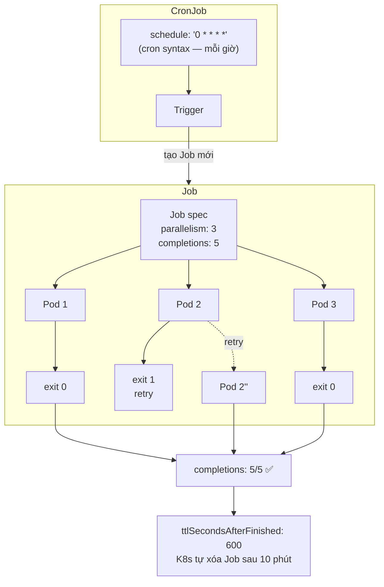
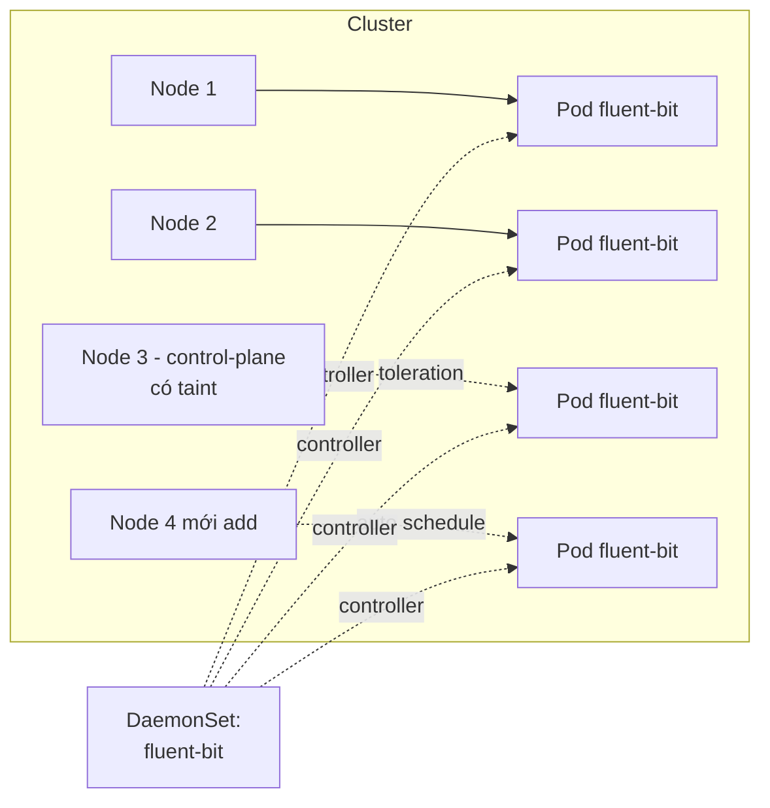
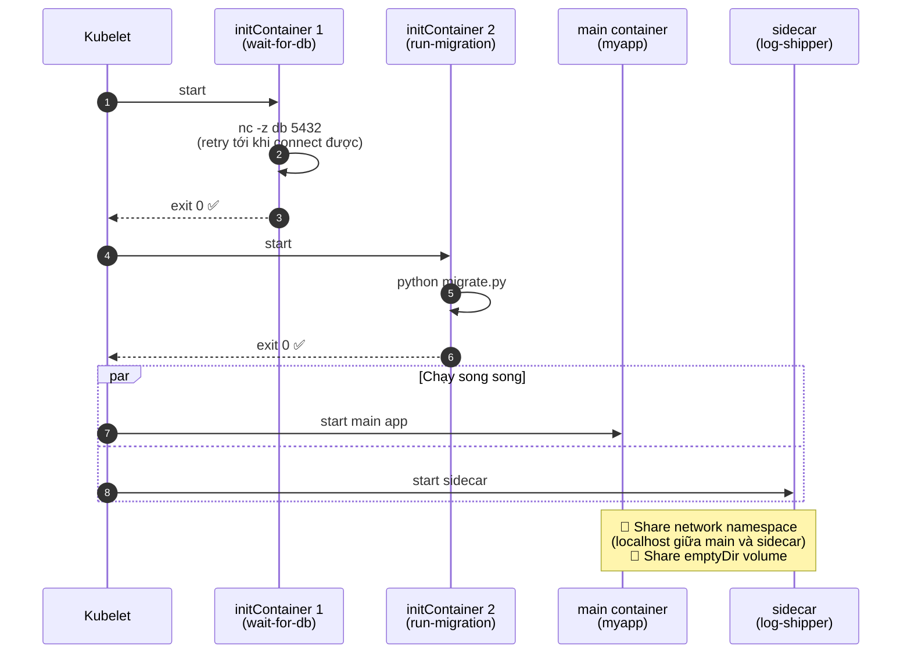
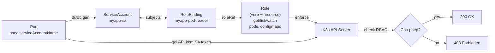
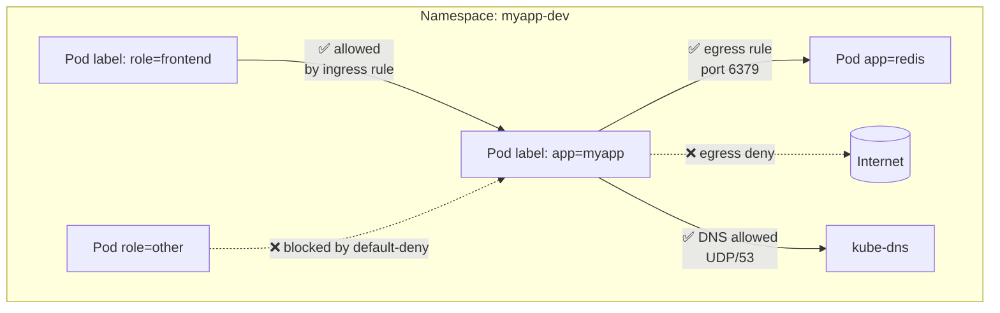
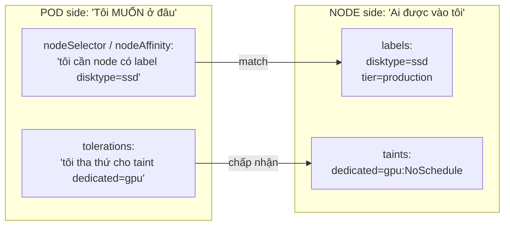
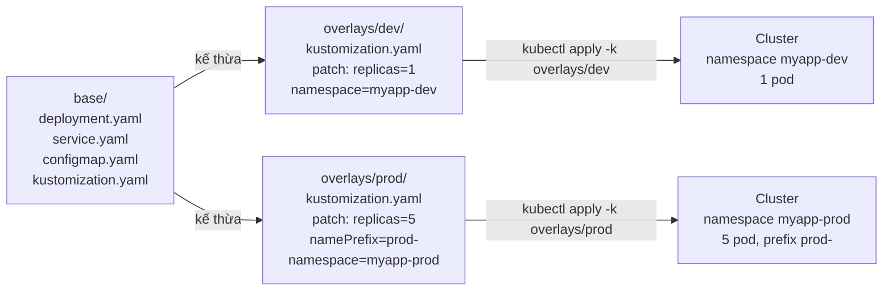

# Kubernetes — Đề thực hành chi tiết (Bài 25–41 + Bonus 56–64)

> **Series:** kubernetes-practice  
> **Author:** Mr.Rom  
> **Điều hướng:** [← Phần trước](../Docker/docker-practice.md) · [Mục lục series](README.md) · [Phần tiếp theo →](../Advanced/advanced-practice.md)

> **Nguyên tắc:** Mỗi bài có **yêu cầu chi tiết**, **kết quả mong đợi** và **checklist**. Chỉ chuyển bài khi đủ tiêu chí hoàn thành — không cần suy đoán thêm bước ngoài đề.


## Điều kiện tiên quyết (toàn phần)

| Yêu cầu | Chi tiết |
|---------|----------|
| Hoàn thành Phần Docker | Đặc biệt **Bài 24**: image `<your-username>/myapp:6.0` đã push lên registry công khai (Docker Hub) |
| Cluster K8s | Minikube, Kind, k3d, hoặc Kubernetes trên Docker Desktop |
| kubectl | `kubectl version --client` OK, kết nối được cluster (`kubectl get nodes`) |
| helm | Cần từ **Bài 40** trở đi (`helm version`) |

Thay `<your-username>` bằng username Docker Hub thật của bạn trong **mọi** manifest YAML.

## Cấu trúc thư mục manifest (khuyến nghị)

```
k8s-myapp/
├── namespaces.yaml
├── pod.yaml
├── deployment.yaml
├── service.yaml
├── configmap.yaml
├── secret.yaml
├── pv.yaml
├── pvc.yaml
├── redis.yaml
├── ingress.yaml
└── helm/
    └── myapp-chart/
```

## Quy ước đọc mỗi bài

Giống phần Docker: làm đủ **Yêu cầu chi tiết** → đối chiếu **Kết quả mong đợi** → tick **Tiêu chí hoàn thành**.

Namespace mặc định sau Bài 26: **`myapp-dev`** (trừ khi bài ghi rõ khác).


---

> **Lưu ý:** Tiếp tục dùng image `myapp:6.0` đã push ở Bài 24. Tất cả bài K8s dưới đây đều xoay quanh app này.

## **Bài 25: Cài đặt K8s và kiểm tra**

**Mục tiêu:** Có cluster để thực hành.

### Điều kiện tiên quyết

Phần Docker xong; máy đủ RAM cho Minikube/Kind (~4GB+).

### Kết quả mong đợi

- `kubectl get nodes` — NODE STATUS `Ready`.
- `kubectl get pods -A` — các pod system Running (có thể vài Pending lúc đầu, đợi 2–5 phút).

### Tiêu chí hoàn thành (checklist)

- [ ] Chọn đúng 1 cách cài (Minikube/Kind/Docker Desktop) và ghi lại trong notes
- [ ] `kubectl cluster-info` không lỗi connection refused

### Lỗi thường gặp

Đọc lại **Lệnh thực hiện** (hoặc khối bash trong **Yêu cầu chi tiết**); `kubectl describe pod <tên> -n myapp-dev` và `kubectl get events -n myapp-dev`.


**Yêu cầu chi tiết:**

1. Chọn 1 trong các option:
   - **Minikube:** `minikube start --driver=docker`
   - **Kind:** `kind create cluster --name myapp-cluster`
   - **Docker Desktop:** Enable Kubernetes trong Settings

2. Kiểm tra:
```bash
kubectl version
kubectl cluster-info
kubectl get nodes
kubectl get pods -A    # Xem system pods
```

3. Cài autocomplete (bash):
```bash
source <(kubectl completion bash)
echo 'alias k=kubectl' >> ~/.bashrc
```

---

## 📌 Lưu ý học viên (đọc trước khi làm bài)

| Bài | Vấn đề thường gặp | Cách xử lý |
|-----|-------------------|------------|
| **Chung** | Quên `-n myapp-dev` | Hầu hết lệnh `kubectl` trong đề cần namespace: thêm `-n myapp-dev` hoặc đã `kubectl config set-context ... --namespace=myapp-dev` (Bài 26 bước 3). |
| **Chung** | Placeholder image | Mọi chỗ `<your-username>/myapp:6.0` thay bằng username Docker Hub **thật** (trùng Bài 24 Docker). |
| **26** | Nhiều tên namespace | Bước 1 tạo `dev`/`staging`/`prod` để **luyện lệnh**; bước 2 tạo `myapp-dev`/`myapp-prod`. **Từ Bài 27 trở đi chỉ dùng `myapp-dev`** (trừ khi đề ghi khác). |
| **27** | `ImagePullBackOff` / `ErrImagePull` | `kubectl describe pod myapp-pod -n myapp-dev` → Events. Thường do sai tên image hoặc repo **private**. |
| **27** | `curl` không được khi port-forward | Port-forward phải **đang chạy** ở terminal 1; test ở terminal 2 cùng máy. |
| **28** | Lệnh thiếu namespace | Dùng `kubectl logs myapp-pod -n myapp-dev` (và tương tự cho exec/describe/cp). |
| **29** | Pod tên ngẫu nhiên | Deployment tạo pod dạng `myapp-deployment-xxxxx` — dùng label: `kubectl get pods -l app=myapp -n myapp-dev` |
| **34** | PVC Pending | `hostPath` trong đề chỉ chắc chắn trên **Minikube / single-node**. Kind/multi-node có thể cần StorageClass khác — hỏi GV nếu PVC không Bind. |
| **37** | HPA không scale | Cần **metrics-server**: `minikube addons enable metrics-server` rồi đợi 1–2 phút. |
| **38** | `myapp.local` không resolve | Thêm IP vào `/etc/hosts`: lấy `minikube ip` hoặc IP Ingress controller, dòng: `<IP> myapp.local` |
| **40** | `helm install` lỗi namespace | Tạo namespace trước: `kubectl create namespace myapp-dev` hoặc `helm install ... --create-namespace` |

**Debug nhanh (K8s):** `kubectl describe pod <tên> -n myapp-dev` · `kubectl logs <tên> -n myapp-dev` · `kubectl get events -n myapp-dev --sort-by='.lastTimestamp'`

---

## **Bài 26: Namespace - Tổ chức tài nguyên**

**Mục tiêu:** Cô lập môi trường dev/staging/prod.

### Điều kiện tiên quyết

Hoàn thành Bài 25.

### Kết quả mong đợi

- Mọi lệnh trong **Lệnh thực hiện** chạy xong không lỗi fatal (exit code 0 hoặc lỗi có giải thích trong đề).
- Trạng thái cuối khớp mô tả trong **Yêu cầu chi tiết** (image/container/pod Running hoặc Exited đúng như đề).

### Tiêu chí hoàn thành (checklist)

- [ ] Đã đọc **Mục tiêu** và hoàn thành mọi bước trong **Yêu cầu chi tiết**
- [ ] Kết quả khớp **Kết quả mong đợi** (hoặc tương đương nếu môi trường khác một chút)
- [ ] Ghi chú lại lệnh đã chạy (để so sánh khi gặp lỗi)
- [ ] (Nếu có) Đã trả lời **Câu hỏi** / **Câu hỏi suy ngẫm** trước khi sang bài tiếp

### Lỗi thường gặp

Đọc lại **Lệnh thực hiện** (hoặc khối bash trong **Yêu cầu chi tiết**); `kubectl describe pod <tên> -n myapp-dev` và `kubectl get events -n myapp-dev`.


**Yêu cầu chi tiết:**

1. Tạo 3 namespace:
```bash
kubectl create namespace dev
kubectl create namespace staging
kubectl create namespace prod
kubectl get ns
```

2. Tạo bằng YAML (cách khuyến khích):
```yaml
# namespaces.yaml
apiVersion: v1
kind: Namespace
metadata:
  name: myapp-dev
---
apiVersion: v1
kind: Namespace
metadata:
  name: myapp-prod
```

```bash
kubectl apply -f namespaces.yaml
```

3. Set default namespace:
```bash
kubectl config set-context --current --namespace=myapp-dev
kubectl config view --minify | grep namespace
```

> **📌 Lưu ý (Bài 26):** Bạn sẽ có cả namespace `dev`/`staging`/`prod` **và** `myapp-dev`/`myapp-prod`. **Từ Bài 27**, mọi manifest dùng namespace **`myapp-dev`** — đừng deploy pod vào `dev` trừ khi đề yêu cầu.


---

## **Bài 27: Pod đầu tiên - Chạy myapp trên K8s**

**Mục tiêu:** Tạo pod chạy chính app đã build ở Docker.

### Điều kiện tiên quyết

Image `<username>/myapp:6.0` pull được từ cluster (`docker pull` trên node hoặc image public).

### Kết quả mong đợi

- `kubectl get pod myapp-pod -n myapp-dev` — STATUS `Running`, READY `1/1`.
- Port-forward + `curl localhost:8080` — response từ Flask (có `K8s App` hoặc nội dung app).

### Tiêu chí hoàn thành (checklist)

- [ ] `pod.yaml` thay `<your-username>` bằng username thật
- [ ] Namespace `myapp-dev` đã tạo
- [ ] Port-forward chạy khi test curl

### Lỗi thường gặp

Đọc lại **Lệnh thực hiện** (hoặc khối bash trong **Yêu cầu chi tiết**); `kubectl describe pod <tên> -n myapp-dev` và `kubectl get events -n myapp-dev`.


**Yêu cầu chi tiết:**

| Bước | Việc bạn phải làm | Chi tiết bắt buộc |
|------|-------------------|-------------------|
| 1 | Tạo file `pod.yaml` | Copy YAML bên dưới; thay **mọi** `<your-username>` bằng username Docker Hub thật |
| 2 | `kubectl apply -f pod.yaml` | Namespace `myapp-dev` phải đã tồn tại (Bài 26) |
| 3 | Kiểm tra pod | `kubectl get pod myapp-pod -n myapp-dev` → `Running`, `1/1` |
| 4 | Port-forward | Terminal 1: `kubectl port-forward pod/myapp-pod 8080:5000 -n myapp-dev` |
| 5 | Test HTTP | Terminal 2: `curl http://localhost:8080` — có response từ Flask |

**File `pod.yaml` (sửa dòng `image` trước khi apply):**
```yaml
apiVersion: v1
kind: Pod
metadata:
  name: myapp-pod
  namespace: myapp-dev
  labels:
    app: myapp
    version: "6.0"
spec:
  containers:
    - name: myapp
      image: <your-username>/myapp:6.0
      imagePullPolicy: IfNotPresent   # local cluster: ưu tiên image local
      ports:
        - containerPort: 5000
      env:
        - name: APP_NAME
          value: "K8s App"
        - name: APP_ENV
          value: "kubernetes"
```

> 💡 **`imagePullPolicy` trên local cluster:**
> - `Always` (mặc định khi tag là `latest` hoặc không có tag): luôn pull từ registry — sẽ fail nếu cluster offline
> - `IfNotPresent` (mặc định khi có tag cụ thể): dùng image local nếu có
> - `Never`: chỉ dùng local, không pull
>
> Với **minikube/kind**, image build trên host KHÔNG có sẵn trong cluster. Phải load thủ công:
> ```bash
> # Minikube:
> minikube image load <your-username>/myapp:6.0
> # Kind:
> kind load docker-image <your-username>/myapp:6.0 --name myapp-cluster
> ```

**Lệnh thực hiện:**
```bash
kubectl apply -f pod.yaml
kubectl get pods -n myapp-dev
kubectl get pods -n myapp-dev -o wide
kubectl describe pod myapp-pod -n myapp-dev

# Terminal 1
kubectl port-forward pod/myapp-pod 8080:5000 -n myapp-dev

# Terminal 2
curl -s http://localhost:8080
curl -s http://localhost:8080/health
```

**Nếu pod `ImagePullBackOff`:** image chưa public hoặc sai tên — `kubectl describe pod` xem Events; sửa `image:` cho đúng repo đã push ở Docker Bài 24.

**Câu hỏi:**
- Pod khác Container thế nào?
- Tại sao app chưa kết nối được Redis? (vì chưa có redis trong cluster)

---

## **Bài 28: Pod Logs, Exec, Describe (Tương tự Docker)**

**Mục tiêu:** Debug pod như đã làm với container.

### Điều kiện tiên quyết

Hoàn thành Bài 27.

### Kết quả mong đợi

- Mọi lệnh trong **Lệnh thực hiện** chạy xong không lỗi fatal (exit code 0 hoặc lỗi có giải thích trong đề).
- Trạng thái cuối khớp mô tả trong **Yêu cầu chi tiết** (image/container/pod Running hoặc Exited đúng như đề).

### Tiêu chí hoàn thành (checklist)

- [ ] Đã đọc **Mục tiêu** và hoàn thành mọi bước trong **Yêu cầu chi tiết**
- [ ] Kết quả khớp **Kết quả mong đợi** (hoặc tương đương nếu môi trường khác một chút)
- [ ] Ghi chú lại lệnh đã chạy (để so sánh khi gặp lỗi)
- [ ] (Nếu có) Đã trả lời **Câu hỏi** / **Câu hỏi suy ngẫm** trước khi sang bài tiếp

### Lỗi thường gặp

Đọc lại **Lệnh thực hiện** (hoặc khối bash trong **Yêu cầu chi tiết**); `kubectl describe pod <tên> -n myapp-dev` và `kubectl get events -n myapp-dev`.


**Yêu cầu chi tiết:**

| Bước | Việc cần làm |
|------|----------------|
| 1 | Xem log pod `myapp-pod` (namespace `myapp-dev`) |
| 2 | Exec vào pod (nếu không có `bash`, dùng `sh`) |
| 3 | `describe` pod và đọc phần Events |
| 4 | Copy file `app.py` từ pod ra host |

**Lệnh thực hiện** (thêm `-n myapp-dev` nếu chưa set default namespace):

```bash
kubectl logs myapp-pod -n myapp-dev
kubectl logs -f myapp-pod -n myapp-dev
kubectl logs --tail=20 myapp-pod -n myapp-dev

kubectl exec -it myapp-pod -n myapp-dev -- /bin/bash
# hoặc: kubectl exec -it myapp-pod -n myapp-dev -- sh

kubectl describe pod myapp-pod -n myapp-dev

kubectl cp myapp-dev/myapp-pod:/app/app.py ./pod-app.py
ls -la ./pod-app.py
```

**So sánh:**

| Docker | Kubernetes |
|--------|-----------|
| `docker logs` | `kubectl logs` |
| `docker exec` | `kubectl exec` |
| `docker inspect` | `kubectl describe` |
| `docker cp` | `kubectl cp` |
| `docker ps` | `kubectl get pods` |

---

## **Bài 29: Deployment - Quản lý nhiều pod**

**Mục tiêu:** Tự động tạo, scale, update pod.

### Điều kiện tiên quyết

Hoàn thành Bài 28.

### Kết quả mong đợi

- Mọi lệnh trong **Lệnh thực hiện** chạy xong không lỗi fatal (exit code 0 hoặc lỗi có giải thích trong đề).
- Trạng thái cuối khớp mô tả trong **Yêu cầu chi tiết** (image/container/pod Running hoặc Exited đúng như đề).

### Tiêu chí hoàn thành (checklist)

- [ ] Đã đọc **Mục tiêu** và hoàn thành mọi bước trong **Yêu cầu chi tiết**
- [ ] Kết quả khớp **Kết quả mong đợi** (hoặc tương đương nếu môi trường khác một chút)
- [ ] Ghi chú lại lệnh đã chạy (để so sánh khi gặp lỗi)
- [ ] (Nếu có) Đã trả lời **Câu hỏi** / **Câu hỏi suy ngẫm** trước khi sang bài tiếp

### Lỗi thường gặp

Đọc lại **Lệnh thực hiện** (hoặc khối bash trong **Yêu cầu chi tiết**); `kubectl describe pod <tên> -n myapp-dev` và `kubectl get events -n myapp-dev`.


**Yêu cầu chi tiết:**

1. Xóa pod cũ:
```bash
kubectl delete pod myapp-pod
```

2. Tạo `deployment.yaml`:
```yaml
apiVersion: apps/v1
kind: Deployment
metadata:
  name: myapp-deployment
  namespace: myapp-dev
spec:
  replicas: 3
  selector:
    matchLabels:
      app: myapp
  template:
    metadata:
      labels:
        app: myapp
    spec:
      containers:
        - name: myapp
          image: <your-username>/myapp:6.0
          ports:
            - containerPort: 5000
          env:
            - name: APP_ENV
              value: "kubernetes"
          resources:
            requests:
              memory: "64Mi"
              cpu: "100m"
            limits:
              memory: "128Mi"
              cpu: "200m"
```

3. Apply và quan sát:
```bash
kubectl apply -f deployment.yaml
kubectl get deployments
kubectl get replicasets
kubectl get pods    # Có 3 pod
```

4. Test self-healing - xóa 1 pod:
```bash
kubectl delete pod <pod-name>
kubectl get pods    # Pod mới tự được tạo!
```

5. Scale:
```bash
kubectl scale deployment myapp-deployment --replicas=5
kubectl get pods
```

---

## **Bài 30: Service - Expose Deployment**

**Mục tiêu:** Cho phép truy cập app từ ngoài và load balance giữa các pod.

### Điều kiện tiên quyết

Hoàn thành Bài 29.

### Kết quả mong đợi

- Mọi lệnh trong **Lệnh thực hiện** chạy xong không lỗi fatal (exit code 0 hoặc lỗi có giải thích trong đề).
- Trạng thái cuối khớp mô tả trong **Yêu cầu chi tiết** (image/container/pod Running hoặc Exited đúng như đề).

### Tiêu chí hoàn thành (checklist)

- [ ] Đã đọc **Mục tiêu** và hoàn thành mọi bước trong **Yêu cầu chi tiết**
- [ ] Kết quả khớp **Kết quả mong đợi** (hoặc tương đương nếu môi trường khác một chút)
- [ ] Ghi chú lại lệnh đã chạy (để so sánh khi gặp lỗi)
- [ ] (Nếu có) Đã trả lời **Câu hỏi** / **Câu hỏi suy ngẫm** trước khi sang bài tiếp

### Lỗi thường gặp

Đọc lại **Lệnh thực hiện** (hoặc khối bash trong **Yêu cầu chi tiết**); `kubectl describe pod <tên> -n myapp-dev` và `kubectl get events -n myapp-dev`.


**Yêu cầu chi tiết:**

1. Tạo `service.yaml`:
```yaml
apiVersion: v1
kind: Service
metadata:
  name: myapp-service
  namespace: myapp-dev
spec:
  type: NodePort
  selector:
    app: myapp
  ports:
    - port: 80
      targetPort: 5000
      nodePort: 30080
```

2. Apply:
```bash
kubectl apply -f service.yaml
kubectl get services
```

3. Truy cập:
```bash
# Với Minikube:
minikube service myapp-service -n myapp-dev --url
# Hoặc port-forward:
kubectl port-forward service/myapp-service 8080:80
curl http://localhost:8080
```

4. Test load balancing - gọi nhiều lần, kết hợp với log:
```bash
for i in {1..10}; do curl http://localhost:8080; echo; done
kubectl logs -l app=myapp --tail=20
```

**Câu hỏi:**
- Sự khác nhau: ClusterIP, NodePort, LoadBalancer?
- `selector` trong Service hoạt động thế nào với `labels` của Pod?

---

## **Bài 31: Rolling Update & Rollback**

**Mục tiêu:** Cập nhật app không downtime.

### Điều kiện tiên quyết

Hoàn thành Bài 30.

### Kết quả mong đợi

- Mọi lệnh trong **Lệnh thực hiện** chạy xong không lỗi fatal (exit code 0 hoặc lỗi có giải thích trong đề).
- Trạng thái cuối khớp mô tả trong **Yêu cầu chi tiết** (image/container/pod Running hoặc Exited đúng như đề).

### Tiêu chí hoàn thành (checklist)

- [ ] Đã đọc **Mục tiêu** và hoàn thành mọi bước trong **Yêu cầu chi tiết**
- [ ] Kết quả khớp **Kết quả mong đợi** (hoặc tương đương nếu môi trường khác một chút)
- [ ] Ghi chú lại lệnh đã chạy (để so sánh khi gặp lỗi)
- [ ] (Nếu có) Đã trả lời **Câu hỏi** / **Câu hỏi suy ngẫm** trước khi sang bài tiếp

### Lỗi thường gặp

Đọc lại **Lệnh thực hiện** (hoặc khối bash trong **Yêu cầu chi tiết**); `kubectl describe pod <tên> -n myapp-dev` và `kubectl get events -n myapp-dev`.


**Yêu cầu chi tiết:**

1. Sửa code app thành version 7.0, build và push image mới:
```bash
docker build -t <your-username>/myapp:7.0 .
docker push <your-username>/myapp:7.0
```

2. Update deployment:
```bash
kubectl set image deployment/myapp-deployment myapp=<your-username>/myapp:7.0
```

3. Quan sát rolling update:
```bash
kubectl rollout status deployment/myapp-deployment
kubectl get pods -w
```

4. Xem lịch sử:
```bash
kubectl rollout history deployment/myapp-deployment
```

5. Rollback:
```bash
kubectl rollout undo deployment/myapp-deployment
kubectl rollout undo deployment/myapp-deployment --to-revision=1
```

---

## **Bài 32: ConfigMap - Cấu hình bên ngoài**

**Mục tiêu:** Tách config khỏi image (giống env trong Docker nhưng quản lý tập trung).

### Điều kiện tiên quyết

Hoàn thành Bài 31.

### Kết quả mong đợi

- Mọi lệnh trong **Lệnh thực hiện** chạy xong không lỗi fatal (exit code 0 hoặc lỗi có giải thích trong đề).
- Trạng thái cuối khớp mô tả trong **Yêu cầu chi tiết** (image/container/pod Running hoặc Exited đúng như đề).

### Tiêu chí hoàn thành (checklist)

- [ ] Đã đọc **Mục tiêu** và hoàn thành mọi bước trong **Yêu cầu chi tiết**
- [ ] Kết quả khớp **Kết quả mong đợi** (hoặc tương đương nếu môi trường khác một chút)
- [ ] Ghi chú lại lệnh đã chạy (để so sánh khi gặp lỗi)
- [ ] (Nếu có) Đã trả lời **Câu hỏi** / **Câu hỏi suy ngẫm** trước khi sang bài tiếp

### Lỗi thường gặp

Đọc lại **Lệnh thực hiện** (hoặc khối bash trong **Yêu cầu chi tiết**); `kubectl describe pod <tên> -n myapp-dev` và `kubectl get events -n myapp-dev`.


**Yêu cầu chi tiết:**

1. Tạo `configmap.yaml`:
```yaml
apiVersion: v1
kind: ConfigMap
metadata:
  name: myapp-config
  namespace: myapp-dev
data:
  APP_NAME: "MyApp on K8s"
  APP_ENV: "production"
  APP_VERSION: "7.0"
  LOG_LEVEL: "INFO"
```

2. Apply:
```bash
kubectl apply -f configmap.yaml
kubectl get configmaps
kubectl describe configmap myapp-config
```

3. Cập nhật Deployment dùng ConfigMap:
```yaml
# Trong deployment.yaml, thay phần env:
        env:
          - name: APP_NAME
            valueFrom:
              configMapKeyRef:
                name: myapp-config
                key: APP_NAME
          - name: APP_ENV
            valueFrom:
              configMapKeyRef:
                name: myapp-config
                key: APP_ENV

# HOẶC load toàn bộ:
        envFrom:
          - configMapRef:
              name: myapp-config
```

4. Apply lại deployment và verify:
```bash
kubectl apply -f deployment.yaml
kubectl rollout restart deployment/myapp-deployment
kubectl exec -it <pod-name> -- env | grep APP_
```

---

## **Bài 33: Secret - Lưu trữ thông tin nhạy cảm**

**Mục tiêu:** Quản lý password, API key an toàn.

> ⚠️ **CẢNH BÁO QUAN TRỌNG:** Secret trong K8s **CHỈ ĐƯỢC ENCODE bằng base64** (decode 1 phát ra plaintext) — **KHÔNG PHẢI ENCRYPT**. Bất kỳ ai có quyền `get secret` đều đọc được nội dung. Production thật phải dùng **encryption at rest** (etcd encryption), **External Secrets Operator + Vault/AWS Secrets Manager**, hoặc **Sealed Secrets** — sẽ học ở **Bài 68**.

### Điều kiện tiên quyết

Hoàn thành Bài 32.

### Kết quả mong đợi

- Mọi lệnh trong **Lệnh thực hiện** chạy xong không lỗi fatal (exit code 0 hoặc lỗi có giải thích trong đề).
- Trạng thái cuối khớp mô tả trong **Yêu cầu chi tiết** (image/container/pod Running hoặc Exited đúng như đề).

### Tiêu chí hoàn thành (checklist)

- [ ] Đã đọc **Mục tiêu** và hoàn thành mọi bước trong **Yêu cầu chi tiết**
- [ ] Kết quả khớp **Kết quả mong đợi** (hoặc tương đương nếu môi trường khác một chút)
- [ ] Ghi chú lại lệnh đã chạy (để so sánh khi gặp lỗi)
- [ ] (Nếu có) Đã trả lời **Câu hỏi** / **Câu hỏi suy ngẫm** trước khi sang bài tiếp

### Lỗi thường gặp

Đọc lại **Lệnh thực hiện** (hoặc khối bash trong **Yêu cầu chi tiết**); `kubectl describe pod <tên> -n myapp-dev` và `kubectl get events -n myapp-dev`.


**Yêu cầu chi tiết:**

1. Tạo secret bằng lệnh (cách nhanh, dev hay dùng):
```bash
kubectl create secret generic myapp-secret \
  --from-literal=DB_PASSWORD=supersecret123 \
  --from-literal=API_KEY=abc-xyz-789
```

2. Hoặc bằng YAML — **cách 1:** dùng `stringData` (khuyến nghị, không cần base64 thủ công):
```yaml
apiVersion: v1
kind: Secret
metadata:
  name: myapp-secret
type: Opaque
stringData:
  DB_PASSWORD: supersecret123
  API_KEY: abc-xyz-789
```

3. Hoặc YAML — **cách 2:** dùng `data` (phải tự base64):
```bash
echo -n "supersecret123" | base64
# c3VwZXJzZWNyZXQxMjM=
```

```yaml
apiVersion: v1
kind: Secret
metadata:
  name: myapp-secret
type: Opaque
data:
  DB_PASSWORD: c3VwZXJzZWNyZXQxMjM=
  API_KEY: YWJjLXh5ei03ODk=
```

> 💡 **`stringData` vs `data`:** Khi apply, K8s tự convert `stringData` → `data` (base64). Khi `kubectl get -o yaml` chỉ thấy `data:`. Dùng `stringData` cho dễ đọc khi viết tay, dùng `data` khi nhận output từ tool.

4. Sử dụng trong Deployment:
```yaml
        env:
          - name: DB_PASSWORD
            valueFrom:
              secretKeyRef:
                name: myapp-secret
                key: DB_PASSWORD
```

5. Verify:
```bash
kubectl get secrets
kubectl describe secret myapp-secret               # không lộ value
kubectl get secret myapp-secret -o yaml            # thấy data base64
kubectl get secret myapp-secret -o jsonpath='{.data.DB_PASSWORD}' | base64 -d   # decode
```

**Câu hỏi:**
- Tại sao `kubectl describe` ẩn value mà `kubectl get -o yaml` lại để lộ?
- Nếu push file Secret YAML lên Git (public), hậu quả ra sao? Cách an toàn?

---

## **Bài 34: PersistentVolume & PersistentVolumeClaim**

**Mục tiêu:** Lưu trữ dữ liệu bền vững (giống Volume trong Docker).

> ⚠️ **`hostPath` chỉ chạy trên single-node cluster** (minikube, kind, docker-desktop). Trên cluster thật nhiều node, pod có thể bị schedule sang node khác → data biến mất. Production phải dùng **StorageClass + Dynamic Provisioning** (EBS/GCEPD/Azure Disk/Ceph/Longhorn...). Học sâu ở **Bài 63 (Bonus)**.

### Điều kiện tiên quyết

Hoàn thành Bài 33.

### Kết quả mong đợi

- Mọi lệnh trong **Lệnh thực hiện** chạy xong không lỗi fatal (exit code 0 hoặc lỗi có giải thích trong đề).
- Trạng thái cuối khớp mô tả trong **Yêu cầu chi tiết** (image/container/pod Running hoặc Exited đúng như đề).

### Tiêu chí hoàn thành (checklist)

- [ ] Đã đọc **Mục tiêu** và hoàn thành mọi bước trong **Yêu cầu chi tiết**
- [ ] Kết quả khớp **Kết quả mong đợi** (hoặc tương đương nếu môi trường khác một chút)
- [ ] Ghi chú lại lệnh đã chạy (để so sánh khi gặp lỗi)
- [ ] (Nếu có) Đã trả lời **Câu hỏi** / **Câu hỏi suy ngẫm** trước khi sang bài tiếp

### Lỗi thường gặp

Đọc lại **Lệnh thực hiện** (hoặc khối bash trong **Yêu cầu chi tiết**); `kubectl describe pod <tên> -n myapp-dev` và `kubectl get events -n myapp-dev`.


**Yêu cầu chi tiết:**

1. Tạo PV:
```yaml
# pv.yaml
apiVersion: v1
kind: PersistentVolume
metadata:
  name: myapp-pv
spec:
  capacity:
    storage: 1Gi
  accessModes:
    - ReadWriteOnce
  hostPath:
    path: /tmp/myapp-data
```

2. Tạo PVC:
```yaml
# pvc.yaml
apiVersion: v1
kind: PersistentVolumeClaim
metadata:
  name: myapp-pvc
  namespace: myapp-dev
spec:
  accessModes:
    - ReadWriteOnce
  resources:
    requests:
      storage: 500Mi
```

3. Mount vào pod (sửa deployment):
```yaml
      containers:
        - name: myapp
          # ...
          volumeMounts:
            - name: logs
              mountPath: /app/logs
      volumes:
        - name: logs
          persistentVolumeClaim:
            claimName: myapp-pvc
```

4. Test:
```bash
kubectl apply -f pv.yaml -f pvc.yaml
kubectl apply -f deployment.yaml
kubectl get pv,pvc
```

---

## **Bài 35: Redis trong K8s + App kết nối**

**Mục tiêu:** Hoàn thiện multi-tier app trên K8s (giống Bài 21 nhưng trên K8s).

### Điều kiện tiên quyết

Hoàn thành Bài 34.

### Kết quả mong đợi

- Mọi lệnh trong **Lệnh thực hiện** chạy xong không lỗi fatal (exit code 0 hoặc lỗi có giải thích trong đề).
- Trạng thái cuối khớp mô tả trong **Yêu cầu chi tiết** (image/container/pod Running hoặc Exited đúng như đề).

### Tiêu chí hoàn thành (checklist)

- [ ] Đã đọc **Mục tiêu** và hoàn thành mọi bước trong **Yêu cầu chi tiết**
- [ ] Kết quả khớp **Kết quả mong đợi** (hoặc tương đương nếu môi trường khác một chút)
- [ ] Ghi chú lại lệnh đã chạy (để so sánh khi gặp lỗi)
- [ ] (Nếu có) Đã trả lời **Câu hỏi** / **Câu hỏi suy ngẫm** trước khi sang bài tiếp

### Lỗi thường gặp

Đọc lại **Lệnh thực hiện** (hoặc khối bash trong **Yêu cầu chi tiết**); `kubectl describe pod <tên> -n myapp-dev` và `kubectl get events -n myapp-dev`.


**Yêu cầu chi tiết:**

1. Tạo Redis deployment + service:
```yaml
# redis.yaml
apiVersion: apps/v1
kind: Deployment
metadata:
  name: redis
  namespace: myapp-dev
spec:
  replicas: 1
  selector:
    matchLabels:
      app: redis
  template:
    metadata:
      labels:
        app: redis
    spec:
      containers:
        - name: redis
          image: redis:alpine
          ports:
            - containerPort: 6379
---
apiVersion: v1
kind: Service
metadata:
  name: redis
  namespace: myapp-dev
spec:
  selector:
    app: redis
  ports:
    - port: 6379
      targetPort: 6379
```

2. App tự động kết nối Redis qua DNS `redis.myapp-dev.svc.cluster.local` (hoặc gọn `redis`)

3. Apply và test:
```bash
kubectl apply -f redis.yaml
kubectl port-forward service/myapp-service 8080:80
for i in {1..5}; do curl http://localhost:8080; echo; done
```

---

## **Bài 36: Liveness, Readiness & Startup Probes**

**Mục tiêu:** Đảm bảo K8s biết khi nào pod khỏe / sẵn sàng / hoàn tất khởi động.

**3 loại probe — phân biệt rõ:**

| Probe | Thất bại → K8s làm gì? | Khi nào dùng |
|-------|-----------------------|--------------|
| **Liveness** | **Restart container** | App treo/deadlock, cần đá ra để cứu |
| **Readiness** | **Tạm gỡ pod khỏi Service endpoints** (không restart) | App tạm thời busy/loading config, không nhận traffic |
| **Startup** | **Restart container** (như liveness, nhưng chỉ áp dụng ở giai đoạn khởi động) | App khởi động chậm (Java/JVM warmup, load model AI...) — tránh liveness kill pod trước khi app kịp ready |

### Điều kiện tiên quyết

Hoàn thành Bài 35.

### Kết quả mong đợi

- Mọi lệnh trong **Lệnh thực hiện** chạy xong không lỗi fatal (exit code 0 hoặc lỗi có giải thích trong đề).
- Trạng thái cuối khớp mô tả trong **Yêu cầu chi tiết** (image/container/pod Running hoặc Exited đúng như đề).

### Tiêu chí hoàn thành (checklist)

- [ ] Đã đọc **Mục tiêu** và hoàn thành mọi bước trong **Yêu cầu chi tiết**
- [ ] Kết quả khớp **Kết quả mong đợi** (hoặc tương đương nếu môi trường khác một chút)
- [ ] Ghi chú lại lệnh đã chạy (để so sánh khi gặp lỗi)
- [ ] (Nếu có) Đã trả lời **Câu hỏi** / **Câu hỏi suy ngẫm** trước khi sang bài tiếp

### Lỗi thường gặp

Đọc lại **Lệnh thực hiện** (hoặc khối bash trong **Yêu cầu chi tiết**); `kubectl describe pod <tên> -n myapp-dev` và `kubectl get events -n myapp-dev`.


**Yêu cầu chi tiết:**

1. Thêm vào deployment — bộ đầy đủ:
```yaml
        # Startup: cho app tối đa 30 lần × 5s = 150s để khởi động
        startupProbe:
          httpGet:
            path: /health
            port: 5000
          failureThreshold: 30
          periodSeconds: 5
        # Liveness: chỉ chạy SAU KHI startup pass
        livenessProbe:
          httpGet:
            path: /health
            port: 5000
          periodSeconds: 10
          failureThreshold: 3
        # Readiness: kiểm tra liên tục để decide có route traffic không
        readinessProbe:
          httpGet:
            path: /health
            port: 5000
          periodSeconds: 5
          failureThreshold: 2
```

> 💡 **Thứ tự kích hoạt:** `startupProbe` chạy trước. Khi nó **pass lần đầu**, K8s mới bắt đầu chạy `livenessProbe` và `readinessProbe`. Đây là cách an toàn để app khởi động chậm không bị kill oan.

2. Test các kịch bản:
   - **a.** App khỏe → tất cả pass, pod `Ready 1/1`
   - **b.** App fail `/health` → liveness fail → pod bị restart, `RESTARTS` tăng
   - **c.** App tạm thời 503 trên `/health` (giả lập) → readiness fail → pod biến khỏi `Endpoints` của Service, nhưng KHÔNG restart
   - **d.** App khởi động chậm 60s mà liveness `initialDelaySeconds: 10` → bị kill lặp vô hạn ⇒ minh chứng cần `startupProbe`

3. Probe có nhiều kiểu (chọn đúng theo app):
```yaml
# HTTP (web app)
httpGet:
  path: /health
  port: 5000

# TCP socket (DB, queue)
tcpSocket:
  port: 6379

# Exec command (script tự kiểm tra)
exec:
  command: ["sh", "-c", "pg_isready -U admin"]

# gRPC (K8s 1.24+)
grpc:
  port: 9000
```

**Câu hỏi:**
- Tại sao readiness fail KHÔNG restart pod?
- Đặt `livenessProbe` mà KHÔNG có `readinessProbe` thì hậu quả gì khi rolling update?

---

## **Bài 37: HPA - Auto Scaling**

**Mục tiêu:** Pod tự scale theo CPU/RAM (và custom metrics nếu cần).

> 📌 **HPA cần `resources.requests` trong Deployment** để tính %CPU. Không có `requests` → metrics-server không tính được tỉ lệ → HPA vĩnh viễn không scale.

### Điều kiện tiên quyết

Hoàn thành Bài 36.

### Kết quả mong đợi

- Mọi lệnh trong **Lệnh thực hiện** chạy xong không lỗi fatal (exit code 0 hoặc lỗi có giải thích trong đề).
- Trạng thái cuối khớp mô tả trong **Yêu cầu chi tiết** (image/container/pod Running hoặc Exited đúng như đề).

### Tiêu chí hoàn thành (checklist)

- [ ] Đã đọc **Mục tiêu** và hoàn thành mọi bước trong **Yêu cầu chi tiết**
- [ ] Kết quả khớp **Kết quả mong đợi** (hoặc tương đương nếu môi trường khác một chút)
- [ ] Ghi chú lại lệnh đã chạy (để so sánh khi gặp lỗi)
- [ ] (Nếu có) Đã trả lời **Câu hỏi** / **Câu hỏi suy ngẫm** trước khi sang bài tiếp

### Lỗi thường gặp

Đọc lại **Lệnh thực hiện** (hoặc khối bash trong **Yêu cầu chi tiết**); `kubectl describe pod <tên> -n myapp-dev` và `kubectl get events -n myapp-dev`.


**Yêu cầu chi tiết:**

1. Cài metrics-server (nếu chưa có):
```bash
# Minikube:
minikube addons enable metrics-server
# Kind/khác — cài thủ công:
kubectl apply -f https://github.com/kubernetes-sigs/metrics-server/releases/latest/download/components.yaml
# Verify:
kubectl top nodes
kubectl top pods -n myapp-dev
```

2. Cách nhanh (tạo HPA `autoscaling/v1` — chỉ hỗ trợ CPU):
```bash
kubectl autoscale deployment myapp-deployment \
  --cpu-percent=50 --min=2 --max=10 -n myapp-dev
```

3. **Khuyến nghị: dùng `autoscaling/v2` YAML** — hỗ trợ multi-metric (CPU + Memory + Custom) và tùy chỉnh `behavior` (chống flapping):
```yaml
# hpa.yaml
apiVersion: autoscaling/v2
kind: HorizontalPodAutoscaler
metadata:
  name: myapp-hpa
  namespace: myapp-dev
spec:
  scaleTargetRef:
    apiVersion: apps/v1
    kind: Deployment
    name: myapp-deployment
  minReplicas: 2
  maxReplicas: 10
  metrics:
    - type: Resource
      resource:
        name: cpu
        target:
          type: Utilization
          averageUtilization: 50
    - type: Resource
      resource:
        name: memory
        target:
          type: Utilization
          averageUtilization: 70
  behavior:
    scaleUp:
      stabilizationWindowSeconds: 60     # chờ 60s trước khi quyết định scale up
      policies:
        - type: Percent
          value: 100                     # tối đa nhân đôi
          periodSeconds: 30
    scaleDown:
      stabilizationWindowSeconds: 300    # cẩn thận hơn khi scale down (5 phút)
      policies:
        - type: Percent
          value: 50
          periodSeconds: 60
```

```bash
kubectl apply -f hpa.yaml
kubectl get hpa -n myapp-dev
kubectl describe hpa myapp-hpa -n myapp-dev
```

4. Tạo tải bằng tool:
```bash
kubectl run load-gen --image=busybox:1.36 -n myapp-dev -it --rm -- /bin/sh
# Trong shell:
while true; do wget -q -O- http://myapp-service.myapp-dev; done
```

5. Quan sát (mở terminal khác):
```bash
kubectl get hpa -n myapp-dev -w
kubectl top pods -n myapp-dev
kubectl get pods -n myapp-dev
```

**Câu hỏi:**
- Nếu Deployment KHÔNG có `resources.requests.cpu`, HPA hiển thị `<unknown>` — tại sao?
- `stabilizationWindowSeconds` giúp gì? Đặt 0 sẽ ra sao?
- HPA scale theo RPS thì làm thế nào? (gợi ý: custom metrics adapter + Prometheus — Bài 66)

---

## **Bài 38: Ingress - Routing HTTP từ ngoài**

**Mục tiêu:** Cấu hình URL/host routing.

### Điều kiện tiên quyết

Hoàn thành Bài 37.

### Kết quả mong đợi

- Mọi lệnh trong **Lệnh thực hiện** chạy xong không lỗi fatal (exit code 0 hoặc lỗi có giải thích trong đề).
- Trạng thái cuối khớp mô tả trong **Yêu cầu chi tiết** (image/container/pod Running hoặc Exited đúng như đề).

### Tiêu chí hoàn thành (checklist)

- [ ] Đã đọc **Mục tiêu** và hoàn thành mọi bước trong **Yêu cầu chi tiết**
- [ ] Kết quả khớp **Kết quả mong đợi** (hoặc tương đương nếu môi trường khác một chút)
- [ ] Ghi chú lại lệnh đã chạy (để so sánh khi gặp lỗi)
- [ ] (Nếu có) Đã trả lời **Câu hỏi** / **Câu hỏi suy ngẫm** trước khi sang bài tiếp

### Lỗi thường gặp

Đọc lại **Lệnh thực hiện** (hoặc khối bash trong **Yêu cầu chi tiết**); `kubectl describe pod <tên> -n myapp-dev` và `kubectl get events -n myapp-dev`.


**Yêu cầu chi tiết:**

1. Enable Ingress controller:
```bash
minikube addons enable ingress
```

2. Tạo Ingress:
```yaml
apiVersion: networking.k8s.io/v1
kind: Ingress
metadata:
  name: myapp-ingress
  namespace: myapp-dev
spec:
  rules:
    - host: myapp.local
      http:
        paths:
          - path: /
            pathType: Prefix
            backend:
              service:
                name: myapp-service
                port:
                  number: 80
```

3. Thêm vào `/etc/hosts`:
```
<minikube-ip> myapp.local
```

4. Test:
```bash
curl http://myapp.local
```

---

## **Bài 39: StatefulSet - Database Cluster**

**Mục tiêu:** Triển khai database với identity ổn định.

### Điều kiện tiên quyết

Hoàn thành Bài 38.

### Kết quả mong đợi

- Mọi lệnh trong **Lệnh thực hiện** chạy xong không lỗi fatal (exit code 0 hoặc lỗi có giải thích trong đề).
- Trạng thái cuối khớp mô tả trong **Yêu cầu chi tiết** (image/container/pod Running hoặc Exited đúng như đề).

### Tiêu chí hoàn thành (checklist)

- [ ] Đã đọc **Mục tiêu** và hoàn thành mọi bước trong **Yêu cầu chi tiết**
- [ ] Kết quả khớp **Kết quả mong đợi** (hoặc tương đương nếu môi trường khác một chút)
- [ ] Ghi chú lại lệnh đã chạy (để so sánh khi gặp lỗi)
- [ ] (Nếu có) Đã trả lời **Câu hỏi** / **Câu hỏi suy ngẫm** trước khi sang bài tiếp

### Lỗi thường gặp

Đọc lại **Lệnh thực hiện** (hoặc khối bash trong **Yêu cầu chi tiết**); `kubectl describe pod <tên> -n myapp-dev` và `kubectl get events -n myapp-dev`.


**Yêu cầu chi tiết:**

1. Tạo Headless Service:
```yaml
apiVersion: v1
kind: Service
metadata:
  name: redis-headless
  namespace: myapp-dev
spec:
  clusterIP: None
  selector:
    app: redis-cluster
  ports:
    - port: 6379
```

2. Tạo StatefulSet:
```yaml
apiVersion: apps/v1
kind: StatefulSet
metadata:
  name: redis-cluster
  namespace: myapp-dev
spec:
  serviceName: redis-headless
  replicas: 3
  selector:
    matchLabels:
      app: redis-cluster
  template:
    metadata:
      labels:
        app: redis-cluster
    spec:
      containers:
        - name: redis
          image: redis:alpine
          ports:
            - containerPort: 6379
          volumeMounts:
            - name: data
              mountPath: /data
  volumeClaimTemplates:
    - metadata:
        name: data
      spec:
        accessModes: ["ReadWriteOnce"]
        resources:
          requests:
            storage: 100Mi
```

3. Apply và verify:
```bash
kubectl apply -f redis-statefulset.yaml
kubectl get statefulsets
kubectl get pods   # Tên có thứ tự: redis-cluster-0, -1, -2
kubectl get pvc    # Mỗi pod có PVC riêng
```

**Câu hỏi:**
- StatefulSet khác Deployment ở điểm nào?
- Tại sao cần Headless Service?

---

## **Bài 40: Helm - Đóng gói toàn bộ app**

**Mục tiêu:** Quản lý ứng dụng K8s như package.

### Điều kiện tiên quyết

Hoàn thành Bài 39.

### Kết quả mong đợi

- Mọi lệnh trong **Lệnh thực hiện** chạy xong không lỗi fatal (exit code 0 hoặc lỗi có giải thích trong đề).
- Trạng thái cuối khớp mô tả trong **Yêu cầu chi tiết** (image/container/pod Running hoặc Exited đúng như đề).

### Tiêu chí hoàn thành (checklist)

- [ ] Đã đọc **Mục tiêu** và hoàn thành mọi bước trong **Yêu cầu chi tiết**
- [ ] Kết quả khớp **Kết quả mong đợi** (hoặc tương đương nếu môi trường khác một chút)
- [ ] Ghi chú lại lệnh đã chạy (để so sánh khi gặp lỗi)
- [ ] (Nếu có) Đã trả lời **Câu hỏi** / **Câu hỏi suy ngẫm** trước khi sang bài tiếp

### Lỗi thường gặp

Đọc lại **Lệnh thực hiện** (hoặc khối bash trong **Yêu cầu chi tiết**); `kubectl describe pod <tên> -n myapp-dev` và `kubectl get events -n myapp-dev`.


**Yêu cầu chi tiết:**

1. Cài Helm:
```bash
curl https://raw.githubusercontent.com/helm/helm/main/scripts/get-helm-3 | bash
```

2. Tạo chart cho myapp:
```bash
helm create myapp-chart
```

3. Tùy chỉnh `values.yaml`:
```yaml
replicaCount: 3
image:
  repository: <your-username>/myapp
  tag: "7.0"
service:
  type: NodePort
  port: 80
ingress:
  enabled: true
  host: myapp.local
```

4. Install/Upgrade/Rollback:
```bash
helm install myapp ./myapp-chart -n myapp-dev
helm upgrade myapp ./myapp-chart -n myapp-dev --set replicaCount=5
helm rollback myapp 1 -n myapp-dev
helm uninstall myapp -n myapp-dev
```

---

## **Bài 41: Dự án tổng hợp - Triển khai Full Stack**

**Mục tiêu:** Tổng hợp tất cả kiến thức.

> 🔴 **Prerequisites — đọc trước phần "Yêu cầu NÂNG CAO":**
> - **Bonus 56** Job/CronJob (cho migration tự động)
> - **Bonus 58** Init Container + Sidecar
> - **Bonus 59** RBAC + ServiceAccount (yêu cầu "ServiceAccount + RBAC riêng")
> - **Bonus 60** NetworkPolicy (yêu cầu "hạn chế giao tiếp")
> - **Bonus 66** Prometheus + Grafana (yêu cầu "Monitoring")
>
> Phần **Yêu cầu bắt buộc** (10 mục đầu) chỉ dùng kiến thức 25-40 — KHÔNG cần Bonus. Xem [`../LEARNING-PATH.md`](../LEARNING-PATH.md) cho Track B nếu muốn re-order.

### Điều kiện tiên quyết

Bài 25–40; Helm đã cài.

### Kết quả mong đợi

- Ingress trả frontend tại `/` và API tại `/api`.
- HPA, probes, ConfigMap/Secret có trong manifest hoặc Helm chart.

### Tiêu chí hoàn thành (checklist)

- [ ] Đủ 10 mục bắt buộc trong đề bài
- [ ] `helm install` hoặc `kubectl apply -k` chạy không lỗi
- [ ] Ghi README ngắn cách deploy trong repo

### Lỗi thường gặp

Đọc lại **Lệnh thực hiện** (hoặc khối bash trong **Yêu cầu chi tiết**); `kubectl describe pod <tên> -n myapp-dev` và `kubectl get events -n myapp-dev`.


**Yêu cầu chi tiết (đề bài):** Triển khai hoàn chỉnh hệ thống `myapp` lên K8s với:

✅ **Yêu cầu bắt buộc:**
1. Frontend: nginx serve static (1 deployment, 2 replica)
2. Backend API: `myapp:7.0` (1 deployment, 3 replica, HPA)
3. Redis cache (StatefulSet)
4. PostgreSQL (StatefulSet với PVC)
5. ConfigMap cho config chung
6. Secret cho passwords
7. Ingress với 2 path: `/` → frontend, `/api` → backend
8. Liveness/Readiness probes đầy đủ
9. Resource requests/limits
10. Đóng gói thành Helm chart

✅ **Yêu cầu nâng cao:**
- NetworkPolicy hạn chế giao tiếp
- ServiceAccount + RBAC riêng
- Monitoring với Prometheus + Grafana
- CI/CD: GitHub Actions tự build image và update Helm chart

**Tiêu chí đánh giá:**
- Tính sẵn sàng cao (high availability)
- Khả năng scale
- Bảo mật
- Khả năng quan sát (observability)
- Tự động hóa

---

## ☸️ D.2. KUBERNETES BONUS (Bài 56-64)

> **Phần Bonus** — kiến thức production-grade. Học sau khi hoàn thành Bài 25-41.

---

## **Bài 56: Job & CronJob** 🔴

**Mục tiêu:** Workload không phải long-running (migration, batch, scheduled task).

> 📌 **Bài này là kiến thức nền cho Helm Hook ở Bài 44** — Job đã được dùng mà chưa được dạy. Học bài này trước khi đụng vào Bài 44.

### Điều kiện tiên quyết

Hoàn thành Bài 41; hiểu rõ Pod lifecycle và `restartPolicy`.

### Kết quả mong đợi

- `kubectl get jobs -n myapp-dev` — Job `myapp-migrate` COMPLETIONS `1/1`, không lỗi.
- `kubectl get cronjobs -n myapp-dev` — CronJob `myapp-backup` ACTIVE/SCHEDULE đúng cron string.
- Job parallel chạy đúng `parallelism` pod cùng lúc, đạt `completions` thì dừng.

### Tiêu chí hoàn thành (checklist)

- [ ] Tạo và chạy thành công `job-migrate.yaml` (1 lần)
- [ ] Tạo Job parallel `parallelism: 3, completions: 5` chạy đủ
- [ ] CronJob `myapp-backup` apply OK, trigger thủ công thành công
- [ ] Hiểu `concurrencyPolicy` và chọn được cái phù hợp cho từng use case

### Lỗi thường gặp

| Lỗi | Cách xử lý |
|-----|-----------|
| Job retry mãi không dừng | Kiểm tra `backoffLimit`; xem log pod để fix root cause |
| Pod Job `CrashLoopBackOff` | Job phải dùng `restartPolicy: OnFailure` hoặc `Never`, không được `Always` |
| CronJob không trigger | Kiểm tra timezone của control-plane; `schedule` đúng cron syntax |

**Vòng đời Job và CronJob:**



> 📚 **Khác biệt cốt lõi so với Deployment:**
> - Deployment muốn pod **chạy mãi** → `restartPolicy: Always` (mặc định, không thể đổi)
> - Job muốn pod **chạy xong rồi nghỉ** → `restartPolicy: OnFailure` (retry trong cùng pod) HOẶC `Never` (tạo pod mới khi fail)
> - **`backoffLimit`** giới hạn số lần retry trước khi Job coi như fail hẳn

**Yêu cầu chi tiết:**

### Phần A: Job — chạy 1 lần xong là dừng

1. Tạo Job migration:
```yaml
# job-migrate.yaml
apiVersion: batch/v1
kind: Job
metadata:
  name: myapp-migrate
  namespace: myapp-dev
spec:
  backoffLimit: 3                    # số lần retry khi fail
  ttlSecondsAfterFinished: 600       # tự xóa sau 10 phút
  template:
    spec:
      restartPolicy: OnFailure       # bắt buộc cho Job (Never hoặc OnFailure)
      containers:
        - name: migrate
          image: <your-username>/myapp:6.0
          command: ["python", "-c", "import time; print('migrating...'); time.sleep(10); print('done')"]
```

```bash
kubectl apply -f job-migrate.yaml
kubectl get jobs -n myapp-dev
kubectl logs -f job/myapp-migrate -n myapp-dev
```

### Phần B: Job song song (parallel)

2. Chạy 5 worker song song:
```yaml
apiVersion: batch/v1
kind: Job
metadata:
  name: parallel-work
spec:
  parallelism: 3           # cùng lúc 3 pod
  completions: 5           # đến khi 5 lần succeed
  template:
    spec:
      restartPolicy: OnFailure
      containers:
        - name: worker
          image: busybox:1.36
          command: ["sh", "-c", "echo Working $RANDOM; sleep 5"]
```

### Phần C: CronJob — chạy định kỳ

3. Backup mỗi giờ:
```yaml
# cronjob-backup.yaml
apiVersion: batch/v1
kind: CronJob
metadata:
  name: myapp-backup
  namespace: myapp-dev
spec:
  schedule: "0 * * * *"              # Cron syntax
  concurrencyPolicy: Forbid          # không cho 2 job chạy chồng
  successfulJobsHistoryLimit: 3
  failedJobsHistoryLimit: 1
  jobTemplate:
    spec:
      template:
        spec:
          restartPolicy: OnFailure
          containers:
            - name: backup
              image: postgres:15-alpine
              command:
                - sh
                - -c
                - |
                  pg_dump -h db -U admin myappdb > /backup/dump-$(date +%F-%H%M).sql
              volumeMounts:
                - name: backup
                  mountPath: /backup
          volumes:
            - name: backup
              persistentVolumeClaim:
                claimName: backup-pvc
```

4. Trigger thủ công để test (không chờ schedule):
```bash
kubectl create job --from=cronjob/myapp-backup manual-backup-$(date +%s) -n myapp-dev
```

**Câu hỏi:**
- Job khác Deployment thế nào về `restartPolicy`?
- `concurrencyPolicy: Allow / Forbid / Replace` — chọn cái nào cho backup? cho metric report?

---

## **Bài 57: DaemonSet** 🔴

**Mục tiêu:** Workload phải chạy **trên MỌI node** (log shipper, node exporter, network plugin).

### Điều kiện tiên quyết

Hoàn thành Bài 56; cluster có ít nhất 2 node để thấy DaemonSet rõ ràng (nếu 1 node, vẫn quan sát được).

### Kết quả mong đợi

- `kubectl get ds -n kube-system` — `DESIRED == CURRENT == NUMBER-READY` = số node.
- `kubectl get pods -n kube-system -o wide -l app=fluent-bit` — mỗi node có đúng 1 pod fluent-bit.

### Tiêu chí hoàn thành (checklist)

- [ ] DaemonSet `fluent-bit` apply OK
- [ ] Số pod fluent-bit = số node (đếm `kubectl get nodes`)
- [ ] Pod chạy được cả trên node control-plane nhờ `tolerations`
- [ ] Hiểu sự khác biệt DaemonSet vs Deployment + nodeSelector

### Lỗi thường gặp

| Lỗi | Cách xử lý |
|-----|-----------|
| Số pod ít hơn số node | Node có taint mà DS thiếu `tolerations` — thêm vào |
| `MountVolume.SetUp failed` | hostPath không tồn tại trên node; kiểm tra distro |

**DaemonSet vs Deployment — minh họa:**



> 📚 **Quy luật:**
> - **Số pod = số node match selector** (không có `replicas:`)
> - Khi **add node mới** → DaemonSet tự deploy pod lên (Deployment không làm được)
> - **Tolerations** là bắt buộc nếu muốn chạy trên node có taint (như control-plane)
>
> **Use case điển hình:**
> - Log shipper (fluent-bit, fluentd, filebeat) — gom log từ tất cả node
> - Node exporter — metrics theo node
> - Network plugin (Calico, Cilium) — proxy/CNI agent
> - Storage agent (Rook, Longhorn) — disk driver

**Yêu cầu chi tiết:**

1. Tạo DaemonSet thu thập log từ mọi node:
```yaml
apiVersion: apps/v1
kind: DaemonSet
metadata:
  name: fluent-bit
  namespace: kube-system
spec:
  selector:
    matchLabels:
      app: fluent-bit
  template:
    metadata:
      labels:
        app: fluent-bit
    spec:
      tolerations:
        - key: node-role.kubernetes.io/control-plane    # cho phép chạy cả trên master
          operator: Exists
          effect: NoSchedule
      containers:
        - name: fluent-bit
          image: fluent/fluent-bit:2.2
          volumeMounts:
            - name: varlog
              mountPath: /var/log
              readOnly: true
            - name: dockercontainers
              mountPath: /var/lib/docker/containers
              readOnly: true
      volumes:
        - name: varlog
          hostPath:
            path: /var/log
        - name: dockercontainers
          hostPath:
            path: /var/lib/docker/containers
```

2. Apply và verify mỗi node có đúng 1 pod:
```bash
kubectl apply -f daemonset.yaml
kubectl get ds -n kube-system
kubectl get pods -n kube-system -o wide -l app=fluent-bit
kubectl get nodes
# Số pod fluent-bit = số node
```

3. So sánh với Deployment trên cùng cluster:

| Tiêu chí | Deployment | DaemonSet |
|---------|-----------|-----------|
| Số pod | `replicas` quyết định | bằng số node match |
| Auto thêm khi add node mới | ❌ | ✅ |
| Use case | App business | System agent |

**Câu hỏi:**
- Khi nào dùng DaemonSet thay vì Deployment + nodeSelector?
- DaemonSet có cần Service không? Tại sao?

---

## **Bài 58: Init Container + Sidecar Pattern** 🔴

**Mục tiêu:** Hai pattern Pod-level phổ biến nhất.

### Điều kiện tiên quyết

Hoàn thành Bài 57; hiểu rõ pod lifecycle.

### Kết quả mong đợi

- Pod `myapp-with-init`: init container `wait-for-db` chạy retry tới khi DB sẵn sàng; main container chỉ start SAU KHI init xong.
- Pod `myapp-with-sidecar`: 2 container trong cùng pod, share volume `emptyDir`.

### Tiêu chí hoàn thành (checklist)

- [ ] Pod với init container apply OK, `kubectl describe` thấy phần `Init Containers:` chạy xong rồi mới đến main
- [ ] Pod với sidecar có 2 container chạy song song, READY `2/2`
- [ ] Hiểu khi nào dùng init vs sidecar
- [ ] (Bonus) Thử K8s 1.29+ native sidecar pattern

### Lỗi thường gặp

| Lỗi | Cách xử lý |
|-----|-----------|
| Pod stuck ở `Init:0/1` | Init container đang retry — xem log: `kubectl logs <pod> -c wait-for-db` |
| Main container không start | Một trong các init fail; toàn bộ pod sẽ retry theo `restartPolicy` |

**Thứ tự khởi động và lifecycle:**



> 📚 **Quy tắc Init Container:**
> - Chạy **tuần tự** theo thứ tự khai báo, mỗi cái phải `exit 0` thì cái sau mới start
> - Nếu init fail → toàn pod retry (`restartPolicy` của pod áp dụng)
> - Main container CHỈ START khi TẤT CẢ init xong
>
> **Khi nào dùng Init vs Sidecar?**
>
> | Pattern | Mục đích | Ví dụ |
> |---------|----------|-------|
> | Init Container | "Chuẩn bị" — xong rồi nghỉ | Migration DB, wait-for-dependency, fetch config từ Vault, set permission |
> | Sidecar | "Đồng hành" — chạy suốt với main | Log shipper, service mesh proxy (Envoy), config reloader, metric exporter |

**Yêu cầu chi tiết:**

### Phần A: Init Container — chạy TRƯỚC main container

1. Pod có init container chờ database ready:
```yaml
apiVersion: v1
kind: Pod
metadata:
  name: myapp-with-init
spec:
  initContainers:
    - name: wait-for-db
      image: busybox:1.36
      command:
        - sh
        - -c
        - |
          until nc -z db 5432; do
            echo "waiting for db..."
            sleep 2
          done
    - name: run-migration
      image: <your-username>/myapp:6.0
      command: ["python", "migrate.py"]
  containers:
    - name: myapp
      image: <your-username>/myapp:6.0
      ports:
        - containerPort: 5000
```

> 💡 Init container chạy **tuần tự**, mỗi cái phải success thì cái sau mới chạy. Main container chỉ start khi TẤT CẢ init xong.

### Phần B: Sidecar — chạy song song với main

2. Pod có sidecar log shipper:
```yaml
apiVersion: v1
kind: Pod
metadata:
  name: myapp-with-sidecar
spec:
  containers:
    - name: myapp
      image: <your-username>/myapp:6.0
      volumeMounts:
        - name: logs
          mountPath: /app/logs
    - name: log-shipper            # sidecar
      image: busybox:1.36
      command: ["sh", "-c", "tail -f /logs/app.log"]
      volumeMounts:
        - name: logs
          mountPath: /logs
  volumes:
    - name: logs
      emptyDir: {}
```

3. K8s 1.29+ có **native sidecar** (`restartPolicy: Always` trong initContainers):
```yaml
spec:
  initContainers:
    - name: log-shipper
      image: busybox:1.36
      restartPolicy: Always         # ← biến init thành sidecar lifecycle
      command: ["sh", "-c", "tail -f /logs/app.log"]
      volumeMounts:
        - {name: logs, mountPath: /logs}
  containers:
    - name: myapp
      # ...
```

**Câu hỏi:**
- Init container thất bại → main container có start không?
- Sidecar và main share gì? (network, volume, lifecycle?)

---

## **Bài 59: RBAC + ServiceAccount + Role/RoleBinding** 🔴

**Mục tiêu:** Phân quyền — pod nào được làm gì với K8s API.

> 📌 **Bài này là yêu cầu của dự án tổng hợp Bài 41** — bắt buộc học trước khi làm Bài 41.

### Điều kiện tiên quyết

Hoàn thành Bài 58; hiểu cluster API và `kubectl`.

### Kết quả mong đợi

- `kubectl auth can-i list pods --as=system:serviceaccount:myapp-dev:myapp-sa` → `yes`.
- `kubectl auth can-i delete pods --as=...` → `no`.
- `kubectl auth can-i list nodes --as=...` → `yes` (nhờ ClusterRoleBinding).

### Tiêu chí hoàn thành (checklist)

- [ ] Tạo `ServiceAccount`, `Role`, `RoleBinding` không lỗi
- [ ] Tạo `ClusterRole`, `ClusterRoleBinding` cho resource cluster-wide
- [ ] Verify quyền bằng `kubectl auth can-i`
- [ ] Phân biệt được Role vs ClusterRole, subjects vs roleRef

### Lỗi thường gặp

| Lỗi | Cách xử lý |
|-----|-----------|
| `Forbidden` khi pod gọi API | RB chưa bind đúng SA; verify bằng `kubectl auth can-i --as=...` |
| RB trỏ Role ở namespace khác | RB & Role cùng namespace mới hợp lệ |

**Mối quan hệ 4 object RBAC:**



> 📚 **Phân biệt 4 cặp khái niệm dễ nhầm:**
>
> | Cặp | Khác chỗ nào |
> |-----|--------------|
> | `Role` vs `ClusterRole` | Role chỉ trong 1 namespace · ClusterRole áp dụng cluster-wide (Node, PV...) |
> | `RoleBinding` vs `ClusterRoleBinding` | RB bind ở namespace · CRB bind cluster-wide |
> | `subjects` vs `roleRef` | subjects = AI được trao quyền (SA/User/Group) · roleRef = quyền GÌ |
> | `verbs` vs `resources` | verbs = hành động (get, list, create, delete, watch, patch) · resources = đối tượng (pods, services, secrets...) |
>
> ⚠️ **Bẫy thường gặp:** `RoleBinding` CÓ THỂ trỏ tới `ClusterRole` (để tái sử dụng role view/edit/admin có sẵn) nhưng phạm vi áp dụng vẫn là 1 namespace.

**Yêu cầu chi tiết:**

### Phần A: ServiceAccount

1. Tạo SA cho app:
```yaml
apiVersion: v1
kind: ServiceAccount
metadata:
  name: myapp-sa
  namespace: myapp-dev
```

2. Mount vào Deployment:
```yaml
spec:
  template:
    spec:
      serviceAccountName: myapp-sa
      automountServiceAccountToken: true
```

### Phần B: Role (namespace-scoped) + RoleBinding

3. Cho phép SA đọc Pod và ConfigMap trong namespace:
```yaml
apiVersion: rbac.authorization.k8s.io/v1
kind: Role
metadata:
  name: pod-reader
  namespace: myapp-dev
rules:
  - apiGroups: [""]
    resources: ["pods", "configmaps"]
    verbs: ["get", "list", "watch"]
---
apiVersion: rbac.authorization.k8s.io/v1
kind: RoleBinding
metadata:
  name: myapp-pod-reader
  namespace: myapp-dev
subjects:
  - kind: ServiceAccount
    name: myapp-sa
    namespace: myapp-dev
roleRef:
  kind: Role
  name: pod-reader
  apiGroup: rbac.authorization.k8s.io
```

### Phần C: ClusterRole (cluster-wide) + ClusterRoleBinding

4. SA cần access cluster-wide resource (ví dụ Node):
```yaml
apiVersion: rbac.authorization.k8s.io/v1
kind: ClusterRole
metadata:
  name: node-reader
rules:
  - apiGroups: [""]
    resources: ["nodes"]
    verbs: ["get", "list"]
---
apiVersion: rbac.authorization.k8s.io/v1
kind: ClusterRoleBinding
metadata:
  name: myapp-node-reader
subjects:
  - kind: ServiceAccount
    name: myapp-sa
    namespace: myapp-dev
roleRef:
  kind: ClusterRole
  name: node-reader
  apiGroup: rbac.authorization.k8s.io
```

### Phần D: Test bằng `kubectl auth can-i`

5. Verify quyền:
```bash
kubectl auth can-i list pods -n myapp-dev --as=system:serviceaccount:myapp-dev:myapp-sa
# yes
kubectl auth can-i delete pods -n myapp-dev --as=system:serviceaccount:myapp-dev:myapp-sa
# no
kubectl auth can-i list nodes --as=system:serviceaccount:myapp-dev:myapp-sa
# yes
```

**Câu hỏi:**
- Role vs ClusterRole — chính xác khác chỗ nào?
- Nếu app KHÔNG cần gọi K8s API, có cần SA không? (gợi ý: `automountServiceAccountToken: false` để giảm attack surface)

---

## **Bài 60: NetworkPolicy** 🔴

**Mục tiêu:** Firewall ở tầng pod — chỉ cho phép luồng cần thiết.

> ⚠️ **NetworkPolicy chỉ hoạt động khi CNI plugin hỗ trợ** (Calico, Cilium, Weave). Default Minikube dùng `--network-plugin=cni`. Kiểm tra bằng `kubectl get pods -n kube-system`.

### Điều kiện tiên quyết

Hoàn thành Bài 59; cluster có CNI hỗ trợ NetworkPolicy (Calico/Cilium). Minikube: `minikube start --cni=calico`.

### Kết quả mong đợi

- Sau `default-deny`: pod ngoài label không gọi được myapp → timeout.
- Sau `allow-frontend-to-myapp`: pod có label `role=frontend` gọi được myapp port 5000.
- Sau `myapp-egress`: myapp chỉ gọi được Redis và DNS, không gọi được internet.

### Tiêu chí hoàn thành (checklist)

- [ ] Apply `default-deny.yaml` và verify mọi traffic ingress bị block
- [ ] Apply `allow-frontend.yaml` và verify pod label đúng gọi được
- [ ] Apply `egress.yaml` và verify outbound bị giới hạn
- [ ] Test bằng `kubectl exec -- nc -zv target port` cho cả hai chiều

### Lỗi thường gặp

| Lỗi | Cách xử lý |
|-----|-----------|
| Apply không lỗi nhưng traffic vẫn pass | CNI không hỗ trợ NetworkPolicy — đổi CNI |
| Pod fail DNS sau khi apply egress | Quên allow `kube-dns` (UDP/53) — thêm rule egress |

**Hình dung firewall ở tầng Pod:**



> 📚 **3 nguyên tắc cốt lõi:**
> 1. **Whitelist model** — Khi pod được match bởi BẤT KỲ NetworkPolicy nào, mọi traffic KHÔNG được explicitly allow đều bị block.
> 2. Pod **KHÔNG match policy nào** → traffic free (default behavior). Vì vậy `default-deny` policy là pattern bắt buộc khi muốn bảo vệ namespace.
> 3. `policyTypes` quyết định rule áp dụng vào **chiều nào** (Ingress, Egress hoặc cả hai).
>
> 🐛 **Bẫy thường gặp:** Áp dụng NetworkPolicy trên cluster mà CNI **không support** → apply OK nhưng KHÔNG có tác dụng → tưởng đã chặn nhưng thực ra mở toang. **Luôn test verify** bằng `kubectl exec ... -- nc -zv target 6379`.

**Yêu cầu chi tiết:**

### Phần A: Default Deny — chặn hết

1. Áp dụng deny-all-ingress cho namespace:
```yaml
apiVersion: networking.k8s.io/v1
kind: NetworkPolicy
metadata:
  name: default-deny-ingress
  namespace: myapp-dev
spec:
  podSelector: {}      # tất cả pod
  policyTypes:
    - Ingress
```

2. Test: từ pod khác curl vào myapp-service → timeout (vì deny hết).

### Phần B: Allow theo label

3. Chỉ cho phép pod có label `role: frontend` gọi myapp:
```yaml
apiVersion: networking.k8s.io/v1
kind: NetworkPolicy
metadata:
  name: allow-frontend-to-myapp
  namespace: myapp-dev
spec:
  podSelector:
    matchLabels:
      app: myapp
  policyTypes:
    - Ingress
  ingress:
    - from:
        - podSelector:
            matchLabels:
              role: frontend
      ports:
        - protocol: TCP
          port: 5000
```

### Phần C: Egress — chặn outbound

4. Chỉ cho myapp gọi tới redis + DNS:
```yaml
apiVersion: networking.k8s.io/v1
kind: NetworkPolicy
metadata:
  name: myapp-egress
  namespace: myapp-dev
spec:
  podSelector:
    matchLabels:
      app: myapp
  policyTypes:
    - Egress
  egress:
    - to:
        - podSelector:
            matchLabels:
              app: redis
      ports:
        - protocol: TCP
          port: 6379
    - to:                          # DNS
        - namespaceSelector: {}
          podSelector:
            matchLabels:
              k8s-app: kube-dns
      ports:
        - protocol: UDP
          port: 53
```

**Câu hỏi:**
- NetworkPolicy là **whitelist** hay **blacklist**? Khi không match rule nào thì sao?
- Nếu CNI không hỗ trợ NetworkPolicy, áp dụng có lỗi không? (gợi ý: không lỗi nhưng cũng không hoạt động — bẫy thường gặp)

---

## **Bài 61: Taints, Tolerations, NodeSelector, Affinity** 🔴

**Mục tiêu:** Kiểm soát pod schedule lên node nào.

### Điều kiện tiên quyết

Hoàn thành Bài 60; cluster có nhiều node để thấy rõ (single-node vẫn làm được taint/toleration nhưng affinity bớt rõ).

### Kết quả mong đợi

- Pod có `nodeSelector` chỉ schedule lên node đã label đúng.
- Sau khi taint node, pod thường bị `Pending`; pod có toleration vẫn schedule được.
- `podAntiAffinity` đảm bảo replicas của myapp trải đều trên các node.

### Tiêu chí hoàn thành (checklist)

- [ ] Label node + apply pod với `nodeSelector`, verify node đích đúng
- [ ] Taint node và verify pod thường `Pending`
- [ ] Apply pod có `tolerations` matching, verify schedule được
- [ ] Apply Deployment có `podAntiAffinity`, verify replica trên các node khác nhau

### Lỗi thường gặp

| Lỗi | Cách xử lý |
|-----|-----------|
| Pod `Pending` mãi | Không có node match — kiểm tra label/taint; `kubectl describe pod` xem Events |
| AntiAffinity không spread | `topologyKey` sai (`kubernetes.io/hostname` phải tồn tại) |

**Ai chủ động? — bảng so sánh trực giác:**



> 📚 **Phân biệt 3 cơ chế:**
>
> | Cơ chế | Ai chủ động? | Tính chất |
> |--------|--------------|----------|
> | **nodeSelector** | Pod | Hard match (key=value bắt buộc) — đơn giản nhất |
> | **nodeAffinity** | Pod | Hard (`required`) hoặc Soft (`preferred`) — biểu thức linh hoạt (In/NotIn/Exists/Gt/Lt) |
> | **Taint + Toleration** | Node đuổi, Pod xin vào | Dùng để **dành riêng node cho workload đặc biệt** (GPU, dedicated tenant) |
> | **podAffinity / podAntiAffinity** | Pod | "Tôi muốn gần/xa pod khác" — dùng cho HA spread hoặc co-location |
>
> 🎯 **Pattern HA điển hình:** `podAntiAffinity` với `topologyKey: kubernetes.io/hostname` → 3 replica của myapp luôn ở 3 node khác nhau (1 node chết vẫn còn 2).

**Yêu cầu chi tiết:**

### Phần A: NodeSelector (đơn giản nhất)

1. Label node:
```bash
kubectl label nodes <node-name> disktype=ssd tier=production
```

2. Pod chỉ schedule lên node có label:
```yaml
spec:
  nodeSelector:
    disktype: ssd
```

### Phần B: Taints & Tolerations (node "đuổi" pod)

3. Taint node để chặn pod thường:
```bash
kubectl taint nodes <node-name> dedicated=gpu:NoSchedule
```

4. Pod cần "toleration" để được phép vào:
```yaml
spec:
  tolerations:
    - key: "dedicated"
      operator: "Equal"
      value: "gpu"
      effect: "NoSchedule"
```

**3 effect:** `NoSchedule` (chặn schedule mới), `PreferNoSchedule` (cố tránh), `NoExecute` (đẩy pod đang chạy đi).

### Phần C: Affinity (mềm dẻo hơn nodeSelector)

5. nodeAffinity — required + preferred:
```yaml
spec:
  affinity:
    nodeAffinity:
      requiredDuringSchedulingIgnoredDuringExecution:
        nodeSelectorTerms:
          - matchExpressions:
              - key: disktype
                operator: In
                values: ["ssd", "nvme"]
      preferredDuringSchedulingIgnoredDuringExecution:
        - weight: 80
          preference:
            matchExpressions:
              - key: tier
                operator: In
                values: ["production"]
```

### Phần D: PodAntiAffinity (HA)

6. Đảm bảo 3 replica nằm trên 3 node khác nhau:
```yaml
spec:
  affinity:
    podAntiAffinity:
      requiredDuringSchedulingIgnoredDuringExecution:
        - labelSelector:
            matchExpressions:
              - key: app
                operator: In
                values: ["myapp"]
          topologyKey: kubernetes.io/hostname
```

**Câu hỏi:**
- Taint vs NodeSelector — ai chủ động? (node đuổi pod / pod chọn node)
- Khi nào dùng `requiredDuring...` vs `preferredDuring...`?

---

## **Bài 62: ResourceQuota + LimitRange + PodDisruptionBudget** 🔴

**Mục tiêu:** Bảo vệ cluster (quota), set default (limitrange), bảo vệ HA (PDB).

### Điều kiện tiên quyết

Hoàn thành Bài 61; deployment myapp đang chạy 2+ replica để test PDB.

### Kết quả mong đợi

- Apply `ResourceQuota` xong, deployment vượt quota sẽ fail với lỗi rõ ràng.
- Pod KHÔNG khai resources sẽ tự nhận default từ `LimitRange`.
- `kubectl drain` bị block khi violation `PodDisruptionBudget`.

### Tiêu chí hoàn thành (checklist)

- [ ] `kubectl describe resourcequota -n myapp-dev` thấy `Used / Hard`
- [ ] Pod không khai requests/limits → `kubectl describe pod` thấy giá trị default từ LimitRange
- [ ] PDB block drain khi pod sẵn sàng < `minAvailable`

### Lỗi thường gặp

| Lỗi | Cách xử lý |
|-----|-----------|
| Deployment apply OK nhưng pod 0 | ResourceQuota đã đầy — check `kubectl describe resourcequota` |
| LimitRange không apply default | LimitRange phải tạo TRƯỚC pod; apply lại deployment |

**Yêu cầu chi tiết:**

### Phần A: ResourceQuota — giới hạn ở namespace

1. Quota cho namespace `myapp-dev`:
```yaml
apiVersion: v1
kind: ResourceQuota
metadata:
  name: myapp-quota
  namespace: myapp-dev
spec:
  hard:
    requests.cpu: "4"
    requests.memory: 8Gi
    limits.cpu: "8"
    limits.memory: 16Gi
    pods: "20"
    services.loadbalancers: "2"
    persistentvolumeclaims: "10"
```

2. Test: cố apply deployment vượt quota → fail với error rõ ràng.

### Phần B: LimitRange — default cho pod chưa khai báo

3. Mọi container không khai resources sẽ nhận default:
```yaml
apiVersion: v1
kind: LimitRange
metadata:
  name: myapp-limits
  namespace: myapp-dev
spec:
  limits:
    - type: Container
      default:                  # nếu pod KHÔNG khai limits
        cpu: 500m
        memory: 256Mi
      defaultRequest:           # nếu pod KHÔNG khai requests
        cpu: 100m
        memory: 128Mi
      max:                      # giá trị tối đa được phép
        cpu: "2"
        memory: 2Gi
      min:
        cpu: 10m
        memory: 32Mi
```

### Phần C: PodDisruptionBudget — bảo vệ HA khi node drain

4. Đảm bảo lúc nào cũng có ít nhất 2 pod sẵn sàng:
```yaml
apiVersion: policy/v1
kind: PodDisruptionBudget
metadata:
  name: myapp-pdb
  namespace: myapp-dev
spec:
  minAvailable: 2              # hoặc dùng maxUnavailable: 1
  selector:
    matchLabels:
      app: myapp
```

5. Test: drain node trong khi PDB block:
```bash
kubectl drain <node-name> --ignore-daemonsets
# K8s sẽ chờ cho đến khi có pod khác lên thay
```

**Câu hỏi:**
- ResourceQuota có check `requests` hay `limits`? Cả hai?
- PDB chỉ hoạt động với voluntary disruption (drain) hay cả hardware failure?

---

## **Bài 63: StorageClass + Dynamic Provisioning**

**Mục tiêu:** Thay `hostPath` thủ công ở Bài 34 bằng dynamic provisioning.

### Điều kiện tiên quyết

Hoàn thành Bài 62; cluster có StorageClass (Minikube có sẵn `standard`).

### Kết quả mong đợi

- `kubectl get sc` thấy ít nhất 1 StorageClass (default được đánh dấu `(default)`).
- Apply PVC mà KHÔNG cần PV — PV tự xuất hiện sau vài giây.
- PVC STATUS `Bound`.

### Tiêu chí hoàn thành (checklist)

- [ ] `kubectl get sc` thấy default StorageClass
- [ ] Apply `pvc-dynamic.yaml` → PV tự tạo, PVC `Bound`
- [ ] Apply custom `storageclass-custom.yaml` (chỉ syntax — provisioner cloud không chạy local)
- [ ] Hiểu sự khác biệt `Delete` vs `Retain` và `Immediate` vs `WaitForFirstConsumer`

### Lỗi thường gặp

| Lỗi | Cách xử lý |
|-----|-----------|
| PVC `Pending` mãi | Không có default SC; `kubectl get sc` để xem |
| PV không xóa khi xóa PVC | `reclaimPolicy: Retain` — admin phải xóa thủ công |

**Yêu cầu chi tiết:**

1. Xem StorageClass có sẵn:
```bash
kubectl get sc
# Minikube có 'standard' (default) dùng hostpath-provisioner
```

2. Tạo PVC — KHÔNG cần tạo PV trước:
```yaml
apiVersion: v1
kind: PersistentVolumeClaim
metadata:
  name: myapp-dynamic-pvc
  namespace: myapp-dev
spec:
  storageClassName: standard      # hoặc bỏ để dùng default
  accessModes: [ReadWriteOnce]
  resources:
    requests:
      storage: 500Mi
```

3. Apply và quan sát — PV được auto-tạo:
```bash
kubectl apply -f pvc.yaml
kubectl get pvc -n myapp-dev
kubectl get pv         # PV mới xuất hiện
```

4. Tạo custom StorageClass:
```yaml
apiVersion: storage.k8s.io/v1
kind: StorageClass
metadata:
  name: fast-ssd
provisioner: kubernetes.io/aws-ebs    # hoặc kubernetes.io/gce-pd, ...
parameters:
  type: gp3
  iopsPerGB: "10"
reclaimPolicy: Retain          # giữ data khi xóa PVC
volumeBindingMode: WaitForFirstConsumer
allowVolumeExpansion: true     # cho phép resize
```

**3 ReclaimPolicy:**

| Policy | Khi xóa PVC |
|--------|-------------|
| `Delete` | PV + disk thật bị xóa |
| `Retain` | PV chuyển sang `Released`, disk được giữ (admin xóa thủ công) |
| `Recycle` | (deprecated) |

**Câu hỏi:**
- `volumeBindingMode: Immediate` vs `WaitForFirstConsumer` — khi nào dùng cái nào?
- Production data quan trọng → ReclaimPolicy là gì?

---

## **Bài 64: Kustomize cơ bản** 🔴

**Mục tiêu:** Quản lý YAML cho nhiều môi trường KHÔNG cần Helm.

> 📌 Bài này là kiến thức nền cho ArgoCD ở Bài 46.

### Điều kiện tiên quyết

Hoàn thành Bài 63; `kubectl` v1.14+ (built-in Kustomize); hoặc cài `kustomize` standalone.

### Kết quả mong đợi

- `kubectl kustomize overlays/dev/` render ra YAML có `namespace: myapp-dev`, replicas dev.
- `kubectl kustomize overlays/prod/` render ra YAML có `namePrefix: prod-`, replicas prod.
- `kubectl apply -k overlays/dev/` deploy được vào cluster.

### Tiêu chí hoàn thành (checklist)

- [ ] Cấu trúc `base/` + `overlays/dev/` + `overlays/prod/` đầy đủ
- [ ] `kubectl kustomize overlays/dev/` không lỗi, output đúng namespace/replicas dev
- [ ] `kubectl kustomize overlays/prod/` có `namePrefix: prod-`
- [ ] So sánh được Kustomize và Helm

### Lỗi thường gặp

| Lỗi | Cách xử lý |
|-----|-----------|
| `accumulating resources: ...` | Đường dẫn `resources:` sai (relative path); kiểm tra `../../base` |
| Patch không apply | `patches[].path` không tồn tại hoặc tên resource trong patch khác với base |

**Mental model — Base + Overlay:**



> 📚 **Tư duy Kustomize khác Helm:**
> - Helm: **template** (Go template) — file YAML có `{{ .Values }}`, render ra → apply
> - Kustomize: **patch** — file YAML thuần, mỗi overlay "đắp thêm" để biến thành phiên bản môi trường
> - Kustomize **không có logic phức tạp** (if/loop) — đây là CHỦ ĐÍCH thiết kế, giữ YAML dễ đọc
>
> 💡 Có thể **kết hợp cả hai**: Helm chart từ vendor + Kustomize patch để override nhẹ (pattern `helmCharts:` trong kustomization.yaml).

**Yêu cầu chi tiết:**

### Phần A: Structure

1. Tạo cấu trúc base + overlays:
```
myapp-kustomize/
├── base/
│   ├── kustomization.yaml
│   ├── deployment.yaml
│   ├── service.yaml
│   └── configmap.yaml
└── overlays/
    ├── dev/
    │   ├── kustomization.yaml
    │   └── patch-replicas.yaml
    └── prod/
        ├── kustomization.yaml
        └── patch-replicas.yaml
```

2. `base/kustomization.yaml`:
```yaml
apiVersion: kustomize.config.k8s.io/v1beta1
kind: Kustomization
resources:
  - deployment.yaml
  - service.yaml
  - configmap.yaml
# 'commonLabels' deprecated từ Kustomize 5.x; dùng 'labels' với includeSelectors
labels:
  - pairs:
      app: myapp
    includeSelectors: true
```

3. `overlays/prod/kustomization.yaml`:
```yaml
apiVersion: kustomize.config.k8s.io/v1beta1
kind: Kustomization
namespace: myapp-prod
resources:
  - ../../base
namePrefix: prod-
images:
  - name: <your-username>/myapp
    newTag: "v1.0"
replicas:
  - name: myapp-deployment
    count: 5
patches:
  - path: patch-replicas.yaml
```

### Phần B: Render & Apply

4. Xem output trước khi apply:
```bash
kubectl kustomize overlays/prod/
# Hoặc:
kustomize build overlays/prod/
```

5. Apply:
```bash
kubectl apply -k overlays/prod/
kubectl delete -k overlays/prod/
```

**So sánh Kustomize vs Helm:**

| Tiêu chí | Kustomize | Helm |
|----------|-----------|------|
| Cú pháp | YAML thuần + patch | Go template trong YAML |
| Logic phức tạp | ❌ (cố tình giới hạn) | ✅ (if/range/functions) |
| Built-in `kubectl` | ✅ (`-k`) | ❌ (cần `helm` binary) |
| Package & version | ❌ | ✅ |
| Phù hợp khi | Cấu hình app riêng | Đóng gói chart phân phối |

**Câu hỏi:**
- Khi nào pick Kustomize, khi nào pick Helm? Có thể dùng cả hai (Helm chart + Kustomize patch) không?

---

**Tiếp theo:** [advanced-practice.md](../Advanced/advanced-practice.md)
**Quay lại:** [docker-practice.md](../Docker/docker-practice.md)
