# 🐳☸️ Chuỗi đề thực hành Docker → Kubernetes (Liên kết xuyên suốt)

> **Author:** Mr.Rom\
> **Version:** v2.0.1\
> **Created:** 14/05/2026\
> **Last updated:** 18/05/2026

> 💡 **Đang học trên máy local (Mac/Minikube/Docker Desktop)?** Đọc song song [`MINIKUBE-LOCAL-TIPS.md`](MINIKUBE-LOCAL-TIPS.md) — 20 mẹo cho gotchas khi chạy local. Đề viết theo chuẩn production K8s; local cần một số tweak nhỏ.

> **Bản học chi tiết (khuyến nghị):** Đề đã tách thành 3 file có **yêu cầu chi tiết**, **kết quả mong đợi** và **checklist** từng bài — xem [README.md](README.md):
>
> | Phần | File |
> |------|------|
> | Docker (01–24) | [Docker/docker-practice.md](Docker/docker-practice.md) |
> | Kubernetes (25–41) | [K8s/kubernetes-practice.md](K8s/kubernetes-practice.md) |
> | Chuyên sâu (42–50) | [Advanced/advanced-practice.md](Advanced/advanced-practice.md) |
>
> File dưới đây giữ **bản tổng hợp** (một file); nội dung tương đương 3 phần trên.

> **Nguyên tắc thiết kế:** Tất cả bài tập đều xoay quanh **một ứng dụng Python duy nhất** được tiến hóa dần. Mỗi bài kế thừa kết quả bài trước, giúp người học hiểu sâu và thấy được luồng phát triển thực tế.
>
> **App xuyên suốt:** `myapp` - bắt đầu là script Python in chuỗi, dần phát triển thành web API có database, cache, và cuối cùng deploy lên K8s.

---

## 📋 Mục lục

### Phần A: Docker (Bài 1-24)
- Docker cơ bản: Image, Run, Tag, Inspect (Bài 1-9)
- Container vận hành: Web server, Lifecycle, Debug (Bài 10-17)
- Docker nâng cao: Env, Volume, Network, Compose, Registry (Bài 18-24)

### Phần B: Kubernetes (Bài 25-41)
- K8s cơ bản: Pod, Deployment, Service (Bài 25-30)
- K8s nâng cao: Update, Config, Storage, Probes, HPA, Ingress (Bài 31-38)
- K8s production: StatefulSet, Helm, Dự án tổng hợp (Bài 39-41)

### Phần C: Chuyên sâu (Bài 42-50)
- Helm Template chuyên sâu (Bài 42-44)
- ArgoCD - GitOps (Bài 45-47)
- Service Mesh - Istio (Bài 48-50)

### Phần D: 🔴 Bonus — Production-grade (Bài 51-69)
- Docker Bonus (Bài 51-55): `.dockerignore`/USER/HEALTHCHECK, Restart & Limits, ENTRYPOINT vs CMD + Signal, Image Scanning, Buildx multi-arch
- K8s Bonus (Bài 56-64): Job/CronJob, DaemonSet, Init/Sidecar, RBAC, NetworkPolicy, Affinity/Taints, Quota/LimitRange/PDB, StorageClass dynamic, Kustomize
- Advanced Bonus (Bài 65-69): cert-manager, Prometheus+Grafana, Velero, External/Sealed Secrets, Operator+CRD

> **Phần D không phải optional** — các bài này là chuẩn mực cho ai làm production. Đặt ở cuối vì chèn vào giữa sẽ phá thứ tự đánh số folder hiện có.

---

# 🐳 PHẦN A: DOCKER

## **Bài 01: Pull image đầu tiên**

**Mục tiêu:** Làm quen lệnh pull, hiểu khái niệm image từ registry.

**Yêu cầu:**
1. Pull image `hello-world` từ Docker Hub
2. Pull thêm image `python:3.11-slim` (sẽ dùng cho các bài sau)
3. Pull image `alpine:latest`

**Hướng dẫn:**
```bash
docker pull hello-world
docker pull python:3.11-slim
docker pull alpine:latest
```

**Câu hỏi suy ngẫm:**
- Khi pull, terminal hiển thị nhiều dòng "Pull complete" - đó là gì?
- Tại sao lần pull thứ 2 cùng image lại nhanh hơn?

---

## **Bài 02: Kiểm tra image đã có**

**Mục tiêu:** Liệt kê, lọc, xem thông tin image.

**Yêu cầu:**
1. Liệt kê tất cả image đang có
2. Liệt kê chỉ ID của image
3. Liệt kê cả image trung gian (dangling)
4. Lọc image có tên chứa "python"
5. Xem dung lượng từng image

**Hướng dẫn:**
```bash
docker images
docker images -q
docker images -a
docker images | grep python
docker images --format "table {{.Repository}}\t{{.Tag}}\t{{.Size}}"
```

**Câu hỏi:**
- `IMAGE ID` có ý nghĩa gì? Tại sao 2 image có thể cùng ID?
- Cột `CREATED` là thời gian image được build hay được pull?

---

## **Bài 03: Run container cơ bản (Foreground)**

**Mục tiêu:** Chạy container từ image có sẵn, hiểu vòng đời container — container thoát khi process chính thoát, học cách đặt tên và tự động dọn dẹp container.

**Yêu cầu:**
1. Chạy `hello-world` ở chế độ foreground
2. Chạy `alpine` truyền thêm lệnh in stdout
3. Chạy container và đặt tên cụ thể `alpine-test`
4. Chạy lại với cùng tên `alpine-test` để thấy thông báo lỗi trùng tên
5. Xem container đã dừng bằng `docker ps -a`
6. Chạy với `--rm` để tự xóa container khi xong
7. Dọn dẹp container cũ `alpine-test` bằng lệnh `docker rm`

**Hướng dẫn:**
```bash
# 1. Run foreground với hello-world
docker run hello-world

# 2. Run foreground với alpine + truyền lệnh
docker run alpine echo "Hello from Alpine"

# 3. Run với tên cụ thể
docker run --name alpine-test alpine echo "Testing name"

# 4. Chạy lại cùng tên → SẼ LỖI vì container "alpine-test" đã tồn tại (Exited)
docker run --name alpine-test alpine echo "Testing name"

# 5. Liệt kê container đã dừng để kiểm tra
docker ps -a

# 6. Run với --rm (tự xóa container sau khi chạy xong)
docker run --rm alpine echo "Testing --rm"

# 7. Dọn dẹp container cũ
docker rm alpine-test
```

**Câu hỏi:**
- Tại sao container dừng ngay sau khi chạy? *(process chính kết thúc -> container exit)*
- Sự khác nhau giữa `docker run` và `docker start`? *(run = tạo + start container mới; start = chạy lại container cũ đã dừng)*

---

## **Bài 04: Tạo app Python đầu tiên & Dockerfile cơ bản**

**Mục tiêu:** Viết Dockerfile đầu tiên, build image từ source code.

**Yêu cầu:**

1. Tạo thư mục `myapp/` chứa file `app.py`:
```python
# app.py
print("Hello from MyApp - Version 1.0")
print("Running inside Docker container")
```

2. Tạo `Dockerfile` đơn giản nhất:
```dockerfile
FROM python:3.11-slim
WORKDIR /app
COPY app.py .
CMD ["python", "app.py"]
```

3. Build image với tên `myapp`:
```bash
docker build -t myapp .
```

4. Chạy image để kiểm tra output:
```bash
docker run myapp
```

**Câu hỏi:**
- Mỗi dòng trong Dockerfile có ý nghĩa gì?
- `WORKDIR` khác `cd` thế nào?
- Tại sao không cần install Python trong container?

---

## **Bài 05: Xóa image**

**Mục tiêu:** Quản lý dọn dẹp image không cần thiết.

**Yêu cầu:**
1. Xóa image `hello-world` đã pull ở Bài 01
2. Thử xóa image `python:3.11-slim` - hiểu lý do nếu bị lỗi (trên Docker cũ) hoặc được gỡ tag (trên Docker mới)
3. Xóa image dangling (image không tag)
4. **KHÔNG xóa** `myapp` (và không cần lo nếu `python:3.11-slim` bị gỡ tag vì layer đã được cache cho `myapp`)

**Hướng dẫn:**
```bash
docker rmi hello-world
docker rmi <image_id>           # Cách 2: xóa bằng ID
docker image prune              # Xóa dangling
docker images                   # Verify
```

**Câu hỏi:**
- Sự khác nhau giữa `docker rmi` và `docker image prune`?
- Khi nào dùng `-f` (force)?

---

## **Bài 06: Tag và Versioning**

**Mục tiêu:** Hiểu khái niệm tag, quản lý nhiều phiên bản image.

**Yêu cầu:**

1. Sửa `app.py` thành version 1.1:
```python
print("Hello from MyApp - Version 1.1")
print("Added: timestamp feature")
from datetime import datetime
print(f"Current time: {datetime.now()}")
```

2. Build với tag cụ thể:
```bash
docker build -t myapp:1.1 .
```

3. Sửa tiếp app thành version 1.2 (thêm dòng in tên hệ điều hành), build với tag `1.2`

4. Build thêm 1 lần nữa **không có tag** → tự động gắn `latest`

5. Liệt kê và quan sát:
```bash
docker images myapp
```

> ⚠️ **2 bẫy phổ biến khi làm bài này trên macOS:**
>
> 1. **Alias `cp -i` của macOS** — khi copy snapshot `cp app_v1_1.py.snapshot app.py`, lệnh sẽ hỏi confirm. Nếu không gõ `y` (hoặc do bạn copy-paste cả block lệnh), file sẽ **không overwrite** → bạn build trên content cũ → kết quả sai mà không có error. Cách tránh:
>    ```bash
>    /bin/cp -f app_v1_1.py.snapshot app.py     # bypass alias
>    # HOẶC
>    \cp -f app_v1_1.py.snapshot app.py          # \ trước = bypass alias
>    ```
>
> 2. **Docker 23+ với BuildKit** — đề cũ kỳ vọng `myapp:1.2` và `myapp:latest` cùng IMAGE ID (vì cùng content). Trên BuildKit hiện tại, **mỗi lần build sinh manifest có metadata khác** → IMAGE ID có thể khác nhau dù app.py giống. Nếu thấy ID khác — đó là **bình thường**, không phải bug.

**Câu hỏi:**
- Có bao nhiêu image `myapp` hiện tại?
- Tag `latest` đang trỏ tới version nào?
- Image ID của các tag khác nhau giống hay khác nhau? *(Trên Docker classic builder: giống nếu content giống. Trên BuildKit: thường khác do metadata.)*

---

## **Bài 07: Đổi tag (Retag)**

**Mục tiêu:** Hiểu tag là "nhãn dán", không phải bản sao image.

**Tình huống:** Phiên bản `1.2` đã ổn định, muốn promote nó thành `latest` chính thức và tạo thêm tag `stable`.

**Yêu cầu:**
1. Tag lại image `myapp:1.2` thành `myapp:stable`
2. Tag lại thành `myapp:production`
3. Liệt kê và quan sát: cùng 1 IMAGE ID nhưng có nhiều tag
4. Xóa tag `myapp:production` (chỉ xóa tag, không xóa image)

**Hướng dẫn:**
```bash
docker tag myapp:1.2 myapp:stable
docker tag myapp:1.2 myapp:production
docker images myapp
docker rmi myapp:production
docker images myapp
```

**Câu hỏi:**
- Tag bản chất là gì? Tốn thêm dung lượng không?
- Khi xóa 1 tag, image có bị xóa không?

---

## **Bài 08: Xem lịch sử image (History)**

**Mục tiêu:** Hiểu cấu trúc layer của image.

**Yêu cầu:**
1. Xem lịch sử các layer của `myapp:1.2`:
```bash
docker history myapp:1.2
```

2. So sánh với image gốc:
```bash
docker history python:3.11-slim
```

3. Xem chi tiết không bị cắt:
```bash
docker history --no-trunc myapp:1.2
```

**Câu hỏi:**
- Mỗi lệnh trong Dockerfile tạo ra 1 layer phải không?
- Layer nào lớn nhất? Tại sao?
- Layer có `<missing>` ID nghĩa là gì?

---

## **Bài 09: Inspect image**

**Mục tiêu:** Đọc metadata chi tiết của image.

**Yêu cầu:**
1. Inspect image `myapp:1.2`:
```bash
docker inspect myapp:1.2
```

2. Lấy ra các thông tin cụ thể bằng format:
```bash
docker inspect --format='{{.Config.Cmd}}' myapp:1.2
docker inspect --format='{{.Config.WorkingDir}}' myapp:1.2
docker inspect --format='{{.Architecture}}' myapp:1.2
docker inspect --format='{{.Size}}' myapp:1.2
```

3. Lưu output ra file JSON:
```bash
docker inspect myapp:1.2 > myapp-info.json
```

**Câu hỏi:**
- Tìm trong output các trường: `Cmd`, `Env`, `Layers`, `RootFS`
- Có thể biết image build từ Dockerfile như thế nào qua inspect không?

---

## **Bài 10: Nâng cấp app thành Web Server, Run background với Port Mapping**

**Mục tiêu:** Hiểu daemon mode, port mapping, network giữa host và container.

**Yêu cầu:**

1. Nâng cấp `app.py` thành web server đơn giản (dùng Flask):
```python
# app.py
from flask import Flask
from datetime import datetime
app = Flask(__name__)

@app.route('/')
def home():
    return f"Hello from MyApp v2.0 - {datetime.now()}"

@app.route('/health')
def health():
    return {"status": "ok"}

if __name__ == '__main__':
    app.run(host='0.0.0.0', port=5000)
```

2. Tạo `requirements.txt`:
```
flask==3.0.0
```

3. Cập nhật `Dockerfile`:
```dockerfile
FROM python:3.11-slim
WORKDIR /app
COPY requirements.txt .
RUN pip install --no-cache-dir -r requirements.txt
COPY app.py .
EXPOSE 5000
CMD ["python", "app.py"]
```

4. Build version mới:
```bash
docker build -t myapp:2.0 .
```

5. Chạy ở background với port mapping:
```bash
docker run -d -p 8080:5000 --name myapp-web myapp:2.0
```

6. Test:
```bash
curl http://localhost:8080
curl http://localhost:8080/health
```

**Câu hỏi:**
- `-d` làm gì? Khác `--rm` thế nào?
- Cú pháp `-p 8080:5000` nghĩa là gì? (host:container)
- `EXPOSE` trong Dockerfile có tác dụng gì? Có bắt buộc không?

---

## **Bài 11: Quản lý vòng đời container (start/stop/restart/pause/kill)**

**Mục tiêu:** Thành thạo các lệnh điều khiển container.

**Yêu cầu (làm tuần tự với container `myapp-web` từ Bài 10):**

1. **Stop** container:
```bash
docker stop myapp-web
docker ps              # không thấy
docker ps -a           # thấy với status Exited
```

2. **Start** lại:
```bash
docker start myapp-web
curl http://localhost:8080   # vẫn hoạt động
```

3. **Restart**:
```bash
docker restart myapp-web
```

4. **Pause** (tạm dừng process trong container):
```bash
docker pause myapp-web
curl http://localhost:8080   # treo - không phản hồi
```

5. **Unpause**:
```bash
docker unpause myapp-web
curl http://localhost:8080   # hoạt động lại
```

6. **Kill** (cưỡng chế dừng):
```bash
docker kill myapp-web
```

**Câu hỏi:**
- `stop` vs `kill` khác nhau ra sao? (SIGTERM vs SIGKILL)
- `pause` khác `stop` thế nào? Container ở trạng thái nào khi pause?
- Sau `stop` rồi `start`, dữ liệu trong container có còn không?

> ⚠️ **Quan sát quan trọng:** Khi `docker stop myapp-web`, container có thể **mất ~10 giây** rồi mới exit, và Exit Code có thể là **137** (SIGKILL) thay vì 0/143 (SIGTERM). Lý do: **Flask dev server `app.run()` không catch SIGTERM** → Docker chờ 10s grace period → buộc phải SIGKILL.
>
> Đây là **bằng chứng** cho vấn đề PID 1 + signal handling — sẽ học chi tiết ở **Bài 53**. Production app cần dùng WSGI server thật (gunicorn, uvicorn) hoặc tự đăng ký signal handler.

---

## **Bài 12: Exec vào container - Khám phá bên trong**

**Mục tiêu:** Vào container đang chạy để debug, quan sát filesystem.

**Yêu cầu:**

1. Khởi động lại container:
```bash
docker start myapp-web
```

2. Exec vào container với shell tương tác:
```bash
docker exec -it myapp-web /bin/bash
```

3. **Bên trong container, kiểm tra:**
```bash
pwd                    # Đang ở đâu?
ls -la                 # Có file gì?
cat app.py             # Xem code
ps aux                 # Process gì đang chạy?
env                    # Biến môi trường
whoami                 # User nào?
cat /etc/os-release    # OS gì?
which python           # Python ở đâu?
exit                   # Thoát
```

4. Chạy 1 lệnh nhanh không cần vào shell:
```bash
docker exec myapp-web ls /app
docker exec myapp-web python --version
```

**Câu hỏi:**
- Filesystem trong container khác máy host thế nào?
- Tại sao 1 số image không có `bash` mà chỉ có `sh`? (thử với alpine)
- Khi exit, container có dừng không?

---

## **Bài 13: Logs - Quan sát hoạt động**

**Mục tiêu:** Đọc log container để debug.

**Yêu cầu:**

1. Truy cập web app vài lần để tạo log:
```bash
curl http://localhost:8080
curl http://localhost:8080/health
curl http://localhost:8080/notexist
```

2. Xem toàn bộ log:
```bash
docker logs myapp-web
```

3. Theo dõi log realtime (mở terminal khác, gọi curl, xem log update):
```bash
docker logs -f myapp-web
```

4. Xem 10 dòng cuối:
```bash
docker logs --tail 10 myapp-web
```

5. Xem log kèm timestamp:
```bash
docker logs -t myapp-web
```

6. Xem log trong khoảng thời gian:
```bash
docker logs --since 5m myapp-web
```

**Câu hỏi:**
- Log của container đến từ đâu? (stdout/stderr)
- Nếu app ghi log vào file `/var/log/app.log`, `docker logs` có thấy không?

---

## **Bài 14: Copy file giữa host và container**

**Mục tiêu:** Trao đổi file với container.

**Yêu cầu:**

1. Copy file từ container ra host:
```bash
docker cp myapp-web:/app/app.py ./app-backup.py
ls -la app-backup.py
```

2. Tạo file mới ở host, copy vào container:
```bash
echo "test data" > test.txt
docker cp test.txt myapp-web:/app/test.txt
docker exec myapp-web ls /app
```

3. Copy cả thư mục:
```bash
mkdir static
echo "<h1>Test</h1>" > static/index.html
docker cp static myapp-web:/app/static
docker exec myapp-web ls /app/static
```

**Câu hỏi:**
- Khi container bị xóa, file đã copy vào có còn không?
- Nếu container đang dừng (stopped), có copy được không?

---

## **Bài 15: Commit - Tạo image từ container**

**Mục tiêu:** Lưu lại trạng thái container thành image mới.

**Yêu cầu:**

1. Vào container đang chạy và cài thêm tool:
```bash
docker exec -it myapp-web bash
# Bên trong container:
apt-get update && apt-get install -y curl vim
exit
```

2. Commit container thành image mới:
```bash
docker commit myapp-web myapp:2.0-with-tools
```

3. Kiểm tra image mới:
```bash
docker images myapp
docker run --rm myapp:2.0-with-tools curl --version
```

**Câu hỏi:**
- Commit khác Dockerfile build thế nào?
- Tại sao commit **không** phải cách tốt để tạo image production?

---

## **Bài 16: Diff - Xem thay đổi filesystem**

**Mục tiêu:** Phát hiện thay đổi trong container so với image gốc.

**Yêu cầu:**

1. Xem các thay đổi đã làm trong container `myapp-web`:
```bash
docker diff myapp-web
```

2. Quan sát ý nghĩa các ký hiệu:
   - `A` = Added (thêm mới)
   - `C` = Changed (thay đổi)
   - `D` = Deleted (xóa)

3. Thử tạo, sửa, xóa file rồi diff lại:
```bash
docker exec myapp-web touch /app/newfile.txt
docker exec myapp-web rm /app/test.txt
docker diff myapp-web
```

**Câu hỏi:**
- Tại sao có nhiều file `/var/cache/apt/...` xuất hiện sau khi `apt-get install`?

---

## **Bài 17: Stats, Top, Inspect Container**

**Mục tiêu:** Monitor tài nguyên và process.

**Yêu cầu:**

1. Xem tài nguyên realtime:
```bash
docker stats myapp-web
# Ctrl+C để thoát
```

2. Xem 1 lần không lặp:
```bash
docker stats --no-stream myapp-web
```

3. Xem process bên trong container:
```bash
docker top myapp-web
```

4. Inspect container (khác inspect image):
```bash
docker inspect myapp-web
# IP address — trên Docker mới (custom network hoặc named bridge),
# field này thường nằm trong .NetworkSettings.Networks.<network-name>.IPAddress:
docker inspect --format='{{range .NetworkSettings.Networks}}{{.IPAddress}}{{end}}' myapp-web
docker inspect --format='{{.State.Status}}' myapp-web
docker inspect --format='{{.HostConfig.PortBindings}}' myapp-web
```

> 💡 **Vì sao `{{.NetworkSettings.IPAddress}}` ra rỗng?** Đó là field **legacy** chỉ có giá trị khi container chạy trên default bridge. Docker hiện đại (và mọi custom network) đẩy IP xuống `.NetworkSettings.Networks.<name>.IPAddress`. Dùng `{{range .NetworkSettings.Networks}}{{.IPAddress}}{{end}}` để in IP của mọi network mà container join.

---

## **Bài 18: Environment Variables**

**Mục tiêu:** Cấu hình app linh hoạt qua biến môi trường.

**Yêu cầu:**

1. Nâng cấp `app.py` để đọc env:
```python
from flask import Flask
import os
from datetime import datetime

app = Flask(__name__)
APP_NAME = os.getenv('APP_NAME', 'MyApp')
APP_ENV = os.getenv('APP_ENV', 'development')
APP_VERSION = os.getenv('APP_VERSION', '3.0')

@app.route('/')
def home():
    return f"Hello from {APP_NAME} [{APP_ENV}] v{APP_VERSION} - {datetime.now()}"

@app.route('/config')
def config():
    return {
        "name": APP_NAME,
        "env": APP_ENV,
        "version": APP_VERSION
    }

if __name__ == '__main__':
    app.run(host='0.0.0.0', port=5000)
```

2. Build version mới:
```bash
docker build -t myapp:3.0 .
```

3. Chạy với env truyền inline:
```bash
docker stop myapp-web && docker rm myapp-web
docker run -d -p 8080:5000 \
  -e APP_NAME="Production App" \
  -e APP_ENV="production" \
  --name myapp-web myapp:3.0

curl http://localhost:8080/config
```

4. Chạy với file `.env`:
```bash
cat > app.env <<EOF
APP_NAME=Staging App
APP_ENV=staging
APP_VERSION=3.0-rc1
EOF

docker stop myapp-web && docker rm myapp-web
docker run -d -p 8080:5000 --env-file app.env --name myapp-web myapp:3.0
curl http://localhost:8080/config
```

5. Set ENV trong Dockerfile (làm thêm bài tập):
```dockerfile
ENV APP_NAME=DefaultApp
ENV APP_ENV=development
```

**Câu hỏi:**
- Thứ tự ưu tiên: ENV trong Dockerfile vs `-e` lúc run?
- Tại sao không nên hardcode password vào Dockerfile mà nên dùng env?

---

## **Bài 19: Volume - Lưu trữ dữ liệu bền vững**

**Mục tiêu:** Hiểu Bind Mount, Named Volume, Anonymous Volume.

**Yêu cầu:**

### Phần A: Bind Mount (mount thư mục host)

1. Nâng cấp app ghi log ra file:
```python
# app.py - thêm
import logging
logging.basicConfig(
    filename='/app/logs/app.log',
    level=logging.INFO,
    format='%(asctime)s - %(message)s'
)

@app.route('/')
def home():
    logging.info(f"Home page accessed")
    return f"Hello from {APP_NAME} ..."
```

2. Build và chạy với bind mount:
```bash
docker build -t myapp:4.0 .
mkdir -p ./logs

docker stop myapp-web && docker rm myapp-web
docker run -d -p 8080:5000 \
  -v $(pwd)/logs:/app/logs \
  --name myapp-web myapp:4.0

curl http://localhost:8080
cat ./logs/app.log    # Log xuất hiện ngay trên host!
```

### Phần B: Named Volume

3. Tạo named volume:
```bash
docker volume create myapp-data
docker volume ls
docker volume inspect myapp-data
```

4. Chạy container dùng named volume:
```bash
docker run -d -p 8081:5000 \
  -v myapp-data:/app/logs \
  --name myapp-web2 myapp:4.0

curl http://localhost:8081
```

5. Test tính bền vững:
```bash
docker rm -f myapp-web2
docker run -d -p 8081:5000 -v myapp-data:/app/logs --name myapp-web2 myapp:4.0
docker exec myapp-web2 cat /app/logs/app.log   # Log cũ vẫn còn!
```

**Câu hỏi:**
- Bind mount vs Named volume: khi nào dùng cái nào?
- Volume có bị xóa khi container bị xóa không?
- Làm sao xóa volume?

---

## **Bài 20: Wait - Chờ container kết thúc**

**Mục tiêu:** Hiểu exit code và đồng bộ hóa.

**Yêu cầu:**

1. Tạo script Python kết thúc với exit code khác nhau:
```python
# exit_test.py
import sys
import time
print("Working...")
time.sleep(5)
print("Done!")
sys.exit(0)  # Đổi thành 1 để test
```

2. Tạo `Dockerfile.exit`:
```dockerfile
FROM python:3.11-slim
WORKDIR /app
COPY exit_test.py .
CMD ["python", "exit_test.py"]
```

3. Build và chạy, dùng wait:
```bash
docker build -t exit-test -f Dockerfile.exit .
docker run -d --name waiter exit-test
docker wait waiter
echo "Exit code: $?"
```

**Câu hỏi:**
- Lệnh `wait` block đến khi nào?
- Exit code dùng để làm gì trong CI/CD?

---

## **Bài 21: Network - Giao tiếp giữa các container**

**Mục tiêu:** Cho phép container "nói chuyện" với nhau.

**Yêu cầu:**

### Phần A: Default bridge network

1. Liệt kê network:
```bash
docker network ls
docker network inspect bridge
```

### Phần B: Custom network

2. Tạo network riêng:
```bash
docker network create myapp-net
```

3. Chạy Redis trong network này:
```bash
docker run -d --name redis --network myapp-net redis:alpine
```

4. Nâng cấp app để sử dụng Redis (đếm số lượt truy cập):
```python
# app.py
from flask import Flask
import redis
import os

app = Flask(__name__)
r = redis.Redis(host='redis', port=6379, decode_responses=True)

@app.route('/')
def home():
    count = r.incr('visit_count')
    return f"Hello! You are visitor #{count}"

if __name__ == '__main__':
    app.run(host='0.0.0.0', port=5000)
```

5. Cập nhật `requirements.txt`:
```
flask==3.0.0
redis==5.0.1
```

6. Build và chạy trong cùng network:
```bash
docker build -t myapp:5.0 .
docker run -d -p 8080:5000 --name myapp-web --network myapp-net myapp:5.0

curl http://localhost:8080     # Visitor #1
curl http://localhost:8080     # Visitor #2
```

7. Test DNS giữa container:
```bash
docker exec myapp-web ping -c 2 redis
```

> 💡 **DNS trong custom network:** Docker tự cấp DNS resolver bên trong, container có thể gọi nhau bằng **tên container** hoặc **tên service** (trong Compose). Trên default `bridge` network — chức năng này **KHÔNG** hoạt động, phải dùng IP hoặc `--link` (đã deprecated). Đây là lý do production luôn dùng custom network.
>
> 👉 Khi chuyển sang K8s ở Bài 35, cơ chế tương tự nhưng tên DNS dạng FQDN đầy đủ là: `<service>.<namespace>.svc.cluster.local` — ví dụ `redis.myapp-dev.svc.cluster.local`. Trong cùng namespace có thể gọi gọn `redis`.

**Câu hỏi:**
- Tại sao trong code dùng `host='redis'` mà không phải IP?
- Container ở 2 network khác nhau có thấy nhau không?

---

## **Bài 22: Multi-stage Build - Tối ưu image**

**Mục tiêu:** Giảm dung lượng image production.

**Yêu cầu:**

1. Viết `Dockerfile.multi`:
```dockerfile
# Stage 1: Builder
FROM python:3.11 AS builder
WORKDIR /app
COPY requirements.txt .
RUN pip install --user --no-cache-dir -r requirements.txt

# Stage 2: Runtime
FROM python:3.11-slim
WORKDIR /app
COPY --from=builder /root/.local /root/.local
COPY app.py .
ENV PATH=/root/.local/bin:$PATH
EXPOSE 5000
CMD ["python", "app.py"]
```

2. Build và so sánh:
```bash
docker build -t myapp:5.0-slim -f Dockerfile.multi .
docker images myapp
```

**Câu hỏi:**
- Image multi-stage nhỏ hơn bao nhiêu %?
- Khi nào nên dùng multi-stage?

---

## **Bài 23: Docker Compose - Orchestrate Multi-Container**

**Mục tiêu:** Quản lý nhiều container bằng 1 file YAML.

**Yêu cầu:**

1. Tạo `docker-compose.yml`:

> 📌 **Compose V2 lưu ý:** Field `version:` đã **deprecated** từ Compose V2 — không cần khai báo. Lệnh chính thức bây giờ là `docker compose` (có space), `docker-compose` (legacy V1) chỉ giữ để backward compatible.

```yaml
services:
  web:
    build: .
    image: myapp:6.0
    ports:
      - "8080:5000"
    environment:
      - APP_NAME=Compose App
      - APP_ENV=production
    depends_on:
      redis:
        condition: service_healthy
      db:
        condition: service_healthy
    networks:
      - myapp-net
    volumes:
      - ./logs:/app/logs

  redis:
    image: redis:alpine
    networks:
      - myapp-net
    healthcheck:
      test: ["CMD", "redis-cli", "ping"]
      interval: 5s
      timeout: 3s
      retries: 5

  db:
    image: postgres:15-alpine
    environment:
      POSTGRES_DB: myappdb
      POSTGRES_USER: admin
      POSTGRES_PASSWORD: secret123
    volumes:
      - db-data:/var/lib/postgresql/data
    networks:
      - myapp-net
    healthcheck:
      test: ["CMD-SHELL", "pg_isready -U admin -d myappdb"]
      interval: 5s
      timeout: 3s
      retries: 5

networks:
  myapp-net:

volumes:
  db-data:
```

> ⚠️ **`depends_on` tự thân chỉ đảm bảo THỨ TỰ START, không phải READY.** Phải kết hợp `healthcheck` + `condition: service_healthy` thì `web` mới chờ DB sẵn sàng accept connection.

2. Khởi động:
```bash
docker compose up -d
docker compose ps
docker compose logs -f web
```

3. Scale service:
```bash
docker compose up -d --scale web=3
```

4. Dừng:
```bash
docker compose down
docker compose down -v   # xóa cả volume
```

**Câu hỏi:**
- `depends_on` đảm bảo gì khi KHÔNG có healthcheck? Khi CÓ healthcheck + `condition: service_healthy` thì sao?
- So với chạy `docker run` từng container, compose có ưu điểm gì?

---

## **Bài 24: Push lên Registry**

**Mục tiêu:** Chuẩn bị image để deploy.

**Yêu cầu:**

1. Đăng nhập Docker Hub:
```bash
docker login
```

2. Tag image theo format `username/imagename:tag`:
```bash
docker tag myapp:6.0 <your-username>/myapp:6.0
docker tag myapp:6.0 <your-username>/myapp:latest
```

3. Push:
```bash
docker push <your-username>/myapp:6.0
docker push <your-username>/myapp:latest
```

4. Verify trên Docker Hub web UI

5. Test pull về máy khác (hoặc xóa local rồi pull lại):
```bash
docker rmi <your-username>/myapp:6.0
docker pull <your-username>/myapp:6.0
```

---

# ☸️ PHẦN B: KUBERNETES

> **Lưu ý:** Tiếp tục dùng image `myapp:6.0` đã push ở Bài 24. Tất cả bài K8s dưới đây đều xoay quanh app này.

## **Bài 25: Cài đặt K8s và kiểm tra**

**Mục tiêu:** Có cluster để thực hành.

**Yêu cầu:**

1. Chọn 1 trong các option:
   - **Minikube:** `minikube start --driver=docker`
   - **Kind:** `kind create cluster --name myapp-cluster`
   - **Docker Desktop:** Enable Kubernetes trong Settings

2. Kiểm tra:
```bash
kubectl version
kubectl cluster-info
kubectl get nodes
kubectl get pods -A    # Xem system pods
```

3. Cài autocomplete (bash):
```bash
source <(kubectl completion bash)
echo 'alias k=kubectl' >> ~/.bashrc
```

---

## **Bài 26: Namespace - Tổ chức tài nguyên**

**Mục tiêu:** Cô lập môi trường dev/staging/prod.

**Yêu cầu:**

1. Tạo 3 namespace:
```bash
kubectl create namespace dev
kubectl create namespace staging
kubectl create namespace prod
kubectl get ns
```

2. Tạo bằng YAML (cách khuyến khích):
```yaml
# namespaces.yaml
apiVersion: v1
kind: Namespace
metadata:
  name: myapp-dev
---
apiVersion: v1
kind: Namespace
metadata:
  name: myapp-prod
```

```bash
kubectl apply -f namespaces.yaml
```

3. Set default namespace:
```bash
kubectl config set-context --current --namespace=myapp-dev
kubectl config view --minify | grep namespace
```

---

## **Bài 27: Pod đầu tiên - Chạy myapp trên K8s**

**Mục tiêu:** Tạo pod chạy chính app đã build ở Docker.

**Yêu cầu:**

1. Tạo `pod.yaml`:
```yaml
apiVersion: v1
kind: Pod
metadata:
  name: myapp-pod
  namespace: myapp-dev
  labels:
    app: myapp
    version: "6.0"
spec:
  containers:
    - name: myapp
      image: <your-username>/myapp:6.0
      imagePullPolicy: IfNotPresent   # local cluster: ưu tiên image local
      ports:
        - containerPort: 5000
      env:
        - name: APP_NAME
          value: "K8s App"
        - name: APP_ENV
          value: "kubernetes"
```

> 💡 **`imagePullPolicy` trên local cluster:**
> - `Always` (mặc định khi tag là `latest` hoặc không có tag): luôn pull từ registry — sẽ fail nếu cluster offline
> - `IfNotPresent` (mặc định khi có tag cụ thể): dùng image local nếu có
> - `Never`: chỉ dùng local, không pull
>
> Với **minikube/kind**, image build trên host KHÔNG có sẵn trong cluster. Phải load thủ công:
> ```bash
> # Minikube:
> minikube image load <your-username>/myapp:6.0
> # Kind:
> kind load docker-image <your-username>/myapp:6.0 --name myapp-cluster
> ```

2. Apply và kiểm tra:
```bash
kubectl apply -f pod.yaml
kubectl get pods
kubectl get pods -o wide
kubectl describe pod myapp-pod
```

3. Test app qua port-forward:
```bash
kubectl port-forward pod/myapp-pod 8080:5000
# Mở terminal khác:
curl http://localhost:8080
```

**Câu hỏi:**
- Pod khác Container thế nào?
- Tại sao app chưa kết nối được Redis? (vì chưa có redis trong cluster)

---

## **Bài 28: Pod Logs, Exec, Describe (Tương tự Docker)**

**Mục tiêu:** Debug pod như đã làm với container.

**Yêu cầu:**

```bash
# Xem log (giống docker logs)
kubectl logs myapp-pod
kubectl logs -f myapp-pod
kubectl logs --tail=20 myapp-pod

# Exec vào pod (giống docker exec)
kubectl exec -it myapp-pod -- /bin/bash

# Describe - rất quan trọng để debug
kubectl describe pod myapp-pod

# Copy file (giống docker cp)
kubectl cp myapp-pod:/app/app.py ./pod-app.py
```

**So sánh:**

| Docker | Kubernetes |
|--------|-----------|
| `docker logs` | `kubectl logs` |
| `docker exec` | `kubectl exec` |
| `docker inspect` | `kubectl describe` |
| `docker cp` | `kubectl cp` |
| `docker ps` | `kubectl get pods` |

---

## **Bài 29: Deployment - Quản lý nhiều pod**

**Mục tiêu:** Tự động tạo, scale, update pod.

**Yêu cầu:**

1. Xóa pod cũ:
```bash
kubectl delete pod myapp-pod
```

2. Tạo `deployment.yaml`:
```yaml
apiVersion: apps/v1
kind: Deployment
metadata:
  name: myapp-deployment
  namespace: myapp-dev
spec:
  replicas: 3
  selector:
    matchLabels:
      app: myapp
  template:
    metadata:
      labels:
        app: myapp
    spec:
      containers:
        - name: myapp
          image: <your-username>/myapp:6.0
          ports:
            - containerPort: 5000
          env:
            - name: APP_ENV
              value: "kubernetes"
          resources:
            requests:
              memory: "64Mi"
              cpu: "100m"
            limits:
              memory: "128Mi"
              cpu: "200m"
```

3. Apply và quan sát:
```bash
kubectl apply -f deployment.yaml
kubectl get deployments
kubectl get replicasets
kubectl get pods    # Có 3 pod
```

4. Test self-healing - xóa 1 pod:
```bash
kubectl delete pod <pod-name>
kubectl get pods    # Pod mới tự được tạo!
```

5. Scale:
```bash
kubectl scale deployment myapp-deployment --replicas=5
kubectl get pods
```

---

## **Bài 30: Service - Expose Deployment**

**Mục tiêu:** Cho phép truy cập app từ ngoài và load balance giữa các pod.

**Yêu cầu:**

1. Tạo `service.yaml`:
```yaml
apiVersion: v1
kind: Service
metadata:
  name: myapp-service
  namespace: myapp-dev
spec:
  type: NodePort
  selector:
    app: myapp
  ports:
    - port: 80
      targetPort: 5000
      nodePort: 30080
```

2. Apply:
```bash
kubectl apply -f service.yaml
kubectl get services
```

3. Truy cập:
```bash
# Với Minikube:
minikube service myapp-service -n myapp-dev --url
# Hoặc port-forward:
kubectl port-forward service/myapp-service 8080:80
curl http://localhost:8080
```

4. Test load balancing - gọi nhiều lần, kết hợp với log:
```bash
for i in {1..10}; do curl http://localhost:8080; echo; done
kubectl logs -l app=myapp --tail=20
```

**Câu hỏi:**
- Sự khác nhau: ClusterIP, NodePort, LoadBalancer?
- `selector` trong Service hoạt động thế nào với `labels` của Pod?

---

## **Bài 31: Rolling Update & Rollback**

**Mục tiêu:** Cập nhật app không downtime.

**Yêu cầu:**

1. Sửa code app thành version 7.0, build và push image mới:
```bash
docker build -t <your-username>/myapp:7.0 .
docker push <your-username>/myapp:7.0
```

2. Update deployment:
```bash
kubectl set image deployment/myapp-deployment myapp=<your-username>/myapp:7.0
```

3. Quan sát rolling update:
```bash
kubectl rollout status deployment/myapp-deployment
kubectl get pods -w
```

4. Xem lịch sử:
```bash
kubectl rollout history deployment/myapp-deployment
```

5. Rollback:
```bash
kubectl rollout undo deployment/myapp-deployment
kubectl rollout undo deployment/myapp-deployment --to-revision=1
```

---

## **Bài 32: ConfigMap - Cấu hình bên ngoài**

**Mục tiêu:** Tách config khỏi image (giống env trong Docker nhưng quản lý tập trung).

**Yêu cầu:**

1. Tạo `configmap.yaml`:
```yaml
apiVersion: v1
kind: ConfigMap
metadata:
  name: myapp-config
  namespace: myapp-dev
data:
  APP_NAME: "MyApp on K8s"
  APP_ENV: "production"
  APP_VERSION: "7.0"
  LOG_LEVEL: "INFO"
```

2. Apply:
```bash
kubectl apply -f configmap.yaml
kubectl get configmaps
kubectl describe configmap myapp-config
```

3. Cập nhật Deployment dùng ConfigMap:
```yaml
# Trong deployment.yaml, thay phần env:
        env:
          - name: APP_NAME
            valueFrom:
              configMapKeyRef:
                name: myapp-config
                key: APP_NAME
          - name: APP_ENV
            valueFrom:
              configMapKeyRef:
                name: myapp-config
                key: APP_ENV

# HOẶC load toàn bộ:
        envFrom:
          - configMapRef:
              name: myapp-config
```

4. Apply lại deployment và verify:
```bash
kubectl apply -f deployment.yaml
kubectl rollout restart deployment/myapp-deployment
kubectl exec -it <pod-name> -- env | grep APP_
```

---

## **Bài 33: Secret - Lưu trữ thông tin nhạy cảm**

**Mục tiêu:** Quản lý password, API key an toàn.

> ⚠️ **CẢNH BÁO QUAN TRỌNG:** Secret trong K8s **CHỈ ĐƯỢC ENCODE bằng base64** (decode 1 phát ra plaintext) — **KHÔNG PHẢI ENCRYPT**. Bất kỳ ai có quyền `get secret` đều đọc được nội dung. Production thật phải dùng **encryption at rest** (etcd encryption), **External Secrets Operator + Vault/AWS Secrets Manager**, hoặc **Sealed Secrets** — sẽ học ở **Bài 68**.

**Yêu cầu:**

1. Tạo secret bằng lệnh (cách nhanh, dev hay dùng):
```bash
kubectl create secret generic myapp-secret \
  --from-literal=DB_PASSWORD=supersecret123 \
  --from-literal=API_KEY=abc-xyz-789
```

2. Hoặc bằng YAML — **cách 1:** dùng `stringData` (khuyến nghị, không cần base64 thủ công):
```yaml
apiVersion: v1
kind: Secret
metadata:
  name: myapp-secret
type: Opaque
stringData:
  DB_PASSWORD: supersecret123
  API_KEY: abc-xyz-789
```

3. Hoặc YAML — **cách 2:** dùng `data` (phải tự base64):
```bash
echo -n "supersecret123" | base64
# c3VwZXJzZWNyZXQxMjM=
```

```yaml
apiVersion: v1
kind: Secret
metadata:
  name: myapp-secret
type: Opaque
data:
  DB_PASSWORD: c3VwZXJzZWNyZXQxMjM=
  API_KEY: YWJjLXh5ei03ODk=
```

> 💡 **`stringData` vs `data`:** Khi apply, K8s tự convert `stringData` → `data` (base64). Khi `kubectl get -o yaml` chỉ thấy `data:`. Dùng `stringData` cho dễ đọc khi viết tay, dùng `data` khi nhận output từ tool.

4. Sử dụng trong Deployment:
```yaml
        env:
          - name: DB_PASSWORD
            valueFrom:
              secretKeyRef:
                name: myapp-secret
                key: DB_PASSWORD
```

5. Verify:
```bash
kubectl get secrets
kubectl describe secret myapp-secret               # không lộ value
kubectl get secret myapp-secret -o yaml            # thấy data base64
kubectl get secret myapp-secret -o jsonpath='{.data.DB_PASSWORD}' | base64 -d   # decode
```

**Câu hỏi:**
- Tại sao `kubectl describe` ẩn value mà `kubectl get -o yaml` lại để lộ?
- Nếu push file Secret YAML lên Git (public), hậu quả ra sao? Cách an toàn?

---

## **Bài 34: PersistentVolume & PersistentVolumeClaim**

**Mục tiêu:** Lưu trữ dữ liệu bền vững (giống Volume trong Docker).

> ⚠️ **`hostPath` chỉ chạy trên single-node cluster** (minikube, kind, docker-desktop). Trên cluster thật nhiều node, pod có thể bị schedule sang node khác → data biến mất. Production phải dùng **StorageClass + Dynamic Provisioning** (EBS/GCEPD/Azure Disk/Ceph/Longhorn...). Học sâu ở **Bài 63**.

**Yêu cầu:**

1. Tạo PV:
```yaml
# pv.yaml
apiVersion: v1
kind: PersistentVolume
metadata:
  name: myapp-pv
spec:
  capacity:
    storage: 1Gi
  accessModes:
    - ReadWriteOnce
  hostPath:
    path: /tmp/myapp-data
```

2. Tạo PVC:
```yaml
# pvc.yaml
apiVersion: v1
kind: PersistentVolumeClaim
metadata:
  name: myapp-pvc
  namespace: myapp-dev
spec:
  accessModes:
    - ReadWriteOnce
  resources:
    requests:
      storage: 500Mi
```

3. Mount vào pod (sửa deployment):
```yaml
      containers:
        - name: myapp
          # ...
          volumeMounts:
            - name: logs
              mountPath: /app/logs
      volumes:
        - name: logs
          persistentVolumeClaim:
            claimName: myapp-pvc
```

4. Test:
```bash
kubectl apply -f pv.yaml -f pvc.yaml
kubectl apply -f deployment.yaml
kubectl get pv,pvc
```

---

## **Bài 35: Redis trong K8s + App kết nối**

**Mục tiêu:** Hoàn thiện multi-tier app trên K8s (giống Bài 21 nhưng trên K8s).

**Yêu cầu:**

1. Tạo Redis deployment + service:
```yaml
# redis.yaml
apiVersion: apps/v1
kind: Deployment
metadata:
  name: redis
  namespace: myapp-dev
spec:
  replicas: 1
  selector:
    matchLabels:
      app: redis
  template:
    metadata:
      labels:
        app: redis
    spec:
      containers:
        - name: redis
          image: redis:alpine
          ports:
            - containerPort: 6379
---
apiVersion: v1
kind: Service
metadata:
  name: redis
  namespace: myapp-dev
spec:
  selector:
    app: redis
  ports:
    - port: 6379
      targetPort: 6379
```

2. App tự động kết nối Redis qua DNS `redis.myapp-dev.svc.cluster.local` (hoặc gọn `redis`)

3. Apply và test:
```bash
kubectl apply -f redis.yaml
kubectl port-forward service/myapp-service 8080:80
for i in {1..5}; do curl http://localhost:8080; echo; done
```

---

## **Bài 36: Liveness, Readiness & Startup Probes**

**Mục tiêu:** Đảm bảo K8s biết khi nào pod khỏe / sẵn sàng / hoàn tất khởi động.

**3 loại probe — phân biệt rõ:**

| Probe | Thất bại → K8s làm gì? | Khi nào dùng |
|-------|-----------------------|--------------|
| **Liveness** | **Restart container** | App treo/deadlock, cần đá ra để cứu |
| **Readiness** | **Tạm gỡ pod khỏi Service endpoints** (không restart) | App tạm thời busy/loading config, không nhận traffic |
| **Startup** | **Restart container** (như liveness, nhưng chỉ áp dụng ở giai đoạn khởi động) | App khởi động chậm (Java/JVM warmup, load model AI...) — tránh liveness kill pod trước khi app kịp ready |

**Yêu cầu:**

1. Thêm vào deployment — bộ đầy đủ:
```yaml
        # Startup: cho app tối đa 30 lần × 5s = 150s để khởi động
        startupProbe:
          httpGet:
            path: /health
            port: 5000
          failureThreshold: 30
          periodSeconds: 5
        # Liveness: chỉ chạy SAU KHI startup pass
        livenessProbe:
          httpGet:
            path: /health
            port: 5000
          periodSeconds: 10
          failureThreshold: 3
        # Readiness: kiểm tra liên tục để decide có route traffic không
        readinessProbe:
          httpGet:
            path: /health
            port: 5000
          periodSeconds: 5
          failureThreshold: 2
```

> 💡 **Thứ tự kích hoạt:** `startupProbe` chạy trước. Khi nó **pass lần đầu**, K8s mới bắt đầu chạy `livenessProbe` và `readinessProbe`. Đây là cách an toàn để app khởi động chậm không bị kill oan.

2. Test các kịch bản:
   - **a.** App khỏe → tất cả pass, pod `Ready 1/1`
   - **b.** App fail `/health` → liveness fail → pod bị restart, `RESTARTS` tăng
   - **c.** App tạm thời 503 trên `/health` (giả lập) → readiness fail → pod biến khỏi `Endpoints` của Service, nhưng KHÔNG restart
   - **d.** App khởi động chậm 60s mà liveness `initialDelaySeconds: 10` → bị kill lặp vô hạn ⇒ minh chứng cần `startupProbe`

3. Probe có nhiều kiểu (chọn đúng theo app):
```yaml
# HTTP (web app)
httpGet:
  path: /health
  port: 5000

# TCP socket (DB, queue)
tcpSocket:
  port: 6379

# Exec command (script tự kiểm tra)
exec:
  command: ["sh", "-c", "pg_isready -U admin"]

# gRPC (K8s 1.24+)
grpc:
  port: 9000
```

**Câu hỏi:**
- Tại sao readiness fail KHÔNG restart pod?
- Đặt `livenessProbe` mà KHÔNG có `readinessProbe` thì hậu quả gì khi rolling update?

---

## **Bài 37: HPA - Auto Scaling**

**Mục tiêu:** Pod tự scale theo CPU/RAM (và custom metrics nếu cần).

> 📌 **HPA cần `resources.requests` trong Deployment** để tính %CPU. Không có `requests` → metrics-server không tính được tỉ lệ → HPA vĩnh viễn không scale.

**Yêu cầu:**

1. Cài metrics-server (nếu chưa có):
```bash
# Minikube:
minikube addons enable metrics-server
# Kind/khác — cài thủ công:
kubectl apply -f https://github.com/kubernetes-sigs/metrics-server/releases/latest/download/components.yaml
# Verify:
kubectl top nodes
kubectl top pods -n myapp-dev
```

2. Cách nhanh (tạo HPA `autoscaling/v1` — chỉ hỗ trợ CPU):
```bash
kubectl autoscale deployment myapp-deployment \
  --cpu-percent=50 --min=2 --max=10 -n myapp-dev
```

3. **Khuyến nghị: dùng `autoscaling/v2` YAML** — hỗ trợ multi-metric (CPU + Memory + Custom) và tùy chỉnh `behavior` (chống flapping):
```yaml
# hpa.yaml
apiVersion: autoscaling/v2
kind: HorizontalPodAutoscaler
metadata:
  name: myapp-hpa
  namespace: myapp-dev
spec:
  scaleTargetRef:
    apiVersion: apps/v1
    kind: Deployment
    name: myapp-deployment
  minReplicas: 2
  maxReplicas: 10
  metrics:
    - type: Resource
      resource:
        name: cpu
        target:
          type: Utilization
          averageUtilization: 50
    - type: Resource
      resource:
        name: memory
        target:
          type: Utilization
          averageUtilization: 70
  behavior:
    scaleUp:
      stabilizationWindowSeconds: 60     # chờ 60s trước khi quyết định scale up
      policies:
        - type: Percent
          value: 100                     # tối đa nhân đôi
          periodSeconds: 30
    scaleDown:
      stabilizationWindowSeconds: 300    # cẩn thận hơn khi scale down (5 phút)
      policies:
        - type: Percent
          value: 50
          periodSeconds: 60
```

```bash
kubectl apply -f hpa.yaml
kubectl get hpa -n myapp-dev
kubectl describe hpa myapp-hpa -n myapp-dev
```

4. Tạo tải bằng tool:
```bash
kubectl run load-gen --image=busybox:1.36 -n myapp-dev -it --rm -- /bin/sh
# Trong shell:
while true; do wget -q -O- http://myapp-service.myapp-dev; done
```

5. Quan sát (mở terminal khác):
```bash
kubectl get hpa -n myapp-dev -w
kubectl top pods -n myapp-dev
kubectl get pods -n myapp-dev
```

**Câu hỏi:**
- Nếu Deployment KHÔNG có `resources.requests.cpu`, HPA hiển thị `<unknown>` — tại sao?
- `stabilizationWindowSeconds` giúp gì? Đặt 0 sẽ ra sao?
- HPA scale theo RPS thì làm thế nào? (gợi ý: custom metrics adapter + Prometheus — Bài 66)

---

## **Bài 38: Ingress - Routing HTTP từ ngoài**

**Mục tiêu:** Cấu hình URL/host routing.

**Yêu cầu:**

1. Enable Ingress controller:
```bash
minikube addons enable ingress
```

2. Tạo Ingress:
```yaml
apiVersion: networking.k8s.io/v1
kind: Ingress
metadata:
  name: myapp-ingress
  namespace: myapp-dev
spec:
  rules:
    - host: myapp.local
      http:
        paths:
          - path: /
            pathType: Prefix
            backend:
              service:
                name: myapp-service
                port:
                  number: 80
```

3. Thêm vào `/etc/hosts`:
```
<minikube-ip> myapp.local
```

4. Test:
```bash
curl http://myapp.local
```

---

## **Bài 39: StatefulSet - Database Cluster**

**Mục tiêu:** Triển khai database với identity ổn định.

**Yêu cầu:**

1. Tạo Headless Service:
```yaml
apiVersion: v1
kind: Service
metadata:
  name: redis-headless
  namespace: myapp-dev
spec:
  clusterIP: None
  selector:
    app: redis-cluster
  ports:
    - port: 6379
```

2. Tạo StatefulSet:
```yaml
apiVersion: apps/v1
kind: StatefulSet
metadata:
  name: redis-cluster
  namespace: myapp-dev
spec:
  serviceName: redis-headless
  replicas: 3
  selector:
    matchLabels:
      app: redis-cluster
  template:
    metadata:
      labels:
        app: redis-cluster
    spec:
      containers:
        - name: redis
          image: redis:alpine
          ports:
            - containerPort: 6379
          volumeMounts:
            - name: data
              mountPath: /data
  volumeClaimTemplates:
    - metadata:
        name: data
      spec:
        accessModes: ["ReadWriteOnce"]
        resources:
          requests:
            storage: 100Mi
```

3. Apply và verify:
```bash
kubectl apply -f redis-statefulset.yaml
kubectl get statefulsets
kubectl get pods   # Tên có thứ tự: redis-cluster-0, -1, -2
kubectl get pvc    # Mỗi pod có PVC riêng
```

**Câu hỏi:**
- StatefulSet khác Deployment ở điểm nào?
- Tại sao cần Headless Service?

---

## **Bài 40: Helm - Đóng gói toàn bộ app**

**Mục tiêu:** Quản lý ứng dụng K8s như package.

**Yêu cầu:**

1. Cài Helm:
```bash
curl https://raw.githubusercontent.com/helm/helm/main/scripts/get-helm-3 | bash
```

2. Tạo chart cho myapp:
```bash
helm create myapp-chart
```

3. Tùy chỉnh `values.yaml`:
```yaml
replicaCount: 3
image:
  repository: <your-username>/myapp
  tag: "7.0"
service:
  type: NodePort
  port: 80
ingress:
  enabled: true
  host: myapp.local
```

4. Install/Upgrade/Rollback:
```bash
helm install myapp ./myapp-chart -n myapp-dev
helm upgrade myapp ./myapp-chart -n myapp-dev --set replicaCount=5
helm rollback myapp 1 -n myapp-dev
helm uninstall myapp -n myapp-dev
```

---

## **Bài 41: Dự án tổng hợp - Triển khai Full Stack**

**Mục tiêu:** Tổng hợp tất cả kiến thức.

> 🔴 **Prerequisites — đọc trước khi làm yêu cầu NÂNG CAO:**
> Phần "Yêu cầu nâng cao" trong bài này dùng các khái niệm dạy ở Phần D - Bonus. Đọc trước để khỏi tắc:
> - **Bonus 56** Job/CronJob — nếu muốn migration tự động
> - **Bonus 58** Init Container + Sidecar — nếu muốn pattern wait-for-dependency
> - **Bonus 59** RBAC + ServiceAccount — bắt buộc cho yêu cầu "ServiceAccount + RBAC riêng"
> - **Bonus 60** NetworkPolicy — bắt buộc cho yêu cầu "NetworkPolicy hạn chế giao tiếp"
> - **Bonus 66** Prometheus + Grafana — bắt buộc cho yêu cầu "Monitoring"
>
> Nếu chỉ làm phần **Yêu cầu bắt buộc** (10 mục đầu) — KHÔNG cần Bonus, dùng những gì đã học ở 25-40.
>
> Xem [`LEARNING-PATH.md`](LEARNING-PATH.md) cho Track B nếu muốn re-order.

**Đề bài:** Triển khai hoàn chỉnh hệ thống `myapp` lên K8s với:

✅ **Yêu cầu bắt buộc:**
1. Frontend: nginx serve static (1 deployment, 2 replica)
2. Backend API: `myapp:7.0` (1 deployment, 3 replica, HPA)
3. Redis cache (StatefulSet)
4. PostgreSQL (StatefulSet với PVC)
5. ConfigMap cho config chung
6. Secret cho passwords
7. Ingress với 2 path: `/` → frontend, `/api` → backend
8. Liveness/Readiness probes đầy đủ
9. Resource requests/limits
10. Đóng gói thành Helm chart

✅ **Yêu cầu nâng cao:**
- NetworkPolicy hạn chế giao tiếp
- ServiceAccount + RBAC riêng
- Monitoring với Prometheus + Grafana
- CI/CD: GitHub Actions tự build image và update Helm chart

**Tiêu chí đánh giá:**
- Tính sẵn sàng cao (high availability)
- Khả năng scale
- Bảo mật
- Khả năng quan sát (observability)
- Tự động hóa

---

# 🎯 PHẦN C: CHUYÊN SÂU

## 🎁 C.1. HELM TEMPLATE CHUYÊN SÂU (Bài 42-44)

> **Bối cảnh:** Sau khi đã làm quen Helm cơ bản ở Bài 40, giờ ta sẽ đi sâu vào templating engine của Helm - bí quyết để tạo chart linh hoạt cho nhiều môi trường.

---

## **Bài 42: Helm Template Functions & Pipelines**

**Mục tiêu:** Hiểu sâu cú pháp Go template trong Helm.

**Yêu cầu:**

### Phần A: Built-in Objects

1. Tạo chart mới `myapp-advanced`:
```bash
helm create myapp-advanced
cd myapp-advanced
```

2. Khám phá các built-in object trong template:
```yaml
# templates/configmap.yaml
apiVersion: v1
kind: ConfigMap
metadata:
  name: {{ .Release.Name }}-info
  namespace: {{ .Release.Namespace }}
data:
  release-name: {{ .Release.Name }}
  release-namespace: {{ .Release.Namespace }}
  release-revision: {{ .Release.Revision | quote }}
  release-service: {{ .Release.Service }}
  chart-name: {{ .Chart.Name }}
  chart-version: {{ .Chart.Version }}
  app-version: {{ .Chart.AppVersion }}
  k8s-version: {{ .Capabilities.KubeVersion.Version }}
```

### Phần B: Template Functions

3. Sử dụng các function phổ biến trong `templates/deployment.yaml`:
```yaml
apiVersion: apps/v1
kind: Deployment
metadata:
  name: {{ .Release.Name | lower }}-app
  labels:
    app: {{ .Chart.Name | upper }}
    version: {{ .Chart.Version | replace "." "-" }}
spec:
  replicas: {{ .Values.replicaCount | default 1 }}
  template:
    metadata:
      annotations:
        # checksum để rolling update khi config thay đổi
        checksum/config: {{ include (print $.Template.BasePath "/configmap.yaml") . | sha256sum }}
        # Timestamp
        deployed-at: {{ now | date "2006-01-02T15:04:05Z" | quote }}
    spec:
      containers:
        - name: {{ .Chart.Name }}
          image: "{{ .Values.image.repository }}:{{ .Values.image.tag | default .Chart.AppVersion }}"
          env:
            - name: APP_NAME
              value: {{ .Values.appName | quote }}
            - name: ENVIRONMENT
              value: {{ .Values.environment | upper | quote }}
            - name: FULL_NAME
              value: {{ printf "%s-%s" .Release.Name .Values.environment | quote }}
```

### Phần C: Pipelines

4. Kết hợp nhiều function với pipeline:
```yaml
# Ví dụ
{{ .Values.message | trim | upper | quote }}
{{ .Values.list | join ", " | quote }}
{{ .Values.password | b64enc | quote }}
{{ .Values.config | toYaml | indent 4 }}
```

5. Render thử và xem kết quả:
```bash
helm template myapp-advanced . --debug
helm install --dry-run --debug myapp ./myapp-advanced
```

**Bài tập:**
- Viết template sinh ra Secret từ password trong values.yaml, dùng `b64enc`
- Dùng `randAlphaNum 16` để sinh password ngẫu nhiên nếu chưa được set

> ⚠️ **Bẫy phổ biến với `randAlphaNum`:** Nếu chỉ viết `password: {{ randAlphaNum 16 | b64enc }}` thì **mỗi lần `helm upgrade` sẽ sinh password MỚI** → app đang dùng password cũ bỗng dưng auth fail. Cách đúng là combo **`lookup` + `randAlphaNum`** để giữ password ổn định khi đã tồn tại:
>
> ```yaml
> # templates/secret.yaml
> {{- $existing := (lookup "v1" "Secret" .Release.Namespace "myapp-secret") -}}
> {{- $password := "" -}}
> {{- if $existing -}}
>   {{- $password = index $existing.data "DB_PASSWORD" | b64dec -}}
> {{- else -}}
>   {{- $password = .Values.dbPassword | default (randAlphaNum 16) -}}
> {{- end }}
> apiVersion: v1
> kind: Secret
> metadata:
>   name: myapp-secret
> type: Opaque
> data:
>   DB_PASSWORD: {{ $password | b64enc | quote }}
> ```
>
> Pattern này: install lần đầu sinh random, upgrade các lần sau **đọc lại** secret cũ để không đổi value. **Tip mạnh hơn:** trong production nên đẩy secret ra ngoài Helm — dùng External Secrets / Sealed Secrets (Bài 68).

---

## **Bài 43: Conditionals, Loops & Named Templates**

**Mục tiêu:** Viết template logic phức tạp.

**Yêu cầu:**

### Phần A: If/Else

1. Tạo template có điều kiện:
```yaml
# templates/ingress.yaml
{{- if .Values.ingress.enabled }}
apiVersion: networking.k8s.io/v1
kind: Ingress
metadata:
  name: {{ .Release.Name }}-ingress
  {{- if .Values.ingress.annotations }}
  annotations:
    {{- toYaml .Values.ingress.annotations | nindent 4 }}
  {{- end }}
spec:
  {{- if .Values.ingress.tls }}
  tls:
    - hosts:
        - {{ .Values.ingress.host }}
      secretName: {{ .Release.Name }}-tls
  {{- end }}
  rules:
    - host: {{ .Values.ingress.host }}
      http:
        paths:
          - path: /
            pathType: Prefix
            backend:
              service:
                name: {{ .Release.Name }}-service
                port:
                  number: {{ .Values.service.port }}
{{- end }}
```

### Phần B: Range (Loop)

2. Tạo nhiều resource từ array:
```yaml
# values.yaml
environments:
  - name: dev
    replicas: 1
    cpu: "100m"
  - name: staging
    replicas: 2
    cpu: "200m"
  - name: prod
    replicas: 5
    cpu: "500m"
```

```yaml
# templates/multi-env.yaml
{{- range .Values.environments }}
---
apiVersion: v1
kind: ConfigMap
metadata:
  name: {{ $.Release.Name }}-{{ .name }}-config
data:
  ENV_NAME: {{ .name | quote }}
  REPLICAS: {{ .replicas | quote }}
  CPU_LIMIT: {{ .cpu | quote }}
{{- end }}
```

3. Loop trên map:
```yaml
# values.yaml
labels:
  app: myapp
  tier: backend
  team: platform
```

```yaml
metadata:
  labels:
    {{- range $key, $value := .Values.labels }}
    {{ $key }}: {{ $value | quote }}
    {{- end }}
```

### Phần C: Named Templates (_helpers.tpl)

4. Định nghĩa template tái sử dụng:
```yaml
# templates/_helpers.tpl
{{/*
Common labels
*/}}
{{- define "myapp.labels" -}}
app.kubernetes.io/name: {{ .Chart.Name }}
app.kubernetes.io/instance: {{ .Release.Name }}
app.kubernetes.io/version: {{ .Chart.AppVersion | quote }}
app.kubernetes.io/managed-by: {{ .Release.Service }}
helm.sh/chart: {{ printf "%s-%s" .Chart.Name .Chart.Version | replace "+" "_" }}
{{- end }}

{{/*
Selector labels
*/}}
{{- define "myapp.selectorLabels" -}}
app.kubernetes.io/name: {{ .Chart.Name }}
app.kubernetes.io/instance: {{ .Release.Name }}
{{- end }}

{{/*
Full name with truncation (K8s name limit 63 chars)
*/}}
{{- define "myapp.fullname" -}}
{{- printf "%s-%s" .Release.Name .Chart.Name | trunc 63 | trimSuffix "-" }}
{{- end }}
```

5. Sử dụng:
```yaml
metadata:
  name: {{ include "myapp.fullname" . }}
  labels:
    {{- include "myapp.labels" . | nindent 4 }}
spec:
  selector:
    matchLabels:
      {{- include "myapp.selectorLabels" . | nindent 6 }}
```

---

## **Bài 44: Subchart, Dependencies & Hooks**

**Mục tiêu:** Tổ chức chart phức tạp với dependencies, lifecycle hooks.

> 📌 **Prerequisite:** Phần B (Hooks) dùng K8s **Job** resource (`kind: Job`) làm migration. Nếu chưa biết Job → đọc nhanh **[Bonus Bài 56](#bài-56-job--cronjob-)** trước (~5 phút).

**Yêu cầu:**

### Phần A: Dependencies

1. Khai báo dependency trong `Chart.yaml`:
```yaml
apiVersion: v2
name: myapp-fullstack
version: 1.0.0
dependencies:
  - name: redis
    version: "18.x.x"
    repository: "https://charts.bitnami.com/bitnami"
    condition: redis.enabled
  - name: postgresql
    version: "13.x.x"
    repository: "https://charts.bitnami.com/bitnami"
    condition: postgresql.enabled
```

2. Pull dependencies:
```bash
helm dependency update
helm dependency list
```

3. Override values cho subchart trong `values.yaml`:
```yaml
redis:
  enabled: true
  auth:
    password: "myredispass"
  master:
    persistence:
      size: 1Gi

postgresql:
  enabled: true
  auth:
    username: myapp
    password: mypass
    database: myappdb
```

### Phần B: Hooks

4. Tạo hook chạy migration database trước khi install:
```yaml
# templates/migration-job.yaml
apiVersion: batch/v1
kind: Job
metadata:
  name: {{ .Release.Name }}-migration
  annotations:
    "helm.sh/hook": pre-install,pre-upgrade
    "helm.sh/hook-weight": "1"
    "helm.sh/hook-delete-policy": before-hook-creation,hook-succeeded
spec:
  template:
    spec:
      restartPolicy: Never
      containers:
        - name: migration
          image: "{{ .Values.image.repository }}:{{ .Values.image.tag }}"
          command: ["python", "migrate.py"]
          env:
            - name: DB_HOST
              value: "{{ .Release.Name }}-postgresql"
```

5. Hook test sau khi install:
```yaml
# templates/tests/test-connection.yaml
apiVersion: v1
kind: Pod
metadata:
  name: {{ .Release.Name }}-test-connection
  annotations:
    "helm.sh/hook": test
spec:
  restartPolicy: Never
  containers:
    - name: wget
      image: busybox
      command: ['wget']
      args: ['{{ .Release.Name }}-service:80']
```

6. Test:
```bash
helm install myapp ./myapp-fullstack
helm test myapp
```

### Phần C: Multi-environment với 1 chart

7. Tạo file values riêng cho từng môi trường:
```bash
# values-dev.yaml
replicaCount: 1
image:
  tag: "dev-latest"
ingress:
  host: myapp.dev.local

# values-staging.yaml
replicaCount: 2
image:
  tag: "staging-v1.2"
ingress:
  host: myapp.staging.local

# values-prod.yaml
replicaCount: 5
image:
  tag: "v1.0"
ingress:
  host: myapp.production.com
  tls: true
```

8. Deploy:
```bash
helm install myapp-dev ./myapp-fullstack -f values-dev.yaml -n dev
helm install myapp-staging ./myapp-fullstack -f values-staging.yaml -n staging
helm install myapp-prod ./myapp-fullstack -f values-prod.yaml -n prod
```

---

## 🚀 C.2. ARGOCD - GITOPS (Bài 45-47)

> **Bối cảnh:** Thay vì `kubectl apply` thủ công hoặc CI/CD push-based, GitOps dùng Git làm nguồn chân lý duy nhất. ArgoCD tự động đồng bộ trạng thái cluster với Git.

---

## **Bài 45: Cài đặt ArgoCD và Application đầu tiên**

**Mục tiêu:** Setup ArgoCD và deploy `myapp` qua GitOps.

**Yêu cầu:**

### Phần A: Cài đặt

1. Cài ArgoCD vào cluster:
```bash
kubectl create namespace argocd
kubectl apply -n argocd -f https://raw.githubusercontent.com/argoproj/argo-cd/stable/manifests/install.yaml
```

2. Đợi pod ready:
```bash
kubectl get pods -n argocd -w
```

3. Cài ArgoCD CLI:
```bash
# Linux
curl -sSL -o argocd-linux-amd64 https://github.com/argoproj/argo-cd/releases/latest/download/argocd-linux-amd64
sudo install -m 555 argocd-linux-amd64 /usr/local/bin/argocd
```

4. Truy cập UI:
```bash
kubectl port-forward svc/argocd-server -n argocd 8080:443
# Mở https://localhost:8080
```

5. Lấy password admin:
```bash
kubectl -n argocd get secret argocd-initial-admin-secret \
  -o jsonpath="{.data.password}" | base64 -d
```

6. Đăng nhập CLI:
```bash
argocd login localhost:8080 --username admin --password <password>
```

### Phần B: Tạo Git Repository

7. Tạo repo Git (GitHub) với cấu trúc:
```
myapp-gitops/
├── base/
│   ├── deployment.yaml
│   ├── service.yaml
│   └── configmap.yaml
└── environments/
    ├── dev/
    │   └── kustomization.yaml
    └── prod/
        └── kustomization.yaml
```

8. Push các manifest từ Bài 29-33 vào `base/`

### Phần C: Tạo Application

9. Tạo Application qua YAML:
```yaml
# argocd-app.yaml
apiVersion: argoproj.io/v1alpha1
kind: Application
metadata:
  name: myapp-dev
  namespace: argocd
spec:
  project: default
  source:
    repoURL: https://github.com/<your-username>/myapp-gitops
    targetRevision: main
    path: environments/dev
  destination:
    server: https://kubernetes.default.svc
    namespace: myapp-dev
  syncPolicy:
    automated:
      prune: true
      selfHeal: true
    syncOptions:
      - CreateNamespace=true
```

10. Apply:
```bash
kubectl apply -f argocd-app.yaml
```

11. Quan sát trên UI - thấy app được sync tự động

**Câu hỏi:**
- `prune: true` làm gì?
- `selfHeal: true` xử lý tình huống nào?

---

## **Bài 46: GitOps Workflow - Deploy qua Git**

**Mục tiêu:** Trải nghiệm luồng deploy hoàn toàn qua Git.

> 📌 **Prerequisite:** Kịch bản đầu dùng `environments/dev/kustomization.yaml` để chỉnh image tag — đây là **Kustomize**. Nếu chưa biết, đọc nhanh **[Bonus Bài 64](#bài-64-kustomize-cơ-bản-)** trước (~5 phút) để hiểu `base/` vs `overlays/`.

**Yêu cầu:**

### Kịch bản: Update image version

1. Trên máy local, sửa file `environments/dev/kustomization.yaml`:
```yaml
apiVersion: kustomize.config.k8s.io/v1beta1
kind: Kustomization
resources:
  - ../../base
images:
  - name: <your-username>/myapp
    newTag: "8.0"   # Đổi từ 7.0 thành 8.0
```

2. Commit và push:
```bash
git add .
git commit -m "Update myapp to v8.0 in dev"
git push origin main
```

3. Quan sát ArgoCD UI - tự động phát hiện thay đổi và sync (mặc định polling mỗi 3 phút)

4. Force sync nếu muốn nhanh:
```bash
argocd app sync myapp-dev
```

### Kịch bản: Tự self-heal khi có drift

5. Cố ý thay đổi thủ công bằng kubectl:
```bash
kubectl scale deployment myapp-deployment --replicas=10 -n myapp-dev
```

6. Quan sát: ArgoCD phát hiện drift và **tự revert** về trạng thái trong Git

### Kịch bản: Rollback

7. Xem lịch sử trong UI hoặc CLI:
```bash
argocd app history myapp-dev
```

8. Rollback về version trước:
```bash
argocd app rollback myapp-dev <revision-id>
```

**Lưu ý:** Trong GitOps thuần, rollback đúng đắn là **revert commit trong Git** rồi để ArgoCD sync.

---

## **Bài 47: Multi-environment với ApplicationSet**

**Mục tiêu:** Quản lý nhiều môi trường (dev/staging/prod) tự động.

**Yêu cầu:**

### Phần A: ApplicationSet với List Generator

1. Tạo ApplicationSet quản lý 3 môi trường:
```yaml
# applicationset.yaml
apiVersion: argoproj.io/v1alpha1
kind: ApplicationSet
metadata:
  name: myapp-environments
  namespace: argocd
spec:
  generators:
    - list:
        elements:
          - env: dev
            namespace: myapp-dev
            branch: develop
          - env: staging
            namespace: myapp-staging
            branch: staging
          - env: prod
            namespace: myapp-prod
            branch: main
  template:
    metadata:
      name: 'myapp-{{env}}'
    spec:
      project: default
      source:
        repoURL: https://github.com/<your-username>/myapp-gitops
        targetRevision: '{{branch}}'
        path: 'environments/{{env}}'
      destination:
        server: https://kubernetes.default.svc
        namespace: '{{namespace}}'
      syncPolicy:
        automated:
          prune: true
          selfHeal: true
        syncOptions:
          - CreateNamespace=true
```

2. Apply:
```bash
kubectl apply -f applicationset.yaml
```

3. Quan sát: 3 Application được tự động tạo ra.

### Phần B: ArgoCD với Helm

4. Application dùng Helm chart:
```yaml
apiVersion: argoproj.io/v1alpha1
kind: Application
metadata:
  name: myapp-helm-prod
  namespace: argocd
spec:
  project: default
  source:
    repoURL: https://github.com/<your-username>/myapp-helm
    targetRevision: main
    path: charts/myapp
    helm:
      valueFiles:
        - values-prod.yaml
      parameters:
        - name: image.tag
          value: "v1.0"
        - name: replicaCount
          value: "5"
  destination:
    server: https://kubernetes.default.svc
    namespace: myapp-prod
  syncPolicy:
    automated:
      prune: true
```

### Phần C: Image Updater (Bonus)

5. Cài ArgoCD Image Updater để tự động update image khi có version mới:
```bash
kubectl apply -n argocd -f https://raw.githubusercontent.com/argoproj-labs/argocd-image-updater/stable/manifests/install.yaml
```

6. Annotate Application:
```yaml
metadata:
  annotations:
    argocd-image-updater.argoproj.io/image-list: myapp=<your-username>/myapp
    argocd-image-updater.argoproj.io/myapp.update-strategy: semver
```

**Bài tập:**
- Push image mới với tag `v1.0.1`, quan sát Image Updater tự update
- Cấu hình Slack notification khi sync thành công/thất bại

---

## 🕸️ C.3. SERVICE MESH - ISTIO (Bài 48-50)

> **Bối cảnh:** Khi có nhiều microservice, việc quản lý traffic, security, observability trở nên phức tạp. Service Mesh inject sidecar proxy (Envoy) vào mỗi pod để xử lý các tác vụ này mà không cần sửa code app.

---

## **Bài 48: Cài Istio và Sidecar Injection**

**Mục tiêu:** Setup Istio, hiểu cách sidecar hoạt động.

**Yêu cầu:**

### Phần A: Cài đặt

> ⚠️ **Tài nguyên cần thiết:**
> - `profile=demo` (đầy đủ Kiali/Jaeger/Grafana/Prometheus): cần **≥ 4GB RAM, 2 vCPU** cho cluster — minikube hay bị pending pod khi máy yếu
> - `profile=minimal` (chỉ istiod + gateway): ~1GB RAM, đủ học traffic management
> - **Máy yếu:** `minikube start --memory=6144 --cpus=4` rồi mới cài Istio

1. Download và cài Istio:
```bash
curl -L https://istio.io/downloadIstio | sh -
cd istio-*
export PATH=$PWD/bin:$PATH

# Demo full-stack (đề mặc định):
istioctl install --set profile=demo -y

# Hoặc minimal nếu máy yếu:
# istioctl install --set profile=minimal -y
```

2. Cài addon (Kiali, Jaeger, Grafana, Prometheus):
```bash
kubectl apply -f samples/addons/
kubectl rollout status deployment/kiali -n istio-system
```

3. Enable automatic sidecar injection cho namespace:
```bash
kubectl label namespace myapp-dev istio-injection=enabled
```

### Phần B: Redeploy và quan sát sidecar

4. Restart deployment để inject sidecar:
```bash
kubectl rollout restart deployment/myapp-deployment -n myapp-dev
```

5. Kiểm tra: mỗi pod giờ có **2 container** (app + istio-proxy):
```bash
kubectl get pods -n myapp-dev
# READY: 2/2 (thay vì 1/1 trước đây)

kubectl describe pod <pod-name> -n myapp-dev
# Có thêm container 'istio-proxy'
```

6. Mở Kiali Dashboard để xem topology:
```bash
istioctl dashboard kiali
```

### Phần C: Truy cập app qua Istio Gateway

7. Tạo Gateway (thay cho Ingress):
```yaml
apiVersion: networking.istio.io/v1beta1
kind: Gateway
metadata:
  name: myapp-gateway
  namespace: myapp-dev
spec:
  selector:
    istio: ingressgateway
  servers:
    - port:
        number: 80
        name: http
        protocol: HTTP
      hosts:
        - "myapp.local"
---
apiVersion: networking.istio.io/v1beta1
kind: VirtualService
metadata:
  name: myapp-vs
  namespace: myapp-dev
spec:
  hosts:
    - "myapp.local"
  gateways:
    - myapp-gateway
  http:
    - route:
        - destination:
            host: myapp-service
            port:
              number: 80
```

8. Apply và test:
```bash
kubectl apply -f gateway.yaml
# Lấy IP của istio-ingressgateway
kubectl get svc istio-ingressgateway -n istio-system
```

**Câu hỏi:**
- Sidecar proxy là gì? Tại sao gọi là "service mesh"?
- Mô hình data plane vs control plane trong Istio?

---

## **Bài 49: Traffic Management - Canary, A/B Testing**

**Mục tiêu:** Triển khai chiến lược release nâng cao.

**Yêu cầu:**

### Phần A: Canary Deployment

1. Deploy 2 version của myapp:
```yaml
# myapp v1
apiVersion: apps/v1
kind: Deployment
metadata:
  name: myapp-v1
spec:
  replicas: 3
  selector:
    matchLabels:
      app: myapp
      version: v1
  template:
    metadata:
      labels:
        app: myapp
        version: v1
    spec:
      containers:
        - name: myapp
          image: <your-username>/myapp:7.0
---
# myapp v2
apiVersion: apps/v1
kind: Deployment
metadata:
  name: myapp-v2
spec:
  replicas: 1
  selector:
    matchLabels:
      app: myapp
      version: v2
  template:
    metadata:
      labels:
        app: myapp
        version: v2
    spec:
      containers:
        - name: myapp
          image: <your-username>/myapp:8.0
```

2. Tạo DestinationRule định nghĩa subset:
```yaml
apiVersion: networking.istio.io/v1beta1
kind: DestinationRule
metadata:
  name: myapp-destination
spec:
  host: myapp-service
  subsets:
    - name: v1
      labels:
        version: v1
    - name: v2
      labels:
        version: v2
```

3. VirtualService với traffic splitting 90/10:
```yaml
apiVersion: networking.istio.io/v1beta1
kind: VirtualService
metadata:
  name: myapp-canary
spec:
  hosts:
    - myapp-service
  http:
    - route:
        - destination:
            host: myapp-service
            subset: v1
          weight: 90
        - destination:
            host: myapp-service
            subset: v2
          weight: 10
```

4. Test bằng cách gọi nhiều lần:
```bash
for i in {1..100}; do
  curl -s http://myapp.local/config | grep version
done | sort | uniq -c
# Sẽ thấy ~90% v1, ~10% v2
```

5. Tăng dần traffic về v2: 50/50, rồi 0/100.

### Phần B: A/B Testing theo Header

6. Route theo HTTP header:
```yaml
apiVersion: networking.istio.io/v1beta1
kind: VirtualService
metadata:
  name: myapp-ab-test
spec:
  hosts:
    - myapp-service
  http:
    - match:
        - headers:
            user-type:
              exact: beta-tester
      route:
        - destination:
            host: myapp-service
            subset: v2
    - route:
        - destination:
            host: myapp-service
            subset: v1
```

7. Test:
```bash
# User thường → v1
curl http://myapp.local

# Beta tester → v2
curl -H "user-type: beta-tester" http://myapp.local
```

### Phần C: Fault Injection

8. Inject lỗi để test resilience:
```yaml
apiVersion: networking.istio.io/v1beta1
kind: VirtualService
metadata:
  name: myapp-fault
spec:
  hosts:
    - myapp-service
  http:
    - fault:
        delay:
          percentage:
            value: 50
          fixedDelay: 5s
        abort:
          percentage:
            value: 10
          httpStatus: 500
      route:
        - destination:
            host: myapp-service
            subset: v1
```

9. Test - 50% request bị delay 5s, 10% bị lỗi 500.

---

## **Bài 50: Security & Observability với Istio (Dự án cuối)**

**Mục tiêu:** Hoàn thiện hệ thống với mTLS, RBAC, distributed tracing.

> 🔴 **Prerequisites cho dự án cuối khoá:**
> - **Bonus 59** RBAC + ServiceAccount — nền tảng để hiểu Istio AuthorizationPolicy (RBAC tầng L7)
> - **Bonus 66** Prometheus + Grafana stack — cho phần "Metrics với Prometheus + Grafana" (Phần D)
> - **Bonus 67** Velero — cho phần "Backup & Restore strategy" (Bonus của dự án cuối)
> - **Logging tập trung (Loki/EFK):** đề có nhắc nhưng KHÔNG có bài riêng. Tham khảo [grafana/loki](https://github.com/grafana/loki) helm chart hoặc thay bằng phần Prometheus stack (Bonus 66) cho dự án cuối.
>
> Xem [`LEARNING-PATH.md`](LEARNING-PATH.md) Phase 5+6 nếu muốn re-order.

**Yêu cầu:**

### Phần A: Mutual TLS (mTLS) tự động

1. Enable strict mTLS toàn cluster:
```yaml
apiVersion: security.istio.io/v1beta1
kind: PeerAuthentication
metadata:
  name: default
  namespace: istio-system
spec:
  mtls:
    mode: STRICT
```

2. Verify mTLS hoạt động:
```bash
istioctl authn tls-check myapp-pod.myapp-dev
```

3. Capture traffic giữa các pod - thấy được encrypt.

### Phần B: Authorization Policy (RBAC tầng L7)

4. Chỉ cho phép service nhất định gọi myapp:
```yaml
apiVersion: security.istio.io/v1beta1
kind: AuthorizationPolicy
metadata:
  name: myapp-authz
  namespace: myapp-dev
spec:
  selector:
    matchLabels:
      app: myapp
  rules:
    - from:
        - source:
            principals: ["cluster.local/ns/myapp-dev/sa/frontend-sa"]
      to:
        - operation:
            methods: ["GET"]
            paths: ["/", "/health"]
    - from:
        - source:
            namespaces: ["myapp-dev"]
      to:
        - operation:
            methods: ["GET", "POST"]
```

5. Test: pod ngoài namespace gọi → bị từ chối.

### Phần C: Distributed Tracing với Jaeger

6. Tạo tải:
```bash
for i in {1..100}; do curl http://myapp.local; done
```

7. Mở Jaeger:
```bash
istioctl dashboard jaeger
```

8. Quan sát:
- Request flow qua các service
- Latency từng span
- Tìm bottleneck

### Phần D: Metrics với Prometheus + Grafana

9. Mở Grafana:
```bash
istioctl dashboard grafana
```

10. Xem các dashboard có sẵn:
- Istio Mesh Dashboard
- Istio Service Dashboard
- Istio Workload Dashboard

11. Quan sát: P50, P95, P99 latency, error rate, request rate (RED metrics).

### 🎓 DỰ ÁN CUỐI KHÓA - HỆ THỐNG HOÀN CHỈNH

**Đề bài:** Triển khai hệ thống microservices `myapp` hoàn chỉnh với:

✅ **Bắt buộc:**
1. **Code & Docker:**
   - 3 microservice: frontend (React), backend API (Python), worker (Python)
   - Multi-stage Dockerfile, image nhỏ gọn
   - Push lên registry với tag semver

2. **Kubernetes:**
   - Deployment + Service + Ingress
   - ConfigMap + Secret
   - StatefulSet cho database
   - PVC cho persistent data
   - HPA cho frontend và API
   - Liveness/Readiness probes
   - Resource limits

3. **Helm:**
   - Đóng gói toàn bộ thành 1 chart
   - Subchart cho Redis, PostgreSQL
   - Values riêng cho dev/staging/prod
   - Hook chạy migration

4. **GitOps với ArgoCD:**
   - ApplicationSet cho 3 môi trường
   - Auto-sync và self-heal
   - Image Updater tự động cập nhật version

5. **Service Mesh với Istio:**
   - Sidecar injection
   - Gateway thay Ingress
   - Canary deployment khi release
   - mTLS strict
   - Authorization Policy hạn chế truy cập

6. **Observability:**
   - Distributed tracing với Jaeger
   - Metrics với Prometheus + Grafana
   - Logging tập trung với Loki hoặc EFK

✅ **Bonus:**
- CI/CD pipeline tự động build và update Helm chart
- Chaos testing với Chaos Mesh
- Backup & Restore strategy cho database
- Cost optimization (right-sizing resources)

**Tiêu chí đánh giá:**

| Tiêu chí | Trọng số |
|----------|----------|
| Tính sẵn sàng cao (HA) | 20% |
| Bảo mật (mTLS, RBAC, Secret management) | 20% |
| Khả năng quan sát (Logs, Metrics, Traces) | 20% |
| Tự động hóa (GitOps, CI/CD) | 20% |
| Documentation & hướng dẫn deploy | 10% |
| Khả năng mở rộng | 10% |

---

# 🔴 PHẦN D: BONUS — PRODUCTION-GRADE

> **Tại sao có Phần D?** Bộ 50 bài cũ đủ cho học viên đi từ zero → biết K8s. Nhưng nếu mục tiêu **production-ready** thì còn thiếu một số chủ đề bắt buộc: Job/CronJob, RBAC, NetworkPolicy, Affinity, cert-manager, monitoring stack... Phần D bổ sung 19 bài này, đánh dấu 🔴 cho các chủ đề **không nên skip**.

---

## 🐳 D.1. DOCKER BONUS (Bài 51-55)

---

## **Bài 51: `.dockerignore` + USER + HEALTHCHECK** 🔴

**Mục tiêu:** Image an toàn (non-root), build nhanh (ignore noise), tự kiểm tra sức khỏe.

**Bức tranh tổng quát — HEALTHCHECK lifecycle:**

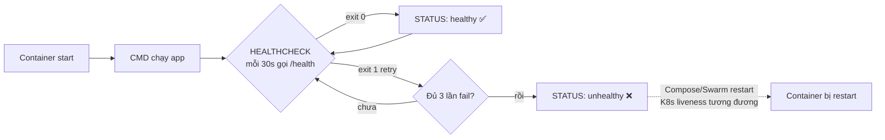

> 📚 **Giải thích từng tham số HEALTHCHECK:**
> - `--interval=30s` — chu kỳ kiểm tra (mặc định 30s)
> - `--timeout=3s` — nếu lệnh check chạy quá lâu thì coi như fail
> - `--start-period=5s` — "grace period" cho app khởi động; trong khoảng này fail KHÔNG bị tính
> - `--retries=3` — fail liên tiếp đủ N lần mới chuyển sang `unhealthy`

**Yêu cầu:**

### Phần A: `.dockerignore`

1. Tạo `.dockerignore` ở cùng cấp với Dockerfile:
```
.git
.gitignore
**/__pycache__
**/*.pyc
.venv
venv
.env
*.md
logs/
node_modules
.DS_Store
.vscode
.idea
```

2. Build lại và quan sát context size giảm rõ rệt:
```bash
docker build -t myapp:safe .
# Để ý dòng "Sending build context to Docker daemon ..."
```

### Phần B: USER (non-root)

3. Sửa Dockerfile để app chạy bằng user không phải root:
```dockerfile
FROM python:3.11-slim

# Cài curl để HEALTHCHECK gọi được /health
# (image slim không có sẵn curl)
RUN apt-get update \
  && apt-get install -y --no-install-recommends curl \
  && rm -rf /var/lib/apt/lists/*

# Tạo user không có quyền sudo
RUN useradd --create-home --shell /bin/bash --uid 1001 appuser

WORKDIR /app
COPY requirements.txt .
RUN pip install --no-cache-dir -r requirements.txt
COPY app.py .

# Chuyển ownership và đổi user
RUN chown -R appuser:appuser /app
USER appuser

EXPOSE 5000
HEALTHCHECK --interval=30s --timeout=3s --start-period=5s --retries=3 \
  CMD curl -fsS http://localhost:5000/health || exit 1

CMD ["python", "app.py"]
```

> ⚠️ **Bẫy thường gặp:** Image `python:3.11-slim` **KHÔNG có** `curl` mặc định — nếu quên `apt-get install curl`, lệnh HEALTHCHECK sẽ luôn fail (`exit 127: command not found`) → STATUS mãi `unhealthy`. Có thể thay bằng `wget` (cũng phải cài) hoặc dùng probe HTTP từ phía Python (`python -c "import urllib.request; urllib.request.urlopen('http://localhost:5000/health')"`) để khỏi cần thêm package.

4. Build và verify:
```bash
docker build -t myapp:safe .
docker run -d -p 8080:5000 --name myapp-safe myapp:safe
docker exec myapp-safe whoami            # appuser
docker exec myapp-safe id                # uid=1001
```

### Phần C: HEALTHCHECK

5. Kiểm tra trạng thái health:
```bash
docker ps                                # cột STATUS hiển thị (healthy) / (unhealthy)
docker inspect --format='{{json .State.Health}}' myapp-safe | jq
```

**Câu hỏi:**
- Tại sao chạy non-root là bắt buộc trong production?
- HEALTHCHECK của Docker khác Liveness Probe của K8s thế nào? Khi nào dùng cái nào?

---

## **Bài 52: Restart Policy + Resource Limits khi `run`** 🔴

**Mục tiêu:** Giới hạn tài nguyên container và tự khôi phục khi crash.

**Yêu cầu:**

1. Chạy container với restart policy:
```bash
# always: luôn restart, kể cả sau khi reboot máy
docker run -d --restart=always --name myapp-always myapp:safe

# unless-stopped: như always nhưng KHÔNG restart nếu bị stop thủ công
docker run -d --restart=unless-stopped --name myapp-unless myapp:safe

# on-failure: chỉ restart khi exit code != 0, tối đa N lần
docker run -d --restart=on-failure:5 --name myapp-onfail myapp:safe
```

2. Test: kill process bên trong container, xem có tự dậy không:
```bash
# pkill KHÔNG có trong python:3.11-slim → dùng kill -9 1 (PID 1 = process chính)
docker exec myapp-always kill -9 1
docker ps   # Restarting → Up sau vài giây
docker inspect --format='RestartCount={{.RestartCount}}' myapp-always
```

> 💡 **Bẫy thường gặp:** Image slim/alpine không có `pkill`, `procps`, `htop` mặc định. Hoặc cài thêm (`apt-get install -y procps`) hoặc dùng `kill -<signal> <pid>` với PID đã biết (PID 1 luôn là entrypoint của container).

3. Giới hạn tài nguyên:
```bash
docker run -d --name myapp-limited \
  --memory=128m \
  --memory-swap=128m \
  --cpus=0.5 \
  --pids-limit=100 \
  myapp:safe
```

4. Stress test (xem OOMKill):
```bash
docker stats myapp-limited
# Trong container chạy: python -c "x=[0]*100000000"
docker inspect --format='{{.State.OOMKilled}}' myapp-limited
```

**So sánh với K8s tương ứng:**

| Docker flag | K8s field |
|-------------|-----------|
| `--memory=128m` | `resources.limits.memory: 128Mi` |
| `--cpus=0.5` | `resources.limits.cpu: "500m"` |
| `--restart=always` | `restartPolicy: Always` (default Deployment) |
| `--restart=on-failure` | `restartPolicy: OnFailure` (Job) |
| `--restart=no` | `restartPolicy: Never` (Job) |

---

## **Bài 53: ENTRYPOINT vs CMD + Signal Handling (PID 1)** 🔴

**Mục tiêu:** Hiểu khác biệt ENTRYPOINT/CMD và tránh bẫy "PID 1 không nhận tín hiệu".

**Tại sao quan trọng?** Khi K8s rolling update / Compose `stop`, hệ thống gửi **SIGTERM** trước, chờ `terminationGracePeriodSeconds` (mặc định 30s) rồi mới SIGKILL. Nếu app KHÔNG nhận được SIGTERM → không kịp `graceful shutdown` (đóng connection, flush log, đóng DB pool) → user đang request bị reset đột ngột.

**Luồng signal đúng vs sai:**

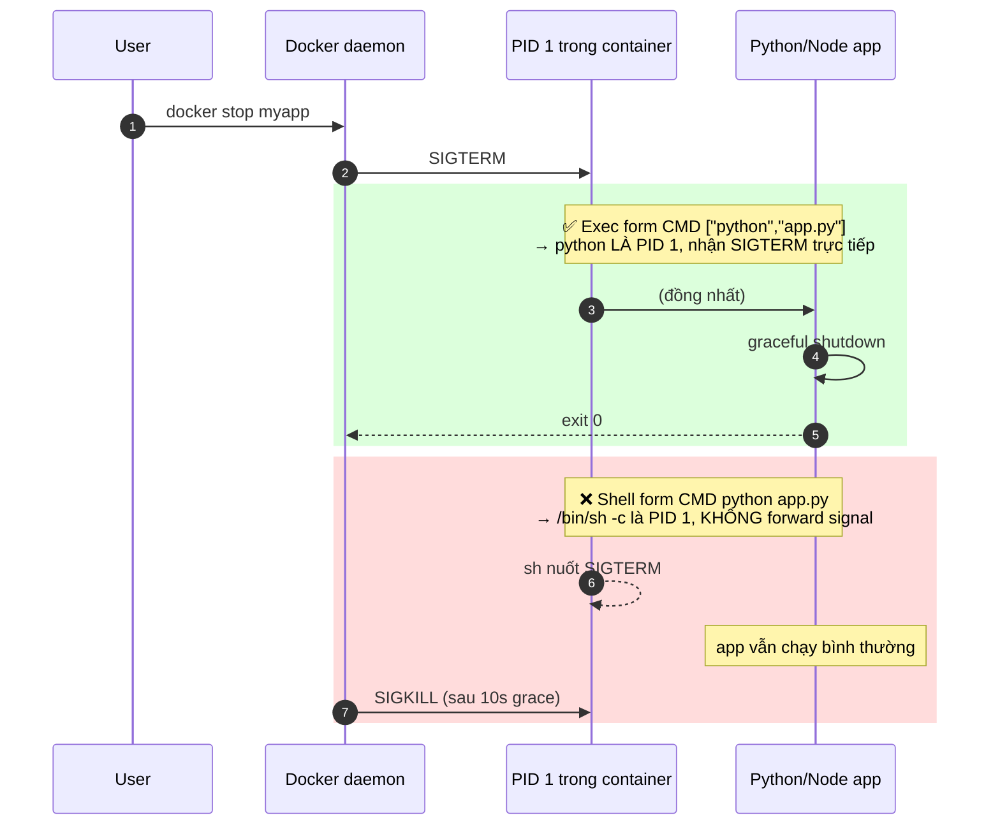

> 📚 **Giải thích nhanh — Vì sao "shell form" hỏng?**
> - `CMD python app.py` được Docker bọc lại thành `/bin/sh -c "python app.py"`.
> - `/bin/sh` trở thành PID 1 và POSIX shell mặc định KHÔNG forward signal xuống child process.
> - App Python (PID 2) cứ chạy đến hết grace period rồi bị SIGKILL → mất data đang ghi dở.
>
> 👉 **Quy tắc vàng:** Luôn dùng **exec form** `["binary", "arg1", "arg2"]` cho CMD/ENTRYPOINT trong production.

**Yêu cầu:**

### Phần A: ENTRYPOINT vs CMD

1. Tạo 4 Dockerfile demo:
```dockerfile
# Dockerfile.A - chỉ CMD
FROM alpine
CMD ["echo", "from CMD"]

# Dockerfile.B - chỉ ENTRYPOINT
FROM alpine
ENTRYPOINT ["echo", "from ENTRYPOINT"]

# Dockerfile.C - cả hai (CMD làm default args cho ENTRYPOINT)
FROM alpine
ENTRYPOINT ["echo"]
CMD ["default-msg"]

# Dockerfile.D - shell form (KHÔNG nên dùng)
FROM alpine
CMD echo from-shell-form
```

2. Build và test:
```bash
# LƯU Ý: tag image PHẢI lowercase — Docker reject 'demo-A'
for f in a b c d; do
  UPPER=$(echo "$f" | tr a-z A-Z)             # 'A' từ 'a' để chọn Dockerfile.A
  docker build -t demo-$f -f Dockerfile.$UPPER .
  echo "--- $UPPER ---"
  docker run --rm demo-$f
  docker run --rm demo-$f override-arg
done
```

> 💡 **Vì sao phải lowercase?** Docker image reference format yêu cầu repository name (phần `demo-A`) chỉ chấp nhận `[a-z0-9._-]`. Tag (`:v1`) thì lại được phép uppercase. Lỗi `invalid reference format: repository name (...) must be lowercase` rất phổ biến với học viên copy từ Windows/Mac.

**Kết quả mong đợi:**

| Image | `run image` | `run image override-arg` |
|-------|-------------|--------------------------|
| A (CMD only) | from CMD | (chạy `override-arg` thay CMD) |
| B (ENTRYPOINT) | from ENTRYPOINT | from ENTRYPOINT override-arg |
| C (cả hai) | echo default-msg | echo override-arg |
| D (shell form) | from-shell-form | (override hết) |

**Tóm tắt:** Production luôn dùng **exec form** (`["cmd", "arg"]`) — shell form bọc qua `/bin/sh -c` khiến signal không truyền tới app.

### Phần B: PID 1 problem

3. Tạo app Python có signal handler:
```python
# signal_app.py
import signal, time, sys
def handler(sig, frame):
    print(f"Got signal {sig}, shutting down gracefully")
    sys.exit(0)
signal.signal(signal.SIGTERM, handler)
signal.signal(signal.SIGINT, handler)
print("Running... PID:", )
while True:
    time.sleep(1)
```

4. Test với 2 Dockerfile:
```dockerfile
# Dockerfile.bad - shell form, signal không truyền
FROM python:3.11-slim
COPY signal_app.py .
CMD python signal_app.py

# Dockerfile.good - exec form
FROM python:3.11-slim
COPY signal_app.py .
CMD ["python", "signal_app.py"]
```

5. Test stop:
```bash
docker run -d --name bad-signal -t bad-signal-img
time docker stop bad-signal    # mất ~10s (chờ SIGKILL)

docker run -d --name good-signal -t good-signal-img
time docker stop good-signal   # < 1s (graceful)
```

### Phần C: `tini` để fix zombie process

6. App phức tạp (nhiều child process) nên dùng `tini`:
```dockerfile
FROM python:3.11-slim
RUN apt-get update && apt-get install -y tini && rm -rf /var/lib/apt/lists/*
COPY signal_app.py .
ENTRYPOINT ["/usr/bin/tini", "--"]
CMD ["python", "signal_app.py"]
```

**Câu hỏi:**
- `docker stop` mặc định gửi tín hiệu gì? Đợi bao lâu mới SIGKILL? (gợi ý: `--time`)
- Tại sao Node.js app hay bị "zombie process" nếu spawn child mà không dùng tini?

---

## **Bài 54: Image Scanning — `trivy` / `docker scout`** 🔴

**Mục tiêu:** Phát hiện CVE trong image trước khi push.

**Yêu cầu:**

### Phần A: Docker Scout (built-in)

> 📌 **Yêu cầu trước:** `docker scout` cần **đăng nhập Docker Hub** (free account đủ): `docker login`. Không login → tất cả lệnh scout sẽ in hướng dẫn đăng nhập thay vì output thật.

1. Quick scan:
```bash
docker login                           # nếu chưa login
docker scout quickview myapp:safe
docker scout cves myapp:safe
docker scout recommendations myapp:safe
```

### Phần B: Trivy (open source, mạnh hơn)

2. Cài và scan:
```bash
# macOS
brew install aquasecurity/trivy/trivy
# Linux
sudo apt-get install -y trivy

# Scan image
trivy image myapp:safe
trivy image --severity HIGH,CRITICAL myapp:safe
trivy image --ignore-unfixed myapp:safe   # bỏ CVE chưa có fix
```

3. Scan filesystem (trước khi build):
```bash
trivy fs --scanners vuln,misconfig,secret .
```

4. Output cho CI/CD (JSON, SARIF):
```bash
trivy image --format json --output report.json myapp:safe
trivy image --format sarif --output report.sarif myapp:safe   # upload lên GitHub
```

5. Tích hợp GitHub Actions (sample):
```yaml
# .github/workflows/scan.yml
- name: Run Trivy
  uses: aquasecurity/trivy-action@master
  with:
    image-ref: 'myapp:safe'
    severity: 'CRITICAL,HIGH'
    exit-code: '1'           # fail build nếu có CVE
```

**Câu hỏi:**
- Vì sao image `python:3.11-slim` đôi khi có CVE mà app không gây ra? (gợi ý: OS packages)
- Strategy giảm CVE: distroless image, alpine, scratch — trade-off?

---

## **Bài 55: Buildx — Multi-arch Image (amd64 + arm64)**

**Mục tiêu:** Build 1 lần, chạy được cả Mac M1/M2 (arm64) lẫn cloud x86 (amd64).

**Yêu cầu:**

1. Tạo builder:
```bash
docker buildx create --name multibuilder --use --bootstrap
docker buildx ls
```

2. Build multi-arch và push thẳng lên Hub:
```bash
docker buildx build \
  --platform linux/amd64,linux/arm64 \
  -t <your-username>/myapp:6.0-multi \
  --push .
```

3. Verify trên Hub: tab "OS/Architecture" sẽ thấy cả 2 platform.

4. Inspect manifest:
```bash
docker buildx imagetools inspect <your-username>/myapp:6.0-multi
```

5. Cleanup builder sau khi xong:
```bash
docker context use default          # switch context về default trước
docker buildx rm multibuilder        # xóa builder
```

> 💡 **Tại sao `docker buildx use default` không hoạt động?** `buildx use` chỉ chọn builder trong context **hiện tại**. Sau khi xóa builder, context phải switch sang `default` bằng lệnh `docker context use default`. Đây là 2 khái niệm khác nhau (builder vs context).

**Câu hỏi:**
- Sao không build trực tiếp `docker build` với 2 arch?
- QEMU emulation chậm hơn native bao nhiêu? Khi nào cần native builder trên ARM CI?

---

## ☸️ D.2. KUBERNETES BONUS (Bài 56-64)

---

## **Bài 56: Job & CronJob** 🔴

**Mục tiêu:** Workload không phải long-running (migration, batch, scheduled task).

> 📌 **Bài này là kiến thức nền cho Helm Hook ở Bài 44** — Job đã được dùng mà chưa được dạy. Học bài này trước khi đụng vào Bài 44.

**Vòng đời Job và CronJob:**

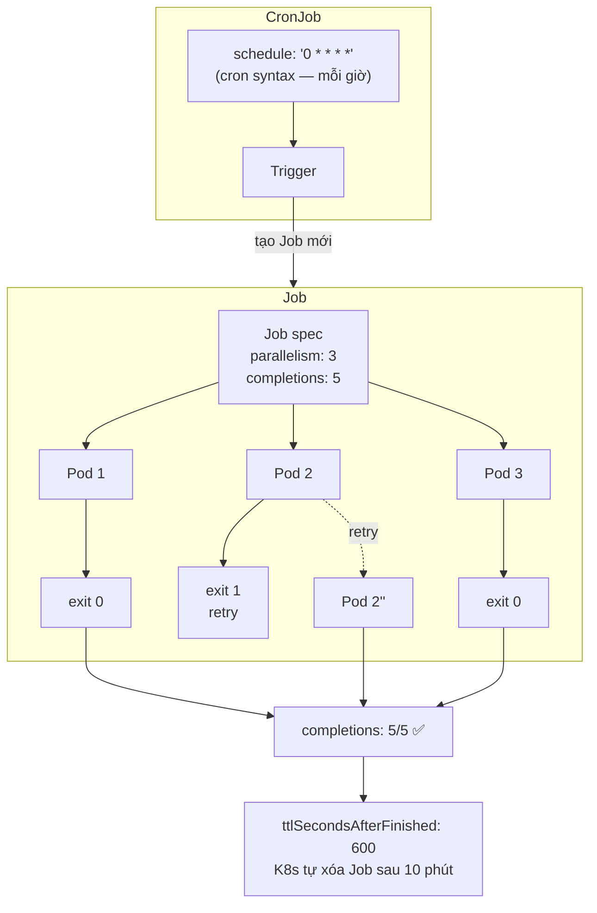

> 📚 **Khác biệt cốt lõi so với Deployment:**
> - Deployment muốn pod **chạy mãi** → `restartPolicy: Always` (mặc định, không thể đổi)
> - Job muốn pod **chạy xong rồi nghỉ** → `restartPolicy: OnFailure` (retry trong cùng pod) HOẶC `Never` (tạo pod mới khi fail)
> - **`backoffLimit`** giới hạn số lần retry trước khi Job coi như fail hẳn

**Yêu cầu:**

### Phần A: Job — chạy 1 lần xong là dừng

1. Tạo Job migration:
```yaml
# job-migrate.yaml
apiVersion: batch/v1
kind: Job
metadata:
  name: myapp-migrate
  namespace: myapp-dev
spec:
  backoffLimit: 3                    # số lần retry khi fail
  ttlSecondsAfterFinished: 600       # tự xóa sau 10 phút
  template:
    spec:
      restartPolicy: OnFailure       # bắt buộc cho Job (Never hoặc OnFailure)
      containers:
        - name: migrate
          image: <your-username>/myapp:6.0
          command: ["python", "-c", "import time; print('migrating...'); time.sleep(10); print('done')"]
```

```bash
kubectl apply -f job-migrate.yaml
kubectl get jobs -n myapp-dev
kubectl logs -f job/myapp-migrate -n myapp-dev
```

### Phần B: Job song song (parallel)

2. Chạy 5 worker song song:
```yaml
apiVersion: batch/v1
kind: Job
metadata:
  name: parallel-work
spec:
  parallelism: 3           # cùng lúc 3 pod
  completions: 5           # đến khi 5 lần succeed
  template:
    spec:
      restartPolicy: OnFailure
      containers:
        - name: worker
          image: busybox:1.36
          command: ["sh", "-c", "echo Working $RANDOM; sleep 5"]
```

### Phần C: CronJob — chạy định kỳ

3. Backup mỗi giờ:
```yaml
# cronjob-backup.yaml
apiVersion: batch/v1
kind: CronJob
metadata:
  name: myapp-backup
  namespace: myapp-dev
spec:
  schedule: "0 * * * *"              # Cron syntax
  concurrencyPolicy: Forbid          # không cho 2 job chạy chồng
  successfulJobsHistoryLimit: 3
  failedJobsHistoryLimit: 1
  jobTemplate:
    spec:
      template:
        spec:
          restartPolicy: OnFailure
          containers:
            - name: backup
              image: postgres:15-alpine
              command:
                - sh
                - -c
                - |
                  pg_dump -h db -U admin myappdb > /backup/dump-$(date +%F-%H%M).sql
              volumeMounts:
                - name: backup
                  mountPath: /backup
          volumes:
            - name: backup
              persistentVolumeClaim:
                claimName: backup-pvc
```

4. Trigger thủ công để test (không chờ schedule):
```bash
kubectl create job --from=cronjob/myapp-backup manual-backup-$(date +%s) -n myapp-dev
```

**Câu hỏi:**
- Job khác Deployment thế nào về `restartPolicy`?
- `concurrencyPolicy: Allow / Forbid / Replace` — chọn cái nào cho backup? cho metric report?

---

## **Bài 57: DaemonSet** 🔴

**Mục tiêu:** Workload phải chạy **trên MỌI node** (log shipper, node exporter, network plugin).

**DaemonSet vs Deployment — minh họa:**

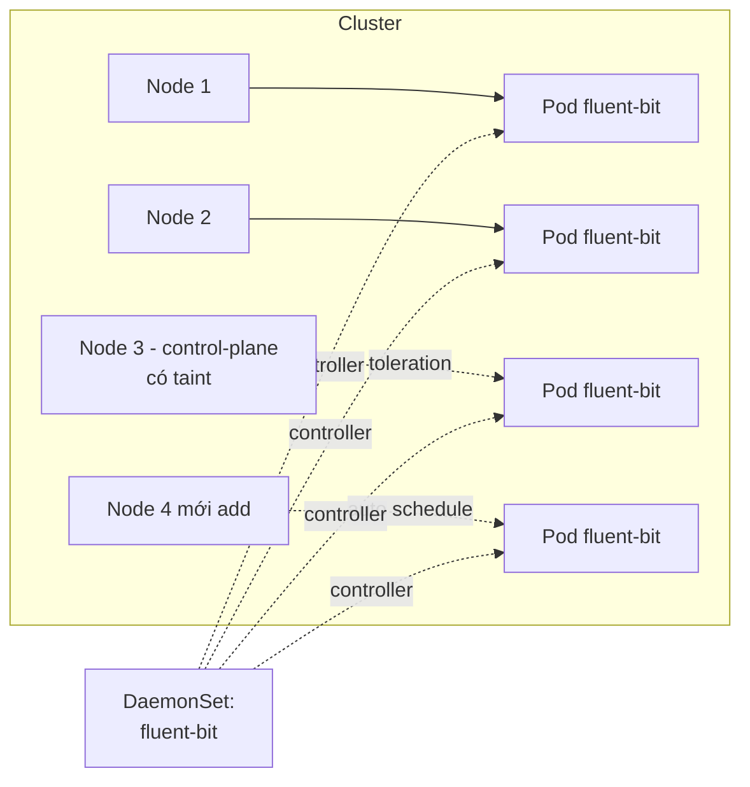

> 📚 **Quy luật:**
> - **Số pod = số node match selector** (không có `replicas:`)
> - Khi **add node mới** → DaemonSet tự deploy pod lên (Deployment không làm được)
> - **Tolerations** là bắt buộc nếu muốn chạy trên node có taint (như control-plane)
>
> **Use case điển hình:**
> - Log shipper (fluent-bit, fluentd, filebeat) — gom log từ tất cả node
> - Node exporter — metrics theo node
> - Network plugin (Calico, Cilium) — proxy/CNI agent
> - Storage agent (Rook, Longhorn) — disk driver

**Yêu cầu:**

1. Tạo DaemonSet thu thập log từ mọi node:
```yaml
apiVersion: apps/v1
kind: DaemonSet
metadata:
  name: fluent-bit
  namespace: kube-system
spec:
  selector:
    matchLabels:
      app: fluent-bit
  template:
    metadata:
      labels:
        app: fluent-bit
    spec:
      tolerations:
        - key: node-role.kubernetes.io/control-plane    # cho phép chạy cả trên master
          operator: Exists
          effect: NoSchedule
      containers:
        - name: fluent-bit
          image: fluent/fluent-bit:2.2
          volumeMounts:
            - name: varlog
              mountPath: /var/log
              readOnly: true
            - name: dockercontainers
              mountPath: /var/lib/docker/containers
              readOnly: true
      volumes:
        - name: varlog
          hostPath:
            path: /var/log
        - name: dockercontainers
          hostPath:
            path: /var/lib/docker/containers
```

2. Apply và verify mỗi node có đúng 1 pod:
```bash
kubectl apply -f daemonset.yaml
kubectl get ds -n kube-system
kubectl get pods -n kube-system -o wide -l app=fluent-bit
kubectl get nodes
# Số pod fluent-bit = số node
```

3. So sánh với Deployment trên cùng cluster:

| Tiêu chí | Deployment | DaemonSet |
|---------|-----------|-----------|
| Số pod | `replicas` quyết định | bằng số node match |
| Auto thêm khi add node mới | ❌ | ✅ |
| Use case | App business | System agent |

**Câu hỏi:**
- Khi nào dùng DaemonSet thay vì Deployment + nodeSelector?
- DaemonSet có cần Service không? Tại sao?

---

## **Bài 58: Init Container + Sidecar Pattern** 🔴

**Mục tiêu:** Hai pattern Pod-level phổ biến nhất.

**Thứ tự khởi động và lifecycle:**

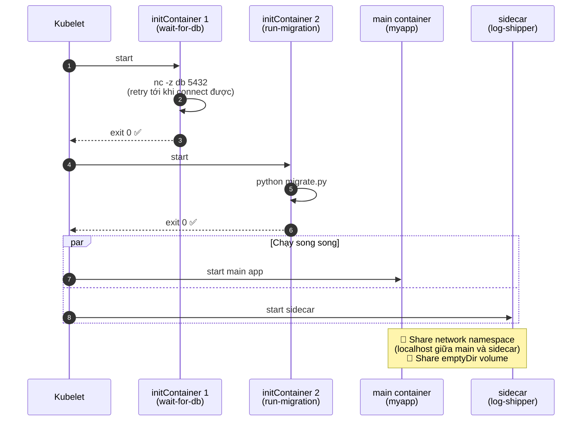

> 📚 **Quy tắc Init Container:**
> - Chạy **tuần tự** theo thứ tự khai báo, mỗi cái phải `exit 0` thì cái sau mới start
> - Nếu init fail → toàn pod retry (`restartPolicy` của pod áp dụng)
> - Main container CHỈ START khi TẤT CẢ init xong
>
> **Khi nào dùng Init vs Sidecar?**
>
> | Pattern | Mục đích | Ví dụ |
> |---------|----------|-------|
> | Init Container | "Chuẩn bị" — xong rồi nghỉ | Migration DB, wait-for-dependency, fetch config từ Vault, set permission |
> | Sidecar | "Đồng hành" — chạy suốt với main | Log shipper, service mesh proxy (Envoy), config reloader, metric exporter |

**Yêu cầu:**

### Phần A: Init Container — chạy TRƯỚC main container

1. Pod có init container chờ database ready:
```yaml
apiVersion: v1
kind: Pod
metadata:
  name: myapp-with-init
spec:
  initContainers:
    - name: wait-for-db
      image: busybox:1.36
      command:
        - sh
        - -c
        - |
          until nc -z db 5432; do
            echo "waiting for db..."
            sleep 2
          done
    - name: run-migration
      image: <your-username>/myapp:6.0
      command: ["python", "migrate.py"]
  containers:
    - name: myapp
      image: <your-username>/myapp:6.0
      ports:
        - containerPort: 5000
```

> 💡 Init container chạy **tuần tự**, mỗi cái phải success thì cái sau mới chạy. Main container chỉ start khi TẤT CẢ init xong.

### Phần B: Sidecar — chạy song song với main

2. Pod có sidecar log shipper:
```yaml
apiVersion: v1
kind: Pod
metadata:
  name: myapp-with-sidecar
spec:
  containers:
    - name: myapp
      image: <your-username>/myapp:6.0
      volumeMounts:
        - name: logs
          mountPath: /app/logs
    - name: log-shipper            # sidecar
      image: busybox:1.36
      command: ["sh", "-c", "tail -f /logs/app.log"]
      volumeMounts:
        - name: logs
          mountPath: /logs
  volumes:
    - name: logs
      emptyDir: {}
```

3. K8s 1.29+ có **native sidecar** (`restartPolicy: Always` trong initContainers):
```yaml
spec:
  initContainers:
    - name: log-shipper
      image: busybox:1.36
      restartPolicy: Always         # ← biến init thành sidecar lifecycle
      command: ["sh", "-c", "tail -f /logs/app.log"]
      volumeMounts:
        - {name: logs, mountPath: /logs}
  containers:
    - name: myapp
      # ...
```

**Câu hỏi:**
- Init container thất bại → main container có start không?
- Sidecar và main share gì? (network, volume, lifecycle?)

---

## **Bài 59: RBAC + ServiceAccount + Role/RoleBinding** 🔴

**Mục tiêu:** Phân quyền — pod nào được làm gì với K8s API.

> 📌 **Bài này là yêu cầu của dự án tổng hợp Bài 41** — bắt buộc học trước khi làm Bài 41.

**Mối quan hệ 4 object RBAC:**

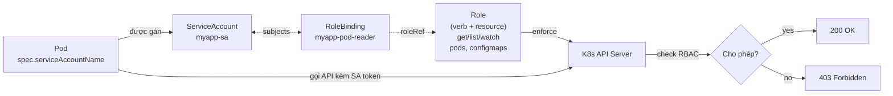

> 📚 **Phân biệt 4 cặp khái niệm dễ nhầm:**
>
> | Cặp | Khác chỗ nào |
> |-----|--------------|
> | `Role` vs `ClusterRole` | Role chỉ trong 1 namespace · ClusterRole áp dụng cluster-wide (Node, PV...) |
> | `RoleBinding` vs `ClusterRoleBinding` | RB bind ở namespace · CRB bind cluster-wide |
> | `subjects` vs `roleRef` | subjects = AI được trao quyền (SA/User/Group) · roleRef = quyền GÌ |
> | `verbs` vs `resources` | verbs = hành động (get, list, create, delete, watch, patch) · resources = đối tượng (pods, services, secrets...) |
>
> ⚠️ **Bẫy thường gặp:** `RoleBinding` CÓ THỂ trỏ tới `ClusterRole` (để tái sử dụng role view/edit/admin có sẵn) nhưng phạm vi áp dụng vẫn là 1 namespace.

**Yêu cầu:**

### Phần A: ServiceAccount

1. Tạo SA cho app:
```yaml
apiVersion: v1
kind: ServiceAccount
metadata:
  name: myapp-sa
  namespace: myapp-dev
```

2. Mount vào Deployment:
```yaml
spec:
  template:
    spec:
      serviceAccountName: myapp-sa
      automountServiceAccountToken: true
```

### Phần B: Role (namespace-scoped) + RoleBinding

3. Cho phép SA đọc Pod và ConfigMap trong namespace:
```yaml
apiVersion: rbac.authorization.k8s.io/v1
kind: Role
metadata:
  name: pod-reader
  namespace: myapp-dev
rules:
  - apiGroups: [""]
    resources: ["pods", "configmaps"]
    verbs: ["get", "list", "watch"]
---
apiVersion: rbac.authorization.k8s.io/v1
kind: RoleBinding
metadata:
  name: myapp-pod-reader
  namespace: myapp-dev
subjects:
  - kind: ServiceAccount
    name: myapp-sa
    namespace: myapp-dev
roleRef:
  kind: Role
  name: pod-reader
  apiGroup: rbac.authorization.k8s.io
```

### Phần C: ClusterRole (cluster-wide) + ClusterRoleBinding

4. SA cần access cluster-wide resource (ví dụ Node):
```yaml
apiVersion: rbac.authorization.k8s.io/v1
kind: ClusterRole
metadata:
  name: node-reader
rules:
  - apiGroups: [""]
    resources: ["nodes"]
    verbs: ["get", "list"]
---
apiVersion: rbac.authorization.k8s.io/v1
kind: ClusterRoleBinding
metadata:
  name: myapp-node-reader
subjects:
  - kind: ServiceAccount
    name: myapp-sa
    namespace: myapp-dev
roleRef:
  kind: ClusterRole
  name: node-reader
  apiGroup: rbac.authorization.k8s.io
```

### Phần D: Test bằng `kubectl auth can-i`

5. Verify quyền:
```bash
kubectl auth can-i list pods -n myapp-dev --as=system:serviceaccount:myapp-dev:myapp-sa
# yes
kubectl auth can-i delete pods -n myapp-dev --as=system:serviceaccount:myapp-dev:myapp-sa
# no
kubectl auth can-i list nodes --as=system:serviceaccount:myapp-dev:myapp-sa
# yes
```

**Câu hỏi:**
- Role vs ClusterRole — chính xác khác chỗ nào?
- Nếu app KHÔNG cần gọi K8s API, có cần SA không? (gợi ý: `automountServiceAccountToken: false` để giảm attack surface)

---

## **Bài 60: NetworkPolicy** 🔴

**Mục tiêu:** Firewall ở tầng pod — chỉ cho phép luồng cần thiết.

> ⚠️ **NetworkPolicy chỉ hoạt động khi CNI plugin hỗ trợ** (Calico, Cilium, Weave). Default Minikube dùng `--network-plugin=cni`. Kiểm tra bằng `kubectl get pods -n kube-system`.

**Hình dung firewall ở tầng Pod:**

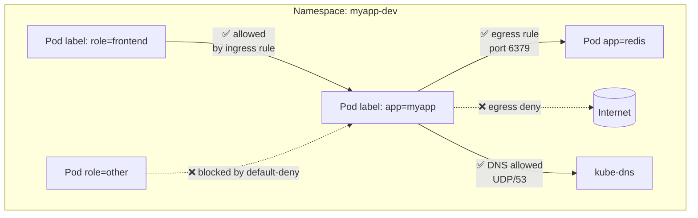

> 📚 **3 nguyên tắc cốt lõi:**
> 1. **Whitelist model** — Khi pod được match bởi BẤT KỲ NetworkPolicy nào, mọi traffic KHÔNG được explicitly allow đều bị block.
> 2. Pod **KHÔNG match policy nào** → traffic free (default behavior). Vì vậy `default-deny` policy là pattern bắt buộc khi muốn bảo vệ namespace.
> 3. `policyTypes` quyết định rule áp dụng vào **chiều nào** (Ingress, Egress hoặc cả hai).
>
> 🐛 **Bẫy thường gặp:** Áp dụng NetworkPolicy trên cluster mà CNI **không support** → apply OK nhưng KHÔNG có tác dụng → tưởng đã chặn nhưng thực ra mở toang. **Luôn test verify** bằng `kubectl exec ... -- nc -zv target 6379`.

**Yêu cầu:**

### Phần A: Default Deny — chặn hết

1. Áp dụng deny-all-ingress cho namespace:
```yaml
apiVersion: networking.k8s.io/v1
kind: NetworkPolicy
metadata:
  name: default-deny-ingress
  namespace: myapp-dev
spec:
  podSelector: {}      # tất cả pod
  policyTypes:
    - Ingress
```

2. Test: từ pod khác curl vào myapp-service → timeout (vì deny hết).

### Phần B: Allow theo label

3. Chỉ cho phép pod có label `role: frontend` gọi myapp:
```yaml
apiVersion: networking.k8s.io/v1
kind: NetworkPolicy
metadata:
  name: allow-frontend-to-myapp
  namespace: myapp-dev
spec:
  podSelector:
    matchLabels:
      app: myapp
  policyTypes:
    - Ingress
  ingress:
    - from:
        - podSelector:
            matchLabels:
              role: frontend
      ports:
        - protocol: TCP
          port: 5000
```

### Phần C: Egress — chặn outbound

4. Chỉ cho myapp gọi tới redis + DNS:
```yaml
apiVersion: networking.k8s.io/v1
kind: NetworkPolicy
metadata:
  name: myapp-egress
  namespace: myapp-dev
spec:
  podSelector:
    matchLabels:
      app: myapp
  policyTypes:
    - Egress
  egress:
    - to:
        - podSelector:
            matchLabels:
              app: redis
      ports:
        - protocol: TCP
          port: 6379
    - to:                          # DNS
        - namespaceSelector: {}
          podSelector:
            matchLabels:
              k8s-app: kube-dns
      ports:
        - protocol: UDP
          port: 53
```

**Câu hỏi:**
- NetworkPolicy là **whitelist** hay **blacklist**? Khi không match rule nào thì sao?
- Nếu CNI không hỗ trợ NetworkPolicy, áp dụng có lỗi không? (gợi ý: không lỗi nhưng cũng không hoạt động — bẫy thường gặp)

---

## **Bài 61: Taints, Tolerations, NodeSelector, Affinity** 🔴

**Mục tiêu:** Kiểm soát pod schedule lên node nào.

**Ai chủ động? — bảng so sánh trực giác:**

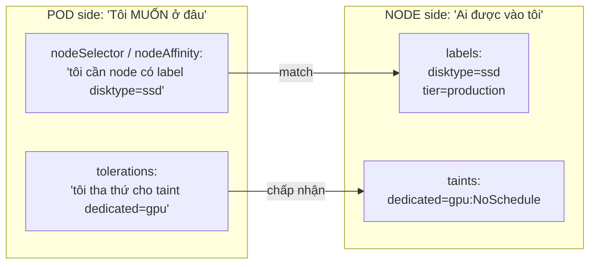

> 📚 **Phân biệt 3 cơ chế:**
>
> | Cơ chế | Ai chủ động? | Tính chất |
> |--------|--------------|----------|
> | **nodeSelector** | Pod | Hard match (key=value bắt buộc) — đơn giản nhất |
> | **nodeAffinity** | Pod | Hard (`required`) hoặc Soft (`preferred`) — biểu thức linh hoạt (In/NotIn/Exists/Gt/Lt) |
> | **Taint + Toleration** | Node đuổi, Pod xin vào | Dùng để **dành riêng node cho workload đặc biệt** (GPU, dedicated tenant) |
> | **podAffinity / podAntiAffinity** | Pod | "Tôi muốn gần/xa pod khác" — dùng cho HA spread hoặc co-location |
>
> 🎯 **Pattern HA điển hình:** `podAntiAffinity` với `topologyKey: kubernetes.io/hostname` → 3 replica của myapp luôn ở 3 node khác nhau (1 node chết vẫn còn 2).

**Yêu cầu:**

### Phần A: NodeSelector (đơn giản nhất)

1. Label node:
```bash
kubectl label nodes <node-name> disktype=ssd tier=production
```

2. Pod chỉ schedule lên node có label:
```yaml
spec:
  nodeSelector:
    disktype: ssd
```

### Phần B: Taints & Tolerations (node "đuổi" pod)

3. Taint node để chặn pod thường:
```bash
kubectl taint nodes <node-name> dedicated=gpu:NoSchedule
```

4. Pod cần "toleration" để được phép vào:
```yaml
spec:
  tolerations:
    - key: "dedicated"
      operator: "Equal"
      value: "gpu"
      effect: "NoSchedule"
```

**3 effect:** `NoSchedule` (chặn schedule mới), `PreferNoSchedule` (cố tránh), `NoExecute` (đẩy pod đang chạy đi).

### Phần C: Affinity (mềm dẻo hơn nodeSelector)

5. nodeAffinity — required + preferred:
```yaml
spec:
  affinity:
    nodeAffinity:
      requiredDuringSchedulingIgnoredDuringExecution:
        nodeSelectorTerms:
          - matchExpressions:
              - key: disktype
                operator: In
                values: ["ssd", "nvme"]
      preferredDuringSchedulingIgnoredDuringExecution:
        - weight: 80
          preference:
            matchExpressions:
              - key: tier
                operator: In
                values: ["production"]
```

### Phần D: PodAntiAffinity (HA)

6. Đảm bảo 3 replica nằm trên 3 node khác nhau:
```yaml
spec:
  affinity:
    podAntiAffinity:
      requiredDuringSchedulingIgnoredDuringExecution:
        - labelSelector:
            matchExpressions:
              - key: app
                operator: In
                values: ["myapp"]
          topologyKey: kubernetes.io/hostname
```

**Câu hỏi:**
- Taint vs NodeSelector — ai chủ động? (node đuổi pod / pod chọn node)
- Khi nào dùng `requiredDuring...` vs `preferredDuring...`?

---

## **Bài 62: ResourceQuota + LimitRange + PodDisruptionBudget** 🔴

**Mục tiêu:** Bảo vệ cluster (quota), set default (limitrange), bảo vệ HA (PDB).

**Yêu cầu:**

### Phần A: ResourceQuota — giới hạn ở namespace

1. Quota cho namespace `myapp-dev`:
```yaml
apiVersion: v1
kind: ResourceQuota
metadata:
  name: myapp-quota
  namespace: myapp-dev
spec:
  hard:
    requests.cpu: "4"
    requests.memory: 8Gi
    limits.cpu: "8"
    limits.memory: 16Gi
    pods: "20"
    services.loadbalancers: "2"
    persistentvolumeclaims: "10"
```

2. Test: cố apply deployment vượt quota → fail với error rõ ràng.

### Phần B: LimitRange — default cho pod chưa khai báo

3. Mọi container không khai resources sẽ nhận default:
```yaml
apiVersion: v1
kind: LimitRange
metadata:
  name: myapp-limits
  namespace: myapp-dev
spec:
  limits:
    - type: Container
      default:                  # nếu pod KHÔNG khai limits
        cpu: 500m
        memory: 256Mi
      defaultRequest:           # nếu pod KHÔNG khai requests
        cpu: 100m
        memory: 128Mi
      max:                      # giá trị tối đa được phép
        cpu: "2"
        memory: 2Gi
      min:
        cpu: 10m
        memory: 32Mi
```

### Phần C: PodDisruptionBudget — bảo vệ HA khi node drain

4. Đảm bảo lúc nào cũng có ít nhất 2 pod sẵn sàng:
```yaml
apiVersion: policy/v1
kind: PodDisruptionBudget
metadata:
  name: myapp-pdb
  namespace: myapp-dev
spec:
  minAvailable: 2              # hoặc dùng maxUnavailable: 1
  selector:
    matchLabels:
      app: myapp
```

5. Test: drain node trong khi PDB block:
```bash
kubectl drain <node-name> --ignore-daemonsets
# K8s sẽ chờ cho đến khi có pod khác lên thay
```

**Câu hỏi:**
- ResourceQuota có check `requests` hay `limits`? Cả hai?
- PDB chỉ hoạt động với voluntary disruption (drain) hay cả hardware failure?

---

## **Bài 63: StorageClass + Dynamic Provisioning**

**Mục tiêu:** Thay `hostPath` thủ công ở Bài 34 bằng dynamic provisioning.

**Yêu cầu:**

1. Xem StorageClass có sẵn:
```bash
kubectl get sc
# Minikube có 'standard' (default) dùng hostpath-provisioner
```

2. Tạo PVC — KHÔNG cần tạo PV trước:
```yaml
apiVersion: v1
kind: PersistentVolumeClaim
metadata:
  name: myapp-dynamic-pvc
  namespace: myapp-dev
spec:
  storageClassName: standard      # hoặc bỏ để dùng default
  accessModes: [ReadWriteOnce]
  resources:
    requests:
      storage: 500Mi
```

3. Apply và quan sát — PV được auto-tạo:
```bash
kubectl apply -f pvc.yaml
kubectl get pvc -n myapp-dev
kubectl get pv         # PV mới xuất hiện
```

4. Tạo custom StorageClass:
```yaml
apiVersion: storage.k8s.io/v1
kind: StorageClass
metadata:
  name: fast-ssd
provisioner: kubernetes.io/aws-ebs    # hoặc kubernetes.io/gce-pd, ...
parameters:
  type: gp3
  iopsPerGB: "10"
reclaimPolicy: Retain          # giữ data khi xóa PVC
volumeBindingMode: WaitForFirstConsumer
allowVolumeExpansion: true     # cho phép resize
```

**3 ReclaimPolicy:**

| Policy | Khi xóa PVC |
|--------|-------------|
| `Delete` | PV + disk thật bị xóa |
| `Retain` | PV chuyển sang `Released`, disk được giữ (admin xóa thủ công) |
| `Recycle` | (deprecated) |

**Câu hỏi:**
- `volumeBindingMode: Immediate` vs `WaitForFirstConsumer` — khi nào dùng cái nào?
- Production data quan trọng → ReclaimPolicy là gì?

---

## **Bài 64: Kustomize cơ bản** 🔴

**Mục tiêu:** Quản lý YAML cho nhiều môi trường KHÔNG cần Helm.

> 📌 Bài này là kiến thức nền cho ArgoCD ở Bài 46.

**Mental model — Base + Overlay:**

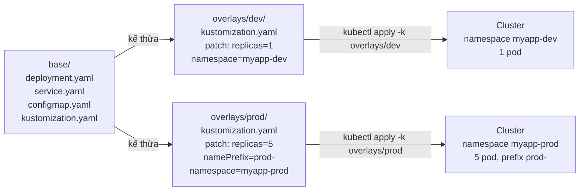

> 📚 **Tư duy Kustomize khác Helm:**
> - Helm: **template** (Go template) — file YAML có `{{ .Values }}`, render ra → apply
> - Kustomize: **patch** — file YAML thuần, mỗi overlay "đắp thêm" để biến thành phiên bản môi trường
> - Kustomize **không có logic phức tạp** (if/loop) — đây là CHỦ ĐÍCH thiết kế, giữ YAML dễ đọc
>
> 💡 Có thể **kết hợp cả hai**: Helm chart từ vendor + Kustomize patch để override nhẹ (pattern `helmCharts:` trong kustomization.yaml).

**Yêu cầu:**

### Phần A: Structure

1. Tạo cấu trúc base + overlays:
```
myapp-kustomize/
├── base/
│   ├── kustomization.yaml
│   ├── deployment.yaml
│   ├── service.yaml
│   └── configmap.yaml
└── overlays/
    ├── dev/
    │   ├── kustomization.yaml
    │   └── patch-replicas.yaml
    └── prod/
        ├── kustomization.yaml
        └── patch-replicas.yaml
```

2. `base/kustomization.yaml`:
```yaml
apiVersion: kustomize.config.k8s.io/v1beta1
kind: Kustomization
resources:
  - deployment.yaml
  - service.yaml
  - configmap.yaml
labels:
  - pairs:
      app: myapp
    includeSelectors: true
```

3. `overlays/prod/kustomization.yaml`:
```yaml
apiVersion: kustomize.config.k8s.io/v1beta1
kind: Kustomization
namespace: myapp-prod
resources:
  - ../../base
namePrefix: prod-
images:
  - name: <your-username>/myapp
    newTag: "v1.0"
replicas:
  - name: myapp-deployment
    count: 5
patches:
  - path: patch-replicas.yaml
```

### Phần B: Render & Apply

4. Xem output trước khi apply:
```bash
kubectl kustomize overlays/prod/
# Hoặc:
kustomize build overlays/prod/
```

5. Apply:
```bash
kubectl apply -k overlays/prod/
kubectl delete -k overlays/prod/
```

**So sánh Kustomize vs Helm:**

| Tiêu chí | Kustomize | Helm |
|----------|-----------|------|
| Cú pháp | YAML thuần + patch | Go template trong YAML |
| Logic phức tạp | ❌ (cố tình giới hạn) | ✅ (if/range/functions) |
| Built-in `kubectl` | ✅ (`-k`) | ❌ (cần `helm` binary) |
| Package & version | ❌ | ✅ |
| Phù hợp khi | Cấu hình app riêng | Đóng gói chart phân phối |

**Câu hỏi:**
- Khi nào pick Kustomize, khi nào pick Helm? Có thể dùng cả hai (Helm chart + Kustomize patch) không?

---

## 🎯 D.3. ADVANCED BONUS (Bài 65-69)

---

## **Bài 65: cert-manager + Let's Encrypt** 🔴

**Mục tiêu:** TLS tự động cho Ingress (cấp + renew miễn phí).

**Luồng ACME http-01 challenge:**

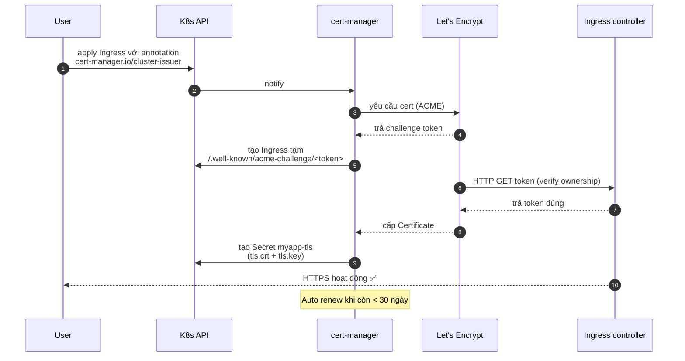

> 📚 **Tại sao dùng Let's Encrypt:**
> - **Miễn phí** + tự động
> - Hỗ trợ wildcard (`*.example.com`) qua DNS-01 challenge (cần DNS provider plugin)
> - **Rate limit:** 50 cert/domain/tuần (production), 30 ngàn/tuần (staging) → **luôn test bằng staging trước**

**Yêu cầu:**

### Phần A: Cài cert-manager

1. Install qua YAML:
```bash
kubectl apply -f https://github.com/cert-manager/cert-manager/releases/latest/download/cert-manager.yaml
kubectl get pods -n cert-manager -w
```

### Phần B: ClusterIssuer

2. Issuer dùng Let's Encrypt staging (để test):
```yaml
apiVersion: cert-manager.io/v1
kind: ClusterIssuer
metadata:
  name: letsencrypt-staging
spec:
  acme:
    email: you@example.com
    server: https://acme-staging-v02.api.letsencrypt.org/directory
    privateKeySecretRef:
      name: letsencrypt-staging-key
    solvers:
      - http01:
          ingress:
            class: nginx
```

3. Sau khi test OK, dùng production issuer (đổi URL sang `https://acme-v02.api.letsencrypt.org/directory`).

### Phần C: Annotate Ingress

4. Sửa Ingress của myapp:
```yaml
apiVersion: networking.k8s.io/v1
kind: Ingress
metadata:
  name: myapp-ingress
  annotations:
    cert-manager.io/cluster-issuer: letsencrypt-staging
spec:
  tls:
    - hosts:
        - myapp.example.com
      secretName: myapp-tls          # cert-manager sẽ tự tạo
  rules:
    - host: myapp.example.com
      http:
        paths:
          - path: /
            pathType: Prefix
            backend:
              service:
                name: myapp-service
                port:
                  number: 80
```

5. Verify:
```bash
kubectl get certificate
kubectl describe certificate myapp-tls
kubectl get secret myapp-tls -o yaml
```

**Câu hỏi:**
- Vì sao cần test bằng staging trước? (rate limit Let's Encrypt production: **50 cert/registered domain/tuần** + 5 duplicate cert/tuần — staging gần như không giới hạn)
- Cert tự renew khi nào? (mặc định khi còn < 30 ngày)

---

## **Bài 66: Prometheus + Grafana Stack** 🔴

**Mục tiêu:** Observability — Metrics + Dashboard + Alert.

**Kiến trúc kube-prometheus-stack:**

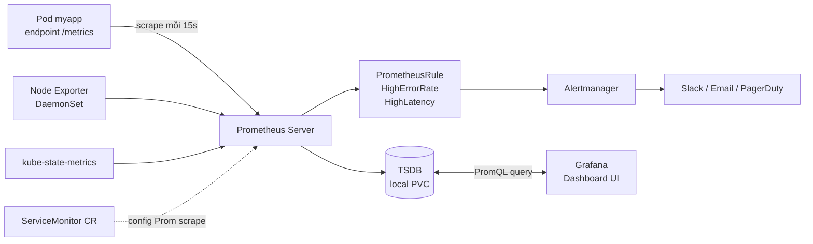

> 📚 **3 trụ cột observability (RED metrics):**
> - **R**ate — requests/giây (`rate(myapp_request_total[1m])`)
> - **E**rrors — tỉ lệ lỗi (`rate(...{status="500"}[5m]) / rate(...[5m])`)
> - **D**uration — latency P50/P95/P99 (`histogram_quantile(0.95, ...)`)
>
> 💡 **ServiceMonitor là CRD của Prometheus Operator** — thay vì phải sửa `prometheus.yml` thủ công, bạn khai báo ServiceMonitor và Operator tự cập nhật config. Tách concern: app dev không cần biết Prometheus.

**Yêu cầu:**

### Phần A: Cài kube-prometheus-stack qua Helm

1. Add repo và install:
```bash
helm repo add prometheus-community https://prometheus-community.github.io/helm-charts
helm repo update

kubectl create namespace monitoring
helm install kps prometheus-community/kube-prometheus-stack \
  -n monitoring \
  --set grafana.adminPassword='admin' \
  --set prometheus.prometheusSpec.serviceMonitorSelectorNilUsesHelmValues=false
```

2. Truy cập:
```bash
kubectl port-forward -n monitoring svc/kps-grafana 3000:80
kubectl port-forward -n monitoring svc/kps-kube-prometheus-stack-prometheus 9090:9090
```

### Phần B: Expose metrics từ myapp

3. Sửa app.py thêm Prometheus client:
```python
from flask import Flask
from prometheus_client import Counter, Histogram, generate_latest
app = Flask(__name__)

REQUEST_COUNT = Counter('myapp_request_total', 'Total requests', ['method', 'endpoint'])
REQUEST_LATENCY = Histogram('myapp_request_duration_seconds', 'Request latency', ['endpoint'])

@app.route('/')
def home():
    REQUEST_COUNT.labels(method='GET', endpoint='/').inc()
    with REQUEST_LATENCY.labels(endpoint='/').time():
        return "Hello"

@app.route('/metrics')
def metrics():
    return generate_latest(), 200, {'Content-Type': 'text/plain; charset=utf-8'}
```

4. Add `prometheus-client==0.20.0` vào `requirements.txt`, build và push image mới.

### Phần C: ServiceMonitor — đăng ký scrape

5. Cho Prometheus biết phải scrape myapp:
```yaml
apiVersion: monitoring.coreos.com/v1
kind: ServiceMonitor
metadata:
  name: myapp-monitor
  namespace: myapp-dev
spec:
  selector:
    matchLabels:
      app: myapp
  endpoints:
    - port: http        # tên port trong Service
      path: /metrics
      interval: 15s
```

### Phần D: PrometheusRule — Alert

6. Alert khi error rate > 5%:
```yaml
apiVersion: monitoring.coreos.com/v1
kind: PrometheusRule
metadata:
  name: myapp-alerts
  namespace: myapp-dev
spec:
  groups:
    - name: myapp
      rules:
        - alert: HighErrorRate
          expr: rate(myapp_request_total{status="500"}[5m]) > 0.05
          for: 5m
          labels:
            severity: critical
          annotations:
            summary: "myapp error rate > 5% for 5min"
```

### Phần E: Grafana Dashboard

7. Login Grafana → import dashboard ID `7249` (K8s cluster) hoặc tự tạo panel:
```promql
# RPS
sum(rate(myapp_request_total[1m])) by (endpoint)

# P95 latency
histogram_quantile(0.95, rate(myapp_request_duration_seconds_bucket[5m]))
```

**Câu hỏi:**
- RED metrics (Rate, Errors, Duration) — vì sao là chuẩn?
- ServiceMonitor cần namespace match với Prometheus không? (gợi ý: tùy `serviceMonitorNamespaceSelector`)

---

## **Bài 67: Velero — Backup & Restore**

**Mục tiêu:** Backup toàn bộ cluster (manifest + PV data).

**Luồng backup/restore:**

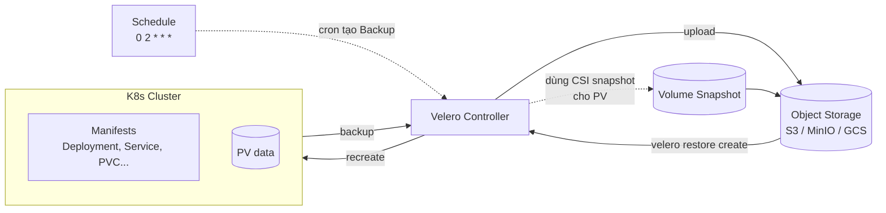

> 📚 **Velero backup gồm 2 thứ:**
> 1. **Manifest** (mặc định) — tất cả K8s object trong namespace được dump ra YAML
> 2. **PV data** — chỉ backup khi cluster có CSI driver hỗ trợ snapshot HOẶC dùng Restic/Kopia (bundled với Velero) để backup file-level
>
> 💡 **Khác `etcdctl snapshot`:** etcd backup là toàn bộ cluster state (kể cả system namespace) → để recover **toàn cluster**. Velero là **per-namespace/per-resource** → linh hoạt cho migration, DR theo workload.

**Yêu cầu:**

### Phần A: Cài Velero

1. Cần object storage (MinIO local hoặc S3):
```bash
# MinIO local cho lab
helm install minio bitnami/minio -n velero --create-namespace \
  --set auth.rootUser=minio --set auth.rootPassword=minio123
```

2. Cài Velero CLI và server:
```bash
brew install velero    # hoặc download release

# Tạo credentials file
cat > credentials-velero <<EOF
[default]
aws_access_key_id=minio
aws_secret_access_key=minio123
EOF

velero install \
  --provider aws \
  --plugins velero/velero-plugin-for-aws:v1.9.0 \
  --bucket velero-backups \
  --secret-file ./credentials-velero \
  --use-volume-snapshots=false \
  --backup-location-config region=minio,s3ForcePathStyle="true",s3Url=http://minio.velero.svc:9000
```

### Phần B: Backup

3. Backup theo namespace:
```bash
velero backup create myapp-backup --include-namespaces myapp-dev
velero backup describe myapp-backup
velero backup logs myapp-backup
```

4. Backup theo schedule:
```bash
velero schedule create daily-backup --schedule="0 2 * * *" \
  --include-namespaces myapp-dev --ttl 720h
```

### Phần C: Restore

5. Disaster simulation:
```bash
kubectl delete namespace myapp-dev
```

6. Restore từ backup:
```bash
velero restore create --from-backup myapp-backup
kubectl get all -n myapp-dev
```

**Câu hỏi:**
- Velero backup gồm những gì? PV data có được backup không?
- Khác `etcdctl snapshot` thế nào?

---

## **Bài 68: External Secrets / Sealed Secrets** 🔴

**Mục tiêu:** Quản lý secret an toàn — không commit plaintext lên Git.

**Hai cách tiếp cận — Sealed Secrets vs External Secrets:**

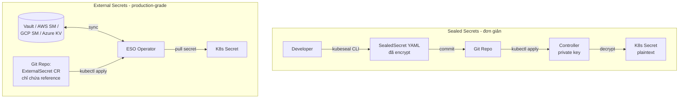

> 📚 **So sánh nhanh:**
>
> | Tiêu chí | Sealed Secrets | External Secrets |
> |----------|---------------|------------------|
> | Setup | Đơn giản (1 controller) | Phức tạp (cần Vault/SM riêng) |
> | Source of truth | File trong Git | Vault/SM bên ngoài |
> | Rotation | Phải commit lại | Tự động sync khi value đổi ở source |
> | Audit | Git history | Vault audit log (mạnh hơn) |
> | Khi nào dùng | Team nhỏ, GitOps thuần | Production, multi-team, compliance cao |
>
> 🎯 **Đều giải quyết vấn đề Bài 33:** base64 không phải encryption → secret trong Git là rủi ro.

**Yêu cầu:**

### Phần A: Sealed Secrets (đơn giản — encrypt với public key)

1. Cài controller:
```bash
helm repo add sealed-secrets https://bitnami-labs.github.io/sealed-secrets
helm install sealed-secrets sealed-secrets/sealed-secrets -n kube-system
```

2. Cài CLI `kubeseal`:
```bash
brew install kubeseal
```

3. Encrypt secret:
```bash
# Tạo secret plain (chưa apply)
kubectl create secret generic myapp-secret \
  --from-literal=DB_PASSWORD=supersecret \
  --dry-run=client -o yaml > secret.yaml

# Encrypt thành SealedSecret
kubeseal --format yaml < secret.yaml > sealed-secret.yaml

# File sealed-secret.yaml CÓ THỂ commit lên Git an toàn
kubectl apply -f sealed-secret.yaml
```

> Controller trong cluster sẽ decrypt SealedSecret thành Secret thật. Chỉ controller mới có private key.

### Phần B: External Secrets Operator (kết nối Vault/AWS Secrets Manager)

4. Cài ESO:
```bash
helm repo add external-secrets https://charts.external-secrets.io
helm install external-secrets external-secrets/external-secrets -n external-secrets-system --create-namespace
```

5. ClusterSecretStore (ví dụ AWS Secrets Manager):
```yaml
apiVersion: external-secrets.io/v1beta1
kind: ClusterSecretStore
metadata:
  name: aws-store
spec:
  provider:
    aws:
      service: SecretsManager
      region: ap-southeast-1
      auth:
        secretRef:
          accessKeyIDSecretRef:
            name: aws-creds
            key: access-key
            namespace: external-secrets-system
          secretAccessKeySecretRef:
            name: aws-creds
            key: secret-key
            namespace: external-secrets-system
```

6. ExternalSecret kéo từ AWS về thành K8s Secret:
```yaml
apiVersion: external-secrets.io/v1beta1
kind: ExternalSecret
metadata:
  name: myapp-db
  namespace: myapp-dev
spec:
  refreshInterval: 1h
  secretStoreRef:
    name: aws-store
    kind: ClusterSecretStore
  target:
    name: myapp-secret
  data:
    - secretKey: DB_PASSWORD
      remoteRef:
        key: /prod/myapp/db
        property: password
```

**So sánh:**

| Tool | Cách hoạt động | Ưu | Nhược |
|------|---------------|----|----|
| **Sealed Secrets** | Encrypt local bằng pub key | Đơn giản, tự đủ | Phải rotate key thủ công, không integrate vault |
| **External Secrets** | Sync từ external store (Vault/SM) | Production-grade, audit/rotate ở 1 chỗ | Cần infra ngoài |

**Câu hỏi:**
- Khi nào dùng Sealed Secrets? Khi nào dùng ESO?
- Cả hai đều giải quyết "Secret base64 không phải encryption" (Bài 33) — đúng không?

---

## **Bài 69: Operator Pattern + CRD cơ bản**

**Mục tiêu:** Hiểu cách K8s mở rộng — CRD + Controller.

**Reconcile loop — trái tim của mọi Operator:**

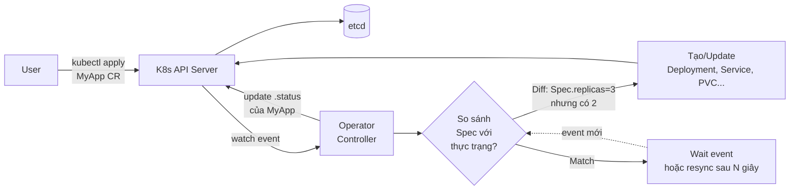

> 📚 **CRD vs Controller — 2 nửa của Operator:**
>
> | Component | Vai trò | Sản phẩm |
> |-----------|---------|----------|
> | **CRD** (CustomResourceDefinition) | "**Định nghĩa schema** — Kind mới với spec/status" | Sau khi apply → có thể `kubectl get myapps` |
> | **Controller** | "**Logic** — watch CR, làm cho thực trạng match spec" | Tạo/sửa/xóa Deployment, Service... thay user |
> | **Operator** = CRD + Controller | Đóng gói domain knowledge thành K8s-native | Cài 1 lần, người dùng chỉ apply CR đơn giản |
>
> 💡 **Các Operator nổi tiếng đã dùng trong khóa này:**
> - `prometheus-operator` (Bài 66) — ServiceMonitor, PrometheusRule là CRD
> - `cert-manager` (Bài 65) — Certificate, ClusterIssuer là CRD
> - `istio` (Bài 48-50) — VirtualService, DestinationRule là CRD
> - `argo-cd` (Bài 45-47) — Application, ApplicationSet là CRD

**Yêu cầu:**

### Phần A: CRD — tự định nghĩa resource mới

1. Khai báo CRD `MyApp`:
```yaml
apiVersion: apiextensions.k8s.io/v1
kind: CustomResourceDefinition
metadata:
  name: myapps.example.com
spec:
  group: example.com
  names:
    kind: MyApp
    plural: myapps
    singular: myapp
    shortNames: [ma]
  scope: Namespaced
  versions:
    - name: v1
      served: true
      storage: true
      schema:
        openAPIV3Schema:
          type: object
          properties:
            spec:
              type: object
              required: [replicas, image]
              properties:
                replicas:
                  type: integer
                  minimum: 1
                  maximum: 100
                image:
                  type: string
                version:
                  type: string
      additionalPrinterColumns:
        - name: Replicas
          type: integer
          jsonPath: .spec.replicas
        - name: Image
          type: string
          jsonPath: .spec.image
```

2. Apply và test:
```bash
kubectl apply -f crd.yaml
kubectl get crd
kubectl explain myapp.spec   # đã có docs!
```

3. Tạo instance:
```yaml
apiVersion: example.com/v1
kind: MyApp
metadata:
  name: my-instance
spec:
  replicas: 3
  image: <your-username>/myapp:6.0
  version: "6.0"
```

```bash
kubectl get myapps          # hoặc 'ma'
```

> Lúc này MỚI CHỈ CÓ CRD — chưa có controller nào "phản ứng" với resource này. CRD là **type definition**, Controller mới là **logic**.

### Phần B: Khái niệm Operator (controller cho CRD)

4. Operator = Custom Controller + CRD. Workflow:

```
User: kubectl apply -f myapp.yaml (CRD instance)
   ↓
API Server lưu vào etcd
   ↓
Operator (watch) phát hiện change
   ↓
Operator tạo Deployment + Service + ... để match spec
   ↓
Operator update .status của MyApp
```

5. Một số Operator phổ biến để khám phá:

| Operator | Quản lý |
|----------|---------|
| **prometheus-operator** | Prometheus, ServiceMonitor, PrometheusRule (đã dùng ở Bài 66) |
| **cert-manager** | Certificate, ClusterIssuer (Bài 65) |
| **postgres-operator (Zalando/CrunchyData)** | PostgreSQL cluster |
| **strimzi** | Kafka cluster |
| **argo-rollouts** | Canary/Blue-Green advanced |

### Phần C: Tự viết Operator (overview)

6. Hai cách phổ biến:
   - **Kubebuilder / Operator SDK (Go)** — chính thống, performance cao
   - **kopf (Python)** — viết nhanh, prototype

7. Cấu trúc Operator SDK:
```bash
operator-sdk init --domain example.com --repo github.com/me/myapp-operator
operator-sdk create api --group apps --version v1 --kind MyApp --resource --controller
# Sửa logic trong controllers/myapp_controller.go
make install run
```

**Câu hỏi:**
- CRD và Operator — cái nào "định nghĩa", cái nào "thực thi"?
- Khi nào nên viết Operator riêng vs dùng Helm chart?

---

## 📚 Tổng kết lộ trình

| Giai đoạn | Bài | Trọng tâm | Thời lượng đề xuất |
|-----------|-----|-----------|---------------------|
| **Docker cơ bản** | 1-8 | Image, Tag, Inspect | 1 tuần |
| **Container vận hành** | 9-17 | Run, lifecycle, debug | 1 tuần |
| **Docker nâng cao** | 18-24 | Env, Volume, Network, Compose, Registry | 1 tuần |
| **K8s cơ bản** | 25-30 | Pod, Deployment, Service | 1 tuần |
| **K8s nâng cao** | 31-38 | Update, Config, Storage, Probes, HPA, Ingress | 2 tuần |
| **K8s production** | 39-41 | StatefulSet, Helm, Dự án | 1 tuần |
| **Helm chuyên sâu** | 42-44 | Template, Hooks, Dependencies | 1 tuần |
| **GitOps - ArgoCD** | 45-47 | Application, ApplicationSet | 1 tuần |
| **Service Mesh** | 48-50 | Istio, Traffic, Security, Observability | 2 tuần |
| 🔴 **Docker Bonus** | 51-55 | dockerignore/USER/HEALTHCHECK, signal, scanning, multi-arch | 1 tuần |
| 🔴 **K8s Bonus** | 56-64 | Job/CronJob, DaemonSet, Init/Sidecar, RBAC, NetworkPolicy, Affinity, Quota/PDB, StorageClass, Kustomize | 2-3 tuần |
| 🔴 **Advanced Bonus** | 65-69 | cert-manager, Prometheus/Grafana, Velero, External Secrets, Operator/CRD | 2 tuần |

**Tổng cộng:** ~16-17 tuần học bài bản từ zero đến **production-ready thực thụ**.

> **Gợi ý lộ trình ngắn (nếu gấp):** Bài 1-50 (~11 tuần) → bổ sung Bonus **theo nhu cầu thực tế công việc**. Riêng các bài đánh 🔴 (Job, RBAC, NetworkPolicy, Probes startup, monitoring) **rất khó skip nếu đi làm production**.

---

## 🛠️ Tools & Tài nguyên tham khảo

### Local Development
- Docker Desktop / Podman
- Minikube / Kind / k3d
- kubectl, helm, argocd CLI
- istioctl, kustomize

### CI/CD
- GitHub Actions / GitLab CI / Jenkins
- ArgoCD / Flux

### Monitoring
- Prometheus + Grafana
- Jaeger / Tempo
- Loki / ELK Stack

### Cloud Providers (để thực hành thực tế)
- AWS EKS
- GCP GKE
- Azure AKS
- DigitalOcean Kubernetes

### Học tập tham khảo
- [Kubernetes Official Docs](https://kubernetes.io/docs/)
- [Helm Docs](https://helm.sh/docs/)
- [ArgoCD Docs](https://argo-cd.readthedocs.io/)
- [Istio Docs](https://istio.io/latest/docs/)

---

> **Lời khuyên:** Đừng vội vàng - mỗi bài cần thực hành tay, gặp lỗi, sửa lỗi mới hiểu sâu. Sau mỗi giai đoạn, tự tạo project nhỏ áp dụng kiến thức để củng cố.

**Chúc bạn học tập hiệu quả! 🚀**

---

## 📝 Changelog

- **v2.0.0 (18/05/2026)** — Mở rộng đề lớn:
  - **Phần D — Bonus Production-grade** (Bài 51-69): 19 bài mới chia 3 nhóm Docker/K8s/Advanced.
  - **Sửa lỗi kỹ thuật** ở 9 bài: 21 (DNS FQDN), 23 (Compose V2 + healthcheck condition), 27 (imagePullPolicy local cluster), 33 (cảnh báo base64 + stringData), 34 (note StorageClass), 36 (thêm startupProbe), 37 (HPA autoscaling/v2 YAML), 42 (lookup pattern chống randAlphaNum trap), 48 (RAM requirement cho Istio demo).
  - Cập nhật mục lục + bảng tổng kết lộ trình (~17 tuần).
- **v1.0.0 (14/05/2026)** — Bản đầu tiên: 50 bài Docker + K8s + Advanced (Helm/ArgoCD/Istio), liên kết xuyên suốt qua app `myapp`.
