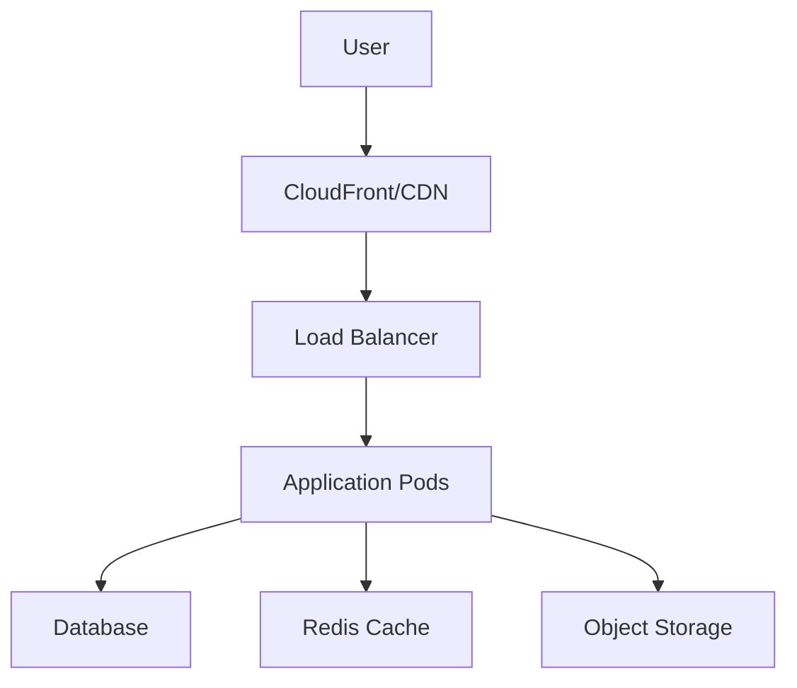
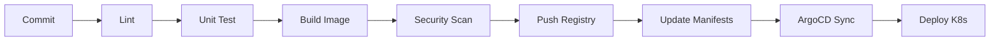

# 🎓 Capstone Project: Full DevOps Pipeline

> **Dự án tổng hợp - áp dụng tất cả kiến thức đã học**

---

## 📋 Tổng quan

Capstone Project là dự án cuối khóa, nơi bạn sẽ xây dựng **end-to-end DevOps pipeline** cho một ứng dụng thực tế.

### Mục tiêu

- ✅ Áp dụng tất cả 15 modules đã học
- ✅ Xây dựng production-grade infrastructure
- ✅ Văn bản hóa kiến thức
- ✅ Portfolio piece cho career

---

## 🎯 Project Options

Chọn 1 trong 3 projects sau:

### Option A: E-commerce Platform

**Mô tả:** Trang web bán hàng với các tính năng cơ bản

**Components:**

- Frontend: React/Vue
- Backend: Node.js/Python API
- Database: PostgreSQL
- Cache: Redis
- Search: Elasticsearch (optional)

### Option B: Blog Platform

**Mô tả:** Nền tảng blog với user authentication

**Components:**

- Frontend: Next.js/Nuxt
- Backend: Python Flask/FastAPI
- Database: PostgreSQL
- File storage: S3

### Option C: Task Management

**Mô tả:** Ứng dụng quản lý công việc (như Trello)

**Components:**

- Frontend: React
- Backend: Go/Node.js
- Database: MongoDB
- Real-time: WebSocket

---

## 📦 Requirements

### Infrastructure Requirements

| Category | Requirement |
|----------|-------------|
| **Code** | GitHub repository |
| **Containers** | Dockerized application |
| **Orchestration** | Kubernetes deployment |
| **CI** | Automated build & test |
| **CD** | GitOps with ArgoCD |
| **IaC** | Terraform + Ansible |
| **Monitoring** | Prometheus + Grafana |
| **Security** | Security scanning in CI |
| **Documentation** | Complete README, architecture diagrams |

### Deliverables

1. **Source Code Repository**
   - Application code
   - Dockerfile(s)
   - docker-compose.yml
   - Unit tests

2. **Infrastructure Repository**
   - Terraform configs
   - Ansible playbooks
   - Kubernetes manifests
   - Helm charts

3. **Documentation**
   - Architecture diagram
   - Setup instructions
   - Runbook for operations
   - Post-deployment verification

4. **Presentation**
   - Demo video (5-10 phút)
   - Slide deck explaining choices

---

## 🔨 Technical Specifications

### 1. Application Architecture



### 2. CI/CD Pipeline



### 3. Kubernetes Resources

```yaml
Required resources:
- Deployment (với HPA)
- Service (ClusterIP/LoadBalancer)
- Ingress
- ConfigMap
- Secret
- PersistentVolumeClaim
- NetworkPolicy
- ServiceAccount + RBAC
```

### 4. Observability

- Prometheus scraping application metrics
- Grafana dashboards (4+ panels)
- Alert rules (3+ alerts)
- Centralized logging

---

## 📅 Timeline (4 tuần)

### Week 1: Setup & Application

- [ ] Setup repositories
- [ ] Develop/adapt application
- [ ] Write unit tests
- [ ] Create Dockerfiles
- [ ] Local docker-compose working

### Week 2: CI Pipeline

- [ ] GitHub Actions workflow
- [ ] Automated testing
- [ ] Image build & push
- [ ] Security scanning
- [ ] Artifact versioning

### Week 3: Infrastructure & CD

- [ ] Terraform for cloud resources
- [ ] Kubernetes manifests/Helm
- [ ] ArgoCD setup
- [ ] GitOps workflow
- [ ] Deployment strategies

### Week 4: Observability & Documentation

- [ ] Prometheus + Grafana setup
- [ ] Alerting configuration
- [ ] Documentation complete
- [ ] Demo video
- [ ] Presentation

---

## ✅ Grading Rubric

### Total: 100 điểm

| Category | Points | Criteria |
|----------|--------|----------|
| **Application** | 15 | Dockerized, testable, follows best practices |
| **CI Pipeline** | 20 | Complete automation, testing, security scan |
| **Infrastructure** | 20 | Terraform, well-structured, reusable |
| **Kubernetes** | 20 | All resources, proper configuration |
| **Observability** | 10 | Metrics, dashboards, alerts |
| **Documentation** | 10 | Complete, clear, professional |
| **Presentation** | 5 | Clear explanation, demo works |

### Grading Scale

| Score | Grade | Status |
|-------|-------|--------|
| 90-100 | A | Excellent |
| 80-89 | B | Good |
| 70-79 | C | Satisfactory |
| 60-69 | D | Needs improvement |
| <60 | F | Not passing |

---

## 📝 Submission

### Required Files

```
capstone-project/
├── app/                    # Application source
│   ├── src/
│   ├── tests/
│   ├── Dockerfile
│   └── docker-compose.yml
│
├── infra/                  # Infrastructure
│   ├── terraform/
│   ├── ansible/
│   └── kubernetes/
│       ├── manifests/
│       └── helm/
│
├── .github/
│   └── workflows/          # CI/CD
│
├── monitoring/             # Observability
│   ├── prometheus/
│   └── grafana/
│
├── docs/
│   ├── architecture.md
│   ├── runbook.md
│   └── diagrams/
│
├── README.md
└── DEMO.md                 # Demo instructions
```

### How to Submit

1. Push code lên GitHub
2. Create release tag: `v1.0.0`
3. Upload demo video
4. Submit link via form/email

---

## 💡 Tips for Success

### Do's ✅

- Start early
- Commit often
- Document as you go
- Test locally first
- Ask for help if stuck

### Don'ts ❌

- Don't over-engineer
- Don't skip testing
- Don't hardcode secrets
- Don't leave without documentation
- Don't copy-paste blindly

---

## 🔗 Resources

### Templates

- [Terraform AWS modules](https://registry.terraform.io/namespaces/terraform-aws-modules)
- [Helm Chart Templates](https://helm.sh/docs/topics/charts/)
- [GitHub Actions Examples](https://github.com/actions/starter-workflows)

### References

- Course materials (Modules 01-15)
- Official documentation
- Community examples

---

## 🤝 Support

- GitHub Issues trong course repo
- Office hours (nếu có)
- Peer review với bạn học

---

**Chúc bạn hoàn thành dự án xuất sắc! 🎉**

Good luck!
