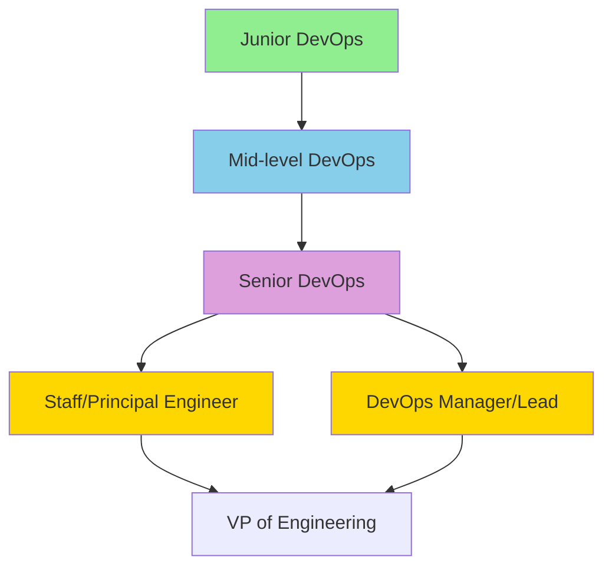

# 🚀 DevOps Career Path

> **Lộ trình sự nghiệp từ Junior đến Senior DevOps Engineer**

---

## 📊 Career Ladder

---

## 👶 Junior DevOps Engineer (0-2 năm)

### Mô tả

Mới bắt đầu, học hỏi là chính. Làm việc dưới sự hướng dẫn của senior.

### Salary Range (Vietnam)

| Location | Monthly (VND) | Yearly (VND) |
|----------|---------------|--------------|
| Hanoi/HCM | 12-20M | 144-240M |
| Remote (Global) | $800-1,500 | $10,000-18,000 |

### Skills Required

| Category | Skills |
|----------|--------|
| **OS** | Linux basics, CLI |
| **Version Control** | Git basics, GitHub |
| **Scripting** | Bash, Python basics |
| **Containers** | Docker basics |
| **CI/CD** | GitHub Actions basics |
| **Cloud** | AWS basics (EC2, S3) |

### Responsibilities

- ✅ Viết scripts automation đơn giản
- ✅ Maintain CI/CD pipelines
- ✅ Monitor systems, escalate issues
- ✅ Documentation
- ✅ Learn, learn, learn

### Success Criteria

- [ ] Tự troubleshoot basic issues
- [ ] Viết được Dockerfile
- [ ] Setup được CI pipeline đơn giản
- [ ] Hiểu networking cơ bản

---

## 🧑‍💻 Mid-level DevOps Engineer (2-5 năm)

### Mô tả

Có thể làm việc độc lập, lead small projects, mentor juniors.

### Salary Range (Vietnam)

| Location | Monthly (VND) | Yearly (VND) |
|----------|---------------|--------------|
| Hanoi/HCM | 25-40M | 300-480M |
| Remote (Global) | $2,000-4,000 | $24,000-48,000 |

### Skills Required

| Category | Skills |
|----------|--------|
| **OS** | Linux advanced, troubleshooting |
| **Containers** | Docker, Kubernetes |
| **IaC** | Terraform, Ansible |
| **CI/CD** | Complex pipelines, GitOps |
| **Cloud** | AWS/GCP multi-service |
| **Monitoring** | Prometheus, Grafana |
| **Security** | Basic DevSecOps |

### Responsibilities

- ✅ Design và implement CI/CD pipelines
- ✅ Manage Kubernetes clusters
- ✅ Infrastructure as Code
- ✅ Incident response
- ✅ Mentor junior engineers
- ✅ Cost optimization

### Success Criteria

- [ ] Design end-to-end delivery pipeline
- [ ] Manage production Kubernetes
- [ ] Handle incidents independently
- [ ] Có 1-2 certifications (CKA, AWS SAA)

---

## 🎖️ Senior DevOps Engineer (5-8 năm)

### Mô tả

Technical leader, làm quyết định architecture, define standards.

### Salary Range (Vietnam)

| Location | Monthly (VND) | Yearly (VND) |
|----------|---------------|--------------|
| Hanoi/HCM | 45-70M | 540-840M |
| Remote (Global) | $5,000-8,000 | $60,000-96,000 |

### Skills Required

| Category | Skills |
|----------|--------|
| **Architecture** | System design, scalability |
| **Cloud** | Multi-cloud, hybrid |
| **Security** | Full DevSecOps |
| **SRE** | SLOs, Error budgets |
| **Leadership** | Mentoring, code reviews |
| **Communication** | Cross-team collaboration |

### Responsibilities

- ✅ Define architecture và standards
- ✅ Lead infrastructure projects
- ✅ Capacity planning
- ✅ SRE practices implementation
- ✅ Team mentoring
- ✅ Vendor evaluation

### Success Criteria

- [ ] Lead major infrastructure initiatives
- [ ] Improve reliability metrics (DORA)
- [ ] Build và lead team
- [ ] Multiple advanced certifications

---

## 🌟 Staff/Principal Engineer (8+ năm)

### Mô tả

Định hướng kỹ thuật cho toàn tổ chức. IC (Individual Contributor) track.

### Salary Range (Vietnam)

| Location | Monthly (VND) | Yearly (VND) |
|----------|---------------|--------------|
| Hanoi/HCM | 80-120M | 960M-1.4B |
| Remote (Global) | $10,000-15,000 | $120,000-180,000 |

### Key Differences from Senior

- Organization-wide impact
- Define technical strategy
- Cross-team initiatives
- Industry thought leadership

---

## 👔 DevOps Manager/Lead (5+ năm)

### Mô tả

Quản lý team DevOps. Manager track (people management).

### Salary Range (Vietnam)

| Location | Monthly (VND) | Yearly (VND) |
|----------|---------------|--------------|
| Hanoi/HCM | 50-90M | 600M-1B |
| Remote (Global) | $6,000-12,000 | $72,000-144,000 |

### Skills Required

- Technical background (Senior DevOps level)
- People management
- Project management
- Budget planning
- Stakeholder management
- Hiring và team building

---

## 🔄 Related Roles

### Platform Engineer

Focus xây dựng internal developer platform.

**Skills:** K8s, Service Mesh, Developer Experience

### SRE (Site Reliability Engineer)

Focus vào reliability và operations.

**Skills:** SLOs, Incident management, Automation

### Cloud Architect

Focus vào cloud strategy và design.

**Skills:** Multi-cloud, Enterprise architecture

### Security Engineer (DevSecOps)

Focus vào security trong DevOps.

**Skills:** SAST/DAST, Compliance, Penetration testing

---

## 📈 Skill Matrix by Level

| Skill | Junior | Mid | Senior | Staff |
|-------|--------|-----|--------|-------|
| Linux | ⭐⭐ | ⭐⭐⭐ | ⭐⭐⭐⭐ | ⭐⭐⭐⭐⭐ |
| Git | ⭐⭐ | ⭐⭐⭐ | ⭐⭐⭐⭐ | ⭐⭐⭐⭐ |
| Docker | ⭐⭐ | ⭐⭐⭐⭐ | ⭐⭐⭐⭐⭐ | ⭐⭐⭐⭐⭐ |
| Kubernetes | ⭐ | ⭐⭐⭐ | ⭐⭐⭐⭐⭐ | ⭐⭐⭐⭐⭐ |
| CI/CD | ⭐⭐ | ⭐⭐⭐⭐ | ⭐⭐⭐⭐⭐ | ⭐⭐⭐⭐⭐ |
| Terraform | ⭐ | ⭐⭐⭐ | ⭐⭐⭐⭐⭐ | ⭐⭐⭐⭐⭐ |
| AWS/Cloud | ⭐⭐ | ⭐⭐⭐ | ⭐⭐⭐⭐ | ⭐⭐⭐⭐⭐ |
| Monitoring | ⭐ | ⭐⭐⭐ | ⭐⭐⭐⭐ | ⭐⭐⭐⭐⭐ |
| Security | ⭐ | ⭐⭐ | ⭐⭐⭐⭐ | ⭐⭐⭐⭐⭐ |
| System Design | - | ⭐⭐ | ⭐⭐⭐⭐ | ⭐⭐⭐⭐⭐ |
| Leadership | - | ⭐ | ⭐⭐⭐ | ⭐⭐⭐⭐⭐ |

---

## 🎯 Action Plan

### Year 1: Foundation

- [ ] Complete DevOps Mastery course
- [ ] Get AWS Cloud Practitioner
- [ ] Build portfolio (3-5 projects)
- [ ] Contribute to open source
- [ ] Land Junior DevOps role

### Year 2-3: Growth

- [ ] Get CKA và AWS SAA
- [ ] Lead small projects
- [ ] Mentor interns/juniors
- [ ] Public speaking/blogging
- [ ] Move to Mid-level

### Year 4-5: Specialization

- [ ] Deep expertise in 1-2 areas
- [ ] Get advanced certifications
- [ ] Lead major initiatives
- [ ] Industry recognition
- [ ] Move to Senior

### Year 6+: Leadership

- [ ] Choose IC or Manager track
- [ ] Build team/organization impact
- [ ] Thought leadership
- [ ] Conference speaking
- [ ] Staff/Principal or Manager level

---

## 💡 Tips for Career Growth

### Technical

- **Stay current** - Follow tech blogs, conferences
- **Hands-on** - Lab constantly
- **Deep before wide** - Master 1 thing before moving on
- **Share knowledge** - Blog, speak, mentor

### Professional

- **Build network** - Attend meetups, conferences
- **Visibility** - Make your work visible
- **Feedback** - Ask for và act on feedback
- **Document** - Keep track of achievements

### Personal

- **Work-life balance** - Avoid burnout
- **Health** - Physical và mental
- **Continuous learning** - Budget time weekly
- **Side projects** - Keep passion alive

---

## 📚 Recommended Reading

### Books

- **The Phoenix Project** - DevOps novel
- **The DevOps Handbook** - Practices guide
- **Site Reliability Engineering** - Google SRE
- **Infrastructure as Code** - Kief Morris
- **Accelerate** - DORA research

### Blogs

- [DevOps'ish](https://devopsish.com/)
- [CNCF Blog](https://www.cncf.io/blog/)
- [AWS Blog](https://aws.amazon.com/blogs/)
- [Hacker News](https://news.ycombinator.com/)

### Communities

- [CNCF Slack](https://slack.cncf.io/)
- [DevOps subreddit](https://www.reddit.com/r/devops/)
- [Kubernetes Slack](https://slack.k8s.io/)
- Local DevOps meetups

---

**Chúc bạn sự nghiệp thành công! 🚀**
