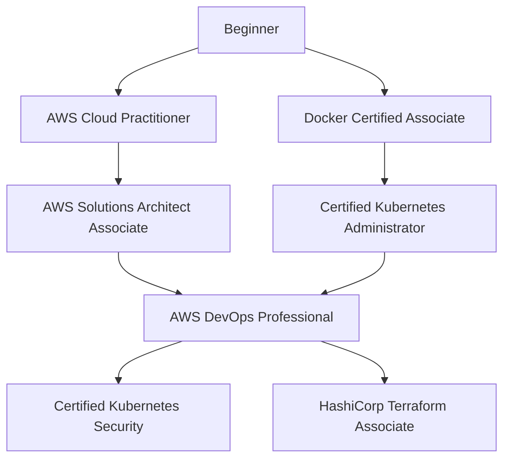

# 🎓 DevOps Certification Guide

> **Hướng dẫn lộ trình chứng chỉ DevOps từ cơ bản đến nâng cao**

---

## 📋 Tổng quan

Chứng chỉ giúp bạn:

- ✅ Chứng minh kiến thức với nhà tuyển dụng
- ✅ Học có hệ thống
- ✅ Tăng salary (trung bình +10-20%)
- ✅ Networking với cộng đồng

---

## 🗺️ Certification Roadmap



---

## 🏆 Recommended Certifications

### Tier 1: Foundation (0-1 năm kinh nghiệm)

| Cert | Provider | Cost | Difficulty | Time |
|------|----------|------|------------|------|
| AWS Cloud Practitioner | AWS | $100 | ⭐⭐ | 1-2 tháng |
| Azure Fundamentals (AZ-900) | Microsoft | $99 | ⭐⭐ | 1-2 tháng |
| GCP Cloud Digital Leader | Google | $99 | ⭐⭐ | 1-2 tháng |

### Tier 2: Associate (1-3 năm kinh nghiệm)

| Cert | Provider | Cost | Difficulty | Time |
|------|----------|------|------------|------|
| AWS Solutions Architect Associate | AWS | $150 | ⭐⭐⭐ | 2-3 tháng |
| CKA (Kubernetes Administrator) | CNCF | $395 | ⭐⭐⭐⭐ | 2-3 tháng |
| Terraform Associate | HashiCorp | $70 | ⭐⭐⭐ | 1-2 tháng |
| Docker Certified Associate | Docker | $195 | ⭐⭐⭐ | 1-2 tháng |

### Tier 3: Professional (3-5 năm kinh nghiệm)

| Cert | Provider | Cost | Difficulty | Time |
|------|----------|------|------------|------|
| AWS DevOps Professional | AWS | $300 | ⭐⭐⭐⭐⭐ | 3-4 tháng |
| CKS (Kubernetes Security) | CNCF | $395 | ⭐⭐⭐⭐⭐ | 2-3 tháng |
| CKAD (Kubernetes Developer) | CNCF | $395 | ⭐⭐⭐⭐ | 2-3 tháng |

---

## 📘 Chi tiết từng Certification

### 1. AWS Cloud Practitioner (CLF-C02)

**Về kỳ thi:**

- 65 câu multiple choice
- 90 phút
- 70% để pass
- Online hoặc test center

**Nội dung:**

- Cloud Concepts (24%)
- Security & Compliance (30%)
- Technology (34%)
- Billing & Pricing (12%)

**Resources:**

- [AWS Skill Builder](https://explore.skillbuilder.aws/) (Free)
- [Stephane Maarek Course](https://www.udemy.com/course/aws-certified-cloud-practitioner-new/)
- [Practice Exams - Tutorial Dojo](https://tutorialsdojo.com/)

**Tips:**

- Đọc kỹ AWS Whitepapers
- Làm nhiều practice exams
- Hiểu về shared responsibility model

---

### 2. AWS Solutions Architect Associate (SAA-C03)

**Về kỳ thi:**

- 65 câu multiple choice/multiple response
- 130 phút
- 72% để pass

**Nội dung:**

- Design Secure Architectures (30%)
- Design Resilient Architectures (26%)
- Design High-Performing Architectures (24%)
- Design Cost-Optimized Architectures (20%)

**Resources:**

- [Stephane Maarek SAA Course](https://www.udemy.com/course/aws-certified-solutions-architect-associate-saa-c03/)
- [Adrian Cantrill](https://learn.cantrill.io/)
- Hands-on labs với AWS Free Tier

**Tips:**

- Hands-on là quan trọng nhất
- Hiểu well-architected framework
- Focus vào real-world scenarios

---

### 3. Certified Kubernetes Administrator (CKA)

**Về kỳ thi:**

- Performance-based (hands-on)
- 2 giờ
- 66% để pass
- 15-20 tasks trong cluster thật

**Nội dung:**

- Cluster Architecture (25%)
- Workloads & Scheduling (15%)
- Services & Networking (20%)
- Storage (10%)
- Troubleshooting (30%)

**Resources:**

- [Mumshad Mannambeth CKA Course](https://www.udemy.com/course/certified-kubernetes-administrator-with-practice-tests/)
- [KillerCoda CKA](https://killercoda.com/cka)
- [Killer.sh](https://killer.sh/) - Exam simulator

**Tips:**

- Practice kubectl commands NHIỀU
- Tạo aliases để tiết kiệm thời gian
- Bookmark K8s documentation

**Aliases hữu ích:**

```bash
alias k=kubectl
alias kgp='kubectl get pods'
alias kgs='kubectl get svc'
alias kd='kubectl describe'
export do='--dry-run=client -o yaml'
```

---

### 4. Terraform Associate (003)

**Về kỳ thi:**

- 57 câu multiple choice
- 60 phút
- 70% để pass

**Nội dung:**

- IaC concepts
- Terraform purpose & basics
- Terraform CLI
- Modules
- State
- Read, generate, modify config

**Resources:**

- [HashiCorp Learn](https://learn.hashicorp.com/terraform)
- [Terraform Documentation](https://www.terraform.io/docs)
- [Practice Exams](https://www.udemy.com/course/terraform-associate-practice-exam/)

**Tips:**

- Hands-on với AWS + Terraform
- Hiểu state management
- Study Terraform Cloud features

---

### 5. AWS DevOps Professional (DOP-C02)

**Về kỳ thi:**

- 75 câu
- 180 phút
- 75% để pass
- Khó nhất trong AWS certs

**Nội dung:**

- SDLC Automation (22%)
- Configuration Management & IaC (17%)
- Resilient Cloud Solutions (15%)
- Monitoring & Logging (15%)
- Incident & Event Response (14%)
- Security & Compliance (17%)

**Prerequisites:**

- AWS SAA hoặc SysOps Associate
- 2+ năm kinh nghiệm AWS
- Strong hands-on experience

**Resources:**

- [Stephane Maarek DevOps Pro](https://www.udemy.com/course/aws-certified-devops-engineer-professional-hands-on/)
- AWS Whitepapers (bắt buộc đọc)
- AWS re:Invent videos

---

## 📅 Study Plan Examples

### 3-Month Plan: CKA

| Tuần | Focus |
|------|-------|
| 1-2 | K8s basics, Pods, Deployments |
| 3-4 | Services, Networking, Ingress |
| 5-6 | Storage, ConfigMaps, Secrets |
| 7-8 | RBAC, Security |
| 9-10 | Troubleshooting, Practice |
| 11-12 | Mock exams, Review |

### 2-Month Plan: Terraform Associate

| Tuần | Focus |
|------|-------|
| 1-2 | IaC concepts, Terraform basics |
| 3-4 | Resources, Providers, Variables |
| 5-6 | State, Modules |
| 7-8 | Practice exams, Review |

---

## 💡 General Tips

### Trước khi thi

- [ ] Đăng ký thi 2-4 tuần trước
- [ ] Test equipment (online proctored)
- [ ] Làm ít nhất 3 mock exams
- [ ] Score 80%+ trong mock trước khi thi thật

### Trong khi thi

- [ ] Đọc kỹ câu hỏi
- [ ] Flag câu khó, quay lại sau
- [ ] Quản lý thời gian
- [ ] Đừng để trống câu nào

### Sau khi thi

- [ ] Đánh giá điểm yếu
- [ ] Update LinkedIn
- [ ] Plan certification tiếp theo

---

## 💰 Cost Optimization

### Free Resources

- AWS Skill Builder
- Microsoft Learn
- Google Cloud Skills Boost
- HashiCorp Learn
- Kubernetes.io tutorials

### Discounts

- AWS exam vouchers từ training
- CNCF discount codes (follow Twitter)
- Black Friday deals trên Udemy
- Company sponsorship

---

## 🎯 Recommended Order

### For Cloud-focused DevOps

1. AWS Cloud Practitioner
2. AWS Solutions Architect Associate
3. Terraform Associate
4. AWS DevOps Professional

### For Container-focused DevOps

1. Docker Certified Associate
2. CKA (Kubernetes Administrator)
3. CKAD (Kubernetes Developer)
4. CKS (Kubernetes Security)

### Balanced Path

1. AWS Cloud Practitioner
2. CKA
3. Terraform Associate
4. AWS DevOps Professional

---

## 🔗 Resources

### Official

- [AWS Certification](https://aws.amazon.com/certification/)
- [CNCF Certifications](https://training.linuxfoundation.org/certification/certified-kubernetes-administrator-cka/)
- [HashiCorp Certifications](https://www.hashicorp.com/certification)

### Practice

- [Whizlabs](https://www.whizlabs.com/)
- [Tutorial Dojo](https://tutorialsdojo.com/)
- [Killer.sh](https://killer.sh/)

### Community

- [r/AWSCertifications](https://www.reddit.com/r/AWSCertifications/)
- [CNCF Slack](https://slack.cncf.io/)

---

**Chúc bạn thi đậu! 🎉**
