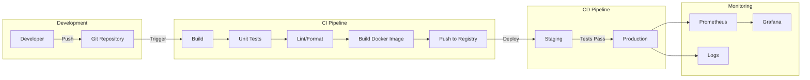
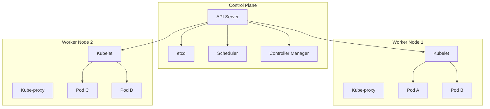
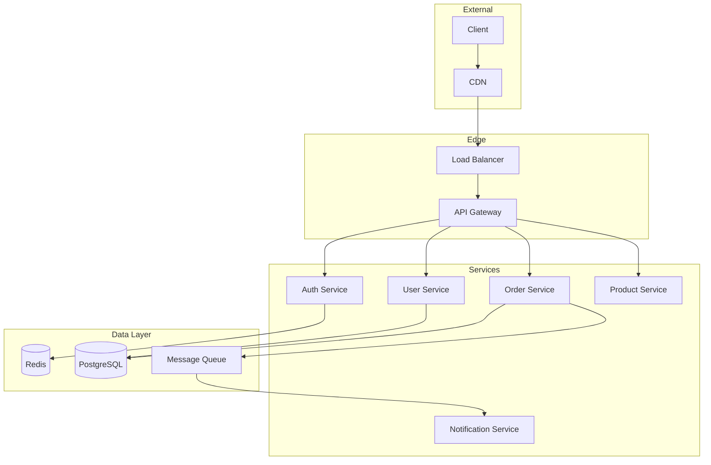
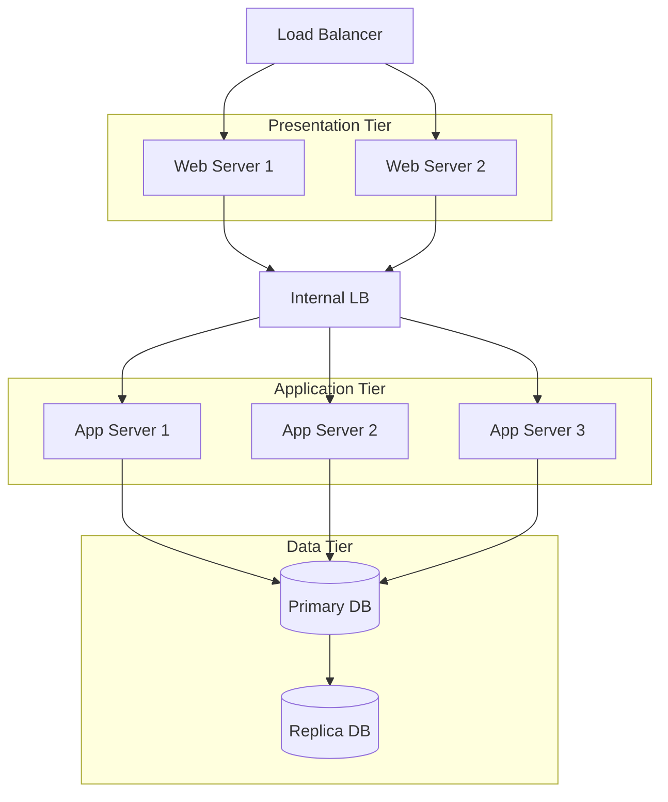
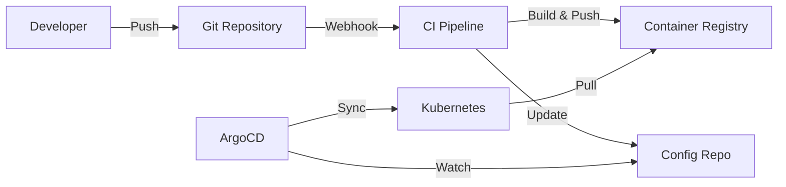
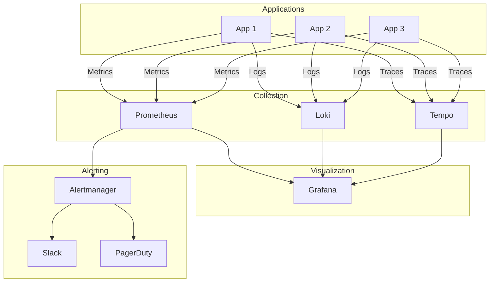
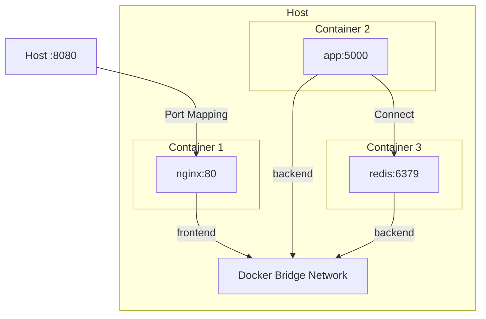
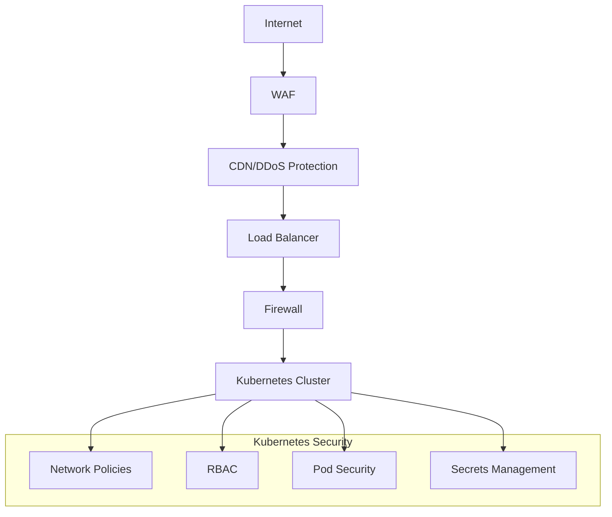
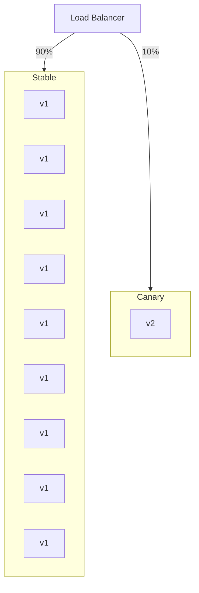
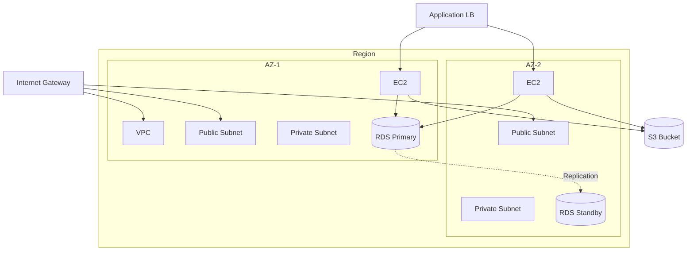

# 🎨 DevOps Architecture Diagrams

> **Sơ đồ kiến trúc DevOps phổ biến**

---

## 1. CI/CD Pipeline



---

## 2. Kubernetes Architecture



---

## 3. Microservices Architecture



---

## 4. Three-Tier Architecture



---

## 5. GitOps Workflow



---

## 6. Observability Stack



---

## 7. Docker Networking



---

## 8. Security Layers



---

## 9. Deployment Strategies

### Rolling Update

```mermaid
graph LR
    subgraph Before
        V1_1[v1]
        V1_2[v1]
        V1_3[v1]
    end
    
    subgraph Update 1
        V1_A[v1]
        V1_B[v1]
        V2_A[v2]
    end
    
    subgraph Update 2
        V1_C[v1]
        V2_B[v2]
        V2_C[v2]
    end
    
    subgraph After
        V2_D[v2]
        V2_E[v2]
        V2_F[v2]
    end
    
    Before --> Update 1 --> Update 2 --> After
```

### Blue-Green

```mermaid
graph TD
    LB[Load Balancer]
    
    subgraph Blue Environment
        B1[v1]
        B2[v1]
    end
    
    subgraph Green Environment
        G1[v2]
        G2[v2]
    end
    
    LB -->|100%| Blue Environment
    LB -.->|0%| Green Environment
```

### Canary



---

## 10. Cloud Infrastructure



---

## 📖 Cách sử dụng diagrams

1. **Study**: Xem để hiểu kiến trúc
2. **Present**: Dùng trong presentations
3. **Document**: Copy vào documentation
4. **Reference**: Xem khi thiết kế hệ thống

**Mermaid** có thể render trong:

- GitHub Markdown
- GitLab Markdown  
- VS Code (với extension)
- Notion
- Obsidian

---

**💡 Tip**: Tạo diagrams riêng cho project của bạn!
