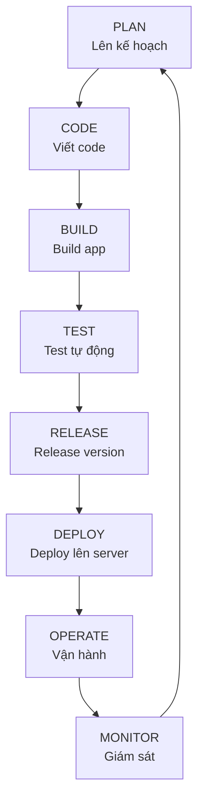

# Module 00: SETUP - Chuẩn bị môi trường làm việc

> **"Một khởi đầu tốt là nửa thành công"**

---

## 📚 Mục lục

1. [Giới thiệu](#1-giới-thiệu)
2. [Tại sao cần setup đúng cách?](#2-tại-sao-cần-setup-đúng-cách)
3. [Tools cần cài đặt](#3-tools-cần-cài-đặt)
4. [Windows Setup (WSL2)](#4-windows-setup-wsl2)
5. [macOS Setup](#5-macos-setup)
6. [Linux Setup](#6-linux-setup)
7. [Download tà liệu khóa học](#7-download-tài-liệu-khóa-học)
8. [Tạo tài khoản](#8-tạo-tài-khoản)
9. [Verification](#9-verification)
10. [Troubleshooting](#10-troubleshooting)
11. [Tổng kết](#11-tổng-kết)

---

## 1. Giới thiệu

### 🎯 Mục tiêu module này

Sau khi hoàn thành module 00, bạn sẽ có:

- ✅ **Môi trường terminal** (WSL2 cho Windows, native cho macOS/Linux)
- ✅ **VS Code** configured với extensions cần thiết
- ✅ **Tài liệu khóa học** downloaded về máy (**KHÔNG** dùng git clone)
- ✅ **Tài khoản** GitHub và Docker Hub
- ✅ **Verification** môi trường sẵn sàng

### 📖 DevOps là gì?

**DevOps** = **Dev**elopment (Phát triển) + **Op**eration**s** (Vận hành)

#### Câu chuyện minh họa

Tưởng tượng bạn mở một nhà hàng:

```
NHÀ HÀNG TRUYỀN THỐNG:
┌─────────────────────────────────────┐
│  Bếp (Dev)          Phục vụ (Ops)   │
│    │                    │            │
│    │ "Món ăn xong!"    │            │
│    └──────────X────────┘            │
│         Không nói chuyện            │
│         với nhau                    │
│    → Món nguội trước khi ra bàn    │
│    → Khách chờ lâu                  │
│    → Đánh giá 1 sao ⭐             │
└─────────────────────────────────────┘

NHÀ HÀNG DEVOPS:
┌─────────────────────────────────────┐
│  Bếp + Phục vụ (DevOps Team)       │
│    │         │                      │
│    └────┬────┘                      │
│    Làm việc cùng nhau               │
│    Communication liên tục           │
│    → Món nóng hổi ra bàn nhanh     │
│    → Khách hài lòng                 │
│    → Đánh giá 5 sao ⭐⭐⭐⭐⭐  │
└─────────────────────────────────────┘
```

**Trong thế giới công nghệ:**

| Trước DevOps | Với DevOps |
|--------------|------------|
| Dev viết code → Ném qua tường cho Ops deploy | Dev + Ops collaborate từ đầu |
| Deploy mất vài tuần, nhiều lỗi | Deploy nhiều lần/ngày, ít lỗi |
| "Works on my machine!" (máy tôi chạy được!) | "Works everywhere!" (CI/CD testing) |
| Manual deployment (copy-paste commands) | Automated (1 click deploy) |
| Blame culture (tìm người đổ lỗi) | Blameless post-mortems (học từ lỗi) |

#### DevOps Culture - Quan trọng hơn Tools

DevOps KHÔNG chỉ là Docker, Kubernetes, Jenkins... DevOps là **văn hóa làm việc**:

1. **Automation** - Tự động hóa mọi thứ có thể
2. **Collaboration** - Dev + Ops cùng team
3. **Continuous Improvement** - Luôn cải thiện
4. **Measure Everything** - Đo lường để cải thiện
5. **Fail Fast** - Phát hiện lỗi sớm, sửa nhanh

#### Vòng đời DevOps



Trong khóa học này, bạn sẽ học **TẤT CẢ** các giai đoạn trên!

---

## 2. Tại sao cần setup đúng cách?

### 📖 Câu chuyện có thật

> Năm 2018, tôi là sinh viên năm 3 bắt đầu học DevOps. Ngày đầu tiên, thầy giáo nói: "Các em về cài Docker, Kubernetes, Terraform, Ansible... tuần sau học."
>
> Tôi về nhà, Google "How to install Docker on Windows", copy-paste commands không hiểu gì. Sau 4 tiếng mày mò:
>
> - Docker cài xong nhưng không chạy được
> - PowerShell báo lỗi liên tục
> - Vào lớp tuần sau, ngồi nghe thầy demo mà không làm gì được
>
> Sau đó mất thêm 2 ngày để uninstall hết, cài lại từ đầu đúng cách mới chạy được.
>
> **Bài học:** Setup đúng từ đầu = tiết kiệm 90% thời gian sau này.

### 🎯 Nguyên tắc setup đúng

#### 1. Cài đúng thứ tự

**SAI:**

```
1. Cài Docker
2. Cài Git  
3. Cài WSL2 (trên Windows)
→ Docker không hoạt động vì cài trước WSL2
```

**ĐÚNG:**

```
1. Cài WSL2 (Windows) hoặc setup Terminal (macOS/Linux)
2. Cài Git
3. Cài Docker
→ Mọi thứ hoạt động smooth
```

#### 2. Verify từng bước

Sau mỗi bước cài đặt, PHẢI chạy lệnh để verify:

```bash
# Ví dụ: Sau khi cài Git
git --version
# Phải thấy: git version 2.x.x

# Nếu thấy: command not found
# → Chưa cài đúng, phải fix trước khi tiếp tục
```

**Tại sao quan trọng?**

- Phát hiện lỗi sớm
- Không bị chồng chất lỗi
- Dễ debug

#### 3. Document lại

Ghi chép lại những gì bạn làm:

```markdown
# My Setup Log

## 2025-01-15: Cài WSL2
- Ran: wsl --install
- Restarted computer
- Created user: john
- ✅ Verified: wsl.exe --list

## 2025-01-15: Cài Git
- Ran in WSL: sudo apt install git
- ✅ Verified: git --version → 2.40.1
```

**Lợi ích:**

- Khi có lỗi, biết đã làm gì
- Share với bạn bè gặp vấn đề tương tự
- Tham khảo lại sau này

---

## 3. Tools cần cài đặt

### 📊 Overview

| Tool | Mục đích | Dùng ở Module | Bắt buộc? |
|------|----------|---------------|-----------|
| **Terminal/WSL2** | Môi trường dòng lệnh | Tất cả | ✅ CÓ |
| **VS Code** | Code editor | Tất cả | ✅ CÓ |
| **Git** | Version control | 02, 06, 08 | ✅ CÓ (sẽ dùng sau) |
| **Docker** | Containerization | 05, 06, 08 | ✅ CÓ (sẽ dùng sau) |
| **Node.js** | JavaScript runtime | 04, Final Project | ⚠️ Optional |
| **Python** | Programming language | Final Project | ⚠️ Optional |

### ❌ Những gì KHÔNG cần cài ngay

- **Kubernetes** (kubectl, minikube) - Sẽ học ở ADVANCED track
- **Terraform** - Sẽ học ở ADVANCED track
- **Ansible** - Sẽ học ở ADVANCED track
- **AWS CLI** - Sẽ cài khi cần
- **PostgreSQL, MySQL** - Chưa cần ngay

**Lý do:** Cài quá nhiều thứ một lúc → confusing và dễ lỗi.

### 🗓️ Timeline cài đặt

```
Module 00 (Bây giờ):
├── Terminal/WSL2 ✅
├── VS Code ✅
└── Download tài liệu ✅

Module 02 (Tuần 3):
└── Git (học rồi mới cài)

Module 05 (Tuần 5):
└── Docker

Module 06:
└── Node.js (nếu cần)
```

---

## 4. Windows Setup (WSL2)

### 4.1. Giới thiệu WSL2

**WSL là gì?**

- **WSL** = Windows Subsystem for Linux
- Cho phép chạy Linux bên trong Windows
- **WSL2** = Phiên bản 2, dùng Linux kernel thật

**Tại sao cần WSL2?**

```
DevOps Tools được design cho Linux:
┌─────────────────────────────────────┐
│  Tool       │ Windows  │ Linux      │
├─────────────┼──────────┼────────────┤
│  Docker     │ OK       │ Tốt hơn    │
│  Ansible    │ KHÔNG    │ OK         │
│  kubectl    │ OK       │ Tốt hơn    │
│  Terraform  │ OK       │ Tốt hơn    │
│  Shell      │ PowerShell│ Bash (chuẩn)│
└─────────────────────────────────────┘

→ 90% production servers chạy Linux
→ Học trên WSL2 = Giống production
```

**WSL2 vs Virtual Machine**

| Feature | WSL2 | VirtualBox VM |
|---------|------|---------------|
| Tốc độ | Nhanh (gần native) | Chậm hơn |
| Khởi động | 1-2 giây | 30-60 giây |
| RAM usage | Ít (2-4GB) | Nhiều (4-8GB) |
| File sharing | Dễ | Phức tạp |
| Integrate với Windows | Tốt | Khó |

→ **WSL2 win!**

### 4.2. Kiểm tra Windows version

**Bước 1: Kiểm tra version**

```powershell
# Mở PowerShell (KHÔNG cần Admin)
# Cách 1: Start → gõ "PowerShell" → Mở
# Cách 2: Nhấn Win+R → gõ "powershell" → Enter

# Chạy lệnh:
winver
```

**Output mong đợi:**

Cửa sổ "About Windows" hiện ra, check:

```
✅ Windows 10 version 2004 (Build 19041) trở lên
HOẶC
✅ Windows 11 (bất kỳ version nào)
```

**Nếu version CŨ HƠN:**

Windows 10 < 2004 hoặc Windows 7/8:

1. Vào Settings → Update & Security → Windows Update
2. Click "Check for updates"
3. Install tất cả updates
4. Restart và check lại

**Vẫn không update được?**

- Windows 7/8 → Phải upgrade lên Windows 10/11
- Windows 10 quá cũ → Có thể OS đã hết support, cần upgrade

### 4.3. Cài đặt WSL2

**Bước 1: Mở PowerShell as Administrator**

```
Cách 1 (Windows 11):
1. Right-click Start menu
2. Click "Windows Terminal (Admin)"

Cách 2 (Windows 10):
1. Start → Gõ "PowerShell"
2. Right-click "Windows PowerShell"
3. Click "Run as administrator"
4. Nếu UAC hỏi → Click "Yes"
```

**Bước 2: Chạy lệnh cài đặt**

```powershell
wsl --install
```

**Giải thích lệnh:**

```powershell
wsl           # Windows Subsystem for Linux command
--install      # Install WSL2 + Ubuntu (default distribution)
```

**Output mỗng đợi:**

```
Installing: Windows Subsystem for Linux
Installing: Virtual Machine Platform
Downloading: Ubuntu
...
The requested operation is successful.
Changes will not be effective until the system is rebooted.
```

**Nếu có lỗi:**
→ Xem [Troubleshooting](#10-troubleshooting) section

**Bước 3: Restart máy tính**

```
PHẢI restart để WSL2 hoạt động!

1. Close tất cả apps
2. Start → Power → Restart
3. Chờ máy restart (2-5 phút)
```

**Bước 4: First-time Ubuntu setup**

Sau khi restart, một trong hai sẽ xảy ra:

**Scenario A: Ubuntu tự động mở**

```
Ubuntu terminal window mở với:
Installing, this may take a few minutes...
```

Chờ 2-5 phút để hoàn tất.

**Scenario B: Không tự động mở**

```
Start → Gõ "Ubuntu" → Click "Ubuntu" app
```

**Tạo user và password:**

```bash
# Terminal sẽ hỏi:
Enter new UNIX username:
```

**Quan trọng - Quy tắc username:**

- ✅ Chữ thường: `john`, `thanh`, `admin`, `devops`
- ❌ Chữ hoa: `John`, `ADMIN`
- ❌ Có space: `john smith`
- ❌ Ký tự đặc biệt: `john@123`, `user!`
- ✅ Có số OK: `john123`, `user01`

**Nhập password:**

```bash
# Sau khi nhập username, terminal hỏi:
New password:
```

⚠️ **QUAN TRỌNG:**

- Khi gõ password, bạn SẼ KHÔNG THẤY GÌ trên màn hình
- Đây là tính năng bảo mật của Linux (không hiển thị *, không hiển thị gì cả)
- Cứ gõ bình thường rồi nhấn Enter

```bash
New password: [gõ password - không thấy gì]
Retype new password: [gõ lại password - không thấy gì]
```

**Thành công khi thấy:**

```bash
passwd: password updated successfully
Installation successful!

john@DESKTOP-ABC123:~$
```

Dòng này có nghĩa:

- `john` = username của bạn
- `@DESKTOP-ABC123` = tên máy tính
- `:~` = đang ở home directory
- `$` = prompt (sẵn sàng nhận lệnh)

### 4.4. Cài Windows Terminal (Khuyến nghị)

**Tại sao cần Windows Terminal?**

| Feature | PowerShell cũ | Windows Terminal |
|---------|---------------|------------------|
| Tabs | Không | Có (như Chrome tabs) |
| Color scheme | Basic | Nhiều themes đẹp |
| Font | Cũ | Hỗ trợ Nerd Fonts, icons |
| Performance | Chậm | Nhanh |
| Split panes | Không | Có |

**Cách cài:**

```powershell
# Option 1: Microsoft Store (Dễ nhất)
1. Mở Microsoft Store
2. Tìm "Windows Terminal"
3. Click "Get" / "Install"

# Option 2: winget (nếu có)
winget install Microsoft.WindowsTerminal
```

**Sau khi cài, set làm default:**

1. Mở Windows Terminal
2. Click dropdown arrow bên cạnh tabs (hoặc Ctrl+,)
3. Settings → Startup → Default profile → Chọn "Ubuntu"
4. Save

Từ giờ mở Windows Terminal = vào thẳng Ubuntu!

### 4.5. Cài VS Code + Remote WSL Extension

**Bước 1: Download VS Code**

1. Vào <https://code.visualstudio.com>
2. Click "Download for Windows"
3. Run installer
4. **Quan trọng:** Khi cài, check ✅ "Add to PATH"

**Bước 2: Cài Extension "Remote - WSL"**

```
1. Mở VS Code
2. Click Extensions icon (bên trái, hoặc Ctrl+Shift+X)
3. Tìm "Remote - WSL"
4. Click "Install" trên extension của Microsoft
```

**Bước 3: Test VS Code + WSL**

```bash
# Trong Ubuntu terminal:
cd ~
mkdir test-vscode
cd test-vscode
code .
```

**Kỳ vọng:**

- VS Code mở lên
- Góc dưới trái thấy: "WSL: Ubuntu"
- Nếu lần đầu, sẽ install "VS Code Server" (chờ 1-2 phút)

**Screenshot minh họa:**

```
VS Code window:
┌────────────────────────────────────────┐
│ File Edit View ...                     │
├────────────────────────────────────────┤
│                                        │
│     Welcome to VS Code!                │
│                                        │
│                                        │
├────────────────────────────────────────┤
│ WSL: Ubuntu  Ln 1, Col 1    UTF-8     │ ← Check dòng này!
└────────────────────────────────────────┘
```

✅ Nếu thấy "WSL: Ubuntu" → **Setup thành công!**

---

## 5. macOS Setup

### 5.1. Terminal đã sẵn sàng

macOS đã có Terminal built-in (Unix-based), không cần cài WSL2.

**Test Terminal:**

```bash
# Mở Terminal:
# Command+Space → gõ "Terminal" → Enter

# Chạy lệnh test:
echo "Hello DevOps!"
# Output: Hello DevOps!
```

### 5.2. Cài Homebrew (Package Manager)

**Homebrew là gì?**

- Package manager cho macOS (giống `apt` trên Linux)
- Cài software bằng command line
- Essential cho DevOps

**Cài đặt:**

```bash
/bin/bash -c "$(curl -fsSL https://raw.githubusercontent.com/Homebrew/install/HEAD/install.sh)"
```

**Giải thích:**

- `curl` = Download script
- `bash -c "..."` = Chạy script đó

**Trong quá trình cài:**

- Sẽ hỏi password macOS → Nhập password (không hiển thị)
- Có thể mất 5-10 phút
- Đọc messages và làm theo hướng dẫn

**Sau khi cài xong, verify:**

```bash
brew --version
# Output: Homebrew 4.x.x
```

**Nếu báo "command not found":**

Check messages cuối cùng của script cài đặt, thường sẽ có:

```bash
# Chạy 2 lệnh này để add Homebrew vào PATH:
echo 'eval "$(/opt/homebrew/bin/brew shellenv)"' >> ~/.zprofile
eval "$(/opt/homebrew/bin/brew shellenv)"
```

### 5.3. Cài VS Code

**Option 1: Download từ web**

1. Vào <https://code.visualstudio.com>
2. Download for macOS
3. Mở file .dmg
4. Kéo VS Code vào Applications folder

**Option 2: Via Homebrew**

```bash
brew install --cask visual-studio-code
```

**Setup `code` command:**

1. Mở VS Code
2. Cmd+Shift+P (Command Palette)
3. Gõ: "Shell Command: Install 'code' command in PATH"
4. Click

**Test:**

```bash
# Trong Terminal:
cd ~
mkdir test-vscode
cd test-vscode
code .
# VS Code phải mở folder này
```

---

## 6. Linux Setup

### Bạn đã có Linux! 🎉

Nếu bạn đang dùng Linux (Ubuntu, Fedora, Arch, ...):

- ✅ Terminal sẵn sàng
- ✅ Package manager sẵn sàng (apt/yum/pacman)
- ✅ Native environment - không cần WSL2

### Update system

```bash
# Ubuntu/Debian:
sudo apt update && sudo apt upgrade -y

# Fedora:
sudo dnf upgrade -y

# Arch:
sudo pacman -Syu
```

### Cài VS Code

**Ubuntu/Debian:**

```bash
# Download .deb file
wget -O vscode.deb 'https://code.visualstudio.com/sha/download?build=stable&os=linux-deb-x64'

# Install
sudo dpkg -i vscode.deb

# Fix dependencies nếu có
sudo apt install -f
```

**Fedora:**

```bash
sudo rpm --import https://packages.microsoft.com/keys/microsoft.asc
sudo sh -c 'echo -e "[code]\nname=Visual Studio Code\nbaseurl=https://packages.microsoft.com/yumrepos/vscode\nenabled=1\ngpgcheck=1\ngpgkey=https://packages.microsoft.com/keys/microsoft.asc" > /etc/yum.repos.d/vscode.repo'
sudo dnf install code
```

**Test:**

```bash
code --version
```

---

## 7. Download tài liệu khóa học

### ⚠️ QUAN TRỌNG: Tại sao KHÔNG dùng `git clone`?

**SAI - Đừng làm bây giờ:**

```bash
# ❌ ĐỪNG chạy lệnh này
git clone https://github.com/your-org/DevOpsTraining.git
```

**Tại sao SAI?**

1. **Chưa học Git** - Git ở Module 02, chúng ta đang ở Module 00!
2. **Chưa cài Git** - Sẽ cài sau khi học lý thuyết Git
3. **Gây confuse** - Người mới sẽ không hiểu `git clone` là gì

**ĐÚNG - Làm cách này:**

### Method 1: Download ZIP qua Browser (Khuyến nghị)

**Bước 1: Mở browser**

```
1. Mở Chrome/Firefox/Edge
2. Vào: https://github.com/thanhlehoang0107/DevOpsTraining
```

**Bước 2: Download ZIP**

```
1. Click nút "Code" (màu xanh lá)
2. Click "Download ZIP"
3. Chờ download (file ~50-100MB)
```

**Bước 3: Giải nén**

**Windows:**

```powershell
# Mở File Explorer
# Tìm file DevOpsTraining-main.zip trong Downloads
# Right-click → Extract All → Chọn C:\DevOps\
```

**macOS:**

```bash
# File sẽ auto giải nén khi download
# Di chuyển folder vào ~/DevOps/
mkdir -p ~/DevOps
mv ~/Downloads/DevOpsTraining-main ~/DevOps/
```

**Linux:**

```bash
mkdir -p ~/DevOps
unzip ~/Downloads/DevOpsTraining-main.zip -d ~/DevOps/
```

**Bước 4: đổi tên folder (tùy chọn)**

Default name: `DevOpsTraining-main`
→ Đổi thành: `DevOpsTraining`

**Windows WSL:**

```bash
# Trong WSL terminal:
cd /mnt/c/DevOps
mv DevOpsTraining-main DevOpsTraining
```

**macOS/Linux:**

```bash
cd ~/DevOps
mv DevOpsTraining-main DevOpsTraining
```

**Bước 5: Verify**

```bash
# Windows (WSL):
cd /mnt/c/DevOps/DevOpsTraining
ls

# macOS/Linux:
cd ~/DevOps/DevOpsTraining
ls
```

**Output mong đợi:**

```
FOUNDATION/  ADVANCED/  PROJECTS/  SHARED/  README.md  ...
```

✅ Nếu thấy các folder này → **Download thành công!**

### Method 2: Download bằng wget/curl (Advanced)

**Nếu bạn quen với command line:**

```bash
# Tạo thư mục
mkdir -p ~/DevOps
cd ~/DevOps

# Download ZIP
wget https://github.com/thanhlehoang0107/DevOpsTraining/archive/refs/heads/main.zip

# hoặc dùng curl:
curl -L -O https://github.com/thanhlehoang0107/DevOpsTraining/archive/refs/heads/main.zip

# Giải nén
unzip main.zip

# Đổi tên
mv DevOpsTraining-main DevOpsTraining

# Dọn dẹp
rm main.zip

# Verify
cd DevOpsTraining
ls
```

---

## 8. Tạo tài khoản

### 8.1. GitHub Account

**Tại sao cần GitHub?**

- Lưu trữ code
- Collaborate với team
- Portfolio để HR xem
- GitHub Actions (CI/CD)
- Deploy websites (GitHub Pages)

**Cách tạo:**

**Bước 1: Truy cập**

```
1. Mở browser
2. Vào https://github.com
3. Click "Sign up"
```

**Bước 2: Điền thông tin**

```
Email: your-email@gmail.com
Password: [tạo password mạnh]
Username: your-username

💡 Tips chọn username:
✅ Tốt: john-doe, thanh-dev, devops-engineer
❌ Tránh: john123xyz, abc-def-xyz (khó nhớ)
```

**Bước 3: Verify email**

```
1. Check email inbox
2. Click link verification từ GitHub
3. Return to GitHub
```

**Bước 4: Complete profile (Optional nhưng nên làm**

```
1. Click avatar (góc phải trên) → Settings
2. Upload avatar
3. Fill Bio: "DevOps Engineer in training"
4. Add location, website (nếu có)
```

**Verify thành công:**

Visit: `https://github.com/your-username`

Thấy profile page → ✅ OK!

### 8.2. Docker Hub Account

**Tại sao cần Docker Hub?**

- Lưu trữ Docker images
- Share images publicly
- Pull official images (nginx, postgres, redis, ...)

**Cách tạo:**

```
1. Vào https://hub.docker.com
2. Click "Sign up"
3. Điền:
   - Docker ID: [giống GitHub username cho dễ nhớ]
   - Email: [dùng cùng email với GitHub]
   - Password: [password mạnh]
4. Verify email
```

**Verify:**

Visit: `https://hub.docker.com/u/your-docker-id`

### 8.3. Lưu thông tin tài khoản

**Tạo file để nhớ:**

```bash
# Tạo file text lưu thông tin (KHÔNG commit file này lên GitHub!)
cd ~/DevOps
nano my-accounts.txt
```

Nội dung:

```
DEVOPS TRAINING - MY ACCOUNTS
=============================

GitHub:
- Username: your-github-username  
- Email: your-email@gmail.com
- Profile: https://github.com/your-username

Docker Hub:
- Docker ID: your-docker-id
- Email: your-email@gmail.com
- Profile: https://hub.docker.com/u/your-docker-id

Notes:
- Passwords stored in password manager (LastPass/1Password/Bitwarden)
- 2FA enabled on GitHub: YES/NO
```

Save: Ctrl+O, Enter, Ctrl+X

⚠️ **KHÔNG lưu passwords trong file text!**
→ Dùng password manager

---

## 9. Verification

### Chạy Verification Script

**Windows (WSL):**

```bash
cd /mnt/c/DevOps/DevOpsTraining/FOUNDATION/00_SETUP/scripts
bash verify-linux.sh
```

**macOS:**

```bash
cd ~/DevOps/DevOpsTraining/FOUNDATION/00_SETUP/scripts
bash verify-mac.sh
```

**Linux:**

```bash
cd ~/DevOps/DevOpsTraining/FOUNDATION/00_SETUP/scripts
bash verify-linux.sh
```

### Expected Output

```
====================================
DevOps Training - Environment Check
====================================

✅ Operating System: Ubuntu 22.04.3 LTS (WSL2)
✅ Shell: bash 5.1.16
✅ VS Code: Detected (version 1.85.0)
✅ Terminal: Windows Terminal
✅ Internet: Connected
✅ Disk space: 45.2 GB free
✅ Course materials: Found at /mnt/c/DevOps/DevOpsTraining

Accounts:
✅ GitHub account: Created (check https://github.com/YOUR-USERNAME)
✅ Docker Hub account: Created (check https://hub.docker.com/u/YOUR-ID)

====================================
🎉 STATUS: READY FOR MODULE 01!
====================================

Next steps:
1. Read Module 01 README carefully
2. Complete all Module 01 labs
3. Join our Discord: https://discord.gg/devops-training

Happy learning! 🚀
```

### Nếu có ❌ (lỗi)

Check từng item:

**❌ VS Code not detected**
→ Reinstall VS Code, make sure "Add to PATH" was checked

**❌ Internet: Not connected**
→ Check WiFi/Ethernet

**❌ Course materials not found**
→ Re-download và đặt đúng vị trí

**❌ Disk space < 20GB**
→ Free up space (delete unused files/apps)

---

## 10. Troubleshooting

### WSL2 Issues (Windows)

#### Error: "WslRegisterDistribution failed with error: 0x80370102"

**Nguyên nhân:** Virtual Machine Platform chưa enable

**Fix:**

```powershell
# Chạy PowerShell as Admin:
dism.exe /online /enable-feature /featurename:VirtualMachinePlatform /all /norestart

# Restart máy
```

#### Error: "The WSL optional component is not enabled"

**Fix:**

```powershell
# PowerShell as Admin:
dism.exe /online /enable-feature /featurename:Microsoft-Windows-Subsystem-Linux /all /norestart

# Restart
```

#### WSL2 quá chậm

**Nguyên nhân:** RAM không đủ, WSL2 dùng quá nhiều

**Fix:** Giới hạn RAM cho WSL2

```powershell
# Tạo file .wslconfig:
notepad $env:USERPROFILE\.wslconfig
```

Nội dung:

```ini
[wsl2]
memory=4GB
processors=2
```

Save và restart WSL:

```powershell
wsl --shutdown
```

### VS Code Issues

#### Code command not found (macOS)

**Fix:**

```bash
# Mở VS Code
# Cmd+Shift+P
# Shell Command: Install 'code' command in PATH
```

#### "Cannot connect to WSL" (Windows)

**Fix:**

```bash
# In WSL terminal:
code --version

# If error, reinstall VS Code Server:
rm -rf ~/.vscode-server
code .
```

### Download Issues

#### Download ZIP bị block (Windows)

**Nguyên nhân:** Antivirus/Firewall

**Fix:**

1. Temporary disable antivirus
2. Download ZIP
3. Re-enable antivirus
4. Right-click ZIP → Properties → Unblock → Apply

---

## 11. Tổng kết

### ✅ Checklist hoàn thành Module 00

Đánh dấu ✓ những gì đã làm:

- [ ] **OS Setup**
  - [ ] Windows: Cài WSL2 + Ubuntu
  - [ ] macOS: Cài Homebrew
  - [ ] Linux: System updated
  - [ ] Windows Terminal installed (Windows)

- [ ] **VS Code**
  - [ ] VS Code installed  
  - [ ] `code` command works
  - [ ] Remote-WSL extension installed (Windows)

- [ ] **Course Materials**
  - [ ] Downloaded DevOpsTraining folder
  - [ ] Placed tại ~/DevOps/ or C:\DevOps\
  - [ ] Can navigate folders

- [ ] **Accounts**
  - [ ] GitHub account created
  - [ ] Docker Hub account created
  - [ ] Saved account info securely

- [ ] **Verification**
  - [ ] Ran verification script
  - [ ] All checks ✅ green
  - [ ] Ready for Module 01

### 🎯 Bạn đã sẵn sàng

Congratulations! Môi trường đã setup xong.

**Bây giờ bạn có:**

- ✅ Terminal để chạy commands
- ✅ VS Code để viết code/đọc tài liệu
- ✅ Tài liệu khóa học đầy đủ
- ✅ Tài khoản untuk sau này

### 📚 Next Module

👉 **[Module 01: LINUX BASICS - Làm chủ command line](../01_LINUX_BASICS/README.md)**

Trong Module 01, bạn sẽ:

- Học Linux file system
- Master basic commands
- Hiểu permissions
- Quản lý processes

---

### 💬 Cần giúp?

- 🤔 **Có câu hỏi?** → [GitHub Discussions](https://github.com/your-org/DevOpsTraining/discussions)
- 🐛 **Tìm thấy lỗi?** → [Report Issue](https://github.com/your-org/DevOpsTraining/issues)
- 📹 **Video hướng dẫn:** [YouTube Playlist](https://youtube.com/playlist/module-00-setup)

---

<div align="center">

**Module 00 hoàn thành! 🎉**

*"Well begun is half done" - Aristotle*

**Next:** [Module 01: Linux Basics →](../01_LINUX_BASICS/README.md)

</div>
