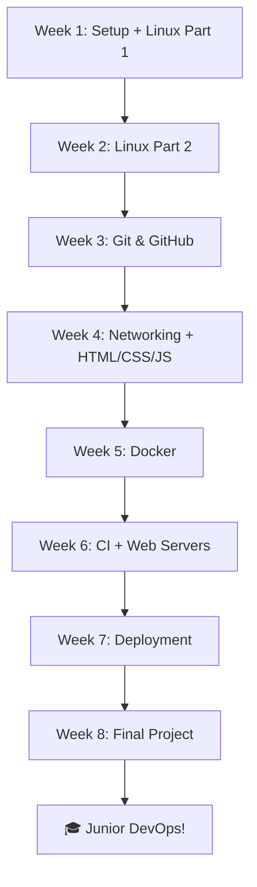

# 🌱 FOUNDATION Track - Zero to Junior DevOps

> **Từ không biết gì → DevOps Junior trong 8 tuần**

---

## 🎯 Mục tiêu Track

Sau khi hoàn thành FOUNDATION Track, bạn sẽ:

✅ **Kỹ năng kỹ thuật:**

- Sử dụng thành thạo Linux command line
- Quản lý code bằng Git & GitHub
- Hiểu cơ bản HTML/CSS/JavaScript
- Containerize ứng dụng bằng Docker
- Xây dựng CI/CD pipeline cơ bản
- Deploy website lên internet
- Debug các vấn đề thường gặp

✅ **Mindset DevOps:**

- Tư duy automation-first
- Hiểu về version control
- Biết cách collaborate trong team
- Biết đọc logs và troubleshoot

✅ **Portfolio:**

- 1 portfolio website live với CI/CD
- GitHub profile với 10+ repositories
- Hiểu workflow làm việc thực tế

---

## 📋 Prerequisites

### Bạn CẦN có

- ✅ Máy tính (Windows/macOS/Linux)
- ✅ Kết nối internet
- ✅ Biết dùng máy tính cơ bản (mở browser, install app)
- ✅ Biết đọc tiếng Anh technical (có thể dùng Google Translate)
- ✅ 6-8 giờ mỗi tuần để học

### Bạn KHÔNG CẦN biết trước

- ❌ Programming (sẽ dạy basic HTML/CSS/JS)
- ❌ Linux/Terminal
- ❌ Docker, Kubernetes, Cloud
- ❌ Bất kỳ công cụ DevOps nào

---

## 🗺️ Lộ trình 8 tuần

---

## 📚 Danh sách Modules

### **Module 00: SETUP** - Chuẩn bị môi trường

⏱️ **2-3 giờ**

**Bạn sẽ làm được:**

- Cài đặt môi trường làm việc (WSL2/Terminal)
- Download tài liệu khóa học (KHÔNG dùng git clone - chưa học Git!)
- Cài VS Code và extensions
- Tạo tài khoản GitHub, Docker Hub
- Verify môi trường sẵn sàng

**Files:**

- [README.md](00_SETUP/README.md) - Lý thuyết setup
- [LABS.md](00_SETUP/LABS.md) - Hướng dẫn từng bước
- [FAQ.md](00_SETUP/FAQ.md) - Câu hỏi thường gặp
- [scripts/](00_SETUP/scripts/) - Verification scripts

👉 **[Bắt đầu Module 00](00_SETUP/README.md)**

---

### **Module 01: LINUX BASICS** - Làm chủ command line

⏱️ **6-8 giờ**

**Bạn sẽ học:**

- Hệ thống file Linux (/, /home, /etc, /var, ...)
- Commands cơ bản (pwd, ls, cd, cat, cp, mv, rm, ...)
- Permissions (rwx, chmod, chown)
- Processes & Services
- Package management (apt/yum)
- Basic networking commands

**Bạn sẽ làm được:**

- Navigate thư mục Linux như một pro
- Tạo, sửa, xóa files và thư mục
- Set permissions security
- Quản lý processes (ps, kill, top)
- Đọc và search logs
- Cài đặt software

**Files:**

- [README.md](01_LINUX_BASICS/README.md) - 40-50 pages lý thuyết
- [LABS.md](01_LINUX_BASICS/LABS.md) - 20 labs thực hành
- [EXERCISES.md](01_LINUX_BASICS/EXERCISES.md) - 50+ bài tập
- [SCENARIOS.md](01_LINUX_BASICS/SCENARIOS.md) - 10 tình huống thực tế
- [QUIZ.md](01_LINUX_BASICS/QUIZ.md) - 30 câu trắc nghiệm
- [CHEATSHEET.md](01_LINUX_BASICS/CHEATSHEET.md) - Reference card

👉 **[Bắt đầu Module 01](01_LINUX_BASICS/README.md)**

---

### **Module 02: GIT & GITHUB** - Version control

⏱️ **4-6 giờ**

**Tại sao Git đứng trước Networking?**

- Bạn cần Git để download/update tài liệu
- Bạn cần Git để quản lý code projects
- Git là công cụ dùng HẰNG NGÀY

**Bạn sẽ học:**

- Version control là gì? Tại sao cần?
- Git internals (objects, refs, HEAD)
- Basic workflow (init, add, commit, push, pull)
- Branching strategies
- Merge vs Rebase
- GitHub collaboration (PR, Issues, Discussions)
- .gitignore best practices

**Bạn sẽ làm được:**

- Tạo repository
- Commit changes
- Tạo và merge branches
- Collaborate qua Pull Requests
- Resolve merge conflicts
- Quay lại version cũ khi cần

**Files:**

- [README.md](02_GIT_GITHUB/README.md) - 35-40 pages
- [LABS.md](02_GIT_GITHUB/LABS.md) - 15 labs
- [EXERCISES.md](02_GIT_GITHUB/EXERCISES.md) - 40 bài tập
- [SCENARIOS.md](02_GIT_GITHUB/SCENARIOS.md) - 10 scenarios
- [PROJECT.md](02_GIT_GITHUB/PROJECT.md) - Tạo portfolio repo

👉 **[Bắt đầu Module 02](02_GIT_GITHUB/README.md)**

---

### **Module 03: NETWORKING INTRO** - Internet basics

⏱️ **3-4 giờ**

**Simplified version - chỉ học cái cần:**

- HTTP/HTTPS là gì?
- DNS hoạt động như thế nào?
- IP address, Ports
- How browsers work
- curl command để test API

**Bạn sẽ làm được:**

- Hiểu cách data đi từ laptop đến server
- Debug network issues cơ bản
- Test APIs bằng curl
- Hiểu error codes (404, 500, ...)

👉 **[Bắt đầu Module 03](03_NETWORKING_INTRO/README.md)**

---

### **Module 04: HTML/CSS/JS BASICS** - Frontend fundamentals

⏱️ **5-6 giờ**

**Tại sao DevOps cần biết frontend?**

- Để hiểu app bạn deploy
- Để có thể tạo static sites
- Để test web applications

**Bạn sẽ học:**

- HTML structure
- CSS styling (flexbox, grid)
- JavaScript basics (DOM, events)
- Responsive design
- Browser DevTools

**Bạn sẽ làm được:**

- Tạo static website
- Style website đẹp
- Thêm interactivity
- Debug frontend issues

👉 **[Bắt đầu Module 04](04_HTML_CSS_JS_BASICS/README.md)**

---

### **Module 05: DOCKER BASICS** - Containerization

⏱️ **6-8 giờ**

**Bạn sẽ học:**

- Containers vs VMs
- Docker images vs containers
- Dockerfile best practices
- Docker Compose
- Volumes & Networks
- Docker Hub registry

**Bạn sẽ làm được:**

- Run containers
- Build custom images
- Multi-container apps với docker-compose
- Debug container issues
- Push images to Docker Hub

👉 **[Bắt đầu Module 05](05_DOCKER_BASICS/README.md)**

---

### **Module 06: CI BASICS** - Automation begins

⏱️ **4-5 giờ**

**Bạn sẽ học:**

- CI/CD là gì?
- GitHub Actions workflow
- Automated testing
- Build và deploy tự động

**Bạn sẽ làm được:**

- Tạo GitHub Actions workflow
- Auto-deploy static site to GitHub Pages
- Run tests on every commit
- Validate HTML/CSS

👉 **[Bắt đầu Module 06](06_CI_BASICS/README.md)**

---

### **Module 07: WEB SERVERS BASICS** - Serving content

⏱️ **3-4 giờ**

**Bạn sẽ học:**

- Web server là gì?
- NGINX basics
- Serve static files  
- Reverse proxy concept
- HTTPS/SSL basics

**Bạn sẽ làm được:**

- Setup NGINX
- Serve website
- Configure NGINX
- Debug web server issues

👉 **[Bắt đầu Module 07](07_WEB_SERVERS_BASICS/README.md)**

---

### **Module 08: DEPLOYMENT BASICS** - Going live

⏱️ **4-5 giờ**

**Bạn sẽ học:**

- Deployment platforms (GitHub Pages, Netlify, Vercel)
- Custom domains
- HTTPS certificates
- Continuous deployment

**Bạn sẽ làm được:**

- Deploy lên GitHub Pages
- Setup custom domain
- Enable HTTPS
- Monitor deployment status

👉 **[Bắt đầu Module 08](08_DEPLOYMENT_BASICS/README.md)**

---

### **🎯 FINAL PROJECT** - Portfolio Website

⏱️ **10-15 giờ**

**Requirements:**

- ✅ Static HTML/CSS/JS website
- ✅ Responsive design (mobile + desktop)
- ✅ At least 3 sections (About, Projects, Contact)
- ✅ Dark/Light mode toggle
- ✅ Hosted on GitHub Pages
- ✅ Custom domain (optional but recommended)
- ✅ CI/CD với GitHub Actions
- ✅ Valid HTML5/CSS3
- ✅ Lighthouse score 90+

**Starter Template:**
Chúng tôi cung cấp 80% complete starter template. Bạn chỉ cần:

- Customize nội dung (text, images)
- Thay đổi colors/fonts
- Add thêm sections nếu muốn

**Grading Rubric:**

- Content (20 pts)
- Design & UX (25 pts)
- Technical Quality (25 pts)
- Deployment (20 pts)
- CI/CD (10 pts)

**Examples:**

- [Example 1](https://example1.github.io)
- [Example 2](https://example2.github.io)
- [Example 3](https://example3.github.io)

👉 **[Bắt đầu Final Project](FINAL_PROJECT/README.md)**

---

## 📊 Summary

| Module | Topics | Labs | Exercises | Time |
|--------|--------|------|-----------|------|
| 00 | Setup | 6 | 20 | 2-3h |
| 01 | Linux | 20 | 50 | 6-8h |
| 02 | Git | 15 | 40 | 4-6h |
| 03 | Networking | 10 | 30 | 3-4h |
| 04 | HTML/CSS/JS | 12 | 35 | 5-6h |
| 05 | Docker | 18 | 45 | 6-8h |
| 06 | CI | 10 | 25 | 4-5h |
| 07 | Web Servers | 8 | 20 | 3-4h |
| 08 | Deployment | 8 | 20 | 4-5h |
| Final | Project | 1 | - | 10-15h |
| **TOTAL** | **10** | **108** | **285** | **48-64h** |

---

## ✅ Checklist hoàn thành

Track progress của bạn:

### Week 1

- [ ] Module 00: Setup complete
- [ ] Module 01: Linux Basics (part 1)

### Week 2

- [ ] Module 01: Linux Basics (part 2)
- [ ] All Linux labs done

### Week 3

- [ ] Module 02: Git & GitHub complete
- [ ] Portfolio repo created

### Week 4

- [ ] Module 03: Networking complete
- [ ] Module 04: HTML/CSS/JS complete

### Week 5

- [ ] Module 05: Docker complete
- [ ] Can run multi-container apps

### Week 6

- [ ] Module 06: CI complete
- [ ] Module 07: Web Servers complete
- [ ] Auto-deployment working

### Week 7

- [ ] Module 08: Deployment complete
- [ ] Test deployment live

### Week 8

- [ ] Final Project complete
- [ ] Portfolio live with CI/CD
- [ ] Submitted for review

---

## 🎓 Sau khi hoàn thành

### Chứng chỉ

- [ ] Submit final project
- [ ] Download certificate

### Next Steps

1. **Rest & celebrate!** 🎉
2. **Build 2-3 more projects** to solidify knowledge
3. **Prepare for job hunt:**
   - Update LinkedIn
   - Update resume
   - Practice interviews
4. **Start ADVANCED Track** if you want Senior level

### Career Options

- Junior DevOps Engineer
- Build Engineer
- CI/CD Engineer
- Site Reliability Engineer (Junior)

**Expected salary:**

- Vietnam: 12-18M VND/tháng
- International remote: $2000-3500/tháng

---

## 💬 Support & Community

- 🤔 **Có câu hỏi?** → [GitHub Discussions](https://github.com/your-org/DevOpsTraining/discussions)
- 🐛 **Tìm thấy lỗi?** → [Report Issue](https://github.com/your-org/DevOpsTraining/issues)
- 💡 **Ý tưởng hay?** → [Feature Request](https://github.com/your-org/DevOpsTraining/discussions/categories/ideas)

### Study Groups

- 📅 **Weekly Office Hours:** Saturdays 8-10 PM (GMT+7)
- 💬 **Discord:** [Join here](https://discord.gg/devops-training)
- 🎥 **YouTube:** [Video tutorials](https://youtube.com/c/devops-training)

---

## 👉 Ready? Let's start

**[→ Module 00: SETUP - Let's prepare your environment!](00_SETUP/README.md)**

---

**Made with ❤️ for Vietnamese DevOps learners**

*"The journey of a thousand miles begins with a single step"*

🚀 **Good luck on your DevOps journey!** 🚀

