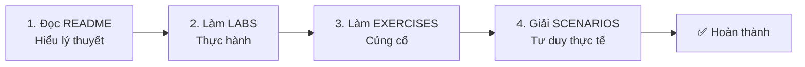

# 🚀 DevOps Training - From Zero to Mastery

> **Khóa học DevOps toàn diện, chi tiết, chuyên sâu - Tiếng Việt**

[](LICENSE)
[](CONTRIBUTING.md)

---

## 📖 Giới thiệu

**DevOps Training** là chương trình đào tạo DevOps toàn diện nhất bằng tiếng Việt, được thiết kế dành cho:

- 🎓 **Người mới bắt đầu** muốn vào nghề DevOps
- 💼 **Developers** muốn chuyển sang DevOps
- 🔧 **System Admins** muốn học automation
- 📈 **Junior DevOps** muốn lên Senior/Expert

### ✨ Điểm khác biệt

| Feature | DevOps Training | Khóa học khác |
|---------|-----------------|---------------|
| **Độ chi tiết** | 1200+ pages, giải thích sâu | Thường 200-300 pages |
| **Bài tập** | 1360+ exercises, scenarios | Thường 50-100 |
| **Hands-on Labs** | 440+ labs thực hành | Thường 100-150 |
| **Projects** | 2 projects production-grade | 1 project đơn giản |
| **Ngôn ngữ** | Tiếng Việt, dễ hiểu | Chủ yếu tiếng Anh |
| **Cập nhật** | Liên tục | Lâu lâu mới update |

---

## 🎯 Chọn Track phù hợp với bạn

### 🌱 Track 1: FOUNDATION (Zero to Junior DevOps)

**Dành cho:** Người chưa biết gì về DevOps, muốn bắt đầu từ con số 0

#### 📚 Bạn sẽ học

- ✅ Linux command line từ cơ bản đến thành thạo
- ✅ Git & GitHub để quản lý code
- ✅ HTML/CSS/JavaScript cơ bản
- ✅ Docker để containerize ứng dụng
- ✅ CI/CD cơ bản với GitHub Actions
- ✅ Web servers (NGINX)
- ✅ Deploy website lên internet

#### ⏱️ Thời lượng

**8 tuần** (với 6-8 giờ học/tuần)

#### 🎓 Project cuối

**Portfolio Website** deployed với CI/CD

- Static HTML/CSS/JS website
- Responsive design
- Hosted on GitHub Pages
- Auto-deploy on every commit
- Custom domain (optional)

#### 📊 Nội dung chi tiết

| Module | Tên | Nội dung | Thời lượng |
|--------|-----|----------|------------|
| **00** | [SETUP](FOUNDATION/00_SETUP/) | Cài đặt môi trường (KHÔNG dùng Git) | 2-3h |
| **01** | [LINUX BASICS](FOUNDATION/01_LINUX_BASICS/) | CLI, Files, Permissions, Processes | 6-8h |
| **02** | [GIT & GITHUB](FOUNDATION/02_GIT_GITHUB/) | Version control, Collaboration | 4-6h |
| **03** | [NETWORKING INTRO](FOUNDATION/03_NETWORKING_INTRO/) | HTTP, DNS, Ports (simplified) | 3-4h |
| **04** | [HTML/CSS/JS BASICS](FOUNDATION/04_HTML_CSS_JS_BASICS/) | Frontend cơ bản | 5-6h |
| **05** | [DOCKER BASICS](FOUNDATION/05_DOCKER_BASICS/) | Images, Containers, Docker Compose | 6-8h |
| **06** | [CI BASICS](FOUNDATION/06_CI_BASICS/) | GitHub Actions cho static site | 4-5h |
| **07** | [WEB SERVERS](FOUNDATION/07_WEB_SERVERS_BASICS/) | NGINX serving static files | 3-4h |
| **08** | [DEPLOYMENT](FOUNDATION/08_DEPLOYMENT_BASICS/) | Deploy to GitHub Pages, Netlify | 4-5h |
| **🎯** | [FINAL PROJECT](FOUNDATION/FINAL_PROJECT/) | Portfolio website với CI/CD | 10-15h |

**📖 Total: ~50-65 giờ học**

#### 👉 Bắt đầu

**[→ FOUNDATION Track - Bắt đầu tại đây](FOUNDATION/README.md)**

---

### 🚀 Track 2: ADVANCED (Junior to Mastery)

**Dành cho:** Người đã biết DevOps cơ bản, muốn lên Expert/Senior level

#### 📚 Prerequisites

Bạn CẦN biết trước:

- ✅ Linux CLI (commands, permissions, processes)
- ✅ Git/GitHub (branching, merging, PRs)
- ✅ Docker basics (run containers, Dockerfile)
- ✅ Đã deploy ít nhất 1 project lên internet

💡 **Chưa đủ prerequisites?** → Học [FOUNDATION Track](#-track-1-foundation-zero-to-junior-devops) trước

#### 📚 Bạn sẽ học

- ✅ Kubernetes production deployment
- ✅ Terraform & Ansible (Infrastructure as Code)
- ✅ Cloud platforms (AWS/GCP)
- ✅ Advanced CI/CD (testing, scanning, GitOps)
- ✅ Observability (Prometheus, Grafana, Loki)
- ✅ Security & DevSecOps
- ✅ SRE practices (SLIs, SLOs, incident management)

#### ⏱️ Thời lượng

**12-14 tuần** (với 10-12 giờ học/tuần)

#### 🎓 Capstone Project

**Full-Stack Production App**

- Backend: Python Flask API
- Frontend: React (hoặc HTML/CSS/JS)
- Database: PostgreSQL + Redis
- Deployed on Kubernetes (EKS/GKE)
- Full CI/CD pipeline với ArgoCD
- Monitoring stack (Prometheus + Grafana)
- Security scanning & secrets management
- Multi-environment (dev/staging/prod)

#### 📊 Nội dung chi tiết

| Module | Tên | Thời lượng |
|--------|-----|------------|
| **00** | [ASSESSMENT](ADVANCED/00_ASSESSMENT/) | Self-assessment quiz | 1h |
| **01** | [LINUX ADVANCED](ADVANCED/01_LINUX_ADVANCED/) | Shell scripting, System tuning | 6-8h |
| **02** | [NETWORKING ADVANCED](ADVANCED/02_NETWORKING_ADVANCED/) | Load balancing, CDN, Security | 5-6h |
| **03** | [SCRIPTING](ADVANCED/03_SCRIPTING/) | Python, Bash automation | 6-8h |
| **04** | [WEB SERVERS ADVANCED](ADVANCED/04_WEB_SERVERS_ADVANCED/) | NGINX tuning, HA setup | 4-5h |
| **05** | [DATABASES](ADVANCED/05_DATABASES/) | PostgreSQL, Redis, Backups | 6-8h |
| **06** | [DOCKER ADVANCED](ADVANCED/06_DOCKER_ADVANCED/) | Multi-stage, Security, Optimization | 5-6h |
| **07** | [KUBERNETES](ADVANCED/07_KUBERNETES/) | Production K8s deployment | 12-15h |
| **08** | [CI ADVANCED](ADVANCED/08_CI_ADVANCED/) | Testing, Scanning, Matrix builds | 6-8h |
| **09** | [CD & GITOPS](ADVANCED/09_CD_GITOPS/) | ArgoCD, Flux, Strategies | 6-8h |
| **10** | [CLOUD AWS](ADVANCED/10_CLOUD_AWS/) | EC2, S3, VPC, IAM | 10-12h |
| **11** | [CLOUD GCP](ADVANCED/11_CLOUD_GCP/) | GCE, GCS, Cloud SQL | 6-8h |
| **12** | [TERRAFORM](ADVANCED/12_TERRAFORM/) | Infrastructure as Code | 8-10h |
| **13** | [ANSIBLE](ADVANCED/13_ANSIBLE/) | Configuration Management | 6-8h |
| **14** | [OBSERVABILITY](ADVANCED/14_OBSERVABILITY/) | Prometheus, Grafana, Logging | 8-10h |
| **15** | [SECURITY](ADVANCED/15_SECURITY_DEVSECOPS/) | DevSecOps practices | 6-8h |
| **16** | [SRE PRACTICES](ADVANCED/16_SRE_PRACTICES/) | SLIs, SLOs, Incidents | 5-6h |
| **🎓** | [CAPSTONE](ADVANCED/CAPSTONE_PROJECT/) | Full production app | 30-40h |

**📖 Total: ~140-170 giờ học**

#### 👉 Bắt đầu

**[→ ADVANCED Track - Kiểm tra Prerequisites](ADVANCED/README.md)**

---

## ❓ Không chắc nên học track nào?

### 🧪 Quiz 5 phút

Trả lời các câu hỏi sau (trung thực nhé!):

1. **Bạn có thể SSH vào server và navigate thư mục không?**
   - ❌ Không → FOUNDATION Track
   - ✅ Có → Tiếp câu 2

2. **Bạn đã từng dùng Git để commit code chưa?**
   - ❌ Chưa → FOUNDATION Track
   - ✅ Rồi → Tiếp câu 3

3. **Bạn có thể chạy Docker container không?**
   - ❌ Không → FOUNDATION Track
   - ✅ Có → Tiếp câu 4

4. **Bạn đã deploy ít nhất 1 app lên internet chưa?**
   - ❌ Chưa → FOUNDATION Track
   - ✅ Rồi → ADVANCED Track!

### 📊 Skill Assessment chi tiết

👉 **[Làm bài test đầy đủ (30 phút)](SHARED/SELF_ASSESSMENT.md)**

---

## 🛠️ Chuẩn bị trước khi bắt đầu

### Yêu cầu hệ thống

- **OS**: Windows 10/11, macOS 11+, hoặc Linux (Ubuntu 20.04+)
- **RAM**: 8GB+ (16GB khuyến nghị)
- **Disk**: 30GB trống
- **Internet**: Ổn định

### Tools sẽ cài đặt

Đừng lo! Module 00 sẽ hướng dẫn cài đặt từng bước.

| Tool | Foundation | Advanced |
|------|------------|----------|
| Terminal/WSL2 | ✅ | ✅ |
| VS Code | ✅ | ✅ |
| Git | ✅ | ✅ |
| Docker | ✅ | ✅ |
| kubectl | ❌ | ✅ |
| Terraform | ❌ | ✅ |
| Ansible | ❌ | ✅ |

### Tài khoản cần tạo (miễn phí)

- ✅ [GitHub](https://github.com)
- ✅ [Docker Hub](https://hub.docker.com)
- ✅ [AWS Free Tier](https://aws.amazon.com/free) (chỉ cho Advanced track)

---

## 📚 Tài liệu bổ sung

### 🔍 Tham khảo nhanh

| Tài liệu | Mô tả |
|----------|-------|
| **[Glossary](SHARED/GLOSSARY.md)** | Từ điển thuật ngữ A-Z (1000+ terms) |
| **[Cheatsheets](SHARED/CHEATSHEETS/)** | Reference cards cho mọi công cụ |
| **[Troubleshooting](SHARED/TROUBLESHOOTING/)** | Debug common issues |
| **[FAQ](SHARED/FAQ.md)** | Câu hỏi thường gặp |

### 🎓 Phát triển sự nghiệp

| Tài liệu | Mô tả |
|----------|-------|
| **[Career Roadmap](SHARED/CAREER/ROADMAP.md)** | Lộ trình từ Junior → Senior → Staff |
| **[Salary Guide](SHARED/CAREER/SALARY_GUIDE.md)** | Mức lương theo level & khu vực |
| **[Interview Prep](SHARED/INTERVIEW_PREP/)** | 1000+ câu hỏi phỏng vấn |
| **[Resume Tips](SHARED/CAREER/RESUME_TIPS.md)** | Viết CV DevOps hiệu quả |
| **[Certifications](SHARED/CAREER/CERTIFICATIONS.md)** | AWS, GCP, CKA, ... |

### 🔗 Tài nguyên học thêm

| Tài liệu | Mô tả |
|----------|-------|
| **[Books](SHARED/REFERENCES/BOOKS.md)** | Sách hay về DevOps |
| **[Blogs](SHARED/REFERENCES/BLOGS.md)** | Blog nên theo dõi |
| **[YouTube](SHARED/REFERENCES/YOUTUBE_CHANNELS.md)** | Channels chất lượng |
| **[Communities](SHARED/REFERENCES/COMMUNITIES.md)** | Forum, Discord, Slack |

---

## 🎯 Phương pháp học hiệu quả

### Quy trình 4 bước cho mỗi module



### 💡 Tips học hiệu quả

1. **🚫 Đừng skip labs** - DevOps là về hands-on, không làm = không học được gì
2. **📝 Làm bài tập nghiêm túc** - Đừng nhìn đáp án trước khi thử
3. **🧠 Scenarios quan trọng nhất** - Đây là phần giúp tư duy như DevOps thực thụ
4. **⏰ Consistency > Intensity** - 1h mỗi ngày tốt hơn 10h cuối tuần
5. **💬 Tham gia community** - Hỏi đáp, chia sẻ trên [GitHub Discussions](../../discussions)
6. **📂 Build portfolio** - Push tất cả projects lên GitHub public

### 📅 Lịch học đề xuất

#### Foundation Track (8 tuần)

| Tuần | Modules | Thời gian |
|------|---------|-----------|
| 1 | Setup + Linux Basics (part 1) | 8h |
| 2 | Linux Basics (part 2) | 8h |
| 3 | Git & GitHub | 6h |
| 4 | Networking + HTML/CSS/JS | 8h |
| 5 | Docker Basics | 8h |
| 6 | CI Basics + Web Servers | 7h |
| 7 | Deployment Basics | 5h |
| 8 | Final Project | 15h |

#### Advanced Track (14 tuần)

[Tương tự]

---

## 🚀 Demo Projects

### Foundation: Simple HTML Site

```
PROJECTS/simple-html-site/
├── index.html              # Portfolio homepage
├── style.css               # Responsive design
├── script.js               # Dark mode toggle
├── Dockerfile              # NGINX container
├── docker-compose.yml      # Local development
└── .github/workflows/
    └── deploy.yml          # Auto-deploy to GitHub Pages
```

**Live demo:** [https://your-username.github.io](https://your-username.github.io)

### Advanced: Counter App

```
PROJECTS/counter-app-advanced/
├── backend/
│   ├── app.py              # Flask API với Prometheus metrics
│   ├── tests/              # Unit + integration tests
│   └── Dockerfile          # Multi-stage, non-root
├── k8s/
│   ├── base/               # Kustomize base
│   └── overlays/           # dev/staging/prod
├── terraform/              # AWS EKS infrastructure
├── .github/workflows/
│   ├── ci.yml              # Build, test, scan, push
│   └── cd.yml              # GitOps update
└── monitoring/
    ├── prometheus/         # Metrics collection
    └── grafana/            # Dashboards
```

**Live demo:** [https://counter-app.example.com](https://counter-app.example.com)

---

## 📊 Số liệu khóa học

| Metrics | Foundation | Advanced | Total |
|---------|------------|----------|-------|
| **Modules** | 10 | 17 | 27 |
| **Pages** | ~400 | ~800 | ~1200 |
| **Labs** | 150+ | 290+ | 440+ |
| **Exercises** | 500+ | 860+ | 1360+ |
| **Scenarios** | 100+ | 140+ | 240+ |
| **Quizzes** | 300+ | 500+ | 800+ |

---

## 🤝 Đóng góp

Khóa học này được xây dựng bởi cộng đồng, cho cộng đồng!

### Các cách đóng góp

- 🐛 **Report bugs** - [Tạo issue](../../issues)
- 💡 **Suggest features** - [GitHub Discussions](../../discussions)
- 📝 **Improve docs** - Submit Pull Request
- 🌍 **Translate** - Dịch sang ngôn ngữ khác
- ⭐ **Star repo** - Giúp nhiều người biết đến

👉 **[Contributing Guidelines](CONTRIBUTING.md)**

---

## 📝 License

[MIT License](LICENSE) - Free to use, modify, and distribute

---

## 👨‍💻 Tác giả & Contributors

**Maintainer:** ThanhRòm - [@thanhlehoang0107](https://github.com/thanhlehoang0107)

**Contributors:**

- [Danh sách contributors](../../graphs/contributors)

---

## 📬 Liên hệ & Support

- 🐛 **Báo lỗi:** [GitHub Issues](../../issues)
- 💬 **Hỏi đáp:** [GitHub Discussions](../../discussions)
- 📧 **Email:** <devops.training@example.com>
- 💼 **LinkedIn:** [DevOps Training Community](https://linkedin.com/company/devops-training)

---

## ⭐ Support the Project

Nếu khóa học hữu ích, hãy:

- ⭐ Star repo này
- 🔀 Fork và customize cho team bạn
- 📢 Share với bạn bè, đồng nghiệp
- ☕ [Buy me a coffee](https://buymeacoffee.com/devopstraining) (optional)

---

## 📈 Roadmap

### ✅ Completed

- [x] Foundation Track structure
- [x] Module 00: Setup complete
- [x] Simple HTML Site starter template

### 🚧 In Progress

- [ ] Module 01-08 Foundation (Target: Q1 2025)
- [ ] Advanced Track modules (Target: Q2 2025)

### 📅 Planned

- [ ] Video tutorials for each module
- [ ] Interactive labs platform
- [ ] Certificate system
- [ ] Mobile app for on-the-go learning

👉 **[Full Roadmap](ROADMAP.md)**

---

<div align="center">

### 🎓 Ready to start your DevOps journey?

**[📚 Foundation Track →](FOUNDATION/README.md)** | **[🚀 Advanced Track →](ADVANCED/README.md)**

---

**Made with ❤️ by the DevOps community**

*"DevOps is not a destination, it's a journey"*

**🚀 Happy Learning! 🚀**

</div>
