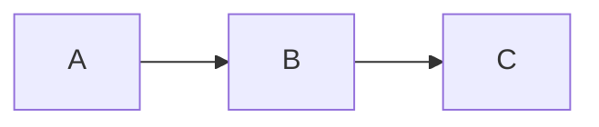
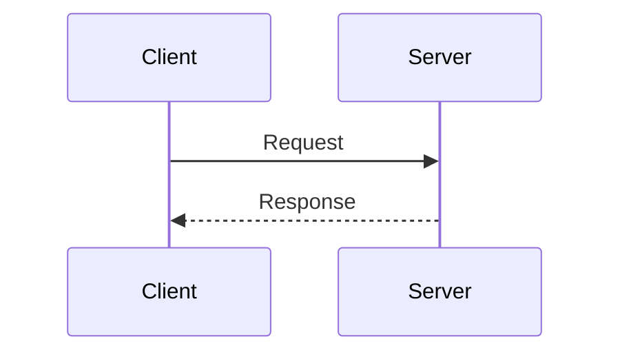

# 🏗️ Roadmap & Architecture Spec (Định hướng Kiến trúc & Lộ trình)

> **Technical architecture and progression logic for DevOps-Journey.**
>
> *Kiến trúc kỹ thuật và logic phát triển cho DevOps-Journey.*

---

## 1. 🎯 Technology Stack (Các công nghệ trọng tâm)

| Category | Primary | Secondary | Notes |
|----------|---------|-----------|-------|
| **Operating System** | Linux (Ubuntu/Debian) | Alpine (containers) | Focus on server environments |
| **Version Control** | GitLab | GitHub | GitLab CI/CD as primary |
| **CI/CD** | GitLab CI/CD | GitHub Actions, Jenkins | Enterprise focus |
| **Cloud** | AWS | Oracle Cloud Free | AWS Free Tier for learning |
| **Orchestration** | Kubernetes | Docker Swarm | From Minikube to EKS |
| **IaC** | Terraform | CloudFormation | Multi-cloud focus |
| **Config Management** | Ansible | - | Agentless automation |
| **Monitoring** | Prometheus + Grafana | ELK Stack | Observability stack |

---

## 2. 📈 Progression Logic (Logic phát triển level)

### 2.1 Two-Tier Knowledge System

Each lesson is divided into two knowledge tiers:

*Mỗi bài học được chia làm 2 tầng kiến thức:*

| Level | Badge | Focus | Environment |
|-------|-------|-------|-------------|
| **Essential** | 🟢 `green` | "Make it work" - Get results quickly *(Làm được ngay)* | Free/Local tools |
| **Expert** | 🔴 `red` | "Make it better" - Optimize & scale *(Làm tốt & tối ưu)* | Cloud (AWS) |

### 2.2 Badge Usage

```markdown
[](.)
[](.)
```

---

## 3. 🖼️ Visual Hierarchy (Phân cấp hình ảnh)

| Level | Type | Purpose | Example |
|-------|------|---------|---------|
| **Level 1** | Concept Diagram | Simple process overview *(Sơ đồ khối đơn giản)* | CI/CD pipeline flow |
| **Level 2** | Sequence Diagram | Component interaction *(Tương tác giữa các thành phần)* | Request flow |
| **Level 3** | Screenshot | Expected output *(Kết quả mong đợi)* | Terminal output |

### Mermaid Diagram Types

```markdown
# Flowchart - For processes


# Sequence - For interactions



```

---

## 4. 🗺️ Track Structure (Cấu trúc Track)

### Track Overview

| Track | Name | Duration | Level |
|-------|------|----------|-------|
| **Track 0** | Setup Environment | 2-4 hours | Setup |
| **Track 1** | Foundation & Static Web | 4-6 weeks | Beginner |
| **Track 2** | Orchestration & Automation | 6-8 weeks | Intermediate |
| **Track 3** | Cloud & Network Design | 8-10 weeks | Intermediate-Advanced |
| **Track 4** | DevSecOps | 4-6 weeks | Advanced |
| **Track 5** | Career Path | 4-6 weeks | All |

### Module Naming Convention

```

TrackX_Name/
├── X.1_Module_Name/
├── X.2_Module_Name/
└── X.Y_Capstone_Project/

```

---

## 5. 📅 Implementation Phases (Kế hoạch thực thi)

### Phase 1: Core Foundation (Nền tảng vững chắc)

| Task | Description | Priority |
|------|-------------|----------|
| Refactor Track 1 | Standardize all modules *(Chuẩn hóa tất cả modules)* | 🔴 HIGH |
| Linux basics | Zero-background friendly *(Thân thiện người mới)* | 🔴 HIGH |
| Docker fundamentals | Practical focus *(Tập trung thực tế)* | 🔴 HIGH |

### Phase 2: Automation & CI/CD (Tự động hóa)

| Task | Description | Priority |
|------|-------------|----------|
| GitLab CI/CD series | From Runner to multi-env pipeline | 🔴 HIGH |
| Free VPS deployment | Oracle Cloud / AWS Free Tier | 🟡 MEDIUM |

### Phase 3: Infrastructure & Orchestration (Hạ tầng & Điều phối)

| Task | Description | Priority |
|------|-------------|----------|
| Kubernetes | Objects → Helm → GitOps | 🔴 HIGH |
| Terraform | Modules & State management | 🔴 HIGH |

### Phase 4: SRE & DevSecOps (Độ tin cậy & Bảo mật)

| Task | Description | Priority |
|------|-------------|----------|
| Monitoring | Prometheus + Grafana stack | 🟡 MEDIUM |
| Security scanning | SAST, DAST, Container scanning | 🟡 MEDIUM |

---

## 6. 🔄 Review Workflow (Quy trình Review)

### Before Merge Checklist

- [ ] Follows CONTENT_GUIDELINES.md
- [ ] All required files present
- [ ] English First applied
- [ ] Labs have Verification + Troubleshooting
- [ ] Links working
- [ ] Mermaid diagrams render

---

## 📅 Version History

| Date | Changes |
|------|---------|
| 2026-01-16 | Restructured with English First format |
| 2026-01-15 | Initial version |
