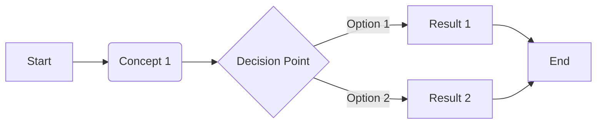

# 📋 Module X.Y: Module Title (Tên Module)

[](.)
[](.)
<!-- Use Level-Expert-red for advanced modules -->

> **Brief description in English - what this module covers.**
>
> *Mô tả ngắn gọn bằng tiếng Việt - module này bao gồm những gì.*

---

## 🎯 Learning Objectives (Mục tiêu học tập)

After this module, you will (Sau module này, bạn sẽ):

- ✅ Objective 1 in English *(Mục tiêu 1 tiếng Việt)*
- ✅ Objective 2 in English *(Mục tiêu 2 tiếng Việt)*
- ✅ Objective 3 in English *(Mục tiêu 3 tiếng Việt)*

---

## 📋 Prerequisites (Điều kiện tiên quyết)

Before starting, you should (Trước khi bắt đầu, bạn nên):

- Have completed Module X.Y-1 *(Đã hoàn thành Module trước)*
- Understand basic concept X *(Hiểu khái niệm X cơ bản)*

---

## 🗺️ Concept Map (Sơ đồ khái niệm)



---

## 📚 Content (Nội dung)

### 1. Introduction to Topic (Giới thiệu về Chủ đề) - X min

#### 1.1 What is Topic? (Topic là gì?)

**Topic** is a description in English explaining the concept clearly.

*Topic là mô tả bằng tiếng Việt giải thích khái niệm rõ ràng.*

> 💡 **Pro-tip:** A helpful tip for beginners.
>
> *Một mẹo hữu ích cho người mới.*

#### 1.2 Why Topic Matters? (Tại sao Topic quan trọng?)

| Reason | Explanation |
|--------|-------------|
| **Reason 1** | English explanation *(Giải thích tiếng Việt)* |
| **Reason 2** | English explanation *(Giải thích tiếng Việt)* |

---

### 2. Key Concepts (Các khái niệm chính) - X min

#### 2.1 Concept A (Khái niệm A)

English explanation of Concept A with examples.

*Giải thích tiếng Việt về Khái niệm A với ví dụ.*

```bash
# Example command (Lệnh ví dụ)
command --option value
```

**Output:** *(Kết quả:)*

```
expected output here
```

#### 2.2 Concept B (Khái niệm B)

Comparison table:

| Feature | Option A | Option B |
|---------|----------|----------|
| Speed | Fast *(Nhanh)* | Slow *(Chậm)* |
| Complexity | Simple *(Đơn giản)* | Complex *(Phức tạp)* |

---

### 3. Practical Application (Ứng dụng thực tế) - X min

#### 3.1 Common Use Cases (Các trường hợp sử dụng phổ biến)

1. **Use Case 1:** Description *(Mô tả)*
2. **Use Case 2:** Description *(Mô tả)*

#### 3.2 Best Practices (Thực hành tốt nhất)

- ✅ Do this *(Nên làm điều này)*
- ❌ Don't do this *(Không nên làm điều này)*

> ⚠️ **Warning:** Important caution to avoid common mistakes.
>
> *Cảnh báo quan trọng để tránh lỗi phổ biến.*

---

## 📝 Module Files (Các file trong Module)

| File | Description |
|------|-------------|
| [LABS.md](./LABS.md) | Hands-on labs *(Bài thực hành)* |
| [QUIZ.md](./QUIZ.md) | Knowledge check *(Kiểm tra kiến thức)* |
| [EXERCISES.md](./EXERCISES.md) | Practice exercises *(Bài tập)* |
| [PROJECT.md](./PROJECT.md) | Mini project *(Dự án nhỏ)* |
| [CHEATSHEET.md](./CHEATSHEET.md) | Quick reference *(Tra cứu nhanh)* |
| [SOLUTIONS.md](./SOLUTIONS.md) | Answers *(Đáp án)* |

---

## 🔗 Related Resources (Tài nguyên liên quan)

- [Official Documentation](https://example.com) - Official docs *(Tài liệu chính thức)*
- [Tutorial Video](https://youtube.com) - Video tutorial *(Video hướng dẫn)*

---

## 💡 Troubleshooting (Xử lý sự cố)

| Issue | Solution |
|-------|----------|
| `Error: message` | Fix by doing X *(Sửa bằng cách làm X)* |
| `Error: another` | Fix by doing Y *(Sửa bằng cách làm Y)* |

---

<div align="center">

## 🔗 Module Navigation (Điều hướng Module)

| ← Previous | Current | Next → |
|:----------:|:-------:|:------:|
| [Module X.Y-1](../prev_module/) | **Module X.Y** | [Module X.Y+1](../next_module/) |

---

**Good luck with your learning! 🚀**

*Chúc bạn học tốt!*

</div>
