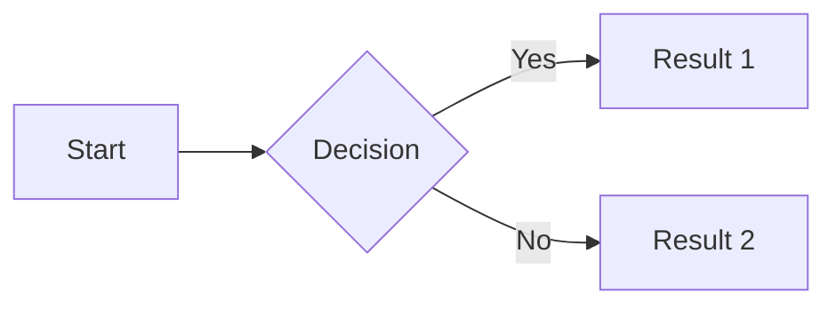
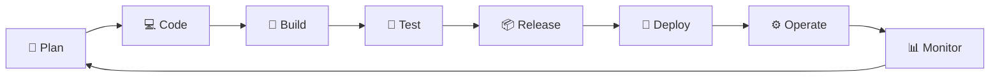

# 📖 Content Guidelines (Hướng dẫn Nội dung)

> **Master reference for all DevOps-Journey documentation standards.**
>
> *Tài liệu tham khảo chính cho tất cả quy chuẩn tài liệu DevOps-Journey.*

---

## 📋 Table of Contents (Mục lục)

1. [Language Standard](#1--language-standard-tiêu-chuẩn-ngôn-ngữ)
2. [Module Structure](#2-️-module-structure-cấu-trúc-module)
3. [File Templates](#3--file-templates-mẫu-từng-loại-file)
4. [Writing Style](#4--writing-style-phong-cách-viết)
5. [Visuals](#5--visuals-hình-ảnh--sơ-đồ)
6. [Lab Requirements](#6-️-lab-requirements-yêu-cầu-thực-hành)
7. [Quality Checklist](#7--quality-checklist-danh-sách-kiểm-tra)

---

## 1. 🌐 Language Standard (Tiêu chuẩn Ngôn ngữ)

### ⚠️ CRITICAL RULE: **English First - Vietnamese Second**

**ALL content must follow this order: English FIRST, Vietnamese SECOND.**

*TẤT CẢ nội dung phải theo thứ tự: Tiếng Anh TRƯỚC, Tiếng Việt SAU.*

---

### 1.1 Headers (Tiêu đề)

```markdown
## English Title (Tiêu đề Tiếng Việt)
### English Sub-title (Tiểu mục Tiếng Việt)
```

✅ **Correct:**

```markdown
## Learning Objectives (Mục tiêu học tập)
### What is Docker? (Docker là gì?)
```

❌ **Wrong:**

```markdown
## Mục tiêu học tập (Learning Objectives)
### Docker là gì? (What is Docker?)
```

---

### 1.2 Paragraphs (Đoạn văn)

```markdown
English paragraph first.

*Vietnamese paragraph in italics.*
```

✅ **Correct:**

```markdown
Docker is a platform for containerization.

*Docker là nền tảng container hóa.*
```

❌ **Wrong:**

```markdown
Docker là nền tảng container hóa.

*Docker is a platform for containerization.*
```

---

### 1.3 Lists (Danh sách)

```markdown
- English item *(Vietnamese translation)*
```

✅ **Correct:**

```markdown
- Install Docker Desktop *(Cài đặt Docker Desktop)*
- Configure networking *(Cấu hình mạng)*
```

❌ **Wrong:**

```markdown
- Cài đặt Docker Desktop *(Install Docker Desktop)*
```

---

### 1.4 Tables (Bảng)

```markdown
| English Header | Description |
|----------------|-------------|
| English content | *(Vietnamese note)* |
```

✅ **Correct:**

```markdown
| Command | Description |
|---------|-------------|
| `docker run` | Start a container *(Khởi chạy container)* |
```

❌ **Wrong:**

```markdown
| Lệnh | Mô tả |
|------|-------|
| `docker run` | Khởi chạy container |
```

---

### 1.5 Blockquotes / Pro-tips

```markdown
> **English bold text**
>
> *Vietnamese italic text*
```

✅ **Correct:**

```markdown
> 💡 **Pro-tip:** Always use .dockerignore to reduce image size.
>
> *Luôn dùng file .dockerignore để giảm dung lượng image.*
```

---

### 1.6 Code Comments (Chú thích trong code)

```bash
# English comment (Vietnamese translation)
command here
```

✅ **Correct:**

```bash
# Create directory structure (Tạo cấu trúc thư mục)
mkdir -p ~/project/src

# Install dependencies (Cài đặt dependencies)
npm install
```

❌ **Wrong:**

```bash
# Tạo cấu trúc thư mục (Create directory structure)
mkdir -p ~/project/src
```

---

### 1.7 Quiz Questions (Câu hỏi Quiz)

```markdown
### Q1: Topic Name

What is the English question?

*(Vietnamese question translation?)*

- a) English answer *(Vietnamese)*
- b) English answer *(Vietnamese)*
```

✅ **Correct:**

```markdown
### Q1: Docker Image

What is a Docker image?

*(Docker image là gì?)*

- a) Running container *(Container đang chạy)*
- b) Read-only template *(Mẫu chỉ đọc)*
```

---

### 1.8 Technical Terms (Thuật ngữ chuyên ngành)

**Keep technical terms in English. Explain in Vietnamese on FIRST occurrence only.**

✅ **Correct:**

```markdown
**Container** (môi trường cô lập chạy ứng dụng) is the core concept of Docker.
```

**Terms that should NEVER be translated:**

- Container, Image, Volume, Network
- Pipeline, Stage, Job
- Deployment, Service, Pod
- Cluster, Node, Worker
- Repository, Branch, Commit

---

## 2. 🏗️ Module Structure (Cấu trúc Module)

### 2.1 Required Files (Files bắt buộc)

**Every module MUST contain these files:**

| File | Purpose | Required |
|------|---------|----------|
| `README.md` | Theory and main content *(Lý thuyết chi tiết)* | ✅ **YES** |
| `LABS.md` | Step-by-step hands-on practice *(Thực hành từng bước)* | ✅ **YES** |
| `CHEATSHEET.md` | Quick reference commands *(Tra cứu nhanh)* | ✅ **YES** |
| `QUIZ.md` | Knowledge check questions *(Kiểm tra kiến thức)* | ✅ **YES** |
| `EXERCISES.md` | Self-practice exercises *(Bài tập tự luyện)* | ✅ **YES** |
| `PROJECT.md` | Mini project *(Dự án nhỏ)* | ✅ **YES** |
| `SOLUTIONS.md` | Answers and solutions *(Đáp án)* | ✅ **YES** |
| `images/` | Illustrations folder *(Thư mục hình ảnh)* | ✅ **YES** |

### 2.2 Capstone Project Modules

**Capstone modules have different structure:**

| File | Required |
|------|----------|
| `README.md` | ✅ YES |
| `SOLUTIONS.md` | ✅ YES |
| `STARTER_CODE/` | ✅ YES |
| `images/` | ✅ YES |

---

## 3. 📄 File Templates (Mẫu từng loại File)

### 3.1 README.md Template

```markdown
# 📋 Module X.Y: Module Title (Tên Module)

[](.)
[](.)

> **Brief description in English.**
>
> *Mô tả ngắn gọn bằng tiếng Việt.*

---

## 🎯 Learning Objectives (Mục tiêu học tập)

After this module, you will (Sau module này, bạn sẽ):

- ✅ Objective 1 in English *(Mục tiêu 1 tiếng Việt)*
- ✅ Objective 2 in English *(Mục tiêu 2 tiếng Việt)*

---

## 📚 Content (Nội dung)

### 1. Topic Title (Tiêu đề chủ đề)

English explanation...

*Giải thích tiếng Việt...*

---

## 📝 Module Files (Các file trong Module)

| File | Description |
|------|-------------|
| [LABS.md](./LABS.md) | Hands-on labs *(Bài thực hành)* |
| [QUIZ.md](./QUIZ.md) | Knowledge check *(Kiểm tra)* |
| ... | ... |

---

## 🔗 Navigation

| ← Previous | Current | Next → |
|:----------:|:-------:|:------:|
| [Prev Module](../prev/) | **Current** | [Next Module](../next/) |
```

---

### 3.2 LABS.md Template

```markdown
# 🔬 Labs: Module Name

> **Hands-on labs for Module Name.**
>
> *Bài thực hành cho Module Name.*

---

## 🔬 Lab 1: Lab Title (Tiêu đề Lab)

### Objective (Mục tiêu)

What you will learn in this lab.

*(Bạn sẽ học được gì trong lab này.)*

### Prerequisites (Điều kiện tiên quyết)

- Requirement 1 *(Yêu cầu 1)*
- Requirement 2 *(Yêu cầu 2)*

### Steps (Các bước)

#### Step 1: Step Title (Tiêu đề bước)

```bash
# Command explanation (Giải thích lệnh)
command here
```

**Expected output:** *(Kết quả mong đợi:)*

```
output here
```

### ✅ Verification (Kiểm chứng)

How to verify the lab is complete.

*(Cách kiểm chứng lab đã hoàn thành.)*

```bash
# Verification command (Lệnh kiểm tra)
verify_command
```

### 🔧 Troubleshooting (Xử lý sự cố)

| Error | Solution |
|-------|----------|
| `Error message` | Fix description *(Cách sửa)* |

### 🧹 Cleanup (Dọn dẹp)

```bash
# Cleanup commands (Lệnh dọn dẹp)
cleanup_command
```

---

## 🔬 Lab 2: Next Lab Title

...

```

---

### 3.3 QUIZ.md Template

```markdown
# ❓ Quiz: Module Name

> **Knowledge Check for Module Name (X Questions)**
>
> *Kiểm tra kiến thức Module Name (X câu hỏi).*

---

### Q1: Topic Name

English question here?

*(Vietnamese question translation?)*

- a) English answer *(Vietnamese)*
- b) English answer *(Vietnamese)*
- c) English answer *(Vietnamese)*
- d) English answer *(Vietnamese)*

---

### Q2: Topic Name
...

---

## 📝 Answers

<details>
<summary>Click to view answers / Nhấn để xem đáp án</summary>

| Q | Answer | Explanation |
|---|--------|-------------|
| 1 | b | Brief explanation |
| 2 | c | Brief explanation |

</details>

---

**[← Back to README](./README.md)**
```

---

### 3.4 EXERCISES.md Template

```markdown
# 💪 Exercises: Module Name

> **Self-practice exercises for Module Name.**
>
> *Bài tập tự luyện cho Module Name.*

---

## 📋 Instructions (Hướng dẫn)

- Complete exercises after finishing Labs *(Làm bài tập sau khi hoàn thành Labs)*
- Difficulty: ⭐ Easy, ⭐⭐ Medium, ⭐⭐⭐ Hard

---

## Exercise 1: Title ⭐

### Requirements (Yêu cầu)

1. English requirement *(Yêu cầu tiếng Việt)*
2. English requirement *(Yêu cầu tiếng Việt)*

### Verification (Kiểm chứng)

```bash
# How to verify (Cách kiểm tra)
command
```

---

## 📝 Checklist

- [ ] Exercise 1
- [ ] Exercise 2

---

**[← Back to README](./README.md)** | **[View Solutions →](./SOLUTIONS.md)**

```

---

### 3.5 CHEATSHEET.md Template

```markdown
# 📋 Cheatsheet: Module Name

> **Quick reference for Module Name commands.**
>
> *Tham khảo nhanh các lệnh Module Name.*

---

## 🔧 Category 1 (Danh mục 1)

| Command | Description |
|---------|-------------|
| `command` | What it does *(Giải thích)* |

---

## 🔧 Category 2 (Danh mục 2)

```bash
# Common pattern (Mẫu thông dụng)
command [options] <arguments>
```

---

**[← Back to README](./README.md)**

```

---

## 4. 📝 Writing Style (Phong cách Viết)

### ⚠️ CRITICAL: Detailed, Textbook-style Explanations

**Content MUST be detailed enough for self-learning. Long files are GOOD, not bad!**

*Nội dung PHẢI đủ chi tiết để học sinh tự học được. File dài là TỐT, không phải xấu!*

---

### 4.1 Zero-Background Friendly

- Explain concepts as if reader has NO IT background
- Use simple words before technical terms
- Provide real-world analogies
- **Always explain WHY, not just WHAT**

*Luôn giải thích TẠI SAO, không chỉ CÁI GÌ*

---

### 4.2 Real-world Scenarios (Tình huống thực tế) - REQUIRED

**Every major concept MUST start with a real-world scenario that explains WHY we need it.**

*Mỗi khái niệm quan trọng PHẢI bắt đầu bằng tình huống thực tế giải thích TẠI SAO cần nó.*

✅ **Required format:**

```markdown
> 📖 **Real-world Scenario (Tình huống thực tế):**
>
> [Describe a problem that happens WITHOUT the technology]
> [Mô tả vấn đề xảy ra khi KHÔNG CÓ công nghệ này]
>
> *[Vietnamese translation of the problem]*
>
> **[How the technology solves it]**
>
> *[Vietnamese translation of the solution]*
```

✅ **Good example:**

```markdown
> 📖 **Real-world Scenario (Tình huống thực tế):**
>
> Your company runs 50 microservices in Docker containers. One day, a 
> container crashes at 3 AM. Who restarts it? Traffic spikes 10x during 
> Black Friday. How to scale quickly?
>
> *Công ty bạn chạy 50 microservices trong Docker. Container crash lúc 
> 3 giờ sáng. Ai sẽ restart? Traffic tăng 10 lần ngày Black Friday. 
> Làm sao scale nhanh?*
>
> **Kubernetes solves ALL these problems automatically!**
>
> *Kubernetes giải quyết TẤT CẢ các vấn đề này tự động!*
```

❌ **Bad - No scenario, just definition:**

```markdown
Kubernetes is a container orchestration platform.
```

---

### 4.3 Before vs After Comparisons (So sánh Trước/Sau) - REQUIRED for tools

**When introducing a tool, MUST show what life was like WITHOUT it vs WITH it.**

*Khi giới thiệu công cụ, PHẢI cho thấy cuộc sống như thế nào khi KHÔNG CÓ vs CÓ nó.*

✅ **Required format:**

```markdown
| Before [Tool] | After [Tool] |
|---------------|--------------|
| ❌ Problem 1 *(Vấn đề 1)* | ✅ Solution 1 *(Giải pháp 1)* |
| ❌ Problem 2 *(Vấn đề 2)* | ✅ Solution 2 *(Giải pháp 2)* |
```

✅ **Good example:**

```markdown
| Before CI/CD | After CI/CD |
|--------------|-------------|
| ❌ Deploy manually, takes 4 hours *(Deploy thủ công, mất 4 tiếng)* | ✅ Deploy automatically in 10 minutes *(Deploy tự động trong 10 phút)* |
| ❌ Forget steps, cause errors *(Quên bước, gây lỗi)* | ✅ Consistent process, no errors *(Quy trình nhất quán, không lỗi)* |
| ❌ Deploy once a week *(Deploy 1 lần/tuần)* | ✅ Deploy dozens of times per day *(Deploy hàng chục lần/ngày)* |
```

---

### 4.4 Common Mistakes Section (Lỗi thường gặp) - REQUIRED

**Every module MUST have a "Common Mistakes" section before the footer.**

*Mỗi module PHẢI có phần "Lỗi thường gặp" trước footer.*

✅ **Required format:**

```markdown
### X. Common Mistakes (Lỗi thường gặp)

> ⚠️ **Mistakes beginners often make (Lỗi người mới hay mắc):**
>
> | Mistake | Problem | Solution |
> |---------|---------|----------|
> | [What they do wrong] | [What happens] *(Vietnamese)* | [How to fix] *(Vietnamese)* |
```

✅ **Good example:**

```markdown
### 10. Common Mistakes (Lỗi thường gặp)

> ⚠️ **Docker mistakes beginners often make (Lỗi Docker người mới hay mắc):**
>
> | Mistake | Problem | Solution |
> |---------|---------|----------|
> | Running as root | Security risk *(Rủi ro bảo mật)* | Add `USER node` *(Thêm user không phải root)* |
> | Using `latest` tag | Unpredictable *(Không ổn định)* | Specify version: `nginx:1.25.3` *(Chỉ định version)* |
> | No `.dockerignore` | Large images *(Image lớn)* | Create `.dockerignore` *(Tạo .dockerignore)* |
```

---

### 4.5 Checkpoint Questions (Câu hỏi tự kiểm tra) - REQUIRED

**Every module MUST have a "Checkpoint" section before Module Files.**

*Mỗi module PHẢI có phần "Checkpoint" trước Module Files.*

✅ **Required format:**

```markdown
> ✅ **Checkpoint - Before continuing, make sure you can answer:**
> *(Trước khi tiếp tục, hãy chắc bạn có thể trả lời:)*
>
> - [ ] Question 1? *(Câu hỏi 1?)*
> - [ ] Question 2? *(Câu hỏi 2?)*
> - [ ] Question 3? *(Câu hỏi 3?)*
> - [ ] Question 4? *(Câu hỏi 4?)*
>
> *If you can't answer, please re-read the sections above!*
```

**Guidelines for checkpoint questions:**

- 4-5 questions per module
- Questions should test UNDERSTANDING, not just memory
- Cover the most important concepts
- Mix "what", "how", and "why" questions

---

### 4.6 Quiz Answer Explanations (Giải thích đáp án Quiz) - REQUIRED

**Every QUIZ.md MUST have explanations for ALL answers, not just the answer letter.**

*Mỗi QUIZ.md PHẢI có giải thích cho TẤT CẢ đáp án, không chỉ chữ cái.*

✅ **Required format:**

```markdown
<details>
<summary>Click để xem đáp án và giải thích</summary>

### Answers with Explanations (Đáp án và giải thích)

| Q | Answer | Explanation (Giải thích) |
|---|--------|--------------------------|
| 1 | **b** | [Why this is correct] *(Vietnamese explanation)* |
| 2 | **c** | [Why this is correct] *(Vietnamese explanation)* |

> 💡 **Pro Tip:** [Pattern observation about the answers]
>
> *[Vietnamese translation]*

</details>
```

❌ **Bad - Just answers without explanation:**

```markdown
| Q | A |
|---|---|
| 1 | b |
| 2 | c |
```

---

### 4.7 Code Block Explanations (Giải thích Code Block)

**Every code block longer than 3 lines MUST have:**

1. Comment explaining each significant line
2. Explanation paragraph after the block (for complex code)

✅ **Good example:**

```markdown
```yaml
# .gitlab-ci.yml
stages:                    # Define order of stages (Định nghĩa thứ tự stages)
  - build                  # Run first (Chạy đầu tiên)
  - test                   # Run after build (Chạy sau build)
  - deploy                 # Run last (Chạy cuối cùng)

build-job:
  stage: build
  script:
    - npm install          # Install dependencies (Cài đặt dependencies)
    - npm run build        # Build the application (Build ứng dụng)
  artifacts:
    paths:
      - dist/              # Save build output for next stages (Lưu output cho stages sau)
```

**Explanation (Giải thích):**

- `stages`: Defines the order in which stages run. Build → Test → Deploy.
- `artifacts`: Files that are passed to the next stage. Without this, `dist/` would be lost.

*(stages: Định nghĩa thứ tự chạy các giai đoạn. artifacts: Files được truyền sang stage tiếp theo.)*
```

---

### 4.8 Analogies (Phép ẩn dụ)

```markdown
**Docker Container** is like a shipping container - it packages everything 
needed to run an application, and works the same everywhere.

*Docker Container giống như container vận chuyển - đóng gói mọi thứ cần thiết 
để chạy ứng dụng, và hoạt động giống nhau ở mọi nơi.*
```

---

### 4.9 Pro-tips, Warnings, and Notes

```markdown
> 💡 **Pro-tip:** Always explanation here.
>
> *Luôn giải thích ở đây.*

> ⚠️ **Warning:** Caution about something.
>
> *Cảnh báo về điều gì đó.*

> 📝 **Note:** Additional information.
>
> *Thông tin bổ sung.*
```

---

### 4.10 Content Length Guidelines (Hướng dẫn độ dài nội dung)

| File | Minimum Lines | Target Lines | Notes |
|------|---------------|--------------|-------|
| `README.md` | 300 | 500-800 | More is better for complex topics *(Càng nhiều càng tốt cho topic phức tạp)* |
| `LABS.md` | 200 | 400-600 | Step-by-step needs detail *(Từng bước cần chi tiết)* |
| `QUIZ.md` | 150 | 250-350 | Include explanations *(Bao gồm giải thích)* |
| `EXERCISES.md` | 100 | 150-250 | Include hints for hard ones *(Bao gồm gợi ý cho bài khó)* |
| `CHEATSHEET.md` | 100 | 150-200 | Quick reference *(Tra cứu nhanh)* |

**⚠️ IMPORTANT: Long files are GOOD if content is useful. Never sacrifice clarity for brevity!**

*File dài là TỐT nếu nội dung hữu ích. Không bao giờ hy sinh sự rõ ràng vì ngắn gọn!*

---

## 5. 📊 Visuals (Hình ảnh & Sơ đồ)

### 5.1 Mermaid.js Diagrams

**Prefer Mermaid for diagrams (renders directly on GitHub/GitLab):**

```markdown


```

### 5.2 Level Badges

```markdown
[](.)
[](.)
```

### 5.3 Images

- Store in `images/` folder within each module
- Use `.png` or `.webp` format
- Filename: lowercase with dashes (`docker-architecture.png`)
- Max width: 1200px

---

## 6. 🛠️ Lab Requirements (Yêu cầu Thực hành)

### 6.1 Every Lab MUST Have

| Section | Required | Description |
|---------|----------|-------------|
| **Objective** | ✅ YES | What will be learned |
| **Prerequisites** | ✅ YES | What's needed before |
| **Steps** | ✅ YES | Numbered step-by-step |
| **Verification** | ✅ YES | How to confirm success |
| **Troubleshooting** | ✅ YES | Common errors & fixes |
| **Cleanup** | ✅ YES | How to clean resources |

### 6.2 Environment Agnostic

Instructions MUST work on:

- Windows (WSL2)
- macOS
- Linux (Ubuntu/Debian)

```markdown
**For Windows (WSL2):**
```bash
# Windows-specific command
```

**For macOS:**

```bash
# macOS-specific command
```

**For Linux:**

```bash
# Linux-specific command
```

```

---

## 7. ✅ Quality Checklist (Danh sách kiểm tra)

### Before Submitting ANY Module:

#### Language (Ngôn ngữ)
- [ ] All headers follow `English (Vietnamese)` format
- [ ] All paragraphs: English first, Vietnamese second
- [ ] All lists: English item *(Vietnamese)*
- [ ] All code comments are bilingual
- [ ] Quiz questions are English first

#### Structure (Cấu trúc)
- [ ] README.md exists and complete
- [ ] LABS.md exists with all required sections
- [ ] CHEATSHEET.md exists
- [ ] QUIZ.md exists with at least 10 questions
- [ ] EXERCISES.md exists with at least 5 exercises
- [ ] PROJECT.md exists with clear requirements
- [ ] SOLUTIONS.md exists
- [ ] images/ folder exists

#### Labs (Thực hành)
- [ ] Every lab has Verification section
- [ ] Every lab has Troubleshooting section
- [ ] Every lab has Cleanup section
- [ ] Instructions work on WSL2, macOS, Linux

#### Links & Navigation
- [ ] All internal links work
- [ ] Navigation table at bottom of each file
- [ ] Back to README link present

#### Visuals
- [ ] Mermaid diagrams render correctly
- [ ] Level badge present in README
- [ ] Images in images/ folder

---

## 8. 🌟 Best Practices from Professional Sources (Thực hành tốt nhất từ nguồn chuyên nghiệp)

> **Learned from: AWS, Docker, TopDev, DevOps.vn, NGINX and other professional learning sites.**
>
> *Học hỏi từ: AWS, Docker, TopDev, DevOps.vn, NGINX và các trang học tập chuyên nghiệp khác.*

### 8.1 Content Structure (Cấu trúc Nội dung)

**From AWS DevOps Documentation:**
- Start with clear **Definition** - answer "What is X?" immediately
- Follow with **Why it matters** - explain importance and benefits
- Then **How it works** - detailed explanation
- End with **How to apply** - practical implementation

```markdown
## 1. What is [Topic]? ([Topic] là gì?)
Definition...

## 2. Why [Topic] Matters? (Tại sao [Topic] quan trọng?)
Importance and benefits...

## 3. How [Topic] Works (Cách thức hoạt động)
Detailed explanation...

## 4. How to Apply [Topic] (Cách áp dụng)
Practical steps...
```

### 8.2 Benefits Presentation (Trình bày Lợi ích)

**From AWS & TopDev - Present benefits with clear structure:**

| Icon | Benefit | Description with Example |
|------|---------|--------------------------|
| 🚀 | **Speed** | Description + real-world impact |
| 📦 | **Rapid Delivery** | Description + metrics if possible |
| ✅ | **Reliability** | Description + how it's achieved |
| 📈 | **Scale** | Description + specific techniques |
| 🤝 | **Collaboration** | Description + cultural impact |
| 🔒 | **Security** | Description + practices used |

### 8.3 Lifecycle/Process Diagrams (Sơ đồ Vòng đời)

**From DevOps.vn & VietTuans - Always include lifecycle visualization:**

```markdown
## DevOps Lifecycle (Vòng đời DevOps)



```

### 8.4 Tools & Technologies Table (Bảng Công cụ)

**From TopDev & DevOps.vn - Present tools with clear categories:**

| Category | Tools | Purpose |
|----------|-------|---------|
| **Version Control** | Git, GitLab, GitHub | Code management *(Quản lý code)* |
| **CI/CD** | GitLab CI, Jenkins, GitHub Actions | Automation *(Tự động hóa)* |
| **Containers** | Docker, Kubernetes | Containerization *(Container hóa)* |
| **IaC** | Terraform, Ansible | Infrastructure *(Hạ tầng)* |
| **Monitoring** | Prometheus, Grafana | Observability *(Giám sát)* |

### 8.5 Learning Path Clarity (Rõ ràng Lộ trình)

**From TopDev - Show clear learning roadmap:**

```markdown
## What You Need to Learn (Bạn cần học gì?)

### 1. Foundation (Nền tảng) - 4 weeks
- Linux & Bash scripting
- Networking basics
- Git version control

### 2. Containerization - 3 weeks
- Docker fundamentals
- Docker Compose

### 3. CI/CD - 3 weeks
- GitLab CI/CD
- Pipeline design

### 4. Orchestration - 4 weeks
- Kubernetes
- Helm charts
```

### 8.6 Real Statistics & Sources (Thống kê & Nguồn)

**From AWS & DevOps.vn - Use real statistics for credibility:**

```markdown
> 📊 **Industry Statistics:**
> - 83% of IT decision-makers report implementing DevOps practices
> - DevOps market to reach $57.90 billion by 2030 (CAGR 24.2%)
> - Companies using DevOps deploy 200x more frequently
>
> *Source: Puppet State of DevOps Report, Allied Market Research*
```

### 8.7 Practical Examples Priority (Ưu tiên Ví dụ Thực tế)

**From Docker & NGINX - Always provide runnable examples:**

```markdown
### Quick Start Example (Ví dụ Bắt đầu nhanh)

```bash
# Pull and run your first container (Tải và chạy container đầu tiên)
docker run hello-world

# Run NGINX web server (Chạy NGINX web server)
docker run -d -p 80:80 nginx

# Verify it's running (Kiểm tra đang chạy)
curl http://localhost
```

**Expected output:** *(Kết quả mong đợi:)*

```html
<!DOCTYPE html>
<html>
<head>
<title>Welcome to nginx!</title>
...
```

```

### 8.8 Role Descriptions (Mô tả Vai trò)

**From TopDev - Clearly define roles and skills:**

```markdown
## What Does a DevOps Engineer Do? (DevOps Engineer làm gì?)

| Responsibility | Description | Skills Required |
|----------------|-------------|-----------------|
| **Deploy** | Deploy applications to production | CI/CD, Docker |
| **Automate** | Automate repetitive tasks | Scripting, Ansible |
| **Monitor** | Monitor system health | Prometheus, Grafana |
| **Optimize** | Improve performance | Linux, Networking |
| **Secure** | Implement security practices | DevSecOps, Vault |
```

### 8.9 FAQ Section (Phần Câu hỏi Thường gặp)

**From DevOps.vn - Include FAQ at end of major topics:**

```markdown
## ❓ FAQ (Câu hỏi Thường gặp)

### Q: Is DevOps a tool or methodology?
A: DevOps is a methodology/culture, not a specific tool. It uses various tools to implement its practices.

*(DevOps là phương pháp/văn hóa, không phải công cụ cụ thể. Nó sử dụng nhiều công cụ để thực hiện các thực hành.)*

### Q: How long to become a DevOps Engineer?
A: Typically 6-12 months of dedicated learning with hands-on practice.

*(Thường mất 6-12 tháng học tập chuyên sâu với thực hành.)*
```

### 8.10 Call-to-Action Links (Liên kết Hành động)

**From Docker & AWS - End sections with clear next steps:**

```markdown
---

## ➡️ Next Steps (Bước tiếp theo)

- 🔬 **[Start Hands-on Lab →](./LABS.md)** - Practice what you learned
- ❓ **[Take the Quiz →](./QUIZ.md)** - Test your knowledge
- 📖 **[Read Next Module →](../next_module/)** - Continue learning

---
```

---

## 📅 Version History

| Date | Changes |
|------|---------|
| 2026-01-16 | Added Section 8: Best Practices from Professional Sources |
| 2026-01-16 | Complete rewrite with comprehensive rules |
| 2026-01-15 | Initial version |

---

*This document is the MASTER REFERENCE for all content creation.*

*Tài liệu này là THAM CHIẾU CHÍNH cho tất cả việc tạo nội dung.*

**Reference Sources (Nguồn Tham khảo):**

- [AWS DevOps](https://aws.amazon.com/vi/devops/what-is-devops/)
- [Docker](https://www.docker.com/)
- [TopDev](https://topdev.vn/blog/devops-la-gi/)
- [DevOps.vn](https://devops.vn/)
- [NGINX](https://nginx.org/en/)
