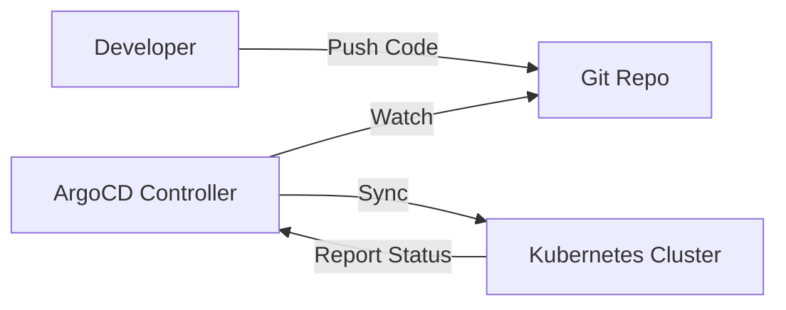

# ☸️ Module 5.6: GitOps & Platform Engineering

> **The Future of Operations.**
>
> *Tương lai của Vận hành.*

---

## 🎯 Learning Objectives (Mục Tiêu)

- ✅ Master the **GitOps Principles** (Thành thạo nguyên lý GitOps): Declarative, Versioned, Automated, Reconciled.
- ✅ Implement **ArgoCD** for Kubernetes Continuous Deployment (Triển khai CD với ArgoCD).
- ✅ Understand **Platform Engineering** (Hiểu Kỹ thuật Nền tảng): Shifting from "tickets" to "self-service".
- ✅ Intro to **IDP** (Internal Developer Platform).

---

## 📚 Content (Nội Dung)

### 1. What is GitOps? (GitOps là gì?)

GitOps is not just "Git + Ops". It is a flow:
*GitOps không chỉ là "Git + Ops". Nó là một quy trình:*

1. **Git is the Single Source of Truth** (Git là nguồn chân lý duy nhất).
2. **Push-based vs Pull-based**:
   - *Traditional CI/CD (Push)*: Jenkins runs `kubectl apply` (Jenkins đẩy lệnh vào cluster).
   - *GitOps (Pull)*: ArgoCD (inside cluster) sees change in Git and syncs it (ArgoCD trong cluster tự kéo thay đổi về).

*GitOps không chỉ là dùng Git. Nó là việc chuyển đổi mô hình từ "Đẩy" (Push) sang "Kéo" (Pull). Agent nằm trong cluster sẽ tự động đồng bộ trạng thái.*

### 2. ArgoCD Fundamentals (Cơ bản về ArgoCD)

### 3. Platform Engineering

**DevOps is dead, Long live Platform Engineering?** (DevOps đã chết, Platform Engineering lên ngôi?)
Not really. Platform Engineering is the next evolution (Không hẳn, đây là bước tiến hóa tiếp theo).

- **Old Way**: Dev asks Ops for a database -> Ops creates it (Ticket) (Cách cũ: Tạo ticket nhờ Ops).
- **New Way**: Ops builds a Portal -> Dev clicks "Create DB" -> Automation creates it (Self-Service) (Cách mới: Tự phục vụ qua Portal).

---

## 🛠️ Hands-on Project: GitOps Pipeline (Dự án: Pipeline GitOps)

1. Install ArgoCD on Minikube/EKS (Cài đặt ArgoCD).
2. Create a specific Git Repo for **Manifests** (Helm/Kustomize) (Tạo repo chứa manifests).
3. Connect ArgoCD to Git (Kết nối ArgoCD với Git).
4. Scale up replicas in Git -> Watch ArgoCD sync automatically (Tăng số lượng replica và xem ArgoCD tự đồng bộ).

---

## 🔗 Navigation

[⬅️ Back to Career Path](../README.md)
