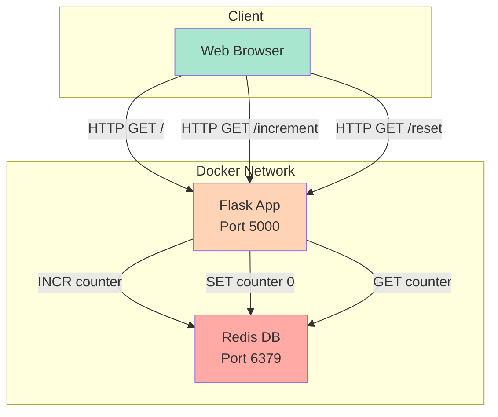
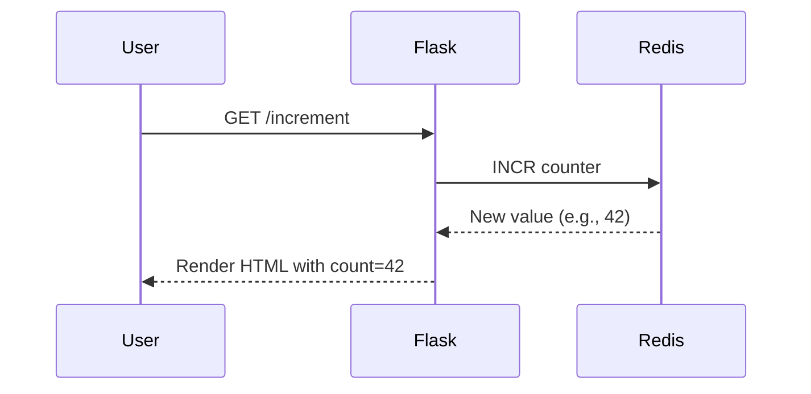

# 🧪 MODULE 01: LABS - Thực hành PLAN

## 📋 Mục lục

- [LAB 1: Thiết lập môi trường Git](#lab-1-thiết-lập-môi-trường-git)
- [LAB 2: Viết tài liệu dự án](#lab-2-viết-tài-liệu-dự-án)
- [LAB 3: Lập kế hoạch Sprint với GitHub Projects](#lab-3-lập-kế-hoạch-sprint-với-github-projects)
- [LAB 4: Git Collaboration Workflow](#lab-4-git-collaboration-workflow)

---

## LAB 1: Thiết lập môi trường Git

### 🎯 Mục tiêu

- Cài đặt và cấu hình Git
- Tạo repository trên GitHub
- Thực hiện commit đầu tiên

---

### LAB 1.1: Cài đặt Git và cấu hình user

#### Bước 1: Kiểm tra Git đã cài chưa

```bash
git --version
```

**Expected Output:**

```
git version 2.43.0 (hoặc cao hơn)
```

Nếu chưa có, tải tại: <https://git-scm.com/downloads>

---

#### Bước 2: Cấu hình thông tin user

```bash
# Đặt tên (hiển thị trong commit)
git config --global user.name "Your Name"

# Đặt email (phải trùng với email GitHub)
git config --global user.email "your.email@example.com"

# Kiểm tra lại
git config --list | grep user
```

**Expected Output:**

```
user.name=Your Name
user.email=your.email@example.com
```

---

#### Bước 3: Cấu hình editor mặc định (tùy chọn)

```bash
# Dùng VS Code làm editor cho Git
git config --global core.editor "code --wait"

# Hoặc dùng Nano (đơn giản hơn)
git config --global core.editor nano

# Hoặc dùng Vim (cho người advanced)
git config --global core.editor vim
```

---

#### Bước 4: Cấu hình Git Credential Helper (tránh nhập password mỗi lần push)

```bash
# Windows
git config --global credential.helper wincred

# macOS
git config --global credential.helper osxkeychain

# Linux
git config --global credential.helper cache
```

---

### LAB 1.2: Tạo repository trên GitHub

#### Bước 1: Đăng nhập GitHub

Truy cập: <https://github.com/login>

---

#### Bước 2: Tạo repository mới

1. Click nút **"New"** (góc trên bên trái, icon dấu +)
2. Điền thông tin:
   - **Repository name**: `devops-counter-app`
   - **Description**: `DevOps Zero to Hero - The Counter App`
   - **Public** hoặc **Private**: Chọn Public (để showcase portfolio)
   - ✅ Check "Add a README file"
   - ✅ Add .gitignore template: Chọn **Python**
   - ✅ Choose a license: Chọn **MIT License**
3. Click **"Create repository"**

✅ **Result**: Bạn có repo với URL: `https://github.com/YOUR_USERNAME/devops-counter-app`

---

### LAB 1.3: Clone repository về local

#### Bước 1: Copy Clone URL

Trên trang repo GitHub, click nút **"Code"** (màu xanh lá) → Copy HTTPS URL:

```
https://github.com/YOUR_USERNAME/devops-counter-app.git
```

---

#### Bước 2: Clone về máy

```bash
# Di chuyển đến thư mục muốn lưu code
cd ~/projects  # hoặc D:\projects trên Windows

# Clone repository
git clone https://github.com/YOUR_USERNAME/devops-counter-app.git

# Vào thư mục vừa clone
cd devops-counter-app

# Kiểm tra nội dung
ls -la  # hoặc dir trên Windows
```

**Expected Output:**

```
.git/           (thư mục Git metadata)
.gitignore      (file ignore)
LICENSE         (giấy phép MIT)
README.md       (file tài liệu)
```

---

### LAB 1.4: Thực hiện commit đầu tiên

#### Bước 1: Tạo file mới

```bash
# Tạo file requirements.txt
echo "flask==3.0.0" > requirements.txt
echo "redis==5.0.1" >> requirements.txt
```

---

#### Bước 2: Kiểm tra trạng thái Git

```bash
git status
```

**Expected Output:**

```
On branch main
Untracked files:
  requirements.txt

nothing added to commit but untracked files present
```

---

#### Bước 3: Thêm file vào Staging Area

```bash
# Thêm file cụ thể
git add requirements.txt

# Kiểm tra lại status
git status
```

**Expected Output:**

```
On branch main
Changes to be committed:
  new file:   requirements.txt
```

---

#### Bước 4: Commit thay đổi

```bash
# Commit với message rõ ràng
git commit -m "Add Python dependencies for Flask and Redis"

# Xem lịch sử commit
git log --oneline
```

**Expected Output:**

```
a1b2c3d Add Python dependencies for Flask and Redis
e4f5g6h Initial commit
```

---

#### Bước 5: Push lên GitHub

```bash
git push origin main
```

Nhập username và password GitHub khi được hỏi.

**Lưu ý**: Từ 2021, GitHub không chấp nhận password thông thường. Bạn cần tạo **Personal Access Token (PAT)**:

1. GitHub → Settings → Developer settings → Personal access tokens → Tokens (classic)
2. Generate new token → Chọn scopes: `repo` (full control)
3. Copy token → Dùng thay cho password

---

✅ **Kết quả**: Mở GitHub repo, bạn sẽ thấy file `requirements.txt` đã xuất hiện!

---

## LAB 2: Viết tài liệu dự án

### 🎯 Mục tiêu

- Viết User Stories
- Tạo Architecture Diagram
- Cập nhật README.md chuyên nghiệp

---

### LAB 2.1: Viết User Stories

#### Bước 1: Tạo thư mục docs

```bash
mkdir docs
cd docs
```

---

#### Bước 2: Tạo file user-stories.md

```bash
# Tạo file
touch user-stories.md  # hoặc New-Item user-stories.md trên Windows
```

Mở file và viết:

```markdown
# User Stories - The Counter App

## Epic: Counter Management
As a website visitor, I want to interact with a counter system.

### Story 1: View Counter
**As a** website visitor  
**I want** to see the current counter value  
**So that** I know how many interactions happened before me

**Acceptance Criteria:**
- Counter displays a number (default: 0)
- Number updates in real-time
- Number is visible and readable (large font)

**DoD:**
- [ ] UI displays counter prominently
- [ ] Redis connection established
- [ ] Counter loads on page refresh
- [ ] Tested on Chrome, Firefox, Safari

---

### Story 2: Increment Counter
**As a** website visitor  
**I want** to click a button to increase the counter  
**So that** I can participate in the counting

**Acceptance Criteria:**
- Button labeled "Tăng" or "➕"
- Clicking button increases counter by 1
- Update is instant (no page reload)
- Multiple clicks work correctly

**DoD:**
- [ ] Button is clickable and responsive
- [ ] Redis increment command works
- [ ] No race condition when multiple users click
- [ ] Unit test for increment logic

---

### Story 3: Reset Counter
**As a** admin  
**I want** to reset the counter to 0  
**So that** I can start fresh when needed

**Acceptance Criteria:**
- Button labeled "Reset" or "🔄"
- Clicking sets counter to 0
- Confirmation dialog (optional but nice)

**DoD:**
- [ ] Reset button implemented
- [ ] Redis SET command works
- [ ] Test edge case: reset when counter already 0

---

### Story 4: Persistent Storage
**As a** system administrator  
**I want** counter value to persist across server restarts  
**So that** we don't lose data

**Acceptance Criteria:**
- Data stored in Redis
- Redis volume configured in Docker Compose
- Counter retains value after restart

**DoD:**
- [ ] Docker volume created
- [ ] Test: docker-compose down → up → counter unchanged
- [ ] Documentation updated

---

### Story 5: Health Check Endpoint
**As a** DevOps engineer  
**I want** a health check endpoint  
**So that** monitoring tools can verify app status

**Acceptance Criteria:**
- Endpoint: `/health`
- Returns JSON with status
- Returns 200 if healthy, 503 if unhealthy

**DoD:**
- [ ] /health endpoint implemented
- [ ] Checks Redis connectivity
- [ ] Returns proper HTTP status codes
- [ ] Documented in README
```

---

#### Bước 3: Commit User Stories

```bash
# Quay về root folder
cd ..

# Add và commit
git add docs/user-stories.md
git commit -m "Add user stories for Counter App"
git push origin main
```

---

### LAB 2.2: Tạo Architecture Diagram

#### Option 1: Dùng Mermaid (trong Markdown)

Tạo file `docs/architecture.md`:

```markdown
# Architecture - The Counter App

## High-Level Architecture



## Component Details

### 1. Web Browser (Client)

- Any modern browser (Chrome, Firefox, Safari)
- Renders HTML/CSS from Flask
- Sends HTTP requests

### 2. Flask App (Application Server)

- **Language**: Python 3.11
- **Framework**: Flask 3.0
- **Endpoints**:
  - `/` → Homepage
  - `/increment` → Increase counter
  - `/reset` → Reset to 0
  - `/health` → Health check
- **Port**: 5000

### 3. Redis Database

- **Type**: In-memory key-value store
- **Version**: 7-alpine (Docker image)
- **Data**: Single key `counter` storing integer
- **Persistence**: Enabled via volume
- **Port**: 6379

## Data Flow

### Scenario: User clicks "Tăng"



## Deployment Architecture (Docker Compose)

```
┌─────────────────────────────────────────┐
│         Docker Host (Your Machine)      │
│                                         │
│  ┌─────────────────────────────────┐   │
│  │    Docker Network: bridge       │   │
│  │                                 │   │
│  │  ┌──────────┐      ┌─────────┐ │   │
│  │  │Flask App │◄────►│  Redis  │ │   │
│  │  │Container │      │Container│ │   │
│  │  └─────┬────┘      └────┬────┘ │   │
│  │        │                │      │   │
│  └────────┼────────────────┼──────┘   │
│           │                │          │
│     Port 5000         Port 6379       │
└───────────┼────────────────┼──────────┘
            │                │
            ▼                ▼
         Internet       (Internal Only)
```

```

---

#### Option 2: Dùng draw.io (Tool vẽ diagram)

1. Truy cập: https://app.diagrams.net
2. Tạo New Diagram → Blank Diagram
3. Vẽ sơ đồ với 3 components: Browser, Flask, Redis
4. Export as PNG: `architecture.png`
5. Lưu vào `docs/`

Trong `architecture.md`, chèn ảnh:
```markdown

```

---

### LAB 2.3: Cập nhật README.md chuyên nghiệp

Mở `README.md` và thay thế nội dung:

```markdown
# 🎯 The Counter App

> A simple web application demonstrating DevOps best practices  
> Built with Flask + Redis, containerized with Docker

[](https://www.python.org/)
[](https://flask.palletsprojects.com/)
[](https://redis.io/)
[](./LICENSE)

---

## 📖 Description

**The Counter App** is a minimalist web application that counts and persists user interactions. This project serves as a hands-on learning tool for the **DevOps Zero to Hero** course.

### Features
- ➕ **Increment Counter**: Click to increase count
- 🔄 **Reset Counter**: Reset to zero
- 💾 **Persistent Storage**: Data survives restarts
- 🏥 **Health Check**: Monitoring endpoint
- 🐳 **Dockerized**: Run anywhere with Docker

---

## 🏗️ Architecture

```

User Browser  →  Flask (Python)  →  Redis (Database)

```

For detailed architecture, see [docs/architecture.md](./docs/architecture.md)

---

## 🚀 Quick Start

### Prerequisites
- Docker Desktop installed and running
- Docker Compose (included with Docker Desktop)

### Run with Docker Compose

```bash
# Clone the repository
git clone https://github.com/YOUR_USERNAME/devops-counter-app.git
cd devops-counter-app

# Start the application
docker-compose up --build

# Open browser
http://localhost:5000
```

### Run locally (without Docker)

```bash
# Install Redis
brew install redis  # macOS
sudo apt-get install redis  # Linux

# Start Redis server
redis-server

# Install Python dependencies
pip install -r requirements.txt

# Run Flask app
python app.py
```

---

## 🧪 Testing

### Health Check

```bash
curl http://localhost:5000/health
```

**Expected Response:**

```json
{
  "status": "healthy",
  "redis": "connected"
}
```

### Manual Testing

1. Open <http://localhost:5000>
2. Click "➕ Tăng" → Counter increases
3. Click "🔄 Reset" → Counter resets to 0
4. Restart: `docker-compose restart`
5. Refresh page → Counter retains last value ✅

---

## 📁 Project Structure

```
devops-counter-app/
├── app.py                  # Flask application
├── Dockerfile              # Docker image definition
├── docker-compose.yml      # Multi-container orchestration
├── requirements.txt        # Python dependencies
├── README.md               # This file
├── LICENSE                 # MIT License
├── .gitignore              # Git ignore rules
└── docs/
    ├── architecture.md     # System architecture
    └── user-stories.md     # User stories
```

---

## 🛠️ Tech Stack

| Component | Technology | Version |
|-----------|------------|---------|
| **Backend** | Python Flask | 3.0.0 |
| **Database** | Redis | 7-alpine |
| **Container** | Docker | Latest |
| **Orchestration** | Docker Compose | 3.8 |
| **OS** | Alpine Linux | Latest |

---

## 🔧 Configuration

### Environment Variables

| Variable | Default | Description |
|----------|---------|-------------|
| `REDIS_HOST` | `localhost` | Redis server hostname |
| `REDIS_PORT` | `6379` | Redis server port |

### Docker Compose Services

- **web**: Flask application (port 5000)
- **redis**: Redis database (port 6379)

---

## 📚 Documentation

- [User Stories](./docs/user-stories.md)
- [Architecture](./docs/architecture.md)

---

## 🤝 Contributing

1. Fork the repository
2. Create feature branch: `git checkout -b feature/my-feature`
3. Commit changes: `git commit -m "Add my feature"`
4. Push to branch: `git push origin feature/my-feature`
5. Open a Pull Request

---

## 📝 License

This project is licensed under the MIT License - see [LICENSE](./LICENSE) file for details.

---

## 🙏 Acknowledgments

- Part of **DevOps Zero to Hero** course
- Inspired by real-world DevOps practices
- Built for educational purposes

---

**Made with ❤️ for learning DevOps**

```

Commit changes:
```bash
git add README.md docs/architecture.md
git commit -m "Update README and add architecture docs"
git push origin main
```

---

### LAB 2.4: Tạo CHANGELOG.md

```bash
touch CHANGELOG.md
```

Nội dung:

```markdown
# Changelog

All notable changes to this project will be documented in this file.

The format is based on [Keep a Changelog](https://keepachangelog.com/en/1.0.0/).

## [Unreleased]

### Planned
- Add unit tests
- Implement CI/CD with GitHub Actions
- Deploy to Kubernetes

---

## [0.1.0] - 2024-01-15

### Added
- Initial project structure
- Flask application with counter functionality
- Redis integration for persistent storage
- Docker and Docker Compose configuration
- Project documentation (README, User Stories, Architecture)
- Health check endpoint

### Changed
- N/A

### Fixed
- N/A

---

## [0.0.1] - 2024-01-10

### Added
- Repository initialization
- Basic README.md
- MIT License
- Python .gitignore
```

Commit:

```bash
git add CHANGELOG.md
git commit -m "Add CHANGELOG for tracking project history"
git push origin main
```

---

## LAB 3: Lập kế hoạch Sprint với GitHub Projects

### 🎯 Mục tiêu

- Chia nhỏ dự án thành tasks
- Sử dụng GitHub Issues
- Tạo Project Board

---

### LAB 3.1: Tạo GitHub Issues

#### Bước 1: Truy cập tab Issues

1. Mở repo trên GitHub
2. Click tab **"Issues"**
3. Click **"New issue"**

---

#### Bước 2: Tạo Issue #1 - Setup Flask App

**Title**: `Setup Flask application skeleton`

**Description**:

```markdown
## Description
Create basic Flask app structure with:
- app.py with routes: `/`, `/increment`, `/reset`, `/health`
- HTML template
- Redis connection

## Acceptance Criteria
- [ ] Flask app runs on port 5000
- [ ] Routes return 200 OK
- [ ] Redis connection established

## Estimated Time
2 hours

## Labels
`enhancement`, `backend`
```

Click **"Submit new issue"**

---

#### Bước 3: Tạo thêm các Issues khác

Tạo tương tự cho:

**Issue #2**: `Create Dockerfile for Flask app`  
**Issue #3**: `Write docker-compose.yml for multi-container`  
**Issue #4**: `Add health check endpoint`  
**Issue #5**: `Write unit tests`  
**Issue #6**: `Create UI with HTML/CSS`  

---

### LAB 3.2: Gán Labels và Milestones

#### Tạo Labels

1. Tab Issues → Click **"Labels"**
2. Tạo labels:
   - `bug` (đỏ) - Lỗi cần sửa
   - `enhancement` (xanh lá) - Tính năng mới
   - `documentation` (xanh dương) - Tài liệu
   - `frontend` (cam) - UI/UX
   - `backend` (tím) - Backend logic

#### Tạo Milestone

1. Tab Issues → Click **"Milestones"** → **"New milestone"**
2. Title: `v0.1.0 - MVP Release`
3. Due date: 2 tuần từ hôm nay
4. Description: "Minimum Viable Product with basic counter functionality"

Gán các Issues vào Milestone này.

---

### LAB 3.3: Tạo Project Board

#### Bước 1: Tạo Project

1. Tab **"Projects"** → **"New project"**
2. Chọn template: **"Board"**
3. Project name: `Counter App Development`
4. Description: "Sprint planning for The Counter App"
5. Click **"Create project"**

---

#### Bước 2: Cấu hình Columns

Board mặc định có 3 cột:

- 📋 **Todo** - Công việc chưa làm
- 🚧 **In Progress** - Đang làm
- ✅ **Done** - Hoàn thành

Thêm cột:

- 👀 **In Review** - Chờ review

---

#### Bước 3: Thêm Issues vào Board

1. Click **"Add item"** ở cột **Todo**
2. Chọn Issue #1, #2, #3, ...
3. Kéo thả giữa các cột khi làm việc

---

### LAB 3.4: Workflow thực tế

#### Kịch bản: Bắt đầu làm Issue #1

1. **Kéo Issue #1** từ Todo → In Progress
2. **Tạo branch mới**:

   ```bash
   git checkout -b feature/flask-skeleton
   ```

3. **Code** (tham khảo `/source-code/app.py`)
4. **Commit**:

   ```bash
   git add app.py
   git commit -m "Setup Flask skeleton with basic routes (#1)"
   ```

5. **Push branch**:

   ```bash
   git push origin feature/flask-skeleton
   ```

6. **Tạo Pull Request** trên GitHub
7. **Review** code (tự review hoặc nhờ bạn)
8. **Merge PR** → Issue #1 tự động chuyển sang Done
9. **Xóa branch**:

   ```bash
   git branch -d feature/flask-skeleton
   ```

---

## LAB 4: Git Collaboration Workflow

### 🎯 Mục tiêu

- Làm việc với branches
- Tạo và merge Pull Requests
- Giải quyết merge conflicts

---

### LAB 4.1: Feature Branch Workflow

#### Bước 1: Tạo branch cho tính năng mới

```bash
# Đảm bảo đang ở main và đã pull code mới nhất
git checkout main
git pull origin main

# Tạo branch mới
git checkout -b feature/add-reset-button

# Kiểm tra branch hiện tại
git branch
```

**Output:**

```
  main
* feature/add-reset-button  ← Dấu * chỉ branch đang active
```

---

#### Bước 2: Thực hiện thay đổi

Chỉnh sửa `app.py`, thêm route `/reset`:

```python
@app.route('/reset')
def reset():
    """Reset counter về 0"""
    if r:
        try:
            r.set('counter', 0)
        except Exception as e:
            print(f"Error resetting: {e}")
    return index()
```

---

#### Bước 3: Commit thay đổi

```bash
# Kiểm tra thay đổi
git diff

# Add và commit
git add app.py
git commit -m "Add reset endpoint to clear counter"

# Xem log
git log --oneline
```

---

### LAB 4.2: Push branch và tạo Pull Request

#### Bước 1: Push branch lên GitHub

```bash
git push origin feature/add-reset-button
```

---

#### Bước 2: Tạo Pull Request trên GitHub

1. GitHub sẽ hiện banner: **"Compare & pull request"** → Click
2. Hoặc: Tab **"Pull requests"** → **"New pull request"**
3. Base: `main` ← Compare: `feature/add-reset-button`
4. Điền thông tin PR:
   - **Title**: `Add reset button functionality`
   - **Description**:

     ```markdown
     ## Changes
     - Added `/reset` route
     - Resets counter to 0 when clicked
     
     ## Testing
     - Manually tested reset functionality
     - Counter returns to 0 successfully
     
     Closes #3
     ```

5. Click **"Create pull request"**

---

### LAB 4.3: Review và Merge PR

#### Review checklist

- [ ] Code có comment rõ ràng?
- [ ] Có lỗi syntax không?
- [ ] Logic có đúng không?
- [ ] Có test được không?

Nếu OK, click **"Merge pull request"** → **"Confirm merge"**

---

#### Bước sau khi merge

```bash
# Quay về main
git checkout main

# Pull code mới nhất (đã có code từ branch vừa merge)
git pull origin main

# Xóa branch local (đã không cần)
git branch -d feature/add-reset-button

# Xóa branch remote (tùy chọn)
git push origin --delete feature/add-reset-button
```

---

### LAB 4.4: Giải quyết Merge Conflict

#### Kịch bản: 2 người cùng sửa 1 file

**Người A** sửa dòng 10 của `app.py`:

```python
app.run(host='0.0.0.0', port=5000, debug=True)
```

**Người B** cũng sửa dòng 10:

```python
app.run(host='localhost', port=8080, debug=False)
```

→ Khi merge sẽ xảy ra **conflict**!

---

#### Mô phỏng conflict

```bash
# Tạo branch 1
git checkout -b branch-a
# Sửa app.py (port=5000)
git commit -am "Change port to 5000"

# Quay về main
git checkout main

# Tạo branch 2
git checkout -b branch-b
# Sửa app.py (port=8080)
git commit -am "Change port to 8080"

# Merge branch-a vào main (OK)
git checkout main
git merge branch-a

# Merge branch-b vào main (CONFLICT!)
git merge branch-b
```

---

#### Giải quyết conflict

Git sẽ báo:

```
CONFLICT (content): Merge conflict in app.py
Automatic merge failed; fix conflicts and then commit the result.
```

Mở `app.py`, bạn sẽ thấy:

```python
<<<<<<< HEAD
app.run(host='0.0.0.0', port=5000, debug=True)
=======
app.run(host='localhost', port=8080, debug=False)
>>>>>>> branch-b
```

**Cách sửa:**

1. Xóa các dòng `<<<<`, `====`, `>>>>`
2. Chọn version đúng (hoặc kết hợp cả 2)
3. Save file

Ví dụ chọn port 5000:

```python
app.run(host='0.0.0.0', port=5000, debug=True)
```

Commit:

```bash
git add app.py
git commit -m "Resolve merge conflict: keep port 5000"
```

---

## ✅ Checklist hoàn thành LAB 1

- [ ] Git đã cài đặt và cấu hình
- [ ] Repository trên GitHub đã tạo
- [ ] Clone repository về local
- [ ] Thực hiện commit đầu tiên thành công
- [ ] User Stories đã viết
- [ ] Architecture Diagram đã vẽ
- [ ] README.md chuyên nghiệp
- [ ] CHANGELOG.md đã tạo
- [ ] GitHub Issues và Project Board đã setup
- [ ] Thực hành Feature Branch Workflow
- [ ] Tạo và merge Pull Request
- [ ] Giải quyết merge conflict

---

## 🎉 Chúc mừng

Bạn đã hoàn thành tất cả LABs của Module 01!

### Next Steps

1. Chuyển sang **`SCENARIOS.md`** để giải quyết tình huống thực chiến
2. Review lại kiến thức trong **`README.md`**
3. Đảm bảo đã check hết **`REQUIREMENT.md`**

---

*"Practice doesn't make perfect. Perfect practice makes perfect." - Vince Lombardi*
