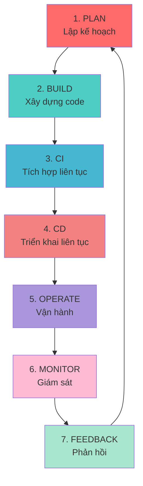
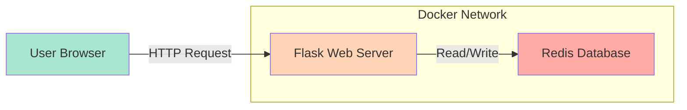
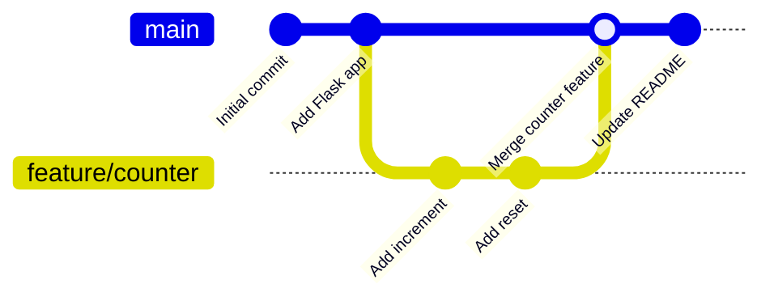

# 📘 MODULE 01: PLAN - Strategy, Collaboration & Requirements

## 🤔 Tại sao cần "PLAN"?

### Ẩn dụ: Xây nhà không có bản vẽ

Tưởng tượng bạn muốn xây một ngôi nhà:

- **Không có bản vẽ**: Thợ xây tự ý xây, kết quả cửa sổ lệch, phòng ngủ nhỏ xíu, nhà bếp quá rộng không cần thiết. Phá đi xây lại mất thời gian và tiền bạc.
- **Có bản vẽ rõ ràng**: Mọi người biết chính xác phòng nào ở đâu, cửa nào đặt chỗ nào. Xây xong đúng ý, không phải sửa chữa.

**DevOps cũng vậy**:

- Không có kế hoạch → Code lung tung → Deploy lỗi → Khách hàng giận → Sửa gấp → Tạo bug mới → Vòng lặp ác mộng
- Có kế hoạch rõ ràng → Code đúng mục tiêu → Test kỹ càng → Deploy tự tin → Khách hàng hài lòng

---

## 📚 DevOps là gì? (Lý thuyết cốt lõi)

### Định nghĩa

**DevOps** = **Dev**elopment (Phát triển) + **Op**eration**s** (Vận hành)

Là một **văn hóa, phương pháp làm việc** để:

1. **Developers** (lập trình viên) và **Operations** (quản trị hệ thống) làm việc cùng nhau
2. **Tự động hóa** các công việc lặp đi lặp lại
3. **Giao hàng nhanh** (Continuous Delivery) nhưng vẫn **ổn định** (Reliability)

### Ẩn dụ: Dây chuyền sản xuất ô tô

**Cách cũ (Waterfall)**:

```
Thiết kế (6 tháng) → Sản xuất (6 tháng) → Kiểm tra (3 tháng) → Ra mắt
```

- Nếu phát hiện thiết kế sai ở cuối → Phải quay lại từ đầu → Mất 15 tháng!

**Cách DevOps (Agile + Automation)**:

```
Tuần 1: Thiết kế bánh xe → Sản xuất → Test → OK!
Tuần 2: Thiết kế động cơ → Sản xuất → Test → Phát hiện lỗi → Sửa ngay
Tuần 3: Thiết kế vỏ xe → Sản xuất → Test → OK!
```

- Phát hiện lỗi sớm → Sửa nhanh → Tiết kiệm thời gian và chi phí

---

## 🔄 DevOps Lifecycle (Vòng đời DevOps)



### Giải thích từng giai đoạn

| Giai đoạn | Mô tả | Ẩn dụ |
|-----------|-------|-------|
| **1. PLAN** | Lập kế hoạch, thiết kế kiến trúc, chia nhỏ công việc | Vẽ bản thiết kế nhà |
| **2. BUILD** | Viết code, tạo môi trường phát triển, quản lý version | Mua vật liệu xây dựng |
| **3. CI** | Tự động test code mỗi khi có thay đổi | Dây chuyền kiểm tra chất lượng nhà máy |
| **4. CD** | Tự động deploy lên server khi pass hết test | Vận chuyển hàng đến kho |
| **5. OPERATE** | Quản lý hạ tầng, scaling, backup | Bảo trì máy móc nhà máy |
| **6. MONITOR** | Theo dõi metrics, logs, hiệu năng | Bảng điều khiển máy bay |
| **7. FEEDBACK** | Thu thập phản hồi, học từ lỗi, cải tiến | Họp rút kinh nghiệm, cải tiến quy trình |

---

## 🏃 Agile là gì?

### Định nghĩa

**Agile** (Linh hoạt) là phương pháp phát triển phần mềm theo **chu kỳ ngắn** (Sprint), mỗi Sprint giao một phiên bản có thể dùng được.

### So sánh Waterfall vs Agile

#### **Waterfall** (Thác nước - Tuần tự)

```
Requirements (Yêu cầu) 
    ↓ (3 tháng)
Design (Thiết kế)
    ↓ (3 tháng)
Implementation (Lập trình)
    ↓ (6 tháng)
Testing (Kiểm thử)
    ↓ (2 tháng)
Deployment (Triển khai)
    ↓
Maintenance (Bảo trì)
```

**Vấn đề**: Khách hàng phải đợi 14 tháng mới thấy sản phẩm. Nếu sai yêu cầu → Thảm họa!

#### **Agile** (Linh hoạt - Lặp lại)

```
Sprint 1 (2 tuần): Tính năng A (Requirements → Design → Code → Test → Deploy)
    ↓ Show khách hàng → Feedback
Sprint 2 (2 tuần): Tính năng B + Sửa A dựa trên feedback
    ↓ Show khách hàng → Feedback
Sprint 3 (2 tuần): Tính năng C + Sửa B
    ...
```

**Lợi ích**: Khách hàng thấy sản phẩm sau 2 tuần, có thể điều chỉnh ngay.

### Ẩn dụ: Nấu ăn cho khách

**Waterfall**:

- Bạn vào bếp nấu 7 món trong 3 giờ
- Ra mâm cơm, khách nói: "Tôi ăn chay, bạn làm lại đi"
- 💀 GG!

**Agile**:

- Bạn nấu món súp, đưa khách nếm
- Khách: "Mặn quá, bỏ thêm nước"
- Bạn điều chỉnh ngay
- Món tiếp theo đã biết khách thích nhạt → Nấu đúng khẩu vị

---

## 📝 User Story là gì?

### Định nghĩa

**User Story** = Câu chuyện người dùng, mô tả tính năng từ góc nhìn người dùng.

### Format chuẩn

```
As a [vai trò]
I want [tính năng]
So that [lợi ích]
```

### Ví dụ cho The Counter App

**❌ Viết sai** (Quá kỹ thuật):
> "Tạo API endpoint /increment với method POST để tăng giá trị integer trong Redis key 'counter'"

**✅ Viết đúng** (Từ góc nhìn người dùng):
> As a **website visitor**  
> I want to **click a button to increase the counter**  
> So that **I can see the number of visitors before me**

### Tại sao phải viết User Story?

- **Developer** hiểu được người dùng cần gì (không chỉ code máy móc)
- **Tester** biết test case nào quan trọng
- **Product Owner** đánh giá được giá trị tính năng

---

## 🏗️ Architecture Diagram (Sơ đồ kiến trúc)

### The Counter App Architecture



### Giải thích

1. **User Browser**: Người dùng truy cập từ Chrome, Firefox, v.v.
2. **Flask Web Server**:
   - Nhận request từ browser
   - Xử lý logic (tăng/giảm số đếm)
   - Gọi Redis để lưu/lấy dữ liệu
   - Trả về HTML cho browser
3. **Redis Database**:
   - Lưu trữ giá trị counter
   - Siêu nhanh (in-memory)
   - Persist data vào disk

### Architecture Pattern: 2-Tier

```
┌─────────────────┐
│  Presentation   │ ← User Interface (HTML/CSS/JS)
│      Tier       │
└────────┬────────┘
         │ HTTP
         ▼
┌─────────────────┐
│   Application   │ ← Business Logic (Flask)
│      Tier       │
└────────┬────────┘
         │ TCP
         ▼
┌─────────────────┐
│    Data Tier    │ ← Database (Redis)
└─────────────────┘
```

---

## 🔧 Git - Version Control System (VCS)

### Git là gì?

**Git** = Hệ thống quản lý phiên bản phân tán (Distributed Version Control System)

### Ẩn dụ: Google Docs với History

- Bạn viết tài liệu Word, muốn sửa đoạn 5 nhưng sợ hỏng → Copy file thành "Tai lieu v2", "Tai lieu v2 final", "Tai lieu v2 final FINAL"
- **Git**: Tự động lưu mọi thay đổi, bạn có thể quay lại bất kỳ phiên bản nào. Nhiều người cùng sửa một file, Git tự merge (hoặc báo conflict để bạn tự quyết định)

### Git Workflow cơ bản

```mermaid
graph LR
    A[Working Directory<br/>Code trên máy bạn] -->|git add| B[Staging Area<br/>Chuẩn bị commit]
    B -->|git commit| C[Local Repository<br/>Lịch sử trên máy bạn]
    C -->|git push| D[Remote Repository<br/>GitHub]
    D -->|git pull| A
    
    style A fill:#ffe66d
    style B fill:#a8dadc
    style C fill:#457b9d
    style D fill:#1d3557
```



### Các câu lệnh cơ bản

```bash
# Khởi tạo Git trong folder
git init

# Thêm file vào staging
git add app.py

# Commit (lưu snapshot)
git commit -m "Add counter feature"

# Đẩy code lên GitHub
git push origin main

# Kéo code mới nhất về
git pull origin main

# Tạo branch mới
git checkout -b feature/add-reset-button

# Xem lịch sử commit
git log --oneline

# Xem sự khác biệt
git diff
```

---

## 📊 Branching Strategy

### Feature Branch Workflow



### Quy tắc đặt tên branch

| Loại | Prefix | Ví dụ |
|------|--------|-------|
| Tính năng mới | `feature/` | `feature/add-login` |
| Sửa bug | `bugfix/` hoặc `fix/` | `fix/counter-overflow` |
| Hot fix (sửa gấp production) | `hotfix/` | `hotfix/security-patch` |
| Thử nghiệm | `experiment/` | `experiment/new-ui` |

---

## 📖 Documentation Best Practices

### README.md phải có gì?

1. **Tiêu đề và mô tả** - App làm gì?
2. **Installation** - Cài đặt như thế nào?
3. **Usage** - Dùng như thế nào?
4. **Architecture** - Kiến trúc ra sao?
5. **Contributing** - Đóng góp thế nào?
6. **License** - Giấy phép gì?

### Ví dụ template

```markdown
# Project Name

## 📖 Description
Brief description of what this project does.

## 🚀 Installation
```bash
pip install -r requirements.txt
```

## 💻 Usage

```bash
python app.py
```

## 🏗️ Architecture

[Diagram here]

## 🤝 Contributing

Pull requests are welcome!

## 📝 License

MIT

```

---

## 🎯 Definition of Done (DoD)

**DoD** = Tiêu chí để coi một task là "Hoàn thành"

### Ví dụ DoD cho "Tính năng tăng counter":

- [x] Code viết xong, có comment
- [x] Unit test pass 100%
- [x] Code được review bởi ít nhất 1 người
- [x] Không có lỗi lint/format
- [x] README được cập nhật
- [x] Chạy được trên local
- [x] Merge vào main branch

---

## 💡 Key Takeaways (Điểm chính)

1. **PLAN trước khi CODE** - "Sharpening the axe is better than chopping blindly"
2. **DevOps = Culture, not just tools** - Quan trọng nhất là tư duy, công cụ chỉ là phương tiện
3. **Agile > Waterfall** (trong hầu hết trường hợp) - Feedback sớm, điều chỉnh nhanh
4. **Documentation = Code** - Code không có docs = code không tồn tại
5. **Git là kỹ năng bắt buộc** - 100% công ty đều dùng VCS

---

## ❓ Câu hỏi ôn tập

1. DevOps giải quyết vấn đề gì? Cho ví dụ thực tế.
2. So sánh Waterfall và Agile bằng ẩn dụ của bạn.
3. Viết 3 User Stories cho một ứng dụng To-Do List.
4. Giải thích sự khác biệt giữa `git add`, `git commit`, và `git push`.
5. Tại sao cần viết README.md?

---

## ⏭️ Next Steps

Sau khi nắm vững lý thuyết, hãy chuyển sang:

👉 **`LABS.md`** - Thực hành hands-on!

---

*"Weeks of coding can save you hours of planning." - Unknown*
