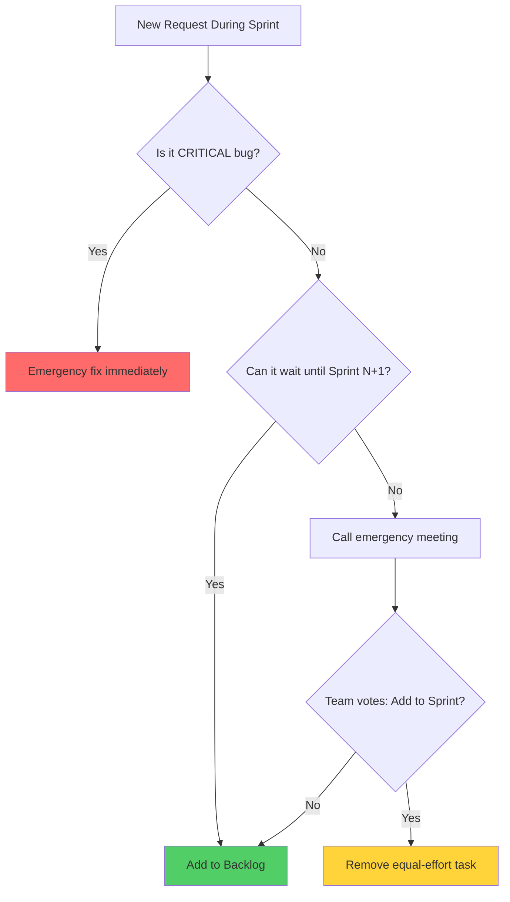
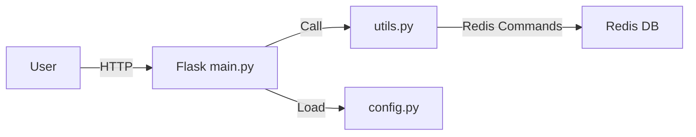

# 🚨 MODULE 01: SCENARIOS - Tình huống thực chiến

## 📖 Hướng dẫn sử dụng

Mỗi scenario gồm 4 phần:

1. **🚨 Bối cảnh** - Mô tả tình huống và triệu chứng
2. **🕵️ Điều tra** - Cách phát hiện nguyên nhân gốc rễ
3. **💡 Giải pháp** - Các bước xử lý cụ thể
4. **🧠 Bài học** - Kinh nghiệm rút ra để tránh tái diễn

Hãy đọc kỹ từng scenario và tự trả lời trước khi xem giải pháp!

---

## Scenario 1: Bus Factor Problem

### 🚨 Bối cảnh

Bạn là Tech Lead của team 5 người đang phát triển The Counter App. Anh Nam là developer duy nhất hiểu rõ cách setup môi trường local, connect Redis, và deployment script.

**Vấn đề xảy ra:**

- Thứ 2 tuần trước: Anh Nam bị cúm, không đi làm
- Thứ 3: Team cần sửa bug gấp nhưng không ai biết cách deploy
- Thứ 4: Anh Nam hồi phục nhưng lại nhận offer từ công ty khác và nghỉ việc ngay
- Thứ 5: Team hoàn toàn bí, không thể sửa bug production

**Triệu chứng:**

- ❌ Không ai biết password Redis
- ❌ Không có tài liệu setup môi trường
- ❌ Deployment script nằm trên máy cá nhân anh Nam
- ❌ Dự án dừng lại 3 ngày

### 🕵️ Điều tra

#### Câu hỏi cần trả lời

1. Tại sao chỉ 1 người biết cách deploy?
2. Tài liệu dự án có đầy đủ không?
3. Kiến thức có được chia sẻ trong team không?

#### Thu thập thông tin

```bash
# Kiểm tra README.md
cat README.md
# → Chỉ có mô tả ngắn gọn, không có hướng dẫn setup

# Kiểm tra scripts
ls scripts/
# → Không có thư mục scripts!

# Kiểm tra git log
git log --author="Nam" --oneline
# → Nhiều commit nhưng message mơ hồ: "fix bug", "update"
```

#### Root Cause (Nguyên nhân gốc)

- **Bus Factor = 1** (nếu 1 người bị xe bus đâm, dự án chết)
- Thiếu documentation
- Không có knowledge sharing
- Không có code review (nếu có thì người khác đã hiểu code)

### 💡 Giải pháp

#### Ngắn hạn (Emergency)

**Bước 1: Contact anh Nam**

```
Gọi điện hoặc nhắn tin xin:
- Password Redis
- Script deployment
- Hướng dẫn setup qua điện thoại
```

**Bước 2: Document ngay những gì vừa học**

```markdown
# URGENT_SETUP.md

## Redis Password
Production: [password]
Dev: [password]

## Deploy Steps
1. ssh user@server
2. cd /var/www/app
3. git pull origin main
4. docker-compose restart
```

---

#### Dài hạn (Prevention)

**1. Viết tài liệu đầy đủ**

Tạo `docs/SETUP.md`:

```markdown
# Development Setup Guide

## Prerequisites
- Docker Desktop installed
- Git configured

## Step-by-Step

### 1. Clone Repository
```bash
git clone [repo]
cd counter-app
```

### 2. Configuration

```bash
cp .env.example .env
# Edit .env with your settings
```

### 3. Run

```bash
docker-compose up -d
```

### 4. Verify

```bash
curl http://localhost:5000/health
```

## Troubleshooting

[Common issues and solutions]

```

---

**2. Viết Runbook cho Deployment**

Tạo `docs/DEPLOYMENT.md`:
```markdown
# Deployment Runbook

## Production Deployment

### Pre-deployment Checklist
- [ ] All tests pass
- [ ] Code reviewed
- [ ] Changelog updated

### Steps
1. SSH to server: `ssh user@prod-server`
2. Navigate: `cd /var/www/counter-app`
3. Backup current version: `docker-compose down && docker commit counter-web backup-$(date +%Y%m%d)`
4. Pull latest code: `git pull origin main`
5. Rebuild containers: `docker-compose up --build -d`
6. Health check: `curl localhost:5000/health`

### Rollback (if something goes wrong)
1. `docker stop counter-web`
2. `docker run -d --name counter-web backup-20240115`
3. `docker-compose up -d`

### Contact
- On-call: [Phone number]
- Slack: #devops-alerts
```

---

**3. Implement Pair Programming**

- Mỗi task có 2 người: driver (viết code) + navigator (review real-time)
- Rotate pairs hàng tuần → Mọi người đều hiểu code

---

**4. Weekly Knowledge Sharing**

- Thứ 6 hàng tuần: 30 phút tech talk
- Tuần này Nam share về Redis, tuần sau Linh share về Flask

---

**5. Mandatory Code Review**

- Không merge PR nào mà không có ít nhất 1 approval
- Reviewer phải hiểu code (không chỉ approve cho qua)

---

**6. Centralize Credentials**

- Dùng Password Manager (1Password, Bitwarden)
- Team shared vault
- Không lưu password trong code hoặc máy cá nhân

---

**7. Onboarding Checklist cho thành viên mới**

```markdown
# New Dev Onboarding

Week 1:
- [ ] Setup dev environment (follow docs/SETUP.md)
- [ ] Read architecture docs
- [ ] Fix 1 "good first issue"
- [ ] Pair with senior dev

Week 2:
- [ ] Deploy to staging successfully
- [ ] Understand CI/CD pipeline
- [ ] Present 1 technical topic to team
```

### 🧠 Bài học

1. **Bus Factor tối thiểu phải ≥ 2** - Luôn có ít nhất 2 người hiểu mỗi phần của hệ thống
2. **Documentation is not optional** - Code không có docs = code không tồn tại
3. **Knowledge is power, but shared knowledge is superpower** - Đừng giữ kiến thức cho riêng mình
4. **Automate everything** - Deployment script phải version control, không được nằm trên máy ai đó
5. **Think about "What if I got hit by a bus tomorrow?"** - Liệu team có survive không?

---

## Scenario 2: Vague Requirements Hell

### 🚨 Bối cảnh

Bạn nhận được yêu cầu từ Product Manager (PM):

> "Chúng ta cần thêm tính năng sharing cho Counter App. Khách hàng muốn có cái gì đó social. Làm nhanh nhé, deadline tuần sau!"

Bạn hiểu "social" là share lên Facebook, bắt đầu code. 1 tuần sau, demo cho PM.

**PM phản ứng:**
> "Ủa sao lại share Facebook? Tôi muốn user có thể share link của counter họ cho bạn bè qua email hoặc copy link. Không phải social media. Làm lại đi!"

**Kết quả:**

- 1 tuần công sức = 0
- Deadline trễ
- Team stress, PM không hài lòng

### 🕵️ Điều tra

#### Câu hỏi cần hỏi TRƯỚC KHI CODE

1. **"Social" cụ thể là gì?**
   - Share lên Facebook/Twitter?
   - Share via email?
   - Copy link?
   - Generate QR code?

2. **User workflow mong muốn:**
   - User click button → Mở dialog Facebook share?
   - User click button → Copy link vào clipboard?

3. **Success metrics:**
   - "Thành công" được định nghĩa thế nào?
   - Cần track analytics không?

#### Root Cause

- Requirements quá mơ hồ
- Developer không đặt câu hỏi làm rõ
- Không có wireframe/mockup
- Không có acceptance criteria

### 💡 Giải pháp

#### Ngắn hạn

**Bước 1: Họp làm rõ requirements (15 phút)**

Gửi email đến PM:

```
Subject: Clarification needed - Social Sharing Feature

Hi [PM Name],

Before I start implementation, I need to clarify some details:

1. Sharing Method:
   - Option A: Share link via email/messaging apps
   - Option B: Share on social media (Facebook, Twitter)
   - Option C: Generate shareable unique URL
   
   Which one do you prefer? Or all of them?

2. User Flow:
   - What happens when user clicks "Share" button?
   - Should we show a modal/dialog or direct action?

3. What data to share:
   - Current counter value?
   - Link to live counter?
   - Screenshot?

4. Acceptance Criteria:
   - How do we know this feature is "done"?

Can we have a quick 15-min call to discuss?

Best,
[Your Name]
```

---

**Bước 2: Document trên GitHub Issue**

Sau khi họp, tạo Issue:

```markdown
## Feature: Shareable Counter Link

### User Story
As a user,
I want to share a unique link to my counter,
So that my friends can see my counter value in real-time.

### Acceptance Criteria
- [ ] Each user gets a unique URL (e.g., `/counter/abc123`)
- [ ] Clicking "Share" button shows a dialog with:
  - [ ] Copy Link button
  - [ ] QR Code
- [ ] Copied link can be pasted and opened in another browser
- [ ] Counter updates in real-time (bonus: WebSocket)

### Out of Scope
- Social media integration (Facebook/Twitter)
- Email functionality

### Mockup
[Attach screenshot or wireframe]

### Technical Notes
- Use UUID for unique counter ID
- Store in Redis: key `counter:{uuid}`, value `{count}`

### DoD
- [ ] Code implemented
- [ ] Manual test passed
- [ ] README updated
- [ ] Deployed to staging
```

---

#### Dài hạn (Prevention)

**1. Requirements Template**

Tạo `templates/FEATURE_REQUEST.md`:

```markdown
# Feature Request Template

## Problem Statement
What problem are we solving?

## Proposed Solution
How should it work?

## User Story
As a [role], I want [feature], so that [benefit].

## Acceptance Criteria
- [ ] Criterion 1
- [ ] Criterion 2

## Mockup/Wireframe
[Attach image or link to Figma]

## Out of Scope
What this feature will NOT do?

## Success Metrics
How do we measure success?

## Technical Considerations
Any constraints or dependencies?
```

---

**2. Sử dụng Figma/Wireframe**

- Trước khi code UI, vẽ wireframe
- Gửi PM review trước
- "A picture is worth a thousand words"

Ví dụ wireframe cho Share button:

```
┌─────────────────────────────┐
│       Counter App           │
│                             │
│      Current Count: 42      │
│                             │
│  [+] Increase  [🔄] Reset   │
│                             │
│        [📤 Share]           │  ← New button
└─────────────────────────────┘

Click Share →

┌─────────────────────────────┐
│      Share Your Counter     │
│                             │
│  Your Link:                 │
│  ┌─────────────────────┐   │
│  │ https://app.com/c/  │   │
│  │ abc123              │   │
│  └─────────────────────┘   │
│         [📋 Copy]           │
│                             │
│  ┌─────────────────────┐   │
│  │     [QR Code]       │   │
│  └─────────────────────┘   │
│                             │
│         [✖ Close]           │
└─────────────────────────────┘
```

---

**3. Definition of Done (DoD)**

Mọi task phải có DoD rõ ràng:

```markdown
## DoD Checklist

Code Quality:
- [ ] Code follows style guide (PEP8 for Python)
- [ ] No linting errors
- [ ] Functions have docstrings

Testing:
- [ ] Unit tests written and passing
- [ ] Manual testing completed
- [ ] Edge cases tested

Documentation:
- [ ] README updated if needed
- [ ] API docs updated
- [ ] CHANGELOG updated

Review:
- [ ] Code reviewed by 1+ team member
- [ ] Product Owner approved
- [ ] QA tested (if applicable)

Deployment:
- [ ] Deployed to staging
- [ ] Smoke test passed
- [ ] Ready for production
```

---

**4. Three Amigos Meeting**

Trước khi bắt đầu Sprint, họp 30 phút với:

- **Product Owner** (represents business)
- **Developer** (knows what's technically feasible)
- **QA/Tester** (thinks about edge cases)

Cùng review User Stories, đảm bảo mọi người hiểu giống nhau.

---

**5. Prototype First, Code Later**

Với tính năng UI phức tạp:

1. Code prototype HTML đơn giản (30 phút)
2. Demo cho PM
3. Điều chỉnh
4. Mới code backend logic

Tránh code backend xong rồi UI sai → phải refactor.

### 🧠 Bài học

1. **Đừng assume (giả định)** - Đặt câu hỏi tốt hơn đoán mò
2. **Vague requirements = Recipe for disaster** - Luôn làm rõ trước khi code
3. **Wireframe/Mockup prevents misunderstanding** - Hình ảnh trực quan hơn chữ
4. **Document everything in GitHub Issues** - Không nhớ nổi conversation Slack tuần trước
5. **"Done" means different things to different people** - Phải define DoD cụ thể

---

## Scenario 3: Scope Creep Nightmare

### 🚨 Bối cảnh

Sprint 1 (2 tuần) bạn plan làm 3 tính năng cho Counter App:

1. ✅ Basic counter (increment/reset)
2. ✅ Persistent storage (Redis)
3. ✅ Docker setup

Ngày thứ 3 của Sprint, Product Owner ping Slack:

> "À nhân tiện, thêm tính năng authentication nhé. Mỗi user phải login mới dùng được counter. Đơn giản thôi, làm luôn trong Sprint này!"

Ngày thứ 7:

> "Thêm analytics dashboard nữa, CEO muốn xem bao nhiêu users đang dùng."

Ngày thứ 10:

> "Dark mode nữa nhé, trend giờ ai cũng có dark mode."

Ngày cuối Sprint:

> "Sao lại không xong hết? Tôi nghĩ đây là những tính năng nhỏ mà!"

**Kết quả:**

- Sprint fail
- Burn out
- Không tính năng nào hoàn thiện 100%

### 🕵️ Điều tra

#### Nguyên nhân

- **Scope Creep** = Phạm vi công việc cứ lan rộng không kiểm soát
- Không có Sprint commitment
- PO không hiểu effort estimation
- Dev không dám nói "không"

#### Impact analysis

| Task | Estimated Effort | Actual Effort |
|------|------------------|---------------|
| Authentication | "Đơn giản" | 3 days (setup JWT, database, UI) |
| Analytics | "Nhỏ thôi" | 4 days (setup tracking, dashboard, charts) |
| Dark mode | "Toggle button" | 2 days (CSS variables, toggle, persist preference) |

→ Tổng: **9 days = 90% Sprint capacity** cho features không plan!

### 💡 Giải pháp

#### Ngắn hạn (Emergency)

**Bước 1: Gọi emergency meeting**

```
Subject: Sprint Scope Review - URGENT

Team,

Our current Sprint has added 3 unplanned features:
- Authentication (3 days)
- Analytics (4 days)  
- Dark mode (2 days)

This is 9 days of work with only 4 days remaining.

We need to decide:
1. Drop new features → Move to Sprint 2
2. Extend Sprint deadline
3. Reduce scope of original features

Let's have a 30-min call at 2pm today.
```

---

**Bước 2: Negotiate với PO**

Trình bày options:

```
Option A: Keep original scope
✅ Deliver quality features
✅ On time
❌ No auth, analytics, dark mode

Option B: Add all features
✅ Have everything
❌ Quality suffers (no tests, bugs)
❌ Delay 1 week

Option C: Compromise
✅ Add 1 critical feature (e.g., auth)
✅ Move others to Sprint 2
✅ Still on time

Recommendation: Option C
```

---

#### Dài hạn (Prevention)

**1. Sprint Planning với Capacity**

```markdown
## Sprint 2 Planning

### Team Capacity
- Team size: 3 developers
- Sprint duration: 10 working days
- Total capacity: 30 dev-days
- Buffer (meetings, bugs): 20% = 6 days
- **Available capacity: 24 dev-days**

### Committed Work
| Task | Estimation | Assignee |
|------|------------|----------|
| Feature A | 5 days | Nam |
| Feature B | 8 days | Linh |
| Feature C | 6 days | Hùng |
| Bug fixes | 3 days | Shared |
| **Total** | **22 days** | ✅ Within capacity |

### Backlog (Not committed)
- Feature D (4 days) - Will do if we have time
- Feature E (6 days) - Sprint 3
```

---

**2. Sprint Contract**

Tại Sprint Planning, ký contract:

```markdown
## Sprint 2 Commitment

### We commit to deliver:
- [ ] Feature A
- [ ] Feature B
- [ ] Feature C

### We do NOT commit to:
- ❌ Feature D, E, F (in backlog)
- ❌ Any new requests during Sprint

### Rules:
1. If new URGENT request comes:
   - PO must remove equal-effort task from Sprint
   - Or extend deadline
2. Team can say "NO" to protect Sprint goal
3. Scope changes require re-planning meeting

**Signed:**
- Product Owner: _________
- Tech Lead: _________
- Team: _________
```

---

**3. Change Request Process**



---

**4. Saying NO professionally**

Khi PO request thêm task:

❌ **Bad response:**
> "Không được! Tôi bận rồi!"

✅ **Good response:**
> "Thanks for the idea! This is a valuable feature. However, adding it now means we need to drop Task X or extend Sprint deadline by 3 days. Which would you prefer? Or should we schedule this for Sprint 3?"

---

**5. Visualize Sprint Progress Daily**

Dùng **Burndown Chart**:

```
Tasks
remaining
^
8 |╲
7 | ╲  ← Ideal
6 |  ╲
5 |   ╲___  ← Actual (scope creep!)
4 |       ╲╲
3 |         ╲
2 |          ╲
1 |           ╲
0 |____________╲____> Days
  1  2  3  4  5  6  7
```

Khi đường "Actual" không đi xuống → Cảnh báo sớm!

---

**6. Buffer time**

Luôn reserve 20% Sprint capacity cho:

- Bugs
- Code review
- Meetings
- Unplanned tasks

Đừng bao giờ commit 100% capacity!

### 🧠 Bài học

1. **Scope Creep kills Sprints** - Bảo vệ Sprint scope như bảo vệ pháo đài
2. **Say NO is a skill** - Nói không một cách chuyên nghiệp
3. **Everything has a cost** - Thêm feature = thêm thời gian hoặc giảm chất lượng
4. **Visualize progress** - Burndown chart giúp spot problem sớm
5. **Buffer is not laziness** - 20% buffer là realistic, không phải pessimistic

---

## Scenario 4: Merge Conflict Hell

### 🚨 Bối cảnh

Team 3 người cùng làm việc trên Counter App. Tất cả đều sửa file `app.py`:

- **Nam**: Thêm authentication (sửa 50 dòng)
- **Linh**: Thêm analytics (sửa 40 dòng)
- **Hùng**: Refactor code structure (sửa 100 dòng, di chuyển functions)

Tất cả đều code trên branch riêng từ `main` cách đây 3 ngày. Cuối tuần, merge.

**Kết quả:**

- Nam merge OK ✅
- Linh merge → 10 conflicts ⚠️
- Hùng merge → 50 conflicts ❌❌❌
- Hùng mất 4 giờ resolve conflicts
- Sau khi merge xong → App crash, Redis không chạy
- Phải revert hết, mất 1 ngày công

### 🕵️ Điều tra

#### Commands để hiểu tình hình

```bash
# Xem ai sửa file app.py gần đây
git log --oneline --all -- app.py

# Xem số lượng thay đổi của mỗi branch
git diff main..nam-auth --stat
git diff main..linh-analytics --stat
git diff main..hung-refactor --stat

# Preview conflict trước khi merge
git merge-tree main linh-analytics hung-refactor
```

#### Root Cause

- Cả 3 người sửa cùng 1 file lớn
- Không merge thường xuyên từ `main`
- Không communicate về việc ai đang sửa gì
- Refactoring quá lớn (nên tách nhỏ)

### 💡 Giải pháp

#### Ngắn hạn (Emergency)

**Bước 1: Revert merge conflict**

```bash
# Hủy merge đang xung đột
git merge --abort

# Quay về trạng thái trước merge
git reset --hard HEAD~1

# Hoặc revert commit đã merge
git revert -m 1 <merge-commit-hash>
```

---

**Bước 2: Merge từng branch một, test từng bước**

```bash
# Checkout main mới nhất
git checkout main
git pull origin main

# Merge branch 1 (nhỏ nhất trước)
git merge nam-auth
# Test: python app.py → OK ✅
git push origin main

# Merge branch 2
git merge linh-analytics
# Resolve conflicts cẩn thận
# Test: python app.py → OK ✅
git push origin main

# Merge branch 3 cuối cùng
# (Lúc này conflicts ít hơn vì đã có code từ 2 branch kia)
git merge hung-refactor
```

---

**Bước 3: Resolve Conflicts đúng cách**

Khi gặp conflict trong `app.py`:

```python
<<<<<<< HEAD
def increment():
    # Linh's analytics code
    track_event("increment", user_id)
    counter.incr()
=======
def increase_counter():  # Hùng renamed function
    counter.incr()
>>>>>>> hung-refactor
```

**Cách sửa: Kết hợp cả 2**

```python
def increase_counter():  # Giữ tên mới từ Hùng
    track_event("increment", user_id)  # Giữ analytics từ Linh
    counter.incr()
```

**CRITICAL**: Sau khi resolve, phải test!

```bash
# Sau khi resolve xong
git add app.py
git commit -m "Merge hung-refactor: combine analytics + refactor"

# Test ngay
python app.py
curl http://localhost:5000/health

# Nếu OK mới push
git push origin main
```

---

#### Dài hạn (Prevention)

**1. Merge/Rebase thường xuyên**

```bash
# Hàng ngày, rebase branch của bạn với main
git checkout feature-branch
git fetch origin
git rebase origin/main

# Hoặc dùng merge nếu không quen rebase
git merge origin/main
```

**Rule of thumb**: Branch tồn tại > 3 ngày = nguy hiểm!

---

**2. Small Pull Requests**

❌ **Bad PR:**

```
PR #42: "Refactor entire app + Add 5 features"
Files changed: 25
Lines added: +2000
Lines deleted: -1500
```

✅ **Good PR:**

```
PR #42: "Refactor: Extract auth logic to separate module"
Files changed: 3
Lines added: +150
Lines deleted: -100

PR #43: "Add login endpoint"
Files changed: 2
Lines added: +50
Lines deleted: -10
```

**Benefits:**

- Dễ review
- Merge nhanh, ít conflict
- Rollback dễ nếu có bug

---

**3. Code Ownership & Communication**

Tạo file `CODEOWNERS`:

```
# CODEOWNERS

# Auth module
/auth/* @nam

# Analytics
/analytics/* @linh

# Core app logic
/app.py @hung @nam

# Chỉ cần người trong team approve mới được merge file này
```

Trước khi sửa file ai đó đang làm, ping Slack:

> "Hey Nam, tôi cần sửa hàm `authenticate()` trong auth.py. Bạn có đang làm file này không?"

---

**4. Refactoring strategy**

Khi cần refactor lớn:

**Step 1: Refactor pure (không thay đổi logic)**

```bash
# PR #1: Chỉ rename functions/variables
# PR #2: Chỉ move functions sang file khác
# PR #3: Chỉ extract helper functions

→ Mỗi PR nhỏ, dễ review, ít conflict
```

**Step 2: Feature changes sau khi refactor merge xong**

```bash
# PR #4: Add new feature (trên code đã refactor)

→ Code sạch đẹp, dễ làm
```

---

**5. Feature Flags**

Khi làm tính năng lớn chưa hoàn thiện:

```python
# app.py

FEATURE_FLAGS = {
    'analytics': os.getenv('ENABLE_ANALYTICS', 'false') == 'true',
    'auth': os.getenv('ENABLE_AUTH', 'false') == 'true'
}

@app.route('/')
def index():
    if FEATURE_FLAGS['analytics']:
        track_page_view()
    
    # ... rest of code
```

**Benefits:**

- Merge code sớm (disable feature flag)
- Tránh long-lived branches
- Enable từng tính năng khi sẵn sàng

---

**6. Gitflow Workflow**

```
main (protected)
  ↑
develop (integration branch)
  ↑
┌─┴──────────┐
│            │
feature-A  feature-B
```

**Rules:**

- Merge features vào `develop` thường xuyên
- Test tích hợp trên `develop`
- Merge `develop` → `main` khi Sprint end

---

**7. Git Hooks - Pre-commit Checks**

Tạo `.git/hooks/pre-commit`:

```bash
#!/bin/sh

# Run linting
echo "Running linter..."
flake8 app.py
if [ $? -ne 0 ]; then
    echo "❌ Linting failed. Fix errors before commit."
    exit 1
fi

# Run tests
echo "Running tests..."
pytest tests/
if [ $? -ne 0 ]; then
    echo "❌ Tests failed. Fix before commit."
    exit 1
fi

echo "✅ All checks passed. Proceeding with commit."
exit 0
```

### 🧠 Bài học

1. **Long-lived branches = Merge Hell** - Merge thường xuyên, ít conflict
2. **Small PRs >> Big PRs** - Dễ review, merge nhanh, ít conflict
3. **Communication prevents conflicts** - Nói chuyện trước khi code
4. **Refactor incrementally** - Đừng refactor toàn bộ app cùng lúc
5. **Always test after resolving conflicts** - Conflict resolve đúng syntax ≠ logic đúng

---

## Scenario 5: No Documentation Legacy Code

### 🚨 Bối cảnh

Bạn vừa join công ty mới. Mission đầu tiên:

> "Sửa bug trong Counter App. Anh Long viết từ 2 năm trước nhưng anh ấy nghỉ việc rồi. Khách hàng báo counter bị reset tự động mỗi sáng. Fix gấp nhé!"

Bạn mở source code:

```
counter-app/
├── main.py             (700 dòng, không comment)
├── utils.py            (500 dòng, tên hàm: a(), b(), process())
├── config.py           (50 dòng, hardcode passwords)
├── start.sh            (shell script magic)
└── README.md           (3 dòng: "Counter app. Run: python main.py")
```

**Challenges:**

- ❌ Không có comment
- ❌ README vô dụng
- ❌ Không có architecture docs
- ❌ Không có AI description
- ❌ Tên biến/hàm không rõ nghĩa: `a`, `b`, `tmp`, `data`
- ❌ Không biết counter reset vì lý do gì

**Kết quả:**

- Mất 2 ngày đọc code mới hiểu app làm gì
- Mất 1 ngày debug tìm bug
- Sửa sai chỗ → Tạo bug mới
- Khách hàng giận, sếp không hài lòng

### 🕵️ Điều tra

#### Bước 1: Reverse Engineering

```bash
# Xem git history
git log --oneline --all
# → Chỉ có commit messages: "fix", "update", "wip"
# → Không giúp được gì!

# Xem git blame (tìm ai viết dòng code nào)
git blame main.py | grep reset
# → Tất cả là anh Long, nghỉ việc rồi

# Search keyword
grep -r "reset" .
# → Tìm thấy trong utils.py:112
```

---

#### Bước 2: Run app và observe

```bash
# Chạy app
python main.py
# → Error: Redis connection failed
# → Ơ, Redis chạy chưa?

# Start Redis
redis-server &

# Chạy lại
python main.py
# → App khởi động OK

# Monitor Redis
redis-cli MONITOR
# → Thấy command: SET counter 0 (mỗi 24h)
```

---

#### Bước 3: Đọc code từ main function

```python
# main.py (pseudo-code)

def main():
    init_db()
    schedule_task(reset_counter, interval=86400)  # 86400s = 24h
    run_server()

def reset_counter():
    redis.set('counter', 0)  # ← Đây rồi!
```

**Aha!** Có cron job reset counter mỗi 24h. Nhưng tại sao lại cần?

→ Đọc requirements cũ (nếu có) → Không tìm thấy  
→ Hỏi PM → PM cũng không biết (anh Long tự ý làm)

#### Root Cause

- Code không document
- Logic business không được ghi chép
- Anh Long nghỉ việc, mất kiến thức

### 💡 Giải pháp

#### Ngắn hạn (Emergency)

**Bước 1: Fix bug trước**

```bash
# Remove auto-reset (nếu không cần)
# Comment out dòng schedule_task trong main.py

# Test
python main.py
# Đợi 24h → Counter không reset → OK ✅

# Hoặc nếu cần reset, làm manual:
# Tạo endpoint /admin/reset (có authentication)
```

---

**Bước 2: Document ngay những gì vừa học**

Tạo `docs/ARCHITECTURE.md`:

```markdown
# Counter App Architecture (Reverse Engineered)

## Overview
Counter app with auto-reset feature (currently disabled).

## Components

### main.py
- Entry point
- Starts Flask server on port 5000
- **IMPORTANT**: Previously had auto-reset every 24h (removed in commit abc123)

### utils.py
- Helper functions
- `a()` → Actually handles increment logic
- `b()` → Handles reset
- `process()` → Validates Redis connection

### config.py
- Configuration
- **WARNING**: Contains hardcoded passwords (needs to be moved to .env)

## Data Flow
```

User → Flask → Redis (key: 'counter')

```

## Known Issues
- Auto-reset caused data loss (fixed)
- Hardcoded credentials (needs fix)

## Questions for PM
- Is auto-reset required? If yes, what's the business logic?
```

---

#### Dài hạn (Prevention)

**1. Refactor và Document dần dần**

**Sprint 1: Rename cryptic names**

```python
# Before
def a():
    return r.incr('counter')

# After
def increment_counter():
    """
    Tăng giá trị counter trong Redis lên 1.
    
    Returns:
        int: Giá trị counter mới sau khi tăng
    """
    return r.incr('counter')
```

---

**Sprint 2: Extract magic numbers**

```python
# Before
schedule_task(reset_counter, interval=86400)

# After
RESET_INTERVAL_SECONDS = 24 * 60 * 60  # 24 hours
schedule_task(reset_counter, interval=RESET_INTERVAL_SECONDS)
```

---

**Sprint 3: Add architecture diagram**



---

**2. Code Comments Strategy**

**Comment WHAT and WHY, not HOW**

❌ **Bad comment:**

```python
# Tăng counter lên 1
counter += 1
```

→ Code đã self-explanatory

✅ **Good comment:**

```python
# Reset counter mỗi 24h vì khách hàng muốn track daily visitors
# Ref: Ticket #1234, Email from CEO 2024-01-10
schedule_task(reset_counter, interval=DAILY_INTERVAL)
```

---

**3. README Template**

```markdown
# Project Name

## Quick Start
```bash
# One-command setup
./setup.sh
```

## Architecture

[Link to docs/ARCHITECTURE.md]

## Development

### Prerequisites

- Python 3.11+
- Redis 7+

### Setup

```bash
python -m venv venv
source venv/bin/activate
pip install -r requirements.txt
```

### Run

```bash
python main.py
```

### Test

```bash
pytest
```

## Deployment

[Link to docs/DEPLOYMENT.md]

## Troubleshooting

### Issue: Redis connection failed

**Solution**: Ensure Redis is running: `redis-server`

### Issue: Counter resets unexpectedly

**Root cause**: Auto-reset cron job  
**Solution**: [Link to commit disabling it]

## Contact

- Maintainer: [Your Name]
- Slack: #counter-app

```

---

**4. ADR (Architecture Decision Records)**

Khi đưa ra quyết định kỹ thuật quan trọng, ghi lại:

`docs/adr/001-remove-auto-reset.md`:

```markdown
# ADR 001: Remove Auto-Reset Feature

## Status
Accepted

## Context
Counter app had auto-reset every 24h. This caused data loss and user complaints.

## Decision
Remove auto-reset cron job. If reset is needed, admin must do it manually via `/admin/reset` endpoint (authenticated).

## Consequences

### Positive
- No unexpected data loss
- Explicit control over reset

### Negative
- Admin must remember to reset manually
- (Mitigated by setting up calendar reminder)

## Alternatives Considered
1. Keep auto-reset but add notification → Complexity not worth it
2. Make reset time configurable → Over-engineering for current need

## Date
2024-01-15

## Author
[Your Name]
```

---

**5. Knowledge Transfer Sessions**

**Before anyone leaves the company:**

1. **Exit Interview with Tech Lead**
   - Record 1-hour video walkthrough của code
   - Upload lên internal wiki

2. **Documentation Sprint**
   - 1 tuần trước resign, viết docs
   - Review bởi người tiếp quản

---

**6. Onboarding README**

`docs/ONBOARDING.md`:

```markdown
# New Developer Onboarding

## Day 1
- [x] Read README.md
- [x] Setup dev environment (follow docs/SETUP.md)
- [x] Run app successfully

## Day 2
- [x] Read docs/ARCHITECTURE.md
- [x] Watch architecture walkthrough video (link)

## Day 3
- [x] Fix a "good first issue"
- [x] Submit your first PR

## Day 4-5
- [x] Pair programming with senior dev
- [x] Deploy to staging

## Resources
- Slack: #counter-app
- Docs: /docs
- Previous decisions: /docs/adr
```

### 🧠 Bài học

1. **Code without docs = Technical debt** - Trả nợ khi người viết nghỉ việc
2. **Comment the WHY, not the WHAT** - Business logic quan trọng hơn syntax
3. **Future you won't remember** - Viết docs cho 6-month-later-you
4. **Knowledge transfer is not optional** - Bắt buộc trước khi resign
5. **Good names > Comments** - `increment_counter()` > `a()  # increments`

---

## 🎯 Tổng kết 5 Scenarios

| Scenario | Vấn đề | Giải pháp chính | Bài học |
|----------|--------|----------------|---------|
| **1. Bus Factor** | 1 người biết hết | Documentation + Knowledge sharing | Bus Factor ≥ 2 |
| **2. Vague Requirements** | Yêu cầu mơ hồ | Đặt câu hỏi + Wireframe + DoD | Clarify trước khi code |
| **3. Scope Creep** | Thêm task liên tục | Sprint contract + Say NO + Buffer | Bảo vệ Sprint scope |
| **4. Merge Conflict** | Nhiều người sửa 1 file | Small PRs + Merge thường xuyên | Short-lived branches |
| **5. No Documentation** | Code không docs | README + Comments + ADR | Document như code |

---

## ✅ Checklist hoàn thành Module 01

Sau khi đọc và hiểu cả 5 scenarios, bạn nên:

- [ ] Hiểu tại sao Bus Factor ≥ 2 quan trọng
- [ ] Biết cách đặt câu hỏi làm rõ requirements
- [ ] Có kỹ năng nói "Không" một cách chuyên nghiệp
- [ ] Nắm được Git workflow tránh conflict
- [ ] Nhận thức được tầm quan trọng của documentation

---

## 🎉 Chúc mừng

Bạn đã hoàn thành **Module 01: PLAN**!

### Next Steps

1. Review lại `REQUIREMENT.md` - đã check hết chưa?
2. Tự đánh giá: Đã đạt Acceptance Criteria chưa?
3. Chuẩn bị cho **Module 02: BUILD** 🚀

---

*"By failing to prepare, you are preparing to fail." - Benjamin Franklin*
