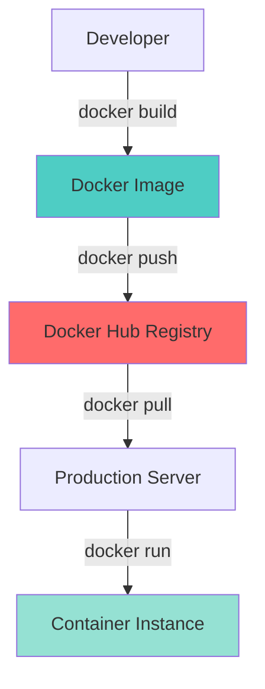
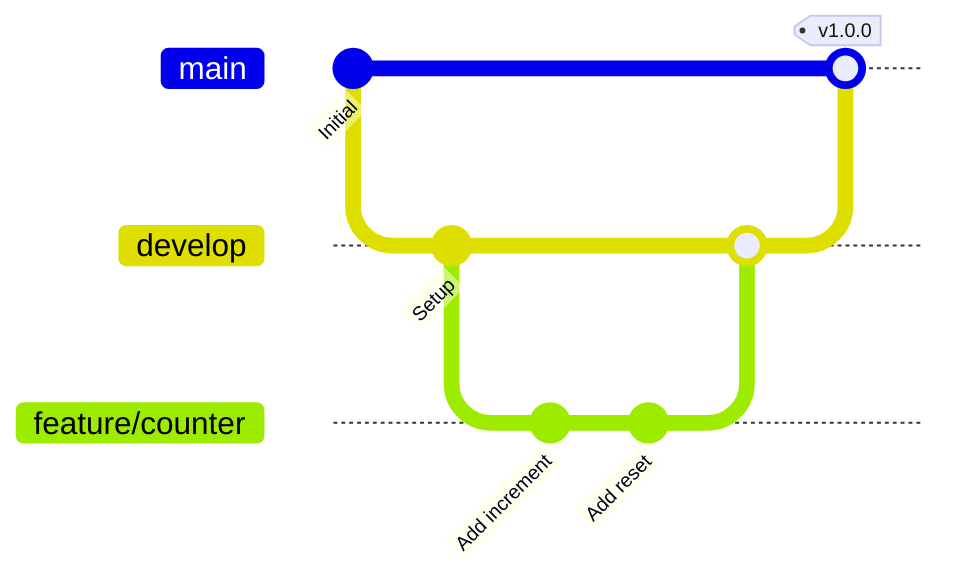

# 📘 MODULE 02: BUILD - Git & Docker

## 🤔 Tại sao cần BUILD?

### Ẩn dụ: Đóng gói hành lý đi du lịch

Tưởng tượng bạn đi du lịch:

- **Không có vali**: Mang từng quần áo, đồ dùng lòng thòng → Mất đồ, bẩn, khó di chuyển
- **Có vali ngăn nắp**: Mọi thứ trong 1 chiếc vali → Dễ mang, bảo vệ, biết đủ chưa

**Docker** là "chiếc vali" cho ứng dụng:

- Đóng gói code + dependencies + OS → 1 package
- Chạy được ở bất kỳ máy nào có Docker
- "Works on my machine" → "Works everywhere"

---

## 📦 Docker là gì?

**Docker** =  Platform để containerize ứng dụng

### Ẩn dụ: Hộp cơm trưa

**Containerization giống như hộp cơm trưa**:

- Bạn nấu cơm ở nhà (Dev environment)
- Đóng vào hộp kín (Container)
- Mang lên công ty (Production server)
- Mở ra ăn → Vị giống y hệt nhà (không bị ảnh hưởng môi trường)

### Docker vs Virtual Machine

```
┌──────────────────┐  ┌──────────────────┐
│   Virtual Machine│  │      Docker      │
├──────────────────┤  ├──────────────────┤
│   App A          │  │   App A          │
│   Guest OS (2GB) │  │   (No OS!)       │
├──────────────────┤  ├──────────────────┤
│   Hypervisor     │  │  Docker Engine   │
├──────────────────┤  ├──────────────────┤
│   Host OS        │  │   Host OS        │
└──────────────────┘  └──────────────────┘
 Size: ~5GB/VM         Size: ~200MB/container
 Boot: 30-60s          Boot: 1-2s
```

**Lợi ích Docker:**

- Nhẹ hơn (không cần full OS)
- Nhanh hơn (boot trong vài giây)
- Hiệu năng cao hơn (chia sẻ kernel)

---

## 🏗️ Docker Architecture



### Các thành phần

| Component | Mô tả | Ẩn dụ |
|-----------|-------|-------|
| **Dockerfile** | Công thức nấu ăn | Recipe |
| **Image** | Bánh đã nướng xong | Finished cake |
| **Container** | Bánh đang được ăn | Cake being served |
| **Registry** | Cửa hàng bánh | Bakery shop |

---

## 📝 Dockerfile Anatomy

```dockerfile
# Base image - Nguyên liệu gốc
FROM python:3.11-alpine

# Metadata
LABEL maintainer="devops@example.com"

# Working directory
WORKDIR /app

# Copy dependencies list first (layer caching)
COPY requirements.txt .

# Install dependencies
RUN pip install --no-cache-dir -r requirements.txt

# Copy source code
COPY . .

# Expose port
EXPOSE 5000

# Environment variables
ENV REDIS_HOST=redis

# Command to run
CMD ["python", "app.py"]
```

### Best Practices

1. **Use specific base image tags**

   ```dockerfile
   ❌ FROM python
   ✅ FROM python:3.11-alpine
   ```

2. **Minimize layers**

   ```dockerfile
   ❌ RUN apt-get update
   RUN apt-get install -y git
   RUN apt-get install -y curl
   
   ✅ RUN apt-get update && apt-get install -y \
       git \
       curl
   ```

3. **Leverage build cache**

   ```dockerfile
   # Copy requirements.txt TRƯỚC khi copy source
   COPY requirements.txt .
   RUN pip install -r requirements.txt
   COPY . .  # Source code thay đổi thường xuyên → cache layer trên vẫn dùng được
   ```

---

## 🐳 Docker CLI Commands

```bash
# Build image
docker build -t counter-app:v1.0 .

# List images
docker images

# Run container
docker run -d -p 5000:5000 --name counter counter-app:v1.0

# List running containers
docker ps

# List all containers (including stopped)
docker ps -a

# View logs
docker logs counter

# Execute command in container
docker exec -it counter sh

# Stop container
docker stop counter

# Remove container
docker rm counter

# Remove image
docker rmi counter-app:v1.0

# Prune unused resources
docker system prune -a
```

---

## 🎼 Docker Compose

**Docker Compose** = Orchestration tool cho nhiều containers

### docker-compose.yml Structure

```yaml
version: '3.8'

services:
  web:
    build: .
    ports:
      - "5000:5000"
    environment:
      - REDIS_HOST=redis
    depends_on:
      - redis
    networks:
      - app-network
    volumes:
      - ./app.py:/app/app.py  # Hot reload
  
  redis:
    image: redis:7-alpine
    networks:
      - app-network
    volumes:
      - redis-data:/data

networks:
  app-network:
    driver: bridge

volumes:
  redis-data:
```

### Commands

```bash
# Start all services
docker-compose up -d

# View logs
docker-compose logs -f

# Stop all services
docker-compose down

# Rebuild and start
docker-compose up --build
```

---

## 🌳 Git Branching Strategies

### Gitflow Workflow



### Branch Types

| Branch | Purpose | Lifetime | Example |
|--------|---------|----------|---------|
| `main` | Production-ready code | Permanent | `main` |
| `develop` | Integration branch | Permanent | `develop` |
| `feature/*` | New features | Temporary | `feature/login` |
| `bugfix/*` | Bug fixes | Temporary | `bugfix/counter-overflow` |
| `hotfix/*` | Emergency fixes | Temporary | `hotfix/security-patch` |
| `release/*` | Release preparation | Temporary | `release/v1.0` |

### Workflow

```bash
# 1. Start new feature
git checkout develop
git checkout -b feature/analytics

# 2. Work on feature
git add .
git commit -m "Add analytics tracking"

# 3. Push to remote
git push origin feature/analytics

# 4. Create Pull Request (on GitHub)
# 5. After review, merge to develop

# 6. When ready for release
git checkout develop
git checkout -b release/v1.0
# Test, fix bugs, update version

# 7. Merge to main
git checkout main
git merge release/v1.0
git tag -a v1.0.0 -m "Release version 1.0.0"

# 8. Merge back to develop
git checkout develop
git merge release/v1.0
```

---

## 💡 Key Takeaways

1. **Docker = Portable environment** - Build once, run anywhere
2. **Image is blueprint, Container is instance** - OOP analogy: Class vs Object
3. **Layer caching speeds up builds** - Order matters in Dockerfile
4. **Docker Compose simplifies multi-container apps** - Define once, run everywhere
5. **Gitflow provides structure** - Organized branching strategy

---

## ⏭️ Next Steps

👉 Chuyển sang **LABS.md** để thực hành!
