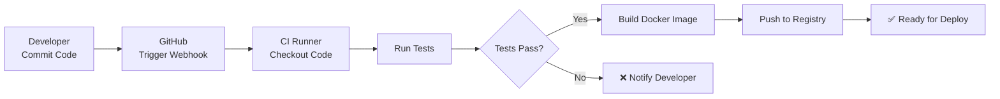

# 📘 MODULE 03: CI - Continuous Integration

## 🤔 Tại sao cần CI?

### Ẩn dụ: Dây chuyền kiểm tra chất lượng nhà máy

**Không có CI** (Kiểm tra thủ công):

- Công nhân sản xuất 1000 sản phẩm
- Cuối ngày mới kiểm tra → Phát hiện 500 lỗi
- Phải vứt bỏ hoặc sửa lại → Mất thời gian, tiền bạc

**Có CI** (Tự động kiểm tra):

- Mỗi sản phẩm sau khi làm xong → Máy tự kiểm tra ngay
- Phát hiện lỗi sớm → Sửa ngay → Không lãng phí

**DevOps tương tự**:

- Mỗi lần commit code → CI auto test
- Pass → Merge được
- Fail → Fix ngay, không làm hỏng main branch

---

## 📊 CI/CD Pipeline



---

## 🔧 GitHub Actions Basics

### Workflow File (.github/workflows/ci.yml)

```yaml
name: CI Pipeline

on:
  push:
    branches: [ main, develop ]
  pull_request:
    branches: [ main ]

jobs:
  test:
    runs-on: ubuntu-latest
    steps:
      - uses: actions/checkout@v3
      
      - name: Set up Python
        uses: actions/setup-python@v4
        with:
          python-version: '3.11'
      
      - name: Install dependencies
        run: |
          pip install -r requirements.txt
          pip install pytest flake8
      
      - name: Run linter
        run: flake8 app.py
      
      - name: Run tests
        run: pytest tests/ -v
  
  build:
    needs: test
    runs-on: ubuntu-latest
    steps:
      - uses: actions/checkout@v3
      
      - name: Build Docker image
        run: docker build -t counter-app:${{ github.sha }} .
      
      - name: Push to Docker Hub
        env:
          DOCKER_USER: ${{ secrets.DOCKER_USERNAME }}
          DOCKER_PASS: ${{ secrets.DOCKER_PASSWORD }}
        run: |
          echo $DOCKER_PASS | docker login -u $DOCKER_USER --password-stdin
          docker push counter-app:${{ github.sha }}
```

---

## 🧪 Testing Strategy

### Test Pyramid

```
        /\
       /  \  E2E Tests (5%)
      /____\
     /      \  Integration Tests (15%)
    /________\
   /          \  Unit Tests (80%)
  /__________\
```

### Example Unit Test (tests/test_app.py)

```python
import pytest
from app import app

@pytest.fixture
def client():
    app.config['TESTING'] = True
    with app.test_client() as client:
        yield client

def test_home_page(client):
    """Test homepage returns 200"""
    response = client.get('/')
    assert response.status_code == 200

def test_increment(client):
    """Test increment increases counter"""
    # Reset first
    client.get('/reset')
    
    # Increment
    response = client.get('/increment')
    assert response.status_code == 200
    
    # Verify counter increased
    # (requires parsing HTML or API endpoint)
```

---

## 💡 Key Takeaways

1. **CI = Continuous Integration** - Tự động test mỗi commit
2. **GitHub Actions** - Free CI/CD platform
3. **Test early, test often** - Phát hiện bug sớm
4. **Automate everything** - Linting, testing, building

---

⏭️ Next: **LABS.md**
