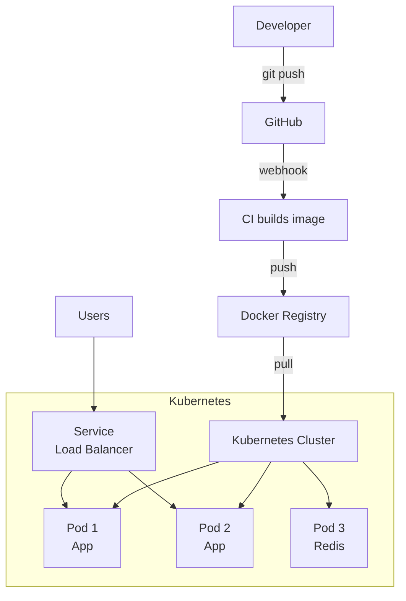
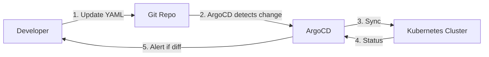

# 📘 MODULE 04: CD - Continuous Deployment with Kubernetes

## 🤔 Tại sao cần CD và K8s?

### Ẩn dụ: Bến cảng container

**Kubernetes** giống như **bến cảng container**:

- Containers (Docker) = Các container hàng hóa
- Kubernetes = Hệ thống điều phối, sắp xếp containers
- Tự động: Xếp container, phân phối, thay thế container hỏng

**CD** = Tự động cập nhật phiên bản mới:

- Code mới → Build → Test → Deploy tự động
- Không cần ssh vào server, copy file thủ công

---

## 🏗️ Kubernetes Architecture



---

## 📦 K8s Core Concepts

### 1. Pod

```yaml
apiVersion: v1
kind: Pod
metadata:
  name: counter-pod
spec:
  containers:
  - name: web
    image: counter-app:v1.0
    ports:
    - containerPort: 5000
```

### 2. Deployment (Manages Pods)

```yaml
apiVersion: apps/v1
kind: Deployment
metadata:
  name: counter-deployment
spec:
  replicas: 3  # 3 pods
  selector:
    matchLabels:
      app: counter
  template:
    metadata:
      labels:
        app: counter
    spec:
      containers:
      - name: web
        image: counter-app:v1.0
```

### 3. Service (Load Balancer)

```yaml
apiVersion: v1
kind: Service
metadata:
  name: counter-service
spec:
  selector:
    app: counter
  ports:
  - port: 80
    targetPort: 5000
  type: LoadBalancer
```

---

## 🔄 GitOps with ArgoCD

**GitOps** = Git is the source of truth



**Benefits:**

- Declarative config
- Version control for infrastructure
- Easy rollback (git revert)

---

## 💡 Key Takeaways

1. **K8s = Container orchestrator** - Tự động quản lý lifecycle
2. **Deployment > Pod** - Deployment manages replicas
3. **Service = Internal load balancer** - Distribute traffic
4. **GitOps** - Git làm single source of truth

⏭️ Next: **LABS.md**
