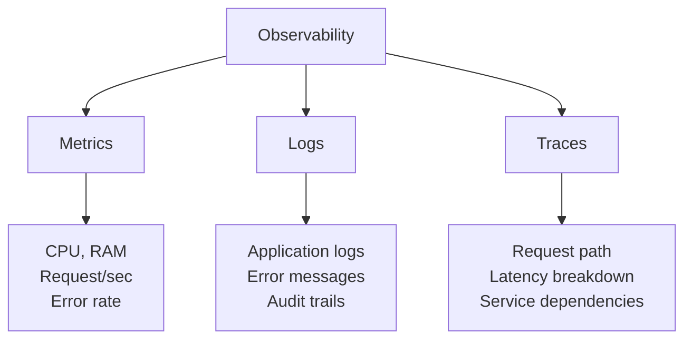

# 📘 MODULE 06: MONITOR - Observability

## 🤔 Tại sao cần Monitoring?

### Ẩn dụ: Bảng điều khiển máy bay

**Không có monitoring:**

- Phi công lái máy bay, không có đồng hồ tốc độ, nhiên liệu, độ cao
- Máy bay còn bay được không? Sắp hết xăng chưa? → Không biết!
- Khi crash mới phát hiện → Quá muộn

**Có monitoring:**

- Dashboard hiển thị: tốc độ, nhiên liệu, độ cao, nhiệt độ động cơ
- Cảnh báo sớm: "Fuel low, land in 10 minutes"
- Phi công xử lý kịp thời

**DevOps tương tự:**

- Monitor CPU, RAM, latency, error rate
- Alert trước khi crash: "CPU 95%, scale up now!"

---

## 📊 The Three Pillars of Observability



---

## 🔥 Prometheus Architecture

```
┌──────────────┐       ┌──────────────┐
│  Counter App │──────▶│  Prometheus  │
│  /metrics    │       │  (Scraper)   │
└──────────────┘       └──────┬───────┘
                              │
                       ┌──────▼───────┐
                       │   Grafana    │
                       │  (Dashboard) │
                       └──────────────┘
```

### Instrument App (app.py)

```python
from prometheus_client import Counter, Histogram, generate_latest

# Define metrics
request_count = Counter('http_requests_total', 'Total HTTP requests')
request_latency = Histogram('http_request_duration_seconds', 'HTTP request latency')

@app.route('/metrics')
def metrics():
    return generate_latest()

@app.route('/')
def index():
    request_count.inc()  # Increment counter
    with request_latency.time():  # Measure latency
        return render_template('index.html')
```

### prometheus.yml

```yaml
scrape_configs:
  - job_name: 'counter-app'
    static_configs:
      - targets: ['localhost:5000']
    scrape_interval: 15s
```

---

## 📈 Grafana Dashboard

### Example Query (PromQL)

```promql
# Request rate (per second)
rate(http_requests_total[5m])

# Error percentage
rate(http_requests_total{status="500"}[5m]) / rate(http_requests_total[5m]) * 100

# P95 latency
histogram_quantile(0.95, http_request_duration_seconds_bucket)
```

---

## 🚨 Alerting

### alert.rules.yml

```yaml
groups:
  - name: counter-app
    rules:
      - alert: HighErrorRate
        expr: rate(http_requests_total{status="500"}[5m]) > 0.05
        for: 5m
        labels:
          severity: critical
        annotations:
          summary: "High error rate detected"
          description: "Error rate is {{ $value }}%"
```

---

## 💡 Key Takeaways

1. **Observability ≠ Monitoring** - Observability = why, Monitoring = what
2. **Metrics, Logs, Traces** - Three pillars
3. **Prometheus** - Industry standard for metrics
4. **Grafana** - Beautiful dashboards
5. **Alert on symptoms, not causes** - Alert on user-facing issues

⏭️ Next: **LABS.md**
