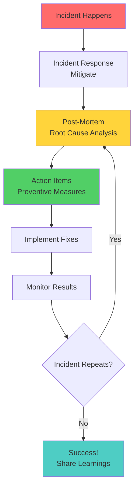
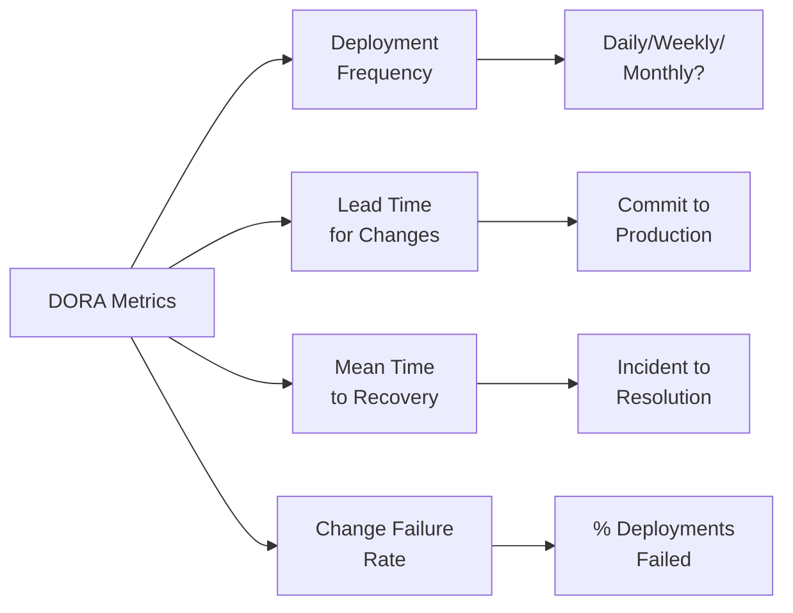
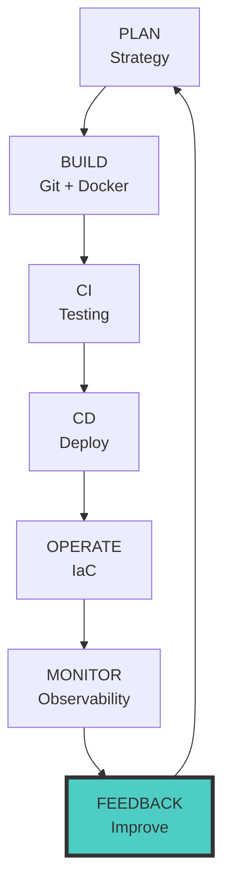

# 📘 MODULE 07: FEEDBACK - Post-Mortem & Continuous Improvement

## 🤔 Tại sao cần FEEDBACK?

### Ẩn dụ: Hệ thống báo cháy và họp rút kinh nghiệm

**Không có feedback loop:**

- Nhà bị cháy → Dập lửa → Xong, quên đi
- Tháng sau cháy lại cùng chỗ → Lại dập → Lặp lại mãi

**Có feedback loop:**

- Nhà cháy → Dập lửa → **Họp phân tích**: Tại sao cháy? Cầu dao chập?
- **Hành động**: Thay cầu dao, lắp báo cháy, training nhân viên
- **Kết quả**: Không cháy nữa!

**DevOps tương tự:**

- Incident xảy ra → Khắc phục → **Post-mortem**: Root cause?
- **Action items**: Fix code, improve monitoring, update runbook
- **Result**: Incident không lặp lại

---

## 🔄 Feedback Loop trong DevOps



---

## 💬 ChatOps - DevOps qua Chat

**ChatOps** = Vận hành hệ thống qua chat (Slack, Teams)

### Ví dụ ChatOps Workflow

```
[Engineer in Slack]
/deploy counter-app v2.0 to production

[Bot Response]
✅ Deployment started
📊 Build: #1234
🔗 ArgoCD: https://argocd.company.com/apps/counter-app
⏱️ ETA: 5 minutes

[5 minutes later]
✅ Deployment successful!
📈 Metrics: http://grafana.company.com/d/counter
🚀 Health check: PASSED
```

### Lợi ích

- **Transparency** - Cả team thấy ai deploy gì
- **Audit trail** - Lịch sử commands
- **Collaboration** - Cùng debug trực tiếp trên chat
- **Fast response** - Không cần ssh, chạy command từ phone

---

## 📝 Post-Mortem Process

### Template Post-Mortem Document

```markdown
# Post-Mortem: Counter App Outage (2024-01-15)

## Incident Summary
- **Date**: 2024-01-15 14:30 - 16:45 UTC
- **Duration**: 2 hours 15 minutes
- **Impact**: 100% of users unable to access app
- **Severity**: P1 (Critical)

## Timeline
- **14:30** - Monitoring alerts: High error rate
- **14:35** - Engineer investigates, finds Redis down
- **14:40** - Incident declared, team assembled
- **15:00** - Root cause identified: Disk full (logs)
- **15:30** - Temporary fix: Clear logs manually
- **16:00** - Permanent fix: Add log rotation
- **16:45** - Service fully recovered

## Root Cause
Redis container ran out of disk space due to unrotated logs filling `/var/log/redis`.

## What Went Well
- ✅ Monitoring detected issue within 5 minutes
- ✅ Team assembled quickly (Slack incident channel)
- ✅ Clear communication with stakeholders

## What Went Wrong
- ❌ No disk space monitoring
- ❌ Log rotation not configured
- ❌ No alerting for disk usage

## Action Items
| Action | Owner | Deadline | Priority |
|--------|-------|----------|----------|
| Add disk space monitoring | Nam | 2024-01-20 | P0 |
| Configure log rotation | Linh | 2024-01-18 | P0 |
| Update runbook | Hùng | 2024-01-22 | P1 |
| Conduct training on disk mgmt | Team Lead | 2024-01-25 | P2 |

## Lessons Learned
1. Always monitor disk space
2. Configure log rotation by default
3. Test disaster recovery plans regularly
```

### Blameless Post-Mortem Culture

❌ **Blame culture:**
> "Tại sao anh Nam không configure log rotation? Anh làm app crash!"

✅ **Blameless culture:**
> "System thiếu log rotation. Chúng ta sẽ thêm vào template để không ai gặp vấn đề này nữa."

**Focus on:**

- System failures, not people failures
- Process improvements
- Learning opportunities

---

## 📊 DORA Metrics (Measuring DevOps Success)

**DORA** = DevOps Research and Assessment

### 4 Key Metrics



### Elite vs Low Performers

| Metric | Elite | High | Medium | Low |
|--------|-------|------|--------|-----|
| **Deployment Frequency** | Multiple/day | 1/week | 1/month | <1/month |
| **Lead Time** | <1 hour | 1 day | 1 week | >1 month |
| **MTTR** | <1 hour | <1 day | <1 week | >1 week |
| **Change Failure Rate** | 0-15% | 16-30% | 31-45% | >45% |

### How to Track

```python
# Example: Track deployment frequency
deployments_this_week = [
    {"date": "2024-01-15", "status": "success"},
    {"date": "2024-01-16", "status": "success"},
    {"date": "2024-01-18", "status": "failed"},
    {"date": "2024-01-19", "status": "success"},
]

deployment_frequency = len(deployments_this_week) / 7  # Per day
change_failure_rate = sum(1 for d in deployments_this_week if d["status"] == "failed") / len(deployments_this_week)

print(f"Deployment Frequency: {deployment_frequency:.2f}/day")
print(f"Change Failure Rate: {change_failure_rate*100:.1f}%")
```

---

## 🎯 SLO (Service Level Objective)

**SLO** = Mục tiêu chất lượng dịch vụ

### Error Budget

```
SLO = 99.9% uptime
→ Error Budget = 0.1% = 43 minutes downtime/month

Tháng này downtime: 30 minutes
→ Còn error budget: 13 minutes
→ Team có thể deploy features rủi ro hơn

Tháng sau downtime: 50 minutes
→ Vượt error budget!
→ Freeze features, focus on reliability
```

### Example SLO

```yaml
# SLO for Counter App
metrics:
  - name: availability
    target: 99.9%
    measurement: uptime
  
  - name: latency_p95
    target: < 200ms
    measurement: 95th percentile response time
  
  - name: error_rate
    target: < 0.1%
    measurement: 5xx errors / total requests
```

---

## 💡 Key Takeaways

1. **Feedback loops prevent recurring issues** - Learn from mistakes
2. **Blameless culture > Blame culture** - Focus on systems, not people
3. **Post-mortems are learning opportunities** - Document and share
4. **ChatOps improves collaboration** - Transparent operations
5. **DORA metrics measure DevOps maturity** - Track and improve
6. **SLOs balance innovation and stability** - Error budgets

---

## 🔁 The DevOps Circle Completes



**Congratulations!** Bạn đã hoàn thành vòng tròn DevOps. Quay lại Module 01 với kiến thức và kinh nghiệm mới để cải tiến liên tục!

---

⏭️ Next: **LABS.md** - Thực hành cuối cùng!
