

:information_source: &nbsp;Kho này chứa các câu hỏi và bài tập về nhiều chủ đề kỹ thuật, đôi khi liên quan đến DevOps và SRE

:bar_chart: &nbsp;Hiện có **2624** bài tập và câu hỏi

:warning: &nbsp;Bạn có thể dùng nội dung này để chuẩn bị phỏng vấn, nhưng hầu hết câu hỏi và bài tập không phản ánh phỏng vấn thực tế. Vui lòng đọc [trang FAQ](faq.md) để biết thêm chi tiết

:stop_sign: &nbsp;Nếu bạn muốn theo đuổi nghề DevOps Engineer, việc học một số khái niệm ở đây sẽ hữu ích, nhưng bạn nên biết rằng không cần phải học mọi chủ đề và công nghệ trong kho này

:pencil: &nbsp;Bạn có thể thêm bài tập bằng cách gửi pull request :) Xem hướng dẫn đóng góp [ở đây](CONTRIBUTING.md)

****

<!-- ALL-TOPICS-LIST:START -->
<!-- prettier-ignore-start -->
<!-- markdownlint-disable -->

<table>
  <tr>
    <td align="center"><a href="topics/devops/README.md">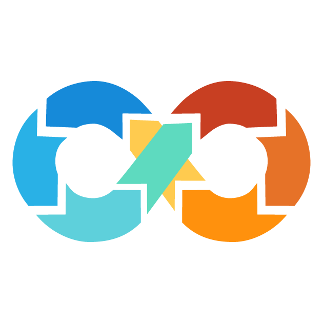 <b>DevOps</b></a></td>
    <td align="center"><a href="topics/git/README.md"> <b>Git</b></a></td>
    <td align="center"><a href="#network"> <b>Mạng</b></a></td>
    <td align="center"><a href="#hardware"> <b>Phần cứng</b></a></td>
    <td align="center"><a href="topics/kubernetes/README.md"> <b>Kubernetes</b></a></td>
  </tr>

  <tr>
    <td align="center"><a href="topics/software_development/README.md"> <b>Phát triển phần mềm</b></a></td>
    <td align="center"><a href="https://github.com/bregman-arie/python-exercises"> <b>Python</b></a></td>
    <td align="center"><a href="https://github.com/bregman-arie/go-exercises"> <b>Go</b></a></td>
    <td align="center"><a href="topics/perl/README.md"> <b>Perl</b></a></td>
    <td align="center"><a href="#regex"> <b>Regex</b></a></td>
  </tr>

  <tr>
      <td align="center"><a href="topics/cloud/README.md"> <b>Cloud</b></a></td>
      <td align="center"><a href="topics/aws/README.md"> <b>AWS</b></a></td>
      <td align="center"><a href="topics/azure/README.md">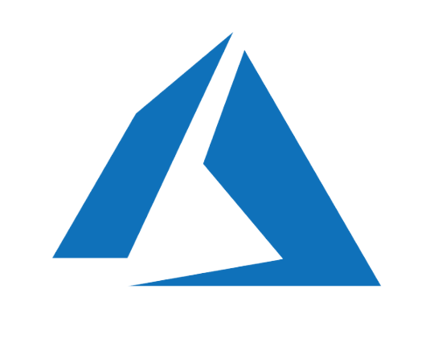 <b>Azure</b></a></td>
      <td align="center"><a href="topics/gcp/README.md"> <b>Google Cloud Platform</b></a></td>
      <td align="center"><a href="#openstack/README.md"> <b>OpenStack</b></a></td>
  </tr>

  <tr>
      <td align="center"><a href="#operating-system">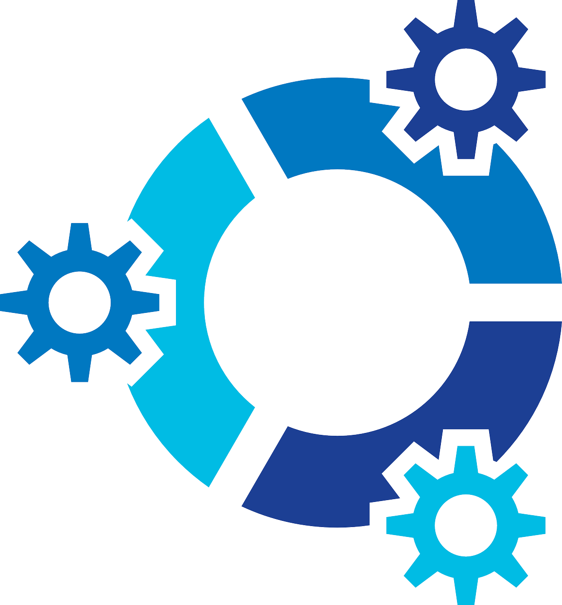 <b>Hệ điều hành</b></a></td>
      <td align="center"><a href="topics/linux/README.md"> <b>Linux</b></a></td>
      <td align="center"><a href="#virtualization"> <b>Ảo hóa</b></a></td>
      <td align="center"><a href="topics/dns/README.md">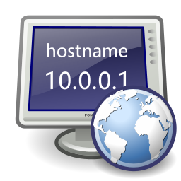 <b>DNS</b></a></td>
      <td align="center"><a href="topics/shell/README.md"> <b>Shell Scripting</b></a></td>
  </tr>

  <tr>
      <td align="center"><a href="topics/databases/README.md"> <b>Cơ sở dữ liệu</b></a></td>
      <td align="center"><a href="#sql">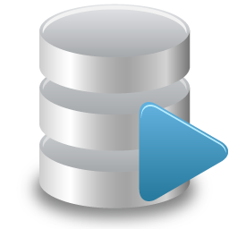 <b>SQL</b></a></td>
      <td align="center"><a href="#mongo"> <b>Mongo</b></a></td>
      <td align="center"><a href="#testing"> <b>Testing</b></a></td>
      <td align="center"><a href="#big-data"> <b>Big Data</b></a></td>

  </tr>

  <tr>
      <td align="center"><a href="topics/cicd/README.md"> <b>CI/CD</b></a></td>
      <td align="center"><a href="#certificates"> <b>Certificates</b></a></td>
      <td align="center"><a href="topics/containers/README.md"> <b>Containers</b></a></td>
      <td align="center"><a href="topics/openshift/README.md">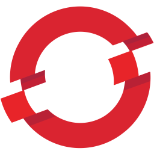 <b>OpenShift</b></a></td>
      <td align="center"><a href="#storage"> <b>Storage</b></a></td>
  </tr>

  <tr>
      <td align="center"><a href="topics/terraform/README.md">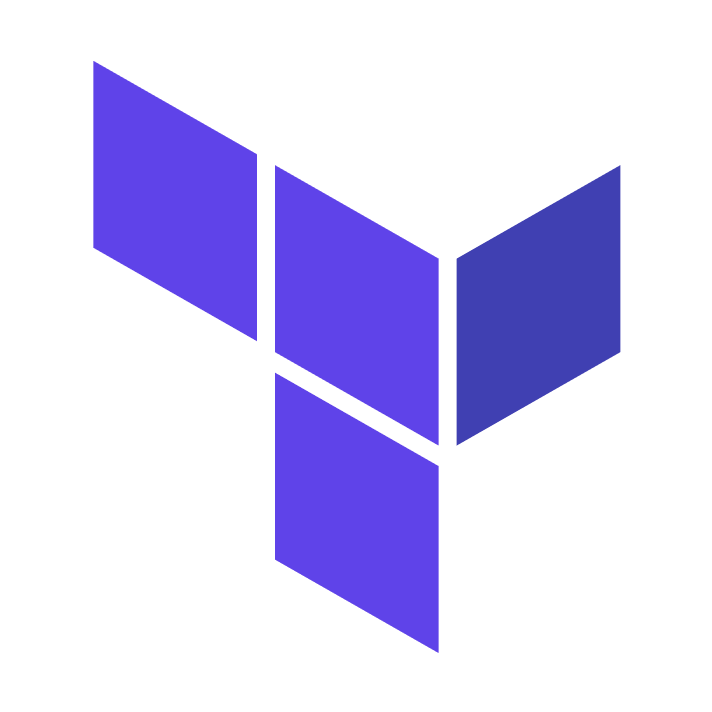 <b>Terraform</b></a></td>
      <td align="center"><a href="#puppet">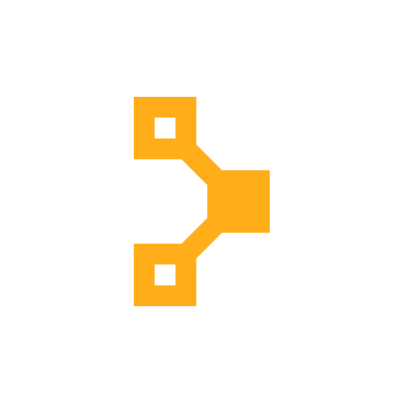 <b>Puppet</b></a></td>
      <td align="center"><a href="#distributed"> <b>Distributed</b></a></td>
      <td align="center"><a href="#questions-you-ask"> <b>Các câu hỏi bạn có thể hỏi</b></a></td>
      <td align="center"><a href="topics/ansible/README.md"> <b>Ansible</b></a></td>
  </tr>

  <tr>
      <td align="center"><a href="topics/observability/README.md">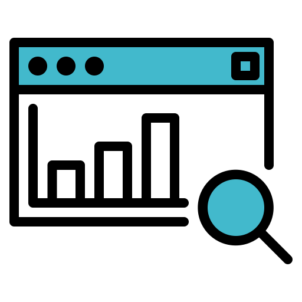 <b>Observability</b></a></td>
      <td align="center"><a href="#prometheus"> <b>Prometheus</b></a></td>
      <td align="center"><a href="topics/circleci/README.md"> <b>Circle CI</b></a></td>
      <td align="center"><a href="topics/datadog/README.md"> <b></b></a></td>
      <td align="center"><a href="topics/grafana/README.md"> <b>Grafana</b></a></td>
  </tr>

  <tr>
    <td align="center"><a href="topics/argo/README.md"> <b>Argo</b></a></td>
    <td align="center"><a href="topics/soft_skills/README.md"> <b>Kỹ năng mềm</b></a></td>
    <td align="center"><a href="topics/security/README.md"> <b>Bảo mật</b></a></td>
    <td align="center"><a href="#system-design">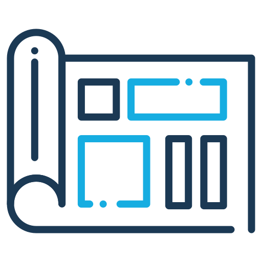 <b>Thiết kế hệ thống</b></a></td>
   </tr>

   <tr>
    <td align="center"><a href="topics/chaos_engineering/README.md"> <b>Chaos Engineering</b></a></td>
    <td align="center"><a href="#Misc"> <b>Khác</b></a></td>
    <td align="center"><a href="#elastic">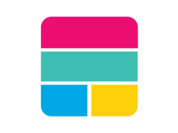 <b>Elastic</b></a></td>
    <td align="center"><a href="topics/kafka/README.md">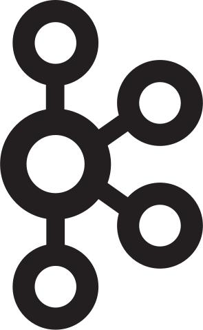 <b>Kafka</b></a></td>
    <td align="center"><a href="topics/node/node_questions_basic.md"> <b>NodeJs</b></a></td>
   </tr>
   
</table>

<!-- markdownlint-enable -->
<!-- prettier-ignore-end -->
<!-- ALL-TOPICS-LIST:END -->

## Ứng dụng DevOps

<table>
<tr>
  <td align="center"><a href="https://play.google.com/store/apps/details?id=com.codingshell.kubeprep"> <b>KubePrep</b></a></td>
  <td align="center"><a href="https://play.google.com/store/apps/details?id=com.codingshell.linuxmaster"> <b>Linux Master</b></a></td>
  <td align="center"><a href="https://play.google.com/store/apps/details?id=com.codingshell.system_design_hero"> <b>System Design Hero</b></a></td>
</tr>
</table>

## Mạng

Nhìn chung, để giao tiếp cần những gì?
 <b>

  - Một ngôn ngữ chung (để hai đầu hiểu nhau)
  - Một cách để chỉ đích danh người bạn muốn giao tiếp
  - Một kết nối (để nội dung có thể tới được người nhận)

</b>

TCP/IP là gì?
 <b>

Một tập hợp các giao thức định nghĩa cách hai hoặc nhiều thiết bị giao tiếp với nhau.

Để tìm hiểu thêm về TCP/IP, đọc [ở đây](http://www.penguintutor.com/linux/basic-network-reference)

</b>

Ethernet là gì?
 <b>

Ethernet đơn giản chỉ là kiểu mạng nội bộ (LAN) phổ biến nhất hiện nay. Một LAN—khác với WAN (mạng diện rộng), bao phủ khu vực lớn—là mạng các máy tính trong khu vực nhỏ như văn phòng, trường học, hoặc nhà riêng.

</b>

Địa chỉ MAC là gì? Dùng để làm gì?
 <b>

Địa chỉ MAC là một số định danh duy nhất dùng để nhận diện thiết bị trên mạng.

Các gói tin gửi trên ethernet luôn có địa chỉ MAC nguồn và đích. Nếu adapter mạng nhận gói thì nó sẽ so sánh địa chỉ MAC đích trong gói với địa chỉ của chính nó.

</b>

Khi nào dùng địa chỉ MAC: ff:ff:ff:ff:ff:ff?
 <b>

Khi một thiết bị gửi gói đến địa chỉ MAC broadcast (FF:FF:FF:FF:FF:FF​), gói được gửi tới tất cả thiết bị trên mạng cục bộ. Broadcast được dùng để giải quyết địa chỉ IP sang MAC (bằng ARP) ở lớp liên kết dữ liệu.
</b>

Địa chỉ IP là gì?
 <b>

Địa chỉ giao thức Internet (IP address) là nhãn số được gán cho mỗi thiết bị kết nối vào mạng dùng IP để giao tiếp. Địa chỉ IP có hai chức năng chính: nhận diện host hoặc giao diện mạng và định vị địa chỉ.
</b>

Giải thích subnet mask và cho ví dụ
 <b>

Subnet mask là số 32-bit dùng để phân vùng địa chỉ IP thành địa chỉ mạng và địa chỉ host. Subnet mask tạo bằng cách đặt các bit mạng thành "1" và các bit host thành "0". Trong một mạng, hai địa chỉ luôn bị giữ lại: địa chỉ mạng (địa chỉ đầu) và địa chỉ broadcast (địa chỉ cuối).

[Ví dụ](https://github.com/philemonnwanne/projects/tree/main/exercises/exe-09)

</b>

IP riêng (private IP) là gì? Khi nào dùng?
 <b>
IP riêng được gán cho các host trong cùng mạng để giao tiếp nội bộ. Như tên gọi, các thiết bị dùng IP riêng không thể truy cập từ mạng bên ngoài. Ví dụ, nếu bạn ở trong ký túc xá và muốn bạn cùng phòng truy cập server bạn host, bạn sẽ cho họ IP riêng để kết nối trong mạng nội bộ.
</b>

IP công cộng (public IP) là gì? Khi nào dùng?
 <b>
IP công cộng là địa chỉ truy cập công khai. Nếu bạn host server muốn bạn bè từ ngoài truy cập, bạn sẽ cung cấp IP công cộng để họ xác định và định vị mạng/server của bạn. Nếu mọi người ở cùng mạng, bạn không cần IP công cộng mà dùng IP riêng. Để truy cập server nội bộ từ mạng ngoài, bạn cần cấu hình port forwarding trên router để cho phép lưu lượng từ miền công cộng vào mạng nội bộ.
</b>

Giải thích mô hình OSI. Có những lớp nào? Mỗi lớp chịu trách nhiệm gì?
 <b>

- Application: tầng người dùng (HTTP nằm ở đây)
- Presentation: thiết lập ngữ cảnh giữa các thực thể tầng ứng dụng (mã hóa nằm ở đây)
- Session: khởi tạo, quản lý và kết thúc kết nối
- Transport: truyền dữ liệu có độ dài biến từ nguồn đến đích (TCP & UDP nằm ở đây)
- Network: chuyển datagram giữa các mạng (IP nằm ở đây)
- Data link: cung cấp liên kết giữa hai nút kết nối trực tiếp (MAC nằm ở đây)
- Physical: đặc tả điện và vật lý của kết nối (Bit nằm ở đây)

Bạn có thể đọc thêm về OSI tại [penguintutor.com](http://www.penguintutor.com/linux/basic-network-reference)
</b>

Xác định các mục sau thuộc lớp OSI nào:

  * Sửa lỗi (Error correction)
  * Định tuyến gói (Packets routing)
  * Cáp và tín hiệu điện (Cables and electrical signals)
  * Địa chỉ MAC
  * Địa chỉ IP
  * Kết thúc kết nối (Terminate connections)
  * Bắt tay 3 chiều (3 way handshake)
 <b>
  * Error correction - Data link
  * Packets routing - Network
  * Cables and electrical signals - Physical
  * MAC address - Data link
  * IP address - Network
  * Terminate connections - Session
  * 3-way handshake - Transport
</b>

Bạn biết các cơ chế truyền nào?
 <b>

Unicast: Giao tiếp một-kèm-một (1 sender, 1 receiver).

Broadcast: Gửi tin tới toàn bộ mạng. Địa chỉ ff:ff:ff:ff:ff:ff dùng cho broadcast.
           Hai giao thức thường sử dụng broadcast là ARP và DHCP.

Multicast: Gửi tin tới một nhóm người đăng ký. Có thể là một-nhiều hoặc nhiều-nhiều.
</b>

CSMA/CD là gì? Có còn dùng trong mạng ethernet hiện đại không?
 <b>

CSMA/CD là viết tắt của Carrier Sense Multiple Access / Collision Detection.
Mục tiêu chính là quản lý truy cập vào môi trường chia sẻ nơi chỉ một host có thể truyền tại một thời điểm.

Thuật toán CSMA/CD:

1. Trước khi gửi frame, kiểm tra xem có host khác đang truyền không.
2. Nếu không có ai truyền, bắt đầu gửi frame.
3. Nếu hai host truyền cùng lúc, xảy ra xung đột (collision).
4. Cả hai host dừng gửi và gửi tín hiệu 'jam' báo rằng có collision.
5. Chờ thời gian ngẫu nhiên rồi gửi lại.
