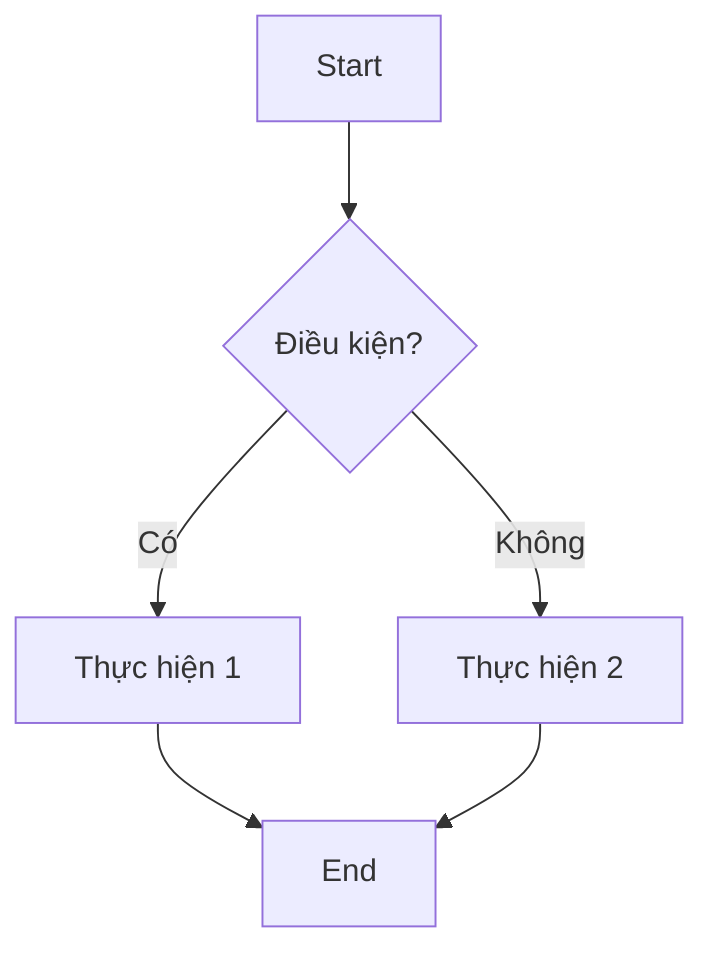
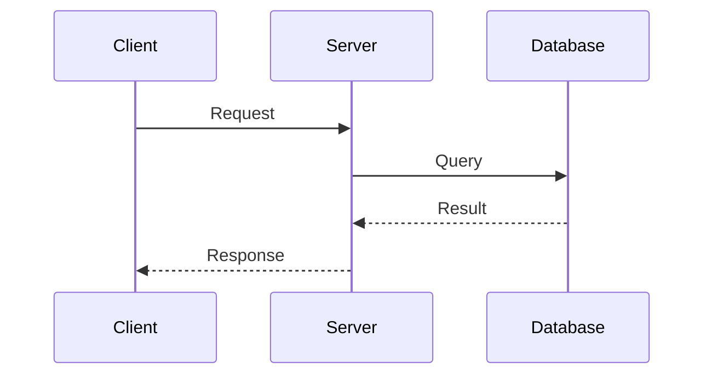

# Hướng dẫn Markdown

<u>Version:</u> 1.0.0  
<u>Author:</u> ThanhRòm  
<u>Release Date:</u> 2025-12-17

## 📋**GIỚI THIỆU**

Tổng hợp cú pháp Markdown để viết tài liệu đẹp và chuyên nghiệp.

---

## 📝**TIÊU ĐỀ (HEADINGS)**

```markdown
# Heading 1
## Heading 2
### Heading 3
#### Heading 4
##### Heading 5
###### Heading 6
```

**Giải thích:**
- `#`: 1 dấu = Heading 1 (kích thước lớn nhất, thường là tiêu đề chính)
- `##`: 2 dấu = Heading 2 (nhỏ hơn, thường cho section chính)
- `###`: 3 dấu = Heading 3 (sub-section)
- `####` đến `######`: Các level heading nhỏ hơn
- **Lưu ý**: Phải có dấu cách giữa `#` và text (ví dụ: `# Tiêu đề` KHÔNG phải `#Tiêu đề`)
- Markdown hỗ trợ tối đa 6 level heading

**Kết quả:**
# Heading 1
## Heading 2
### Heading 3

---

## ✏️**ĐỊNH DẠNG VĂN BẢN**

```markdown
**Bold** hoặc __Bold__
*Italic* hoặc _Italic_
***Bold và Italic***
~~Strikethrough~~
`Inline code`
```

**Giải thích:**
- `**text**` hoặc `__text__`: In đậm (Bold) - dùng hai dấu hoa thị hoặc gạch dưới
- `*text*` hoặc `_text_`: In nghiêng (Italic) - dùng một dấu hoa thị hoặc gạch dưới
- `***text***`: Vừa Bold vừa Italic
- `~~text~~`: Gạch ngang text (strikethrough) - dùng hai dấu ngã
- `` `text` ``: Inline code - dùng backtick (`) để highlight code nhỏ trong văn bản
- **Lưu ý**: `*` và `_` có thể dùng thay thế cho nhau, nhưng không nên trộn lẫn

**Kết quả:**
- **Bold**
- *Italic*
- ***Bold và Italic***
- ~~Strikethrough~~
- `Inline code`

---

## 📋**DANH SÁCH**

### Danh sách không thứ tự

```markdown
- Item 1
- Item 2
  - Sub-item 2.1
  - Sub-item 2.2
- Item 3

* Cũng có thể dùng dấu *
+ Hoặc dấu +
```

**Giải thích:**
- `-`, `*`, `+`: Tất cả đều tạo danh sách không thứ tự (unordered list)
- Có thể dùng bất kỳ ký tự nào, nhưng nên chọn một và sử dụng nhất quán
- **Indent (lùi vào)**: Dùng 2 hoặc 4 dấu cách/tab để tạo sub-list (danh sách con)
- Depth (độ sâu): Có thể lồng nhiều level sub-list

**Kết quả:**
- Item 1
- Item 2
  - Sub-item 2.1
  - Sub-item 2.2
- Item 3

* Cũng có thể dùng dấu *
+ Hoặc dấu +

### Danh sách có thứ tự

```markdown
1. Bước 1
2. Bước 2
3. Bước 3
   1. Bước 3.1
   2. Bước 3.2
```

**Giải thích:**
- `1.`, `2.`, `3.`: Tạo danh sách có thứ tự (ordered list)
- Số không cần đúng thứ tự liên tiếp - Markdown sẽ tự động đánh số
- Ví dụ: viết `1.`, `1.`, `1.` cũng được, Markdown vẫn hiển thị 1, 2, 3
- **Indent**: Dùng 3 dấu cách hoặc tab để tạo sub-list (danh sách con)
- **Lưu ý**: Phải có dấu cách sau dấu chấm (ví dụ: `1. Item` KHÔNG phải `1.Item`)

**Kết quả:**
1. Bước 1
2. Bước 2
3. Bước 3
   1. Bước 3.1
   2. Bước 3.2

### Checklist (Task list)

```markdown
- [x] Hoàn thành task 1
- [x] Hoàn thành task 2
- [ ] Chưa làm task 3
- [ ] Chưa làm task 4
```

**Giải thích:**
- `- [ ]`: Checkbox chưa check (trống)
- `- [x]`: Checkbox đã check (có x bên trong)
- **Lưu ý**: Phải có dấu cách sau dấu `-` (ví dụ: `- [x] ` KHÔNG phải `-[x]`)
- Checklist dùng cho: Task tracking, project management, todo list
- Một số platform (GitHub, GitLab) cho phép click vào checkbox để thay đổi trạng thái
- **Ứng dụng**: Dùng trong README để hiển thị progress, hoặc trong issue/PR để track công việc

**Kết quả:**
- [x] Hoàn thành task 1
- [x] Hoàn thành task 2
- [ ] Chưa làm task 3
- [ ] Chưa làm task 4

**Kết quả:**
- [x] Hoàn thành task 1
- [x] Hoàn thành task 2
- [ ] Chưa làm task 3
- [ ] Chưa làm task 4

---

## 🔗**LIÊN KẾT**

### Link thường

```markdown
[Văn bản hiển thị](https://example.com)

[Link với title](https://example.com "Đây là title")

Hoặc URL trực tiếp: <https://example.com>
```

**Giải thích:**
- `[text](url)`: Cách cơ bản tạo link - text trong [] là văn bản hiển thị, url trong () là liên kết
- `[text](url "title")`: Thêm title (tooltip) - khi hover chuột sẽ hiển thị title này
- `<url>`: URL trực tiếp - tự động tạo link từ URL (dễ nhất)
- **Lưu ý**: Không có dấu cách giữa [] và () (ví dụ: `[text] (url)` sẽ KHÔNG hoạt động)
- **Relative links**: Có thể dùng đường dẫn tương đối (ví dụ: `[Guide](./docs/guide.md)`)
- **Anchor links**: Link tới heading trong file (ví dụ: `[Đến Heading](#heading-name)`)

**Kết quả:**
- [Văn bản hiển thị](https://example.com)
- [Link với title](https://example.com "Đây là title")
- Hoặc URL trực tiếp: <https://example.com>

### Link tham chiếu (Reference)

```markdown
Đây là [link tham chiếu][1] và [link khác][google].

[1]: https://example.com
[google]: https://google.com
```

**Giải thích:**
- `[text][1]` hoặc `[text][name]`: Cách viết link tham chiếu - định nghĩa URL riêng biệt
- `[1]: url`: Định nghĩa link tham chiếu - số hoặc text bất kỳ
- `[name]: url`: Có thể dùng tên thay vì số cho dễ nhớ
- **Ưu điểm**: Giữ text sạch, dễ quản lý nhiều link, URL có thể xem riêng ở cuối file
- **Ứng dụng**: Dùng cho README file có nhiều link
- **Lưu ý**: Định nghĩa link có thể ở bất kỳ đâu trong file (thường để cuối)

**Kết quả:**
- Đây là [link tham chiếu][1] và [link khác][google].
[1]: https://example.com
[google]: https://google.com

### Link đến heading trong file

```markdown
[Đến phần Giới thiệu](#giới-thiệu)
[Đến file khác](./docs/guide.md#section)
```

**Giải thích:**
- `#heading-name`: Anchor link - tham chiếu tới heading bằng heading id
- **Cách tạo id**: Markdown tự động tạo id từ heading (ví dụ: `## Giới thiệu` → `#giới-thiệu`)
- **Quy tắc id**: Chuyển thành chữ thường, thay dấu cách bằng dấu gạch ngang, bỏ ký tự đặc biệt
- `./docs/guide.md#section`: Link tới file khác và jump tới heading
- **Ứng dụng**: Tạo mục lục, tài liệu dài có nhiều section, navigation
- **Lưu ý**: Dấu cách thành dấu gạch, ké tự đặc biệt bị bỏ (ví dụ: `## My - heading?` → `#my---heading`)

**Ví dụ thực tế:**
```markdown
## Table of Contents
- [Introduction](#introduction)
- [Setup](#setup)
- [Usage](#usage)

## Introduction
Nội dung phần giới thiệu...

## Setup
Nội dung phần setup...

## Usage
Nội dung phần sử dụng...
```

---

## 🖼️**HÌNH ẢNH**

```markdown


<!-- Ảnh với kích thước (HTML) -->

```

**Giải thích:**
- ``: Cách cơ bản chèn ảnh - alt text là mô tả ảnh (dùng khi ảnh load không được)
- ``: Thêm title - tooltip hiển thị khi hover chuột
- `path/to/image.png`: Đường dẫn tương đối hoặc tuyệt đối
- `https://...`: URL trực tiếp tới ảnh trên internet
- **Alt text**: Rất quan trọng cho accessibility (a11y) và SEO
- `` tag (HTML): Dùng khi muốn custom kích thước, style, v.v.
- `width="200"`: Chiều rộng ảnh (pixel), height được tính tự động
- **Lưu ý**: Markdown không hỗ trợ resize ảnh trực tiếp, phải dùng HTML

**Kết quả:**


<!-- Ảnh với kích thước (HTML) -->


### Ảnh với caption

```markdown
<figure>
  
  <figcaption>Caption của ảnh</figcaption>
</figure>
```

**Giải thích:**
- `<figure>`: Container HTML cho ảnh + caption
- ``: Thẻ ảnh (như trên)
- `<figcaption>`: Text mô tả ảnh (hiển thị dưới ảnh)
- **Ứng dụng**: Dùng khi ảnh cần có mô tả, nhất là trong bài viết, tutorial
- **Styling**: CSS có thể style `<figure>` và `<figcaption>` thêm (ví dụ: align center, italic chữ, v.v.)
- **Lưu ý**: Đây là HTML thuần, Markdown sẽ render thành HTML bình thường

**Kết quả:**

<figure>
  
  <figcaption>Caption của ảnh</figcaption>
</figure>

---

## 💻**CODE**

### Inline code

```markdown
Sử dụng hàm `print()` để in ra màn hình.
```

**Giải thích:**
- `` `code` ``: Inline code - dùng 1 backtick ở mỗi bên
- **Dùng cho**: Tên hàm, biến, lệnh nhỏ, tên file, v.v.
- **Ứng dụng**: Highlight code nhỏ trong đoạn văn thường
- **Lưu ý**: Nếu code chứa backtick, dùng nhiều backtick hơn (ví dụ: ``` ``code` ```)

### Code block

````markdown
```python
def hello():
    print("Hello, World!")

hello()
```
````

**Giải thích:**
- ```` ``` ````: Code block - dùng 3 backtick ở đầu và cuối
- `python`: Ngôn ngữ (syntax highlighting) - không bắt buộc nhưng rất hữu ích
- **Ưu điểm**: Preserve formatting, indentation, được highlight theo ngôn ngữ
- **Ứng dụng**: Code example, script, configuration file
- **Lưu ý**: Nếu code có 3 backtick, dùng 4 backtick để wrap

### Code block với highlight dòng (một số platform)

````markdown
```python {3-4}
def calculate():
    x = 1
    y = 2  # highlight
    return x + y  # highlight
```
````

**Giải thích:**
- `{3-4}`: Range highlight - highlight dòng 3 đến 4
- `{1,3,5}`: Highlight specific lines - dòng 1, 3, 5
- **Platform hỗ trợ**: GitHub, GitLab, VS Code, một số blog platform
- **Ứng dụng**: Nhấn mạnh code quan trọng trong tutorial, giúp người đọc focus vào điểm chính
- **Lưu ý**: Không phải tất cả Markdown renderer đều hỗ trợ feature này

### Các ngôn ngữ phổ biến

| Ngôn ngữ | Syntax |
|----------|--------|
| Python | `python` |
| JavaScript | `javascript` hoặc `js` |
| HTML | `html` |
| CSS | `css` |
| JSON | `json` |
| YAML | `yaml` |
| Bash/Shell | `bash` hoặc `shell` |
| SQL | `sql` |
| Markdown | `markdown` hoặc `md` |
| Diff | `diff` |

---

## 📊**BẢNG (TABLE)**

```markdown
| Cột 1 | Cột 2 | Cột 3 |
|-------|-------|-------|
| A1 | B1 | C1 |
| A2 | B2 | C2 |
| A3 | B3 | C3 |
```

**Giải thích:**
- `| text |`: Dùng pipe (|) để phân cách cột
- Dòng thứ 2 (với dấu gạch ngang `-`): Header separator - bắt buộc phải có
- **Số dấu gạch**: Ít nhất 3 dấu gạch per cột (ví dụ: `|---|`)
- **Spacing**: Dấu cách giữa `|` và text không quan trọng
- **Alignment**: Dấu `:` để căn chỉnh (xem dưới)
- **Lưu ý**: Markdown table rất khó chỉnh sửa, nên dùng tool online hoặc IDE format auto

### Căn chỉnh

```markdown
| Trái | Giữa | Phải |
|:-----|:----:|-----:|
| Left | Center | Right |
| Left | Center | Right |
```

**Giải thích:**
- `:-----`: Căn trái (colon bên trái)
- `:---:`: Căn giữa (colon cả hai bên)
- `---:`: Căn phải (colon bên phải)
- `---`: Không có colon (mặc định căn trái)
- **Ứng dụng**: So sánh dữ liệu, liệt kê thông tin structured

**Kết quả:**

| Trái | Giữa | Phải |
|:-----|:----:|-----:|
| Left | Center | Right |
| Left | Center | Right |

---

## 💬**TRÍCH DẪN (BLOCKQUOTES)**

```markdown
> Đây là trích dẫn.
> Có thể nhiều dòng.

> Cấp 1
>> Cấp 2
>>> Cấp 3
```

**Giải thích:**
- `>`: Tạo blockquote - dùng `>` ở đầu dòng
- **Nhiều dòng**: Mỗi dòng trong blockquote cần `>`
- `>>`: Blockquote lồng (nested) - thêm `>` để tạo level sâu hơn
- **Ứng dụng**: Trích dẫn, highlight thông tin quan trọng, quote từ người khác
- **Styling**: Blockquote thường được style khác (ví dụ: italic, khoảng trắng, border)

**Kết quả:**
> Đây là trích dẫn.
> Có thể nhiều dòng.

> Cấp 1
>> Cấp 2
>>> Cấp 3

---

## ⚠️**ALERTS (GITHUB FLAVORED)**

```markdown
> [!NOTE]
> Thông tin bổ sung

> [!TIP]
> Mẹo hữu ích

> [!IMPORTANT]
> Thông tin quan trọng

> [!WARNING]
> Cảnh báo

> [!CAUTION]
> Thận trọng - có thể gây lỗi
```

**Giải thích:**
- `> [!TYPE]`: GitHub Flavored Markdown (GFM) alert - hỗ trợ trên GitHub, GitLab, v.v.
- **Các type**: `NOTE`, `TIP`, `IMPORTANT`, `WARNING`, `CAUTION`
- Mỗi type có icon và màu sắc riêng:
  - 🔵 NOTE: Thông tin bổ sung
  - 💡 TIP: Mẹo hoặc trick
  - ⚠️ IMPORTANT: Rất quan trọng
  - 🔴 WARNING: Cảnh báo
  - 🚫 CAUTION: Có thể gây lỗi hoặc hư hại
- **Ứng dụng**: README, documentation, issue, PR description
- **Lưu ý**: Chỉ hỗ trợ trên GitHub, GitLab, một số platform khác

---

## ➖**ĐƯỜNG KẺ NGANG**

```markdown
---

***

___
```

**Giải thích:**
- `---`: Ba dấu gạch ngang
- `***`: Ba dấu hoa thị
- `___`: Ba dấu gạch dưới
- **Tất cả đều tạo ra đường kẻ ngang (horizontal rule)**
- **Lưu ý**: Phải có dòng trống trước và sau (nếu không sẽ bị interpret thành heading)
- **Ứng dụng**: Phân tách section, chia file thành phần
- **CSS**: Mặc định render thành `<hr>` tag HTML, có thể custom style

**Kết quả:**

---

***

___

---

## 📧**EMAIL & SĐT**

```markdown
Email: <email@example.com>
```

**Giải thích:**
- `<email@example.com>`: Dùng `< >` bao quanh email/URL để tự động tạo link
- **Cách hoạt động**: Markdown nhận diện pattern email/URL và tự động tạo link
- **Ưu điểm**: Đơn giản, không cần dùng `[text](url)` syntax
- **Ứng dụng**: Liên hệ, footer, contact page
- **Lưu ý**: Email sẽ được encode thành HTML entities (tránh spam bot)

**Kết quả:**

Email: <email@example.com>

---

## 🔢**ESCAPE CHARACTERS**

Dùng `\` để hiển thị ký tự đặc biệt:

```markdown
\* Không phải italic \*
\# Không phải heading
\[ Không phải link \]
```

**Giải thích:**
- `\`: Backslash - escape character
- **Ký tự cần escape**: `*`, `_`, `[`, `]`, `(`, `)`, `#`, `.`, `!`, `-`, `+`, `=`, `` ` ``
- **Ứng dụng**: Khi muốn hiển thị ký tự đặc biệt của Markdown mà không interpret
- **Ví dụ**: 
  - `\*star\*` hiển thị `*star*` (không italic)
  - `\# not heading` hiển thị `# not heading` (không phải heading)
  - `\[not link\]` hiển thị `[not link]` (không phải link)
- **Lưu ý**: Chỉ cần escape nếu ký tự được interpret, nếu không có escape vẫn được

**Kết quả:**

\* Không phải italic \*
\# Không phải heading
\[ Không phải link \]

---

## 📝**FOOTNOTES**

```markdown
Đây là văn bản có chú thích[^1].

Văn bản khác có chú thích[^note].

[^1]: Đây là nội dung chú thích 1.
[^note]: Đây là nội dung chú thích note.
```

**Giải thích:**
- `[^1]`: Footnote reference - số hoặc text bất kỳ (dùng ^ prefix)
- `[^1]: text`: Footnote definition - định nghĩa nội dung footnote ở cuối (hoặc đâu cũng được)
- **Hiển thị**: Thường hiển thị ở cuối page (auto-convert thành link)
- **Ứng dụng**: Tài liệu học thuật, citation, reference, comment bổ sung
- **Browser**: Click vào footnote reference sẽ jump xuống footnote, click footnote sẽ jump lại
- **Support**: Markdown mở rộng (GFM, Pandoc) hỗ trợ, Markdown chuẩn không hỗ trợ

**Kết quả:**

Đây là văn bản có chú thích[^1].

Văn bản khác có chú thích[^note].

[^1]: Đây là nội dung chú thích 1.
[^note]: Đây là nội dung chú thích note.

---

## 📑**MỤC LỤC TỰ ĐỘNG**

```markdown
## Mục lục

- [Giới thiệu](#giới-thiệu)
- [Cài đặt](#cài-đặt)
- [Sử dụng](#sử-dụng)
- [FAQ](#faq)
```

**Giải thích:**
- Tạo link tới các heading bằng anchor link (link đến heading)
- **Heading id tự động**: Markdown tự generate id từ heading text
- **Quy tắc id**: Chữ thường, dấu cách → gạch ngang, bỏ ký tự đặc biệt
- **Ứng dụng**: README dài, documentation, wiki
- **Tool tự động**: Có nhiều tool/extension auto generate TOC (Table of Contents)
- **Lưu ý**: Mục lục không update tự động khi change heading - phải update tay hoặc dùng tool

**Kết quả:**

- [Giới thiệu](#giới-thiệu)
- [Cài đặt](#cài-đặt)
- [Sử dụng](#sử-dụng)
- [FAQ](#faq)

---

## 🎨**EMOJI**

```markdown
:smile: :heart: :thumbsup: :rocket: :star:

Hoặc copy trực tiếp: 😀 ❤️ 👍 🚀 ⭐
```

**Giải thích:**
- `:emoji_name:`: Shortcode - nhập tên emoji bằng colon
- **Copy trực tiếp**: Paste emoji Unicode trực tiếp (tùy thiết bị)
- **Hỗ trợ**: GitHub, GitLab, Discord, Slack, v.v. hỗ trợ emoji shortcode
- **Website tham khảo**: https://www.webfx.com/tools/emoji-cheat-sheet/
- **Ứng dụng**: Commit message, README, issue, PR, documentation
- **Lưu ý**: Markdown chuẩn không hỗ trợ shortcode, nhưng platform hỗ trợ sẽ render

**Kết quả:**

:smile: :heart: :thumbsup: :rocket: :star:

Hoặc copy trực tiếp: 😀 ❤️ 👍 🚀 ⭐

### Emoji thường dùng

| Emoji | Code | Ý nghĩa |
|-------|------|---------|
| ✅ | `:white_check_mark:` | Hoàn thành/Done |
| ❌ | `:x:` | Lỗi/Failed |
| ⚠️ | `:warning:` | Cảnh báo/Warning |
| 📝 | `:memo:` | Ghi chú/Documentation |
| 🔧 | `:wrench:` | Cấu hình/Configuration |
| 🚀 | `:rocket:` | Deploy/Release |
| 🐛 | `:bug:` | Bug/Issue |
| ✨ | `:sparkles:` | Tính năng mới/New feature |
| 📦 | `:package:` | Package/Library |
| 🔒 | `:lock:` | Bảo mật/Security |

---

## 🔽**COLLAPSIBLE SECTION**

```markdown
<details>
<summary>Click để mở rộng</summary>

Nội dung ẩn ở đây...

- Item 1
- Item 2

</details>
```

**Giải thích:**
- `<details>`: HTML tag - container chứa nội dung collapse/expand
- `<summary>`: HTML tag - text hiển thị, có thể click để toggle
- **Hoạt động**: Click vào `<summary>` để mở/đóng nội dung trong `<details>`
- **Ứng dụng**: Giấu thông tin không cần thiết, FAQ, spoiler, long content
- **Styling**: Mặc định có mũi tên collapse indicator, có thể custom CSS
- **Support**: HTML thuần, mỗi browser hỗ trợ, GitHub/GitLab hỗ trợ
- **Lưu ý**: Phải có dòng trống trước nội dung bên trong `<details>` để Markdown interpret

**Kết quả:**

<details>
<summary>Click để mở rộng</summary>

Nội dung ẩn ở đây...

- Item 1
- Item 2

</details>

---

## 🎯**KEYBOARD KEYS**

```markdown
Nhấn <kbd>Ctrl</kbd> + <kbd>S</kbd> để lưu.

<kbd>Ctrl</kbd> + <kbd>C</kbd>: Copy
<kbd>Ctrl</kbd> + <kbd>V</kbd>: Paste
```

**Giải thích:**
- `<kbd>`: HTML tag - dùng để styling keyboard keys
- **Hiển thị**: Thường render thành button style (ví dụ: có background, border)
- **Ứng dụng**: Documentation, tutorial, shortcut guide
- **Keyboard shortcuts**: <kbd>Ctrl</kbd>, <kbd>Shift</kbd>, <kbd>Alt</kbd>, <kbd>Enter</kbd>, v.v.
- **Browser rendering**: Mỗi browser style khác nhau, nhưng pattern rõ ràng
- **Ưu tiểm**: Rõ ràng hơn plain text khi nói về keyboard keys

**Kết quả:**

Nhấn <kbd>Ctrl</kbd> + <kbd>S</kbd> để lưu.

---

## 🌈**HIGHLIGHT TEXT (HTML)**

```markdown
<mark>Đây là text được highlight</mark>

<span style="color: red">Chữ đỏ</span>
<span style="background-color: yellow">Nền vàng</span>
```

**Giải thích:**
- `<mark>`: HTML tag - highlight text (thường background vàng)
- `<span style="...">`: Dùng CSS inline để style text
- `color:`: Thay đổi màu chữ
- `background-color:`: Thay đổi màu nền
- **CSS properties**: Có thể dùng bất kỳ CSS nào (font-size, font-weight, v.v.)
- **HTML color**: Dùng tên màu (red, blue), hex (#FF0000), rgb(255,0,0)
- **Ứng dụng**: Highlight quan trọng, color-code info, visual emphasis
- **Lưu ý**: Plain Markdown không hỗ trợ, phải dùng HTML

**Ví dụ màu sắc:**
```markdown
<span style="color: blue">Chữ xanh</span>
<span style="color: #FF00FF">Chữ tím (hex)</span>
<span style="background-color: lightblue">Nền xanh nhạt</span>
<span style="color: white; background-color: black">Chữ trắng nền đen</span>
```

**Kết quả:**

<mark>Đây là text được highlight</mark>

<span style="color: red">Chữ đỏ</span>
<span style="background-color: yellow">Nền vàng</span>

---

## 📐**DIAGRAM (MERMAID)**

Một số platform hỗ trợ Mermaid:

````markdown

````

**Giải thích:**
- `mermaid`: Code language cho Mermaid diagram
- `graph TD`: Flowchart - TD = Top-Down (vertical)
- `A[Text]`: Node (hộp) - text bên trong `[]`
- `B{Text}`: Diamond node (quyết định) - text bên trong `{}`
- `A --> B`: Arrow - từ A đến B
- `B -->|Label| C`: Arrow với label (tiêu đề)
- **Mermaid types**: Flowchart, Sequence, Gantt, Class, State, Pie chart
- **Platform hỗ trợ**: GitHub, GitLab, VS Code, Notion, v.v.
- **Ứng dụng**: Flowchart, algorithm diagram, architecture diagram, timeline
- **Website**: https://mermaid.live/ - test Mermaid diagram trực tuyến

**Ví dụ Sequence Diagram:**
````markdown

````

---

## 📋**TEMPLATE README NHANH**

```markdown
# Tên Dự Án

> Mô tả ngắn gọn

## ✨ Tính năng

- Feature 1
- Feature 2

## 🚀 Cài đặt

\`\`\`bash
npm install
\`\`\`

## 📖 Sử dụng

\`\`\`bash
npm start
\`\`\`

## 📝 License

MIT
```

---

## **LIÊN HỆ**

*Made with ❤️ by ThanhRòm*
