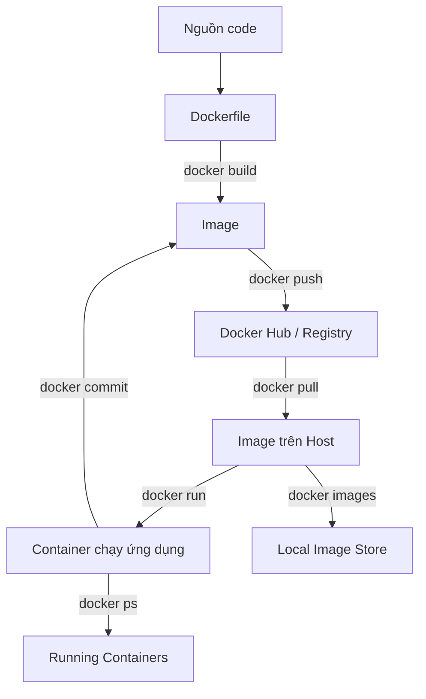

# DOCKER


## INDEX
- [Docker là gì?](#docker-là-gì)
- [Quy trình hoạt động của Docker](#quy-trình-hoạt-động-của-docker)
- [Các khái niệm cơ bản](#các-khái-niệm-cơ-bản)
  - [Container là gì?](#container-là-gì)
  - [Image là gì?](#image-là-gì)
  - [Dockerfile là gì?](#dockerfile-là-gì)
  - [Docker Hub là gì?](#docker-hub-là-gì)
- [Các lệnh Docker cơ bản](#các-lệnh-docker-cơ-bản)


## LỘ TRÌNH
  1. Khái niệm cơ bản — Docker, Container, Image, Dockerfile, Docker Hub
  2. Làm việc với image — pull, build, tag, push
  3. Chạy container — run, ports, volumes, env vars                                                         
  4. Dockerfile — các chỉ dẫn FROM, RUN, CMD, COPY, EXPOSE, VOLUME
  5. Multi-stage builds — giảm size image
  6. Docker Compose — chạy nhiều service (web + db)
  7. Networking — bridge, host, custom network
  8. Volumes — persistent data
  9. Best practices — security, .dockerignore, layer caching
  10. Registry — Docker Hub, private registry

**TÌNH HUỐNG:**
> 💬 Một lập trình viên làm ra một ứng dụng đã test và kiểm tra kỹ lưỡng trên *máy tính của mình*, nhưng khi chạy ứng dụng đó trên *máy tính người khác* hoặc deploy lên *server* thì ứng dụng lại **không chạy được hoặc gặp lỗi**, Tại sao? Đúng, mặc dù có thể có nhiều nguyên nhân khác nhau, nhưng một trong những nguyên nhân phổ biến nhất là do môi trường chạy ứng dụng trên máy tính của lập trình viên khác với môi trường chạy ứng dụng trên máy tính của người dùng cuối hoặc server, dẫn đến sự không tương thích về phần mềm, thư viện, cấu hình, v.v. VẬY LÀM THÉ NÀO ĐỂ GIẢI QUYẾT VẤN ĐỀ NÀY❓

> 👉 ==> `Docker` là một công cụ giúp giải quyết vấn đề này bằng cách *đóng gói ứng dụng và tất cả các phụ thuộc* của nó vào một `container`, đảm bảo rằng ứng dụng sẽ chạy đúng cách trên bất kỳ *môi trường* nào có `Docker` được cài đặt.. .

## DOCKER LÀ GÌ?
**Vậy ta bắt đầu với khái niệm đầu tiên, Docker là gì?**

Docker là một nền tảng **containerization** (đóng gói ứng dụng) cho phép bạn đóng gói ứng dụng cùng với tất cả các phụ thuộc (libraries, dependencies, configurations) của nó vào một **container** độc lập, nhẹ và có thể chạy trên bất kỳ môi trường nào có Docker được cài đặt.

**Đặc điểm chính:**
- 🚀 **Nhanh & nhẹ**: Container chia sẻ kernel của host OS, tiết kiệm tài nguyên
- 📦 **Portable**: "Chạy được ở đâu cũng được" - từ máy dev đến production
- 🔒 **Isolated**: Mỗi container chạy độc lập, không ảnh hưởng lẫn nhau
- ⚡ **Consistent**: Giải quyết vấn đề "works on my machine" một cách triệt để

**Tóm lại:** Docker giúp bạn đóng gói ứng dụng như một "hộp đen" chứa mọi thứ cần thiết để chạy, đảm bảo nó hoạt động giống hệt nhau mọi lúc, mọi nơi.

## QUY TRÌNH HOẠT ĐỘNG CỦA DOCKER ?
**Vậy quy trình hoạt động của Docker như thế nào?**



**Mô tả chi tiết quy trình:**

1. **Viết Dockerfile** → Tạo file `dockerfile` là file khai báo cấu hình `image` (base image, dependencies, commands)
2. **Build Image** → Sử dụng `docker build` đọc `dockerfile` và tạo ra `image` (template readonly)
3. **Push/Pull** → Sử dụng `docker push` đẩy `image` lên `Docker Hub`/`Registry`; Sử dụng `docker pull` tải `image` về
4. **Run Container** → Sử dụng `docker run` tạo và chạy `container` từ `image` (_mỗi lần run = container mới_)
5. **Commit** → Sử dụng `docker commit` lưu `container` thành `image` mới (nếu có thay đổi)
6. **Quản lý** → Sử dụng `docker images` xem `image` đã có; Sử dụng `docker ps` xem `container` đang chạy

**Tóm lại:** Dockerfile → Image (template) → Container (instance chạy). Image là bản snapshot, Container là quá trình thực thi.

## CÁC KHÁI NIỆM CƠ BẢN
**Vậy để hiểu rõ hơn về Docker, chúng ta đến với:**
### ⏺ CONTAINER LÀ GÌ?
**Container** là một instance đang chạy (process) được tạo từ một Docker image. Nó là một môi trường isolated, độc lập chứa đầy đủ tất cả những gì cần thiết để chạy một ứng dụng: code, runtime, system tools, system libraries, settings.

**So sánh với Virtual Machine (VM):**
| Đặc điểm | Container | Virtual Machine |
|---------|-----------|-----------------|
| Cơ sở | Chia sẻ host OS kernel | Có OS riêng (guest OS) |
| Kích thước | Nhẹ (MB) | Nặng (GB) |
| Khởi động | Nhanh (seconds) | Chậm (minutes) |
| Tài nguyên | Ít tốn RAM/CPU | Nhiều tốn RAM/CPU |
| Isolation | Process-level | Full OS isolation |

**Tóm lại:** Container như một "phòng kín" chứa ứng dụng của bạn, chạy trên cùng một OS nhưng hoàn toàn tách biệt với các container khác.

### ⏺ IMAGE LÀ GÌ?
**Image** là một template/blueprint read-only chứa tất cả các layer (các thay đổi trên filesystem) cần thiết để chạy một ứng dụng. Image được xây dựng từ Dockerfile và có thể được chia sẻ qua Docker Hub.

**Cấu trúc image:**
- Base layer (ví dụ: `ubuntu:20.04`, `python:3.9`)
- Các layer bổ sung (cài đặt packages, copy code, config)
- Mỗi lệnh trong Dockerfile tạo ra một layer mới
- Các layer được cache, giúp build nhanh hơn

**Ví dụ:**
```bash
# Xem danh sách images
docker images
REPOSITORY      TAG       IMAGE ID       CREATED         SIZE
python          3         abc123def      2 weeks ago     900MB
ubuntu          20.04     xyz789abc      3 weeks ago     70MB
```

**Tóm lại:** Image là "bản mẫu" bất biến (immutable), container là "bản sao chạy" từ image đó.

### ⏺ DOCKERFILE LÀ GÌ?
**Dockerfile** là một text file chứa series của các chỉ dẫn (instructions) để build một Docker image. Dockerfile định nghĩa từng bước để tạo ra image.

**Các chỉ dẫn phổ biến:**
```dockerfile
FROM <image>           # Base image (bắt buộc)
WORKDIR /path          # Set working directory
COPY <src> <dest>      # Copy files từ host vào image
RUN <command>          # Chạy command trong build time
CMD ["executable"]     # Command mặc định khi container chạy
EXPOSE <port>          # Declare port sẽ được expose
VOLUME /path           # Khai báo volume
ENV <key>=<value>      # Set environment variable
```

**Ví dụ Dockerfile đơn giản:**
```dockerfile
FROM python:3.9
WORKDIR /app
COPY requirements.txt .
RUN pip install -r requirements.txt
COPY . .
CMD ["python", "app.py"]
```

**Tóm lại:** Dockerfile là "công thức" để nấu một Docker image.

### ⏺ DOCKER HUB LÀ GÌ?
**Docker Hub** là một dịch vụ registry (kho lưu trữ) chính thức của Docker, nơi bạn có thể:
- Tìm và tải (pull) hàng trăm nghìn images có sẵn (official images)
- Đẩy (push) images của bạn lên để chia sẻ
- Tạo repositories để quản lý images
- Tích hợp với CI/CD pipelines

**Các loại images trên Docker Hub:**
- **Official Images**: Do Docker team quản lý (nginx, redis, mysql, postgres, python, node, ...)
- **Verified Publishers**: Các công ty/chủ nhà phát triển được xác minh
- **Community Images**: Do cộng đồng đóng góp

**Ví dụ sử dụng:**
```bash
# Tải image Nginx chính thức
docker pull nginx:latest

# Tải image Python cụ thể version
docker pull python:3.9-slim

# Push image của bạn lên Docker Hub
docker push username/my-app:latest
```

**Registry khác:** Bạn cũng có thể tự host private registry (Docker Registry, Harbor, AWS ECR, Google Container Registry, Azure Container Registry).

**Tóm lại:** Docker Hub là "App Store" cho Docker images - nơi bạn lấy image có sẵn hoặc chia sẻ image của mình.

## CÁCH LỆNH DOCKER
**Đã hiểu các khái niệm cơ bản của Docker, vậy để làm việc với nó chúng ta sẽ sử dụng các lệnh cơ bản sau:**

```bash
  # Quản lý images:
  docker pull <image>                      # Tải image
  docker images                            # Liệt kê images
  docker rmi <image>                       # Xóa image
  docker build -t <name> .                 # Build image từ Dockerfile
  docker tag <src> <dst>                   # Đổi tên image
  docker push <image>                      # Đẩy lên registry

  # Quản lý container:
  docker run <image>                       # Chạy container
  docker ps                                # Container đang chạy
  docker ps -a                             # Tất cả container
  docker stop <container>                  # Dừng container
  docker start <container>                 # Khởi động lại
  docker rm <container>                    # Xóa container
  docker logs <container>                  # Xem logs
  docker exec -it <container> /bin/bash    # Vào container
  docker commit <container> <image-name>   # Lưu container thành image

  # Docker-Network & Docker-Volume:
  docker network ls                        # Liệt kê network
  docker volume ls                         # Liệt kê volume

  # Docker-Compose:
  docker compose up/down                   # Chạy/dừng stack (nếu có docker-compose)
```

### ⏺ DOCKER PULL

#### MỤC ĐÍCH:
- Pull một image Docker có sẵn từ Docker Hub về local machine để sử dụng.

#### TÌNH HUỐNG VÍ DỤ:
> 💬 Nếu bạn mới cài đặt Docker và muốn kiểm tra nó hoạt động được chưa hoặc ai đó nói với bạn họ có một image trên Docker Hub và bạn muốn thử chạy image đó để xem nó hoạt động như thế nào, BẠN SẼ LÀM GÌ❓

##### 👉 Sử dụng lệnh
```bash
docker pull <image>
```
> Lệnh này sẽ tải về image có tên `<image>` từ Docker Hub (ví dụ: `hello-world`, `nginx`, `python:3.9`).

> **Tại sao cần pull?** Vì image không có sẵn trên máy tính của bạn. Docker cần tải image từ registry (Docker Hub) về local storage trước khi có thể chạy container từ image đó.

> **⚠️ Lưu ý:** Nếu bạn chạy `docker run <image>` mà image chưa có local, Docker sẽ tự động pull image đó từ Docker Hub trước khi chạy container.

##### Cấu trúc thư mục:
```bash
docker_example_01/
└── (trống - không cần file nào, vì chúng ta chạy image có sẵn)
```
##### Step01: pull image có sẵn từ Docker Hub
Mở terminal và chạy lệnh sau để pull image có sẵn từ Docker Hub:
```bash
docker pull hello-world`
```
> **Giải thích:** Lệnh này sẽ tải về image có tên `hello-world` từ Docker Hub. Image này là một image đơn giản được sử dụng để kiểm tra xem Docker đã được cài đặt và hoạt động đúng cách trên máy tính của bạn hay chưa.

> **⚠️ Lưu ý:** Nếu image đã được tải về trước đó, Docker sẽ thông báo rằng image đã tồn tại và không cần tải lại.

### ⏺ DOCKER IMAGES
#### MỤC ĐÍCH:
- Liệt kê tất cả Docker images đang được lưu trữ trên máy tính của bạn, bao gồm tên, version, dung lượng, và thời gian tạo của từng image.
- Quản lý và theo dõi Docker images trên local machine.

#### TÌNH HUỐNG VÍ DỤ 1: Kiểm tra tất cả images đã có
> 💬 Bạn vừa pull một vài image về máy, hoặc bạn đã build một số image của riêng mình. Bây giờ bạn muốn **kiểm tra xem mình đã có những image nào**, chúng có tên là gì, version nào, dung lượng bao nhiêu, và khi nào được tạo? BẠN LÀM THẾ NÀO❓

##### 👉 Sử dụng lệnh
```bash
docker images
```
> Lệnh này sẽ liệt kê tất cả Docker images đang được lưu trữ trên máy tính của bạn.

> **Tại sao cần lệnh này?** Vì images chiếm dung lượng ổ cứng. Bạn cần biết mình đang có những gì để quản lý, xóa bỏ những image không cần thiết, hoặc kiểm tra xem image cần thiết đã có sẵn chưa.

##### Cấu trúc thư mục:
```bash
(trống - không cần file, đây là lệnh kiểm tra local)
```

##### Step01: Chạy lệnh docker images
Mở terminal và chạy lệnh sau:
```bash
docker images
```

**Output mẫu:**
```bash
REPOSITORY    TAG       IMAGE ID       CREATED         SIZE
hello-world   latest    abc123def456   2 weeks ago     1.84kB
python        3.9-slim  xyz789uvw012   3 weeks ago     120MB
nginx         latest    def456ghi789   1 month ago     133MB
ubuntu        20.04     uvw012jkl345   2 months ago    72.8MB
Rom/docker-example-02   latest   mno345pqr678   1 day ago       944MB
```

> **Giải thích output:**
> - **REPOSITORY**: Tên repository/image (có thể là official image như `nginx`, `python`, hoặc custom như `Rom/docker-example-02`)
> - **TAG**: Version/tag của image (thường là `latest`, `v1.0`, `3.9-slim`, hoặc version cụ thể)
> - **IMAGE ID**: Mã định danh duy nhất (hash) của image
> - **CREATED**: Thời gian image được tạo (từ khi build/pull)
> - **SIZE**: Dung lượng của image trên ổ cứng

---

#### TÌNH HUỐC VÍ DỤ 2: Tìm kiếm images theo tên cụ thể
> 💬 Bạn có rất nhiều images trên máy và muốn **tìm nhanh** những image liên quan đến Python, hoặc images của riêng bạn? BẠN LÀM THẾ NÀO❓

##### 👉 Sử dụng lệnh
```bash
docker images | grep <image-name>
```
> Lệnh này sẽ liệt kê tất cả Docker images đang được lưu trữ trên máy tính của bạn. Sau đó, `grep` sẽ lọc ra chỉ những dòng có chứa `<image-name>` trong cột REPOSITORY.

##### Cấu trúc thư mục:
```bash
(trống - đây là command pipeline)
```

##### Step01: Lọc images theo tên
```bash
docker images | grep python
```

**Output:**
```bash
REPOSITORY    TAG       IMAGE ID       CREATED         SIZE
python        3.9-slim  xyz789uvw012   3 weeks ago     120MB
python        3.10      stu456vwx234   1 month ago     180MB
python        alpine    mno345pqr678   2 months ago    55MB
```

> **Giải thích:** Lệnh này dùng `grep` để lọc chỉ những dòng có chứa từ "python". Rất hữu ích khi bạn có hàng trăm images và cần tìm nhanh một loại cụ thể.

---

#### TÌNH HUỐNG VÍ DỤ 3: Xem chi tiết của một image cụ thể
> 💬 Bạn muốn biết **chi tiết** về một image: nó có những layer nào, environment variables là gì, exposed ports, entrypoint, cmd...? BẠN LÀM THẾ NÀO❓

##### 👉 Sử dụng lệnh
```bash
docker image inspect <image-name>
```
> Lệnh này hiển thị thông tin chi tiết dạng JSON về image (architecture, config, layers, rootfs...).

##### Cấu trúc thư mục:
```bash
(trống - lệnh inspect)
```

##### Step01: Inspect một image
```bash
docker image inspect python:3.9-slim
```

**Output (truncated):**
```json
[
    {
        "Id": "sha256:xyz789uvw012...",
        "RepoTags": ["python:3.9-slim"],
        "RepoDigests": [],
        "Parent": "",
        "Comment": "",
        "Created": "2026-03-15T10:30:00Z",
        "Container": "abc123...",
        "ContainerConfig": {...},
        "DockerVersion": "24.0.0",
        "Architecture": "amd64",
        "Os": "linux",
        "Size": 120123456,
        "VirtualSize": 120123456,
        "GraphDriver": {...},
        "RootFS": {
            "Type": "layers",
            "Layers": [
                "sha256:layer1...",
                "sha256:layer2..."
            ]
        }
    }
]
```

> **Giải thích:** `docker image inspect` cho bạn tất cả thông tin kỹ thuật về image.

> **Bạn có thể pipe output qua `jq` để lọc trường cụ thể:**
> ```bash
> docker image inspect python:3.9-slim | jq '.[0].Config.Env'
> ```

> **Tóm lại:** `docker images` cùng các lệnh hỗ trợ (`grep`, `inspect`) là công cụ cơ bản để **liệt kê và xem thông tin** về Docker images trên local machine.

---

### ⏺ DOCKER RMI
#### MỤC ĐÍCH:
- Xóa (remove) một hoặc nhiều Docker images khỏi local machine.
- Giải phóng dung lượng ổ cứng bằng cách loại bỏ images không còn cần thiết.

#### TÌNH HUỐNG VÍ DỤ: Xóa images không cần thiết
> 💬 Sau khi kiểm tra bằng `docker images`, bạn thấy có một số images **cũ, không dùng nữa** (ví dụ: `python:3.10` khi bạn chỉ dùng `python:3.9`), hoặc images với tag `<none>` (dangling images). Làm sao để **giải phóng dung lượng ổ cứng**❓

##### 👉 Sử dụng lệnh
```bash
docker rmi <image-name-or-id>
```
> `rmi` = "remove image". Xóa một hoặc nhiều images khỏi local machine.

##### Cấu trúc thư mục:
```bash
(trống - lệnh xóa)
```

##### Step01: Xóa một image cụ thể
```bash
docker rmi python:3.10
```

**Output:**
```bash
Untagged: python:3.10
Untagged: python@sha256:stu456vwx234...
Deleted: sha256:stu456vwx234... (total 180MB)
```

> Hoặc dùng IMAGE ID:
> ```bash
> docker rmi stu456vwx234
> ```

##### Step02: Xóa nhiều images cùng lúc
```bash
docker rmi python:3.10 python:3.8 alpine:3.16
```

##### Step03: Xóa tất cả dangling images (images không có tag)
```bash
docker image prune
```

**Output:**
```bash
Total reclaimed space: 1.2GB
```

##### Step04: Xóa TẤT CẢ images không được sử dụng bởi container nào
```bash
docker image prune -a
```

**Output:**
```bash
WARNING! This will remove all dangling and unused images.
Are you sure you want to continue? [y/N]
```

> **⚠️ Lưu ý quan trọng:**
> - **Không thể xóa image đang được sử dụng bởi container đang chạy** (running) hoặc container đã dừng (stopped). Bạn phải xóa container trước: `docker rm <container>` hoặc `docker container prune`.
> - `docker rmi` chỉ xóa image từ local, không ảnh hưởng đến image trên Docker Hub.
> - Dangling images (REPOSITORY hoặc TAG là `<none>`) là các intermediate layers không cần thiết. Dùng `docker image prune -a` để xóa TẤT CẢ images không được sử dụng bởi container nào.
> - Kiểm tra trước khi xóa: `docker images` để chắc chắn bạn đang xóa đúng image.
> - Nếu gặp lỗi "image is being used by stopped container", xóa container trước: `docker rm <container-id>`.

> **Tóm lại:** `docker rmi` và `docker image prune` là lệnh để **xóa images** khỏi local, giúp quản lý dung lượng ổ cứng hiệu quả. Luôn kiểm tra `docker images` trước khi xóa.

---

### ⏺ DOCKER BUILD
#### MỤC ĐÍCH:
- Xây dựng (build) một Docker image từ Dockerfile.
- Đóng gói ứng dụng cùng với tất cả dependencies thành image có thể chạy trên mọi môi trường có Docker.

#### TÌNH HUỐNG VÍ DỤ 1: Build image từ ứng dụng Python đơn giản
> 💬 Bạn đã có một ứng dụng Python đơn giản và muốn đóng gói nó thành một Docker image để có thể chạy trên bất kỳ máy nào có Docker. BẠN LÀM THẾ NÀO❓

##### 👉 Sử dụng lệnh
```bash
docker build -t <tên-image> <đường-dẫn>
```
> `-t` = tag (đặt tên cho image). `<đường-dẫn>` là thư mục chứa Dockerfile (thường là `.` cho thư mục hiện tại).

> **Ví dụ cơ bản:** `docker build -t my-python-app .`

##### 📦 Code ứng dụng Python (trước khi build)
Trước tiên, tạo file Python đơn giản:

```python
#!/usr/bin/env python3
print("Hello, Docker - Example 02!")
```

> **Giải thích:** Đây là ứng dụng Python cực kỳ đơn giản - chỉ in ra một dòng chữ. Trong thực tế, đây có thể là bất kỳ ứng dụng Python nào của bạn (Flask API, script xử lý data, ML model, ...).

##### 📄 Tạo Dockerfile
Trong cùng thư mục với file Python, tạo file tên `Dockerfile` (không có đuôi .txt):

```dockerfile
# Sử dụng image Python chính thức làm base image
FROM python:3

# Khai báo thư mục làm việc trong container
WORKDIR /app

# Sao chép file Python vào thư mục /app trong container
COPY docker_example_02.py .

# Chạy file Python khi container được khởi động
CMD ["python", "docker_example_02.py"]
```

> **Giải thích chi tiết từng dòng:**
> 
> - `FROM python:3`: Chọn **base image** - image Python chính thức từ Docker Hub. Đây là nền tảng, cung cấp Python runtime và các thư viện cơ bản. Bạn có thể chỉ định version cụ thể: `python:3.9-slim`, `python:3.10-alpine`.
> 
> - `WORKDIR /app`: Thiết lập **thư mục làm việc** bên trong container. Tất cả các lệnh sau (COPY, RUN, CMD) sẽ thực thi trong thư mục này. Nếu thư mục không tồn tại, Docker tự động tạo.
> 
> - `COPY docker_example_02.py .`: **Sao chép** file từ host (máy tính của bạn) vào container. `.` nghĩa là copy vào thư mục hiện tại ( `/app` vì WORKDIR đã set). Bạn có thể copy nhiều file: `COPY requirements.txt .` và `COPY src/ ./src/`.
> 
> - `CMD ["python", "docker_example_02.py"]`: Chỉ định **lệnh mặc định** khi container được khởi động. Đây là lệnh sẽ chạy khi bạn dùng `docker run`. Cú pháp JSON array (recommended) giúp Docker hiểu đúng command và arguments.

##### 🔨 Thực thi build
Mở terminal, điều hướng đến thư mục chứa Dockerfile và chạy:

```bash
docker build -t Rom/docker-example-02 .
```

> **Giải thích lệnh:**
> - `docker build`: Lệnh build image.
> - `-t Rom/docker-example-02`: **Tag** image với tên `Rom/docker-example-02`. Tên có thể là `username/repo:tag`. Nếu không có `:tag`, mặc định là `latest`.
> - `.`: **Build context** - thư mục hiện tại. Docker sẽ tìm `Dockerfile` ở đây và có thể `COPY` các file từ thư mục này vào image.

**Output mẫu khi build thành công:**
```bash
[+] Building 5.6s (9/9) FINISHED
 => [internal] load build definition from Dockerfile
 => [internal] load .dockerignore
 => [internal] load metadata for docker.io/library/python:3
 => [1/4] FROM docker.io/library/python:3@sha256:abc123...
 => [2/4] WORKDIR /app
 => [3/4] COPY docker_example_02.py /app/
 => [4/4] RUN python -c "import sys; print(sys.version)"
 => exporting to image
 => exporting layers
 => writing image sha256:def456...
 => naming to docker.io/Rom/docker-example-02
```

> **Giải thích output:** 
> - Docker đọc từng layer theo thứ tự trong Dockerfile.
> - `FROM`: Tải base image từ Docker Hub (nếu chưa có local).
> - `WORKDIR`: Tạo thư mục `/app`.
> - `COPY`: Copy file Python vào container.
> - `RUN`: Thực thi command trong build time (ở đây là test Python version).
> - Cuối cùng, Docker **export** các layer thành image và **đặt tên** (naming) cho image.

##### ✅ Kiểm tra image đã được build
Sau khi build xong, kiểm tra image đã có trong local chưa bằng lệnh **[docker images](#docker-images)** (xem chi tiết tại phần Docker Images):

```bash
docker images | grep docker-example-02
```

**Output:**
```bash
Rom/docker-example-02   latest   abc123def456   1 day ago   944MB
```

> **Giải thích:** Image đã xuất hiện trong danh sách local images với:
> - **Repository**: `Rom/docker-example-02`
> - **Tag**: `latest` (mặc định nếu bạn không chỉ định tag khác trong `-t`)
> - **IMAGE ID**: `abc123def456` - mã hash duy nhất
> - **SIZE**: 944MB (bao gồm Python base + code của bạn)

##### 🚀 Chạy container từ image vừa build
```bash
docker run --name test-build Rom/docker-example-02
```

**Output expected:**
```bash
Hello, Docker - Example 02!
```

> **Giải thích:** Lệnh `docker run` tạo và khởi động một container từ image `Rom/docker-example-02`. Container sẽ thực thi lệnh `CMD` đã định nghĩa trong Dockerfile, tức là chạy `python docker_example_02.py` và in ra thông báo.

##### ❌ Nếu build thất bại - Checklist kiểm tra
Nếu lệnh `docker build` báo lỗi, hãy kiểm tra:

1. **Dockerfile đúng tên?** 
   - Phải là `Dockerfile` (không đuôi .txt, không phải `dockerfile.txt`).
   - Phải viết hoa D và không có đuôi file.

2. **Thư mục đúng?**
   - Terminal đang ở thư mục chứa Dockerfile khi chạy `docker build .`?
   - Dockerfile và file Python có cùng thư mục?

3. **Sai cú pháp Dockerfile?**
   - Mỗi chỉ dẫn (FROM, WORKDIR, COPY, CMD) phải viết hoa.
   - Không có dòng trống thừa giữa các chỉ dẫn (Docker cho phép, nhưng tránh).

4. **File Python không tồn tại?**
   - Kiểm tra tên file: `docker_example_02.py` (phải khớp với `COPY` trong Dockerfile).
   - File Python phải cùng thư mục với Dockerfile.

5. **Permission denied?**
   - Trên macOS/Linux, user có thuộc nhóm `docker` không? Test: `docker ps`.
   - Nếu không, thêm `sudo` phía trước: `sudo docker build ...` hoặc thêm user vào docker group.

6. **Không đủ dung lượng ổ cứng?**
   - Docker images có thể rất lớn (Python base ~900MB). Kiểm tra dung lượng trống.

7. **Network issue (không tải được base image)?**
   - Docker cần kết nối internet để pull `python:3` lần đầu.
   - Kiểm tra proxy/cấu hình network nếu ở sau firewall.

> **Tóm lại:** `docker build` là lệnh cốt lõi để chuyển đổi **source code + Dockerfile** thành **Docker image**. Hãy đảm bảo Dockerfile nằm đúng thư mục, sử dụng `-t` để đặt tên image rõ ràng, và kiểm tra bằng `docker images` sau khi build. **[Xem thêm chi tiết về docker images](#docker-images)**.

#### TÌNH HUỐC VÍ DỤ 2: Tag image với nhiều version khác nhau
> 💬 Bạn muốn quản lý nhiều version của cùng một ứng dụng (v1.0, v2.0, latest). Hoặc bạn muốn đánh tag ý nghĩa thay vì chỉ `latest`. LÀM THẾ NÀO❓

##### 👉 Sử dụng lệnh với các tag khác nhau
```bash
docker build -t <username>/<app>:<tag> .
```

> **Ví dụ:** 
> - `docker build -t Rom/myapp:v1.0 .`
> - `docker build -t Rom/myapp:production .`
> - `docker build -t Rom/myapp:$(git rev-parse --short HEAD) .` (dùng commit hash)

> **Tại sao cần tag rõ ràng?**
> - Dễ phân biệt version: `v1.0`, `v2.0`, `latest`.
> - CI/CD dễ deploy đúng version.
> - Tránh nhầm lẫn giữa `latest` (có thể thay đổi) với version stable.
> - Xem chi tiết tại phần **[QUẢN LÝ VERSION TRONG CONTAINER DOCKER](#example-03-quản-lý-version-trong-container-docker)** trong phần THỰC HÀNH.

#### ⚠️ LƯU Ý QUAN TRỌNG KHI BUILD:
- **Dockerfile PHẢI** có tên chính xác `Dockerfile` (không có đuôi file, không phải `dockerfile.txt`).
- **Build context** là thư mục bạn chỉ định (`.`). Tất cả file trong context đều có thể được `COPY` vào image. Tránh copy file không cần thiết (dùng `.dockerignore`).
- **Layer caching:** Mỗi lệnh trong Dockerfile tạo một layer. Nếu thay đổi code, chỉ layer `COPY` bị rebuild. Nếu thay đổi `RUN apt-get`, tất cả layer sau bị rebuild.
- **Tag nên có meaning:** Thay vì `latest`, dùng `myapp:v1.0`, `myapp:production`, `username/app:commit-hash`.
- **Nếu gặp lỗi "permission denied" trên macOS/Linux:** Thử thêm `sudo` hoặc kiểm tra user đã vào docker group chưa (`docker ps` để test).
- **Build xong image là local only.** Để chia sẻ, cần `docker push` lên Docker Hub hoặc private registry.
- **Kiểm tra ngay sau build:** Dùng `docker images` (xem chi tiết [tại đây](#docker-images)) để xác nhận image đã được tạo với đúng tên và tag.

> **Tóm lại:** `docker build` kết hợp với `Dockerfile` cho phép bạn tạo image tùy chỉnh từ bất kỳ ứng dụng nào. Luyện tập với các ví dụ để hiểu layer caching và best practices.


