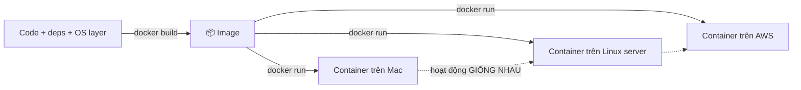
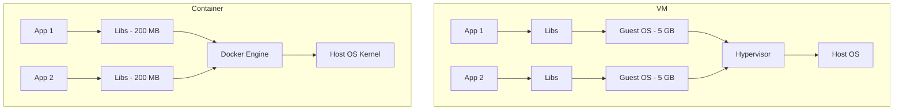
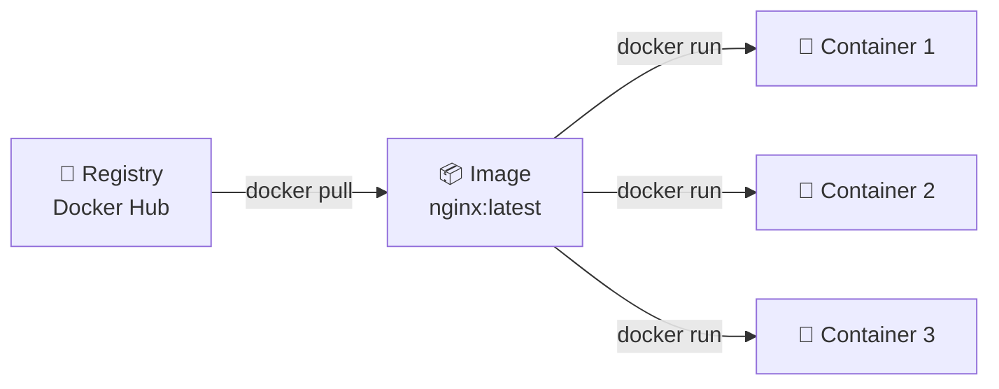
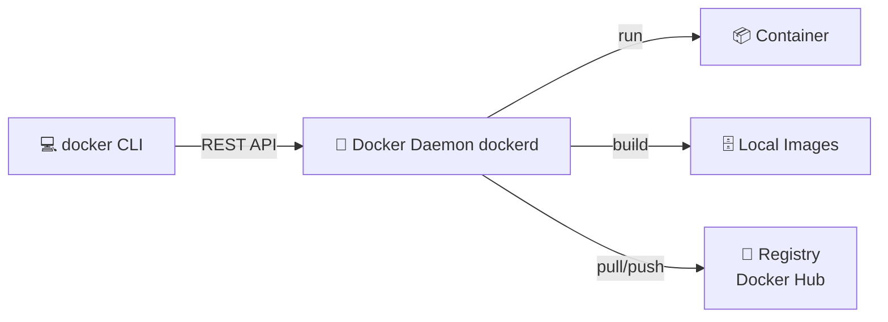

# 🎓 Bạn ship project — đồng nghiệp bị "works on my machine"

> **Tác giả:** Mr.Rom\
> **Phiên bản:** v2.3.0\
> **Tạo lúc:** 16/05/2026\
> **Cập nhật:** 24/05/2026\
> **Level:** Basic\
> **Tags:** [MUST-KNOW]\
> **Thời lượng đọc:** ~15 phút\
> **Prerequisites:** Đã [cài Docker](../../setup/install-docker.md) ✅, biết Terminal cơ bản, đã đọc [git bộ](../../../../01_Foundations/version-control/git/) ✅

> 🎯 *Tiếp story sau git: bạn ship được project lên GitHub, nhưng đồng nghiệp pull về máy không chạy. Bài này dẫn bạn hiểu vì sao có Docker, Container khác VM thế nào, mô hình 3 khái niệm Image/Container/Registry — KHÔNG dạy `docker run` chi tiết (sẽ học ở bài 01).*

## 🎯 Sau bài này bạn sẽ

- [ ] Hiểu Docker giải quyết vấn đề gì
- [ ] Phân biệt **Container** vs **VM** (Virtual Machine)
- [ ] Hiểu 3 khái niệm cốt lõi: **Image**, **Container**, **Registry**
- [ ] Biết Docker hoạt động ra sao (architecture)
- [ ] Biết lộ trình học tiếp theo

---

## Tình huống — đồng nghiệp pull project của bạn về máy

Sau bộ git, bạn đã ship `myapp` lên GitHub. Chiều thứ 2, 1 đồng nghiệp mới join team bắt đầu setup máy mới để code Frontend.

Đồng nghiệp clone:
```bash
git clone https://github.com/acmeshop/myapp
cd myapp
```

README ghi: *"chạy `pip install -r requirements.txt` rồi `python main.py`"*. Họ làm theo:

```bash
pip install -r requirements.txt
```

🔥 Lỗi đầu tiên:
```
ERROR: Python 3.9 detected. Need Python 3.11+
```

Đồng nghiệp dùng Python 3.9, bạn dùng 3.11. Họ upgrade Python — 20 phút.

```bash
pip install -r requirements.txt
```

🔥 Lỗi thứ 2:
```
error: psycopg2 requires pg_config — Postgres dev headers missing
```

Đồng nghiệp phải cài Postgres dev headers — 15 phút Google + cài.

```bash
python main.py
```

🔥 Lỗi thứ 3:
```
ConnectionRefusedError: Cannot connect to PostgreSQL on localhost:5432
```

Họ chưa có Postgres running. Cài Postgres 16 (bạn dùng 15). Cấu hình user, password. **40 phút**.

Tiếp tục: Redis chưa cài. Celery worker cần Redis. **30 phút**.

→ **2 tiếng** chỉ để **chạy app cũng không xong**. Đồng nghiệp chưa code 1 dòng.

Sếp đi qua, thấy team khổ sở, chỉ buông 1 câu:

> *"Sao không dùng Docker?"*

Bạn sững lại — câu này giống hệt câu sếp nói lúc bạn mất 1 ngày code vì không dùng git. Bạn Google. *"Docker là gì?"* — đến đây là lúc bạn đọc bài này.

---

## 1️⃣ Vậy Docker giải quyết gì?

**Trả lời tình huống trên**: 3 lỗi đồng nghiệp gặp đều do **"dependency hell"** — môi trường máy họ khác máy bạn (Python version, Postgres version, Redis chưa cài, OS khác).

Docker giải quyết bằng cách: đóng gói **app + Python interpreter + thư viện + Postgres + Redis + OS layer** vào các **container** chạy giống nhau ở mọi nơi (Mac/Linux/Windows/AWS/GCP). Đồng nghiệp pull project → `docker compose up` → 1 lệnh, mọi thứ chạy. Không cần cài Python, Postgres, Redis riêng.



### Bảng so sánh

So sánh **trực tiếp** workflow trước và sau Docker cho 6 vấn đề phổ biến nhất — từ setup máy dev mới đến scale production. Khoảng cách lợi ích là vài giờ vs vài ngày:

| Vấn đề | Không Docker | Với Docker |
|---|---|---|
| Setup máy dev mới | Đọc README, cài 20 thứ, 2 ngày fix bug | `docker compose up` — 5 phút |
| Deploy production | "Hy vọng version giống dev" | Image y hệt dev, đảm bảo identical |
| App A cần Python 3.8, App B cần 3.11 | Cài nhiều version, conflict, đau khổ | Mỗi app 1 container — không đụng nhau |
| Microservices | Manual port, network | Compose / K8s tự quản lý |
| Onboard dev mới | 1-2 tuần setup máy | 1 giờ clone + `docker compose up` |
| Scale | Manual cài đặt nhiều server | Spin up N containers trong giây |

→ Docker là **nền tảng** cho:
- **Microservices** (mỗi service 1 container)
- **CI/CD** (build image trong CI, deploy container)
- **Kubernetes** (orchestrate hàng nghìn container)
- **Cloud-native** (AWS ECS, GCP Cloud Run, ...)

→ **Mọi DevOps modern dùng Docker**. Không học = không vào nghề DevOps được.

---

## 2️⃣ Vậy Docker thực sự là gì?

**Định nghĩa chính thức**: Docker là **platform open-source** đóng gói app + dependencies thành **container** — đơn vị chạy được trên mọi OS có Docker engine.

**🪞 Ẩn dụ**: *Docker giống như **hộp lego đóng kín** — bên trong có app + thư viện + config + thậm chí 1 lớp OS mỏng (Linux). Plug vào "connector" lego ở bất kỳ máy nào → chạy. Khác biệt máy mẹ (Mac/Win/Linux) không quan trọng — connector lego giống nhau.*

### Container vs VM (Virtual Machine) — phân biệt cực quan trọng

Cả 2 đều "tạo môi trường cô lập" — nhưng cơ chế khác xa:

| | **VM** (VirtualBox, VMware) | **Container** (Docker) |
|---|---|---|
| Tầng | Mỗi VM có **OS đầy đủ** (kernel + userland) | Share **kernel** với host, chỉ có userland |
| Boot time | 1-5 phút | 1-5 giây |
| Kích thước | 5-20 GB | 50 MB - 1 GB |
| Tài nguyên | Nặng (mỗi VM dedicated RAM/CPU) | Nhẹ (share resource với host) |
| Số instance | 5-10 VM/máy | 100-1000 container/máy |
| Isolation | Mạnh (hypervisor cách ly) | Yếu hơn (process-level, namespace) |
| Use case | Chạy OS khác (Win trên Mac), security-critical | App deploy, microservices |



→ **Container nhẹ hơn 10-100 lần VM**. Đó là lý do containers thắng VM cho app deployment.

### 3 khái niệm cốt lõi

Docker ecosystem có **3 concept core** — Image (bản thiết kế), Container (instance chạy), Registry (kho lưu). Hiểu được 3 cái này là hiểu 80% Docker. Như OOP: 1 class → nhiều object:

| Khái niệm | Là gì | Ẩn dụ |
|---|---|---|
| **Image** | "Bản thiết kế" + snapshot app — file `.tar` chứa filesystem | Bản vẽ + linh kiện lego |
| **Container** | Instance đang chạy của image | Mô hình lego đã ráp + đang hoạt động |
| **Registry** | Server lưu image — public (Docker Hub) hoặc private | Cửa hàng bán bộ lego |



→ 1 image → nhiều container (tương tự 1 class → nhiều object trong OOP).

---

## 3️⃣ Bên dưới Docker ngầm chạy ra sao?

Khi gõ `docker run`, có **4 component** phối hợp dưới capo — CLI gửi lệnh tới Daemon, Daemon dùng containerd/runc gọi Linux kernel feature (namespace + cgroup) tạo container. Diagram architecture:



| Component | Vai trò |
|---|---|
| **Docker CLI** (`docker`) | Lệnh user gõ |
| **Docker Daemon** (`dockerd`) | Service nền — nhận lệnh từ CLI, quản lý container/image/network |
| **containerd / runc** | Low-level runtime — thực sự "tạo" container qua Linux namespace + cgroup |
| **Registry** | Lưu image — public/private |

> 💡 *Docker dùng feature có sẵn của Linux kernel (**namespaces** + **cgroups**) để cô lập container. Không phải "phép thuật" — chỉ là wrapper user-friendly.*

### Workflow chuẩn

Docker workflow 5 bước rõ ràng từ source → production. Mỗi lệnh là 1 bước. Đây là loop bạn sẽ lặp daily khi làm DevOps:

```
1. Viết Dockerfile (mô tả image)
       ↓
2. docker build → tạo Image
       ↓
3. docker push → lên Registry
       ↓
4. docker pull → kéo về máy khác
       ↓
5. docker run → khởi tạo Container
```

---

## 4️⃣ Use cases — Docker dùng cho gì trong 2026

### 🌐 Local development

Use case phổ biến nhất — chạy full stack (Flask + Postgres + Redis + RabbitMQ) bằng **1 lệnh** thay vì cài từng tool riêng. Đây là superpower mà mọi dev junior khi chạm Docker đều "wow":

```bash
docker compose up    # 1 lệnh — chạy app + DB + cache + queue
```

→ Developer mới onboard: clone repo, `docker compose up`, ăn cơm — quay lại là code được.

### 🚀 Production deployment
- AWS ECS / Fargate
- Google Cloud Run
- Azure Container Apps
- Kubernetes (mọi cloud)

### 🧪 CI/CD pipeline
```yaml
# GitHub Actions
jobs:
  test:
    runs-on: ubuntu-latest
    container: python:3.12
    steps:
      - run: pytest
```

→ Test trong container = test trong env y hệt production.

### 🤖 Microservices
- Mỗi service 1 container (auth, payment, notification, ...)
- Scale độc lập: notification cần 10 container, auth chỉ 2

### 📊 Data / ML
- Jupyter notebook + ML deps trong container
- TensorFlow GPU containers
- Reproducible research

### 🗄️ Databases
```bash
docker run -d -p 5432:5432 -e POSTGRES_PASSWORD=secret postgres:16
```

→ Cài Postgres trong 10 giây. Xóa cũng 1 lệnh.

---

## 5️⃣ Khái niệm advanced (sẽ học ở bài sau)

| Khái niệm | Là gì | Học ở bài |
|---|---|---|
| **Dockerfile** | File mô tả cách build image | [02_dockerfile-basics](./02_dockerfile-basics.md) |
| **Volume** | Lưu data persistent (không mất khi container chết) | (sắp có) `04_volumes-and-storage.md` |
| **Network** | Container giao tiếp với nhau | (sắp có) `05_networking.md` |
| **Compose** | Multi-container app với YAML | [03_docker-compose](./03_docker-compose.md) |
| **Registry** | Push/pull image | (advanced) |
| **Multi-stage build** | Image gọn hơn | (advanced) |

---

## 💡 Câu hỏi beginner hay hỏi

### "Docker thay được VM hoàn toàn không?"

❌ Không. Container và VM **bổ sung nhau**:
- **VM**: chạy OS khác (Win trên Mac), security-critical (banking)
- **Container**: deploy app, microservices, scale

Trên thực tế: **VM chạy Docker** (vd: Linux VM trên AWS chạy Docker containers).

### "Container không an toàn?"

🟡 An toàn hơn process thường, kém hơn VM. Cho hầu hết web app → **đủ an toàn**. Multi-tenant critical → vẫn dùng VM hoặc gVisor/Kata Containers.

### "Image bao nhiêu MB là chuẩn?"

🟡 Tùy:
- **Alpine-based** (Python/Node): 50-200 MB ✅
- **Debian-slim**: 200-500 MB ✅
- **Full Ubuntu**: 500 MB - 1 GB 🟡
- **>1 GB**: cần optimize (multi-stage build)

### "Docker chậm trên Mac?"

🟡 Docker Desktop chạy trong Linux VM trên Mac → chậm hơn Linux native ~20-30%. Apple Silicon nhanh hơn Intel. Beginner không thấy issue. Optimize: **OrbStack** thay Docker Desktop trên Mac.

### "Có cần học Docker rồi mới học K8s không?"

✅ **CÓ**. K8s orchestrate containers. Không hiểu container → học K8s sẽ vô nghĩa.

---

## 🗺️ Lộ trình học tiếp theo

| # | Bài | Học gì |
|---|---|---|
| 01 | [Images & Containers](./01_images-and-containers.md) | `docker pull`, `run`, `ps`, `stop`, `rm`, ports, env |
| 02 | [Dockerfile basics](./02_dockerfile-basics.md) | Build image custom, FROM/RUN/COPY/CMD |
| 03 | [Docker Compose](./03_docker-compose.md) | Multi-container app với 1 file YAML |
| (sau) | Volumes & Networking | Data persistent + container communication |
| (sau) | Multi-stage builds + Best practices | Image size optimization |
| (sau) | Registry & Image management | Push/pull, version, security scan |

→ Sau 3 bài (01-03), bạn đủ skill **70% Docker daily** dùng cho local dev + deploy.

---

## 📚 Glossary

| EN | VN | Giải thích |
|---|---|---|
| Container | (giữ nguyên) | Instance đang chạy của image — process cô lập |
| Image | (giữ nguyên) | Snapshot read-only chứa app + deps + OS layer |
| Registry | Kho lưu image | Server chứa image (Docker Hub, ECR, GHCR) |
| Repository | (giữ nguyên) | Bộ sưu tập images cùng tên, khác tag (vd `nginx:1.25`, `nginx:1.26`) |
| Tag | Nhãn | Version của image (`:latest`, `:1.25`, `:alpine`) |
| Dockerfile | (giữ nguyên) | File text mô tả cách build image |
| Volume | (giữ nguyên) | Storage persistent, gắn vào container |
| Bind mount | Mount thư mục host | Mount folder host vào container |
| Network | Mạng | Mạng ảo cho container giao tiếp |
| Compose | (giữ nguyên) | Tool quản lý multi-container với YAML |
| Daemon | (giữ nguyên) | Service nền (dockerd) — quản lý mọi thứ |
| Engine | (giữ nguyên) | Docker Engine = daemon + CLI + runtime |
| Namespace | Không gian tên | Linux feature — cô lập filesystem/process/network |
| Cgroup | Control Group | Linux feature — giới hạn CPU/RAM/IO của process |

---

## 🔗 Liên kết & Tài nguyên

### Bài liên quan

| Hướng | Bài |
|---|---|
| ⬅️ Bài trước | [Setup Docker](../../setup/install-docker.md) |
| ➡️ Bài tiếp | [01_images-and-containers.md](./01_images-and-containers.md) |
| 🧭 Roadmap | (sẽ có) DevOps Engineer Career Roadmap |

### Tài nguyên ngoài

- [Docker Official Docs](https://docs.docker.com/) — chính thức
- [Play with Docker](https://labs.play-with-docker.com/) — sandbox online
- [Docker for Beginners (free book)](https://docker-curriculum.com/) — tutorial step-by-step
- [Awesome Docker](https://github.com/veggiemonk/awesome-docker) — curated list

---

## 📌 Changelog

- **v2.3.0 (25/05/2026)** — Apply Blueprint v0.5.4+ §3.6: thêm lead-in 2-3 câu trước Bảng so sánh + 3 khái niệm cốt lõi + §3 Architecture + Workflow chuẩn + §4 Local development.

- **v2.2.0 (24/05/2026)** — Apply Blueprint v0.5.5 §3.5. Thay tên riêng fictional "Mai" → generic role "đồng nghiệp". Title đổi "bạn ship project — Mai bị..." → "Bạn ship project — đồng nghiệp bị...". Tình huống "Mai 2 tiếng không chạy được" → narrative dùng "đồng nghiệp/họ". Nội dung kỹ thuật giữ nguyên 100%.

- **v2.1.0 (24/05/2026)** — Apply Blueprint v0.5.4 §3.5. Bulk replace fictional character "Long" → "bạn"/"Bạn"/"Mình" theo context (generic role thay tên riêng tự bịa). Nội dung kỹ thuật giữ nguyên.

- **v2.0.0 (20/05/2026)** — **Restructure** theo writing-style v0.5.1 + story arc continuation từ git:
  - Title đổi: "Docker là gì — Hộp lego..." → story-driven
  - Mở bằng **tình huống đồng nghiệp 2 tiếng không chạy được app** (Python 3.9 vs 3.11, psycopg2 thiếu pg_config, Postgres chưa cài, Redis chưa cài) — đóng vòng với câu sếp lặp lại: *"Sao không dùng Docker?"*
  - Headers đổi: `1️⃣ Vì sao cần Docker (WHY)` / `2️⃣ Docker là gì (WHAT)` / `3️⃣ Architecture (HOW)` → câu hỏi tự nhiên
  - Định nghĩa Docker đến SAU tình huống — trả lời 3 lỗi cụ thể beginner gặp
  - Content kỹ thuật KHÔNG đổi (Container vs VM, 3 khái niệm, architecture, use cases vẫn nguyên)
- **v1.0.0 (16/05/2026)** — Bản đầu tiên — intro Docker: WHY (dependency hell), WHAT (Container vs VM, 3 khái niệm), HOW (architecture), 6 use cases, 5 câu hỏi beginner.
