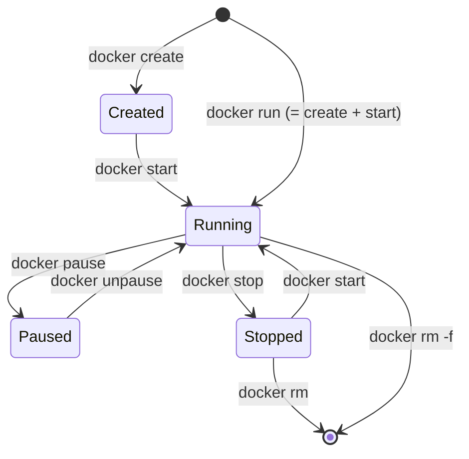

# 🎓 bạn làm chủ 8 lệnh Docker — Images & Containers

> **Tác giả:** Mr.Rom\
> **Phiên bản:** v2.2.0\
> **Tạo lúc:** 16/05/2026\
> **Cập nhật:** 25/05/2026\
> **Level:** Basic\
> **Tags:** [MUST-KNOW]\
> **Thời lượng đọc:** ~25 phút (kèm hands-on)\
> **Prerequisites:** [00_what-is-docker.md](./00_what-is-docker.md), đã [cài Docker](../../setup/install-docker.md) chạy được

> 🎯 *Tiếp bạn story: bạn đọc xong intro Docker, mở Docker Desktop, gõ lệnh đầu tiên — gõ lệnh gì? Bài này dạy **8 lệnh CRUD container** bạn sẽ dùng hàng ngày: pull, run, ps, stop, rm, logs, exec, images.*

## 🎯 Sau bài này bạn sẽ

- [ ] Pull image từ Docker Hub
- [ ] Chạy container với options (port, env, volume, detached)
- [ ] List + stop + remove container
- [ ] Xem log + exec vào container đang chạy
- [ ] Dọn dẹp image/container không dùng

---

## Tình huống — bạn mở Docker Desktop lần đầu

Bạn vừa hiểu Docker là gì. Mở Docker Desktop — giao diện trống trơn. Terminal:

```bash
docker --version
# Docker version 25.0.3, build...
```

OK Docker đang chạy. Nhưng **gõ lệnh đầu tiên là gì?** bạn search Google "docker tutorial" — 47 tab mở ra, mỗi tutorial dạy thứ tự khác nhau. Hỗn loạn.

Bạn quay sang sếp:

> *"Anh, có 100+ lệnh docker, em phải học từ đâu?"*

Sếp cười: *"Mỗi ngày anh dùng đúng 8 lệnh. Em học 8 lệnh đó là đủ làm việc."*

Bài này là 8 lệnh đó — **"bộ CRUD" cho container**, 80% công việc Docker daily.

---

## 1️⃣ Vậy 8 lệnh "CRUD container" là gì?

8 lệnh `pull`/`run`/`ps`/`stop`/`rm`/`logs`/`exec`/`images` chiếm **80% lệnh Docker daily**. Đây là "bộ CRUD" cho containers:

| CRUD | Lệnh |
|---|---|
| **Create** | `docker pull` (image), `docker run` (container) |
| **Read** | `docker ps`, `docker images`, `docker logs`, `docker inspect` |
| **Update** | `docker exec`, `docker restart` |
| **Delete** | `docker stop`, `docker rm`, `docker rmi` |

→ Học 8 lệnh = quản lý được Postgres/Redis/Nginx local trong 1 phút.

---

## 2️⃣ Container đi qua những trạng thái nào?

Trước hands-on, hiểu **container đi qua các trạng thái**:



| Trạng thái | Ý nghĩa | Tài nguyên |
|---|---|---|
| **Created** | Container đã tạo từ image, chưa start | Disk only |
| **Running** | Đang chạy | CPU + RAM |
| **Paused** | Đông đặc (freeze process) | RAM only |
| **Stopped** | Đã dừng, vẫn còn trên disk | Disk only |
| **Removed** | Xóa hoàn toàn | (mất) |

→ **`docker run`** = `create` + `start` cùng lúc (lệnh dùng nhiều nhất).

---

## 3️⃣ Bắt tay làm — 8 lệnh cốt lõi

### 🛠️ 3.1 `docker pull` — Tải image về

`docker pull` tải image từ registry (mặc định Docker Hub) về máy local. Tương tự `git clone` — chỉ cần làm 1 lần, image cache lại sau đó:

```bash
docker pull nginx:latest
```

```
latest: Pulling from library/nginx
abc123: Pull complete
def456: Pull complete
...
Status: Downloaded newer image for nginx:latest
docker.io/library/nginx:latest
```

→ Tải image `nginx` tag `latest` từ Docker Hub về máy local.

**Format**: `<repository>:<tag>`. Bỏ tag → mặc định `:latest`.

```bash
docker pull nginx              # = nginx:latest
docker pull nginx:1.25         # version cụ thể
docker pull nginx:alpine       # base Alpine (~20 MB)
docker pull python:3.12-slim   # Python với image slim
```

> 💡 **Best practice**: KHÔNG dùng `:latest` trong production — không reproducible. Dùng tag cụ thể (`nginx:1.25.3`).

### 🛠️ 3.2 `docker images` — List images đã tải

Liệt kê mọi image đã pull về máy. Output 5 cột — repository, tag, SHA hash, created time, size. Dùng để check trước khi `docker run`:

```bash
docker images
```

```
REPOSITORY   TAG       IMAGE ID       CREATED        SIZE
nginx        latest    abc123def456   2 weeks ago    187MB
nginx        alpine    def789ghi012   1 month ago    23MB
python       3.12      ghi345jkl678   3 weeks ago    1.02GB
hello-world  latest    jkl901mno234   6 months ago   13.3kB
```

| Cột | Ý nghĩa |
|---|---|
| `REPOSITORY` | Tên image |
| `TAG` | Version |
| `IMAGE ID` | SHA hash của image |
| `CREATED` | Khi nào image được build (không phải khi pull) |
| `SIZE` | Kích thước trên disk |

### 🛠️ 3.3 `docker run` — Chạy container (lệnh quan trọng nhất)

#### Cơ bản

`docker run <image>` là **lệnh quan trọng nhất** Docker — create + start container 1 phát. Default foreground (terminal block). Ctrl+C để stop:

```bash
docker run nginx
```

→ Khởi tạo container từ image `nginx`, chạy ngay. Foreground — terminal block.

Nhấn `Ctrl + C` để stop.

#### Detached mode (`-d`) — chạy nền

Cờ `-d` (detached) chạy container **trong background** — terminal được free để gõ lệnh khác. Đây là mode chạy production server (nginx, postgres, redis):

```bash
docker run -d nginx
```

```
abc123def456789...
```

→ Container chạy nền. Terminal free. Output là **container ID**.

#### Map port (`-p host:container`)

Nginx chạy trên port 80 INSIDE container. Để access từ host:

```bash
docker run -d -p 8080:80 nginx
```

→ Truy cập `http://localhost:8080` → thấy "Welcome to nginx!".

| Format | Ý nghĩa |
|---|---|
| `-p 8080:80` | Map host port 8080 → container port 80 |
| `-p 80:80` | Cùng port (cần sudo trên Linux cho <1024) |
| `-p 8080-8090:80-90` | Range |

#### Đặt tên container (`--name`)

Mặc định Docker assign tên random kiểu "hopeful_einstein" — khó nhớ. `--name` cho phép đặt tên dễ nhớ, dùng để stop/exec/log sau này:

```bash
docker run -d -p 8080:80 --name my-nginx nginx
```

→ Container có tên `my-nginx` thay vì tên random. Dễ reference sau:

```bash
docker stop my-nginx
docker rm my-nginx
```

#### Environment variables (`-e`)

```bash
docker run -d \
    -p 5432:5432 \
    --name my-postgres \
    -e POSTGRES_PASSWORD=secret \
    -e POSTGRES_USER=admin \
    -e POSTGRES_DB=myapp \
    postgres:16
```

→ Truyền biến môi trường vào container — config Postgres.

#### Volume (`-v host:container`) — lưu data persistent

```bash
docker run -d \
    -p 5432:5432 \
    --name my-postgres \
    -e POSTGRES_PASSWORD=secret \
    -v ~/postgres-data:/var/lib/postgresql/data \
    postgres:16
```

→ Data Postgres lưu ở `~/postgres-data` trên host. Container chết → data **không mất**.

#### Auto remove (`--rm`)

```bash
docker run --rm -p 8080:80 nginx
```

→ Container tự xóa khi stop. Tiện cho test nhanh, không "ô nhiễm" disk.

#### Interactive (`-it`) — vào shell

```bash
docker run -it ubuntu bash
```

```
root@abc123:/#
```

→ Chạy `ubuntu` image, vào `bash` shell tương tác. `exit` để thoát.

| Flag | Ý nghĩa |
|---|---|
| `-i` | Interactive (giữ STDIN) |
| `-t` | TTY (terminal) |
| `-it` | Cả 2 — tương tác như terminal |

### 🛠️ 3.4 `docker ps` — List containers đang chạy

```bash
docker ps
```

```
CONTAINER ID   IMAGE         COMMAND                  STATUS         PORTS                  NAMES
abc123def456   nginx         "/docker-entrypoint…"   Up 5 minutes   0.0.0.0:8080->80/tcp   my-nginx
def789ghi012   postgres:16   "docker-entrypoint.s…"   Up 2 minutes   0.0.0.0:5432->5432/tcp my-postgres
```

| Cột | Ý nghĩa |
|---|---|
| `CONTAINER ID` | Hash định danh |
| `IMAGE` | Image gốc |
| `COMMAND` | Lệnh chạy bên trong (truncated) |
| `STATUS` | Đang Up bao lâu |
| `PORTS` | Port mapping |
| `NAMES` | Tên container |

#### Show cả container đã stop (`-a`)

```bash
docker ps -a
```

#### Format gọn

```bash
docker ps --format "table {{.Names}}\t{{.Image}}\t{{.Status}}"
```

```
NAMES         IMAGE         STATUS
my-nginx      nginx         Up 5 minutes
my-postgres   postgres:16   Up 2 minutes
```

### 🛠️ 3.5 `docker logs` — Xem log container

```bash
docker logs my-nginx
```

→ In log của container ra terminal.

#### Follow realtime (`-f`)

```bash
docker logs -f my-nginx
```

→ Như `tail -f` — log mới hiện ngay khi có. `Ctrl + C` để thoát.

#### Tail N dòng cuối

```bash
docker logs --tail 50 my-nginx
```

#### Kèm timestamp

```bash
docker logs -t my-nginx
```

### 🛠️ 3.6 `docker exec` — Vào container đang chạy

```bash
docker exec -it my-nginx bash
```

```
root@abc123:/#
```

→ Vào shell của container `my-nginx`. Có thể chạy lệnh:

```
# ls /etc/nginx
nginx.conf  conf.d  ...
# cat /etc/nginx/nginx.conf
...
# exit
```

→ `exit` để thoát, container vẫn chạy.

**Use case**: debug, xem config, install tool tạm.

#### Chạy 1 lệnh không cần vào shell

```bash
docker exec my-nginx ls /etc/nginx
```

### 🛠️ 3.7 `docker stop` + `docker rm` — Dừng + xóa

```bash
docker stop my-nginx       # gửi SIGTERM, chờ 10s, rồi SIGKILL
docker rm my-nginx          # xóa container đã stop
```

Hoặc combo (force kill + xóa):

```bash
docker rm -f my-nginx
```

#### Stop + rm nhiều container

```bash
docker stop my-nginx my-postgres
docker rm my-nginx my-postgres
```

#### Stop hết container đang chạy

```bash
docker stop $(docker ps -q)
```

#### Xóa hết container (cả stopped)

```bash
docker rm $(docker ps -aq)
```

### 🛠️ 3.8 `docker rmi` — Xóa image

```bash
docker rmi nginx:alpine
```

→ Xóa image. Báo lỗi nếu container đang dùng image đó.

```bash
docker rmi -f nginx:alpine      # force xóa
```

### 🛠️ 3.9 Bonus: `docker inspect` — Chi tiết container/image

```bash
docker inspect my-nginx
```

→ JSON đầy đủ: IP, mount, environment, network, restart policy, ...

Filter cụ thể:

```bash
docker inspect my-nginx --format='{{.NetworkSettings.IPAddress}}'
docker inspect my-nginx --format='{{json .Config.Env}}'
```

### 🛠️ 3.10 Bonus: `docker stats` — Realtime resource usage

```bash
docker stats
```

```
CONTAINER ID   NAME         CPU %   MEM USAGE / LIMIT     MEM %     NET I/O
abc123         my-nginx     0.00%   3.4MiB / 7.7GiB       0.04%     1.2kB / 0B
def789         my-postgres  0.15%   45MiB / 7.7GiB        0.57%     12kB / 8kB
```

→ Giống `top` cho containers. `Ctrl + C` để thoát.

---

## 4️⃣ Dọn dẹp — `docker system prune`

Image + container tích lũy → disk full nhanh. Dọn:

### Xóa container đã stop

```bash
docker container prune
```

### Xóa image không dùng (không có container referencing)

```bash
docker image prune          # chỉ dangling images (untagged)
docker image prune -a       # MỌI image không dùng
```

### Dọn tất cả (image, container, network, volume)

```bash
docker system prune          # an toàn — không xóa volume
docker system prune -a       # cả image không dùng
docker system prune -a --volumes    # ⚠️ XÓA volume luôn — mất data!
```

### Xem disk usage

```bash
docker system df
```

```
TYPE            TOTAL     ACTIVE    SIZE      RECLAIMABLE
Images          15        3         5.2GB     3.8GB (73%)
Containers      8         2         1.1GB     900MB (81%)
Local Volumes   5         2         500MB     200MB (40%)
Build Cache     0         0         0B        0B
```

→ Dọn định kỳ (1 lần/tháng) tiết kiệm vài GB.

---

## 💡 Pitfall & Best practice

### ❌ Pitfall: Quên `--name`, container name random khó nhớ

```bash
docker run -d nginx
docker ps
# NAMES: zealous_einstein  ← random
```

→ Sau lại: "Container nào là Nginx của tôi?"

- **Fix**: luôn `--name` để dễ reference

### ❌ Pitfall: `docker run` mỗi lần → tạo container mới

```bash
docker run -d --name my-nginx nginx
docker run -d --name my-nginx nginx
# Error: name "my-nginx" is already in use
```

- **Fix**: dùng `docker start my-nginx` để khởi động lại container đã stop, không phải `run` lại.

### ❌ Pitfall: Quên `-d`, terminal bị block

```bash
docker run -p 8080:80 nginx    # ❌ block terminal
```

- **Fix**: thêm `-d` cho service. Hoặc `Ctrl + C` rồi `docker run -d ...`.

### ❌ Pitfall: Mất data khi container chết (không có volume)

```bash
docker run -d --name pg postgres:16    # ❌ data trong container — chết = mất
docker rm pg                            # mất data!
```

- **Fix**: luôn `-v` volume cho stateful service (DB, cache với persistent):
  ```bash
  docker run -d --name pg -v pg-data:/var/lib/postgresql/data postgres:16
  ```

### ❌ Pitfall: Port conflict

```bash
docker run -p 8080:80 nginx
# bind: address already in use
```

- **Fix**: kiểm tra port đã dùng (`lsof -i :8080` Mac/Linux), đổi port khác.

### ❌ Pitfall: Image `:latest` không reproducible

```bash
# Hôm nay
docker pull nginx:latest    # nginx 1.25

# 1 tháng sau
docker pull nginx:latest    # nginx 1.27 — có thể breaking change
```

- **Fix**: production dùng tag cụ thể (`nginx:1.25.3-alpine`), không `:latest`.

### ✅ Best practice: Container ephemeral — tạo xóa thoải mái

Triết lý Docker: container nên **stateless** + **disposable**. Data persistent → volume. Config → env var.

→ Khi update app: `docker rm old` + `docker run new`, không "sửa trong container".

### ✅ Best practice: Restart policy

```bash
docker run -d --restart=unless-stopped --name pg postgres:16
```

→ `--restart=unless-stopped`: tự restart nếu crash, máy reboot. **Khuyến nghị cho service production**.

Options:
- `no` (default)
- `on-failure` — restart nếu exit code != 0
- `always` — luôn restart
- `unless-stopped` — restart trừ khi user stop tay

### ✅ Best practice: Resource limit

```bash
docker run -d --memory=512m --cpus=1 --name my-app my-image
```

→ Giới hạn 512MB RAM, 1 CPU. Tránh 1 container ăn hết tài nguyên máy.

---

## 🧠 Self-check

**Q1.** Khác nhau `docker run` vs `docker start`?

<details>
<summary>💡 Đáp án</summary>

- **`docker run`**: tạo container **mới** từ image (= `docker create` + `docker start`).
- **`docker start`**: khởi động lại container **đã có** (đã stop).

Container đã có `docker run` 1 lần → các lần sau dùng `docker start <name>` để bật lại, không `run` lại.

</details>

**Q2.** Vì sao `:latest` không nên dùng production?

<details>
<summary>💡 Đáp án</summary>

`:latest` không "khóa" version cụ thể — mỗi lần pull có thể ra version khác (nếu image publisher push update). Hậu quả:

- **Không reproducible**: deploy lại 1 năm sau ra version khác → bug khác
- **Breaking change tự dưng**: image publisher update major version → app crash
- **Khó rollback**: không biết version cũ là gì

Production luôn pin version cụ thể: `nginx:1.25.3-alpine`.

</details>

**Q3.** Tại sao cần volume? Container không lưu được data sao?

<ated>
<summary>💡 Đáp án</summary>

Container **CÓ** lưu data, NHƯNG data nằm trong **filesystem riêng** của container đó. Khi container chết:

- Container ephemeral → xóa luôn filesystem
- Restart container → filesystem cũng reset (nếu không dùng `docker start` mà `docker run` lại)

**Volume** = storage tách rời container, gắn vào qua `-v`. Container chết → volume vẫn còn. Restart container mới gắn cùng volume → có data cũ.

→ Triết lý: **container = process tạm**, **volume = data lâu dài**.

</details>

---

## ⚡ Cheatsheet

```bash
# Images
docker pull <image>:<tag>          # tải image
docker images                       # list
docker rmi <image>                  # xóa image
docker image prune -a               # dọn unused

# Run container
docker run <image>                  # foreground
docker run -d <image>               # detached
docker run -d -p 8080:80 <image>    # port map
docker run -d --name my <image>     # đặt tên
docker run -d -e KEY=value <image>  # env var
docker run -d -v /host:/container <image>  # volume
docker run -it <image> bash         # interactive shell
docker run --rm <image>             # auto remove
docker run -d --restart=unless-stopped <image>  # auto restart

# Manage container
docker ps                           # list running
docker ps -a                        # list all (kể cả stopped)
docker stop <name>                  # dừng (gracefully)
docker start <name>                 # khởi động lại
docker restart <name>               # restart
docker rm <name>                    # xóa (phải stop trước)
docker rm -f <name>                 # force xóa

# Inspect / debug
docker logs <name>                  # xem log
docker logs -f <name>               # follow log
docker exec -it <name> bash         # vào shell
docker exec <name> <command>        # chạy 1 lệnh
docker inspect <name>               # JSON chi tiết
docker stats                        # resource usage realtime
docker top <name>                   # processes trong container

# Cleanup
docker container prune              # xóa container stopped
docker image prune -a               # xóa image unused
docker system prune -a              # dọn tất cả
docker system df                    # xem disk usage

# Useful one-liners
docker stop $(docker ps -q)         # stop ALL
docker rm $(docker ps -aq)          # xóa ALL container
docker rmi $(docker images -q)      # xóa ALL image
```

---

## 📚 Glossary

| EN | VN | Giải thích |
|---|---|---|
| Pull | Tải xuống | Tải image từ registry về local |
| Push | Đẩy lên | Đẩy image lên registry |
| Run | Chạy | Tạo + start container từ image |
| Container ID | ID container | SHA hash 64 ký tự (thường dùng 12 đầu) |
| Tag | Nhãn | Version của image |
| Detached mode | Chế độ nền | Container chạy nền, terminal free |
| Port mapping | Ánh xạ port | `host:container` — expose port ra ngoài |
| Volume | (giữ nguyên) | Storage persistent, gắn vào container |
| Bind mount | Mount thư mục | `-v /host/path:/container/path` |
| Environment variable | Biến môi trường | Config qua `-e KEY=value` |
| Restart policy | Chính sách restart | `no`/`on-failure`/`always`/`unless-stopped` |
| Ephemeral | Tạm thời | Container disposable, không lưu state |

---

## 🔗 Liên kết & Tài nguyên

### Bài liên quan

| Hướng | Bài |
|---|---|
| ⬅️ Bài trước | [00_what-is-docker.md](./00_what-is-docker.md) |
| ➡️ Bài tiếp | [02_dockerfile-basics.md](./02_dockerfile-basics.md) — build image custom |
| 🧭 Roadmap | (sắp có) DevOps Engineer Career Roadmap |

### Tài nguyên ngoài

- [Docker run reference](https://docs.docker.com/engine/reference/run/) — official, đầy đủ flag
- [Awesome Docker Compose](https://github.com/docker/awesome-compose) — example apps
- [Docker Hub](https://hub.docker.com) — tìm image official

---

## 📌 Changelog

- **v2.2.0 (25/05/2026)** — Apply Blueprint v0.5.4+ §3.6: thêm lead-in 2-3 câu trước §3.1 pull + 3.2 images + 3.3 run Cơ bản + Detached mode + Đặt tên container. Sửa "bạn bắt tay làm" → "Bắt tay làm" cho clean. Nội dung kỹ thuật giữ nguyên.

- **v2.1.0 (24/05/2026)** — Apply Blueprint v0.5.4 §3.5. Bulk replace fictional character "bạn" → "bạn"/"Bạn"/"Mình" theo context (generic role thay tên riêng tự bịa). Nội dung kỹ thuật giữ nguyên.

- **v2.0.0 (20/05/2026)** — **Restructure** theo writing-style v0.5.1 + bạn story arc:
  - Title đổi: "Docker Images & Containers" → "**bạn làm chủ 8 lệnh Docker**"
  - Mở bằng **tình huống bạn mở Docker Desktop lần đầu**, hỏi sếp "100 lệnh, học từ đâu?", sếp dạy "mỗi ngày 8 lệnh"
  - Headers đổi: `1️⃣ Vì sao học 8 lệnh (WHY)` / `2️⃣ Lifecycle (WHAT)` / `3️⃣ Hands-on (HOW)` → câu hỏi tự nhiên ("Vậy 8 lệnh CRUD là gì?", "Container đi qua trạng thái nào?", "bạn bắt tay làm — 8 lệnh cốt lõi")
  - Content kỹ thuật KHÔNG đổi (8 lệnh + state diagram + pitfalls vẫn nguyên)
- **v1.0.0 (16/05/2026)** — Bản đầu tiên — 8 lệnh Docker daily + lifecycle + 6 pitfall + best-practice + cleanup.
