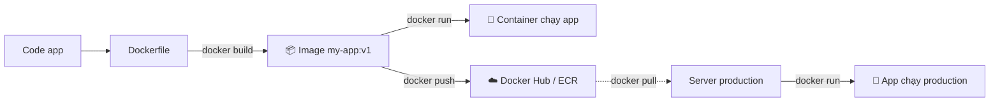

# 🎓 Long build image `myapp` đầu tiên — Dockerfile Basics

> **Tác giả:** Mr.Rom\
> **Phiên bản:** v2.0.0\
> **Tạo lúc:** 16/05/2026\
> **Cập nhật:** 20/05/2026\
> **Level:** Basic\
> **Tags:** [MUST-KNOW]\
> **Thời lượng đọc:** ~25 phút\
> **Prerequisites:** [01_images-and-containers.md](./01_images-and-containers.md)

> 🎯 *Tiếp Long story: Long đã `docker run nginx` chạy ngon, nhưng `docker run myapp` báo lỗi — image 'myapp' không tồn tại. Bài này dạy Long viết Dockerfile để build image cho app của chính mình.*

## 🎯 Sau bài này bạn sẽ

- [ ] Viết Dockerfile cơ bản cho app Python/Node
- [ ] Hiểu 8 instruction quan trọng: `FROM`, `WORKDIR`, `COPY`, `RUN`, `CMD`, `EXPOSE`, `ENV`, `ARG`
- [ ] Build image bằng `docker build`
- [ ] Hiểu **layer caching** — vì sao thứ tự dòng quan trọng
- [ ] Phân biệt `CMD` vs `ENTRYPOINT`
- [ ] Viết `.dockerignore` đúng cách

---

## Tình huống — Long muốn share `myapp` cho Mai bằng Docker

Long đã quen với `docker run nginx`, `docker run postgres`. Nhưng vấn đề ban đầu (Mai không chạy được `myapp`) **chưa giải quyết**. Long thử:

```bash
docker run myapp
```

```
Unable to find image 'myapp:latest' locally
docker: Error response from daemon: pull access denied for myapp...
```

❌ **Không có image `myapp`** — nginx/postgres/redis đều là image public trên Docker Hub, có sẵn. App của Long thì **chưa ai build image cho nó**.

Long phải tự build. Câu hỏi:
1. **"Build" image nghĩa là gì cụ thể?**
2. **Cấu hình** (Python 3.11, requirements.txt, source code) đi vào image như nào?
3. Sau khi build, làm sao **share** cho Mai dùng?

Đáp án: **Dockerfile** — file text "công thức" cho image. Bài này dạy Long viết Dockerfile đầu tiên cho `myapp`.

### Quy trình build → run



→ **1 Dockerfile** → image → chạy được mọi nơi (dev, staging, production).

---

## 1️⃣ Vậy Dockerfile thực sự là gì?

**Trả lời**: Dockerfile là **file text** chứa các **instruction** Docker thực hiện theo thứ tự để build image — đúng "công thức nấu ăn" cho image của Long.

**🪞 Ẩn dụ**: *Dockerfile như **công thức nấu ăn** — liệt kê nguyên liệu (base image) + các bước (chế biến, gia vị, nêm) → kết quả là 1 món ăn (image). Cùng công thức → cùng món ăn ở mọi nơi.*

### Cú pháp cơ bản

```dockerfile
# Mọi Dockerfile bắt đầu bằng FROM
FROM <base-image>

# Sau đó là các instruction
INSTRUCTION arguments
```

| Instruction | Vai trò |
|---|---|
| `FROM` | Base image (bắt buộc, dòng đầu) |
| `WORKDIR` | Chuyển vào folder (trong container) |
| `COPY` | Copy file từ host → container |
| `RUN` | Chạy lệnh khi BUILD (vd cài package) |
| `CMD` | Lệnh chạy khi container START (mặc định) |
| `ENTRYPOINT` | Như CMD, nhưng strict hơn |
| `EXPOSE` | Doc port app expose (chỉ là note) |
| `ENV` | Set environment variable |
| `ARG` | Build-time variable |
| `LABEL` | Metadata (author, version, ...) |
| `USER` | Đổi user (security) |
| `VOLUME` | Khai báo mount point |

---

## 2️⃣ Long viết Dockerfile đầu tiên cho `myapp`

### 🛠️ 3.1 App mẫu — Python Flask hello world

Tạo folder + 2 file:

```bash
mkdir my-flask-app && cd my-flask-app

# app.py
cat > app.py << 'EOF'
from flask import Flask
app = Flask(__name__)

@app.route("/")
def hello():
    return "Hello from Docker!"

if __name__ == "__main__":
    app.run(host="0.0.0.0", port=5000)
EOF

# requirements.txt
cat > requirements.txt << 'EOF'
flask==3.0.0
EOF
```

### 🛠️ 3.2 Viết Dockerfile — Bản đơn giản

```dockerfile
# Dockerfile
FROM python:3.12-slim

WORKDIR /app

COPY requirements.txt .

RUN pip install --no-cache-dir -r requirements.txt

COPY app.py .

EXPOSE 5000

CMD ["python", "app.py"]
```

### 🛠️ 3.3 Build image

```bash
docker build -t my-flask-app:v1 .
```

| Phần | Ý nghĩa |
|---|---|
| `docker build` | Lệnh build |
| `-t my-flask-app:v1` | Tag image: `name:tag` |
| `.` | **Build context** — folder chứa Dockerfile + files |

Output:

```
[+] Building 25.3s (10/10) FINISHED
 => [internal] load build definition from Dockerfile
 => [1/5] FROM docker.io/library/python:3.12-slim
 => [2/5] WORKDIR /app
 => [3/5] COPY requirements.txt .
 => [4/5] RUN pip install --no-cache-dir -r requirements.txt
 => [5/5] COPY app.py .
 => exporting to image
 => => writing image sha256:abc123...
 => => naming to docker.io/library/my-flask-app:v1
```

### 🛠️ 3.4 Run

```bash
docker run -d -p 5000:5000 --name flask my-flask-app:v1
```

Verify:

```bash
curl http://localhost:5000
# Hello from Docker!
```

✅ App chạy trong container!

Logs:

```bash
docker logs flask
```

Dọn:

```bash
docker stop flask && docker rm flask
```

---

## 3️⃣ Giải thích từng instruction

### `FROM` — Base image

```dockerfile
FROM python:3.12-slim
```

→ Bắt đầu từ image `python:3.12-slim` (có sẵn Python 3.12 + minimal Debian).

**Chọn base image**:

| Tùy chọn | Size | Khi dùng |
|---|---|---|
| `python:3.12` | ~1 GB | Full features, dev |
| `python:3.12-slim` | ~150 MB | ✅ **Recommend** — slim Debian |
| `python:3.12-alpine` | ~50 MB | Nhỏ nhất, nhưng có thể conflict glibc |
| `python:3.12-bullseye` | Trung bình | Debian 11 cụ thể |

→ **Pattern chung**: dùng tag cụ thể (`3.12-slim`), KHÔNG `latest`.

### `WORKDIR` — Chuyển folder

```dockerfile
WORKDIR /app
```

→ Tương đương `cd /app` trong container. Nếu folder chưa có, tự tạo.

Sau `WORKDIR`, mọi lệnh `COPY`, `RUN`, `CMD` đều chạy ở folder này.

### `COPY` — Copy file từ host vào container

```dockerfile
COPY requirements.txt .
COPY app.py .
COPY src/ /app/src/
```

| Format | Ý nghĩa |
|---|---|
| `COPY <src> <dst>` | `<src>` ở host (relative từ build context), `<dst>` trong container |
| `COPY . /app` | Copy MỌI thứ trong build context vào `/app` |

> ⚠️ Cẩn thận `COPY . .` — có thể copy cả `node_modules`, `.git`, `.env` vào image (xem §5 `.dockerignore`).

### `RUN` — Chạy lệnh khi build

```dockerfile
RUN pip install --no-cache-dir -r requirements.txt
RUN apt update && apt install -y curl git
RUN useradd -m appuser
```

→ Lệnh thực hiện 1 lần khi BUILD image. Kết quả cài vào image.

**Best practice**: gộp nhiều `RUN` để giảm số layer:

```dockerfile
# ❌ 3 layers
RUN apt update
RUN apt install -y curl
RUN apt clean

# ✅ 1 layer
RUN apt update && \
    apt install -y curl && \
    apt clean && \
    rm -rf /var/lib/apt/lists/*
```

### `CMD` — Lệnh mặc định khi container start

```dockerfile
CMD ["python", "app.py"]
```

→ Khi `docker run`, chạy lệnh này. Có thể override:

```bash
docker run my-app          # chạy "python app.py" (CMD)
docker run my-app bash     # chạy "bash" thay, override CMD
```

**3 format**:

```dockerfile
# 1. Exec form (RECOMMEND)
CMD ["python", "app.py"]

# 2. Shell form (chạy qua /bin/sh -c)
CMD python app.py

# 3. CMD as parameter for ENTRYPOINT
ENTRYPOINT ["python"]
CMD ["app.py"]
```

> 💡 **Luôn dùng exec form** (`["cmd", "arg1", "arg2"]`) — tránh issue với signal handling (`Ctrl+C`).

### `EXPOSE` — Khai báo port

```dockerfile
EXPOSE 5000
```

→ **CHỈ là documentation** — KHÔNG thực sự expose. Vẫn cần `-p` khi run.

```bash
docker run -p 5000:5000 my-app    # vẫn cần -p
```

→ `EXPOSE` chỉ giúp người đọc Dockerfile biết "image này dùng port 5000".

### `ENV` — Environment variable

```dockerfile
ENV PYTHON_VERSION=3.12
ENV APP_HOME=/app
ENV NODE_ENV=production
```

→ Có sẵn trong container (cả lúc build và run).

Override khi run:

```bash
docker run -e NODE_ENV=development my-app
```

### `ARG` — Build-time variable (khác ENV)

```dockerfile
ARG VERSION=1.0
ARG NODE_VERSION

FROM node:${NODE_VERSION}-slim
LABEL version=${VERSION}
```

→ `ARG` chỉ tồn tại lúc BUILD. `ENV` tồn tại cả lúc RUN.

Truyền khi build:

```bash
docker build --build-arg NODE_VERSION=20 -t my-app .
```

---

## 4️⃣ Layer caching — Tối ưu build time

Mỗi instruction trong Dockerfile → 1 **layer**. Docker cache từng layer. Nếu layer không đổi → reuse, build nhanh hơn nhiều.

### Vấn đề: thứ tự dòng SAI

```dockerfile
# ❌ Mỗi lần sửa app.py → cache vỡ từ COPY app.py
FROM python:3.12-slim
WORKDIR /app
COPY . .                                    # ← copy hết, cache vỡ ngay khi đổi 1 file
RUN pip install -r requirements.txt          # ← rebuild lại mỗi lần
CMD ["python", "app.py"]
```

→ Lần đầu: 30s. Sửa `app.py`: vẫn 30s (vì cache vỡ).

### Fix: file ÍT đổi → trên cùng, file HAY đổi → dưới cùng

```dockerfile
# ✅ Tối ưu cache
FROM python:3.12-slim
WORKDIR /app

# requirements.txt ít đổi → để trên
COPY requirements.txt .
RUN pip install --no-cache-dir -r requirements.txt    # ← cache reuse

# app.py hay đổi → để dưới
COPY app.py .
CMD ["python", "app.py"]
```

→ Lần đầu: 30s. Sửa `app.py`: **2s** (chỉ rebuild 2 layer cuối).

### Cache invalidation rule

| Khi nào cache layer X bị vỡ | Mọi layer SAU X cũng rebuild |
|---|---|
| Content của instruction X đổi | ✅ |
| Content file COPY/ADD đổi | ✅ |
| Base image đổi (FROM) | ✅ tất cả |

→ **Quy tắc**: file/instruction **ít đổi** ở trên cùng, **hay đổi** ở dưới cùng.

---

## 5️⃣ `.dockerignore` — Loại file khỏi build context

Khi `docker build .`, Docker copy MỌI thứ trong folder hiện tại vào build context (kể cả `node_modules`, `.git`). Lãng phí + chậm + có thể leak secret.

**Tạo `.dockerignore`** (tương tự `.gitignore`):

```
# .dockerignore

# Version control
.git
.gitignore

# Dependencies
node_modules/
__pycache__/
*.pyc
venv/
.venv/

# Build output
dist/
build/
*.egg-info/

# IDE
.vscode/
.idea/

# OS
.DS_Store
Thumbs.db

# Logs
*.log

# Env
.env
.env.local

# Tests
.pytest_cache/
.coverage
```

→ Image gọn hơn + build nhanh hơn + không leak.

---

## 6️⃣ `CMD` vs `ENTRYPOINT` — Khác biệt quan trọng

```dockerfile
# Option A: CMD only
CMD ["python", "app.py"]

# Option B: ENTRYPOINT only
ENTRYPOINT ["python", "app.py"]

# Option C: ENTRYPOINT + CMD (combo)
ENTRYPOINT ["python"]
CMD ["app.py"]
```

### Khi `docker run my-image`

| Option | Lệnh chạy | Override khi run |
|---|---|---|
| A (CMD) | `python app.py` | `docker run my-image bash` → chạy `bash`, override hoàn toàn |
| B (ENTRYPOINT) | `python app.py` | `docker run my-image bash` → chạy `python app.py bash` |
| C (combo) | `python app.py` | `docker run my-image other.py` → chạy `python other.py` (CMD bị override, ENTRYPOINT giữ) |

**Use case**:
- **CMD**: command default, có thể override hoàn toàn → image như Ubuntu (`docker run ubuntu` mặc định bash, có thể `docker run ubuntu ls`)
- **ENTRYPOINT**: image làm 1 việc cố định → `docker run my-cli --version`
- **Combo**: ENTRYPOINT là "binary cố định", CMD là default args

> 💡 **Default cho app**: combo C. ENTRYPOINT là Python, CMD là file mặc định.

---

## 💡 Pitfall & Best practice

### ❌ Pitfall: `COPY . .` copy luôn `.env`, `node_modules`

```dockerfile
COPY . .    # ❌ copy hết — kể cả file nhạy cảm
```

→ Image leak credential, nặng.

- **Fix**: dùng `.dockerignore` (xem §5).

### ❌ Pitfall: Quên `--no-cache-dir` cho pip

```dockerfile
RUN pip install -r requirements.txt    # ❌ pip cache thừa ~100 MB
```

- **Fix**:
  ```dockerfile
  RUN pip install --no-cache-dir -r requirements.txt
  ```

### ❌ Pitfall: Layer caching vỡ vì thứ tự sai

(Xem §4)

### ❌ Pitfall: Image >2 GB

```
my-app   v1   2.3GB
```

→ Build/push/pull cực chậm. Production lag.

- **Fix**: 
  - Dùng `slim` hoặc `alpine` base
  - Multi-stage build (advanced)
  - `.dockerignore` thật chặt
  - `RUN apt clean && rm -rf /var/lib/apt/lists/*` cuối mỗi RUN

### ❌ Pitfall: Run as root

Mặc định container chạy as `root`. Security risk.

```dockerfile
# ❌ root
FROM python:3.12-slim
COPY app.py .
CMD ["python", "app.py"]

# ✅ non-root user
FROM python:3.12-slim
RUN useradd -m appuser
USER appuser
COPY --chown=appuser app.py .
CMD ["python", "app.py"]
```

### ✅ Best practice: Pin version

```dockerfile
# ❌ unstable
FROM python:latest
RUN pip install flask

# ✅ reproducible
FROM python:3.12.0-slim
COPY requirements.txt .
# requirements.txt có flask==3.0.0
```

### ✅ Best practice: Sử dụng `--no-install-recommends` cho apt

```dockerfile
RUN apt-get update && \
    apt-get install -y --no-install-recommends \
        curl \
        ca-certificates && \
    rm -rf /var/lib/apt/lists/*
```

→ `--no-install-recommends` bỏ qua optional packages — image gọn hơn.

### ✅ Best practice: Label image với metadata

```dockerfile
LABEL maintainer="rom@example.com"
LABEL version="1.0.0"
LABEL description="Flask hello world app"
```

→ Hiển thị qua `docker inspect`.

### ✅ Best practice: Multi-stage build (advanced)

```dockerfile
# Stage 1: build
FROM python:3.12 AS builder
WORKDIR /build
COPY requirements.txt .
RUN pip install --no-cache-dir --user -r requirements.txt

# Stage 2: runtime (slim)
FROM python:3.12-slim
WORKDIR /app
COPY --from=builder /root/.local /root/.local
COPY app.py .
ENV PATH=/root/.local/bin:$PATH
CMD ["python", "app.py"]
```

→ Build trong stage 1 (đầy đủ tool), runtime stage 2 (chỉ chứa cái cần) → image gọn hơn nhiều. **Xem bài advanced sau.**

---

## 🧠 Self-check

**Q1.** Thứ tự đặt `COPY requirements.txt` và `COPY app.py` quan trọng thế nào?

<details>
<summary>💡 Đáp án</summary>

Cực kỳ quan trọng cho **layer caching**:

```dockerfile
# ✅ Đúng — requirements ÍT đổi → trên
COPY requirements.txt .
RUN pip install -r requirements.txt
COPY app.py .
```

→ Khi sửa `app.py`, chỉ 2 layer cuối rebuild. `pip install` (chậm) được cache.

```dockerfile
# ❌ Sai — app.py đổi → cả pip install rebuild
COPY app.py .
COPY requirements.txt .
RUN pip install -r requirements.txt
```

→ Quy tắc: **ít đổi trên, hay đổi dưới**.

</details>

**Q2.** Khác `CMD` và `ENTRYPOINT`?

<details>
<summary>💡 Đáp án</summary>

- **CMD**: lệnh mặc định, **có thể override hoàn toàn** khi `docker run`:
  ```
  CMD ["python", "app.py"]
  → docker run my-image bash  →  chạy "bash" (override)
  ```

- **ENTRYPOINT**: lệnh cố định, args khi `docker run` **append vào**:
  ```
  ENTRYPOINT ["python", "app.py"]
  → docker run my-image --debug  →  chạy "python app.py --debug"
  ```

- **Combo**: ENTRYPOINT cố định, CMD là default args:
  ```
  ENTRYPOINT ["python"]
  CMD ["app.py"]
  → docker run my-image  →  python app.py
  → docker run my-image other.py  →  python other.py
  ```

</details>

**Q3.** Vì sao `EXPOSE 5000` không thực sự expose port?

<details>
<summary>💡 Đáp án</summary>

`EXPOSE` chỉ là **metadata documentation** — báo cho người đọc Dockerfile rằng image dùng port nào. KHÔNG thực sự mở port ra ngoài.

Để thực sự expose, vẫn phải dùng `-p` khi run:

```bash
docker run -p 5000:5000 my-image    # ← cái này mới mở port
```

→ `EXPOSE` chủ yếu để:
1. Document
2. `docker run -P` (uppercase) tự map mọi EXPOSE port

</details>

---

## ⚡ Cheatsheet

```dockerfile
# Skeleton Dockerfile cho Python
FROM python:3.12-slim
WORKDIR /app
COPY requirements.txt .
RUN pip install --no-cache-dir -r requirements.txt
COPY . .
EXPOSE 5000
CMD ["python", "app.py"]

# Skeleton Dockerfile cho Node.js
FROM node:20-alpine
WORKDIR /app
COPY package*.json ./
RUN npm ci --only=production
COPY . .
EXPOSE 3000
CMD ["node", "server.js"]

# Build commands
docker build -t my-app:v1 .              # build với tag
docker build -t my-app:v1 -f Dockerfile.prod .   # custom Dockerfile name
docker build --no-cache -t my-app:v1 .   # bỏ cache, build từ đầu
docker build --build-arg VERSION=1.0 .   # truyền ARG
docker build --platform linux/amd64 .    # build cho platform khác

# Image management
docker images                            # list
docker inspect my-app:v1                 # JSON chi tiết
docker history my-app:v1                 # xem layers
docker tag my-app:v1 my-app:latest       # tag thêm
docker rmi my-app:v1                     # xóa

# Best practices summary
1. Base: dùng slim/alpine, pin version
2. .dockerignore: bỏ node_modules, .git, .env
3. COPY: file ít đổi trên, hay đổi dưới
4. RUN: gộp multiple commands, --no-cache-dir cho pip
5. USER: non-root cho security
6. CMD: dùng exec form ["cmd", "arg"]
```

---

## 📚 Glossary

| EN | VN | Giải thích |
|---|---|---|
| Dockerfile | (giữ nguyên) | File text mô tả cách build image |
| Build context | Bối cảnh build | Folder Docker đọc khi build (mặc định `.`) |
| Layer | Lớp | Mỗi instruction tạo 1 layer trong image |
| Layer caching | Cache lớp | Reuse layer không đổi để build nhanh |
| Instruction | Lệnh | Dòng trong Dockerfile (FROM, COPY, RUN, ...) |
| Base image | Image gốc | Image trong `FROM` để bắt đầu |
| Multi-stage build | Build nhiều stage | Dùng nhiều `FROM` để tách build vs runtime |
| `.dockerignore` | (giữ nguyên) | File khai báo loại file không copy vào build context |
| ARG vs ENV | (giữ nguyên) | ARG = build-time, ENV = runtime |
| CMD vs ENTRYPOINT | (giữ nguyên) | CMD overridable, ENTRYPOINT cố định |

---

## 🔗 Liên kết & Tài nguyên

### Bài liên quan

| Hướng | Bài |
|---|---|
| ⬅️ Bài trước | [01_images-and-containers.md](./01_images-and-containers.md) |
| ➡️ Bài tiếp | [03_docker-compose.md](./03_docker-compose.md) |
| 🧭 Roadmap | (sắp có) DevOps Engineer Career Roadmap |

### Tài nguyên ngoài

- [Dockerfile reference](https://docs.docker.com/engine/reference/builder/) — official, đầy đủ instruction
- [Best practices for writing Dockerfiles](https://docs.docker.com/develop/develop-images/dockerfile_best-practices/)
- [Hadolint](https://github.com/hadolint/hadolint) — linter cho Dockerfile
- [Dive](https://github.com/wagoodman/dive) — phân tích layer image

---

## 📌 Changelog

- **v2.0.0 (20/05/2026)** — **Restructure** theo writing-style v0.5.1 + Long story arc:
  - Title đổi: "Dockerfile Basics" → "**Long build image `myapp` đầu tiên**"
  - Mở bằng **tình huống Long thử `docker run myapp`** thất bại (image không tồn tại) — phải tự build
  - Headers đổi: `1️⃣ Vì sao cần Dockerfile (WHY)` / `2️⃣ Dockerfile là gì (WHAT)` / `3️⃣ Hands-on (HOW)` → câu hỏi tự nhiên ("Tình huống — Long muốn share myapp cho Mai", "Vậy Dockerfile thực sự là gì?", "Long viết Dockerfile đầu tiên cho myapp")
  - Content kỹ thuật KHÔNG đổi (8 instruction + build + layer caching + .dockerignore + CMD vs ENTRYPOINT vẫn nguyên)
- **v1.0.0 (16/05/2026)** — Bản đầu tiên — 8 instruction Dockerfile + build process + layer caching + .dockerignore + CMD vs ENTRYPOINT + 6 pitfall/best-practice.
