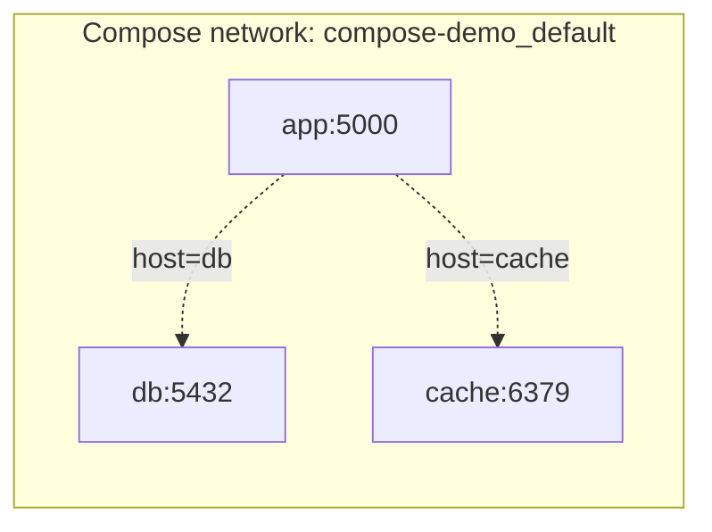

# Docker Compose — Quản lý multi-container với 1 file YAML

> **Tác giả:** Mr.Rom\
> **Phiên bản:** v1.0.0\
> **Tạo lúc:** 16/05/2026\
> **Cập nhật:** 16/05/2026\
> **Level:** Basic\
> **Tags:** [MUST-KNOW]\
> **Thời lượng đọc:** ~20 phút\
> **Prerequisites:** [02_dockerfile-basics.md](./02_dockerfile-basics.md)

> 🎯 *App thật thường cần nhiều container: app + DB + cache + queue. Compose gói tất cả vào 1 file YAML — `docker compose up` chạy hết.*

## 🎯 Sau bài này bạn sẽ

- [ ] Hiểu vì sao cần Compose (vs nhiều `docker run`)
- [ ] Viết `docker-compose.yml` cho app + Postgres + Redis
- [ ] Dùng `docker compose up/down/logs/exec` thành thạo
- [ ] Hiểu **service networking** — container gọi nhau qua tên
- [ ] Quản lý **volumes** + **environment** trong Compose
- [ ] Dùng `.env` file cho config

---

## 1️⃣ Vì sao cần Compose (WHY)

App thực tế hiếm khi chỉ 1 container. Thông thường:

```
my-app/
├── Backend (Flask)        → 1 container
├── Database (Postgres)    → 1 container
├── Cache (Redis)          → 1 container
└── Queue worker (Celery)  → 1 container
```

**Không Compose**: phải gõ 4 lệnh `docker run` riêng, nhớ port, network, volume...

```bash
docker network create mynet
docker run -d --name db --network mynet -e POSTGRES_PASSWORD=secret -v pg-data:/var/lib/postgresql/data postgres
docker run -d --name redis --network mynet redis
docker run -d --name app --network mynet -p 5000:5000 -e DB_HOST=db -e REDIS_HOST=redis my-app
docker run -d --name worker --network mynet -e DB_HOST=db my-app celery worker
```

→ 4 lệnh dài + dễ sai. Tắt: 4 `docker stop` + 4 `docker rm`. **Cực kỳ verbose**.

### Có Compose

1 file `docker-compose.yml`:

```yaml
services:
  app:
    image: my-app
    ports:
      - "5000:5000"
    depends_on:
      - db
      - redis
    environment:
      DB_HOST: db
      REDIS_HOST: redis
  db:
    image: postgres
    environment:
      POSTGRES_PASSWORD: secret
    volumes:
      - pg-data:/var/lib/postgresql/data
  redis:
    image: redis
  worker:
    image: my-app
    command: celery worker
    depends_on:
      - db
      - redis
    environment:
      DB_HOST: db
      REDIS_HOST: redis

volumes:
  pg-data:
```

→ Chạy hết:

```bash
docker compose up -d
```

Tắt hết:

```bash
docker compose down
```

→ **1 lệnh** thay 8 lệnh. Reproducible, share team dễ.

---

## 2️⃣ Docker Compose là gì (WHAT)

**Định nghĩa**: Docker Compose là tool **quản lý multi-container** apps qua **YAML file**. Đi kèm Docker Desktop, không cần cài riêng.

**🪞 Ẩn dụ**: *Compose như **bản giao hưởng** — định nghĩa cả dàn nhạc (nhiều container), ai chơi nhạc cụ gì, ai vào lúc nào. `docker compose up` = nhạc trưởng bắt đầu.*

### Cấu trúc cơ bản

```yaml
services:           # ← các container (gọi là "service")
  service-name:
    image: ...      # image dùng
    build: ...      # hoặc build từ Dockerfile
    ports: ...
    environment: ...
    volumes: ...
    depends_on: ...

volumes:            # ← volumes (persistent storage)
  volume-name:

networks:           # ← networks (optional, mặc định Compose tạo 1 network chung)
  network-name:
```

### `docker compose` vs `docker-compose` (lưu ý)

- **`docker compose`** (V2, có space) — modern, plugin built-in của Docker (RECOMMEND)
- **`docker-compose`** (V1, có dash) — cũ, Python standalone, được deprecated

→ Bài này dùng **V2** (`docker compose`).

---

## 3️⃣ Hands-on — Build app Flask + Postgres + Redis (HOW)

### 🛠️ 3.1 Setup project

```bash
mkdir compose-demo && cd compose-demo
```

Tạo `app.py`:

```python
# app.py
import os
from flask import Flask
import redis
import psycopg2

app = Flask(__name__)

DB_HOST = os.getenv("DB_HOST", "localhost")
REDIS_HOST = os.getenv("REDIS_HOST", "localhost")

r = redis.Redis(host=REDIS_HOST, port=6379, decode_responses=True)

@app.route("/")
def hello():
    # Increment counter trong Redis
    count = r.incr("visits")
    
    # Get DB version
    conn = psycopg2.connect(host=DB_HOST, user="admin", password="secret", database="myapp")
    cur = conn.cursor()
    cur.execute("SELECT version()")
    db_version = cur.fetchone()[0]
    conn.close()
    
    return f"Hello! Visits: {count}. DB: {db_version[:50]}"

if __name__ == "__main__":
    app.run(host="0.0.0.0", port=5000)
```

Tạo `requirements.txt`:

```
flask==3.0.0
redis==5.0.1
psycopg2-binary==2.9.9
```

Tạo `Dockerfile`:

```dockerfile
FROM python:3.12-slim
WORKDIR /app
COPY requirements.txt .
RUN pip install --no-cache-dir -r requirements.txt
COPY app.py .
EXPOSE 5000
CMD ["python", "app.py"]
```

### 🛠️ 3.2 Viết `docker-compose.yml`

```yaml
# docker-compose.yml
services:
  app:
    build: .                          # build từ Dockerfile trong folder hiện tại
    ports:
      - "5000:5000"
    environment:
      DB_HOST: db
      REDIS_HOST: cache
    depends_on:
      - db
      - cache

  db:
    image: postgres:16
    environment:
      POSTGRES_USER: admin
      POSTGRES_PASSWORD: secret
      POSTGRES_DB: myapp
    volumes:
      - pg-data:/var/lib/postgresql/data
    ports:
      - "5432:5432"           # expose ra host để debug DB qua psql

  cache:
    image: redis:7-alpine
    ports:
      - "6379:6379"

volumes:
  pg-data:
```

### 🛠️ 3.3 Chạy lên

```bash
docker compose up -d
```

```
Creating network "compose-demo_default" with the default driver
Creating volume "compose-demo_pg-data" with default driver
Pulling db (postgres:16)... done
Pulling cache (redis:7-alpine)... done
Building app... done
Creating compose-demo-db-1     ... done
Creating compose-demo-cache-1  ... done
Creating compose-demo-app-1    ... done
```

Test:

```bash
curl http://localhost:5000
# Hello! Visits: 1. DB: PostgreSQL 16.x ...

curl http://localhost:5000
# Hello! Visits: 2. DB: ...
```

✅ App + DB + Cache đều chạy, gọi được nhau!

### 🛠️ 3.4 Lệnh Compose phổ biến

```bash
docker compose up                # foreground (log ra terminal)
docker compose up -d             # detached (background)
docker compose up --build        # rebuild image trước khi up
docker compose up app db         # chỉ start service "app" và "db"

docker compose ps                # list services đang chạy
docker compose logs              # log tất cả services
docker compose logs -f app       # follow log của service app
docker compose logs --tail 50    # 50 dòng cuối

docker compose exec app bash     # vào shell container app
docker compose exec db psql -U admin myapp   # chạy psql trong container db

docker compose stop              # stop nhưng không xóa
docker compose start             # start lại
docker compose restart           # restart tất cả
docker compose restart app       # restart 1 service

docker compose down              # stop + remove containers + network
docker compose down -v           # ⚠️ cũng xóa volumes — MẤT data
docker compose down --rmi all    # cũng xóa images

docker compose pull              # pull image mới nhất
docker compose build             # build lại image local (từ Dockerfile)
docker compose config            # validate + in YAML đã merge
```

---

## 4️⃣ Service Networking — Container gọi nhau qua tên

Compose tự tạo 1 **network** chung cho mọi service. Mỗi service có **DNS** = tên service.



→ Trong `app.py`:

```python
DB_HOST = "db"          # ← tên service trong compose
REDIS_HOST = "cache"
```

→ Không dùng `localhost` hay IP. Dùng **tên service** (Docker DNS tự resolve).

> 💡 *Đây là điểm khác biệt cốt lõi vs `docker run`* — Compose tự handle networking. Không cần `--network` thủ công.

### Custom network

```yaml
services:
  app:
    networks:
      - frontend
      - backend
  db:
    networks:
      - backend       # chỉ app + db trong network "backend"

networks:
  frontend:
  backend:
```

→ Isolation tốt hơn — db không expose ra `frontend`.

---

## 5️⃣ Volumes — Persistent data

### Named volume (RECOMMEND)

```yaml
services:
  db:
    image: postgres
    volumes:
      - pg-data:/var/lib/postgresql/data

volumes:
  pg-data:        # Docker manages disk location
```

→ Docker tự lưu vào `/var/lib/docker/volumes/`. `docker compose down` không xóa. Chỉ `down -v` mới xóa.

### Bind mount (mount folder host)

```yaml
services:
  app:
    volumes:
      - ./code:/app/code              # ← code/ folder trên host
      - /var/log/app:/app/logs
```

→ Hữu ích cho:
- **Dev**: code thay đổi reflect ngay trong container (no rebuild)
- **Logs**: log ra host xem dễ

### Anonymous volume (tránh dùng)

```yaml
volumes:
  - /app/data       # ❌ no name, khó manage
```

---

## 6️⃣ Environment variables

### Inline trong compose

```yaml
services:
  app:
    environment:
      DB_HOST: db
      DEBUG: "true"
      PORT: 5000
```

### Từ file `.env` (RECOMMEND)

Tạo `.env`:

```
DB_PASSWORD=secret
APP_PORT=5000
```

Trong `docker-compose.yml`:

```yaml
services:
  app:
    ports:
      - "${APP_PORT}:5000"
    environment:
      DB_PASSWORD: ${DB_PASSWORD}
```

→ Compose tự đọc `.env` ở cùng folder. **Add `.env` vào `.gitignore`** (chứa secret).

### Từ env_file (cho service)

```yaml
services:
  app:
    env_file:
      - app.env
      - db.env
```

→ Load toàn bộ biến từ file vào env của container.

### Priority

1. CLI: `docker compose --env-file production.env up`
2. `environment:` trong compose
3. `env_file:`
4. `.env` ở project root
5. Shell environment

---

## 7️⃣ `depends_on` — Thứ tự khởi động

```yaml
services:
  app:
    depends_on:
      - db
      - cache
```

→ Compose start `db` + `cache` TRƯỚC, sau đó mới `app`.

> ⚠️ **`depends_on` chỉ đảm bảo thứ tự start, KHÔNG đảm bảo service đã ready**. Postgres start xong cần ~5s mới sẵn sàng nhận query. App có thể connect quá sớm → lỗi.

### Health check để đợi service ready

```yaml
services:
  db:
    image: postgres:16
    healthcheck:
      test: ["CMD-SHELL", "pg_isready -U admin"]
      interval: 5s
      timeout: 3s
      retries: 5

  app:
    depends_on:
      db:
        condition: service_healthy    # đợi db pass healthcheck
```

→ App chỉ start khi `db` health (đã ready nhận query).

---

## 8️⃣ Profiles — Chạy subset services

```yaml
services:
  app:
    image: my-app
  db:
    image: postgres
  cache:
    image: redis

  # Service chỉ chạy khi profile được active
  pgadmin:
    image: dpage/pgadmin4
    profiles:
      - debug

  test:
    image: my-app
    command: pytest
    profiles:
      - test
```

```bash
docker compose up                       # chỉ app + db + cache
docker compose --profile debug up        # + pgadmin
docker compose --profile test up         # + test runner
```

→ Use case: chạy `pgadmin`/`tests`/`debug tools` riêng, không "ô nhiễm" mặc định.

---

## 💡 Pitfall & Best practice

### ❌ Pitfall: Dùng `localhost` trong code, không phải tên service

```python
# ❌ trong container app
r = redis.Redis(host="localhost")    # connect chính nó → fail
```

- **Fix**: dùng tên service Compose:
  ```python
  r = redis.Redis(host="cache")    # cache = tên service
  ```

### ❌ Pitfall: `depends_on` không đảm bảo ready

App start trước khi `db` ready → connection refused.

- **Fix**: dùng healthcheck + `condition: service_healthy` (xem §7).
- Hoặc: retry logic trong code app.

### ❌ Pitfall: `docker compose down -v` xóa volume bất ngờ

```bash
docker compose down -v    # ⚠️ XÓA HẾT data
```

- **Cách tránh**: nhớ `-v` chỉ dùng khi muốn reset hoàn toàn (test fresh).

### ❌ Pitfall: Commit `.env` với secret

```bash
git add .env
# ❌ leak credentials
```

- **Fix**: 
  - `.env` vào `.gitignore`
  - Commit `.env.example` (placeholder values) thay vào

### ❌ Pitfall: Quên `--build` khi sửa Dockerfile

```bash
# Sửa Dockerfile
docker compose up -d    # ❌ vẫn dùng image cũ
```

- **Fix**: `docker compose up -d --build`

### ✅ Best practice: `depends_on` + healthcheck

```yaml
db:
  healthcheck:
    test: ["CMD-SHELL", "pg_isready -U admin"]
    interval: 5s
    retries: 5

app:
  depends_on:
    db:
      condition: service_healthy
```

### ✅ Best practice: Tách `docker-compose.yml` cho dev/prod

```
docker-compose.yml              # base
docker-compose.dev.yml          # override cho dev (bind mount code, debug)
docker-compose.prod.yml         # override cho prod (no bind, optimized)
```

```bash
docker compose -f docker-compose.yml -f docker-compose.dev.yml up
```

### ✅ Best practice: Pin version

```yaml
services:
  db:
    image: postgres:16.0       # ✅ cụ thể
    # KHÔNG: postgres:latest
```

### ✅ Best practice: Restart policy

```yaml
services:
  app:
    restart: unless-stopped    # auto restart nếu crash
```

---

## 🧠 Self-check

**Q1.** Container `app` muốn connect Postgres trong service `db`. Trong code dùng `host=` gì?

<details>
<summary>💡 Đáp án</summary>

**`db`** — tên service trong `docker-compose.yml`.

Compose tự setup DNS — container có thể resolve tên service thành IP. Không cần biết IP, không dùng `localhost`.

```python
DB_HOST = "db"      # ← tên service
# KHÔNG: "localhost", "127.0.0.1"
```

</details>

**Q2.** Khác nhau `docker compose down` và `docker compose down -v`?

<details>
<summary>💡 Đáp án</summary>

- **`docker compose down`**: stop + xóa containers + network. **Volumes vẫn còn** → data giữ.
- **`docker compose down -v`**: làm hết trên + **xóa volumes** → MẤT data persistent.

→ `down` dùng hàng ngày. `down -v` chỉ khi muốn reset hoàn toàn (test fresh start).

</details>

**Q3.** `depends_on` có đảm bảo service đã ready không?

<details>
<summary>💡 Đáp án</summary>

**KHÔNG**. `depends_on` chỉ đảm bảo **thứ tự start** — service `db` start TRƯỚC `app`, nhưng app có thể start khi `db` chưa kịp ready (Postgres mới khởi động ~5s).

→ Để đợi ready, dùng **healthcheck** + `condition: service_healthy`:

```yaml
db:
  healthcheck:
    test: ["CMD-SHELL", "pg_isready"]
    interval: 5s
    retries: 5

app:
  depends_on:
    db:
      condition: service_healthy   # ← đợi db pass healthcheck
```

Hoặc retry trong code app.

</details>

---

## ⚡ Cheatsheet

```yaml
# Skeleton docker-compose.yml
services:
  service-name:
    image: image:tag           # hoặc build: ./folder
    build:
      context: .
      dockerfile: Dockerfile
    container_name: my-container
    ports:
      - "5000:5000"
    environment:
      KEY: value
      KEY2: ${VAR_FROM_ENV}
    env_file:
      - .env
    volumes:
      - named-vol:/data
      - ./host-folder:/container/folder
    networks:
      - mynet
    depends_on:
      service2:
        condition: service_healthy
    restart: unless-stopped
    command: override-cmd
    healthcheck:
      test: ["CMD", "curl", "-f", "http://localhost/health"]
      interval: 30s

volumes:
  named-vol:

networks:
  mynet:
```

```bash
# Commands
docker compose up -d                 # start tất cả nền
docker compose up -d --build         # rebuild image
docker compose up app db             # start 1 số service
docker compose down                  # stop + xóa
docker compose down -v               # + xóa volumes (⚠️ mất data)

docker compose ps                    # list
docker compose logs -f app           # follow log
docker compose exec app bash         # vào shell
docker compose run --rm app pytest   # chạy command 1 lần
docker compose restart app           # restart 1 service
docker compose config                # validate + print

# Profiles
docker compose --profile debug up

# Env file
docker compose --env-file prod.env up
```

---

## 📚 Glossary

| EN | VN | Giải thích |
|---|---|---|
| Service | Dịch vụ | 1 container trong Compose (định nghĩa qua YAML) |
| Multi-container app | App nhiều container | App gồm 2+ container (web + db + cache + ...) |
| Compose file | File Compose | `docker-compose.yml` |
| Project name | Tên project | Mặc định = tên folder, prefix containers |
| Named volume | Volume tên | Volume Docker quản lý, có tên (`pg-data`) |
| Bind mount | Mount thư mục host | Mount folder host vào container |
| Healthcheck | Kiểm tra sức khỏe | Lệnh chạy định kỳ để xem container có "khỏe" không |
| Profile | (giữ nguyên) | Group services chạy có điều kiện |
| `.env` | (giữ nguyên) | File chứa env variables cho Compose |
| Override file | File ghi đè | `docker-compose.override.yml` — tự merge |
| Service discovery | Khám phá dịch vụ | Tự động tìm service qua DNS tên service |

---

## 🔗 Liên kết & Tài nguyên

### Bài liên quan

| Hướng | Bài |
|---|---|
| ⬅️ Bài trước | [02_dockerfile-basics.md](./02_dockerfile-basics.md) |
| ➡️ Bài tiếp | (sắp có) Volumes & Networking deep dive |
| 🧭 Roadmap | (sắp có) DevOps Engineer Career Roadmap |

### Tài nguyên ngoài

- [Compose specification](https://docs.docker.com/compose/compose-file/) — official
- [Awesome Compose](https://github.com/docker/awesome-compose) — 50+ example projects (Flask+Postgres, MERN, etc.)
- [Compose best practices](https://docs.docker.com/compose/production/) — for production

---

## 📌 Changelog

- **v1.0.0 (16/05/2026)** — Bản đầu tiên — Compose YAML + 9 lệnh + networking (service DNS) + volumes + .env + depends_on + healthcheck + profiles + 5 pitfall/best-practice.
