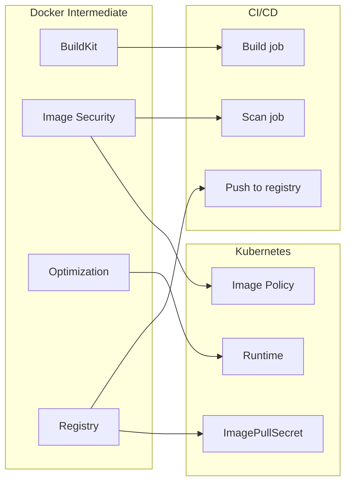

# 🎓 Docker Intermediate — Từ "chạy được" đến "production-grade"

> **Tác giả:** Mr.Rom\
> **Phiên bản:** v1.2.0\
> **Tạo lúc:** 24/05/2026\
> **Cập nhật:** 25/05/2026\
> **Level:** Intermediate\
> **Tags:** [MUST-KNOW]\
> **Thời lượng đọc:** ~18 phút\
> **Prerequisites:** Đã xong [Docker basic cluster](../01_basic/) ✅, viết được Dockerfile, dùng `docker compose up`

> 🎯 *Bài INTRO của intermediate. Bạn đã build được image, ghép Compose, deploy lên 1 VPS chạy ngon. Giờ là lúc hỏi: **production thật sự cần gì?** Bài này giới thiệu 4 mảng intermediate (BuildKit + Security + Optimization + Registry), KHÔNG hands-on chi tiết (sẽ học ở bài 01-04).*

## 🎯 Sau bài này bạn sẽ

- [ ] Hiểu **khoảng cách** giữa Docker "chạy được" và Docker "production-grade"
- [ ] Biết **4 mảng intermediate**: BuildKit / Image security / Optimization / Registry
- [ ] Hiểu **vì sao** image size, build time, supply chain quan trọng ở scale
- [ ] Định vị các **tool 2026** (Trivy, cosign, dive, BuildKit, distroless, Harbor)
- [ ] Có **lộ trình** học 4 bài kế tiếp + chỗ kết nối với K8s/CI-CD

---

## Tình huống — Bạn deploy production lần đầu, mới thấy basic không đủ

Bạn đã làm xong:
- ✅ Viết Dockerfile cho FastAPI + React.
- ✅ `docker compose up` chạy ngon ở dev.
- ✅ Deploy lên 1 VPS, app chạy.

Sếp/team lead chạy qua, hỏi vài câu mà bạn... ngơ:

> *"Image bao nhiêu MB? Build mất bao lâu? Có scan vulnerability chưa? CVE nào critical? Image này có signed không? Tag immutable hay mutable? Backup registry ở đâu? Pull-through cache có chưa?"*

🔥 Mỗi câu hỏi là 1 lỗ hổng:

| Sếp hỏi | Bạn trả lời cơ bản | Production cần |
|---|---|---|
| "Image bao nhiêu MB?" | "Tầm 1.2 GB" | < 200 MB (distroless/slim) |
| "Build mất bao lâu?" | "5 phút" | < 1 phút (BuildKit cache mount) |
| "Có scan CVE chưa?" | "Chưa..." | Trivy/Grype trong CI, fail nếu CRITICAL |
| "Image signed?" | "Là sao?" | cosign + Sigstore + policy enforce |
| "Tag immutable?" | "`latest`" | digest SHA pinning, never re-tag |
| "Registry backup?" | "Docker Hub" | Private Harbor/ECR + replication |

→ **Đây là khoảng cách basic ↔ production-grade**. Cluster intermediate này lấp đầy 4 mảng đó.

### Real-world incidents (vì sao 4 mảng này không phải optional)

5 sự cố production điển hình 2021-2025 minh hoạ vì sao intermediate skills không phải "nice to have". 3/5 sự cố là **supply chain attack** — không scan image, không sign = nguy cơ thực sự:

| Năm | Sự cố | Nguyên nhân gốc | Liên quan mảng |
|---|---|---|---|
| 2021 | **Codecov bash uploader** — credential leak ở 23,000 khách hàng | Image build không verify, attacker chèn 1 dòng `bash` upload env | Image security + supply chain (mảng 2) |
| 2023 | **3CX desktop app** — supply chain attack tới hàng ngàn doanh nghiệp | Image build từ compromised dep, không SBOM, không sign | Image security + SBOM (mảng 2) |
| 2024 | **Docker Hub rate-limit production outage** ở 1 startup VN | Cluster K8s 20 node, mỗi node pull image 10 lần/ngày → vượt 200 pull/6h | Registry strategy (mảng 4) |
| 2024 | **xz-utils backdoor** (CVE-2024-3094) | Maintainer cố tình inject backdoor vào tarball | Trivy scan + SBOM (mảng 2) |
| 2025 | **Acme Shop** (case study) — pod start chậm 90s gây alert PagerDuty | Image 1.8 GB, pull từ Docker Hub đến cluster GCP region khác | Optimization + Registry (mảng 3+4) |

→ **3 trong 5 vụ là supply chain attack**. Mảng 2 (security) không phải "nice to have" — là baseline 2026.

---

## 1️⃣ Vì sao 4 mảng này quan trọng ở scale?

### Image size matters

Image size ảnh hưởng **4 thứ** quan trọng — build time, deploy speed, attack surface, cost. Đặc biệt khi scale (100 deploy/ngày × 10 cluster), 1 GB image gây hệ luỵ rất lớn:

- **Build/push/pull thời gian** tỉ lệ thuận với size.
- **1 GB image × 100 deploy/ngày × 10 cluster** = 1 TB traffic vô ích/ngày.
- **Container start latency**: pull image lần đầu chậm → cold start tăng → user-facing latency.
- **Attack surface**: image to = nhiều thư viện = nhiều CVE.

→ **Slim/distroless image** giảm 80-90% size (200 MB → 30 MB điển hình).

### Build time matters

Build chậm = developer mất focus + CI/CD cost cao + deploy frequency giảm. **BuildKit cache mount** + parallelism là solution chuẩn 2026 cắt 70-90% build time:

- **Dev feedback loop**: bạn sửa 1 dòng code, đợi build 5 phút = mất focus.
- **CI/CD cost**: GitHub Actions tính phút × số job × số branch.
- **Deploy frequency**: build chậm = deploy ít = bug tích tụ.

→ **BuildKit cache mount + parallelism** cắt 70-90% build time.

### Image security matters

Supply chain attack 2026 không còn là chuyện đùa — base image có CVE, dependency bị inject backdoor. Trivy scan + cosign sign + SBOM là **baseline requirement** cho mọi production pipeline:

- **Supply chain attack** 2026 là thực tế (SolarWinds, Codecov, npm packages).
- **CVE trong base image** = exploit dễ. Postgres image có CVE-XXXX-YYYY → mọi container Postgres bạn deploy đều vulnerable.
- **Compliance**: SOC2/PCI/HIPAA yêu cầu image scan + signed.

→ **Trivy scan + cosign sign + SBOM** = baseline 2026.

### Registry strategy matters

Docker Hub rate limit + data residency + DR = 3 lý do mọi production setup cần **private registry + pull-through cache**. Không cẩn thận = production sập khi Docker Hub đổi policy:

- **Docker Hub rate limit**: 100 pull/6h cho anonymous, 200/6h cho free account. Production cluster pull 1000 image/giờ → block.
- **Data residency**: image phải ở region của bạn (latency, GDPR).
- **Disaster recovery**: Docker Hub down = không deploy được. Cần backup.
- **Cost**: ECR/GCR data egress tính tiền.

→ **Private registry + pull-through cache** = control + cost + reliability.

---

## 2️⃣ Vậy 4 mảng intermediate là gì?

### Mảng 1 — **BuildKit & Multi-stage advanced**

**Vấn đề**: build chậm + Dockerfile cũ nát.

**Giải pháp**:
- BuildKit (default 2026) — parallel build, cache mount, secret mount.
- Multi-stage build pattern cho Python/Node/Go.
- `docker buildx bake` cho multi-platform (amd64 + arm64).
- Build args + target stage.

🪞 **Ẩn dụ**: *BuildKit như **dây chuyền lắp ráp song song** — basic Docker build tuần tự từng dòng Dockerfile, BuildKit build 5 stage cùng lúc nếu không phụ thuộc nhau. Cache mount = "kho lưu vật liệu" (pip cache, npm cache) tái dùng giữa các build.*

→ Học ở **bài 01**.

### Mảng 2 — **Image Security & Supply Chain**

**Vấn đề**: image có CVE, có ai biết? Image này build từ source nào? Có bị tampered không?

**Giải pháp**:
- **Trivy** (Aqua) hoặc **Grype** (Anchore) — scan CVE trong image.
- **SBOM** (Software Bill of Materials) — manifest mọi package trong image (Syft/CycloneDX/SPDX format).
- **cosign** (Sigstore) — sign image, verify trước khi run.
- **Base image curation**: chọn image official + maintained, không random `joe/python:latest`.
- **Vulnerability lifecycle**: scan → triage → fix → re-deploy.

🪞 **Ẩn dụ**: *Image security như **kiểm dịch hàng hóa cảng biển** — Trivy là máy soi, SBOM là tờ khai hải quan, cosign là tem chống giả, base image official là supplier verified.*

→ Học ở **bài 02**.

### Mảng 3 — **Optimization & Distroless**

**Vấn đề**: image 1.2 GB, layer cache vỡ mỗi build, không biết bytes nào tốn nhất.

**Giải pháp**:
- **`dive`** tool — visualize layer + waste bytes.
- **Multi-stage build** với **distroless** base (Google) — chỉ runtime, không shell/package manager.
- **Alpine vs slim vs distroless vs scratch** — chọn đúng.
- **Layer order** optimization (deps trước, code sau).
- **`.dockerignore` aggressive** + `--squash` (BuildKit).

🪞 **Ẩn dụ**: *Distroless image như **container 1 món** — chỉ chứa runtime cần thiết, không có shell, không có package manager. Hacker vào được container = không có gì để dùng (không `bash`, không `curl`, không `apt`).*

→ Học ở **bài 03**.

### Mảng 4 — **Registry & Production Patterns**

**Vấn đề**: Docker Hub rate-limit, không có audit trail, không backup, latency cao.

**Giải pháp**:
- **Private registry**: Harbor (CNCF), ECR (AWS), GCR (GCP), GHCR (GitHub).
- **Pull-through cache**: registry mirror cho upstream images.
- **Image lifecycle**: tag policy (immutable digest, semver, env-suffix), garbage collection.
- **Replication**: cross-region, cross-cloud.
- **Pull secret + token rotation** trong K8s.

🪞 **Ẩn dụ**: *Registry như **kho phân phối phần mềm** — Docker Hub là "kho công cộng" (đông, chậm, rate limit), Harbor private là "kho riêng" (control, replicate, audit). Pull-through cache như **kho trung chuyển** ở gần data center bạn.*

→ Học ở **bài 04**.

---

## 3️⃣ Mối liên hệ với phần khác trong DevOps stack

| Mảng intermediate | Cấu thành CI/CD step nào | Cấu thành K8s step nào |
|---|---|---|
| BuildKit | `docker buildx build` trong build job | — |
| Image security | Scan job + policy gate | Admission controller (Kyverno/Gatekeeper) verify cosign signature |
| Optimization | Pull time giảm trong deploy job | Cold start container nhanh hơn |
| Registry | Push step, secret manage | `imagePullSecrets`, registry connectivity |

→ **Docker intermediate là foundation cho K8s intermediate + CI/CD intermediate**. Học xong cluster này, đi vào K8s intermediate (Helm/ArgoCD) hoặc CI/CD intermediate (supply chain SLSA) đều mượt.

---

## 4️⃣ Tool stack 2026 — Cheatsheet

| Mục đích | Tool chính 2026 | Tool dự bị | Khi nào dùng |
|---|---|---|---|
| Build advanced | **BuildKit** (default) | Buildah, Kaniko | BuildKit cho local + GH Actions; Kaniko khi cần rootless trong K8s |
| Multi-platform | `docker buildx` | — | Release image cho amd64 + arm64 (M-series Mac) |
| CVE scan | **Trivy** (Aqua) | Grype, Snyk, Docker Scout | Trivy CI default; Snyk khi có license |
| SBOM | **Syft** (Anchore) | Docker SBOM, CycloneDX CLI | Syft format CycloneDX/SPDX |
| Sign/verify | **cosign** (Sigstore) | Notary v2 | cosign default 2026 |
| Layer inspect | **`dive`** | docker history | dive khi optimize, history khi quick check |
| Distroless base | **`gcr.io/distroless/*`** (Google) | scratch | distroless cho Java/Python/Node prod |
| Private registry | **Harbor** (CNCF) | ECR/GCR/GHCR/Artifactory | Harbor self-host; ECR cloud-native AWS |
| Vulnerability DB | NVD + GHSA + OSV | — | Trivy/Grype dùng built-in |
| Compliance scan | **Docker Scout** (commercial) | Snyk, Lacework | Scout đầu tư bởi Docker, integrated UI |

→ **Recommended starter stack**: BuildKit + Trivy + cosign + dive + Harbor. **Tất cả OSS**.

---

## 5️⃣ Lộ trình 4 bài kế tiếp

| Bài | Nội dung | Thời lượng | Output sau bài |
|---|---|---|---|
| **01** BuildKit + Multi-stage | Cache/secret mount + parallelism + buildx + multi-platform + advanced multi-stage | ~25p | Image build 1 phút thay 5 phút |
| **02** Security + Supply chain | Trivy scan + SBOM + cosign sign + verify + vulnerability triage workflow | ~22p | Pipeline scan + sign + policy gate |
| **03** Optimization + Distroless | dive analyze + distroless/scratch base + alpine pitfall + layer order tối ưu | ~20p | Image 200 MB → 30 MB |
| **04** Registry + Production | Harbor self-host + ECR/GHCR + pull-through cache + tag policy + GC + replication | ~22p | Private registry production-ready |

→ **Tổng ~89 phút đọc + ~3-4h hands-on**. Sau cluster: bạn deploy Docker production-grade tier-1.

---

## 6️⃣ ROI thực tế — Đầu tư intermediate được gì?

| Số liệu | Trước intermediate | Sau intermediate | Δ |
|---|---|---|---|
| Image size (typical Node.js app) | 1.2 GB | 180 MB (slim) → 45 MB (distroless) | **−85% đến −96%** |
| Build time (CI clean cache) | 5 phút | 1 phút 10 giây (BuildKit cache mount) | **−77%** |
| Build time (CI warm cache) | 3 phút | 25 giây | **−86%** |
| Pull time (cluster cold start) | 45-60s | 8-12s | **−80%** |
| CVE critical còn lại trong production | Không biết | 0 (gate fail nếu có) | **100%** |
| Time-to-detect supply chain tampering | Vô hạn (không phát hiện) | < 5 phút (cosign verify fail) | **— → 5 phút** |
| Docker Hub rate-limit incidents | 1-2 lần/quý | 0 (pull-through cache) | **−100%** |
| Storage cost registry/tháng | ~ giá Docker Hub Pro $7/user | Tự host Harbor ~$30/tháng (1 server) cho team < 50 dev | Break-even ở ~5 user |

→ **Tiết kiệm điển hình** cho team 10 dev + 3 cluster: **~$200-500/tháng** infra + **~10-15h/tháng** thời gian dev (build chờ, deploy chờ, debug image).

→ Quan trọng hơn: **risk reduction** — 1 vụ CVE critical lọt prod = vài chục đến vài trăm giờ incident response. Mảng 2 trả lại chính nó sau 1 lần phòng được.

---

## 7️⃣ Learning timeline — Day 1 → Day 90

| Mốc | Bạn làm được gì | Đang ở bài nào |
|---|---|---|
| **Day 1-2** | Đọc bài 01, viết Dockerfile dùng BuildKit cache mount cho 1 service Python | Bài 01 |
| **Day 3-5** | Bake multi-platform image (amd64 + arm64) + push lên GHCR | Bài 01 cuối |
| **Day 6-7** | Thêm Trivy scan vào CI, fail nếu CRITICAL CVE | Bài 02 đầu |
| **Day 8-10** | Sign image cosign + verify trong policy K8s | Bài 02 cuối |
| **Day 11-14** | Dùng `dive` audit image, switch sang distroless cho 1 service | Bài 03 |
| **Day 15-20** | Self-host Harbor + setup pull-through cache cho Docker Hub | Bài 04 đầu |
| **Day 21-30** | Migrate toàn bộ team sang private registry + tag policy immutable | Bài 04 cuối |
| **Day 31-60** | Apply 4 mảng cho **mọi service** trong stack, viết runbook nội bộ | Củng cố |
| **Day 60-90** | Onboard team mới + giảng lại — feedback loop làm sâu kiến thức | Advanced ready |

→ **Day 90**: bạn sẵn sàng làm **Container Platform Engineer** hoặc **Lead** team Docker infra.

---

## 8️⃣ Anti-patterns — Đừng làm gì khi mới qua intermediate

| Anti-pattern | Vì sao sai | Đúng phải làm gì |
|---|---|---|
| Bật BuildKit nhưng dùng Dockerfile cũ không có `# syntax=docker/dockerfile:1.7` | Mất nhiều feature (cache mount, secret mount) | Luôn khai báo syntax directive |
| Scan CVE rồi **report-only**, không gate | CVE vẫn lọt prod | Fail pipeline nếu CRITICAL/HIGH (whitelist exception) |
| Sign image nhưng **không verify ở runtime** | Sign = chữ ký không ai check = vô nghĩa | Kyverno/Gatekeeper policy verify cosign signature |
| Distroless cho **mọi service** ngay lập tức | Debug khó, app crash không log được | Dev/staging dùng alpine/slim, prod mới distroless |
| Private registry nhưng `latest` tag mutable | Mất khả năng audit version chạy thật | Tag = `<semver>-<gitsha>`, deploy bằng digest |
| Pull-through cache trỏ Docker Hub bằng tài khoản free | Vẫn bị rate-limit ở mức cache miss đầu | Authenticated pull (Pro/Team) hoặc replicate full |
| Quên rotate registry pull secret trong K8s | Token leak → attacker pull image private | Rotation 90 ngày + External Secrets Operator |
| Có SBOM nhưng không lưu trữ/sign | SBOM dễ bị tampered | Sign SBOM bằng cosign attest, lưu cùng image |

→ **Pattern chung**: làm nửa vời còn nguy hiểm hơn không làm — vì tạo cảm giác an toàn giả.

---

## 💡 Câu hỏi beginner hay hỏi

**Q1.** "Docker basic đủ rồi, intermediate có cần không?"

→ Đủ cho **dev/staging single-server**. Production multi-server + multi-cluster + SOC2/compliance = thiếu. Intermediate là baseline cho mọi role DevOps/Platform/SRE 2026.

**Q2.** "BuildKit có mặc định không?"

→ **Có**, từ Docker 23+ (2023). Nếu bạn dùng Docker 2024+, BuildKit đang chạy. Bài 01 dạy bạn **dùng features đúng** (cache/secret mount).

**Q3.** "Distroless thay alpine luôn được không?"

→ **Không** — distroless không có shell, debug khó. Dùng distroless cho **production runtime**, dev/debug image có thể alpine/slim. Bài 03 phân tích trade-off.

**Q4.** "Image scan trong CI có chậm không?"

→ Trivy 5-15 giây cho image 200 MB. Cache DB local → 2-5 giây. Trade-off: trễ deploy vài giây vs ship CVE → đáng.

**Q5.** "Có cần private registry không nếu code OSS?"

→ Nếu image **chỉ chứa OSS app**, Docker Hub free OK. Nếu image có **business logic + customer code + secret baked in (đừng làm)**, phải private. Rate limit là vấn đề lớn ở scale.

**Q6.** "Có nên dùng `:latest` tag trong production không?"

→ **Tuyệt đối không**. `:latest` là **mutable** — image bị tag lại bất cứ lúc nào. Bạn không biết version đang chạy thật là gì, không reproduce được bug, không rollback chính xác. Production luôn dùng `<semver>-<gitsha>` hoặc deploy bằng `image@sha256:<digest>`. Bài 04 sẽ dạy tag policy chi tiết.

**Q7.** "BuildKit có dùng được trong K8s CI không (Tekton, ArgoCD)?"

→ **Có** nhưng cần **rootless** vì K8s không cho privileged. Lựa chọn:
- **Kaniko** (Google) — build rootless, không cần Docker daemon.
- **BuildKit rootless mode** — `buildkitd` chạy unprivileged user.
- **Buildah** (Red Hat) — daemonless, build rootless.

Bài 01 sẽ giới thiệu trade-off.

**Q8.** "Scan CVE phát hiện 50 CVE HIGH, fix sao đây?"

→ Đừng panic. **Triage workflow**:
1. Lọc CVE có **fix available** (patched version) — fix trước.
2. Lọc CVE **trong package thực sự dùng** (Trivy `--security-checks` + dependency graph). Nhiều CVE trong dep không bao giờ load.
3. Tạo **suppress list** cho CVE không fix được + có mitigation khác.
4. Set policy: CRITICAL fail, HIGH cảnh báo, MEDIUM/LOW theo dõi.

Bài 02 dạy triage workflow đầy đủ.

---

## 🗺️ Khi nào cần advanced (sau intermediate)?

Sau cluster này, nếu bạn cần đi sâu thêm:

| Topic advanced | Nội dung | Khi nào học |
|---|---|---|
| **Container runtime internals** | runc, containerd, namespaces/cgroups deep | Build platform team, debug kernel-level issue |
| **OCI image spec deep** | layer format, manifest v2, distribution spec | Build custom registry, image migration tool |
| **Container forensics** | runtime detection (Falco), eBPF security | SOC2 + production incident |
| **Rootless Docker** | Docker rootless mode, security boundary | Multi-tenant cluster, security-strict env |
| **Build-time hardening** | seccomp, AppArmor, SELinux trong Docker | Compliance strict |

→ Cluster `03_advanced/` sẽ làm sau intermediate.

---

## 📚 Glossary

| Term | Vietnamese / Explanation |
|---|---|
| **BuildKit** | Build engine mới của Docker (default 2023+) — parallel, cache mount, secret mount |
| **Multi-stage** | Dockerfile có nhiều `FROM` — stage 1 build, stage 2 chứa runtime |
| **SBOM** | Software Bill of Materials — manifest mọi component trong image |
| **CVE** | Common Vulnerabilities and Exposures — định danh lỗ hổng (CVE-2024-XXXXX) |
| **Distroless** | Image chỉ chứa runtime, không có shell/package manager (Google `gcr.io/distroless/*`) |
| **cosign** | CLI tool sign/verify image (Sigstore project) |
| **OCI** | Open Container Initiative — chuẩn image format + runtime |
| **Pull-through cache** | Registry proxy upstream images, cache local |
| **Immutable tag** | Tag không bao giờ point đến image khác (vs `latest` mutable) |
| **Layer caching** | BuildKit/Docker cache layer giữa các build dựa instruction + checksum |
| **Bake** | `docker buildx bake` — build nhiều image cùng lúc theo file `docker-bake.hcl` |

---

## 🔗 Liên kết & Tài nguyên

### Trong cluster
- → Tiếp: [01_buildkit-and-multistage-advanced.md](01_buildkit-and-multistage-advanced.md) *(sắp viết)*
- ↑ Cluster Docker: [Docker README](../../README.md)
- ↶ Trước (basic): [03_docker-compose.md](../01_basic/03_docker-compose.md)

### Cross-reference
- ☸️ [Kubernetes Basic](../../../kubernetes/) — apply image intermediate vào K8s
- 🔁 [CI/CD Basic](../../../ci-cd/) — pipeline build+scan+sign
- 📊 [Observability Basic](../../../observability/) — monitor container runtime
- 🏗️ [IaC](../../../iac/) — provision registry infra

### Tài nguyên ngoài (2026)
- 📖 [BuildKit docs](https://docs.docker.com/build/buildkit/)
- 📖 [Trivy docs](https://aquasecurity.github.io/trivy/)
- 📖 [cosign docs](https://docs.sigstore.dev/cosign/overview/)
- 📖 [Distroless GitHub](https://github.com/GoogleContainerTools/distroless)
- 📖 [Harbor docs](https://goharbor.io/docs/)
- 📖 [Docker Scout](https://docs.docker.com/scout/)
- 📖 [SLSA framework](https://slsa.dev/) — supply chain levels
- 📖 [dive tool](https://github.com/wagoodman/dive)
- 📖 [CNCF Cloud Native landscape — Container Registry](https://landscape.cncf.io/?category=container-registry)

---

## 📌 Changelog

- **v1.2.0 (25/05/2026)** — Apply Blueprint v0.5.4+ §3.6: thêm lead-in trước Real-world incidents + 4 mảng "matters" sections (size/build/security/registry).

- **v1.1.0 (24/05/2026)** — Bổ sung: §"Real-world incidents" (Codecov, 3CX, xz-utils, Docker Hub rate-limit, Acme Shop case), §6 ROI table với số liệu cụ thể trước/sau, §7 Learning timeline Day 1 → 90, §8 Anti-patterns 8 mục, +3 câu hỏi beginner (`:latest`, BuildKit trong K8s CI, CVE triage workflow). Lý do: user feedback yêu cầu mở rộng chiều sâu cho overview, không chỉ liệt kê.
- **v1.0.0 (24/05/2026)** — Bản đầu tiên. Intro INTRO của intermediate cluster. Map 4 mảng (BuildKit/Security/Optimization/Registry) + tool stack 2026 + roadmap 4 bài kế tiếp + cross-link DevOps stack. Không hands-on (đúng pattern "intro vs lesson separation").
