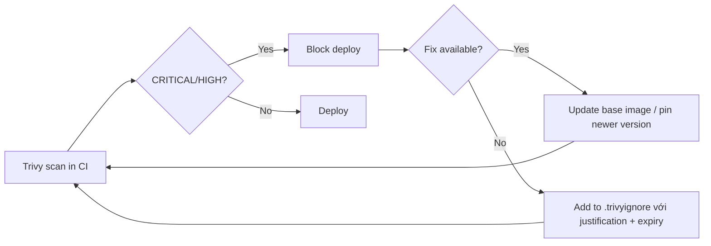

# 🎓 Image Security & Supply Chain — Scan, Sign, Verify

> **Tác giả:** Mr.Rom\
> **Phiên bản:** v1.1.0\
> **Tạo lúc:** 24/05/2026\
> **Cập nhật:** 25/05/2026\
> **Level:** Intermediate\
> **Tags:** [MUST-KNOW]\
> **Thời lượng đọc:** ~22 phút\
> **Prerequisites:** [01_buildkit-and-multistage-advanced.md](01_buildkit-and-multistage-advanced.md)

> 🎯 *Bạn build image nhanh rồi, nhưng image có CVE chưa biết? Build từ source nào? Đã ai tampered chưa? Production 2026 phải có **Trivy scan + SBOM + cosign sign + admission control**. Bài này dạy supply chain security baseline.*

## 🎯 Sau bài này bạn sẽ

- [ ] Hiểu **supply chain attack** — vì sao phải bảo vệ image
- [ ] Scan image bằng **Trivy** (Aqua) + xử lý CRITICAL CVE
- [ ] Generate **SBOM** (Syft) — manifest mọi package trong image
- [ ] Sign image bằng **cosign** (Sigstore) — keyless với GitHub OIDC
- [ ] Verify signature trước khi pull/deploy
- [ ] Pipeline CI/CD đầy đủ: build → scan → sign → push → verify trên K8s
- [ ] Hiểu **SLSA framework** + provenance attestation

---

## Tình huống — Một npm package nuốt toàn bộ AWS credential

Bạn dev frontend Node.js, `npm install` xong, deploy production. Tuần sau, AWS billing email: **$12,000 credit dùng trong 6 giờ** — bitcoin miner running trên EC2 của bạn.

🔥 **Hậu tra**:
- 1 dev dependency tên `event-stream@3.3.6` (sự kiện thật 2018, scale lên ví dụ này) bị maintainer trao quyền cho stranger → stranger inject malicious code vào sub-dependency.
- Code đó scan biến môi trường, gửi AWS key về server attacker.
- `npm install` của bạn → install dep → dep install sub-dep → sub-dep chạy `postinstall` script → exfiltrate credential.
- Bạn không hề biết. Image Docker bạn build chứa code malicious từ phút đầu.

**Đây là supply chain attack** — kẻ tấn công không phải hack server của bạn, mà hack **chuỗi cung ứng phần mềm**:

```
Source code → npm/pip/maven → base image → Dockerfile → Image build → Registry → Pull → Deploy
       ↑              ↑              ↑                       ↑               ↑          ↑
       ↑              ↑              ↑                       ↑               ↑          attacker
       ↑              ↑              ↑                       ↑               attacker
       ↑              ↑              ↑                       attacker
       ↑              ↑              attacker
       ↑              attacker
       attacker
```

Mỗi mũi tên là 1 attack vector. **Bài này dạy bạn phòng thủ 5 layer**:

1. **Base image curation** — chọn image official + maintained.
2. **CVE scan** — Trivy detect vulnerability đã biết.
3. **SBOM** — biết chính xác package nào trong image.
4. **Image signing** — verify image build từ pipeline tin cậy.
5. **Admission control** — K8s reject image không có signature.

---

## 1️⃣ Base image curation — Foundation đầu tiên

🪞 **Ẩn dụ**: *Base image như **nền móng nhà** — bạn xây nhà đẹp cỡ nào, nếu móng nứt (CVE trong base image), nhà vẫn sập. Image security bắt đầu từ chọn supplier đáng tin (Docker Official, Chainguard) thay vì random `joe123/python`.*

### Hierarchy nguồn tin cậy 2026

Image trên Docker Hub có **6 cấp độ tin cậy** — từ Docker Official (high trust, auto-updated) xuống random user image (high risk). Pick **đúng tier** quyết định 80% security posture của image:

| Level | Source | Trust |
|---|---|---|
| 🏆 1 | **Docker Official Images** (DOI) — `python:3.12`, `node:20`, `postgres:16` | High — maintained by community + auto-updated |
| 🥇 2 | **Verified Publisher** — `bitnami/*`, `redis/redis-stack`, vendor official | High — vendor-maintained |
| 🥈 3 | **Sponsored OSS** — Chainguard, distroless | Very high — security-focused |
| 🥉 4 | **Major cloud official** — AWS Public ECR, GCP Marketplace | High |
| ⚠️ 5 | Random `joe123/python` Docker Hub | LOW — không biết ai, có thể typo squat (`pyton` thay `python`) |
| ❌ 6 | Forked image personal, không update 2 năm | Critical risk — CVE tích tụ |

### Pin bằng digest, không tag

Tag mutable là **vector tấn công lớn** — `python:3.12-slim` hôm nay khác ngày mai. Pin bằng **digest SHA256** = immutable forever, build reproducible 100%, chống registry compromise:

```dockerfile
# ❌ Tag mutable — base image có thể đổi
FROM python:3.12-slim

# ✅ Pin bằng digest — immutable forever
FROM python:3.12-slim@sha256:abc123def456...

# Tốt hơn: Chainguard Images (security-hardened)
FROM cgr.dev/chainguard/python:latest@sha256:...
```

**Vì sao pin digest**:
- Tag `python:3.12-slim` hôm nay = sha A, ngày mai có thể = sha B (auto-updated).
- Build hôm nay # build ngày mai → reproducibility vỡ.
- Attacker compromise registry → đổi `python:3.12-slim` thành image malicious → bạn không biết.

Lấy digest:
```bash
docker pull python:3.12-slim
docker inspect python:3.12-slim --format='{{.RepoDigests}}'
# [python@sha256:abc123def456...]
```

---

## 2️⃣ CVE scanning với Trivy

### Trivy là gì?

**Trivy** (Aqua Security, OSS) = vulnerability scanner default 2026.

- Detect CVE trong: OS packages, language packages (pip/npm/maven/go-mod/...), config files, secrets, IaC.
- Source: NVD + GHSA + OSV + vendor advisories.
- Fast: cache DB local, scan 100 MB image ~10s.
- Output: table, JSON, SARIF, SPDX, CycloneDX.

### Install + scan đầu tiên

Trivy cài 1 lệnh trên mọi OS, scan 1 image chỉ ~10s với cached DB. Output table format dễ đọc, có severity ranking + Fixed Version để biết hướng fix:

```bash
# Install (macOS)
brew install aquasecurity/trivy/trivy

# Linux
curl -sfL https://raw.githubusercontent.com/aquasecurity/trivy/main/contrib/install.sh | sh -s -- -b /usr/local/bin

# Scan image
trivy image python:3.12-slim
```

Output (rút gọn):

```
python:3.12-slim (debian 12.5)
==============================
Total: 23 (UNKNOWN: 0, LOW: 8, MEDIUM: 10, HIGH: 4, CRITICAL: 1)

┌──────────────┬─────────────────┬──────────┬─────────────────────┬───────────────┬─────────────────┐
│   Library    │ Vulnerability   │ Severity │ Installed Version   │ Fixed Version │     Title       │
├──────────────┼─────────────────┼──────────┼─────────────────────┼───────────────┼─────────────────┤
│ libssl3      │ CVE-2024-XXXXX  │ CRITICAL │ 3.0.11-1            │ 3.0.13-1      │ openssl: ...    │
│ zlib1g       │ CVE-2024-YYYYY  │ HIGH     │ 1:1.2.13.dfsg-1     │ 1:1.2.13.dfsg-1+ │ zlib: ...    │
└──────────────┴─────────────────┴──────────┴─────────────────────┴───────────────┴─────────────────┘
```

### Severity và policy

5 mức severity CVE — CRITICAL/HIGH luôn block build, MEDIUM cần track, LOW thường ignore (quá nhiều noise). Mỗi tổ chức nên có policy riêng — bảng dưới là baseline:

| Severity | Action mặc định | Custom policy |
|---|---|---|
| CRITICAL | **Fail build** | Always fail |
| HIGH | Fail build (strict) hoặc warn | Fail nếu có fix available, warn nếu không |
| MEDIUM | Warn | Track, fix trong sprint |
| LOW | Info | Ignore (nhiều noise) |
| UNKNOWN | Warn | Triage manually |

### Fail build trên CRITICAL/HIGH

Để Trivy block CI/CD khi gặp CVE nghiêm trọng, dùng `--exit-code 1`. Kèm `--ignore-unfixed` để tránh fail bởi CVE chưa có fix (không actionable):

```bash
trivy image \
  --severity CRITICAL,HIGH \
  --exit-code 1 \
  --ignore-unfixed \
  python:3.12-slim
```

**Flags**:
- `--severity` — chỉ scan severity cụ thể.
- `--exit-code 1` — fail (cho CI).
- `--ignore-unfixed` — bỏ qua CVE chưa có fix (giảm noise).

### Trivy trong CI (GitHub Actions)

```yaml
- name: Build image
  uses: docker/build-push-action@v5
  with:
    context: .
    load: true
    tags: myapp:scan

- name: Trivy scan
  uses: aquasecurity/trivy-action@master
  with:
    image-ref: myapp:scan
    severity: CRITICAL,HIGH
    exit-code: 1
    ignore-unfixed: true
    format: sarif
    output: trivy-results.sarif

- name: Upload SARIF to GitHub Security
  uses: github/codeql-action/upload-sarif@v3
  with:
    sarif_file: trivy-results.sarif
```

→ CVE hiển thị tab **Security** của repo GitHub. Audit-friendly.

### Trivy với `.trivyignore` — exception management

File `.trivyignore`:
```
# CVE-2024-XXXXX không exploitable trong context của app
# (libssl3 nhưng ta không dùng SSL feature liên quan)
CVE-2024-XXXXX

# CVE-2024-YYYYY chỉ ảnh hưởng phía client-side, ta là server
CVE-2024-YYYYY exp:2026-08-31
```

→ Mỗi exception cần **justification** comment + expiry date (force re-review).

### Vulnerability lifecycle workflow



---

## 3️⃣ SBOM — Software Bill of Materials

### Vì sao cần SBOM?

**Log4Shell CVE-2021-44228** (Dec 2021): vulnerability nghiêm trọng trong log4j Java library. Câu hỏi mỗi team CTO hỏi: *"Production của ta dùng log4j không? Phiên bản nào? Image nào chứa?"*

Không có SBOM = phải `docker exec` từng image, run `jar tf | grep log4j` — chậm, không scale.

Có SBOM = `grep log4j sbom.json` → biết ngay image nào ảnh hưởng.

→ SBOM là **danh sách thành phần đầy đủ** của image (tương tự nhãn dinh dưỡng cho thực phẩm).

### Generate SBOM với Syft

```bash
# Install Syft (Anchore)
brew install syft

# Generate SBOM
syft myapp:v1 -o spdx-json > sbom.spdx.json
syft myapp:v1 -o cyclonedx-json > sbom.cyclonedx.json
syft myapp:v1 -o table   # human-readable
```

Output (table):
```
NAME           VERSION   TYPE
fastapi        0.110.0   python
pydantic       2.5.3     python
uvicorn        0.27.0    python
debian-base    12.5      deb
libc6          2.36-9    deb
...
Total: 247 packages
```

### SBOM formats

| Format | Sponsor | Use case |
|---|---|---|
| **SPDX** | Linux Foundation | Legal compliance, license audit |
| **CycloneDX** | OWASP | Security focus, integrated với Trivy |
| **Syft JSON** | Anchore | Native Syft format |

→ **2026 recommend**: generate cả 2 (SPDX + CycloneDX), publish lên registry attachment.

### Attach SBOM to image (cosign)

```bash
# Generate SBOM
syft acme/myapp:v1 -o spdx-json > sbom.spdx.json

# Attach to image (như attachment metadata)
cosign attach sbom --sbom sbom.spdx.json acme/myapp:v1
```

→ Khi ai pull image, fetch SBOM kèm: `cosign download sbom acme/myapp:v1`.

### BuildKit native SBOM generation

```bash
# BuildKit 1.7+ generate SBOM tự động khi build
docker buildx build \
  --sbom=true \
  --provenance=true \
  -t acme/myapp:v1 \
  --push .

# Inspect:
docker buildx imagetools inspect acme/myapp:v1 --format '{{json .SBOM}}'
```

→ **2026 default**: BuildKit attach SBOM + provenance vào manifest list.

---

## 4️⃣ Image signing với cosign (Sigstore)

### Vì sao sign image?

Trivy scan biết image có CVE không. **Cosign sign** biết image **chính xác là image bạn build** — không bị tampered.

**Attack scenario**: attacker compromise registry → push image với same tag nhưng malicious. Bạn pull, deploy → compromised.

**Defense**: bạn sign image lúc build. Trước khi deploy, K8s verify signature. Signature không match = reject.

### Sigstore = Let's Encrypt cho image

**Sigstore** (Linux Foundation, 2021) = ecosystem keyless signing cho artifacts.

- **cosign** — CLI sign/verify.
- **Fulcio** — short-lived cert authority (như Let's Encrypt).
- **Rekor** — transparency log (như CT log của HTTPS).

**Keyless workflow** (recommended 2026):
1. Cosign call Fulcio: "Tôi là `developer@acme.com` (verified qua OIDC)".
2. Fulcio issue cert ngắn hạn (10 phút) cho identity đó.
3. Cosign sign image với cert đó.
4. Signature + cert đẩy lên Rekor (public log).
5. Verify: anyone fetch signature, verify cert chain → biết ai sign, khi nào.

→ Không cần manage private key — identity = OIDC provider (GitHub Actions, GitLab CI, Google, ...).

### Install cosign

```bash
brew install cosign
cosign version
```

### Sign image (keyless, GitHub Actions)

```yaml
- uses: sigstore/cosign-installer@v3

- name: Build + push image
  uses: docker/build-push-action@v5
  id: build
  with:
    context: .
    push: true
    tags: ghcr.io/acme/myapp:${{ github.sha }}

- name: Sign image
  env:
    COSIGN_EXPERIMENTAL: 1  # legacy, remove in newer versions
  run: |
    cosign sign --yes \
      ghcr.io/acme/myapp@${{ steps.build.outputs.digest }}
```

→ Cosign tự động dùng GitHub Actions OIDC token, request cert từ Fulcio, sign, log Rekor. Không cần secret.

### Verify image

```bash
cosign verify \
  --certificate-identity-regexp 'https://github.com/acme/.*' \
  --certificate-oidc-issuer 'https://token.actions.githubusercontent.com' \
  ghcr.io/acme/myapp@sha256:abc...
```

→ Verify:
- Cert chain back to Fulcio root.
- Identity match `acme/*` repo.
- Issuer là GitHub OIDC.
- Signature trong Rekor public log.

Match all → trust. Fail bất kỳ → reject.

### Sign với private key (offline)

Nếu không dùng OIDC (vd CI self-hosted không có OIDC):

```bash
# Generate keypair
cosign generate-key-pair
# Tạo cosign.key (private) + cosign.pub (public)

# Sign
cosign sign --key cosign.key ghcr.io/acme/myapp:v1

# Verify
cosign verify --key cosign.pub ghcr.io/acme/myapp:v1
```

→ Phân phối `cosign.pub` cho verifier (K8s admission controller, deploy script).

---

## 5️⃣ K8s admission control — Reject unsigned image

### Policy enforcement options

| Tool | Sponsor | Cách dùng |
|---|---|---|
| **Kyverno** | Nirmata, CNCF Graduated | YAML policy, dễ |
| **OPA Gatekeeper** | OPA, CNCF | Rego language, flexible |
| **Sigstore Policy Controller** | Sigstore | Cosign-native, integration trực tiếp |

### Kyverno policy ví dụ

```yaml
apiVersion: kyverno.io/v1
kind: ClusterPolicy
metadata:
  name: verify-image-signatures
spec:
  validationFailureAction: enforce  # reject nếu fail
  webhookTimeoutSeconds: 30
  rules:
    - name: verify-acme-images
      match:
        any:
        - resources:
            kinds:
              - Pod
      verifyImages:
        - imageReferences:
            - "ghcr.io/acme/*"
          mutateDigest: true   # convert tag → digest
          verifyDigest: true
          attestors:
            - entries:
              - keyless:
                  subject: "https://github.com/acme/.*"
                  issuer: "https://token.actions.githubusercontent.com"
                  rekor:
                    url: https://rekor.sigstore.dev
```

→ Apply:
```bash
kubectl apply -f kyverno-policy.yaml
```

Test:
```bash
# Unsigned image — REJECTED
kubectl run test --image=nginx:latest
# Error: image nginx:latest is not signed by any trusted authority

# Signed image — OK
kubectl run test --image=ghcr.io/acme/myapp@sha256:abc...
# pod/test created
```

---

## 6️⃣ Full pipeline: Build → Scan → SBOM → Sign → Push

```yaml
# .github/workflows/secure-build.yml
name: Secure Build

on:
  push:
    branches: [main]
    tags: ['v*']

env:
  REGISTRY: ghcr.io
  IMAGE: ${{ github.repository }}

permissions:
  contents: read
  packages: write
  id-token: write    # bắt buộc cho cosign OIDC
  security-events: write  # cho SARIF upload

jobs:
  build:
    runs-on: ubuntu-latest
    outputs:
      digest: ${{ steps.build.outputs.digest }}
    steps:
      - uses: actions/checkout@v4
      - uses: docker/setup-buildx-action@v3
      - uses: docker/login-action@v3
        with:
          registry: ${{ env.REGISTRY }}
          username: ${{ github.actor }}
          password: ${{ secrets.GITHUB_TOKEN }}

      - name: Extract metadata
        id: meta
        uses: docker/metadata-action@v5
        with:
          images: ${{ env.REGISTRY }}/${{ env.IMAGE }}
          tags: |
            type=sha,format=long
            type=semver,pattern={{version}}

      - name: Build + push
        id: build
        uses: docker/build-push-action@v5
        with:
          context: .
          push: true
          tags: ${{ steps.meta.outputs.tags }}
          labels: ${{ steps.meta.outputs.labels }}
          cache-from: type=gha
          cache-to: type=gha,mode=max
          provenance: mode=max
          sbom: true

  scan:
    needs: build
    runs-on: ubuntu-latest
    steps:
      - name: Trivy scan
        uses: aquasecurity/trivy-action@master
        with:
          image-ref: ${{ env.REGISTRY }}/${{ env.IMAGE }}@${{ needs.build.outputs.digest }}
          severity: CRITICAL,HIGH
          exit-code: 1
          ignore-unfixed: true
          format: sarif
          output: trivy.sarif

      - name: Upload SARIF
        uses: github/codeql-action/upload-sarif@v3
        if: always()
        with:
          sarif_file: trivy.sarif

  sign:
    needs: [build, scan]
    runs-on: ubuntu-latest
    steps:
      - uses: sigstore/cosign-installer@v3
      - uses: docker/login-action@v3
        with:
          registry: ${{ env.REGISTRY }}
          username: ${{ github.actor }}
          password: ${{ secrets.GITHUB_TOKEN }}

      - name: Sign image (keyless)
        run: |
          cosign sign --yes \
            ${{ env.REGISTRY }}/${{ env.IMAGE }}@${{ needs.build.outputs.digest }}

      - name: Generate + attach SBOM
        run: |
          docker run --rm anchore/syft:latest \
            ${{ env.REGISTRY }}/${{ env.IMAGE }}@${{ needs.build.outputs.digest }} \
            -o spdx-json > sbom.spdx.json
          cosign attach sbom --sbom sbom.spdx.json \
            ${{ env.REGISTRY }}/${{ env.IMAGE }}@${{ needs.build.outputs.digest }}
          cosign sign --yes --attachment sbom \
            ${{ env.REGISTRY }}/${{ env.IMAGE }}@${{ needs.build.outputs.digest }}
```

→ **Pipeline đầy đủ 2026**: build → scan → sign → attach SBOM → ready to deploy.

---

## 7️⃣ SLSA framework — Supply chain levels

**SLSA** (Supply-chain Levels for Software Artifacts) — Google + OpenSSF framework đánh giá maturity supply chain.

| Level | Yêu cầu | Đạt bằng |
|---|---|---|
| **SLSA 0** | Không có | Build trên laptop, push thủ công |
| **SLSA 1** | Build script + provenance | GitHub Actions với `provenance: true` |
| **SLSA 2** | Hosted build + signed provenance | BuildKit attestation + cosign sign |
| **SLSA 3** | Hardened build + non-falsifiable provenance | Reusable workflow + GitHub OIDC |
| **SLSA 4** | Two-party review + reproducible build | Fully audited pipeline + hermetic build |

→ **Realistic 2026**: aim SLSA 2-3 cho production. Level 4 cho compliance heavy (banking, defense).

### Provenance attestation

```bash
# BuildKit attach provenance khi build
docker buildx build --provenance=mode=max -t acme/myapp:v1 --push .

# Inspect provenance
cosign download attestation acme/myapp@sha256:... | jq

# Output (simplified):
{
  "builder": "https://github.com/actions/runner-images",
  "buildType": "https://docs.docker.com/build/buildkit/",
  "invocation": {
    "configSource": "git@github.com:acme/myapp@<sha>",
    "parameters": { ... }
  },
  "materials": [
    { "uri": "git+https://github.com/acme/myapp", "digest": { "sha1": "<sha>" } }
  ]
}
```

→ Tell: "image này build từ Git commit X bằng workflow Y trên runner Z".

---

## 💡 Pitfall & Best practice

### ❌ Pitfall: Trivy scan local nhưng không scan trong CI

```bash
# Dev scan local
trivy image myapp:v1   # 0 CVE

# Push lên prod → CI không scan → image CVE nào slip vào lúc nào không biết
```

→ **Fix**: Trivy scan PHẢI trong CI pipeline, gate by `--exit-code 1`.

### ❌ Pitfall: `--ignore-unfixed` mà không justify

```bash
trivy image --ignore-unfixed myapp:v1
```

→ Bạn bỏ qua CVE chưa có fix. Nhưng nếu CVE đó **đang exploit in the wild** thì sao? Cần track + workaround (network policy, WAF, ...).

→ **Fix**: `.trivyignore` với expiry date + comment justification. Review hằng tháng.

### ❌ Pitfall: Sign tag, không sign digest

```bash
# ❌ Sign tag
cosign sign acme/myapp:v1
```

→ Tag `v1` có thể repoint sang image khác — signature không bảo vệ.

→ **Fix**: Sign DIGEST:
```bash
cosign sign acme/myapp@sha256:abc...
```

### ❌ Pitfall: Verify với regex quá lỏng

```yaml
# ❌
attestors:
  - keyless:
      subject: ".*"  # ai cũng được!
```

→ Fix: identity match cụ thể `https://github.com/acme/.*` và issuer chính xác `https://token.actions.githubusercontent.com`.

### ❌ Pitfall: SBOM generated nhưng không attach hoặc store

→ SBOM trong CI artifact 90 ngày → CVE Log4Shell phát hiện 1 năm sau → SBOM mất rồi.

→ **Fix**: Attach SBOM vào image (registry artifact), giữ lâu dài.

### ✅ Best practice: Daily re-scan production images

```yaml
# .github/workflows/daily-scan.yml
on:
  schedule:
    - cron: '0 2 * * *'  # 2am UTC daily

jobs:
  scan:
    runs-on: ubuntu-latest
    steps:
      - name: Scan all production images
        run: |
          for img in $(cat production-images.txt); do
            trivy image --severity CRITICAL,HIGH "$img" || \
              gh issue create --title "CVE found in $img"
          done
```

→ CVE database update mỗi ngày. Image build 6 tháng trước có thể có CVE mới hôm nay.

### ✅ Best practice: Image promotion với re-signing

```
build → scan → sign (dev) → promote to staging → re-sign (staging) → promote to prod → re-sign (prod)
```

→ Mỗi env có signature riêng → biết image đã qua gate nào.

### ✅ Best practice: Distroless / Chainguard cho production

```dockerfile
# Thay
FROM python:3.12-slim
# 200 CVE LOW, 10 MEDIUM, 1 HIGH

# Bằng
FROM cgr.dev/chainguard/python:latest
# 0-2 CVE, security-hardened, auto-updated
```

→ Bài 03 đi sâu distroless.

---

## 🧠 Self-check

**Q1.** Tại sao **`--ignore-unfixed`** giảm noise nhưng tăng rủi ro?

<details>
<summary>💡 Đáp án</summary>

`--ignore-unfixed` bỏ qua CVE không có fix version available. Lợi: scan output sạch hơn, không bị blocked bởi CVE bạn không thể fix.

Rủi ro: nếu CVE đó **đang exploit active in the wild** (zero-day), bạn không thấy alert. Ví dụ Log4Shell tháng 12/2021: 1-2 ngày đầu chưa có patch, dùng `--ignore-unfixed` = không thấy nó.

**Mitigation**: track unfixed CVE riêng (CVE alert email, GitHub Dependabot), apply workaround (network policy block exploit traffic, WAF rule), re-scan ngay khi patch ra.
</details>

**Q2.** Cosign keyless workflow không có private key — vậy sign integrity dựa vào gì?

<details>
<summary>💡 Đáp án</summary>

Dựa vào **identity (OIDC) + transparency log (Rekor)**:

1. Bạn (qua GitHub Actions) authenticate với Fulcio CA bằng OIDC token.
2. Fulcio issue cert ngắn hạn (10 phút) gắn với identity của bạn (`developer@acme.com` hoặc `github.com/acme/myapp/.github/workflows/build.yml@refs/tags/v1`).
3. Bạn sign image bằng cert → signature + cert đẩy lên Rekor public log.
4. Verifier check:
   - Cert chain back to Fulcio root (Sigstore trust).
   - Identity match expected (`https://github.com/acme/.*`).
   - Signature exists trong Rekor log (proof of existence at time T).

Nếu attacker compromise GitHub account của bạn, họ có thể sign image — nhưng **Rekor log** ghi rõ identity + time, có audit trail. Pattern detection: identity bất thường, repo bất thường → alert.

→ Keyless = trust shifted từ "secret private key" sang "identity provider (OIDC) + transparency log".
</details>

**Q3.** SBOM cho image build tháng trước có còn đúng không?

<details>
<summary>💡 Đáp án</summary>

**SBOM là snapshot tại build time** — đúng cho image tag/digest đó forever. Image không thay đổi → SBOM không đổi.

Nhưng **vulnerability landscape thay đổi**: CVE mới phát hiện trong package cũ. SBOM tháng trước nói "có log4j 2.14" — tháng này CVE Log4Shell ra → SBOM vẫn đúng (vẫn log4j 2.14), nhưng giờ biết package đó vulnerable.

→ SBOM stable, **scan thì phải re-run định kỳ** (daily) với CVE DB mới.
</details>

**Q4.** Tại sao Kyverno policy nên `mutateDigest: true`?

<details>
<summary>💡 Đáp án</summary>

`mutateDigest: true` convert tag → digest TRƯỚC khi verify signature.

Lý do: nếu bạn deploy với tag `ghcr.io/acme/myapp:v1`, Kyverno verify signature của tag đó. Nhưng tag mutable — attacker compromise registry có thể đổi tag trỏ image khác sau khi verify.

Với `mutateDigest: true`, Kyverno:
1. Resolve `v1` → `sha256:abc...` (current).
2. Mutate Pod spec image thành `ghcr.io/acme/myapp@sha256:abc...`.
3. Verify signature trên digest.
4. K8s deploy với digest → immutable.

→ Race condition closed. Image deployed = image verified.
</details>

**Q5.** SLSA Level 3 yêu cầu "non-falsifiable provenance" — nghĩa là gì?

<details>
<summary>💡 Đáp án</summary>

Provenance attestation phải:
1. **Generated by builder, không phải user** — user không thể fake "tôi build từ commit X". GitHub Actions runner viết provenance trực tiếp.
2. **Signed bởi builder identity** — không user signature mà builder service signature (GitHub).
3. **Build env hardened** — runner không cho user inject code arbitrary vào build phase (vd reusable workflow của GitHub Actions với input restriction).
4. **Build params trong attestation** — toàn bộ config build ghi lại (Dockerfile content hash, build args, base image digest).

→ Verifier biết chính xác **image này build trong environment X với input Y ở time T** — không thể fake.

Level 2 mọi sign-by-user là falsifiable (user có thể nói dối về source). Level 3 builder service sign — hard to falsify.
</details>

---

## ⚡ Cheatsheet

```bash
# === Trivy ===
trivy image <image>                             # scan
trivy image --severity CRITICAL,HIGH <image>    # specific severity
trivy image --exit-code 1 --ignore-unfixed <image>  # CI gate
trivy image --format sarif -o results.sarif <image>  # SARIF
trivy image --download-db-only                  # update DB only
trivy fs ./                                      # scan filesystem (deps)
trivy config ./                                  # scan IaC config (Terraform/K8s YAML)

# === Syft (SBOM) ===
syft <image>                                    # table
syft <image> -o spdx-json > sbom.json           # SPDX JSON
syft <image> -o cyclonedx-json > sbom.cdx.json  # CycloneDX

# === cosign ===
# Keyless (OIDC)
cosign sign <image>@sha256:...
cosign verify --certificate-identity-regexp '...' --certificate-oidc-issuer '...' <image>@sha256:...

# Key-based
cosign generate-key-pair
cosign sign --key cosign.key <image>
cosign verify --key cosign.pub <image>

# Attestations
cosign attach sbom --sbom sbom.json <image>
cosign download sbom <image>
cosign download attestation <image>

# === BuildKit native attestations ===
docker buildx build \
  --provenance=mode=max \
  --sbom=true \
  -t <image> --push .

# === K8s policy ===
kubectl apply -f kyverno-policy.yaml
kubectl get clusterpolicy
kubectl describe clusterpolicy verify-image-signatures
```

---

## 📚 Glossary

| Term | Vietnamese / Explanation |
|---|---|
| **CVE** | Common Vulnerabilities and Exposures — định danh lỗ hổng (CVE-2024-XXXXX) |
| **Supply chain attack** | Tấn công vào nguồn cung cấp phần mềm (npm/pip package, base image, build pipeline) |
| **SBOM** | Software Bill of Materials — manifest mọi component trong image (SPDX/CycloneDX format) |
| **Sigstore** | OSS ecosystem keyless signing (Fulcio + Rekor + cosign) |
| **Fulcio** | CA issue cert ngắn hạn cho identity OIDC |
| **Rekor** | Transparency log — append-only public log của signatures |
| **cosign** | CLI sign/verify image (Sigstore project) |
| **Provenance** | Attestation metadata: builder, source, build params (in-toto/SLSA format) |
| **SLSA** | Supply-chain Levels for Software Artifacts (Google + OpenSSF framework) |
| **Keyless** | Sign workflow không có private key persistent (dùng OIDC + short-lived cert) |
| **Attestation** | Statement signed về subject (claim "image này build từ source X bởi builder Y") |
| **Admission controller** | K8s webhook validate/mutate request trước khi persist (Kyverno, Gatekeeper) |
| **Image promotion** | Workflow di chuyển image qua môi trường (dev → staging → prod) với re-signing |
| **Vulnerability triage** | Process classify CVE: exploit-able? false positive? deferred? |

---

## 🔗 Liên kết & Tài nguyên

### Trong cluster
- ↶ Trước: [01_buildkit-and-multistage-advanced.md](01_buildkit-and-multistage-advanced.md)
- → Tiếp: [03_optimization-and-distroless.md](03_optimization-and-distroless.md) *(sắp viết)*
- ↑ Cluster: [Docker README](../../README.md)

### Cross-reference
- 🔁 [CI/CD Pipeline patterns](../../../ci-cd/lessons/01_basic/03_pipeline-patterns.md) — security scan gate
- ☸️ [K8s RBAC](../../../kubernetes/lessons/01_basic/04_namespaces-and-rbac.md) — admission control context
- 🏗️ [IaC best practices](../../../iac/lessons/01_basic/04_best-practices-and-alternatives.md) — tfsec/checkov context

### Tài nguyên ngoài
- 📖 [Trivy docs](https://aquasecurity.github.io/trivy/)
- 📖 [Syft GitHub](https://github.com/anchore/syft)
- 📖 [cosign docs](https://docs.sigstore.dev/cosign/overview/)
- 📖 [Sigstore docs](https://docs.sigstore.dev/)
- 📖 [SLSA framework](https://slsa.dev/)
- 📖 [Kyverno policies](https://kyverno.io/policies/)
- 📖 [OWASP CycloneDX](https://cyclonedx.org/)
- 📖 [SPDX spec](https://spdx.dev/)
- 📖 [OpenSSF Best Practices](https://www.bestpractices.dev/)
- 📖 [GitHub: Securing the software supply chain](https://github.blog/2022-04-07-slsa-3-compliance-with-github-actions/)

---

## 📌 Changelog

- **v1.1.0 (25/05/2026)** — Apply Blueprint v0.5.4+ §3.6: thêm lead-in trước Hierarchy tier base image + Pin digest + Trivy install + Severity policy + Fail build CI.

- **v1.0.0 (24/05/2026)** — Bản đầu tiên. Lesson 02 của intermediate. 5 layer defense: base image curation + Trivy scan + Syft SBOM + cosign keyless signing + Kyverno admission control. Full CI pipeline build→scan→sign. SLSA framework + provenance. 7 pitfall + 3 best practice + 5 self-check + cheatsheet đầy đủ.
