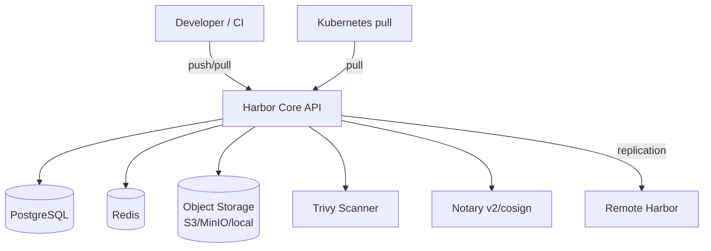

# 🎓 Registry & Production Patterns — Harbor, ECR, pull-through cache

> **Tác giả:** Mr.Rom\
> **Phiên bản:** v1.1.0\
> **Tạo lúc:** 24/05/2026\
> **Cập nhật:** 25/05/2026\
> **Level:** Intermediate\
> **Tags:** [MUST-KNOW]\
> **Thời lượng đọc:** ~22 phút\
> **Prerequisites:** [03_optimization-and-distroless.md](03_optimization-and-distroless.md)

> 🎯 *Bạn build + scan + sign image rồi — giờ lưu ở đâu? Docker Hub free rate-limit 100 pull/6h, scale 100 pod = block sau 1 giờ. Bài này dạy: chọn **private registry** (Harbor/ECR/GHCR), setup **pull-through cache**, **tag policy** immutable, **garbage collection**, **replication** cross-region. Bài cuối cluster intermediate.*

## 🎯 Sau bài này bạn sẽ

- [ ] So sánh **registry options** 2026: Harbor / ECR / GCR / GHCR / Artifactory
- [ ] Setup **Harbor** self-host hoặc dùng **ECR**
- [ ] Cấu hình **pull-through cache** cho Docker Hub upstream
- [ ] Đặt **tag policy**: immutable digest, semver, env-suffix
- [ ] Triển khai **garbage collection** + retention policy
- [ ] Cấu hình **replication** cross-region/cross-cloud
- [ ] Manage **pull secret + token rotation** trong K8s
- [ ] Hiểu **registry storage backend** + cost optimization

---

## Tình huống — Docker Hub rate-limit + downtime

Friday 5pm, deploy production:
```
kubectl rollout restart deployment/fastapi
```

Pod restart → pull image `python:3.12-slim` từ Docker Hub:
```
Failed to pull image "python:3.12-slim": rpc error: code = Unknown
desc = toomanyrequests: You have reached your pull rate limit.
You may increase the limit by authenticating and upgrading.
```

🔥 **Docker Hub anonymous limit**: 100 pull/6h per IP. Cluster có 50 node, mỗi pod restart pull base image → 6h reach limit.

Vài giờ sau, Docker Hub ngắn ngủi **down** (Cloudflare incident):
```
ImagePullBackOff: Failed to pull image: connection refused
```

Toàn cluster không deploy được.

Sếp: *"Production phụ thuộc Docker Hub là không acceptable. Setup pull-through cache + private registry với replication. Chiều thứ Hai đi học bài Registry."*

→ Bài này dạy hết.

---

## 1️⃣ Registry options 2026 — Decision matrix

🪞 **Ẩn dụ**: *Registry như **kho phân phối phần mềm** — Docker Hub là **kho công cộng đông đúc, rate limit** (free quota nhỏ). Harbor private là **kho riêng kiểm soát** (audit, replicate). Pull-through cache như **kho trung chuyển sát data center bạn** (cache image gần, tránh rate limit upstream).*

| Registry | Type | Pros | Cons | Khi dùng |
|---|---|---|---|---|
| **Docker Hub** | SaaS public | Default, popular | Rate limit nghiêm, không control | Personal/OSS public images |
| **GHCR** (ghcr.io) | SaaS, miễn phí cho GitHub | Free private cho repo, OIDC native | Tied to GitHub | Github-based workflow |
| **AWS ECR** | SaaS (AWS) | IAM integration, cross-region replication | Vendor lock-in AWS | Production AWS |
| **GCP GCR / Artifact Registry** | SaaS (GCP) | IAM, integrate K8s GKE | Vendor lock-in GCP | Production GCP |
| **Azure ACR** | SaaS (Azure) | IAM, AKS integration | Vendor lock-in Azure | Production Azure |
| **Harbor** | Self-host (CNCF Graduated) | OSS, full control, vuln scan built-in, replication | Operate yourself | Self-host + on-prem |
| **JFrog Artifactory** | Commercial | Universal registry (Docker + Maven + npm + ...) | $$$, complex | Enterprise multi-package |
| **Quay** (Red Hat) | SaaS / self-host | Robot account, security scan | Less popular | Red Hat / OpenShift |
| **Nexus** (Sonatype) | Self-host (free OSS edition) | Multi-format | UI cũ | Lightweight self-host |

### Cost reality 2026 (estimate)

Cost registry biến động lớn — từ free (Docker Hub free, GHCR) đến $5,000+/year (Artifactory enterprise). Pick theo scale + cloud provider hiện có. Bảng giá thực tế 2026:

| Registry | Plan | Cost | Suitable for |
|---|---|---|---|
| Docker Hub free | Anonymous 100/6h | $0 | Demo/learning |
| Docker Hub Pro | 5,000 pull/day | $7/month | Small team |
| Docker Hub Team | Unlimited pulls + private repos | $11/user/month | Small startup |
| GHCR | Free for GitHub Actions + private | $0 (within GH plan) | GitHub workflow |
| AWS ECR | Storage $0.10/GB/month + egress $0.09/GB | $50-500/month | Production AWS |
| Harbor self-host | EKS/EC2 ~$200-1000/month | Variable | Self-host + control |
| Artifactory | Custom | $5,000+/year | Enterprise |

→ **Recommend starter** 2026:
- **Personal/OSS**: Docker Hub free + GHCR.
- **Startup**: GHCR (nếu GitHub) hoặc ECR (nếu AWS).
- **Self-host**: Harbor — CNCF, free, production-grade.
- **Enterprise multi-package**: Artifactory.

---

## 2️⃣ Setup Harbor (self-host CNCF registry)

### Architecture

Harbor gồm **6 component** chạy trong K8s — Core API (REST + UI), Postgres (metadata), Redis (queue), object storage (blob), Trivy (scan built-in), Notary v2/cosign (signing). Diagram đầy đủ:



**Components**:
- **Core API**: REST API + Web UI.
- **PostgreSQL**: metadata (repos, users, policies).
- **Redis**: session + job queue.
- **Storage backend**: S3/MinIO/local — image blob layers.
- **Trivy** (built-in): scan image on push.
- **Replication controller**: sync image sang remote registry.

### Install Harbor với Helm

Harbor deploy qua Helm chart official 1 lệnh. Cần customize `values.yaml` cho ingress + persistent storage + Trivy. Đây là production-grade setup minimum:

```bash
helm repo add harbor https://helm.goharbor.io
helm repo update

# values.yaml
cat > harbor-values.yaml <<'EOF'
expose:
  type: ingress
  tls:
    enabled: true
  ingress:
    hosts:
      core: harbor.acmeshop.vn
      
externalURL: https://harbor.acmeshop.vn

persistence:
  enabled: true
  persistentVolumeClaim:
    registry:
      size: 100Gi
    database:
      size: 10Gi

harborAdminPassword: "Harbor12345"   # CHANGE in production!

trivy:
  enabled: true
EOF

helm install harbor harbor/harbor -n harbor --create-namespace -f harbor-values.yaml
```

### Configure project + push image

1. **Browse Harbor UI**: `https://harbor.acmeshop.vn`
2. **Login**: `admin` / `Harbor12345`
3. **Create project**: `acme` (public hoặc private)
4. **Push image**:

```bash
# Login
docker login harbor.acmeshop.vn

# Tag image
docker tag myapp:v1 harbor.acmeshop.vn/acme/myapp:v1

# Push
docker push harbor.acmeshop.vn/acme/myapp:v1
```

5. **UI hiển thị**:
   - Image list + tags + size + push time.
   - Trivy scan results (auto-triggered).
   - Replication status.
   - Quota usage.

### Harbor features quan trọng

Harbor có **7 feature production-grade** không có ở Docker Hub — built-in scan, tag immutability, retention policy, replication, robot account, allowlist, quota. Đây là lý do enterprise self-host Harbor:

- **Built-in Trivy scan**: trigger on push or schedule daily.
- **Tag immutability**: set tag không cho overwrite.
- **Retention policy**: keep N most-recent tags, delete others.
- **Replication**: sync to/from Docker Hub, ECR, GCR, ACR.
- **Robot accounts**: token cho CI/CD (không phải user account).
- **Vulnerability allowlist**: bypass specific CVE.
- **Project quotas**: max storage per project.

---

## 3️⃣ AWS ECR — Cloud-native option

### Setup

ECR là cloud-native option của AWS — không phải install gì, chỉ tạo repo qua AWS CLI. IAM tích hợp sẵn, EKS pull tự dùng instance role. Setup 1 command:

```bash
# Create repo
aws ecr create-repository \
  --repository-name acme/myapp \
  --image-scanning-configuration scanOnPush=true \
  --image-tag-mutability IMMUTABLE \
  --region us-east-1

# Authenticate Docker
aws ecr get-login-password --region us-east-1 | \
  docker login --username AWS --password-stdin \
  123456789012.dkr.ecr.us-east-1.amazonaws.com

# Push
docker tag myapp:v1 123456789012.dkr.ecr.us-east-1.amazonaws.com/acme/myapp:v1
docker push 123456789012.dkr.ecr.us-east-1.amazonaws.com/acme/myapp:v1
```

### ECR features

- **Image scanning** (basic free, enhanced với Inspector $).
- **Lifecycle policy** — auto-delete old images.
- **Cross-region replication** built-in.
- **IAM integration** — fine-grained access control.
- **Pull-through cache** (xem §4).

### Lifecycle policy example

```json
{
  "rules": [
    {
      "rulePriority": 1,
      "description": "Keep last 30 tagged images",
      "selection": {
        "tagStatus": "tagged",
        "tagPatternList": ["v*"],
        "countType": "imageCountMoreThan",
        "countNumber": 30
      },
      "action": { "type": "expire" }
    },
    {
      "rulePriority": 2,
      "description": "Delete untagged images after 7 days",
      "selection": {
        "tagStatus": "untagged",
        "countType": "sinceImagePushed",
        "countUnit": "days",
        "countNumber": 7
      },
      "action": { "type": "expire" }
    }
  ]
}
```

Apply:
```bash
aws ecr put-lifecycle-policy \
  --repository-name acme/myapp \
  --lifecycle-policy-text file://policy.json
```

---

## 4️⃣ Pull-through cache — Bảo vệ khỏi Docker Hub rate limit

### Vấn đề rate limit

Cluster 50 node × 100 pod × pull `python:3.12-slim` từ Docker Hub = 5,000 pulls/giờ → rate limit reach trong vài giờ.

### Giải pháp pull-through cache

Setup local registry **proxy** Docker Hub. Pull request:
1. Cluster → local registry.
2. Local registry check cache: có image → trả về (fast, no Docker Hub call).
3. Không có → local registry pull từ Docker Hub (1 lần), cache, trả về.

→ Mỗi base image pull từ Docker Hub **1 lần thay vì 5000 lần**.

### Setup với ECR pull-through cache (AWS)

```bash
aws ecr create-pull-through-cache-rule \
  --ecr-repository-prefix dockerhub \
  --upstream-registry-url registry-1.docker.io \
  --region us-east-1
```

Sau đó pull qua ECR:
```dockerfile
# Thay
FROM python:3.12-slim

# Bằng
FROM 123456789012.dkr.ecr.us-east-1.amazonaws.com/dockerhub/library/python:3.12-slim
```

→ ECR fetch từ Docker Hub lần đầu, cache, các pull sau từ ECR (cùng region, nhanh + miễn rate limit).

### Setup với Harbor proxy cache

UI Harbor:
1. **Registries** → New endpoint → `https://registry-1.docker.io` (Docker Hub).
2. **Projects** → New project → type **Proxy Cache** → endpoint vừa tạo.
3. Pull qua Harbor:
   ```dockerfile
   FROM harbor.acmeshop.vn/dockerhub-proxy/library/python:3.12-slim
   ```

### Setup với Docker registry standalone

```yaml
# docker-compose.yml
services:
  cache:
    image: registry:2.8
    ports: ["5000:5000"]
    environment:
      REGISTRY_PROXY_REMOTEURL: https://registry-1.docker.io
      REGISTRY_PROXY_USERNAME: <dockerhub-username>
      REGISTRY_PROXY_PASSWORD: <dockerhub-password>
    volumes:
      - cache-data:/var/lib/registry
volumes:
  cache-data:
```

```bash
docker compose up -d

# Now pull through cache
docker pull localhost:5000/library/python:3.12-slim
```

### Configure containerd (K8s) to use cache transparently

```toml
# /etc/containerd/config.toml
[plugins."io.containerd.grpc.v1.cri".registry.mirrors."docker.io"]
  endpoint = ["https://cache.acmeshop.vn", "https://registry-1.docker.io"]
```

→ Tất cả `FROM python:3.12-slim` tự động pull qua cache, không sửa Dockerfile.

---

## 5️⃣ Tag policy — Immutable + semver + env-suffix

### Anti-pattern: `latest` tag

```bash
docker push acme/myapp:latest
```

❌ `latest` mutable — không biết version nào đang deploy:
- Pod restart sau 1 tuần pull `latest` → image khác hôm trước.
- Rollback khó: revert đến `latest` trước = không biết tag gì.

### Pattern 1: Semver tag (releases)

```bash
# Release v1.2.3
docker push acme/myapp:1.2.3
docker push acme/myapp:1.2     # latest patch của 1.2
docker push acme/myapp:1       # latest minor của 1
```

### Pattern 2: Git SHA tag (every commit)

```bash
docker push acme/myapp:abc123def4567890
docker push acme/myapp:abc123d   # short SHA
```

→ 1-1 mapping tag ↔ commit. Reproducible.

### Pattern 3: Env-suffix (environment promotion)

```bash
docker push acme/myapp:1.2.3-staging
docker push acme/myapp:1.2.3-prod
```

→ Same image content, signed riêng cho mỗi env (xem bài 02).

### Pattern 4: Digest reference (always)

```yaml
# K8s manifest
spec:
  containers:
    - image: acme/myapp@sha256:abc123def456...   # ← digest, không tag
```

→ Immutable. Tag có thể mất, digest forever.

### Best practice 2026

```yaml
# CI/CD step 1: Push multiple tags
docker buildx imagetools create \
  --tag acme/myapp:1.2.3 \
  --tag acme/myapp:1.2 \
  --tag acme/myapp:latest \
  --tag acme/myapp:sha-abc123d \
  acme/myapp@sha256:abc...

# CI/CD step 2: K8s deploy bằng DIGEST
kubectl set image deployment/myapp \
  myapp=acme/myapp@sha256:abc...
```

→ Tag để **human discovery** (`docker pull acme/myapp:1.2.3`). Digest để **production deploy** (immutable).

### Enforce immutable trong Harbor

UI Harbor:
1. **Project → Configuration → Tag Immutability**.
2. Rule: `tag pattern v*` + `repo pattern acme/*` → **immutable**.

→ Push `acme/myapp:v1.2.3` lần thứ 2 → REJECTED.

### Enforce immutable trong ECR

```bash
aws ecr put-image-tag-mutability \
  --repository-name acme/myapp \
  --image-tag-mutability IMMUTABLE
```

---

## 6️⃣ Garbage collection + retention

### Untagged images tích tụ

Mỗi push tag mới → tag cũ untagged (nếu point đến digest mới). Layer của image cũ vẫn ở storage.

→ Storage phình to. ECR/Harbor cần GC.

### Harbor retention policy

UI Harbor → Project → Policy → Tag retention:
```
Keep:
  - Most recently pulled: 10 tags
  - Most recently pushed: 5 tags
  - Match tag pattern: v*

Delete:
  - All other tags
  
Schedule: Daily at 2am
```

### Harbor garbage collection

UI Harbor → Configuration → System → Garbage Collection:
```
Run: Weekly
Mode: Delete untagged blobs older than 7 days
```

→ Free disk space.

### ECR lifecycle (xem §3 example)

→ Auto-delete based on rules.

---

## 7️⃣ Replication — Cross-region/Cross-cloud

### Vì sao replication?

- **Disaster recovery**: primary registry down → secondary takes over.
- **Latency**: cluster ở EU pull image ở US-East = slow. Replicate sang EU.
- **Compliance**: data residency (GDPR — data EU phải stay EU).
- **Cost**: egress giữa region/cloud — pull local thay vì cross-region.

### Harbor replication

UI Harbor:
1. **Registries** → endpoint cho remote (ECR/GCR/another Harbor).
2. **Replications** → new rule:
   - Source: project `acme/*` tag `v*`.
   - Destination: remote endpoint.
   - Mode: push-based hoặc pull-based.
   - Trigger: event (on-push), scheduled, manual.

### ECR cross-region replication

```bash
aws ecr put-replication-configuration \
  --replication-configuration '{
    "rules": [
      {
        "destinations": [
          { "region": "us-west-2", "registryId": "123456789012" }
        ],
        "repositoryFilters": [
          { "filter": "acme/*", "filterType": "PREFIX_MATCH" }
        ]
      }
    ]
  }'
```

→ Push image us-east-1 → auto-replicate us-west-2.

---

## 8️⃣ Pull secret + Token rotation trong K8s

### Pull secret creation

Image private → K8s cần credential pull:

```bash
kubectl create secret docker-registry harbor-creds \
  --docker-server=harbor.acmeshop.vn \
  --docker-username=robot$acme+ci \
  --docker-password=$ROBOT_TOKEN \
  --namespace=production
```

Reference trong Pod:
```yaml
apiVersion: v1
kind: Pod
metadata:
  name: myapp
spec:
  imagePullSecrets:
    - name: harbor-creds
  containers:
    - name: app
      image: harbor.acmeshop.vn/acme/myapp@sha256:abc...
```

### Anti-pattern: Long-lived token in K8s

Robot token static = nếu leak (kubectl logs xuất secret accident, etc.) attacker pull mọi image private cho đến khi rotate.

### Best practice: Token rotation

Option 1: **External Secrets Operator** với Vault/AWS Secrets Manager:
```yaml
apiVersion: external-secrets.io/v1beta1
kind: ExternalSecret
metadata:
  name: harbor-creds
spec:
  refreshInterval: 1h    # rotate every hour
  secretStoreRef:
    name: vault-backend
  target:
    name: harbor-creds
    template:
      type: kubernetes.io/dockerconfigjson
      data:
        .dockerconfigjson: |
          {
            "auths": {
              "harbor.acmeshop.vn": {
                "username": "{{ .username }}",
                "password": "{{ .password }}"
              }
            }
          }
  data:
    - secretKey: username
      remoteRef: { key: harbor/ci, property: username }
    - secretKey: password
      remoteRef: { key: harbor/ci, property: password }
```

Option 2: **IRSA (IAM Roles for Service Accounts)** trên ECR:
```yaml
apiVersion: v1
kind: ServiceAccount
metadata:
  name: app-sa
  annotations:
    eks.amazonaws.com/role-arn: arn:aws:iam::123456789012:role/ecr-pull-role
```

→ Không cần secret. K8s/AWS trade token tự động.

---

## 9️⃣ Hands-on: Setup Harbor + pull-through + replicate

### Step 1: Deploy Harbor (Helm)

(Xem §2 install — assume xong)

### Step 2: Tạo robot account cho CI

UI Harbor → Project `acme` → Robot Accounts → New:
```
Name: ci
Expiration: 30 days
Permissions:
  - Repository: Push, Pull
  - Artifact: Read, Create, Delete
```

→ Copy token.

### Step 3: GitHub Actions push image lên Harbor

```yaml
- uses: docker/login-action@v3
  with:
    registry: harbor.acmeshop.vn
    username: robot$acme+ci
    password: ${{ secrets.HARBOR_TOKEN }}

- uses: docker/build-push-action@v5
  with:
    context: .
    push: true
    tags: |
      harbor.acmeshop.vn/acme/myapp:${{ github.sha }}
      harbor.acmeshop.vn/acme/myapp:v1.2.3
    platforms: linux/amd64,linux/arm64
```

### Step 4: Setup pull-through cache cho Docker Hub

UI Harbor → Registries → New Endpoint:
- Name: `dockerhub-upstream`
- URL: `https://registry-1.docker.io`

Projects → New project → name: `dockerhub-cache` → type: **Proxy Cache** → endpoint: `dockerhub-upstream`.

Sửa Dockerfile:
```dockerfile
# Thay
FROM python:3.12-slim

# Bằng
FROM harbor.acmeshop.vn/dockerhub-cache/library/python:3.12-slim
```

### Step 5: Replication sang DR registry

UI Harbor → Registries → endpoint cho ECR DR region.

Replications → New rule:
- Source: `acme/*` tag `v*`
- Destination: ECR endpoint
- Trigger: Event-based (on-push)

→ Push `harbor.acmeshop.vn/acme/myapp:v1.2.3` → auto-replicate `ecr.us-west-2.../acme/myapp:v1.2.3`.

### Step 6: K8s pull với immutable digest

```yaml
apiVersion: apps/v1
kind: Deployment
metadata:
  name: myapp
spec:
  template:
    spec:
      imagePullSecrets:
        - name: harbor-creds
      containers:
        - name: app
          image: harbor.acmeshop.vn/acme/myapp@sha256:abc123def...   # ← digest
```

→ Production deploy với digest, không tag. Immutable forever.

---

## 💡 Pitfall & Best practice

### ❌ Pitfall: Push `latest` tag thường xuyên

```bash
docker push acme/myapp:latest   # mỗi build
```

→ Mất reproducibility. Pod restart pull `latest` = image khác.

→ **Fix**: Push immutable tag (semver, git SHA) + dùng digest trong deploy.

### ❌ Pitfall: ImagePullPolicy `Always` với mutable tag

```yaml
image: acme/myapp:latest
imagePullPolicy: Always   # ← pull mỗi pod start
```

→ Mỗi pod restart pull → traffic + rate limit. Performance cold start.

→ **Fix**: Dùng digest + `imagePullPolicy: IfNotPresent`:
```yaml
image: acme/myapp@sha256:abc...
imagePullPolicy: IfNotPresent
```

### ❌ Pitfall: Robot token expiry không monitor

→ Token expire 30 ngày → 30 ngày sau CI build fail đột ngột Friday 6pm.

→ **Fix**: 
- Set expiry calendar reminder.
- Use Vault/Secrets Manager rotation.
- Monitor token age (Harbor API).

### ❌ Pitfall: GC chạy khi cluster đang pull active

→ GC delete blob đang reference → next pull failed mid-way.

→ **Fix**: Schedule GC off-hours (2-4am). Pause CI during GC window.

### ❌ Pitfall: Replication không filter — sync mọi image dev

→ Dev branch image (`feat-xxx-*`) sync sang DR registry → tốn storage + bandwidth.

→ **Fix**: Filter chỉ tag production `v*`:
```yaml
filters:
  - type: tag
    value: "v*"
```

### ❌ Pitfall: Harbor TLS self-signed cert + K8s không trust

```
x509: certificate signed by unknown authority
```

→ K8s node containerd không trust self-signed cert.

→ **Fix**: Add cert vào trusted store của containerd:
```bash
# /etc/containerd/certs.d/harbor.acmeshop.vn/hosts.toml
server = "https://harbor.acmeshop.vn"

[host."https://harbor.acmeshop.vn"]
  ca = "/etc/containerd/certs.d/harbor.acmeshop.vn/ca.crt"
```

### ✅ Best practice: Manifest list ở cùng registry

```bash
# Multi-arch image
docker buildx build --platform linux/amd64,linux/arm64 \
  -t harbor.acmeshop.vn/acme/myapp:v1 \
  --push .

# Verify manifest list:
docker buildx imagetools inspect harbor.acmeshop.vn/acme/myapp:v1
# Manifests:
#   linux/amd64  sha256:aaa...
#   linux/arm64  sha256:bbb...
```

### ✅ Best practice: Cache layer hint qua registry

```bash
docker buildx build \
  --cache-from type=registry,ref=harbor.acmeshop.vn/acme/myapp:buildcache \
  --cache-to type=registry,ref=harbor.acmeshop.vn/acme/myapp:buildcache,mode=max \
  -t harbor.acmeshop.vn/acme/myapp:v1 \
  --push .
```

→ Build cache stored in registry, share across runner machines.

### ✅ Best practice: SBOM + signature attached to manifest

(Đã làm ở bài 02)

```bash
cosign attach sbom --sbom sbom.json harbor.acmeshop.vn/acme/myapp@sha256:abc
cosign sign --yes harbor.acmeshop.vn/acme/myapp@sha256:abc
```

→ Harbor UI hiển thị: image + signature + SBOM + scan result. Full picture.

---

## 🧠 Self-check

**Q1.** Khi nào pull-through cache không giúp được?

<details>
<summary>💡 Đáp án</summary>

Pull-through cache giúp khi:
- **Cùng base image** pull nhiều lần (Pod restart, multi-cluster). Cache hit → fast.

Không giúp khi:
- **Image unique mỗi build** (commit SHA tag) — cache không hit lần thứ 2.
- **Cache cold** lần đầu — vẫn fetch upstream, slow như direct pull.
- **Upstream registry down** — cache có image cũ, không fetch image mới. Cache không phải DR replacement.
- **Token-protected upstream** — cache chỉ cache public hoặc cần config auth.

→ Pull-through cache = mitigate rate limit + latency cho **shared upstream image**, không phải full replacement của private registry.
</details>

**Q2.** Tại sao dùng **digest** thay tag trong K8s production deploy?

<details>
<summary>💡 Đáp án</summary>

**Digest (sha256:...)** là **content-addressed** identifier:
- Cùng digest = cùng content (bytes). Forever.
- Tag là alias, có thể repoint sang content khác.

Trong K8s:
- Pod scheduled 3am với `image: acme/app:v1` → controller resolve `v1` → `sha:abc` → pull.
- Attacker compromise registry 4am, repoint `v1` → `sha:xxx` malicious.
- Pod restart 5am → resolve `v1` → `sha:xxx` → pull malicious.

Nếu deploy với `image: acme/app@sha256:abc...`:
- Cù resolve. Pod restart vẫn pull `sha:abc` (đã verified, signed).
- Attacker repoint không ảnh hưởng — digest immutable.

→ Defense-in-depth: tag for human, digest for machine.
</details>

**Q3.** Tradeoff giữa **Harbor self-host** vs **ECR managed**?

<details>
<summary>💡 Đáp án</summary>

| Aspect | Harbor self-host | ECR managed |
|---|---|---|
| Cost | Hardware/cloud cost ~$200-1000/month | $0.10/GB storage + egress |
| Control | Full — tune everything | Limited to AWS settings |
| Maintenance | You patch, upgrade, scale, backup | AWS handles |
| Features | Trivy, Notary v2, OIDC, replication, RBAC fine-grained | IAM, basic scan, lifecycle |
| Integration | Vendor-neutral | Tight với AWS ecosystem |
| Compliance | On-prem option (data sovereignty) | Geographic regions choice |
| Outage scope | Your responsibility | AWS regional outage |
| Multi-cloud | Yes (1 Harbor cho mọi cloud) | AWS only |

**Choose Harbor when**:
- On-prem requirement (data sovereignty, no cloud allowed).
- Multi-cloud strategy (avoid lock-in).
- Need advanced features (Notary v2, fine RBAC).
- Have ops team to maintain.

**Choose ECR when**:
- AWS-only stack.
- Small ops team (don't want maintenance).
- Standard features đủ.
- Compliance OK với AWS.
</details>

**Q4.** Cách handle Harbor migrate khi storage backend thay đổi (local → S3)?

<details>
<summary>💡 Đáp án</summary>

Process:
1. **Backup PostgreSQL** (Harbor metadata): `pg_dump`.
2. **Setup new S3 bucket** + IAM credentials cho Harbor.
3. **Copy storage layer** từ local → S3: `aws s3 sync /data/registry s3://harbor-storage/`.
4. **Update Harbor config** Helm values:
   ```yaml
   persistence:
     imageChartStorage:
       type: s3
       s3:
         region: us-east-1
         bucket: harbor-storage
         accesskey: ...
         secretkey: ...
   ```
5. **Helm upgrade** Harbor.
6. **Verify**: pull existing image — Harbor read từ S3.
7. **Cleanup local volume** sau verify (giữ backup 30 ngày trước khi delete).

→ Downtime: vài phút khi Helm upgrade. Test trong staging trước.
</details>

**Q5.** Khi nào dùng **GHCR** vs **ECR** vs **Harbor**?

<details>
<summary>💡 Đáp án</summary>

- **GHCR** (GitHub Container Registry):
  - Free cho GitHub repo (public + private).
  - OIDC cho GitHub Actions native.
  - Image visibility tied to repo visibility.
  - Limit: gắn chặt GitHub ecosystem.
  - Best for: Open source projects, GitHub-based workflow, GitHub Actions CI/CD.

- **ECR** (AWS):
  - Production AWS — IAM integration, AKS/EKS auto-pull.
  - Cross-region replication, lifecycle policy.
  - Pull-through cache built-in.
  - Best for: Production AWS, multi-region, IAM-strict.

- **Harbor**:
  - Self-host — full control, no vendor lock-in.
  - Multi-cloud support, advanced features.
  - Compliance (on-prem option, data sovereignty).
  - Best for: Self-host needs, multi-cloud, enterprise compliance.

**Real-world combination**: Many teams use **multiple**:
- GHCR cho OSS + small private repos (free).
- ECR cho production AWS workloads (tight integration).
- Harbor cho on-prem / sensitive data (compliance).
- Replication giữa các registry cho DR.
</details>

---

## ⚡ Cheatsheet

```bash
# === Registry choice ===
# Docker Hub:        docker.io/library/python:3.12-slim
# GHCR:              ghcr.io/<owner>/<repo>:<tag>
# ECR:               <account>.dkr.ecr.<region>.amazonaws.com/<repo>:<tag>
# Harbor:            <harbor-url>/<project>/<repo>:<tag>

# === Push/Pull ===
docker login <registry>
docker tag local:v1 <registry>/<repo>:<tag>
docker push <registry>/<repo>:<tag>
docker pull <registry>/<repo>@sha256:<digest>

# === ECR ===
aws ecr get-login-password --region us-east-1 | docker login --username AWS --password-stdin <account>.dkr.ecr.us-east-1.amazonaws.com
aws ecr create-repository --repository-name acme/myapp --image-tag-mutability IMMUTABLE
aws ecr put-lifecycle-policy --repository-name acme/myapp --lifecycle-policy-text file://policy.json
aws ecr create-pull-through-cache-rule --ecr-repository-prefix dockerhub --upstream-registry-url registry-1.docker.io

# === Harbor (helm) ===
helm install harbor harbor/harbor -f values.yaml
kubectl get pods -n harbor

# === K8s pull secret ===
kubectl create secret docker-registry harbor-creds \
  --docker-server=<registry> \
  --docker-username=<user> \
  --docker-password=<pass>

# === Multi-arch ===
docker buildx imagetools create -t <registry>/<repo>:multi \
  <registry>/<repo>:amd64 \
  <registry>/<repo>:arm64

# === Inspect ===
docker buildx imagetools inspect <registry>/<repo>:<tag>
crane manifest <registry>/<repo>:<tag>    # google/go-containerregistry
oras discover <registry>/<repo>@sha256:... # signatures, sbom, attestations
```

```yaml
# === K8s production pattern ===
apiVersion: apps/v1
kind: Deployment
spec:
  template:
    spec:
      serviceAccountName: app-sa   # IRSA cho ECR (no secret)
      imagePullSecrets:             # cho Harbor (with secret)
        - name: harbor-creds
      containers:
        - image: harbor.acmeshop.vn/acme/myapp@sha256:abc...
          imagePullPolicy: IfNotPresent
```

---

## 📚 Glossary

| Term | Vietnamese / Explanation |
|---|---|
| **Registry** | Storage cho container image, có API push/pull |
| **Repository** | Logical group of images với same name (tag khác nhau) |
| **Tag** | Mutable alias cho image (v1.2.3, latest, etc.) |
| **Digest** | Immutable content hash của image (`sha256:...`) |
| **Manifest list** | OCI Image Index — multi-platform image manifest |
| **Pull-through cache** | Registry proxy upstream — cache local fetch |
| **Garbage collection** | Process delete untagged blob layers không reference |
| **Lifecycle policy** | Rule auto-delete image cũ theo criteria |
| **Replication** | Sync image giữa registries (DR, multi-region) |
| **Robot account** | Token-based account cho CI/CD (không phải human user) |
| **IRSA** | IAM Roles for Service Accounts — K8s pod assume IAM role (AWS) |
| **Pull secret** | K8s Secret type `dockerconfigjson` chứa registry credentials |
| **Image promotion** | Workflow di chuyển image qua env (dev → staging → prod) |
| **Vendor lock-in** | Phụ thuộc vào 1 vendor, khó migrate |
| **ORAS** | OCI Registry As Storage — generic artifact storage (ngoài image) |

---

## 🔗 Liên kết & Tài nguyên

### Trong cluster
- ↶ Trước: [03_optimization-and-distroless.md](03_optimization-and-distroless.md)
- ↑ Cluster: [Docker README](../../README.md)
- 🎯 Hoàn thành Docker intermediate cluster!

### Cross-reference
- ☸️ [K8s Secrets](../../../kubernetes/lessons/01_basic/03_configmaps-and-secrets.md) — image pull secrets
- 🔁 [CI/CD Pipeline patterns](../../../ci-cd/lessons/01_basic/03_pipeline-patterns.md) — registry trong pipeline
- 🏗️ [IaC Terraform](../../../iac/lessons/01_basic/01_terraform-basics.md) — provision ECR/registry với Terraform

### Tài nguyên ngoài
- 📖 [Harbor docs](https://goharbor.io/docs/)
- 📖 [AWS ECR docs](https://docs.aws.amazon.com/AmazonECR/)
- 📖 [GHCR docs](https://docs.github.com/en/packages/working-with-a-github-packages-registry/working-with-the-container-registry)
- 📖 [Docker registry HTTP API v2](https://distribution.github.io/distribution/spec/api/)
- 📖 [OCI Distribution Spec](https://github.com/opencontainers/distribution-spec)
- 📖 [crane tool](https://github.com/google/go-containerregistry) — interact với registry programmatically
- 📖 [ORAS — OCI as storage](https://oras.land/)
- 📖 [External Secrets Operator](https://external-secrets.io/)
- 📖 [Trivy + Harbor integration](https://goharbor.io/docs/2.10.0/administration/vulnerability-scanning/)

---

## 📌 Changelog

- **v1.1.0 (25/05/2026)** — Apply Blueprint v0.5.4+ §3.6: thêm lead-in trước Cost reality + Harbor Architecture + Install Helm + Harbor features + ECR Setup.

- **v1.0.0 (24/05/2026)** — Bản đầu tiên. Lesson 04 — bài cuối của intermediate cluster. Registry decision matrix 8 options (Docker Hub/GHCR/ECR/GCR/ACR/Harbor/Artifactory/Quay/Nexus). Setup Harbor self-host (Helm) + ECR cloud-native. Pull-through cache 3 cách (ECR/Harbor/standalone registry). Tag policy immutable + digest reference. GC + retention. Replication cross-region. K8s pull secret + IRSA. Full hands-on Harbor setup. 6 pitfall + 4 best practice + 5 self-check + cheatsheet đầy đủ.
