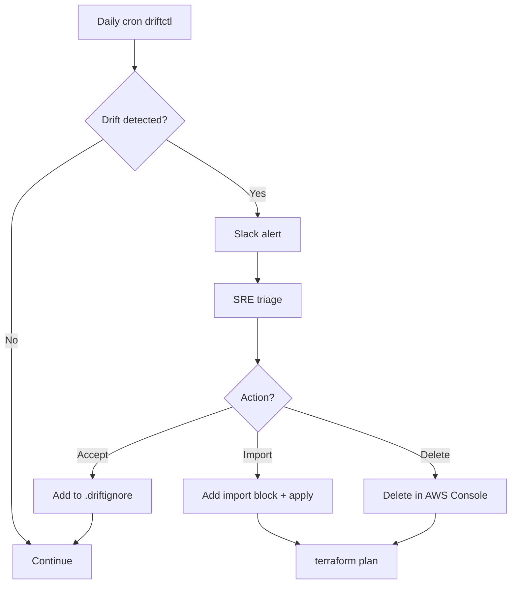

# 🎓 State management advanced + Drift detection

> **Tác giả:** Mr.Rom\
> **Phiên bản:** v1.1.0\
> **Tạo lúc:** 24/05/2026\
> **Cập nhật:** 25/05/2026\
> **Level:** Intermediate\
> **Tags:** [MUST-KNOW]\
> **Thời lượng đọc:** ~22 phút\
> **Prerequisites:** [02_atlantis-gitops-for-iac.md](02_atlantis-gitops-for-iac.md), Terraform state basics

> 🎯 *Basic dạy state + backend S3/DynamoDB. Production gặp: drift (manual changes), refactor (rename module), import (existing resource), state corruption recovery. Bài này dạy advanced state ops + automated drift detection workflow + safe recovery.*

## 🎯 Sau bài này bạn sẽ

- [ ] **State commands deep**: `mv`, `rm`, `pull`, `push`, `replace-provider`
- [ ] **Import existing** resources (`terraform import` + config generation)
- [ ] **Refactor without recreate**: `moved` block + `state mv`
- [ ] **Drift detection automation**: driftctl + cron + alert
- [ ] **State backup + recovery** procedure
- [ ] **State surgery** for emergencies
- [ ] **Module deprecation** workflow (state migration to new module)
- [ ] Avoid **6 dangerous state operations**

---

## Tình huống — `terraform plan` shows 200 changes

Friday afternoon, Sarah opens PR for small VPC tag update:
```bash
terragrunt plan
```

Output:
```
Plan: 12 to add, 5 to change, 200 to destroy.

# aws_instance.legacy[0] will be destroyed
# aws_security_group.unknown will be destroyed
# ... (200 resources)
```

Heart attack. 200 resources Terraform thinks should be destroyed.

Investigation:
- 6 months ago, ops team added EC2 instances manually for emergency.
- Auto-added security groups by AWS for ELB.
- IAM roles auto-rotated by AWS.
- Terraform state never updated.

→ **Drift**: actual cloud state has 200 extra resources Terraform doesn't know about.

If apply, Terraform destroy 200 resources → **outage**.

Sarah escalate: SRE on-call investigate 4 hours. Decide: import resources to Terraform, then proceed.

Sếp: *"How did we let drift accumulate 6 months? Setup driftctl daily cron. Bài này dạy."*

---

## 1️⃣ Terraform state — Quick refresher

🪞 **Ẩn dụ**: *Terraform state như **bản đồ kho hàng** — code là "danh sách tài sản phải có", state là "bản đồ thực tế ai ở đâu". Drift = bản đồ lệch thực tế (ai đó dời hàng không báo). State surgery = chỉnh bản đồ cho khớp thực tế. driftctl = nhân viên đi kiểm kho định kỳ.*

### State concept

Terraform state (`terraform.tfstate`) maps:
- **Resources in code** (Terraform `aws_instance.web`) ↔ **Actual cloud resources** (AWS instance ID `i-abc123`).
- Stores attribute values.
- Tracks dependencies.

Without state, Terraform can't tell: "Is this VPC the one I created, or someone else's?"

### State files

State file là **JSON snapshot** chứa metadata mọi resource Terraform manage — id, attributes, dependencies, module hierarchy. Mỗi `apply` tăng `serial` counter:

```json
{
  "version": 4,
  "terraform_version": "1.7.0",
  "serial": 42,
  "lineage": "uuid-1234-...",
  "outputs": { ... },
  "resources": [
    {
      "module": "module.vpc",
      "mode": "managed",
      "type": "aws_vpc",
      "name": "main",
      "provider": "provider[\"registry.terraform.io/hashicorp/aws\"]",
      "instances": [
        {
          "schema_version": 1,
          "attributes": { "id": "vpc-abc123", "cidr_block": "10.0.0.0/16", ... }
        }
      ]
    }
    // ... more resources
  ]
}
```

### State backend

Pick backend đúng quyết định team có collab được hay không. Local file (default) chỉ OK cho dev solo. Production = S3 + DynamoDB lock (HashiCorp recommended):

- **Local** (`terraform.tfstate` file): bad for team.
- **Remote** (S3 + DynamoDB lock): standard production.

```hcl
terraform {
  backend "s3" {
    bucket = "acme-tfstate"
    key    = "dev/us-east-1/vpc/terraform.tfstate"
    region = "us-east-1"
    encrypt = true
    dynamodb_table = "acme-tfstate-lock"
  }
}
```

---

## 2️⃣ State commands

### Read commands (safe)

4 lệnh **read-only**, an toàn dùng — list (xem resource nào trong state), show (detail), pull (download). Đây là tool điều tra khi debug state issues:

```bash
# List resources in state
terraform state list

# Show details of resource
terraform state show <resource>
# e.g., terraform state show aws_vpc.main

# Pull state (read-only download)
terraform state pull > current.tfstate

# Tofu/Terragrunt
terragrunt state list
terragrunt state show <resource>
```

### Modify commands (DANGEROUS)

3 lệnh **modify state** — `mv` (rename), `rm` (remove from tracking), `push` (overwrite). ⚠️ **DANGEROUS** — backup state trước, test ở non-prod. Sai = mất tracking infrastructure:

```bash
# Rename resource in state (no AWS change)
terraform state mv <source> <dest>
# e.g., terraform state mv aws_vpc.old aws_vpc.new

# Remove resource from state (resource STAYS in AWS, just Terraform forgets it)
terraform state rm <resource>

# Replace provider reference
terraform state replace-provider <old> <new>

# Push modified state back (DANGER!)
terraform state push <file>
```

⚠️ **Modify commands change state directly**. Wrong = corruption.

**Always**:
1. Backup first: `terraform state pull > backup-$(date +%s).tfstate`.
2. Try in non-prod env first.
3. `terraform plan` after to verify.

### `terraform state mv` use cases

**Case 1**: Rename resource in code without recreate:
```hcl
# Before: aws_vpc.old
# After: aws_vpc.new

# Terraform would: destroy aws_vpc.old + create aws_vpc.new = downtime!

# Use state mv instead:
terraform state mv aws_vpc.old aws_vpc.new
# Now plan: no changes
```

**Case 2**: Move resource into module:
```bash
terraform state mv aws_vpc.main module.vpc.aws_vpc.main
```

**Case 3**: Move resource between modules:
```bash
terraform state mv module.old.aws_vpc.main module.new.aws_vpc.main
```

### `terraform state rm` use cases

**Case 1**: Resource manually deleted in AWS, Terraform doesn't know:
```bash
# Resource gone in AWS, Terraform state still has it
# Plan would try to "destroy" non-existent resource = error
terraform state rm aws_vpc.deleted
# Now plan: clean
```

**Case 2**: Transfer ownership to another team's Terraform:
```bash
# This team's state forgets resource
terraform state rm aws_vpc.shared
# Other team imports same resource into their state
```

⚠️ `state rm` doesn't delete from cloud. Just Terraform forgets.

---

## 3️⃣ `moved` block — Modern refactor

Terraform 1.1+: declarative refactoring without `state mv`.

```hcl
# old.tf
resource "aws_vpc" "old_name" {
  cidr_block = "10.0.0.0/16"
}

# new.tf (after rename)
resource "aws_vpc" "new_name" {
  cidr_block = "10.0.0.0/16"
}

moved {
  from = aws_vpc.old_name
  to   = aws_vpc.new_name
}
```

→ `terraform plan` automatically detects rename, no `state mv` needed.

### Move into module

```hcl
moved {
  from = aws_vpc.main
  to   = module.networking.aws_vpc.main
}
```

### Benefits over `state mv`

| Aspect | `state mv` | `moved` block |
|---|---|---|
| Imperative or declarative | Imperative | Declarative |
| In code or CLI | CLI (separate command) | In `.tf` file (PR-reviewable) |
| Atlantis-friendly | No (manual CLI) | Yes (just commit code) |
| State backup before | Manual | Auto via plan |
| Cleanup | Manual (can keep) | Can remove block after applied |

**Recommend 2026**: Use `moved` blocks. Reserve `state mv` for emergencies.

---

## 4️⃣ Import existing resources

### Vấn đề

Someone manually created EC2 instance via Console. Now want Terraform manage it.

Options:
- **Destroy + recreate** via Terraform: downtime, data loss.
- **Import** existing into Terraform state: no recreate.

### Classic import workflow

```bash
# 1. Write Terraform code for the resource (no `id` field)
cat <<EOF > legacy-server.tf
resource "aws_instance" "legacy" {
  ami           = "ami-0c55b159cbfafe1f0"
  instance_type = "t3.medium"
  tags          = { Name = "legacy-server" }
}
EOF

# 2. Import existing AWS resource to Terraform state
terraform import aws_instance.legacy i-0abc123def456

# 3. Run plan to see if code matches actual
terraform plan
# Output: no changes (if code matches) OR show diff (if mismatch)

# 4. Adjust code until plan shows no changes
```

⚠️ **Tedious**: write code by hand, hope it matches AWS reality.

### Modern import (Terraform 1.5+)

`import` block in code:

```hcl
import {
  to = aws_instance.legacy
  id = "i-0abc123def456"
}

resource "aws_instance" "legacy" {
  # Code (Terraform fills in via plan-generated config)
}
```

Run:
```bash
terraform plan -generate-config-out=generated.tf
```

→ Terraform reads AWS resource, generates `generated.tf` with all attributes. **Copy + clean up** the generated config.

```bash
terraform apply
# Resource imported into state
```

### Bulk import workflow

For 200 drift resources:

```bash
# 1. List resources in AWS not in Terraform state
driftctl scan --from tfstate+s3://acme-tfstate/dev/us-east-1/vpc/terraform.tfstate

# 2. Output: list of unmanaged resources
# Example output:
# Found 200 unmanaged resources:
#   - aws_instance.i-abc1: legacy-1
#   - aws_security_group.sg-xyz: emergency-rule
#   ...

# 3. Decide: import (manage in Terraform) or delete (out-of-band)
# Import:
for instance_id in $(driftctl scan ... | grep aws_instance | awk '{print $2}'); do
  echo "import { to = aws_instance.imported_${instance_id}; id = \"${instance_id}\" }" >> imports.tf
done

# 4. Generate config:
terraform plan -generate-config-out=generated.tf

# 5. Review + apply:
terraform apply
```

→ Bulk import 200 resources in 30 min via scripting.

---

## 5️⃣ Drift detection automation

### Manual drift check

```bash
terraform plan -refresh-only
# Output: "X changes detected by refresh"
```

→ Drift detected. But manual = no one runs daily.

### driftctl — Automated drift scanner

[driftctl (Snyk)](https://github.com/snyk/driftctl) — OSS tool comparing IaC vs cloud.

```bash
# Install
brew install driftctl

# Scan single state
driftctl scan --from tfstate+s3://acme-tfstate/dev/us-east-1/vpc/terraform.tfstate

# Output:
# Found resources from your IaC: 50
# Found resources in cloud: 250
# 
# Drift:
#   - 200 unmanaged resources (in cloud, not in IaC)
#   - 5 missing resources (in IaC, not in cloud — deleted manually?)
#   - 3 modified resources (attributes drift)
```

### Daily cron drift check

```yaml
# .github/workflows/drift-detection.yml
name: Drift Detection
on:
  schedule:
    - cron: '0 6 * * *'    # daily 6am UTC
  workflow_dispatch:

jobs:
  drift:
    runs-on: ubuntu-latest
    strategy:
      matrix:
        env: [dev, staging, prod]
        region: [us-east-1, us-west-2, eu-west-1]
    steps:
      - uses: actions/checkout@v4
      - uses: snyk/driftctl@v2
      
      - name: Scan ${{ matrix.env }}-${{ matrix.region }}
        run: |
          driftctl scan \
            --from tfstate+s3://acme-tfstate/${{ matrix.env }}/${{ matrix.region }}/terraform.tfstate \
            --output json://drift.json
      
      - name: Alert if drift
        run: |
          DRIFT=$(jq '.summary.total_unmanaged' drift.json)
          if [ "$DRIFT" -gt 0 ]; then
            curl -X POST $SLACK_WEBHOOK -d "{
              \"text\": \"🚨 Drift in ${{ matrix.env }}/${{ matrix.region }}: $DRIFT unmanaged resources\"
            }"
          fi
      
      - uses: actions/upload-artifact@v3
        with:
          name: drift-report-${{ matrix.env }}-${{ matrix.region }}
          path: drift.json
```

→ Daily scan, Slack alert if drift, archive reports.

### Drift remediation workflow



### `.driftignore` — Accept known drift

Some resources expected to drift:
- IAM session credentials (rotated by AWS).
- CloudWatch log retention (sometimes auto-set).
- ECR repository policy (manual ops sometimes).

```
# .driftignore
*aws_iam_role.eks_node_*           # IAM auto-rotation
*aws_cloudwatch_log_group.lambda_* # CloudWatch auto-managed
```

→ driftctl ignores these. Document why.

---

## 6️⃣ State backup + recovery

### S3 versioning for state backup

```hcl
resource "aws_s3_bucket_versioning" "tfstate" {
  bucket = aws_s3_bucket.tfstate.id
  versioning_configuration {
    status = "Enabled"
  }
}
```

→ Every state change creates new version. Old versions retained 90+ days.

### Recover from accidental destroy

**Scenario**: someone runs `terragrunt destroy` on wrong env. State now empty. Want to rollback.

```bash
# List state versions in S3
aws s3api list-object-versions \
  --bucket acme-tfstate \
  --prefix dev/us-east-1/vpc/terraform.tfstate

# Output:
# Versions:
#   - VersionId: abc123, LastModified: 2026-05-24T09:00:00Z (current — empty after destroy)
#   - VersionId: def456, LastModified: 2026-05-24T08:00:00Z (before destroy)
#   - VersionId: ghi789, LastModified: 2026-05-23T15:00:00Z

# Download previous version
aws s3api get-object \
  --bucket acme-tfstate \
  --key dev/us-east-1/vpc/terraform.tfstate \
  --version-id def456 \
  restored.tfstate

# Verify
terraform show -json restored.tfstate | jq '.values.root_module.resources | length'

# Restore — push as current state
aws s3 cp restored.tfstate s3://acme-tfstate/dev/us-east-1/vpc/terraform.tfstate
```

→ State restored. But **cloud resources still destroyed** — need recreate.

```bash
terraform apply
# Plan: 20 to add (recreate destroyed resources)
```

→ Resources recreated based on state. **Data may be lost** (RDS, etc.) — depends on backup separately.

### State backup script

```bash
#!/bin/bash
# backup-state.sh — run daily via cron

DATE=$(date +%Y%m%d-%H%M)
BACKUP_BUCKET="acme-tfstate-backups"

for env in dev staging prod; do
  for region in us-east-1 us-west-2 eu-west-1; do
    aws s3 cp \
      s3://acme-tfstate/$env/$region/ \
      s3://$BACKUP_BUCKET/$DATE/$env/$region/ \
      --recursive
  done
done

# Cleanup backups > 90 days
aws s3 ls s3://$BACKUP_BUCKET/ | awk '$1 < "'$(date -d '-90 days' +%Y%m%d)'"' \
  | xargs -I {} aws s3 rm s3://$BACKUP_BUCKET/{} --recursive
```

→ Daily backup, 90-day retention.

---

## 7️⃣ State surgery — Emergency operations

### Case: 2 PRs modified same resource, state inconsistent

```bash
terraform plan
# Error: state file has resource that doesn't exist in code
```

**Step 1**: Pull state, inspect:
```bash
terraform state pull > current.tfstate
jq '.resources[] | .type + "." + .name' current.tfstate
```

**Step 2**: Identify orphan:
```
aws_instance.legacy   <- not in code anymore
```

**Step 3**: Decide:
- Resource still exists in AWS? → keep, add to code.
- Resource deleted? → remove from state: `terraform state rm aws_instance.legacy`.

### Case: Provider version conflict

```bash
terraform plan
# Error: provider hashicorp/aws version mismatch
```

**Cause**: state was created with provider v5.x, now using v4.x.

**Fix**:
```bash
terraform init -upgrade
# OR pin in code:
required_providers {
  aws = { version = "~> 5.0" }
}
```

If provider truly different (e.g., switched from `hashicorp/aws` to community fork):
```bash
terraform state replace-provider \
  hashicorp/aws \
  community/aws
```

### Case: Corrupted state JSON

State file lost newline / mangled by editor:
```bash
terraform state pull > current.tfstate
# Error: state file corrupted
```

**Fix**:
1. Restore from S3 versioning (previous version).
2. Or recreate state via `import` (if affordable).

⚠️ NEVER edit state JSON by hand. Use `state mv/rm` commands.

---

## 8️⃣ Module deprecation workflow

### Scenario

Old module `vpc-old` deprecated. New module `vpc-new` with different structure.

**Goal**: migrate all envs from `vpc-old` to `vpc-new` without recreating VPC.

### Step 1: Run `vpc-new` module + import existing

In dev:
```hcl
# Old: module.vpc_old
module "vpc_new" {
  source = "../../modules/vpc-new"
  cidr_block = "10.0.0.0/16"
}

import {
  to = module.vpc_new.aws_vpc.main
  id = data.terraform_remote_state.old.outputs.vpc_id
}
```

```bash
terragrunt plan
# Plan: import vpc + no changes if config matches
terragrunt apply
```

### Step 2: Remove old module from state

```bash
# After new module manages VPC
terragrunt state rm module.vpc_old
```

→ Now `vpc-old` no longer in state. Only `vpc-new` manages VPC.

### Step 3: Delete old module code

```bash
git rm -rf modules/vpc-old/
git commit -m "Remove deprecated vpc-old module"
```

### Step 4: Repeat per env

dev → staging → prod.

### Step 5: Document

CHANGELOG:
```
## v2.0.0
- BREAKING: Deprecated `vpc-old` module. Migrate to `vpc-new`.
- Migration guide: docs/migrations/vpc-old-to-new.md
```

### Migration with `moved` blocks (advanced)

For semantic-equivalent refactor:
```hcl
moved {
  from = module.vpc_old.aws_vpc.main
  to   = module.vpc_new.aws_vpc.main
}
```

→ Cleaner, no import needed if attribute names match.

---

## 💡 Pitfall & Best practice

### ❌ Pitfall: `terraform state rm` then forget to import

```bash
terraform state rm aws_vpc.main
# Resource still in AWS, but Terraform forgot
# Next apply: tries to create new VPC → already exists → fail
```

→ **Fix**: After `state rm`, either:
- Import to new location: `terraform import <new> <id>`.
- Or delete from cloud: AWS Console.
- Don't leave in limbo.

### ❌ Pitfall: Edit state JSON by hand

→ Easy to corrupt JSON. Lock breaks.

→ **Fix**: Always use `terraform state` commands. They validate.

### ❌ Pitfall: Force-unlock during apply

```bash
terraform force-unlock <lock-id>
# Other apply running → conflict → state corruption
```

→ **Fix**: Only unlock if certain no apply running. Check Atlantis UI / DynamoDB.

### ❌ Pitfall: No state backup before destructive ops

```bash
terraform state rm module.legacy
# Oops, removed wrong thing
```

→ **Fix**:
```bash
terraform state pull > backup-$(date +%s).tfstate
# Then risky op
# If wrong: aws s3 cp backup.tfstate s3://bucket/state.tfstate
```

### ❌ Pitfall: driftctl scan too broad

→ Scan entire AWS account: 1000s resources. Output overwhelming.

→ **Fix**:
- Filter by tag: `driftctl scan --filter "Tags['Environment'] == 'dev'"`.
- Per-state: scan each state file separately.
- `.driftignore` for known noise.

### ❌ Pitfall: Drift ignored too long

→ Daily Slack alert "drift detected" — team ignores.

→ **Fix**:
- Drift = first-class issue. Ticket every alert.
- Weekly drift review meeting.
- Drift in prod = SEV-2 incident.

### ✅ Best practice: State backup retention 90+ days

```hcl
resource "aws_s3_bucket_lifecycle_configuration" "tfstate" {
  bucket = aws_s3_bucket.tfstate.id
  
  rule {
    id = "versioning"
    status = "Enabled"
    noncurrent_version_expiration {
      noncurrent_days = 90
    }
  }
}
```

### ✅ Best practice: Use `moved` blocks for refactor

Declarative > imperative. PR-reviewable.

### ✅ Best practice: Document state operations

Wiki: "How to safely run `state mv`":
1. Backup state.
2. Notify team in Slack.
3. Lock manually.
4. Run command.
5. Verify with plan.
6. Document in runbook.

→ Train new SREs.

### ✅ Best practice: Automated import for known drift patterns

```python
# auto-import.py — runs after driftctl
import json, subprocess

drift = json.load(open('drift.json'))
for resource in drift['unmanaged']:
    if resource['type'] == 'aws_instance' and 'auto-import' in resource['tags']:
        # Generate import block + write to imports.tf
        with open('imports.tf', 'a') as f:
            f.write(f'import {{ to = aws_instance.imp_{resource["id"]}; id = "{resource["id"]}" }}\n')
```

→ Some drift expected, automate import.

---

## 🧠 Self-check

**Q1.** `state mv` vs `moved` block — when which?

<details>
<summary>💡 Đáp án</summary>

**`state mv`**:
- CLI command, imperative.
- Affects state file directly.
- Run manually, separate step.

```bash
terraform state mv aws_vpc.old aws_vpc.new
```

**Pros**:
- Quick for one-off operations.
- Works with old Terraform versions.

**Cons**:
- Not in code, not PR-reviewable.
- Atlantis doesn't run it automatically.
- Easy to forget if multiple envs.

**`moved` block** (Terraform 1.1+):
- In `.tf` code, declarative.
- `terraform plan` detects automatically.

```hcl
moved {
  from = aws_vpc.old
  to   = aws_vpc.new
}
```

**Pros**:
- PR-reviewable (other devs see refactor intent).
- Atlantis applies automatically.
- Idempotent across envs (commit + apply each env).
- Can keep in code as history, or remove after applied everywhere.

**Cons**:
- Newer Terraform required.
- Some edge cases not supported (e.g., cross-state moves).

**Recommend 2026**:
- **`moved` block** for code refactoring (rename, move into/out of module).
- **`state mv`** for emergencies, cross-state operations, ad-hoc fixes.

**Best practice**:
- Add `moved` block in same PR as refactor.
- Apply per env (Atlantis handles each).
- Remove `moved` block after applied everywhere (cleanup).
</details>

**Q2.** Why state backup retention 90+ days?

<details>
<summary>💡 Đáp án</summary>

**Common state issues** + recovery window:

1. **Accidental destroy** (5 minutes):
   - Immediate panic. Restore previous version (1 hour ago).
   - Need: 1+ hour retention.

2. **Drift discovered weeks later**:
   - Want to compare current vs "before drift started".
   - Need: weeks of retention.

3. **Compliance audit**:
   - Auditor asks: "Show state on date X".
   - Need: months of retention.

4. **Forensic investigation**:
   - Incident 60 days ago, want to verify Terraform changes.
   - Need: 90+ days.

5. **Slow corruption**:
   - State subtly wrong for weeks before noticed.
   - Need: long retention to find good baseline.

**Cost**:
- State file ~100KB - 5MB typical.
- S3 versioning: $0.023/GB/month.
- 100 state files × 1MB × 100 versions × 90 days = ~10GB = $0.23/month.

→ **Negligible cost, huge insurance**.

**Recommend**:
- **S3 versioning enabled** on state bucket.
- **Lifecycle rule**: noncurrent versions kept 90 days, then move to Glacier 1 year, then delete.

```hcl
resource "aws_s3_bucket_lifecycle_configuration" "tfstate" {
  rule {
    noncurrent_version_transition {
      noncurrent_days = 90
      storage_class = "GLACIER_IR"
    }
    noncurrent_version_expiration {
      noncurrent_days = 365
    }
  }
}
```

→ 90 days hot, 1 year cold, then delete. Cheap.

**Bonus**: Versioning protects against:
- Accidental `terraform destroy`.
- Bug in Terraform corrupting state.
- Malicious actor modifying state.

→ Combined with state file encryption (KMS) = strong protection.
</details>

**Q3.** When use `import` vs `state rm + recreate`?

<details>
<summary>💡 Đáp án</summary>

**Scenario**: existing AWS resource not in Terraform. Want Terraform manage.

**Option A: Import**
- Pros:
  - **No downtime** — resource stays running.
  - **No data loss** (RDS, S3, etc.).
  - Production-safe.
- Cons:
  - Tedious: write code matching reality.
  - Risk: code drift from actual.

**Option B: State rm + recreate**

(Only makes sense if resource lifecycle OK to recreate)

- Pros:
  - Clean code (no manual matching).
  - Terraform fully owns.
- Cons:
  - Downtime during recreate.
  - Data loss for stateful resources.
  - IP/ID changes — downstream dependencies break.

**Decision matrix**:

| Resource | Recommend |
|---|---|
| VPC, subnet, route table | Import (avoid IP renumbering) |
| RDS, DynamoDB | Import (data loss otherwise) |
| S3 bucket | Import (data + bucket name) |
| EC2 instance | Import (uptime), OR recreate if stateless app |
| Security group | Import or recreate (easy to recreate) |
| Lambda function | Recreate OK (no data) |
| IAM role | Import (avoid breaking integrations) |

**Production rule**: **default to import**. Recreate only for stateless + low-stakes.

**Bulk import** (200 drift resources):
- Use `import` block + `terraform plan -generate-config-out=generated.tf`.
- Review generated code, clean up.
- Test in dev first.

**Anti-pattern**:
- "Just destroy + recreate everything" — fast in test, **catastrophic in prod**.
- ALWAYS audit before destroy.
</details>

**Q4.** Drift detection — daily cron vs realtime?

<details>
<summary>💡 Đáp án</summary>

**Daily cron**:
- driftctl scan once / day.
- Slack alert if drift.
- Review next business day.

**Pros**:
- Cheap (one scan/day).
- Sufficient for slow drift.

**Cons**:
- Drift may go 24 hours before detected.
- Manual creation right after scan → 23h undetected.

**Realtime detection (advanced)**:
- CloudTrail / AWS Config monitor changes.
- Webhook to verify if change matches Terraform.
- Alert within minutes.

**Pros**:
- Catch drift immediately.
- Audit "who manually changed what".

**Cons**:
- Cost: CloudTrail + Config.
- Complex setup.
- High false positive (any change = alert).

**Hybrid (recommended 2026)**:
1. **AWS Config rules**: detect specific compliance violations (S3 public, IAM admin).
2. **Daily driftctl cron**: catch Terraform drift.
3. **Weekly review meeting**: triage accumulated drift.
4. **Per-resource criticality**: `prevent_destroy` on critical resources.

**Tool stack**:
- driftctl daily.
- AWS Config Conformance Packs (built-in compliance rules).
- Custom Lambda + CloudTrail for specific patterns (e.g., "alert if anyone runs `terraform apply` outside Atlantis").

**Anti-pattern**: realtime alert on every CloudTrail event = noise. Filter to **resource creation/deletion only**.

→ Daily cron is good baseline. Add realtime selectively for critical resources.
</details>

**Q5.** State file size growing — what to do?

<details>
<summary>💡 Đáp án</summary>

**Typical sizes**:
- Single module: 10KB - 500KB.
- Large prod (100+ resources): 5MB - 50MB.

**Problems with large state**:
1. **Slow plan/apply**: parsing + diff takes long.
2. **DynamoDB lock latency**: writes slower.
3. **Memory**: Terraform/Atlantis load state to RAM.
4. **Refresh slow**: each refresh = API calls per resource.

**Triggers for split**:
- State > 50MB.
- Plan > 5 minutes.
- 1000+ resources in single state.

**Refactor**: split into multiple states (one per logical group).

```
Before:
  infrastructure/terraform.tfstate (50MB, all resources)

After:
  infrastructure/
    networking/terraform.tfstate (5MB)
    compute/terraform.tfstate (10MB)
    storage/terraform.tfstate (3MB)
    iam/terraform.tfstate (2MB)
```

→ Each state smaller, faster plan, isolated risk.

**Cross-state references**: `data "terraform_remote_state"` OR Terragrunt `dependency`.

**Migration steps**:
1. Backup state.
2. Create new state file for sub-group.
3. `terraform state mv` resources to new state.
4. Update code to reference cross-state.
5. Verify with plan.

⚠️ Tedious. Plan migration weekend, test thoroughly in staging.

**Prevention**:
- Design states by domain (network, compute, etc.) from start.
- Terragrunt naturally encourages many small states.
- Avoid "monolithic state" anti-pattern.

**Bonus**: split state = parallel apply possible (no global lock).
</details>

---

## ⚡ Cheatsheet

```bash
# === Read state ===
terraform state list
terraform state show <resource>
terraform state pull > backup.tfstate
terraform state pull | jq '.resources | length'

# === Modify state (DANGER) ===
terraform state mv <source> <dest>
terraform state rm <resource>
terraform state replace-provider <old> <new>
terraform state push <file>      # rarely, after manual edit

# === Import ===
terraform import <resource> <id>
# Or modern (Terraform 1.5+):
terraform plan -generate-config-out=generated.tf

# === driftctl ===
driftctl scan --from tfstate+s3://bucket/path/state.tfstate
driftctl scan --output json://drift.json
driftctl scan --filter "Tags['Environment'] == 'dev'"

# === S3 versioning ===
aws s3api list-object-versions --bucket acme-tfstate --prefix dev/
aws s3api get-object --bucket acme-tfstate --key dev/vpc.tfstate --version-id <id> restored.tfstate

# === Backup state ===
terraform state pull > backup-$(date +%s).tfstate

# === Force unlock (emergency) ===
terraform force-unlock <lock-id>
terragrunt force-unlock <lock-id>
```

```hcl
# === moved block ===
moved {
  from = aws_vpc.old
  to   = aws_vpc.new
}

# === import block (Terraform 1.5+) ===
import {
  to = aws_instance.legacy
  id = "i-0abc123"
}

# === prevent_destroy ===
resource "aws_db_instance" "prod" {
  lifecycle {
    prevent_destroy = true
  }
}
```

---

## 📚 Glossary

| Term | Vietnamese / Explanation |
|---|---|
| **State** | Mapping Terraform code ↔ cloud resources |
| **State file** | `terraform.tfstate` JSON file |
| **Remote backend** | State stored in S3/GCS/Azure (vs local) |
| **State lock** | DynamoDB/blob lock preventing concurrent modify |
| **Drift** | Cloud state ≠ Terraform state |
| **driftctl** | OSS tool detecting drift |
| **State import** | Bring existing cloud resource into Terraform state |
| **State migration** | Refactor state structure without recreating |
| **`moved` block** | Declarative state move (Terraform 1.1+) |
| **`import` block** | Declarative import (Terraform 1.5+) |
| **State versioning** | S3 versioning preserves old state files |
| **State surgery** | Manual state editing (last resort) |
| **`prevent_destroy`** | Lifecycle setting preventing resource delete |
| **`create_before_destroy`** | Lifecycle ensuring new resource before old destroyed |
| **`replace-provider`** | Migrate state from one provider to another |
| **Refresh** | Update state from actual cloud (read-only) |
| **`terraform import`** | Classic CLI import command |
| **`.driftignore`** | driftctl file listing expected drift to ignore |

---

## 🔗 Liên kết & Tài nguyên

### Trong cluster
- ↶ Trước: [02_atlantis-gitops-for-iac.md](02_atlantis-gitops-for-iac.md)
- → Tiếp: [04_pulumi-cdk-crossplane.md](04_pulumi-cdk-crossplane.md) *(sắp viết)*
- ↑ Cluster: [IaC README](../../README.md)

### Cross-reference
- 🏗️ [Basic state + backend](../01_basic/02_state-and-backend.md) — foundation
- 📊 [Observability SRE](../../../observability/lessons/02_intermediate/04_sre-practices.md) — alert on drift

### Tài nguyên ngoài
- 📖 [Terraform state docs](https://developer.hashicorp.com/terraform/language/state)
- 📖 [State commands](https://developer.hashicorp.com/terraform/cli/state)
- 📖 [Import block](https://developer.hashicorp.com/terraform/language/import)
- 📖 [moved block](https://developer.hashicorp.com/terraform/language/modules/develop/refactoring)
- 📖 [driftctl](https://github.com/snyk/driftctl)
- 📖 [AWS Config](https://docs.aws.amazon.com/config/)
- 📖 [Terraform state migration patterns](https://developer.hashicorp.com/terraform/language/state/sensitive-data)

---

## 📌 Changelog

- **v1.1.0 (25/05/2026)** — Apply Blueprint v0.5.4+ §3.6: thêm lead-in trước State files JSON + State backend + Read commands + Modify commands warnings.

- **v1.0.0 (24/05/2026)** — Bản đầu tiên. Lesson 03 intermediate. State commands deep (mv/rm/pull/push/replace-provider) + import (classic + modern block) + moved block + driftctl automation + daily cron drift detection + S3 versioning backup/recovery + state surgery + module deprecation workflow. 6 pitfall + 4 best practice + 5 self-check + cheatsheet.
