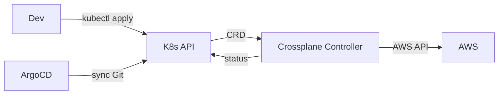
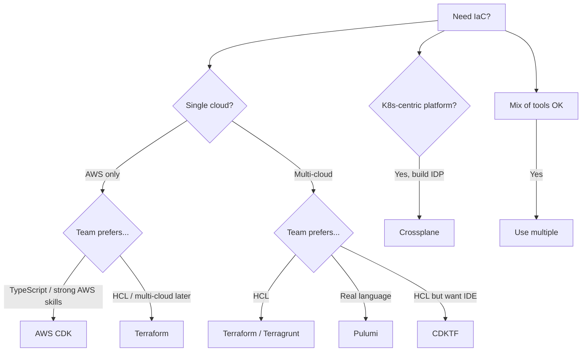
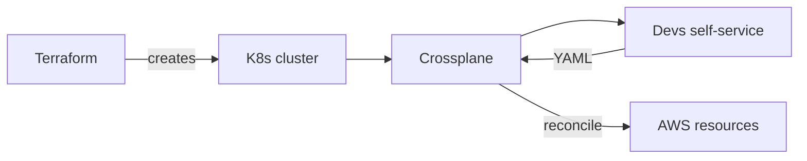

# 🎓 IaC Alternatives — Pulumi vs CDK vs Crossplane

> **Tác giả:** Mr.Rom\
> **Phiên bản:** v1.1.0\
> **Tạo lúc:** 24/05/2026\
> **Cập nhật:** 25/05/2026\
> **Level:** Intermediate\
> **Tags:** [MUST-KNOW]\
> **Thời lượng đọc:** ~25 phút\
> **Prerequisites:** [03_state-advanced-and-drift.md](03_state-advanced-and-drift.md), Terraform/Terragrunt fluent

> 🎯 *Bài cuối DevOps intermediate sprint. Terraform/HCL dominant nhưng có alternatives mạnh: **Pulumi** (Python/TS/Go), **AWS CDK** (TypeScript synthesize CloudFormation), **CDKTF** (CDK → Terraform), **Crossplane** (K8s-native CRD cho cloud). Bài này dạy mỗi tool + decision matrix.*

## 🎯 Sau bài này bạn sẽ

- [ ] Hiểu **Pulumi**: real languages cho IaC
- [ ] Hiểu **AWS CDK** + **CDKTF**: programmatic synthesizers
- [ ] Hiểu **Crossplane**: K8s-native multi-cloud IaC
- [ ] So sánh kỹ **Terraform vs Pulumi vs CDK vs Crossplane**
- [ ] **Migration paths** giữa tools
- [ ] **Multi-cloud abstraction** patterns
- [ ] **Decision matrix** chọn tool đúng project

---

## Tình huống — HCL frustrate developer team

Team backend (Python/TypeScript). Terraform repo grows:
- Loop logic `for_each` complex.
- Conditional resources awkward.
- Type checking missing.
- IDE intellisense weak.
- Tests painful (write Go for terratest).

Sample HCL frustration:
```hcl
locals {
  subnets = {
    for cidr in var.cidrs : "${cidr}-${var.region}" => {
      cidr_block = cidr
      az = element(var.azs, index(var.cidrs, cidr) % length(var.azs))
      type = startswith(cidr, "10.0") ? "public" : "private"
    }
  }
}

resource "aws_subnet" "main" {
  for_each = local.subnets
  cidr_block = each.value.cidr_block
  vpc_id = aws_vpc.main.id
  availability_zone = each.value.az
  
  tags = merge(var.common_tags, {
    Name = "${var.env}-${each.value.type}-${each.value.az}"
    Type = each.value.type
  })
}
```

→ Hard to read. Python equivalent (Pulumi):
```python
for i, cidr in enumerate(cidrs):
    az = azs[i % len(azs)]
    subnet_type = "public" if cidr.startswith("10.0") else "private"
    aws.ec2.Subnet(f"{cidr}-{region}",
        cidr_block=cidr,
        vpc_id=vpc.id,
        availability_zone=az,
        tags={
            **common_tags,
            "Name": f"{env}-{subnet_type}-{az}",
            "Type": subnet_type,
        }
    )
```

→ Familiar Python, type-checked, IDE autocomplete, easier debug.

Sếp: *"Evaluate Pulumi for new projects. Bài này phân tích."*

---

## 1️⃣ Pulumi — Real languages for IaC

🪞 **Ẩn dụ**: *IaC tools như **ngôn ngữ vẽ kiến trúc** — Terraform HCL như **CAD chuyên dụng** (DSL phải học mới được). Pulumi như **AutoCAD chạy Python** (dùng ngôn ngữ familiar + thư viện programming). CDK như **AutoCAD chỉ cho AWS**. Crossplane như **BIM trong K8s** (everything-as-K8s-object).*

### Concept

**Pulumi**: write infrastructure in **TypeScript / JavaScript / Python / Go / C# / Java**.

Same providers as Terraform underneath:
- Pulumi pulls `pulumi-aws` package (wraps Terraform AWS provider).
- Pulumi state same concept as Terraform state.
- Pulumi engine equivalent to Terraform engine.

→ Different DSL (real language), same cloud APIs.

### Setup

Pulumi install 1 lệnh + `pulumi new` scaffold project với template per cloud/language. Output ra cấu trúc tương tự Terraform nhưng dùng real programming language (TS/Python/Go/C#):

```bash
# Install
brew install pulumi

# Create project
mkdir my-infra && cd my-infra
pulumi new aws-typescript     # or aws-python, aws-go, etc.
```

Project structure:
```
my-infra/
├── Pulumi.yaml              # project config
├── Pulumi.dev.yaml          # per-stack config (dev/staging/prod)
├── index.ts                 # main code
├── package.json
└── tsconfig.json
```

### Sample TypeScript

Cùng case dùng Terraform vs Pulumi TypeScript — Pulumi cho phép dùng **language features** (loops, conditionals, functions) thay vì HCL syntax giới hạn. Ví dụ tạo VPC + 3 AZ subnet:

```typescript
// index.ts
import * as pulumi from "@pulumi/pulumi";
import * as aws from "@pulumi/aws";

const env = pulumi.getStack();           // "dev", "staging", "prod"
const config = new pulumi.Config();
const cidr = config.require("vpcCidr");

// Create VPC
const vpc = new aws.ec2.Vpc("main", {
    cidrBlock: cidr,
    enableDnsHostnames: true,
    enableDnsSupport: true,
    tags: { Name: `${env}-vpc`, Environment: env },
});

// Create subnets (3 AZ)
const azs = await aws.getAvailabilityZones({ state: "available" });
const subnets = azs.names.slice(0, 3).map((az, i) =>
    new aws.ec2.Subnet(`public-${i}`, {
        vpcId: vpc.id,
        cidrBlock: `10.0.${i}.0/24`,
        availabilityZone: az,
        mapPublicIpOnLaunch: true,
        tags: { Name: `${env}-public-${az}` },
    })
);

// Internet Gateway
const igw = new aws.ec2.InternetGateway("main", {
    vpcId: vpc.id,
});

// Outputs
export const vpcId = vpc.id;
export const subnetIds = subnets.map(s => s.id);
```

### Commands

Pulumi CLI có **5 lệnh chính** — `stack`, `up` (combined plan+apply), `destroy`, `output`, `config`. UX similar Terraform nhưng `up` thay cho `plan` + `apply` riêng:

```bash
pulumi stack init dev          # create stack
pulumi config set vpcCidr "10.0.0.0/16"
pulumi up                      # plan + apply (combined)
pulumi destroy                 # destroy
pulumi stack output vpcId      # read outputs

# State
pulumi stack export > stack.json
pulumi stack import < stack.json
```

### State backend

Pulumi default: Pulumi Cloud (SaaS, free tier).

Self-host option:
```bash
pulumi login s3://acme-pulumi-state
# Or local: pulumi login --local
```

→ S3 backend with similar features to Terraform S3.

### Loops + Conditionals

Đây là **killer feature** của Pulumi so với Terraform — dùng `for`/`if` thuần Python/TS, không phải HCL `count`/`for_each`/`dynamic` workarounds. Code đọc tự nhiên như business logic:

```python
# Python — natural
import pulumi
import pulumi_aws as aws

cidrs = ["10.0.0.0/24", "10.0.1.0/24", "10.0.2.0/24"]
azs = ["us-east-1a", "us-east-1b", "us-east-1c"]

vpc = aws.ec2.Vpc("main", cidr_block="10.0.0.0/16")

subnets = []
for i, cidr in enumerate(cidrs):
    if i < 2:  # only first 2 are public
        subnet = aws.ec2.Subnet(f"public-{i}",
            vpc_id=vpc.id,
            cidr_block=cidr,
            availability_zone=azs[i],
            map_public_ip_on_launch=True,
        )
        subnets.append(subnet)
```

→ Real `if`, real `for`, easy to debug.

### Functions + Modules

```python
# Reusable component
def create_vpc(name, cidr, azs):
    vpc = aws.ec2.Vpc(f"{name}-vpc", cidr_block=cidr)
    subnets = [aws.ec2.Subnet(f"{name}-subnet-{i}", vpc_id=vpc.id, ...) for i, az in enumerate(azs)]
    return vpc, subnets

# Use multiple times
dev_vpc, dev_subnets = create_vpc("dev", "10.0.0.0/16", ["us-east-1a", "us-east-1b"])
prod_vpc, prod_subnets = create_vpc("prod", "10.1.0.0/16", ["us-east-1a", "us-east-1b", "us-east-1c"])
```

→ Standard programming abstractions. Inheritance, mixins, etc.

### Testing

```python
# test_vpc.py — using pytest
import pulumi

class MyMocks(pulumi.runtime.Mocks):
    def new_resource(self, args):
        return [args.name + '_id', args.inputs]

pulumi.runtime.set_mocks(MyMocks(), preview=False)

def test_vpc_cidr():
    from infra import vpc
    assert vpc.cidr_block == "10.0.0.0/16"
```

→ Unit test infra code like normal Python. Mock cloud, fast tests.

### Pulumi vs Terraform feature comparison

| Feature | Terraform | Pulumi |
|---|---|---|
| DSL | HCL | TypeScript / Python / Go / C# / Java |
| State backend | S3/GCS/etc. | Pulumi Cloud (default) / S3 / local |
| Providers | Terraform registry | Pulumi (wraps Terraform) |
| Loops | `for_each`, `count` | Real `for` |
| Conditionals | `count = condition ? 1 : 0` | Real `if` |
| Type checking | Limited (HCL) | Strong (TS/Python typed) |
| IDE support | Plugin (Terraform extension) | Native (VSCode/IntelliJ) |
| Testing | terratest (Go) | Native (pytest/jest) |
| Multi-cloud | Per-provider | Per-provider, abstractable |
| Community 2026 | ~70% market | ~20% growing |
| Migration TF → Pulumi | `pulumi import` + `tf2pulumi` tool | — |
| Cost | Free OSS | OSS free; Cloud SaaS paid (team features) |

---

## 2️⃣ AWS CDK — TypeScript/Python → CloudFormation

### Concept

**AWS CDK**: TypeScript / Python / Java / C# / Go that **synthesizes CloudFormation templates**.

Different from Pulumi (CDK targets CloudFormation, Pulumi runs own engine).

### Setup

```bash
npm install -g aws-cdk
mkdir my-cdk && cd my-cdk
cdk init app --language typescript
```

### Sample

```typescript
// lib/my-stack.ts
import * as cdk from 'aws-cdk-lib';
import * as ec2 from 'aws-cdk-lib/aws-ec2';
import { Construct } from 'constructs';

export class MyStack extends cdk.Stack {
  constructor(scope: Construct, id: string, props?: cdk.StackProps) {
    super(scope, id, props);

    // L2 construct — high-level abstraction
    const vpc = new ec2.Vpc(this, 'MyVpc', {
      maxAzs: 3,
      natGateways: 1,
      subnetConfiguration: [
        { name: 'public', subnetType: ec2.SubnetType.PUBLIC, cidrMask: 24 },
        { name: 'private', subnetType: ec2.SubnetType.PRIVATE_WITH_EGRESS, cidrMask: 24 },
      ],
    });
    
    // L1 construct — direct CloudFormation
    new ec2.CfnSubnet(this, 'CustomSubnet', {
      vpcId: vpc.vpcId,
      cidrBlock: '10.0.99.0/24',
    });
  }
}
```

### Commands

```bash
cdk synth                # generate CloudFormation template
cdk deploy               # deploy stack
cdk destroy              # destroy
cdk diff                 # show changes
cdk bootstrap            # one-time setup (S3 for assets)
```

### CDK Constructs Levels

**L1 (CfnXxx)**: 1:1 with CloudFormation resources. Verbose but full control.

**L2 (Xxx)**: AWS-curated abstractions. Sensible defaults (e.g., `Vpc` creates subnets + IGW + route tables).

**L3 (patterns)**: Multi-resource patterns (e.g., `LoadBalancedFargateService` = ALB + ECS Fargate + Task definition).

```typescript
// L3 example — entire serverless API in 5 lines
new cdk_patterns.LambdaRestApi(this, 'Api', {
  handler: myFunction,
  proxy: false,
});
```

→ Massive productivity at L3, but lock-in to AWS Constructs.

### CDK vs Pulumi vs Terraform

| Aspect | CDK | Pulumi | Terraform |
|---|---|---|---|
| Backend | CloudFormation (AWS-only) | Terraform engine (multi-cloud) | Terraform engine |
| Cloud support | AWS only | All clouds | All clouds |
| State | CloudFormation native | Pulumi state | Terraform state |
| L3 patterns | Strong (AWS-curated) | Community | Community |
| Stack drift | CloudFormation handles | Pulumi diff | Terraform diff |
| Best for | AWS-only shops | Multi-cloud + dev DX | Standard |

→ **CDK** great for AWS shops wanting tight integration. Not for multi-cloud.

---

## 3️⃣ CDKTF — CDK for Terraform

### Concept

**CDKTF** (CDK for Terraform): TypeScript / Python / Go / Java / C# → **Terraform HCL**.

Combines:
- CDK's developer experience (real languages, IDE).
- Terraform's multi-cloud + provider ecosystem.

### Setup

```bash
npm install -g cdktf-cli
mkdir my-cdktf && cd my-cdktf
cdktf init --template=typescript --providers=aws
```

### Sample

```typescript
// main.ts
import { Construct } from "constructs";
import { App, TerraformStack } from "cdktf";
import * as aws from "@cdktf/provider-aws";

class MyStack extends TerraformStack {
  constructor(scope: Construct, id: string) {
    super(scope, id);

    new aws.provider.AwsProvider(this, "AWS", { region: "us-east-1" });
    
    const vpc = new aws.vpc.Vpc(this, "MyVpc", {
      cidrBlock: "10.0.0.0/16",
      tags: { Name: "my-vpc" },
    });
    
    new aws.subnet.Subnet(this, "Public", {
      vpcId: vpc.id,
      cidrBlock: "10.0.1.0/24",
    });
  }
}

const app = new App();
new MyStack(app, "my-stack");
app.synth();
```

### Commands

```bash
cdktf synth              # generate Terraform HCL JSON
cdktf deploy             # synthesizes + terraform apply
cdktf destroy
cdktf diff               # terraform plan equivalent
```

### CDKTF vs Pulumi vs CDK

| Aspect | CDKTF | Pulumi | AWS CDK |
|---|---|---|---|
| Target | Terraform HCL | Pulumi engine | CloudFormation |
| Languages | TS/Python/Go/Java/C# | TS/Python/Go/C#/Java | TS/Python/Go/Java/C# |
| State | Terraform state (S3/GCS) | Pulumi state | CloudFormation state |
| Providers | Terraform registry (huge) | Pulumi (wraps Terraform) | AWS only (CFN) |
| Engine maturity | Terraform (10+ years) | Pulumi (~5 years) | CloudFormation (15+ years) |
| Multi-cloud | Yes (via Terraform providers) | Yes | No |
| Migration from Terraform HCL | Easy (`cdktf convert`) | Tedious | NA |

→ **CDKTF** sweet spot for Terraform shops wanting TS/Python without switching engine.

---

## 4️⃣ Crossplane — K8s-native IaC

### Concept

**Crossplane**: define cloud infrastructure as **K8s CRDs**. ArgoCD syncs infra YAML like apps.



### Setup

```bash
helm install crossplane crossplane-stable/crossplane \
  --namespace crossplane-system \
  --create-namespace

# Install AWS provider
kubectl apply -f - <<EOF
apiVersion: pkg.crossplane.io/v1
kind: Provider
metadata:
  name: provider-aws-ec2
spec:
  package: xpkg.upbound.io/upbound/provider-aws-ec2:v1.0.0
EOF
```

### Sample CRD

```yaml
# Define cloud resources via CRDs
apiVersion: ec2.aws.upbound.io/v1beta1
kind: VPC
metadata:
  name: my-vpc
spec:
  forProvider:
    region: us-east-1
    cidrBlock: 10.0.0.0/16
    enableDnsHostnames: true
    enableDnsSupport: true
    tags:
      Name: my-vpc
      Environment: dev
  providerConfigRef:
    name: aws-dev
---
apiVersion: ec2.aws.upbound.io/v1beta1
kind: Subnet
metadata:
  name: public-subnet-1
spec:
  forProvider:
    region: us-east-1
    vpcIdRef:
      name: my-vpc      # reference other CRD
    cidrBlock: 10.0.1.0/24
    availabilityZone: us-east-1a
```

Apply:
```bash
kubectl apply -f vpc.yaml
kubectl get vpc.ec2.aws.upbound.io
# NAME    SYNCED   READY   EXTERNAL-NAME   AGE
# my-vpc  True     True    vpc-abc123      2m
```

### Compositions — Abstract complexity

Instead of users writing 30 CRDs, platform team creates **Composite Resource Definition (XRD)**:

```yaml
# XRD — define new "infrastructure type"
apiVersion: apiextensions.crossplane.io/v1
kind: CompositeResourceDefinition
metadata:
  name: xnetworks.acme.io
spec:
  group: acme.io
  names:
    kind: XNetwork
  versions:
    - name: v1alpha1
      schema:
        openAPIV3Schema:
          type: object
          properties:
            spec:
              type: object
              properties:
                region: { type: string }
                cidrBlock: { type: string }
                publicSubnets: { type: integer, default: 3 }
                privateSubnets: { type: integer, default: 3 }
---
# Composition — implement the new type
apiVersion: apiextensions.crossplane.io/v1
kind: Composition
metadata:
  name: standard-network
spec:
  compositeTypeRef:
    apiVersion: acme.io/v1alpha1
    kind: XNetwork
  resources:
    - name: vpc
      base:
        apiVersion: ec2.aws.upbound.io/v1beta1
        kind: VPC
        spec:
          forProvider:
            cidrBlock: 10.0.0.0/16   # default, overridable
    - name: public-subnet-1
      base:
        apiVersion: ec2.aws.upbound.io/v1beta1
        kind: Subnet
        spec:
          forProvider:
            cidrBlock: 10.0.1.0/24
    # ... more subnets, IGW, NAT, route tables
```

User:
```yaml
apiVersion: acme.io/v1alpha1
kind: XNetwork
metadata:
  name: prod-vpc
spec:
  region: us-east-1
  cidrBlock: 10.10.0.0/16
  publicSubnets: 3
  privateSubnets: 3
```

→ User writes **5-line spec**, Composition expands to 30+ resources. Self-service platform.

### Crossplane benefits

1. **K8s-native**: same control plane as apps. RBAC, ArgoCD, observability — all reused.
2. **Self-service**: devs create infra via simple CRDs. Platform team defines safe defaults via Compositions.
3. **Multi-cloud**: same Composition pattern for AWS/GCP/Azure providers.
4. **Continuous reconcile**: Crossplane periodically reconciles drift (unlike Terraform that requires explicit apply).

### Crossplane downsides

1. **K8s overhead**: need K8s cluster running.
2. **Learning curve**: CRD + Composition + Functions concepts.
3. **Less mature than Terraform**: 2026 CNCF Incubating.
4. **Debugging harder**: controller logs vs Terraform plan output.

### When Crossplane wins

- **Platform engineering team building IDP** (Internal Developer Platform).
- **K8s already heavy** (most workload on K8s).
- **Multi-cloud abstractions** needed.
- **Self-service IDP** users prefer YAML.

### When Crossplane loses

- Small team / simple infra.
- Team not K8s-comfortable.
- Need feature parity with Terraform (some providers lag).

---

## 5️⃣ Decision matrix — Which IaC tool?

### Quick decision tree



### Detailed matrix

| Use case | Tool | Reason |
|---|---|---|
| **Startup, AWS-only, small team** | Terraform | Simplest, broad community |
| **Startup, AWS-only, JS/TS team** | AWS CDK | DX win, AWS integration |
| **Enterprise, multi-cloud** | Terraform + Terragrunt | Standard, mature |
| **Multi-cloud, dev-first culture** | Pulumi | Real languages |
| **Migrate from CFN to multi-cloud** | CDKTF | TS code + Terraform multi-cloud |
| **K8s-heavy platform team** | Crossplane | K8s-native, self-service IDP |
| **Compliance-heavy, audit strict** | Terraform + OPA | Mature policy ecosystem |
| **Greenfield, want learn 1 thing** | OpenTofu | OSS license clean |

### Production reality 2026 (estimates)

| Tool | Market share | Trend |
|---|---|---|
| Terraform / OpenTofu | ~65% | Stable (OpenTofu growing) |
| Pulumi | ~15% | Growing |
| AWS CDK | ~12% | Stable (AWS shops) |
| CDKTF | ~3% | Growing slowly |
| Crossplane | ~5% | Growing (platform teams) |

→ Terraform still dominates. Pulumi gaining. Crossplane niche but popular for IDP.

---

## 6️⃣ Multi-cloud abstraction patterns

### Vấn đề

Same logical infra, different clouds:
- "VPC" in AWS = "VPC" in GCP = "VNet" in Azure.
- Different APIs, attributes, behaviors.

### Pattern 1: Terraform per-provider modules

```
modules/
├── aws-vpc/
├── gcp-vpc/
└── azure-vnet/
```

```hcl
# Pick per env
module "vpc_aws" {
  source = "../modules/aws-vpc"
  count = var.cloud == "aws" ? 1 : 0
}
module "vpc_gcp" {
  source = "../modules/gcp-vpc"
  count = var.cloud == "gcp" ? 1 : 0
}
```

→ Tedious. Code duplication.

### Pattern 2: Pulumi abstraction class

```typescript
abstract class Network {
  abstract id(): pulumi.Output<string>;
}

class AwsNetwork extends Network {
  vpc: aws.ec2.Vpc;
  constructor(name, cidr) {
    super();
    this.vpc = new aws.ec2.Vpc(name, { cidrBlock: cidr });
  }
  id() { return this.vpc.id; }
}

class GcpNetwork extends Network {
  network: gcp.compute.Network;
  // ...
}

// Caller doesn't care which cloud
const net: Network = config.cloud === "aws" 
  ? new AwsNetwork("main", "10.0.0.0/16") 
  : new GcpNetwork("main", "10.0.0.0/16");
```

→ Real OO abstraction. Pulumi shines here.

### Pattern 3: Crossplane Compositions

```yaml
# XRD: define abstract type
apiVersion: apiextensions.crossplane.io/v1
kind: CompositeResourceDefinition
metadata:
  name: xnetworks.acme.io
spec:
  group: acme.io
  names:
    kind: XNetwork
---
# Composition for AWS
apiVersion: apiextensions.crossplane.io/v1
kind: Composition
metadata:
  name: aws-network
  labels:
    cloud: aws
spec:
  compositeTypeRef:
    apiVersion: acme.io/v1alpha1
    kind: XNetwork
  resources:
    - base: { kind: VPC, apiVersion: ec2.aws.upbound.io/v1beta1 }
---
# Composition for GCP
apiVersion: apiextensions.crossplane.io/v1
kind: Composition
metadata:
  name: gcp-network
  labels:
    cloud: gcp
spec:
  compositeTypeRef:
    apiVersion: acme.io/v1alpha1
    kind: XNetwork
  resources:
    - base: { kind: Network, apiVersion: compute.gcp.upbound.io/v1beta1 }
```

→ Users create `XNetwork`. Composition selector matches cloud. Cloud-agnostic from user POV.

### Reality check

Multi-cloud abstraction = **expensive**. Most teams:
- 95% workload on 1 cloud (efficient).
- 5% on backup cloud (DR).
- Different teams for different clouds.

Don't over-abstract. Lift-and-shift between clouds rarely happens; refactor when moves.

→ Pulumi/Crossplane abstractions only when **realistic multi-cloud strategy**.

---

## 7️⃣ Migration paths between tools

### Terraform → Pulumi

```bash
# Tool: tf2pulumi
brew install pulumi/tap/tf2pulumi
tf2pulumi --target typescript ./terraform-project
```

→ Generates Pulumi TypeScript code from Terraform HCL. Manual cleanup needed.

State migration: not automatic. Use `pulumi import` to bring resources.

### Terraform HCL → CDKTF

```bash
cdktf convert --language typescript < main.tf
```

→ Converts HCL to TypeScript using CDKTF constructs. State is **same** (still Terraform state).

→ Easy migration: write code in TS, deploy via Terraform engine.

### Terraform → Crossplane

No automated tool. Manual rewrite as CRDs + Compositions.

→ Re-import each resource via Crossplane management. Lengthy.

### CDK → CDKTF

```bash
# Migrate AWS CDK to CDKTF (multi-cloud capable)
# No automated tool — manual rewrite, same TS knowledge applies
```

### Lock-in considerations

| Tool | Lock-in level |
|---|---|
| Terraform / OpenTofu | Low — HCL portable, multi-cloud |
| Terragrunt | Medium — Terragrunt-specific config |
| Pulumi | Medium — Pulumi state, real language |
| AWS CDK | High — AWS CloudFormation only |
| CDKTF | Low — outputs Terraform HCL |
| Crossplane | Medium — K8s-native |

→ Terraform/CDKTF lowest lock-in. CDK highest (AWS-only).

---

## 8️⃣ Hands-on: Compare same VPC in 4 tools

### Goal

Create same VPC + 2 subnets in:
1. Terraform.
2. Pulumi (Python).
3. AWS CDK (TypeScript).
4. Crossplane (YAML).

### Terraform

```hcl
resource "aws_vpc" "main" {
  cidr_block = "10.0.0.0/16"
  tags       = { Name = "main" }
}

resource "aws_subnet" "public" {
  count = 2
  vpc_id = aws_vpc.main.id
  cidr_block = "10.0.${count.index}.0/24"
  availability_zone = element(["us-east-1a", "us-east-1b"], count.index)
  tags = { Name = "public-${count.index}" }
}
```

### Pulumi (Python)

```python
import pulumi
import pulumi_aws as aws

vpc = aws.ec2.Vpc("main",
    cidr_block="10.0.0.0/16",
    tags={"Name": "main"})

for i, az in enumerate(["us-east-1a", "us-east-1b"]):
    aws.ec2.Subnet(f"public-{i}",
        vpc_id=vpc.id,
        cidr_block=f"10.0.{i}.0/24",
        availability_zone=az,
        tags={"Name": f"public-{i}"})
```

### AWS CDK (TypeScript L1 — equivalent)

```typescript
import * as cdk from 'aws-cdk-lib';
import * as ec2 from 'aws-cdk-lib/aws-ec2';

class MyStack extends cdk.Stack {
  constructor(scope, id, props) {
    super(scope, id, props);
    
    const vpc = new ec2.CfnVPC(this, 'MainVpc', {
      cidrBlock: '10.0.0.0/16',
      tags: [{ key: 'Name', value: 'main' }],
    });
    
    ['us-east-1a', 'us-east-1b'].forEach((az, i) => {
      new ec2.CfnSubnet(this, `PublicSubnet${i}`, {
        vpcId: vpc.ref,
        cidrBlock: `10.0.${i}.0/24`,
        availabilityZone: az,
      });
    });
  }
}
```

### AWS CDK (TypeScript L2 — high-level)

```typescript
const vpc = new ec2.Vpc(this, 'MainVpc', {
  cidr: '10.0.0.0/16',
  maxAzs: 2,
  subnetConfiguration: [
    { name: 'public', subnetType: ec2.SubnetType.PUBLIC, cidrMask: 24 },
  ],
});
// VPC + 2 subnets + IGW + route tables — 5 lines!
```

### Crossplane (YAML)

```yaml
apiVersion: ec2.aws.upbound.io/v1beta1
kind: VPC
metadata:
  name: main
spec:
  forProvider:
    region: us-east-1
    cidrBlock: 10.0.0.0/16
    tags: { Name: main }
---
apiVersion: ec2.aws.upbound.io/v1beta1
kind: Subnet
metadata:
  name: public-0
spec:
  forProvider:
    region: us-east-1
    vpcIdRef: { name: main }
    cidrBlock: 10.0.0.0/24
    availabilityZone: us-east-1a
---
apiVersion: ec2.aws.upbound.io/v1beta1
kind: Subnet
metadata:
  name: public-1
spec:
  forProvider:
    region: us-east-1
    vpcIdRef: { name: main }
    cidrBlock: 10.0.1.0/24
    availabilityZone: us-east-1b
```

### Side-by-side observation

| Tool | Lines | Strengths |
|---|---|---|
| Terraform | 12 | Concise, declarative |
| Pulumi | 12 | Loop = real Python |
| CDK L1 | 18 | TypeScript familiar |
| CDK L2 | 8 | Highest abstraction |
| Crossplane | 22 | Declarative YAML, verbose |

→ Each has trade-offs. CDK L2 wins line count but AWS-only. Pulumi wins readability for programmers.

---

## 💡 Pitfall & Best practice

### ❌ Pitfall: Choose tool based on hype

→ "Pulumi is new, let's switch from Terraform". Migrate 50K lines for marginal benefit. Months of work.

→ **Fix**: 
- Stay with current tool unless **strong reason** (multi-cloud need, team language preference).
- Greenfield project = evaluate fresh.
- Don't migrate established repo without ROI calculation.

### ❌ Pitfall: Mix tools in same repo

```
infra/
├── terraform/    # half resources
├── pulumi/       # other half
└── cdk/          # legacy
```

→ Cognitive overhead. Different states. Hard to onboard.

→ **Fix**: Pick 1 primary tool per repo. Migration: full + delete old.

### ❌ Pitfall: Pulumi without programming discipline

→ Team writes Pulumi like script: 1000-line file, no functions, no types.

→ **Fix**:
- Apply software engineering practices: small functions, types, tests.
- Code review like app code.
- Linter (ESLint, pylint).

### ❌ Pitfall: CDK L3 misuse

```typescript
new patterns.ApplicationLoadBalancedFargateService(this, 'App', { ... });
```

→ Magic 30+ resources created. Hard to tune.

→ **Fix**:
- L2 for most cases (balance abstraction + control).
- L3 only when defaults exactly fit.
- L1 for fine-tuning.

### ❌ Pitfall: Crossplane CRD chaos

→ 100 CRDs in cluster. Hard to discover. Compositions un-versioned.

→ **Fix**:
- **Functions**: Crossplane v2 has Composition Functions (replacing patches with code) — better composition logic.
- **XRDs versioned**: v1alpha1 → v1beta1 → v1.
- **Documentation**: each XRD has README + examples.

### ❌ Pitfall: Multi-cloud abstraction premature

→ Abstract Network/Compute/Storage upfront for multi-cloud "someday". Never use 2nd cloud. Wasted complexity.

→ **Fix**:
- YAGNI: build single-cloud first.
- Refactor to multi-cloud when actually needed.
- Pulumi/Crossplane multi-cloud abstractions = expensive to maintain.

### ✅ Best practice: Greenfield = evaluate Pulumi if team strong dev

Fresh project, team strong in Python/TS:
- Pulumi: 50% faster development (real language).
- Better testability.
- Easier onboarding for new devs (Python = familiar).

vs Terraform:
- Larger community.
- More providers/modules ready.
- Established patterns.

→ Try Pulumi greenfield, stay Terraform brownfield.

### ✅ Best practice: Platform team builds IDP with Crossplane

Platform engineer goal: devs self-service infra.

```yaml
# Dev writes simple YAML:
apiVersion: acme.io/v1alpha1
kind: XApplication
metadata:
  name: my-service
spec:
  language: python
  database: postgres
  scale: small
```

→ Composition expands to: K8s Deployment + Service + Ingress + RDS Postgres + Secret + Network Policy + IAM role.

Dev needs nothing about AWS. **Platform abstracts complexity**.

→ Crossplane shines here vs Terraform (which is dev-facing tool).

### ✅ Best practice: HCL + CDKTF hybrid

Some teams:
- HCL for stable infra (network, IAM).
- CDKTF for dynamic logic-heavy infra (multi-region with conditionals).

Both use same Terraform engine. Mix in different repos.

---

## 🧠 Self-check

**Q1.** Pulumi vs Terraform — real production reason to switch?

<details>
<summary>💡 Đáp án</summary>

**Strong reasons to switch**:

1. **Team language strength**:
   - Backend team Python/TypeScript experts. Hate HCL.
   - Pulumi → use familiar language, IDE, testing.
   - **Quantifiable**: 20-30% faster dev velocity for complex IaC.

2. **Strong typing requirement**:
   - Multi-team contracts (type-safe interface between teams).
   - HCL has limited type checking. TypeScript/Java strong.

3. **Real abstraction needs**:
   - Need OO (classes, inheritance) for multi-cloud abstraction.
   - HCL modules limited compared to Pulumi components.

4. **Testing first-class**:
   - Want unit tests for IaC, not just integration (terratest).
   - Pulumi mocks → fast unit tests.

5. **Greenfield + dev team**:
   - New project, dev team comfortable with TS/Python, no HCL legacy.

**Weak reasons (avoid)**:

1. "HCL is ugly" — subjective, get used to it.
2. "Pulumi is new" — hype-driven, not justified.
3. "Want to migrate 50K LoC" — sunk cost, evaluate ROI.

**Reality**:
- Most teams stay Terraform (community + maturity).
- Pulumi attracts dev-first teams + greenfield.
- 2026 market: Terraform ~65%, Pulumi ~15%.

**Migration cost**:
- Small (< 5K LoC): 1-2 weeks.
- Medium (5-50K): 1-3 months.
- Large (50K+): 6+ months + risk.

→ Don't migrate unless ROI > 1.5x.
</details>

**Q2.** AWS CDK vs CDKTF — which for AWS-only?

<details>
<summary>💡 Đáp án</summary>

**AWS CDK**:
- **Synthesizes CloudFormation**.
- AWS-native: tight integration, every AWS service.
- L3 patterns (high-level abstractions like LambdaRestApi).
- CloudFormation state.
- AWS support included.

**Best for**:
- AWS-only forever.
- Want L3 patterns (faster dev).
- Trust CloudFormation maturity.
- AWS team support / enterprise contract.

**CDKTF**:
- **Synthesizes Terraform HCL**.
- Multi-cloud (any Terraform provider).
- Terraform state.
- Larger community (Terraform).

**Best for**:
- "AWS now, maybe multi-cloud later".
- Migrating from Terraform HCL but want TS code.
- Want OSS Terraform engine (no CloudFormation lock-in).
- Prefer Terraform's deterministic plan/apply over CloudFormation's "drift detection".

**Decision matrix**:

| Question | Lean to |
|---|---|
| AWS only forever? | CDK |
| Multi-cloud possible? | CDKTF |
| Want L3 patterns (LambdaRestApi etc.)? | CDK |
| Have existing Terraform? | CDKTF (mix) |
| Strong CloudFormation knowledge? | CDK |
| Strong Terraform knowledge? | CDKTF |
| AWS enterprise contract? | CDK (support) |

**Real-world**:
- Startup AWS-only: CDK if team comfortable.
- Mid AWS-only: CDK + AWS Solutions Architect best practices.
- Enterprise multi-cloud: CDKTF or stick with Terraform HCL.

**Anti-pattern**: Use both CDK + CDKTF in same project. State systems different, debugging nightmare.
</details>

**Q3.** Crossplane vs Terraform for K8s-centric team?

<details>
<summary>💡 Đáp án</summary>

**Crossplane wins K8s-centric** when:

1. **Platform team building IDP** (Internal Developer Platform):
   - Devs self-service infra via CRDs.
   - Platform team writes Compositions (safe defaults).
   - Same kubectl/RBAC/ArgoCD for apps + infra.

2. **GitOps everything**:
   - Existing ArgoCD for apps.
   - Add infra YAML to same Git repo, ArgoCD syncs both.
   - Single workflow for devs.

3. **Continuous reconciliation**:
   - Terraform: explicit `apply` needed.
   - Crossplane: controller reconciles drift continuously.
   - Want self-healing infra.

4. **K8s expertise high**:
   - Team writes Operators / understands CRDs.
   - K8s = familiar paradigm.

**Crossplane loses** when:

1. **Simple infra**: Crossplane overhead unjustified.
2. **K8s skills low**: steep learning curve.
3. **Specific provider features**: Crossplane providers lag Terraform sometimes.
4. **Static infra**: rare changes don't benefit from continuous reconcile.

**Hybrid (common pattern)**:
- **Foundation** (VPC, K8s cluster, IAM): Terraform (stable, low change).
- **Application infra** (databases, queues, S3 buckets per app): Crossplane (dev self-service).
- Bootstrap: Terraform creates Crossplane control plane.



→ Terraform for bootstrap + foundation. Crossplane for self-service.

**Maturity**:
- Crossplane v1.x (2024+) production-ready.
- Major adopters: Upbound (vendor), Microsoft, Spotify.
- Still niche (~5% market 2026), growing.

**Realistic timeline**:
- Year 1: bootstrap with Terraform, K8s + ArgoCD.
- Year 2: introduce Crossplane for new apps.
- Year 3+: migrate stable resources to Crossplane (or stay hybrid).
</details>

**Q4.** Multi-cloud abstraction — when worth complexity?

<details>
<summary>💡 Đáp án</summary>

**Multi-cloud reality**:
- **95% workloads on 1 cloud** (efficient).
- **5% on DR/backup cloud** (geographic + business continuity).
- True multi-cloud (50/50 split): rare, expensive, complex.

**When worth abstracting**:

1. **Real multi-cloud strategy**:
   - Government / regulated industries with vendor diversity requirement.
   - Multi-region failover with different cloud per region (rare).
   - M&A: inherited multi-cloud, want consolidate.

2. **Cloud-agnostic SaaS product**:
   - Deploy customer's choice of cloud.
   - Need same infra portable AWS/GCP/Azure.

3. **Hedge against vendor lock-in**:
   - Strategic decision (often political).
   - Cost: 30-50% more vs single-cloud.

**When NOT worth**:

1. **Hypothetical "what if we migrate"**:
   - Migration rarely happens.
   - Cost of abstraction > cost of refactoring later.

2. **Single-cloud confidence**:
   - Team strong in one cloud.
   - Cloud features evolve fast (AWS Bedrock, GCP TPUs) — abstraction loses access.

**Cost of abstraction**:
- Slower dev (write generic API + provider-specific).
- More bugs (test each cloud).
- Lowest common denominator features.
- Maintenance burden.

**Realistic approach**:

1. **Build single-cloud cleanly**:
   - Good modules, well-tested.
   - Migrations later are refactor jobs, not "design from scratch".

2. **Cloud-agnostic where natural**:
   - K8s (runs everywhere).
   - PostgreSQL (managed in all clouds).
   - S3-compatible APIs (MinIO, S3, GCS, R2).

3. **Avoid abstraction for native services**:
   - AWS Lambda ≠ GCP Cloud Functions (different semantics).
   - DynamoDB ≠ Firestore (different APIs).
   - Don't pretend they're same.

**Tools per scenario**:
- True multi-cloud: Pulumi (real OO) or Crossplane (Compositions).
- Pseudo multi-cloud (mostly 1, some 2): Terraform per-provider modules.
- Just kidding multi-cloud: stick single cloud.

→ Multi-cloud is **organizational decision**, not technical default.
</details>

**Q5.** Migration Terraform → Pulumi — full guide?

<details>
<summary>💡 Đáp án</summary>

**Phases**:

**Phase 0: Evaluation** (1 week):
- POC: convert 1 module Terraform → Pulumi.
- Team training (Python/TS Pulumi tutorial).
- Estimate effort for full repo.
- Decide: go / no-go.

**Phase 1: Convert code** (variable, ~2-8 weeks):

```bash
# tf2pulumi automated conversion
tf2pulumi --target typescript ./terraform-project > pulumi-project/

# Manual cleanup:
# - Type fix (`any` → proper types)
# - Refactor to classes/functions
# - Tests
```

→ Output is mechanical translation. Refactor to idiomatic Pulumi.

**Phase 2: State migration** (1-2 weeks):

Option A: **Big bang import**:
```bash
# In Pulumi project
pulumi import aws:ec2/vpc:Vpc main-vpc vpc-abc123
pulumi import aws:ec2/subnet:Subnet pub-0 subnet-xyz
# ... for every resource (script this)
```

Option B: **Gradual**:
- Both Pulumi + Terraform present.
- Move resources one-by-one (`pulumi import`, then `terraform state rm`).
- Slower but safer.

**Phase 3: Cutover** (1 week):
- Apply Pulumi → no changes (state matches reality).
- Disable Terraform CI/CD.
- Archive Terraform code.
- Update docs.

**Phase 4: Optimize** (ongoing):
- Refactor to Pulumi idioms.
- Add tests.
- Use Pulumi Cloud features (policy, audit).

**Total**: 1-4 months depending on size.

**Risks**:
- **State corruption**: backup before each step.
- **Pulumi provider feature lag**: some Terraform features missing in Pulumi.
- **Team learning curve**: 2-4 weeks ramp-up.
- **Drift during migration**: freeze infra changes during cutover.

**Rollback plan**:
- Keep Terraform state untouched until Pulumi cutover successful.
- Both deployments parallel for 1 week (verify same outputs).
- If Pulumi fails: re-enable Terraform CI.

**Don't migrate if**:
- Repo > 100K LoC (huge cost, low ROI).
- Team not committed to Pulumi long-term.
- Just because "Terraform is old".

**Reality 2026**:
- Most Terraform repos NOT migrated. Familiarity inertia.
- New projects evaluated 50/50 Terraform vs Pulumi.
- Migrations: greenfield team uses Pulumi, brownfield stays Terraform.

→ Migration is **rare strategic decision**, not casual.
</details>

---

## ⚡ Cheatsheet

```bash
# === Pulumi ===
pulumi new aws-typescript
pulumi stack init dev
pulumi config set <key> <value>
pulumi up
pulumi preview
pulumi destroy
pulumi stack export > backup.json
pulumi refresh

# === AWS CDK ===
cdk init app --language typescript
cdk synth
cdk deploy
cdk destroy
cdk diff
cdk bootstrap

# === CDKTF ===
cdktf init --template=typescript --providers=aws
cdktf synth
cdktf deploy
cdktf destroy
cdktf convert < main.tf

# === Crossplane ===
helm install crossplane crossplane-stable/crossplane -n crossplane-system --create-namespace
kubectl get providers
kubectl get vpc.ec2.aws.upbound.io
kubectl get xnetwork acme.io
```

```typescript
// === Pulumi quick template (TS) ===
import * as pulumi from "@pulumi/pulumi";
import * as aws from "@pulumi/aws";

const config = new pulumi.Config();
const vpc = new aws.ec2.Vpc("main", {
  cidrBlock: "10.0.0.0/16",
});
export const vpcId = vpc.id;
```

```yaml
# === Crossplane CRD ===
apiVersion: ec2.aws.upbound.io/v1beta1
kind: VPC
metadata: { name: my-vpc }
spec:
  forProvider:
    region: us-east-1
    cidrBlock: 10.0.0.0/16
  providerConfigRef: { name: aws-config }
```

---

## 📚 Glossary

| Term | Vietnamese / Explanation |
|---|---|
| **Pulumi** | Multi-language IaC tool (TS/Python/Go/C#/Java) |
| **AWS CDK** | AWS-native CDK synthesizing CloudFormation |
| **CDKTF** | CDK for Terraform — TS/Python → Terraform HCL |
| **Crossplane** | K8s-native IaC with CRDs for cloud resources |
| **Composition (XRD)** | Crossplane abstraction: 1 CRD → multiple resources |
| **Composite Resource Definition (XRD)** | Define new infrastructure type |
| **Composition Functions** | Crossplane v2 logic for composition |
| **L1/L2/L3 constructs** | AWS CDK abstraction levels |
| **`pulumi import`** | Import existing cloud resource to Pulumi |
| **`tf2pulumi`** | Tool converting Terraform HCL → Pulumi |
| **`cdktf convert`** | Tool converting Terraform HCL → CDKTF code |
| **Cloud-agnostic** | Code works across multiple clouds |
| **OO abstraction** | Object-oriented design (classes, inheritance) |
| **Pulumi Cloud** | Pulumi's SaaS state backend (default) |
| **CloudFormation** | AWS-native IaC service (CDK synthesizes to this) |
| **Provider** | Plugin connecting IaC tool to cloud API |
| **IDP** | Internal Developer Platform |

---

## 🔗 Liên kết & Tài nguyên

### Trong cluster
- ↶ Trước: [03_state-advanced-and-drift.md](03_state-advanced-and-drift.md)
- ↑ Cluster: [IaC README](../../README.md)
- 🎯 Hoàn thành IaC intermediate cluster + **DevOps intermediate sprint complete (5/5 clusters)**!

### Cross-reference
- 🏗️ [Basic best practices](../01_basic/04_best-practices-and-alternatives.md)
- ☸️ [K8s intermediate Autoscaling+Operators](../../../kubernetes/lessons/02_intermediate/04_autoscaling-and-operators.md) — Crossplane is Operator pattern

### Tài nguyên ngoài
- 📖 [Pulumi docs](https://www.pulumi.com/docs/)
- 📖 [AWS CDK docs](https://docs.aws.amazon.com/cdk/)
- 📖 [CDKTF docs](https://developer.hashicorp.com/terraform/cdktf)
- 📖 [Crossplane docs](https://docs.crossplane.io/)
- 📖 [tf2pulumi](https://github.com/pulumi/tf2pulumi)
- 📖 [Pulumi vs Terraform comparison](https://www.pulumi.com/docs/concepts/vs/terraform/)
- 📖 [Upbound (Crossplane vendor)](https://www.upbound.io/)
- 📖 [CNCF Crossplane landscape](https://landscape.cncf.io/?selected=crossplane)
- 📖 [AWS CDK Patterns](https://cdkpatterns.com/) — community patterns

---

## 📌 Changelog

- **v1.1.0 (25/05/2026)** — Apply Blueprint v0.5.4+ §3.6: thêm lead-in trước Setup + Sample TypeScript + Commands + Loops/Conditionals.

- **v1.0.0 (24/05/2026)** — Bản đầu tiên. Lesson 04 — **bài cuối DevOps intermediate sprint 25/25**. Pulumi (real languages) + AWS CDK (synthesize CloudFormation) + CDKTF (synthesize Terraform) + Crossplane (K8s-native CRDs + Compositions) + decision matrix + migration paths + multi-cloud abstraction patterns + hands-on so sánh same VPC trong 4 tools. 6 pitfall + 4 best practice + 5 self-check + cheatsheet. **🎉 DEVOPS INTERMEDIATE SPRINT 100% COMPLETE.**
